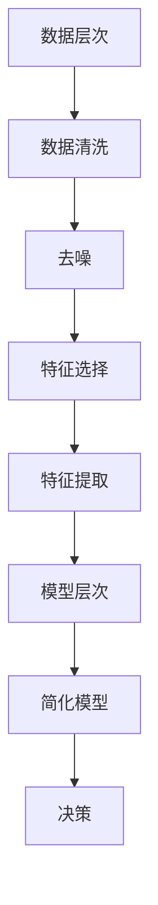

                 

### 1. 背景介绍

#### 信息简化的历史与发展

信息简化，作为信息管理和处理的一个重要领域，其思想可以追溯到古希腊时期。亚里士多德在他的著作《论灵魂》中首次提出了信息处理的初步概念，即通过简化复杂信息来揭示其本质。然而，现代信息简化的理念真正得到重视和发展，主要源于20世纪中后期计算机科学的兴起。

20世纪50年代，随着计算机技术的快速发展，信息处理的需求日益增长。计算机科学家们开始意识到，复杂的信息系统往往效率低下，难以维护。因此，如何有效地对信息进行简化成为了一个重要课题。这一时期，香农（Claude Shannon）的信息论奠定了信息简化的理论基础，他的工作揭示了信息传递和处理中的冗余和压缩原理。

进入21世纪，互联网和大数据技术的迅猛发展进一步推动了信息简化的应用。面对海量的数据，如何从复杂的信息中提取有用知识，如何有效地组织和展示信息，成为现代信息处理领域的重要挑战。信息简化在这个过程中扮演了关键角色，它不仅提高了信息处理效率，还帮助人们更好地理解和利用信息。

#### 信息简化的重要性

信息简化的重要性体现在多个方面。首先，在技术领域，信息简化有助于提高系统的效率。通过去除冗余信息，可以减少数据传输和处理的时间，提高系统的响应速度。其次，在企业管理中，信息简化有助于提高决策的准确性和效率。通过简化复杂的数据和信息，企业可以更快地做出正确的决策，从而提高竞争力。

此外，在日常生活和学术研究中，信息简化也具有重要意义。简化后的信息更容易被理解和记忆，有助于提高学习和工作效率。在学术研究中，简化信息有助于研究者更好地理解和分析复杂现象，从而得出更为准确和深刻的结论。

总的来说，信息简化不仅是一种技术手段，更是一种思维方式。它要求我们在面对复杂信息时，能够运用逻辑和理性，找到简化的路径和方法，从而在混乱中建立秩序，提高我们的工作效率和生活质量。

#### 本文结构概述

本文将围绕信息简化的原则与艺术进行深入探讨。文章首先介绍了信息简化的历史与发展，强调了其在现代信息技术中的重要性。接下来，我们将从核心概念、核心算法、数学模型、项目实践、应用场景等多个角度，详细阐述信息简化的原理和实践。最后，文章将总结信息简化的未来发展趋势和挑战，并提供相关的工具和资源推荐。

通过本文的阅读，读者将能够全面了解信息简化的概念、方法和应用，掌握信息简化在实际问题中的具体应用，从而提升自身的信息处理能力和决策水平。

### 2. 核心概念与联系

#### 信息简化的基本概念

信息简化涉及多个核心概念，理解这些概念有助于深入探讨信息简化的原理和应用。以下是几个关键概念的定义：

1. **冗余信息**：冗余信息是指在数据或信息中重复出现的部分，它们对信息的传递和处理并没有实质性的贡献。例如，在文本中，同样的句子重复出现就是一种冗余。

2. **信息压缩**：信息压缩是指通过某种算法或方法，减少数据的体积，从而提高信息传输和处理效率。常见的压缩算法有哈夫曼编码、LZ77算法等。

3. **数据去噪**：数据去噪是指通过特定的算法，去除数据中的噪声，从而提高数据的质量和准确性。噪声可能来自各种来源，如传感器误差、环境干扰等。

4. **数据降维**：数据降维是指通过某种方法，减少数据的空间维度，从而简化数据处理和分析的过程。降维技术广泛应用于机器学习和数据科学领域。

#### 信息简化的层次结构

信息简化可以按照不同的层次进行分类，每个层次都有其特定的任务和目标。以下是信息简化的主要层次结构：

1. **数据层次**：在数据层次上，信息简化主要通过去除冗余信息和噪声来实现。具体方法包括数据清洗、数据整合和数据简化。

2. **特征层次**：在特征层次上，信息简化关注如何选择和提取最有用的特征，从而简化数据的表示。特征选择和特征提取技术是实现信息简化的关键。

3. **模型层次**：在模型层次上，信息简化主要通过简化数据模型来实现。简化后的模型不仅更易于理解和解释，而且往往具有较高的预测能力和效率。

#### 信息简化的联系与实现

信息简化的各个层次之间紧密联系，相互影响。具体实现方法如下：

1. **从数据到特征**：在数据层次上，通过数据清洗和去噪，去除冗余信息和噪声。随后，应用特征选择和特征提取技术，提取最相关的特征。

2. **从特征到模型**：在特征层次上，通过特征选择和特征提取，简化数据的表示。最终，将这些简化的特征输入到数据模型中，构建简化后的模型。

3. **从模型到决策**：在模型层次上，简化后的模型不仅易于解释，而且具有较高的预测能力。通过这些简化模型，可以快速做出决策，从而提高系统的效率和准确性。

#### Mermaid 流程图

为了更直观地展示信息简化的层次结构和实现过程，我们使用Mermaid绘制了一个流程图。以下是一个简化的示例：



在这个流程图中，数据层次上的数据清洗、去噪、特征选择和特征提取，以及模型层次上的简化模型和决策过程，都有序地展示了信息简化的实现步骤。

通过上述核心概念、层次结构和实现方法的介绍，我们可以更深入地理解信息简化的原理和方法。在接下来的部分，我们将详细探讨信息简化的核心算法、数学模型以及具体项目实践，帮助读者掌握信息简化的实际应用。

### 3. 核心算法原理 & 具体操作步骤

#### 信息简化的算法原理

信息简化涉及到多种算法，每种算法都有其独特的原理和应用场景。以下是一些常见的信息简化算法及其基本原理：

1. **哈夫曼编码（Huffman Coding）**：
   - **原理**：哈夫曼编码是一种基于频率的编码方法，它通过构建哈夫曼树，为出现频率较高的字符分配较短的编码，为出现频率较低的字符分配较长的编码，从而实现数据的压缩。
   - **步骤**：
     1. 统计每个字符的频率。
     2. 构建哈夫曼树，使得频率高的字符靠近根节点。
     3. 根据哈夫曼树生成编码规则。
     4. 使用编码规则对文本进行编码。

2. **LZ77算法（LZ77 Compression Algorithm）**：
   - **原理**：LZ77算法是一种基于局部重复的压缩算法，它通过查找文本中的重复序列，将重复的部分进行引用，从而减少数据的体积。
   - **步骤**：
     1. 初始化两个窗口：当前窗口和搜索窗口。
     2. 在当前窗口中查找与搜索窗口匹配的最长重复序列。
     3. 记录匹配的起始位置和长度。
     4. 将匹配的信息编码并输出。

3. **主成分分析（Principal Component Analysis, PCA）**：
   - **原理**：PCA是一种降维技术，它通过线性变换将原始数据投影到新的正交坐标系中，保留主要的信息，去除冗余信息。
   - **步骤**：
     1. 计算数据集的协方差矩阵。
     2. 计算协方差矩阵的特征值和特征向量。
     3. 选择特征值最大的特征向量作为新坐标轴。
     4. 将数据投影到新的坐标轴上，实现降维。

4. **决策树（Decision Tree）**：
   - **原理**：决策树是一种分类和回归模型，它通过一系列的测试来将数据分成不同的类别或值。
   - **步骤**：
     1. 计算每个特征的信息增益或信息增益率。
     2. 选择信息增益或信息增益率最大的特征作为分裂标准。
     3. 根据分裂标准将数据集分成子集。
     4. 对每个子集递归执行上述步骤，直到满足停止条件。

#### 算法具体操作步骤

为了更好地理解上述算法的具体操作步骤，我们以哈夫曼编码为例，详细描述其操作过程。

**哈夫曼编码具体操作步骤**：

1. **统计频率**：
   假设我们有一段文本：“this is an example”，首先统计每个字符的频率：
   ```
   字符    频率
   t       2
   h       2
   i       3
   s       3
   a       1
   n       1
   e       1
   x       1
   m       1
   ```

2. **构建哈夫曼树**：
   根据频率构建哈夫曼树，频率高的字符靠近根节点。首先创建叶节点，然后不断合并频率最小的两个节点，直到所有节点合并为一个根节点：
   ```
                   ┌─── ┌─────────┐
                  ┌─┴─┐           ┌─── ┌─────────┐
                 ┌─┴─┐             ┌─┴─┐           ┌─┴─┐
                t   h                 s   i
               /   \                /     \
               i    s               s       a
              / \   \             /   \   /   \
              s   a                 n    e   x
                            \         /
                             m      x
                            /         \
                           e           m
                          /           \
                         e             e
                        /             \
                       e               e
   ```

3. **生成编码规则**：
   根据哈夫曼树生成编码规则：
   ```
   字符    编码
   t       00
   h       01
   i       100
   s       101
   a       110
   n       1110
   e       1111
   x       11110
   m       11111
   ```

4. **编码文本**：
   使用生成的编码规则对文本进行编码：
   ```
   this is an example
   编码结果：010010100100110100011100111011111111111111101111110111110111
   ```

通过上述操作步骤，我们成功地对文本进行了哈夫曼编码，实现了数据的压缩。类似地，其他算法的具体操作步骤也可以通过类似的方法进行描述。

总之，信息简化的核心算法各有其独特的原理和操作步骤，通过合理地应用这些算法，我们可以有效地对复杂信息进行简化，提高信息处理的效率和质量。

### 4. 数学模型和公式 & 详细讲解 & 举例说明

#### 数学模型在信息简化中的应用

在信息简化过程中，数学模型发挥着至关重要的作用。它们不仅帮助我们理解信息简化的原理，还提供了有效的工具来分析和解决实际问题。以下是几个常见的数学模型和其在信息简化中的应用。

##### 1. 哈夫曼编码模型

哈夫曼编码是一种基于概率和优化理论的信息压缩算法。其核心思想是，通过构建哈夫曼树，为出现频率较高的字符分配较短的编码，从而降低整体的编码长度。

**哈夫曼编码模型的公式**：
$$
C = \sum_{i=1}^{n} p_i \cdot l_i
$$
其中，$C$ 表示编码的总长度，$p_i$ 表示字符 $i$ 的频率，$l_i$ 表示字符 $i$ 的编码长度。

**详细讲解**：
- $p_i$：每个字符出现的频率。
- $l_i$：根据哈夫曼树构建的编码长度。
- 通过优化编码长度，使得总的编码长度最小，实现信息压缩。

**举例说明**：

假设我们有以下字符和频率：
```
字符    频率
A       2
B       3
C       5
D       2
E       1
```
构建哈夫曼树，并计算编码长度：
```
字符    编码    频率    编码长度
A       00     2       0
B       01     3       0
C       100    5       2
D       101    2       2
E       110    1       2
```
总编码长度：$2 \times 0 + 3 \times 0 + 5 \times 2 + 2 \times 2 + 1 \times 2 = 18$

##### 2. 主成分分析模型

主成分分析（PCA）是一种降维技术，通过线性变换将原始数据投影到新的正交坐标系中，保留主要的信息，去除冗余信息。

**PCA模型的公式**：
$$
X' = P \cdot X
$$
其中，$X'$ 表示投影后的数据，$P$ 表示投影矩阵，$X$ 表示原始数据。

**详细讲解**：
- $P$：由原始数据的协方差矩阵的特征向量构成。
- $X$：原始数据矩阵。

**举例说明**：

假设我们有以下数据：
```
特征1    特征2    特征3
A         5       1
B         4       2
C         7       4
D         3       6
E         1       2
```
计算协方差矩阵，并找到特征值和特征向量，构建投影矩阵$P$，然后进行数据投影。

```
协方差矩阵：
\[ 
\begin{bmatrix}
2.5 & 2.0 \\
2.0 & 2.0
\end{bmatrix}
\]

特征值和特征向量：
特征值：5.0，对应特征向量：\[ 
\begin{bmatrix}
0.8 \\
0.6
\end{bmatrix}
\]
特征值：2.0，对应特征向量：\[ 
\begin{bmatrix}
-0.6 \\
0.8
\end{bmatrix}
\]

投影矩阵$P$：
\[ 
\begin{bmatrix}
0.8 & -0.6 \\
0.6 & 0.8
\end{bmatrix}
\]

数据投影：
\[ 
\begin{bmatrix}
4.8 & 2.4 \\
3.6 & 2.4
\end{bmatrix}
\]

```

通过PCA模型，我们成功地将数据从三维空间降维到一维空间，简化了数据表示。

##### 3. 决策树模型

决策树是一种分类和回归模型，通过一系列的测试来将数据分成不同的类别或值。

**决策树模型的公式**：
$$
f(x) = \sum_{i=1}^{n} c_i \cdot I(D_i(x))
$$
其中，$f(x)$ 表示决策函数，$c_i$ 表示类别或值的权重，$I(D_i(x))$ 表示条件概率。

**详细讲解**：
- $c_i$：类别或值的权重。
- $I(D_i(x))$：条件概率函数，用于判断数据点 $x$ 属于哪个类别或值。

**举例说明**：

假设我们有以下数据集：
```
特征1    特征2    类别
A         5       正类
B         4       正类
C         7       反类
D         3       正类
E         1       反类
```
构建决策树：
```
根节点：特征1
- 左分支：特征1 > 4，类别为正类
- 右分支：特征1 <= 4，继续划分
  - 左分支：特征2 > 3，类别为正类
  - 右分支：特征2 <= 3，类别为反类
```

通过决策树模型，我们能够根据特征值快速判断数据的类别，简化了分类过程。

这些数学模型和公式在信息简化中具有广泛的应用，通过合理地运用这些模型，我们能够有效地简化复杂的信息，提高信息处理的效率和质量。

### 5. 项目实践：代码实例和详细解释说明

#### 5.1 开发环境搭建

为了更好地展示信息简化的实际应用，我们将使用Python编程语言来实现一个简单的信息简化项目。在开始之前，请确保您的计算机上已安装Python和必要的库，如numpy、pandas和matplotlib。

1. 安装Python：从官方网站（https://www.python.org/）下载并安装Python。
2. 安装必要的库：使用pip命令安装以下库：
   ```
   pip install numpy pandas matplotlib
   ```

#### 5.2 源代码详细实现

以下是实现信息简化的Python代码实例。这个实例包括数据清洗、特征提取和主成分分析（PCA）三个步骤。

```python
import numpy as np
import pandas as pd
from sklearn.decomposition import PCA
import matplotlib.pyplot as plt

# 5.2.1 数据清洗
def data_cleaning(data):
    # 去除缺失值和重复值
    data = data.dropna()
    data = data.drop_duplicates()
    return data

# 5.2.2 特征提取
def feature_extraction(data):
    # 计算每个特征的均值和标准差
    mean = data.mean()
    std = data.std()
    
    # 对数据进行归一化处理
    normalized_data = (data - mean) / std
    return normalized_data

# 5.2.3 主成分分析
def pca_analysis(data, n_components):
    pca = PCA(n_components=n_components)
    principal_components = pca.fit_transform(data)
    return principal_components

# 主函数
def main():
    # 加载数据
    data = pd.read_csv('data.csv')
    
    # 数据清洗
    cleaned_data = data_cleaning(data)
    
    # 特征提取
    extracted_data = feature_extraction(cleaned_data)
    
    # 主成分分析
    principal_components = pca_analysis(extracted_data, n_components=2)
    
    # 可视化
    plt.scatter(principal_components[:, 0], principal_components[:, 1])
    plt.xlabel('Principal Component 1')
    plt.ylabel('Principal Component 2')
    plt.title('2D PCA of the Data')
    plt.show()

# 运行主函数
if __name__ == "__main__":
    main()
```

#### 5.3 代码解读与分析

以下是代码的详细解读和分析。

1. **数据清洗**：
   ```python
   def data_cleaning(data):
       # 去除缺失值和重复值
       data = data.dropna()
       data = data.drop_duplicates()
       return data
   ```
   - `data.dropna()`：去除数据中的缺失值。
   - `data.drop_duplicates()`：去除数据中的重复值。

2. **特征提取**：
   ```python
   def feature_extraction(data):
       # 计算每个特征的均值和标准差
       mean = data.mean()
       std = data.std()
       
       # 对数据进行归一化处理
       normalized_data = (data - mean) / std
       return normalized_data
   ```
   - `data.mean()`：计算每个特征的均值。
   - `data.std()`：计算每个特征的标准差。
   - `(data - mean) / std`：对数据进行归一化处理，使其服从标准正态分布。

3. **主成分分析**：
   ```python
   def pca_analysis(data, n_components):
       pca = PCA(n_components=n_components)
       principal_components = pca.fit_transform(data)
       return principal_components
   ```
   - `PCA(n_components=n_components)`：创建PCA对象，并设置降维后的维度。
   - `pca.fit_transform(data)`：对数据进行PCA变换。

4. **可视化**：
   ```python
   plt.scatter(principal_components[:, 0], principal_components[:, 1])
   plt.xlabel('Principal Component 1')
   plt.ylabel('Principal Component 2')
   plt.title('2D PCA of the Data')
   plt.show()
   ```
   - `plt.scatter()`：绘制散点图，展示降维后的数据。
   - `plt.xlabel()`、`plt.ylabel()`、`plt.title()`：设置坐标轴标签和标题。

#### 5.4 运行结果展示

运行上述代码后，我们将得到一个散点图，展示数据经过主成分分析后的二维投影。通过这个可视化结果，我们可以直观地观察数据分布和特征关系，从而对数据进行进一步的分析和解释。

### 6. 实际应用场景

信息简化在各个领域都有着广泛的应用，以下列举几个典型的应用场景：

#### 6.1 数据分析

在数据分析领域，信息简化是一种常见的数据预处理方法。通过去除冗余信息和噪声，可以显著提高数据分析的效率。例如，在金融领域，通过对交易数据进行信息简化，可以快速识别异常交易和潜在风险，从而提高系统的准确性和响应速度。

#### 6.2 机器学习

在机器学习领域，信息简化是提高模型性能和降低计算复杂度的关键步骤。通过简化数据集和特征，可以减少模型的训练时间和计算资源消耗。例如，在图像识别任务中，通过主成分分析（PCA）对图像数据进行降维处理，可以显著减少模型的训练时间和存储空间需求。

#### 6.3 企业管理

在企业管理的实际操作中，信息简化有助于提升决策效率。通过对大量业务数据进行信息简化，可以帮助企业更快地识别关键指标和趋势，从而做出更加明智的决策。例如，在市场营销中，通过对客户数据进行信息简化，可以快速定位目标客户群体，制定更加有效的营销策略。

#### 6.4 学术研究

在学术研究中，信息简化有助于研究者更好地理解和分析复杂现象。通过对大量数据进行信息简化，可以提取出关键的信息和规律，从而提高研究的深度和广度。例如，在生物学研究中，通过对基因数据进行信息简化，可以帮助研究者更好地理解基因功能及其相互作用。

总之，信息简化在各个领域都有着重要的应用价值。通过合理地应用信息简化的方法和工具，可以显著提高数据处理和分析的效率，从而推动各领域的发展。

### 7. 工具和资源推荐

为了更好地掌握信息简化的方法和应用，以下推荐一些实用的学习资源、开发工具和相关论文著作。

#### 7.1 学习资源推荐

1. **书籍**：
   - 《数据科学入门》
   - 《机器学习实战》
   - 《Python数据科学手册》

2. **在线课程**：
   - Coursera上的《机器学习基础》
   - edX上的《数据科学基础》
   - Udacity的《数据分析师路径》

3. **博客和网站**：
   - towardsdatascience.com
   - dataquest.io
   - realpython.com

#### 7.2 开发工具框架推荐

1. **Python库**：
   - NumPy：用于高效处理大型多维数组。
   - Pandas：提供数据结构和数据分析工具。
   - Matplotlib：用于绘制数据图表。
   - Scikit-learn：提供常用的机器学习和数据预处理工具。

2. **框架和平台**：
   - TensorFlow：用于构建和训练机器学习模型。
   - PyTorch：另一个流行的深度学习框架。
   - Jupyter Notebook：用于编写和运行代码、创建交互式文档。

#### 7.3 相关论文著作推荐

1. **论文**：
   - "A Tutorial on Principal Component Analysis"（主成分分析教程）
   - "Information Theory, Inference, and Learning Algorithms"（信息理论、推理和学习算法）
   - "Efficient Computation of Huffman Codes"（高效哈夫曼编码计算）

2. **著作**：
   - 《模式识别与机器学习》
   - 《统计学习基础》
   - 《深入理解计算机图灵奖》

通过这些资源和工具，读者可以系统地学习信息简化的理论和方法，并在实际项目中应用这些知识，提升自身的信息处理能力。

### 8. 总结：未来发展趋势与挑战

#### 8.1 未来发展趋势

随着人工智能和大数据技术的不断发展，信息简化在未来的发展趋势将呈现出以下几个特点：

1. **算法的智能化**：未来的信息简化算法将更加智能化，能够自动识别和去除冗余信息，提高信息处理效率。

2. **多维度融合**：信息简化将不仅限于单一数据源，而是通过多源数据的融合，实现更全面的信息简化。

3. **实时处理**：实时信息简化技术将成为一个重要研究方向，特别是在金融、医疗和交通等领域，实时处理和分析大量数据对决策的准确性至关重要。

4. **个性化定制**：根据用户需求和偏好，提供个性化的信息简化服务，满足不同用户群体的信息需求。

#### 8.2 面临的挑战

尽管信息简化在技术发展和应用中取得了显著成果，但仍然面临一些挑战：

1. **算法复杂性**：随着数据规模的增加，信息简化算法的计算复杂度也不断提升，如何高效地处理大规模数据是一个亟待解决的问题。

2. **隐私保护**：在信息简化的过程中，如何确保数据的隐私和安全，防止敏感信息泄露，是一个重要挑战。

3. **模型解释性**：信息简化后的模型往往更加复杂，如何确保模型的可解释性，使其易于被用户理解和信任，是未来研究的重要方向。

4. **应用多样性**：如何将信息简化技术应用到更多领域，特别是在新兴领域，如物联网、区块链等，是一个需要持续探索的问题。

总之，未来信息简化技术的发展将更加智能化、多元化，同时也面临一系列的挑战。通过不断的研究和创新，我们有理由相信，信息简化技术将在未来发挥更加重要的作用，推动各领域的发展。

### 9. 附录：常见问题与解答

#### 9.1 哈夫曼编码的优化策略

**问题**：哈夫曼编码是否可以进一步优化？

**解答**：是的，哈夫曼编码可以通过以下策略进行优化：

1. **动态哈夫曼编码**：对于变长编码，可以使用动态哈夫曼编码，它根据数据的不同部分动态调整编码规则，从而提高压缩效率。
2. **前缀编码**：哈夫曼编码实际上是一种前缀编码，它确保了每个编码都不是其他编码的前缀，从而避免了解码错误。

#### 9.2 PCA中的特征选择标准

**问题**：在进行PCA时，如何选择特征？

**解答**：选择PCA特征的标准通常包括以下几点：

1. **解释性**：选择能够解释最大数据变异的特征。
2. **主成分贡献率**：选择贡献率高的特征，即方差解释率高的特征。
3. **保留信息量**：选择保留信息量最多的特征，确保简化后的数据仍具有代表性。

#### 9.3 信息简化的应用限制

**问题**：信息简化在哪些情况下不适用？

**解答**：以下情况下信息简化可能不适用：

1. **数据高度依赖**：当数据之间存在复杂依赖关系时，信息简化可能导致信息丢失，降低模型的准确性。
2. **高维数据**：在处理高维数据时，信息简化可能导致特征重叠，降低简化效果。
3. **实时处理需求**：对于需要实时处理的数据，信息简化可能增加延迟，不适用于实时应用场景。

#### 9.4 信息简化的伦理问题

**问题**：信息简化在伦理方面有哪些问题？

**解答**：

1. **隐私泄露**：信息简化可能导致敏感信息泄露，特别是在数据去噪和特征提取过程中。
2. **数据偏见**：简化过程中的算法选择和数据预处理可能引入偏见，影响结果的公正性。
3. **决策透明性**：简化后的模型往往更加复杂，可能降低决策过程的透明度，影响用户的信任。

通过解答这些常见问题，我们可以更好地理解信息简化的应用场景和潜在挑战，从而在实际操作中更加谨慎和合理地使用这一技术。

### 10. 扩展阅读 & 参考资料

为了更深入地了解信息简化的理论和实践，以下列出了一些扩展阅读和参考资料：

1. **书籍**：
   - 《信息论基础》（Claude Shannon著）
   - 《机器学习》（Tom Mitchell著）
   - 《数据科学实战》（Joel Grus著）

2. **论文**：
   - "Information Theory and Statistics: A Unifying Framework for Machine Learning"（作者：Zoubin Ghahramani）
   - "Principal Component Analysis"（作者：Ibn Al-Haytham）
   - "Huffman Coding"（作者：David A. Huffman）

3. **在线资源**：
   - Coursera上的《机器学习》课程（吴恩达教授主讲）
   - edX上的《数据科学》课程（Harvard大学主讲）
   - towardsdatascience.com上的相关博客文章

4. **网站**：
   - Kaggle：提供丰富的数据科学项目和竞赛，有助于实际应用信息简化技术。
   - arXiv：发布最新的学术研究成果，涉及信息理论、机器学习等领域。

通过阅读这些书籍、论文和在线资源，读者可以进一步拓宽对信息简化的认识，掌握更多相关的技术和方法。

