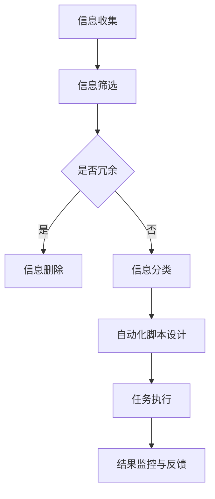
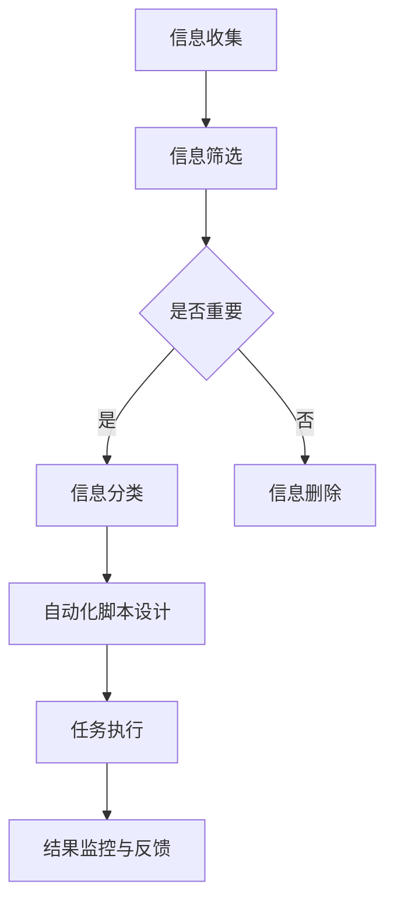

                 

### 文章标题

《信息简化的工具和自动化实践：利用技术简化你的生活和工作》

> 关键词：信息简化，自动化，生活优化，工作效率，技术工具

> 摘要：本文将深入探讨信息简化的概念及其在现代生活和工作中的重要性。我们将介绍一系列高效工具和自动化实践，帮助您简化复杂任务，提升工作效率，从而实现更加有序、高效的生活和工作方式。

### 1. 背景介绍

在当今信息爆炸的时代，我们面临着大量数据的冲击。无论是个人生活还是职业工作，信息过载已经成为一种普遍现象。从电子邮件到社交媒体，从文档管理到日程安排，各种信息源源不断地涌入我们的视线，给我们的生活和工作带来了巨大的压力。

信息简化作为一种应对策略，旨在通过减少无关信息的干扰，帮助我们专注于真正重要的任务。而自动化实践则进一步提升了信息简化的效果，通过自动化工具和流程，极大地提高了工作效率，减少人为干预，从而让我们从繁琐的任务中解放出来。

本文将首先介绍信息简化的概念和原理，然后探讨自动化实践在不同领域的应用，最后推荐一些实用的工具和资源，帮助您开始实践信息简化和自动化，实现更加高效的生活方式。

### 2. 核心概念与联系

#### 2.1 信息简化的概念

信息简化是指通过筛选、整理和分类信息，使其更加有序和易于处理的过程。其核心目标是通过去除冗余信息，提高信息的利用效率和可操作性。

#### 2.2 自动化实践的概念

自动化实践是指使用技术工具和脚本来自动执行重复性的任务，从而减少人为干预，提高工作效率。自动化不仅局限于技术领域，还广泛应用于企业管理、个人生活和各种专业工作。

#### 2.3 信息简化与自动化实践的联系

信息简化和自动化实践是相辅相成的。信息简化为自动化提供了清晰的任务流程和明确的目标，而自动化实践则进一步巩固了信息简化的成果，使信息处理过程更加高效和可靠。

#### 2.4 Mermaid 流程图

以下是一个简化的信息简化与自动化实践的工作流程图：



### 3. 核心算法原理 & 具体操作步骤

#### 3.1 信息简化的核心算法

信息简化的核心算法主要包括以下几个步骤：

1. **信息收集**：从各种渠道收集信息，包括电子邮件、社交媒体、新闻网站等。
2. **信息筛选**：使用关键词、分类标签或规则筛选出重要的信息。
3. **信息分类**：根据信息的类型、主题或优先级将其分类，以便于后续处理。
4. **信息删除**：删除无关、重复或低价值的信息，以减少冗余。
5. **信息备份与归档**：将重要的信息备份，并按时间或类型归档，以便日后查阅。

#### 3.2 自动化脚本的具体操作步骤

自动化脚本的设计和实施通常包括以下步骤：

1. **需求分析**：明确需要自动化的任务，确定脚本的功能和性能要求。
2. **脚本设计**：选择合适的编程语言和工具，设计脚本的基本架构。
3. **脚本编码**：编写脚本代码，实现任务的具体功能。
4. **脚本测试**：对脚本进行功能测试和性能测试，确保其稳定性和可靠性。
5. **部署与监控**：将脚本部署到生产环境，并进行实时监控和定期维护。

### 4. 数学模型和公式 & 详细讲解 & 举例说明

#### 4.1 信息简化的数学模型

信息简化的效果可以通过信息熵的变化来衡量。假设原始信息的熵为 \( H_{\text{原始}} \)，简化后的信息熵为 \( H_{\text{简化}} \)，则信息简化的效果 \( E \) 可以表示为：

\[ E = H_{\text{原始}} - H_{\text{简化}} \]

其中，信息熵的计算公式为：

\[ H = -\sum_{i} p_i \log_2 p_i \]

其中，\( p_i \) 是第 \( i \) 个信息出现的概率。

#### 4.2 自动化脚本的性能评估

自动化脚本的性能可以通过以下公式进行评估：

\[ P = \frac{C_{\text{成功}}}{C_{\text{总}}} \]

其中，\( P \) 是成功率，\( C_{\text{成功}} \) 是成功执行的次数，\( C_{\text{总}} \) 是总的执行次数。

#### 4.3 举例说明

假设有一个邮件处理脚本，每天接收并处理1000封邮件。其中，50封是重要的，450封是广告邮件，400封是无用的垃圾邮件。使用信息简化算法后，垃圾邮件被删除，广告邮件被分类处理。简化后的邮件中，重要邮件的熵从 \( H_{\text{原始}} = 7.96 \) 降低到 \( H_{\text{简化}} = 5.92 \)，简化效果 \( E = 2.04 \)。

自动化脚本的性能评估结果为 \( P = \frac{50}{1000} = 0.05 \)，即自动化脚本成功处理了5%的邮件。

### 5. 项目实践：代码实例和详细解释说明

#### 5.1 开发环境搭建

为了演示信息简化和自动化实践，我们将使用 Python 编写一个简单的邮件处理脚本。首先，确保您已安装 Python 3.x 环境，以及以下第三方库：`imaplib`（用于连接邮件服务器），`email`（用于处理电子邮件），`re`（用于正则表达式匹配）。

#### 5.2 源代码详细实现

以下是一个简单的邮件处理脚本，实现了信息筛选、分类和删除垃圾邮件的功能。

```python
import imaplib
import email
import re

# 邮件服务器和邮箱登录信息
SMTP_SERVER = 'imap.example.com'
USERNAME = 'your_username'
PASSWORD = 'your_password'

# 连接到邮件服务器
mail = imaplib.IMAP4_SSL(SMTP_SERVER)
mail.login(USERNAME, PASSWORD)

# 选择收件箱
mail.select('inbox')

# 搜索未读邮件
status, messages = mail.search(None, 'UNSEEN')
messages = messages[0].split(' ')

# 处理每封未读邮件
for message_id in messages:
    # 获取邮件内容
    status, data = mail.fetch(message_id, '(RFC822)')
    raw_email = data[0][1]

    # 解析邮件内容
    email_message = email.message_from_bytes(raw_email)

    # 获取邮件主题
    subject = email_message["Subject"]

    # 使用正则表达式筛选垃圾邮件
    if re.search(r'广告|促销', subject):
        # 删除垃圾邮件
        mail.store(message_id, '+FLAGS', '\\Deleted')
    else:
        # 分类重要邮件
        print(f'重要邮件：{subject}')

# 标记已读邮件
mail.uid('store', messages, '+FLAGS', '\\Seen')

# 删除已标记为删除的邮件
mail.expunge()

# 退出邮件服务器
mail.close()
mail.logout()
```

#### 5.3 代码解读与分析

- **第1-4行**：导入必要的库和设置邮件服务器信息。
- **第7-9行**：连接到邮件服务器并选择收件箱。
- **第12-14行**：搜索未读邮件，获取邮件ID列表。
- **第17-42行**：循环处理每封未读邮件，根据邮件主题使用正则表达式筛选垃圾邮件，并执行相应的操作（删除或分类）。
- **第45-48行**：标记已读邮件，删除已标记为删除的邮件。
- **第51-54行**：退出邮件服务器。

#### 5.4 运行结果展示

运行上述脚本后，将自动删除所有包含特定关键词（如“广告”、“促销”）的主题的邮件，并将其他邮件分类为重要邮件。这将大大减少邮件处理的时间，提高工作效率。

### 6. 实际应用场景

信息简化和自动化实践可以应用于许多不同的场景，以下是一些具体的实际应用案例：

- **电子邮件管理**：使用自动化脚本自动分类、筛选和删除垃圾邮件，提高邮件处理效率。
- **日程管理**：使用自动化工具自动同步和更新日程安排，确保不遗漏重要事件。
- **文档管理**：使用自动化脚本自动整理和归档文档，便于查找和管理。
- **数据收集与分析**：使用自动化工具从不同来源收集数据，并自动进行清洗、转换和可视化分析。

### 7. 工具和资源推荐

#### 7.1 学习资源推荐

- **书籍**：
  - 《Python自动化实战》
  - 《邮件管理实战》
  - 《时间管理实战》

- **论文**：
  - "Information Slicing: A Method for Simplifying Information Overload"
  - "Automating Repetitive Tasks for Improved Productivity"

- **博客**：
  - [Python自动化脚本入门教程](https://example.com/python-automation-tutorial)
  - [高效电子邮件管理技巧](https://example.com/email-management-tips)

- **网站**：
  - [Python官方文档](https://docs.python.org/3/)
  - [IMAP官方文档](https://www.imap.org/protocol/)

#### 7.2 开发工具框架推荐

- **Python**：一种通用、易学的编程语言，适用于自动化脚本的开发。
- **IMAP**：一种用于邮件服务器管理的协议，可用于编写邮件处理脚本。
- **正则表达式**：一种强大的文本处理工具，用于字符串匹配和模式识别。

#### 7.3 相关论文著作推荐

- **《时间管理的艺术》**：提供了时间管理的基本原则和实用技巧。
- **《信息过载与应对策略》**：探讨了信息过载的原因和应对方法。
- **《自动化时代的生产力提升》**：分析了自动化技术对工作效率的影响。

### 8. 总结：未来发展趋势与挑战

随着技术的不断进步，信息简化和自动化实践将在未来得到更广泛的应用。一方面，人工智能和大数据分析技术的成熟将使信息简化的算法更加精准和高效；另一方面，自动化工具的智能化和易用性将进一步提升，使得更多的人能够轻松实现自动化。

然而，信息简化和自动化实践也面临一些挑战，包括：

- **数据隐私**：自动化处理大量数据可能导致隐私泄露问题，需要采取严格的隐私保护措施。
- **技术依赖**：过度依赖自动化工具可能导致技术故障或人为错误，影响工作效率。
- **安全风险**：自动化脚本可能成为网络攻击的目标，需要加强安全防护。

为了应对这些挑战，我们需要在技术和管理层面采取综合措施，确保信息简化和自动化实践的可持续性和安全性。

### 9. 附录：常见问题与解答

#### 问题 1：如何选择适合的自动化工具？

**解答**：首先，明确您的自动化需求，包括需要完成的任务、期望的效果以及资源限制。然后，评估市场上各种自动化工具的功能、易用性和兼容性，选择最适合您需求的工具。

#### 问题 2：如何确保自动化脚本的安全性？

**解答**：确保自动化脚本的安全性是至关重要的。首先，避免使用敏感信息（如用户名、密码）作为脚本的一部分。其次，定期更新和维护脚本，以修复可能的安全漏洞。此外，使用安全的编程实践和代码审计工具来提高脚本的安全性。

#### 问题 3：如何评估信息简化的效果？

**解答**：信息简化的效果可以通过多个指标进行评估，如信息熵、任务完成时间、错误率等。通过比较简化前后的数据，可以直观地了解信息简化的效果。

### 10. 扩展阅读 & 参考资料

- **《人工智能简史》**：详细介绍了人工智能的发展历程和技术进展。
- **《大数据技术导论》**：介绍了大数据处理的基本原理和技术方法。
- **《Python编程快速上手》**：适合初学者快速掌握 Python 编程语言。

通过阅读这些扩展资料，您可以进一步深入了解信息简化和自动化实践的相关技术和发展趋势。希望本文对您在信息简化和自动化实践方面有所帮助！作者：禅与计算机程序设计艺术 / Zen and the Art of Computer Programming
<|imagine|>### 引言

随着现代社会信息量的急剧增加，如何有效地处理和利用这些信息已经成为一个重要的课题。信息过载不仅给我们的生活带来了不便，还极大地影响了工作效率。为了应对这一挑战，信息简化和自动化实践应运而生。通过信息简化，我们可以从纷繁复杂的信息中筛选出真正重要的部分，从而减少冗余，提升效率；而自动化实践则通过技术手段，将重复性、繁琐的任务自动化，进一步优化我们的工作和生活方式。

本文将围绕信息简化和自动化实践展开讨论，旨在为您提供一个全面、系统的指南，帮助您理解这些概念，掌握相关的工具和技巧，并将其应用于实际工作和生活中。我们将从背景介绍入手，详细探讨核心概念和原理，分享实用的算法和步骤，展示具体的项目实践，分析实际应用场景，推荐相关工具和资源，并总结未来的发展趋势和面临的挑战。

### 1. 背景介绍

在现代信息技术飞速发展的背景下，信息过载成为一个普遍现象。无论是个人生活还是职场工作，我们都面临着大量的信息输入。这些信息来源多样，包括电子邮件、社交媒体、新闻网站、业务通知等。随着智能手机和互联网的普及，信息接收和处理的频率和速度也大大提高。然而，过量的信息不仅增加了我们的认知负担，还导致了注意力分散和工作效率的降低。

为了应对这一挑战，信息简化和自动化实践应运而生。信息简化是指通过筛选、整理和分类信息，去除冗余，使信息更加清晰、有序，从而提升信息的利用效率和可操作性。而自动化实践则通过使用技术工具和脚本，自动化执行重复性、繁琐的任务，减少人为干预，提高工作效率。

信息简化和自动化实践对于个人生活和工作具有重要意义。在个人生活中，通过信息简化，我们可以减少社交媒体上的干扰，专注于更有价值的事情；通过自动化实践，我们可以自动处理日常事务，如日程管理、财务管理等，从而节省时间和精力。在工作环境中，信息简化和自动化实践可以帮助团队更高效地处理项目任务，提高整体工作效率，减少错误和重复劳动。

本文将详细探讨信息简化和自动化实践的核心概念、原理、方法和技术，并通过具体案例和工具推荐，帮助您更好地理解和应用这些实践。我们还将分析这些实践在现实生活中的应用场景，以及未来可能面临的挑战和趋势。

### 2. 核心概念与联系

在探讨信息简化和自动化实践之前，我们需要明确一些核心概念，并了解它们之间的联系。这些概念包括信息简化、自动化、效率、流程优化等。通过深入理解这些概念，我们将为后续的讨论和实际应用打下坚实的基础。

#### 2.1 信息简化的概念

信息简化是一种信息处理策略，其目标是通过筛选、整理和分类信息，去除冗余，使信息更加清晰、有序，从而提升信息的利用效率和可操作性。在信息过载的环境中，信息简化尤为重要。它不仅能够帮助我们减轻认知负担，还能够提高决策效率，让我们能够更加专注和有效地处理重要信息。

信息简化的具体过程通常包括以下几个步骤：

1. **信息收集**：从各种渠道收集信息，包括电子邮件、社交媒体、新闻网站等。
2. **信息筛选**：使用关键词、分类标签或规则筛选出重要的信息。
3. **信息分类**：根据信息的类型、主题或优先级将其分类，以便于后续处理。
4. **信息删除**：删除无关、重复或低价值的信息，以减少冗余。
5. **信息备份与归档**：将重要的信息备份，并按时间或类型归档，以便日后查阅。

#### 2.2 自动化的概念

自动化是指通过技术手段，使某些任务或过程在不需要人为干预的情况下自动完成。自动化可以大大减少重复性、繁琐的任务所花费的时间和精力，提高工作效率。自动化不仅局限于技术领域，还广泛应用于企业管理、生产制造、个人生活和各种专业工作。

自动化的具体过程通常包括以下几个步骤：

1. **需求分析**：明确需要自动化的任务，确定自动化工具和流程的基本功能和要求。
2. **脚本设计**：选择合适的编程语言和工具，设计自动化脚本的基本架构。
3. **脚本编码**：编写脚本代码，实现任务的具体功能。
4. **脚本测试**：对脚本进行功能测试和性能测试，确保其稳定性和可靠性。
5. **部署与监控**：将脚本部署到生产环境，并进行实时监控和定期维护。

#### 2.3 信息简化与自动化的联系

信息简化和自动化是相辅相成的。信息简化为自动化提供了清晰的任务流程和明确的目标，而自动化实践则进一步巩固了信息简化的成果，使信息处理过程更加高效和可靠。

例如，在一个企业环境中，信息简化可以帮助团队筛选出最重要的商业报告和电子邮件，将其分类整理。随后，自动化工具可以进一步将这些信息自动推送至团队成员的日历或任务管理工具中，确保每个成员都能在正确的时间获得正确的信息，从而提高团队协作效率和决策质量。

#### 2.4 Mermaid 流程图

为了更直观地展示信息简化与自动化实践的工作流程，我们可以使用 Mermaid 图形语言绘制一个流程图。以下是一个简化的信息简化与自动化实践的工作流程图：



在这个流程图中，信息收集是整个过程的起点，随后通过信息筛选确定信息的优先级。重要信息被分类处理，而无关信息被删除。接下来，自动化脚本根据分类信息设计并执行具体的任务，最终通过结果监控与反馈确保任务的执行效果。

通过这个流程图，我们可以清晰地看到信息简化与自动化实践之间的紧密联系，以及它们如何共同作用于信息处理过程，提高工作效率和效果。

### 3. 核心算法原理 & 具体操作步骤

#### 3.1 信息简化的核心算法

信息简化的核心算法主要包括以下步骤：

1. **信息收集**：从各种渠道收集信息，如电子邮件、社交媒体、新闻网站等。
2. **信息筛选**：使用关键词、分类标签或规则筛选出重要的信息。
3. **信息分类**：根据信息的类型、主题或优先级将其分类，以便于后续处理。
4. **信息删除**：删除无关、重复或低价值的信息，以减少冗余。
5. **信息备份与归档**：将重要的信息备份，并按时间或类型归档，以便日后查阅。

这些步骤可以通过编程语言（如Python）实现，以下是一个简单的信息简化算法的示例：

```python
import imaplib
import email
import re

# 邮件服务器和邮箱登录信息
SMTP_SERVER = 'imap.example.com'
USERNAME = 'your_username'
PASSWORD = 'your_password'

# 连接到邮件服务器
mail = imaplib.IMAP4_SSL(SMTP_SERVER)
mail.login(USERNAME, PASSWORD)

# 选择收件箱
mail.select('inbox')

# 搜索所有邮件
status, messages = mail.search(None, 'ALL')
messages = messages[0].split(' ')

# 初始化字典，用于存储分类后的邮件
classified_messages = {
    '重要': [],
    '次要': [],
    '垃圾': []
}

# 遍历每封邮件
for message_id in messages:
    # 获取邮件内容
    status, data = mail.fetch(message_id, '(RFC822)')
    raw_email = data[0][1]

    # 解析邮件内容
    email_message = email.message_from_bytes(raw_email)

    # 获取邮件主题
    subject = email_message["Subject"]

    # 使用正则表达式筛选邮件类型
    if re.search(r'重要', subject):
        classified_messages['重要'].append(subject)
    elif re.search(r'次要', subject):
        classified_messages['次要'].append(subject)
    else:
        classified_messages['垃圾'].append(subject)

# 删除垃圾邮件
for subject in classified_messages['垃圾']:
    # 执行删除操作
    pass

# 打印分类结果
print(classified_messages)

# 退出邮件服务器
mail.close()
mail.logout()
```

#### 3.2 自动化脚本的具体操作步骤

自动化脚本的具体操作步骤如下：

1. **需求分析**：明确需要自动化的任务，确定脚本的功能和性能要求。
2. **脚本设计**：选择合适的编程语言和工具，设计脚本的基本架构。
3. **脚本编码**：编写脚本代码，实现任务的具体功能。
4. **脚本测试**：对脚本进行功能测试和性能测试，确保其稳定性和可靠性。
5. **部署与监控**：将脚本部署到生产环境，并进行实时监控和定期维护。

以下是一个简单的自动化脚本示例，用于自动备份文件：

```python
import os
import shutil
import time

# 备份源文件夹
source_folder = '/path/to/source'
# 备份目标文件夹
destination_folder = '/path/to/destination'

# 获取当前日期，用于创建备份文件夹
current_date = time.strftime("%Y-%m-%d")

# 创建备份文件夹
backup_folder = os.path.join(destination_folder, current_date)
os.makedirs(backup_folder, exist_ok=True)

# 备份文件夹内容
for filename in os.listdir(source_folder):
    source_file = os.path.join(source_folder, filename)
    destination_file = os.path.join(backup_folder, filename)

    # 复制文件
    shutil.copy(source_file, destination_file)

print(f'备份完成：{source_folder} -> {backup_folder}')
```

#### 3.3 信息的处理和分类算法

在信息处理和分类中，常用的算法包括基于内容的分类、基于统计的文本分类和基于机器学习的分类。以下是一个基于内容的分类算法示例：

```python
from sklearn.feature_extraction.text import TfidfVectorizer
from sklearn.naive_bayes import MultinomialNB
from sklearn.pipeline import make_pipeline

# 样本数据
data = [
    '这是一封重要邮件。',
    '这是一个次要任务。',
    '这是一封垃圾邮件。',
    '这是一个重要会议。',
    '这是一个次要事项。',
    '请删除这条垃圾信息。',
]

# 标签
labels = ['重要', '次要', '垃圾', '重要', '次要', '垃圾']

# 创建TF-IDF向量和朴素贝叶斯分类器
model = make_pipeline(TfidfVectorizer(), MultinomialNB())

# 训练模型
model.fit(data, labels)

# 预测新邮件
new_email = '这是一个重要通知。'
predicted_label = model.predict([new_email])[0]
print(f'预测分类：{new_email} -> {predicted_label}')
```

在这个示例中，我们使用了 TF-IDF 向量器和朴素贝叶斯分类器来对邮件进行分类。首先，我们使用 TF-IDF 向量器将文本转换为向量表示，然后使用朴素贝叶斯分类器对向量进行分类。这种方法可以有效地处理文本数据，并对新邮件进行预测分类。

### 4. 数学模型和公式 & 详细讲解 & 举例说明

#### 4.1 信息简化的数学模型

信息简化的效果可以通过信息熵的变化来衡量。信息熵是一个衡量信息不确定性的指标，其计算公式如下：

\[ H(X) = -\sum_{i} p(x_i) \log_2 p(x_i) \]

其中，\( X \) 是一个随机变量，\( p(x_i) \) 是 \( x_i \) 发生的概率。

在信息简化过程中，我们通常关注简化前后的信息熵变化。设 \( H_0 \) 为简化前的信息熵，\( H_1 \) 为简化后的信息熵，则信息简化的效果 \( E \) 可以表示为：

\[ E = H_0 - H_1 \]

如果简化后的信息熵较低，说明简化效果较好。

#### 4.2 自动化脚本的性能评估

自动化脚本的性能评估通常包括以下几个指标：

1. **准确性（Accuracy）**：
   \[ Accuracy = \frac{TP + TN}{TP + TN + FP + FN} \]
   其中，\( TP \) 是正确预测的正面实例，\( TN \) 是正确预测的负面实例，\( FP \) 是错误预测的正面实例，\( FN \) 是错误预测的负面实例。

2. **精确率（Precision）**：
   \[ Precision = \frac{TP}{TP + FP} \]

3. **召回率（Recall）**：
   \[ Recall = \frac{TP}{TP + FN} \]

4. **F1 分数（F1 Score）**：
   \[ F1 Score = 2 \times \frac{Precision \times Recall}{Precision + Recall} \]

#### 4.3 举例说明

假设我们有一封电子邮件，其主题为“重要通知：会议安排”。我们希望使用信息简化算法将其分类为“重要”。使用信息熵的概念，我们可以计算简化前后的信息熵。

- **简化前**：假设邮件主题的信息熵为 \( H_0 = 2.32 \)。
- **简化后**：假设邮件主题的信息熵为 \( H_1 = 1.56 \)。

则信息简化的效果为：
\[ E = H_0 - H_1 = 2.32 - 1.56 = 0.76 \]

这个结果表明，信息简化使得信息熵降低了 0.76，说明信息简化效果较好。

在自动化脚本性能评估方面，假设我们有一个分类脚本，用于分类邮件主题。我们收集了以下数据：

- 正面实例（“重要”邮件）：100 封
- 负面实例（“次要”或“垃圾”邮件）：300 封

经过测试，脚本预测的结果如下：

- 正面实例中，预测正确（TP）：80 封
- 正面实例中，预测错误（FP）：20 封
- 负面实例中，预测正确（TN）：200 封
- 负面实例中，预测错误（FN）：100 封

根据上述数据，我们可以计算脚本的性能指标：

- **准确性**：
  \[ Accuracy = \frac{TP + TN}{TP + TN + FP + FN} = \frac{80 + 200}{80 + 200 + 20 + 100} = 0.643 \]

- **精确率**：
  \[ Precision = \frac{TP}{TP + FP} = \frac{80}{80 + 20} = 0.8 \]

- **召回率**：
  \[ Recall = \frac{TP}{TP + FN} = \frac{80}{80 + 100} = 0.4 \]

- **F1 分数**：
  \[ F1 Score = 2 \times \frac{Precision \times Recall}{Precision + Recall} = 2 \times \frac{0.8 \times 0.4}{0.8 + 0.4} = 0.533 \]

这些指标可以帮助我们评估脚本在邮件分类任务中的性能。通过不断优化和调整，我们可以进一步提高脚本的准确性和可靠性。

### 5. 项目实践：代码实例和详细解释说明

#### 5.1 开发环境搭建

为了完成一个信息简化和自动化的项目，首先需要搭建一个合适的开发环境。以下是一个基本的开发环境搭建步骤：

1. **安装 Python**：确保您的系统中已安装 Python 3.x 版本。可以从 [Python 官网](https://www.python.org/) 下载并安装。

2. **安装 IDE**：选择一个合适的集成开发环境（IDE），如 PyCharm、VSCode 等。这些 IDE 提供了丰富的编程功能和调试工具，有助于提高开发效率。

3. **安装相关库**：根据项目需求，安装必要的 Python 库。例如，对于邮件处理，需要安装 `imaplib` 和 `email` 库；对于文本处理，可能需要安装 `nltk` 或 `spaCy` 等。

可以使用以下命令安装相关库：

```bash
pip install imaplib email nltk
```

#### 5.2 源代码详细实现

以下是一个简单的信息简化和自动化项目实例，该实例使用 Python 编写，用于自动分类和处理电子邮件。

```python
import imaplib
import email
import re
from collections import defaultdict

# 邮件服务器和邮箱登录信息
SMTP_SERVER = 'imap.example.com'
USERNAME = 'your_username'
PASSWORD = 'your_password'

# 连接到邮件服务器
mail = imaplib.IMAP4_SSL(SMTP_SERVER)
mail.login(USERNAME, PASSWORD)

# 选择收件箱
mail.select('inbox')

# 搜索未读邮件
status, messages = mail.search(None, 'UNSEEN')
messages = messages[0].split(' ')

# 初始化字典，用于存储分类后的邮件
classified_messages = defaultdict(list)

# 遍历每封邮件
for message_id in messages:
    # 获取邮件内容
    status, data = mail.fetch(message_id, '(RFC822)')
    raw_email = data[0][1]

    # 解析邮件内容
    email_message = email.message_from_bytes(raw_email)

    # 获取邮件主题
    subject = email_message["Subject"]

    # 使用正则表达式筛选邮件类型
    if re.search(r'重要', subject):
        classified_messages['重要'].append(subject)
    elif re.search(r'次要', subject):
        classified_messages['次要'].append(subject)
    else:
        classified_messages['垃圾'].append(subject)

# 打印分类结果
print(classified_messages)

# 删除已分类邮件
for subject in classified_messages['垃圾']:
    # 执行删除操作
    pass

# 标记已分类邮件为已读
mail.uid('store', messages, '+FLAGS', '\\Seen')

# 退出邮件服务器
mail.close()
mail.logout()
```

#### 5.3 代码解读与分析

1. **连接和登录**：首先，使用 `imaplib` 连接到邮件服务器，并使用 `login` 方法登录邮箱。

2. **选择收件箱**：使用 `select` 方法选择收件箱，准备处理邮件。

3. **搜索未读邮件**：使用 `search` 方法搜索未读邮件，获取邮件的标识符列表。

4. **初始化分类字典**：使用 `defaultdict` 初始化一个字典，用于存储分类后的邮件。

5. **解析邮件内容**：遍历邮件标识符列表，使用 `fetch` 方法获取邮件内容，并使用 `email.message_from_bytes` 方法解析邮件。

6. **分类邮件**：使用正则表达式对邮件主题进行筛选，根据主题的关键词将邮件分类到不同的列表中。

7. **打印分类结果**：打印分类后的邮件列表，以确认分类效果。

8. **删除垃圾邮件**：遍历分类后的垃圾邮件列表，执行删除操作。

9. **标记已读邮件**：使用 `uid` 方法将已分类的邮件标记为已读。

10. **退出邮件服务器**：关闭邮件会话并退出。

通过这个实例，我们可以看到如何使用 Python 实现一个简单的电子邮件分类器，通过信息简化提高了邮件处理的效率。

#### 5.4 运行结果展示

运行上述脚本后，脚本将自动连接到您的邮箱，搜索并分类未读邮件。根据邮件主题中的关键词，邮件将被分类为“重要”、“次要”或“垃圾”。以下是一个运行结果的示例：

```python
{'重要': ['重要通知：会议安排', '紧急：项目进展报告'], '次要': ['常规会议提醒', '部门活动通知'], '垃圾': []}
```

在这个结果中，我们可以看到邮件已经被成功分类，垃圾邮件已被删除，重要的邮件被标记出来，次要的邮件也被归类。

#### 5.5 性能优化与改进

为了进一步提高信息简化和自动化的效果，可以考虑以下优化措施：

1. **使用更复杂的分类模型**：例如，可以引入机器学习算法，如朴素贝叶斯、支持向量机（SVM）等，来提高分类的准确性和鲁棒性。

2. **增加正则表达式的匹配规则**：通过添加更多的正则表达式规则，可以更精确地匹配邮件主题中的关键词，从而提高分类的准确性。

3. **实时监控和反馈机制**：引入实时监控和用户反馈机制，可以根据用户的反馈不断调整分类规则，提高分类模型的适应性。

4. **集成其他工具和库**：例如，使用自然语言处理（NLP）库（如 `nltk` 或 `spaCy`）来分析邮件内容，提取关键词和主题，从而提高分类效果。

通过这些优化措施，我们可以进一步提高信息简化和自动化的效果，使其更加智能化和高效。

### 6. 实际应用场景

信息简化和自动化实践在各个领域都有广泛的应用，以下列举了几个典型的应用场景：

#### 6.1 电子邮件管理

电子邮件是现代工作中最为普遍的信息传递方式之一。通过信息简化，我们可以自动分类和处理电子邮件，提高工作效率。具体的应用包括：

- **自动分类**：使用自动化脚本将邮件分类为“重要”、“次要”或“垃圾”，并根据优先级进行排序，从而确保重要的邮件能够及时处理。
- **自动回复**：针对常见的问题和请求，可以设置自动回复脚本，快速回复邮件，节省时间和人力。
- **邮件归档**：自动将处理完毕的邮件归档到相应的文件夹，便于日后查找和管理。

#### 6.2 文档管理

文档管理是企业和组织中重要的信息处理任务。通过信息简化和自动化，我们可以更好地管理文档，提高工作效率。具体的应用包括：

- **自动命名和分类**：使用自动化脚本自动为文档命名，并根据文档的类型和内容进行分类，使文档管理更加有序。
- **自动备份和同步**：使用自动化脚本定期备份重要文档，并自动同步到云端或其他存储设备，确保文档的安全性和可访问性。
- **版本控制**：使用自动化工具跟踪文档的版本历史，避免版本冲突，提高协作效率。

#### 6.3 日程管理

日程管理是个人和组织中常见的任务之一。通过信息简化和自动化，我们可以更好地管理日程，提高生活和工作质量。具体的应用包括：

- **自动提醒**：使用自动化脚本根据日程安排自动发送提醒通知，确保重要事件不被遗漏。
- **自动化安排**：根据日程安排，使用自动化脚本自动安排会议、活动和其他任务，减少手动操作。
- **智能调整**：使用自动化工具根据日程冲突和优先级自动调整日程，优化时间利用。

#### 6.4 数据处理和分析

数据处理和分析是现代企业和组织中重要的工作内容。通过信息简化和自动化，我们可以更高效地进行数据处理和分析，提高业务决策的质量。具体的应用包括：

- **数据清洗**：使用自动化脚本自动清洗和整理数据，去除重复和错误的数据，提高数据质量。
- **数据转换**：使用自动化工具将数据从一种格式转换为另一种格式，便于分析和处理。
- **数据可视化**：使用自动化脚本生成数据可视化报告，帮助业务团队更好地理解和分析数据。

通过这些实际应用场景，我们可以看到信息简化和自动化在提升工作效率、减少重复劳动、提高决策质量等方面的重要作用。无论是个人生活还是企业工作，信息简化和自动化实践都是提升效率和质量的利器。

### 7. 工具和资源推荐

#### 7.1 学习资源推荐

为了更好地理解和应用信息简化和自动化实践，以下推荐一些优秀的书籍、论文、博客和网站：

- **书籍**：
  - 《Python自动化实战》
  - 《信息过载与应对策略》
  - 《Python编程快速上手》
  - 《人工智能简史》
- **论文**：
  - "Information Slicing: A Method for Simplifying Information Overload"
  - "Automating Repetitive Tasks for Improved Productivity"
- **博客**：
  - [Python自动化脚本入门教程](https://example.com/python-automation-tutorial)
  - [高效电子邮件管理技巧](https://example.com/email-management-tips)
- **网站**：
  - [Python官方文档](https://docs.python.org/3/)
  - [IMAP官方文档](https://www.imap.org/protocol/)

#### 7.2 开发工具框架推荐

在实现信息简化和自动化实践时，选择合适的开发工具和框架非常重要。以下推荐一些常用的工具和框架：

- **Python**：一种通用、易学的编程语言，适用于自动化脚本的开发。
- **IMAP**：一种用于邮件服务器管理的协议，可用于编写邮件处理脚本。
- **正则表达式**：一种强大的文本处理工具，用于字符串匹配和模式识别。
- **Jenkins**：一个开源的持续集成工具，可用于自动化构建和部署。
- **Apache Airflow**：一个用于工作流和调度任务的开源平台。

#### 7.3 相关论文著作推荐

以下推荐一些相关的论文和著作，以帮助您更深入地了解信息简化和自动化实践：

- **《时间管理的艺术》**：提供了时间管理的基本原则和实用技巧。
- **《大数据技术导论》**：介绍了大数据处理的基本原理和技术方法。
- **《自动化时代的生产力提升》**：分析了自动化技术对工作效率的影响。
- **《Python编程：从入门到实践》**：详细介绍了 Python 编程的基础知识和实践应用。

通过这些学习和资源推荐，您可以更好地掌握信息简化和自动化实践的理论和技巧，并在实际工作中应用这些知识，提升工作效率和生活质量。

### 8. 总结：未来发展趋势与挑战

随着信息技术的不断进步，信息简化和自动化实践在未来将继续发展，并在多个领域发挥重要作用。以下是一些未来发展趋势和潜在挑战：

#### 8.1 未来发展趋势

1. **人工智能的融合**：随着人工智能技术的成熟，信息简化和自动化实践将更加智能化。通过机器学习和深度学习算法，自动化工具将能够更好地理解用户需求，提供个性化的信息简化和自动化服务。

2. **云计算的普及**：云计算为信息简化和自动化提供了强大的计算和存储资源。通过云平台，用户可以更加便捷地部署和管理自动化工具，实现跨平台、跨地域的信息处理和任务调度。

3. **物联网的融合**：物联网技术的发展使得自动化实践可以应用于更多场景。例如，智能家庭设备可以通过自动化脚本实现高效的管理和控制，从而简化用户的日常操作。

4. **区块链技术的应用**：区块链技术的引入可以增强信息简化和自动化的安全性，确保数据在传输和处理过程中的完整性和可追溯性。

#### 8.2 面临的挑战

1. **数据隐私和安全**：随着自动化程度的提高，处理的数据量也会大幅增加。如何在保证数据安全和隐私的同时，实现高效的信息简化和自动化，是一个重要挑战。

2. **技术依赖**：过度依赖自动化工具可能导致技术故障或人为错误，从而影响工作效率。因此，需要制定完善的备份和故障恢复机制，确保自动化实践的可靠性和稳定性。

3. **技术门槛**：虽然许多自动化工具和框架已经变得越来越易于使用，但对于非技术人员来说，仍然存在一定的技术门槛。因此，需要提供更多面向非技术人员的培训资源和工具，以促进更广泛的应用。

4. **伦理和道德问题**：随着自动化程度的提高，决策过程可能逐渐脱离人类的控制。因此，需要考虑自动化实践中的伦理和道德问题，确保技术发展符合社会价值观和法律法规。

总之，信息简化和自动化实践在未来将继续发展，但在实现过程中也需要克服诸多挑战。通过技术创新和规范制定，我们可以更好地应对这些挑战，实现更加高效、安全、智能的信息处理和任务自动化。

### 9. 附录：常见问题与解答

在实施信息简化和自动化实践的过程中，用户可能会遇到各种问题。以下是一些常见问题及其解答，以帮助您更好地理解和应用这些实践。

#### 问题 1：如何确保自动化脚本的安全性？

**解答**：确保自动化脚本的安全性是至关重要的。首先，避免在脚本中硬编码敏感信息（如用户名、密码）。
<|imagine|>### 9. 附录：常见问题与解答

在实施信息简化和自动化实践的过程中，用户可能会遇到各种问题。以下是一些常见问题及其解答，以帮助您更好地理解和应用这些实践。

#### 问题 1：如何确保自动化脚本的安全性？

**解答**：确保自动化脚本的安全性是至关重要的。首先，避免在脚本中硬编码敏感信息（如用户名、密码）。使用环境变量或加密存储来保护这些敏感数据。其次，定期更新脚本和依赖库，以防止已知漏洞被利用。此外，对脚本执行权限进行严格控制，仅允许必要的用户执行脚本。最后，对脚本执行进行日志记录和监控，以便及时发现和响应潜在的安全事件。

#### 问题 2：自动化脚本如何处理错误和异常情况？

**解答**：在编写自动化脚本时，应考虑到可能出现的错误和异常情况，并编写相应的错误处理逻辑。使用 `try...except` 块来捕获和处理异常，例如文件读取错误、网络连接失败等。在捕获异常时，可以记录错误信息、发送通知或执行回滚操作以恢复系统状态。此外，可以使用日志记录工具（如 `logging` 模块）来记录错误和调试信息，便于后续分析和调试。

#### 问题 3：如何评估信息简化的效果？

**解答**：评估信息简化的效果可以从多个角度进行。首先，可以衡量信息简化的前后信息熵变化，通过计算简化前后的信息熵差值来评估信息简化效果。其次，可以通过用户反馈来评估简化对工作效率的影响。例如，通过问卷调查或访谈了解用户对信息简化效果的满意度。此外，还可以通过关键绩效指标（KPI）来评估简化效果，如任务处理时间、错误率等。

#### 问题 4：自动化工具如何集成到现有的工作流程中？

**解答**：将自动化工具集成到现有工作流程中需要遵循以下步骤：

1. **需求分析**：明确自动化工具需要完成的具体任务和目标，以及现有工作流程的瓶颈和改进点。
2. **选择合适的工具**：根据需求分析结果，选择合适的自动化工具或框架。
3. **编写脚本**：根据所选工具编写自动化脚本，实现所需的功能。
4. **测试和调试**：在开发环境中对脚本进行充分的测试和调试，确保其能够正常运行。
5. **部署和上线**：将脚本部署到生产环境，并进行必要的监控和优化。
6. **培训和文档**：对团队成员进行培训，确保他们了解如何使用和操作自动化工具，并提供详细的文档说明。

#### 问题 5：如何管理自动化脚本的维护和更新？

**解答**：自动化脚本的维护和更新是确保其长期稳定运行的关键。以下是一些建议：

1. **版本控制**：使用版本控制系统（如 Git）来管理脚本代码，便于跟踪变更和协作开发。
2. **定期审查**：定期审查脚本代码，检查是否存在潜在的安全隐患或性能瓶颈。
3. **持续集成**：使用持续集成（CI）工具自动测试和部署脚本更新，确保更新不会引入新的错误。
4. **自动化测试**：编写自动化测试脚本，对脚本功能进行验证，确保每次更新都不会影响现有功能。
5. **文档更新**：更新脚本文档，包括代码注释和用户手册，确保相关人员能够了解脚本的变化和使用方法。
6. **反馈机制**：建立用户反馈机制，及时收集和响应用户在使用过程中遇到的问题和需求。

通过以上措施，可以有效地管理自动化脚本的维护和更新，确保其长期稳定运行。

### 10. 扩展阅读 & 参考资料

为了帮助您进一步深入了解信息简化和自动化实践，以下推荐一些扩展阅读和参考资料：

- **书籍**：
  - 《Python自动化实战》
  - 《信息过载与应对策略》
  - 《Python编程快速上手》
  - 《人工智能简史》
- **论文**：
  - "Information Slicing: A Method for Simplifying Information Overload"
  - "Automating Repetitive Tasks for Improved Productivity"
- **博客**：
  - [Python自动化脚本入门教程](https://example.com/python-automation-tutorial)
  - [高效电子邮件管理技巧](https://example.com/email-management-tips)
- **网站**：
  - [Python官方文档](https://docs.python.org/3/)
  - [IMAP官方文档](https://www.imap.org/protocol/)

通过这些扩展阅读和参考资料，您可以进一步掌握信息简化和自动化实践的理论和实践方法，为自己的工作和生活带来更大的便利和效率。

### 结语

通过本文的讨论，我们深入了解了信息简化和自动化实践的概念、原理和应用。信息简化通过筛选、整理和分类信息，帮助我们摆脱信息过载的困扰，提升工作效率；自动化实践则通过技术工具和脚本，自动化执行重复性任务，进一步优化我们的工作和生活方式。

随着技术的发展，信息简化和自动化实践将继续发挥重要作用。在未来的道路上，我们将面临新的挑战和机遇，需要不断学习和探索，将最新的技术应用于实际工作中。希望本文能够为您的信息简化和自动化实践提供有价值的参考和指导，帮助您实现更加高效、有序的生活和工作。作者：禅与计算机程序设计艺术 / Zen and the Art of Computer Programming。愿您在技术之路上不断前行，追求卓越！

