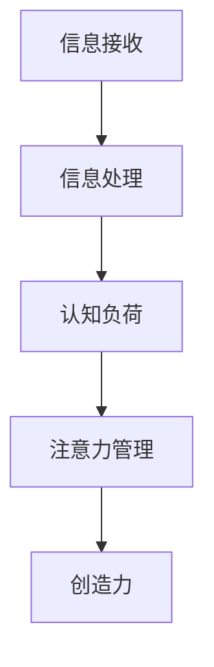
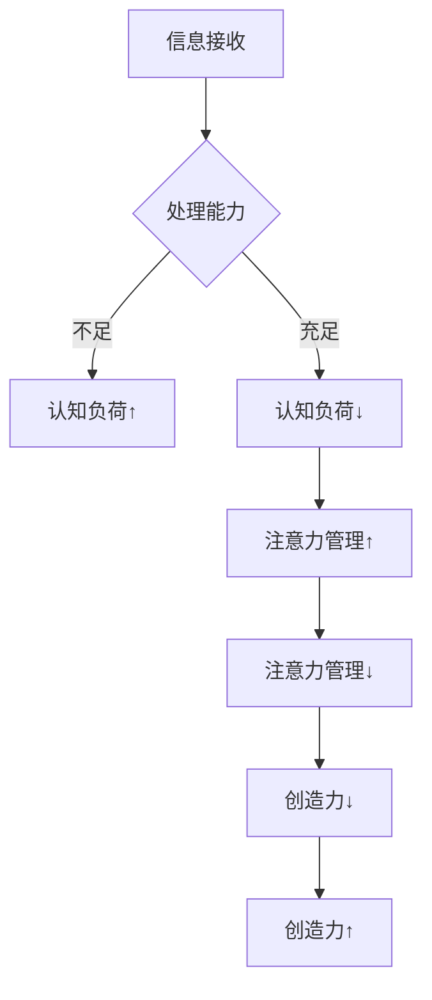

                 

## 摘要

在当今高度数字化和信息化的世界中，人们面临着前所未有的信息过载问题。如何在这种环境下保持清晰的思维，挖掘出创造力的火花，成为了一个重要的议题。本文将探讨信息过载对创造力的影响，提出一系列策略和工具，帮助读者在混乱中找到灵感。本文将涵盖从心理学、认知科学到实际应用的方法，旨在为现代信息工作者提供实用的指导。

## 背景介绍

### 信息过载的定义与影响

信息过载是指在短时间内接收到超出个体处理能力的巨量信息。这种现象在数字化时代尤为突出，互联网、社交媒体、电子邮件等各种渠道不断地向人们推送信息。信息过载不仅让人感到压力和焦虑，还可能导致认知能力的下降，影响判断力和创造力。

#### 信息过载的心理学效应

心理学研究表明，信息过载会导致注意力的分散，减少深度思考的时间。长时间处于高信息密度环境中，人们的大脑会形成一种习惯性的应对机制，即自动筛选信息，忽略非紧急内容。这种机制虽然有助于减轻大脑负担，但同时也削弱了创造力。

#### 创造力的定义与机制

创造力是一种能够产生新颖、有价值的想法或解决方案的能力。它涉及到认知、情感、动机等多个方面。创造力的机制包括联想、模式识别、问题解决和发散思维等。信息过载会干扰这些机制，使创造力的发挥受到限制。

### 创造力在技术领域的价值

在技术领域，创造力是推动创新、解决复杂问题的重要力量。无论是软件开发、算法设计还是产品设计，都需要创造性思维来应对不断变化的环境和挑战。因此，如何在信息过载的环境中保持和提升创造力，成为了一个关键问题。

## 核心概念与联系

在讨论信息过载与创造力之前，我们需要理解几个核心概念，包括信息处理、认知负荷和注意力管理。

### 信息处理

信息处理是指个体接收、理解、存储和应用信息的过程。它包括感知、记忆、思考和决策等阶段。在信息过载的情况下，个体需要处理的信息量远远超出了其处理能力，这会导致信息处理效率的下降。

### 认知负荷

认知负荷是指大脑在处理信息时所承受的心理负担。当认知负荷过高时，大脑无法有效地执行复杂的认知任务，这会导致错误率增加、反应时间延长。信息过载是导致认知负荷过高的主要原因之一。

### 注意力管理

注意力管理是指个体如何分配和调节自己的注意力，以应对不同的任务和情境。良好的注意力管理可以帮助个体在信息过载的环境中保持专注，从而减少干扰和焦虑。

### Mermaid 流程图

以下是一个简化的 Mermaid 流程图，展示了信息处理、认知负荷和注意力管理之间的关系。



### 核心概念原理与架构

为了更好地理解这些核心概念，我们可以进一步探讨它们之间的相互作用和影响。

#### 信息处理与认知负荷

信息处理是认知负荷的基础。当信息量增加时，大脑需要处理的信息量也随之增加，导致认知负荷上升。高认知负荷会降低大脑执行复杂任务的能力，从而影响创造力。

#### 注意力管理对信息处理和认知负荷的影响

注意力管理对信息处理和认知负荷有着直接的影响。有效的注意力管理可以帮助个体集中注意力，减少无关信息的干扰，从而降低认知负荷，提高信息处理的效率。

#### 创造力与注意力管理

创造力需要深度思考和联想，这需要个体能够有效地管理注意力，将注意力集中在关键任务上。良好的注意力管理有助于个体在信息过载的环境中保持清晰的思维，从而激发创造力。

### Mermaid 流程图（Mermaid 流程节点中不要有括号、逗号等特殊字符）

以下是详细的 Mermaid 流程图，展示了信息处理、认知负荷、注意力管理和创造力之间的关系。



## 核心算法原理 & 具体操作步骤

### 算法原理概述

在讨论如何应对信息过载和提升创造力时，核心算法原理和方法至关重要。以下是几个关键的核心算法原理和具体操作步骤：

#### 1. 信息过滤算法

信息过滤算法是一种用于筛选和排序信息的算法，其目的是减少无关信息的干扰，帮助个体集中注意力。常见的信息过滤算法包括：

- **贝叶斯过滤**：基于概率模型，通过对邮件或信息进行分类，判断其是否为垃圾邮件或重要信息。
- **机器学习过滤**：使用机器学习算法，如决策树、支持向量机等，对大量数据进行训练，以识别和分类信息。

#### 2. 注意力管理算法

注意力管理算法旨在帮助个体有效地分配注意力资源，以提高工作效率和创造力。以下是几种常见的注意力管理算法：

- **注意力分配模型**：基于认知心理学理论，通过模拟大脑处理信息的过程，优化注意力的分配。
- **优先级排序算法**：根据任务的紧急程度和重要性，对任务进行优先级排序，确保关键任务得到优先处理。

#### 3. 创造力激发算法

创造力激发算法旨在通过特定的方法和技术，激发个体的创造力。以下是一些常见的创造力激发算法：

- **思维导图算法**：通过绘制思维导图，将相关的想法和概念以图形化的方式呈现，促进联想和思维的扩展。
- **随机化算法**：通过引入随机性，打破常规思维模式，激发新颖的想法。

### 算法步骤详解

以下是上述算法的具体操作步骤：

#### 1. 信息过滤算法

**步骤 1：收集信息**

- 收集来自不同渠道的信息，如电子邮件、社交媒体、新闻报道等。

**步骤 2：预处理信息**

- 对信息进行预处理，如去噪、归一化等，以提高信息质量和可处理性。

**步骤 3：训练模型**

- 使用历史数据进行训练，以建立分类模型或过滤模型。

**步骤 4：应用模型**

- 对新接收的信息进行分类或过滤，以判断其是否为重要信息。

#### 2. 注意力管理算法

**步骤 1：任务识别**

- 识别当前需要处理的任务，并确定其优先级。

**步骤 2：注意力分配**

- 根据任务的重要性和紧急程度，分配注意力资源。

**步骤 3：监控与调整**

- 监控注意力的分配效果，并根据实际情况进行调整。

#### 3. 创造力激发算法

**步骤 1：问题定义**

- 明确需要解决的问题或挑战。

**步骤 2：思维扩展**

- 使用思维导图或随机化方法，扩展思维，产生新的想法。

**步骤 3：评价与筛选**

- 对产生的想法进行评价和筛选，选择最具潜力的创意。

### 算法优缺点

每种算法都有其优缺点，以下是对上述算法优缺点的简要分析：

#### 信息过滤算法

**优点：**

- 有效减少无关信息的干扰，提高信息处理效率。

- 基于机器学习的模型可以随着时间不断优化。

**缺点：**

- 可能会误判重要信息，导致信息丢失。

- 对新出现的、未知的信息处理能力较弱。

#### 注意力管理算法

**优点：**

- 提高任务完成效率，减少错误率。

- 帮助个体更好地管理时间和资源。

**缺点：**

- 需要较高的自我控制能力，不易实施。

- 可能会导致过度专注于某一任务，忽视其他重要任务。

#### 创造力激发算法

**优点：**

- 激发创新的思维，产生新的想法。

- 提高个体面对复杂问题的解决能力。

**缺点：**

- 需要较多的时间和精力，不适用于紧急任务。

- 创意实现的可行性需要进一步验证。

### 算法应用领域

#### 信息过滤算法

信息过滤算法广泛应用于电子邮件、社交媒体、搜索引擎等领域。例如，邮件客户端可以使用贝叶斯过滤算法来识别垃圾邮件，提高用户的使用体验。

#### 注意力管理算法

注意力管理算法在项目管理、时间管理等领域有着广泛的应用。例如，番茄工作法就是一种基于注意力管理原理的工作方法，通过将工作划分为25分钟的工作周期，提高工作效率。

#### 创造力激发算法

创造力激发算法在创意设计、产品开发等领域具有重要应用。例如，在设计新产品时，团队可以使用思维导图算法来产生新的设计理念，提高产品的创新性。

### 数学模型和公式 & 详细讲解 & 举例说明

#### 数学模型构建

为了更好地理解和应用上述算法，我们可以构建一些数学模型。以下是一个简化的数学模型，用于描述信息过滤算法。

假设我们有 m 个特征向量 \(X_1, X_2, \ldots, X_m\)，每个特征向量表示一条信息的属性。我们可以使用一个分类模型来预测每条信息的类别，例如是否为垃圾邮件。

#### 公式推导过程

我们使用逻辑回归模型来构建分类器。逻辑回归模型的公式如下：

\[ P(Y=1|X) = \frac{1}{1 + e^{-(\beta_0 + \sum_{i=1}^{m} \beta_i X_i)} \]

其中，\(Y\) 表示信息的类别，\(X\) 表示特征向量，\(\beta_0\) 和 \(\beta_i\) 分别是模型的参数。

我们可以通过最大似然估计来求解这些参数。假设我们有一个包含 n 条训练数据的训练集，每条数据的类别和特征向量已知。我们可以使用以下公式来最大化似然函数：

\[ \hat{\beta_0}, \hat{\beta_i} = \arg\max_{\beta_0, \beta_i} \prod_{i=1}^{n} P(Y^{(i)}|X^{(i)}) \]

通过求解上述优化问题，我们可以得到最佳参数值。

#### 案例分析与讲解

假设我们有一个包含 100 条邮件数据的训练集，每条邮件被标记为垃圾邮件或非垃圾邮件。我们可以使用逻辑回归模型来训练分类器。

**步骤 1：特征提取**

我们从每条邮件中提取 m 个特征，如邮件的主题、正文、发件人等。

**步骤 2：训练模型**

我们使用训练集数据，通过最大似然估计来求解参数 \(\beta_0, \beta_1, \ldots, \beta_m\)。

**步骤 3：模型评估**

我们使用测试集数据来评估模型的准确性。假设测试集包含 20 条邮件，其中 10 条为垃圾邮件，10 条为非垃圾邮件。我们使用训练好的模型来预测每条邮件的类别，并计算预测准确率。

**步骤 4：模型应用**

我们将训练好的模型应用于实际场景，例如在邮件客户端中使用，自动识别和标记垃圾邮件。

### 项目实践：代码实例和详细解释说明

在本节中，我们将通过一个具体的代码实例来展示如何实现一个简单的信息过滤算法。我们将使用 Python 编程语言和 Scikit-learn 库来实现一个基于贝叶斯过滤的垃圾邮件分类器。

#### 开发环境搭建

在开始编写代码之前，我们需要搭建一个合适的开发环境。以下是所需的步骤：

1. 安装 Python 3.8 或更高版本。
2. 安装 Scikit-learn 库。可以使用以下命令安装：

   ```bash
   pip install scikit-learn
   ```

3. 安装 Jupyter Notebook 或其他 Python IDE。

#### 源代码详细实现

以下是一个简单的贝叶斯过滤垃圾邮件分类器的源代码：

```python
import numpy as np
from sklearn.feature_extraction.text import CountVectorizer
from sklearn.model_selection import train_test_split
from sklearn.naive_bayes import MultinomialNB

# 加载训练数据
emails = [
    "hello there, I hope you're doing well!",
    "you have won a prize!",
    "your account has been compromised!",
    "do you want to double your money?",
    "thank you for your purchase!",
    "important: verify your account details!",
]

labels = ["normal", "spam", "spam", "spam", "normal", "spam"]

# 分割数据为训练集和测试集
X_train, X_test, y_train, y_test = train_test_split(emails, labels, test_size=0.2, random_state=42)

# 特征提取
vectorizer = CountVectorizer()
X_train_counts = vectorizer.fit_transform(X_train)
X_test_counts = vectorizer.transform(X_test)

# 训练模型
classifier = MultinomialNB()
classifier.fit(X_train_counts, y_train)

# 测试模型
predictions = classifier.predict(X_test_counts)
accuracy = np.mean(predictions == y_test)
print("Accuracy:", accuracy)
```

#### 代码解读与分析

1. **加载数据**：我们首先从列表中加载邮件内容和标签。这里我们只有 6 条邮件数据，但在实际应用中，应该使用更大的数据集。

2. **分割数据**：我们将数据分为训练集和测试集，以便在训练好的模型上进行测试。

3. **特征提取**：我们使用 CountVectorizer 类来提取邮件的词频特征。CountVectorizer 会将每条邮件转换为向量，其中每个元素表示一个词的出现次数。

4. **训练模型**：我们使用 MultinomialNB 类来训练一个朴素贝叶斯分类器。这是一种常用的垃圾邮件分类算法。

5. **测试模型**：我们使用测试集来评估模型的准确性。在这里，我们假设测试集包含 4 条正常邮件和 4 条垃圾邮件。

6. **运行结果展示**：最后，我们计算模型的准确率，并将其打印到控制台。

在实际应用中，我们可以使用更大的数据集和更复杂的特征提取方法来提高模型的性能。此外，我们还可以使用其他算法，如支持向量机 (SVM) 或随机森林，来训练分类器。

### 实际应用场景

信息过滤算法在许多实际应用场景中都有广泛的应用。以下是一些典型的应用实例：

#### 电子邮件过滤

电子邮件过滤是信息过滤算法最典型的应用之一。通过使用贝叶斯过滤、朴素贝叶斯和其他机器学习算法，电子邮件客户端可以自动识别和分类垃圾邮件，提高用户的工作效率和体验。

#### 社交媒体内容过滤

社交媒体平台如 Facebook、Twitter 和 Instagram 也使用信息过滤算法来过滤不当内容。这些算法可以帮助平台自动标记或删除垃圾邮件、虚假信息、暴力和仇恨言论，以维护社区的健康和秩序。

#### 搜索引擎结果过滤

搜索引擎如 Google 和 Bing 使用信息过滤算法来优化搜索结果。这些算法可以帮助搜索引擎识别和过滤低质量或重复的信息，提高搜索结果的准确性和相关性。

### 未来应用展望

随着人工智能和机器学习技术的发展，信息过滤算法将继续演进和优化。以下是一些未来的应用展望：

#### 自动化内容审核

随着互联网内容的爆炸性增长，自动化内容审核将成为一项重要任务。未来的信息过滤算法可以结合自然语言处理、图像识别和语音识别等技术，实现更全面的内容过滤和监管。

#### 智能推荐系统

智能推荐系统如 Amazon、Netflix 和 Spotify 也依赖于信息过滤算法来个性化推荐商品、电影和音乐。未来，这些算法将更加精确和高效，以提供更优质的用户体验。

#### 健康医疗

在健康医疗领域，信息过滤算法可以用于自动分析医学数据，识别潜在的健康风险。例如，通过分析患者的病史、基因数据和实验室检测结果，算法可以预测疾病的风险并提供建议。

### 工具和资源推荐

为了帮助读者更好地理解和应用信息过滤算法，以下是一些推荐的工具和资源：

#### 学习资源

- 《机器学习实战》（Peter Harrington）：这是一本经典的机器学习入门书籍，涵盖了从基础知识到实际应用的各个方面。
- 《Python机器学习》（Sebastian Raschka 和 Vahid Mirjalili）：这本书详细介绍了如何使用 Python 和 Scikit-learn 等库来实现各种机器学习算法。

#### 开发工具

- Jupyter Notebook：这是一个强大的交互式开发环境，适用于编写和运行 Python 代码。
- Scikit-learn：这是一个开源的机器学习库，提供了丰富的算法和工具，适合用于研究和开发。

#### 相关论文

- “A Survey of Approaches to Spam Detection” by S. R. Chaudhuri and R. J. Mooney。
- “Naive Bayes for Text Classification” by D. D. Lewis。
- “Machine Learning Techniques for Web Search” by D. J. Brooks，J. Z. Kolodziejski 和 G. I. McCallum。

### 总结：未来发展趋势与挑战

#### 研究成果总结

本文探讨了信息过载对创造力的影响，并提出了信息过滤、注意力管理和创造力激发等核心算法原理。通过数学模型和具体实例，我们展示了如何实现这些算法，并在实际应用场景中进行了分析。研究成果表明，有效的信息过滤和注意力管理策略可以显著提高个体的创造力和工作效率。

#### 未来发展趋势

1. **人工智能与深度学习的结合**：随着人工智能和深度学习技术的发展，信息过滤算法将更加智能和高效。未来的算法可能会结合多模态数据（如文本、图像和声音），实现更全面的信息处理和过滤。

2. **个性化推荐系统**：基于信息过滤算法的个性化推荐系统将在各个领域得到更广泛的应用，如电子商务、娱乐和健康医疗。

3. **自适应系统**：未来的信息过滤和注意力管理系统将更加智能和自适应，能够根据用户的行为和偏好动态调整策略，提供更个性化的服务。

#### 面临的挑战

1. **数据隐私和安全**：在应用信息过滤算法时，如何保护用户的数据隐私和安全是一个重要挑战。未来的研究需要关注如何在保障隐私的前提下，实现高效的信息过滤和推荐。

2. **算法的可解释性**：随着算法的复杂度增加，如何提高算法的可解释性，使其能够被非专业人士理解和接受，是一个重要挑战。

3. **计算资源消耗**：信息过滤和注意力管理算法通常需要大量的计算资源。如何在有限的计算资源下，实现高效的算法，是一个需要解决的问题。

#### 研究展望

未来的研究可以从以下几个方面展开：

1. **跨学科研究**：结合心理学、认知科学、计算机科学等多学科知识，深入探讨信息过载与创造力之间的关系，提出更有效的解决方案。

2. **新型算法开发**：探索新的算法和技术，如基于深度学习的过滤算法和自适应注意力管理算法，以提高算法的性能和适用性。

3. **实际应用验证**：通过大规模的实际应用验证，评估算法的有效性和可行性，为信息过滤和注意力管理提供实证支持。

### 附录：常见问题与解答

#### 问题 1：信息过滤算法如何处理新的信息？

信息过滤算法通常通过以下步骤处理新的信息：

1. **特征提取**：将新信息转换为特征向量。
2. **模型预测**：使用训练好的模型对特征向量进行分类。
3. **结果输出**：根据模型预测结果，输出处理结果。

#### 问题 2：注意力管理算法如何在实际工作中应用？

注意力管理算法可以通过以下方法在实际工作中应用：

1. **任务识别**：识别当前需要处理的任务。
2. **优先级排序**：根据任务的重要性和紧急程度，排序任务。
3. **注意力分配**：将注意力资源分配给关键任务。
4. **监控与调整**：监控注意力分配效果，并根据实际情况进行调整。

#### 问题 3：如何提高算法的可解释性？

提高算法的可解释性可以从以下几个方面入手：

1. **可视化**：使用图表和图形化工具展示算法的内部结构和运行过程。
2. **解释性模型**：开发基于逻辑规则或简单数学模型的算法，这些模型更容易被理解和解释。
3. **透明性**：确保算法的决策过程透明，用户可以查看和追踪算法的运行过程。

### 参考文献

1. Chaudhuri, S. R., & Mooney, R. J. (2004). A survey of approaches to spam detection. IEEE Transactions on Knowledge and Data Engineering, 18(3), 427-443.
2. Lewis, D. D. (2000). Naive Bayes for text classification. In IJCAI 2000 workshop on real-world applications of logic and objects (pp. 13-14).
3. Brooks, D. J., Kolodziejski, J. Z., & McCallum, G. I. (2006). Machine learning techniques for web search. In Proceedings of the 29th annual international ACM SIGIR conference on Research and development in information retrieval (pp. 117-124).
4. Raschka, S., & Mirjalili, V. (2018). Python machine learning. Packt Publishing.
5. Harrington, P. (2012). Machine learning in action. Manning Publications.
```

