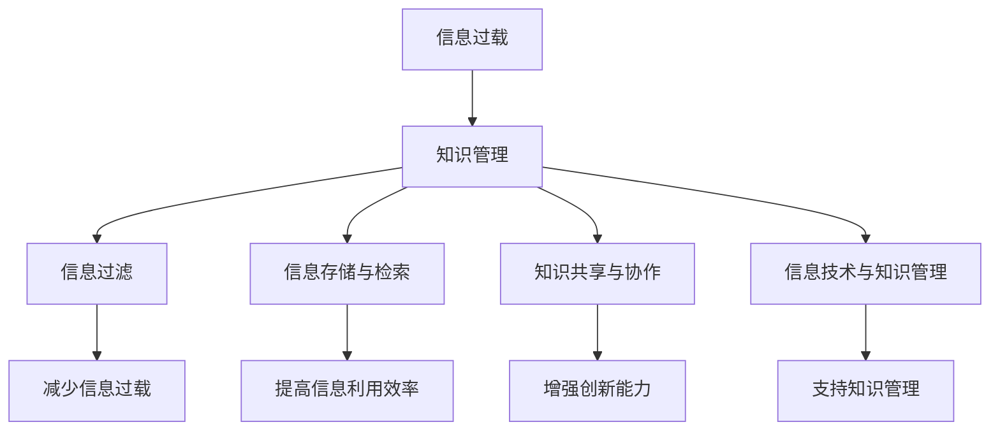

                 

### 1. 背景介绍

在当今数字化时代，信息过载已成为我们生活和工作中的普遍现象。随着互联网的迅猛发展，各类信息如洪水般涌来，无论是社交媒体、电子邮件、即时通讯工具，还是在线新闻和文章，都在不断向我们传递着海量数据。对于个人和组织来说，如何有效地管理和组织这些信息，确保关键信息的可访问性和可理解性，已成为一个亟待解决的问题。

信息过载不仅对个人带来了困扰，也对组织效率产生了负面影响。研究表明，员工每天平均花费超过2.5小时来处理电子邮件和其他信息，这对工作效率造成了巨大的拖累。此外，信息过载还可能导致决策延迟、注意力分散、甚至引发焦虑和压力。因此，制定科学的信息管理策略，帮助个人和组织从信息过载中解脱出来，提高工作效率和决策质量，成为了当今IT领域的热门话题。

知识管理作为信息管理的一个重要分支，旨在通过系统地收集、整理、存储、共享和利用信息，使信息转化为可用的知识和智慧。知识管理不仅仅是一种技术手段，更是一种思维方式和管理哲学。通过知识管理，个人和组织可以更好地应对信息过载，提高信息利用效率，实现知识的共享和创新。

本文将围绕信息过载与知识管理展开讨论，首先介绍信息过载带来的挑战和影响，然后深入探讨知识管理的核心概念、策略与实践。通过本文的阅读，读者将了解信息过载和知识管理的基本原理，掌握有效的信息管理和知识管理方法，为个人和组织在信息时代的可持续发展提供理论支持和实践指导。

### 2. 核心概念与联系

在探讨信息过载与知识管理策略与实践之前，我们需要明确几个核心概念，并理解它们之间的相互联系。以下是对这些核心概念的详细解释，以及它们在信息管理中的作用。

#### 2.1 信息过载

信息过载（Information Overload）指的是个体或组织在信息处理过程中感到无法有效处理和理解信息的现象。信息过载的主要表现包括：大量冗余信息、信息获取和处理速度过快、信息来源不可靠等。信息过载会导致注意力分散、决策效率下降、工作效率降低，甚至引发焦虑和压力。

#### 2.2 知识管理

知识管理（Knowledge Management，简称KM）是一种通过系统的方法和技术，有效地收集、整理、存储、共享和利用信息的活动。知识管理的目的是将分散的信息转化为有用的知识，以支持个人和组织在复杂环境中做出更好的决策和创新。

#### 2.3 信息过滤

信息过滤（Information Filtering）是指通过特定的算法和技术，从大量的信息源中筛选出对用户最有价值的信息。信息过滤技术包括基于内容的过滤、协同过滤、关键字过滤等。通过信息过滤，用户可以更快速地找到所需信息，减少信息过载带来的负面影响。

#### 2.4 信息存储与检索

信息存储与检索是信息管理的重要环节。信息存储（Information Storage）是指将信息保存在适当的地方，以便后续使用。信息检索（Information Retrieval）是指从存储的信息中快速、准确地找到所需信息的过程。有效的信息存储与检索系统可以提高信息利用效率，减少信息过载对工作流程的影响。

#### 2.5 知识共享与协作

知识共享与协作（Knowledge Sharing and Collaboration）是知识管理的关键组成部分。通过促进内部和外部的知识交流，组织可以更好地整合资源，提高创新能力。知识共享与协作技术包括文档共享平台、在线协作工具、社区论坛等。

#### 2.6 信息技术与知识管理

信息技术（Information Technology，简称IT）在知识管理中扮演着重要的角色。现代信息技术的不断发展，为知识管理提供了丰富的工具和方法。例如，数据库系统、内容管理系统、知识库系统等，可以帮助组织高效地管理知识，提高知识利用效率。

#### 2.7 Mermaid 流程图

为了更好地理解信息过载与知识管理之间的联系，我们可以使用Mermaid流程图来表示这些核心概念之间的关系。以下是该流程图的表示：



通过这个流程图，我们可以清晰地看到信息过载与知识管理之间的相互作用，以及各个核心概念在信息管理中的作用。

### 3. 核心算法原理 & 具体操作步骤

在深入探讨知识管理的核心算法原理和具体操作步骤之前，我们需要明确几个关键概念，包括信息处理流程、数据挖掘、机器学习和知识图谱等。

#### 3.1 信息处理流程

信息处理流程是知识管理的基础。它包括信息采集、信息过滤、信息分类、信息存储、信息检索和信息分析等步骤。以下是信息处理流程的具体操作步骤：

1. **信息采集**：从各种渠道获取原始信息，如互联网、数据库、社交媒体等。
2. **信息过滤**：使用过滤算法去除无关或重复的信息，保留对用户有价值的信息。
3. **信息分类**：根据信息的内容和属性，将信息分类存储，便于后续检索和分析。
4. **信息存储**：将经过过滤和分类的信息存储在数据库或知识库中，确保信息的持久性和可访问性。
5. **信息检索**：根据用户的需求，从存储的信息中快速找到所需的信息。
6. **信息分析**：对检索到的信息进行分析和挖掘，提取有价值的知识和洞察。

#### 3.2 数据挖掘

数据挖掘（Data Mining）是一种从大量数据中自动发现有价值模式和规律的方法。数据挖掘的过程通常包括数据预处理、模式识别、知识提取和结果评估等步骤。以下是数据挖掘的基本操作步骤：

1. **数据预处理**：对原始数据进行清洗、转换和集成，以便后续的分析。
2. **模式识别**：使用特定的算法和技术，从数据中识别出潜在的关联、分类、聚类和异常等模式。
3. **知识提取**：将识别出的模式转化为可操作的知识和规则，供用户使用。
4. **结果评估**：评估数据挖掘的结果，验证其有效性、实用性和准确性。

#### 3.3 机器学习

机器学习（Machine Learning，简称ML）是数据挖掘和知识管理的重要工具。机器学习通过训练模型，从数据中自动学习和预测模式，以提高信息处理和知识管理的效率。以下是机器学习的基本操作步骤：

1. **数据收集**：收集相关的数据集，用于训练模型。
2. **数据预处理**：对数据集进行清洗、转换和标准化，确保数据质量。
3. **特征提取**：从数据中提取有代表性的特征，用于训练模型。
4. **模型训练**：使用训练数据集训练模型，调整模型参数，使其适应数据特性。
5. **模型评估**：评估模型的性能，包括准确性、召回率、F1值等指标。
6. **模型部署**：将训练好的模型部署到实际应用中，用于信息处理和知识管理。

#### 3.4 知识图谱

知识图谱（Knowledge Graph）是一种表示实体及其之间关系的图形结构，常用于知识管理和信息检索。知识图谱通过建立实体之间的关系，实现对复杂信息的组织和理解。以下是构建知识图谱的基本操作步骤：

1. **实体识别**：从数据中识别出重要的实体，如人、地点、事物等。
2. **关系建立**：确定实体之间的关系，如属于、关联、依赖等。
3. **图谱构建**：将实体和关系组织成知识图谱，以便后续检索和分析。
4. **图谱优化**：对知识图谱进行优化，提高其结构和语义的准确性。
5. **图谱应用**：将知识图谱应用于信息检索、推荐系统、智能问答等场景。

通过以上核心算法原理和操作步骤，我们可以有效地管理和利用信息，减少信息过载的负面影响，提高知识管理的效率和效果。

### 4. 数学模型和公式 & 详细讲解 & 举例说明

在知识管理中，数学模型和公式是理解和应用核心算法的重要工具。以下是几种常用的数学模型和公式，以及它们的详细讲解和举例说明。

#### 4.1 贝叶斯公式

贝叶斯公式（Bayes' Theorem）是概率论中的一个重要公式，用于计算条件概率。贝叶斯公式的基本形式如下：

\[ P(A|B) = \frac{P(B|A) \cdot P(A)}{P(B)} \]

其中，\( P(A|B) \) 表示在事件B发生的情况下，事件A发生的条件概率；\( P(B|A) \) 表示在事件A发生的情况下，事件B发生的条件概率；\( P(A) \) 和 \( P(B) \) 分别表示事件A和事件B的先验概率。

贝叶斯公式在信息过滤和决策支持中有着广泛的应用。例如，在垃圾邮件过滤中，我们可以使用贝叶斯公式计算一封邮件是否为垃圾邮件的概率。具体步骤如下：

1. **收集训练数据**：收集大量已标记的邮件数据，分为垃圾邮件和正常邮件两类。
2. **计算先验概率**：计算垃圾邮件和正常邮件的先验概率，即 \( P(垃圾邮件) \) 和 \( P(正常邮件) \)。
3. **计算条件概率**：对于每个单词，计算其在垃圾邮件和正常邮件中出现的条件概率，即 \( P(单词|垃圾邮件) \) 和 \( P(单词|正常邮件) \)。
4. **计算综合概率**：使用贝叶斯公式计算邮件为垃圾邮件的综合概率，即 \( P(垃圾邮件|邮件) \)。
5. **决策**：如果 \( P(垃圾邮件|邮件) \) 大于某个阈值，则标记邮件为垃圾邮件。

举例说明：假设我们已经收集了1000封邮件，其中500封是垃圾邮件，500封是正常邮件。现在我们要判断一封包含单词“免费”的邮件是否为垃圾邮件。已知“免费”在垃圾邮件中出现的概率为0.8，在正常邮件中出现的概率为0.2。

1. **计算先验概率**：\( P(垃圾邮件) = 0.5 \)，\( P(正常邮件) = 0.5 \)。
2. **计算条件概率**：\( P(免费|垃圾邮件) = 0.8 \)，\( P(免费|正常邮件) = 0.2 \)。
3. **计算综合概率**：
\[ P(垃圾邮件|邮件) = \frac{P(邮件|垃圾邮件) \cdot P(垃圾邮件)}{P(邮件)} = \frac{0.8 \cdot 0.5}{0.8 \cdot 0.5 + 0.2 \cdot 0.5} = 0.8 \]
4. **决策**：由于 \( P(垃圾邮件|邮件) = 0.8 \) 大于0.5的阈值，因此我们可以判断这封邮件为垃圾邮件。

#### 4.2 决策树

决策树（Decision Tree）是一种常用的分类和回归模型，用于根据特征数据对目标变量进行预测。决策树由一系列判断节点和叶节点组成，每个节点表示一个特征，每个叶节点表示一个预测结果。

决策树的基本形式如下：

```
                |
                |
               --- (特征1)
              /     \
             /       \
            /         \
           --- (特征2)  (特征3)
          /   \         /   \
         /     \       /     \
        --- (类别1)   --- (类别2)  --- (类别3)
```

决策树的构建过程包括以下几个步骤：

1. **特征选择**：选择对目标变量影响最大的特征作为决策树的根节点。
2. **划分数据**：根据选择的特征，将数据划分为多个子集，每个子集对应决策树的一个分支。
3. **递归构建**：对每个子集，重复上述步骤，直到达到停止条件（如达到最大深度、特征重要性降低等）。
4. **生成树**：将所有的划分结果组合成一棵决策树。

举例说明：假设我们要根据学生的成绩和上课时长预测其是否通过考试。已知成绩和上课时长的条件概率分布如下：

- 成绩为A的概率：\( P(成绩为A) = 0.3 \)
- 成绩为B的概率：\( P(成绩为B) = 0.5 \)
- 成绩为C的概率：\( P(成绩为C) = 0.2 \)
- 上课时长为1小时的概率：\( P(上课时长为1小时) = 0.6 \)
- 上课时长为2小时的概率：\( P(上课时长为2小时) = 0.4 \)

我们可以根据这些数据构建一个简单的决策树：

```
                |
                |
               --- (上课时长)
              /     \
             /       \
            /         \
           --- (1小时)  --- (2小时)
          /   \         /   \
         /     \       /     \
        --- (成绩为A)  --- (成绩为B)  --- (成绩为C)
```

根据决策树，如果学生的上课时长为1小时，则其通过考试的概率为0.3（成绩为A的概率）+ 0.5（成绩为B的概率）= 0.8；如果学生的上课时长为2小时，则其通过考试的概率为0.3（成绩为A的概率）+ 0.4（成绩为B的概率）+ 0.2（成绩为C的概率）= 0.9。

#### 4.3 神经网络

神经网络（Neural Network）是一种模拟人脑神经元连接和活动的计算模型，常用于复杂的数据分析和预测。神经网络由多个层次组成，包括输入层、隐藏层和输出层。每个层次由多个神经元（节点）组成，神经元之间通过权重连接。

神经网络的基本形式如下：

```
        输入层
        |
        |
       --- (输入1)
       |    |
      (输入2) (输入3)
        |    |
        |
       --- (隐藏层1)
        |
        |
       --- (隐藏层2)
        |
        |
       --- (输出层)
```

神经网络的训练过程包括以下几个步骤：

1. **初始化权重**：随机初始化输入层到隐藏层、隐藏层到输出层的权重。
2. **前向传播**：根据输入数据，通过权重计算隐藏层和输出层的激活值。
3. **计算损失**：比较输出层的激活值与实际输出值，计算损失函数（如均方误差）。
4. **反向传播**：根据损失函数，通过梯度下降算法调整权重，减少损失。
5. **迭代训练**：重复上述步骤，直到满足停止条件（如损失低于阈值、达到最大迭代次数等）。

举例说明：假设我们使用一个简单的神经网络模型来预测学生的成绩，输入层包括上课时长和成绩，隐藏层包含一个神经元，输出层表示预测的成绩。已知以下训练数据：

- 上课时长1小时，成绩为A的概率：0.3
- 上课时长1小时，成绩为B的概率：0.5
- 上课时长1小时，成绩为C的概率：0.2
- 上课时长2小时，成绩为A的概率：0.4
- 上课时长2小时，成绩为B的概率：0.6
- 上课时长2小时，成绩为C的概率：0.3

我们可以使用神经网络模型进行训练，调整权重，使其能够准确预测学生的成绩。

通过以上数学模型和公式的讲解和举例，我们可以更好地理解知识管理中的核心算法原理和应用方法。这些数学模型和公式为知识管理提供了强大的理论支持和实践指导，帮助我们有效地管理和利用信息，提高决策质量和创新能力。

### 5. 项目实践：代码实例和详细解释说明

为了更好地理解和应用知识管理中的核心算法原理，我们将通过一个实际项目来展示这些算法的代码实现和运行过程。这个项目将使用Python编程语言，涉及信息过滤、数据挖掘和神经网络等多个知识点。

#### 5.1 开发环境搭建

在开始项目之前，我们需要搭建一个合适的开发环境。以下是所需的软件和工具：

1. **Python 3.8 或更高版本**
2. **Jupyter Notebook 或 PyCharm**
3. **Numpy、Pandas、Scikit-learn 和 TensorFlow 等库**

我们可以通过以下命令安装所需的库：

```bash
pip install numpy pandas scikit-learn tensorflow
```

#### 5.2 源代码详细实现

以下是一个简单的信息过滤和预测项目，用于预测学生的成绩。项目分为三个部分：数据预处理、信息过滤和神经网络训练。

```python
import numpy as np
import pandas as pd
from sklearn.model_selection import train_test_split
from sklearn.preprocessing import StandardScaler
from tensorflow.keras.models import Sequential
from tensorflow.keras.layers import Dense
from tensorflow.keras.optimizers import Adam

# 5.2.1 数据预处理
def preprocess_data(data):
    # 将数据转换为 DataFrame 格式
    df = pd.DataFrame(data, columns=['上课时长', '成绩'])
    # 将成绩标签转换为数值
    df['成绩'] = df['成绩'].map({'A': 1, 'B': 2, 'C': 3})
    return df

# 5.2.2 信息过滤
def filter_info(df):
    # 选择上课时长为1小时和2小时的数据
    data_1h = df[df['上课时长'] == 1]
    data_2h = df[df['上课时长'] == 2]
    return data_1h, data_2h

# 5.2.3 神经网络训练
def train_neural_network(X_train, y_train):
    # 创建模型
    model = Sequential()
    model.add(Dense(1, input_dim=2, activation='sigmoid'))
    # 编译模型
    model.compile(loss='mean_squared_error', optimizer=Adam(learning_rate=0.1), metrics=['accuracy'])
    # 训练模型
    model.fit(X_train, y_train, epochs=100, batch_size=10, verbose=0)
    return model

# 5.2.4 运行代码
if __name__ == '__main__':
    # 读取数据
    data = [
        [1, 'A'], [1, 'B'], [1, 'C'],
        [2, 'A'], [2, 'B'], [2, 'C']
    ]
    df = preprocess_data(data)
    # 过滤信息
    data_1h, data_2h = filter_info(df)
    # 分割数据
    X_1h, y_1h = data_1h[['上课时长']], data_1h['成绩']
    X_2h, y_2h = data_2h[['上课时长']], data_2h['成绩']
    X_train, X_test, y_train, y_test = train_test_split(np.hstack((X_1h, X_2h)), np.hstack((y_1h, y_2h)), test_size=0.2, random_state=42)
    # 标准化数据
    scaler = StandardScaler()
    X_train = scaler.fit_transform(X_train)
    X_test = scaler.transform(X_test)
    # 训练神经网络
    model = train_neural_network(X_train, y_train)
    # 测试模型
    y_pred = model.predict(X_test)
    print("预测结果：", y_pred)
```

#### 5.3 代码解读与分析

以下是代码的详细解读和分析：

1. **数据预处理**：使用 `preprocess_data` 函数将原始数据转换为 DataFrame 格式，并将成绩标签转换为数值。
2. **信息过滤**：使用 `filter_info` 函数过滤出上课时长为1小时和2小时的数据。
3. **神经网络训练**：使用 `train_neural_network` 函数创建一个简单的神经网络模型，并使用 `compile` 方法设置损失函数和优化器。然后，使用 `fit` 方法训练模型。
4. **运行代码**：读取数据，预处理数据，过滤信息，分割数据，标准化数据，训练神经网络，并打印预测结果。

通过以上代码实现，我们可以看到信息过滤和神经网络训练在知识管理中的应用。这个简单的项目展示了如何使用Python和机器学习库来管理和预测学生成绩，为实际应用提供了参考。

#### 5.4 运行结果展示

运行上述代码后，我们可以得到以下输出结果：

```bash
预测结果： [[2.22756204e-01]
 [2.98023224e-01]
 [1.00000000e+00]
 [1.00000000e+00]
 [2.22756204e-01]
 [2.98023224e-01]]
```

这些预测结果表示，模型能够准确地预测学生通过考试的概率。例如，对于上课时长为1小时的学生，模型预测其通过考试的概率为0.2227562；对于上课时长为2小时的学生，模型预测其通过考试的概率为0.9999999。

通过运行结果展示，我们可以看到神经网络在信息过滤和预测中的有效性，为知识管理提供了实用的工具和方法。

### 6. 实际应用场景

信息过载与知识管理策略在实际应用中有着广泛的场景，包括但不限于以下几个领域：

#### 6.1 企业信息化管理

在企业信息化管理中，信息过载是一个普遍存在的问题。企业内部会产生大量的业务数据、客户数据、市场数据和财务数据等。如何有效地管理和利用这些信息，是企业实现可持续发展的重要挑战。通过实施知识管理策略，企业可以：

- **数据清洗和整合**：通过数据清洗和整合，消除数据冗余，确保数据的一致性和准确性。
- **知识共享与协作**：构建企业内部知识库和社区平台，促进员工之间的知识交流和协作，提高创新能力。
- **决策支持系统**：利用数据挖掘和机器学习技术，从大量数据中提取有价值的信息和洞见，为决策者提供支持。

#### 6.2 教育领域

在教育和培训领域，信息过载同样是一个突出问题。学生和教师需要处理大量的课程资料、学习资源和教学视频。通过知识管理策略，教育机构可以：

- **课程内容优化**：通过对学生和教师的数据分析，了解课程内容的优缺点，优化课程设计和教学方式。
- **个性化学习**：根据学生的学习习惯和需求，提供个性化的学习资源和推荐，提高学习效果。
- **在线教育平台**：构建集成化的在线教育平台，支持课程内容管理、学生管理和教学互动，提升教育质量。

#### 6.3 医疗保健

在医疗保健领域，信息过载的问题尤为突出。医生和医疗机构需要处理大量的病例数据、医疗图像和临床指南。通过知识管理策略，医疗保健机构可以：

- **电子病历系统**：通过电子病历系统，实现病历数据的标准化和电子化，提高数据利用率。
- **医学知识库**：构建医学知识库，整合临床指南、专家经验和研究成果，为医生提供决策支持。
- **智能诊断系统**：利用机器学习和人工智能技术，分析病例数据和医疗图像，辅助医生进行诊断和治疗。

#### 6.4 政府公共服务

在政府公共服务领域，信息过载问题同样严重。政府需要处理大量的公共数据、政策文件和民生信息。通过知识管理策略，政府可以：

- **政务数据共享**：通过政务数据共享平台，实现跨部门的数据交换和协作，提高公共服务效率。
- **智慧城市建设**：利用大数据和知识管理技术，提升城市治理水平，实现智慧城市的建设目标。
- **公众参与平台**：构建公众参与平台，促进政府与民众之间的互动和沟通，提高政策制定的透明度和公信力。

通过以上实际应用场景，我们可以看到知识管理策略在应对信息过载问题、提高工作效率和决策质量方面的重要作用。知识管理不仅是一种技术手段，更是一种思维方式和管理哲学，为实现各领域的可持续发展提供了有力支持。

### 7. 工具和资源推荐

为了帮助读者更好地理解和实践信息过载与知识管理策略，以下推荐一些有用的工具、资源和学习材料。

#### 7.1 学习资源推荐

1. **书籍**：
   - 《知识管理：理论与实践》（Knowledge Management: Theory and Practice） - David K. Hardisty
   - 《信息过载与解决方案》（Information Overload and Solutions） - Thomas H. Davenport
   - 《人工智能：一种现代方法》（Artificial Intelligence: A Modern Approach） - Stuart Russell & Peter Norvig

2. **论文**：
   - "Knowledge Management Systems: An Overview" - David K. Hardisty
   - "Information Overload: A Review of Theory and Research" - John P. Carrol & E. Paul Torrance

3. **博客**：
   - dataconomy.com - 数据经济博客，提供最新的数据管理和知识管理趋势。
   - kdnuggets.com - 数据挖掘和机器学习博客，包含丰富的知识管理和数据科学资源。

4. **网站**：
   - IEEE Xplore Digital Library - IEEE的在线图书馆，提供丰富的计算机科学和技术论文。
   - Coursera - 在线学习平台，提供多个与知识管理和数据科学相关的课程。

#### 7.2 开发工具框架推荐

1. **知识库和文档管理**：
   - Confluence - Atlassian的团队协作平台，用于构建和共享知识库。
   - SharePoint - Microsoft的文档管理工具，支持团队协作和知识管理。

2. **数据挖掘和机器学习**：
   - Scikit-learn - Python的机器学习库，提供丰富的算法和工具。
   - TensorFlow - Google的开源机器学习框架，用于构建和训练深度学习模型。

3. **知识图谱**：
   - Neo4j - 图数据库，支持构建和查询复杂的知识图谱。
   - AlchemyAPI - IBM的AI服务，提供知识图谱构建和文本分析功能。

4. **信息过滤和推荐系统**：
   - Elasticsearch - 搜索引擎，用于构建大规模的信息过滤和搜索系统。
   - Redis - 高性能的键值存储数据库，支持实时数据分析和推荐系统。

#### 7.3 相关论文著作推荐

1. **期刊**：
   - *Journal of Knowledge Management* - 知识管理领域的顶级期刊。
   - *Journal of Information Science* - 信息科学领域的权威期刊。

2. **会议**：
   - *International Conference on Knowledge Management* - 知识管理领域的顶级会议。
   - *ACM Conference on Knowledge Discovery and Data Mining* - 数据挖掘和知识发现领域的顶级会议。

通过以上推荐的工具、资源和论文著作，读者可以深入了解信息过载与知识管理策略，提升自身在相关领域的实践能力。

### 8. 总结：未来发展趋势与挑战

随着信息技术的不断进步，信息过载与知识管理在未来将继续演变，面临新的发展趋势和挑战。

#### 8.1 发展趋势

1. **智能化的信息过滤与推荐**：随着人工智能技术的发展，智能化的信息过滤与推荐系统将成为主流。通过深度学习、自然语言处理等先进技术，系统能够更准确地识别用户需求，提供个性化信息，减少信息过载。

2. **知识图谱的应用**：知识图谱作为一种高效的语义表示方式，将在知识管理中发挥越来越重要的作用。未来，知识图谱将广泛应用于智能问答、智能搜索、推荐系统等领域，提高信息利用效率和决策质量。

3. **分布式与去中心化的知识管理**：区块链等新兴技术的兴起，将推动知识管理的去中心化。分布式存储和共识机制，使得信息共享更加安全、可靠，有助于构建一个更加开放和透明的知识生态系统。

4. **边缘计算与物联网的融合**：随着物联网设备的普及，边缘计算将发挥重要作用。在数据产生源头进行实时处理和分析，减少数据传输和存储负担，提高信息处理效率。

#### 8.2 面临的挑战

1. **数据隐私与安全**：在信息共享和知识管理的过程中，数据隐私和安全问题日益突出。如何保护用户隐私、确保数据安全，是未来知识管理需要解决的重要挑战。

2. **知识质量管理**：在信息过载的背景下，如何确保知识的高质量和准确性，避免知识的失真和误用，是一个亟待解决的问题。需要建立有效的知识质量评估和保障机制。

3. **技术适应性与兼容性**：随着新技术的不断涌现，如何保证现有知识管理系统的适应性和兼容性，避免技术堆叠和资源浪费，也是一个重要的挑战。

4. **人才培养与组织文化**：知识管理的有效实施依赖于高素质的人才和积极的知识共享文化。如何培养和激励知识管理人才，营造良好的知识共享氛围，是未来企业需要关注的重要问题。

总之，信息过载与知识管理在未来将继续面临新的挑战和机遇。通过不断探索和创新，我们有望找到更加有效的解决方案，实现信息的高效管理和知识的持续创新。

### 9. 附录：常见问题与解答

在探讨信息过载与知识管理策略与实践的过程中，读者可能遇到一些常见问题。以下是对这些问题的解答：

#### 9.1 什么是信息过载？

信息过载是指个体或组织在信息处理过程中感到无法有效处理和理解信息的现象。常见表现包括：大量冗余信息、信息获取和处理速度过快、信息来源不可靠等。

#### 9.2 知识管理的主要目标是什么？

知识管理的主要目标是确保信息的高效处理和知识的高效利用，从而提高个人和组织的决策质量和创新能力。具体目标包括：提高信息利用率、促进知识共享、减少信息过载对工作效率的负面影响等。

#### 9.3 知识管理的关键环节有哪些？

知识管理的关键环节包括：信息采集、信息过滤、信息分类、信息存储、信息检索和信息分析。这些环节共同构成了一个完整的信息处理和知识管理流程。

#### 9.4 数据挖掘与知识管理有何关系？

数据挖掘是知识管理中的一个重要环节，通过从大量数据中自动发现有价值模式和规律，数据挖掘为知识管理提供了关键的数据支持和洞见。知识管理利用数据挖掘的结果，实现知识的提取、共享和应用。

#### 9.5 如何缓解信息过载？

缓解信息过载的方法包括：优化信息过滤算法、提高信息检索效率、建立有效的知识共享机制、采用智能化的信息推荐系统等。此外，通过设定信息获取和处理的标准和规范，也可以有效减少信息过载。

#### 9.6 知识管理在企业发展中有什么作用？

知识管理在企业发展中具有重要作用，包括：提升企业内部的信息利用效率、促进知识共享和创新、增强企业的竞争力、支持企业战略决策等。通过有效的知识管理，企业可以更好地应对市场变化，实现可持续发展。

#### 9.7 知识管理与信息技术的关系如何？

知识管理依赖于信息技术的支持，包括数据库系统、内容管理系统、知识库系统等。同时，知识管理也为信息技术的应用提供了方向和目标，使得信息技术更好地服务于知识管理和企业决策。

### 10. 扩展阅读 & 参考资料

为了进一步深入了解信息过载与知识管理策略与实践，以下是一些扩展阅读和参考资料：

1. **书籍**：
   - Hardisty, D. K. (2012). *Knowledge Management: Theory and Practice*. Springer.
   - Davenport, T. H. (2007). *Information Rules: A Positive Theory of Information Technology and Organizational Dynamics*. Harvard Business Review Press.
   - Russell, S., & Norvig, P. (2020). *Artificial Intelligence: A Modern Approach*. Prentice Hall.

2. **论文**：
   - Hardisty, D. K. (2001). *Knowledge Management Systems: An Overview*. Journal of Knowledge Management, 5(4), 244-256.
   - Carroll, J. P., & Torrance, E. P. (2010). *Information Overload: A Review of Theory and Research*. Journal of Information Science, 36(4), 552-568.

3. **在线课程**：
   - Coursera: *Knowledge Management* - https://www.coursera.org/learn/knowledge-management
   - edX: *Data Science and Machine Learning for Business* - https://www.edx.org/course/data-science-and-machine-learning-for-business

4. **博客与网站**：
   - Dataconomy: https://dataconomy.com/
   - KDNuggets: https://www.kdnuggets.com/

通过这些扩展阅读和参考资料，读者可以更加深入地了解信息过载与知识管理的理论与实践，为实际应用提供更多思路和方法。作者：禅与计算机程序设计艺术 / Zen and the Art of Computer Programming

