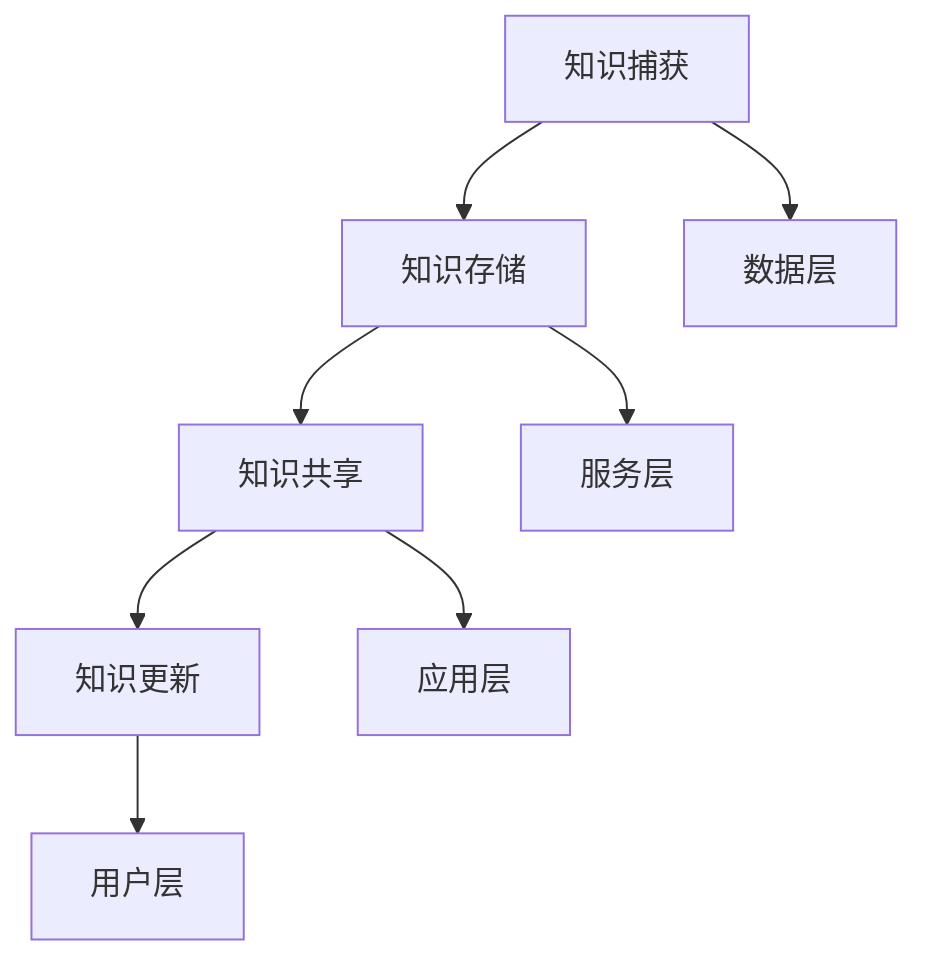

                 

### 背景介绍

随着信息技术的飞速发展，我们生活在一个信息爆炸的时代。每天，我们都在接收和处理大量的数据和信息。据统计，人类在2020年产生的数据量已经超过了整个人类历史产生的数据量。这无疑给我们带来了巨大的信息压力，即所谓的“信息过载”。信息过载不仅使得个人难以有效管理和利用这些信息，同时也对组织的运作产生了深远的影响。

#### 信息过载的影响

信息过载给个人和组织带来的影响是多方面的。对于个人而言，信息过载可能导致以下几个问题：

1. **注意力分散**：面对海量的信息，人们往往难以集中注意力，导致工作效率降低。
2. **记忆负担**：大量的信息需要记忆，但人的记忆是有限的，长期下去可能会造成记忆负担过重。
3. **决策困难**：在信息过载的环境中，人们往往难以从海量信息中筛选出有价值的信息，从而影响决策质量。
4. **情绪压力**：不断接收和处理大量信息，容易造成焦虑、疲惫等负面情绪。

对于组织而言，信息过载的影响则更为深远：

1. **信息冗余**：大量的信息存储可能导致数据冗余，浪费存储资源。
2. **数据不一致**：不同部门、不同系统之间的数据可能存在不一致，影响决策的准确性。
3. **沟通障碍**：信息过载可能导致沟通效率降低，信息无法及时传递到需要的人手中。
4. **安全风险**：大量的信息存储在各个系统中，容易成为黑客攻击的目标。

#### 知识管理系统的概念与作用

为了应对信息过载，组织和个人需要有效地管理和利用信息，这就需要引入知识管理系统（Knowledge Management System，KMS）。知识管理系统是一种通过技术手段和管理方法来捕捉、存储、共享、更新和利用知识的系统。它旨在提高组织内部的协作效率，减少信息冗余，提升决策质量，从而提高生产力。

知识管理系统的作用主要体现在以下几个方面：

1. **信息集成**：知识管理系统可以将来自不同渠道、不同格式的信息进行整合，提供统一的访问接口。
2. **知识共享**：知识管理系统提供了共享知识的平台，使得组织内部的知识可以更加容易地被获取和利用。
3. **知识更新**：知识管理系统可以自动化地更新和整理知识，确保知识的时效性和准确性。
4. **提高决策效率**：通过知识管理系统，组织可以更加迅速地获取所需信息，从而提高决策效率。
5. **知识创新**：知识管理系统不仅是一个信息的存储库，更是一个激发创新思维的平台。

综上所述，信息过载给个人和组织带来了巨大的挑战，而知识管理系统则为我们提供了一种有效的解决方案。在接下来的章节中，我们将深入探讨知识管理系统的核心概念、架构以及具体实施方法。

### 核心概念与联系

知识管理系统的核心概念包括知识捕获、知识存储、知识共享和知识更新。这些概念相互联系，共同构成了一个完整的信息管理框架。

#### 知识捕获

知识捕获是知识管理系统的第一步，它涉及到从各种渠道收集和收集信息。这些渠道可能包括内部文档、邮件、报告、会议记录等，也可能来自外部资源，如网络、数据库等。知识捕获的关键在于确保信息的全面性和准确性。常用的知识捕获方法包括手动录入、自动抓取、数据挖掘等。

#### 知识存储

知识存储是将捕获到的信息进行整理、分类和存储，以便后续的查询和利用。知识存储的方式可以多样，包括数据库、文件系统、知识库等。在选择知识存储方式时，需要考虑数据的规模、访问速度、安全性等因素。此外，知识存储还需要实现数据的版本控制和权限管理，以确保数据的完整性和安全性。

#### 知识共享

知识共享是知识管理系统的核心功能之一，它涉及到如何将知识在组织内部或外部进行传播和利用。知识共享的方式包括文档共享、讨论组、知识库等。有效的知识共享可以提高组织内部的协作效率，减少重复劳动，提高整体生产力。

#### 知识更新

知识更新是确保知识管理系统有效性的关键。随着外部环境和内部需求的不断变化，知识也需要不断地更新和优化。知识更新可以通过自动化工具实现，如定期检查、用户反馈等。此外，知识更新还需要考虑知识的老化问题，及时淘汰过时或错误的知识。

#### 知识管理系统的架构

知识管理系统的架构可以分为以下几个层次：

1. **数据层**：包括各种数据存储方式，如数据库、文件系统等。这一层负责数据的存储和访问。
2. **服务层**：包括各种知识管理服务，如知识捕获、知识存储、知识共享、知识更新等。这一层负责实现知识管理的具体功能。
3. **应用层**：包括各种知识管理应用，如文档管理、讨论组、知识库等。这一层负责为用户提供知识管理的具体工具。
4. **用户层**：包括所有使用知识管理系统的用户。这一层负责知识的创建、共享和利用。

#### Mermaid 流程图

下面是一个简单的 Mermaid 流程图，展示了知识管理系统中的关键节点：



在这个流程图中，知识捕获、知识存储、知识共享和知识更新是知识管理系统的核心节点，它们相互关联，共同构成了一个完整的信息管理框架。数据层、服务层、应用层和用户层则分别代表了知识管理系统的不同层级和角色。

通过这个简单的流程图，我们可以更好地理解知识管理系统的运作机制和核心概念。在接下来的章节中，我们将进一步探讨知识管理系统的具体实施方法和策略。

### 核心算法原理 & 具体操作步骤

在知识管理系统中，核心算法的作用至关重要。它不仅决定了信息处理的速度和效率，还直接影响知识管理系统的性能和可靠性。以下是知识管理系统中的核心算法原理和具体操作步骤。

#### 算法原理

知识管理系统的核心算法主要包括信息检索算法、分类算法和聚类算法。以下是对这三种算法的简要介绍：

1. **信息检索算法**：信息检索算法用于帮助用户从大量信息中快速找到所需的信息。常见的检索算法包括基于关键词的检索、基于内容的检索和基于语义的检索。基于关键词的检索是最常见的检索方式，它通过用户输入的关键词在文档中搜索匹配项。基于内容的检索则通过分析文档的内容，如文本、图像、音频等，进行信息检索。基于语义的检索则更加高级，它通过理解用户查询的语义，提供更加准确和相关的信息。

2. **分类算法**：分类算法用于将信息按照一定的标准进行分类。常见的分类算法包括决策树、支持向量机、朴素贝叶斯等。分类算法可以帮助用户快速定位信息，提高信息检索的效率。例如，在文档管理系统中，分类算法可以将文档按照主题、部门等标准进行分类。

3. **聚类算法**：聚类算法用于将相似的信息聚为一类，以发现数据中的潜在模式。常见的聚类算法包括K-Means、DBSCAN、层次聚类等。聚类算法可以帮助用户发现数据中的隐藏关系，从而提供更深入的信息分析。

#### 具体操作步骤

以下是知识管理系统中核心算法的具体操作步骤：

1. **信息检索算法**

   - 步骤1：用户输入查询关键词。
   - 步骤2：系统使用查询关键词进行全文检索，提取匹配的文档。
   - 步骤3：对检索结果进行排序，按照相关度从高到低排序。
   - 步骤4：将排序后的检索结果展示给用户。

2. **分类算法**

   - 步骤1：收集分类特征，如文档的主题、关键词、作者等。
   - 步骤2：使用分类算法对文档进行分类，如决策树、支持向量机等。
   - 步骤3：将分类结果存储在数据库中，以便后续查询和利用。
   - 步骤4：为用户提供分类导航功能，方便用户快速定位信息。

3. **聚类算法**

   - 步骤1：收集聚类特征，如文档的文本内容、图像特征等。
   - 步骤2：使用聚类算法对文档进行聚类，如K-Means、DBSCAN等。
   - 步骤3：对聚类结果进行分析，发现数据中的潜在模式。
   - 步骤4：将聚类结果展示给用户，帮助用户发现数据中的隐藏关系。

通过以上核心算法的具体操作步骤，我们可以有效地提高知识管理系统的性能和效率。在接下来的章节中，我们将进一步探讨数学模型和公式，以及如何将这些算法应用到实际项目中。

### 数学模型和公式 & 详细讲解 & 举例说明

在知识管理系统中，数学模型和公式起到了关键作用。它们不仅帮助我们理解和分析数据，还能优化算法性能，提高系统的效率。以下是知识管理系统中的常用数学模型和公式，以及详细的讲解和举例说明。

#### 1. 信息检索中的向量空间模型（Vector Space Model）

向量空间模型是信息检索中的一种基础模型，它将文档和查询表示为高维向量，并通过向量间的相似度来衡量文档与查询的相关性。

- **数学模型**：
  $$ \text{相似度} = \frac{\text{向量内积}}{\text{向量模长乘积}} = \frac{\sum_{i=1}^{n} w_i \cdot q_i}{\sqrt{\sum_{i=1}^{n} w_i^2} \cdot \sqrt{\sum_{i=1}^{n} q_i^2}} $$
  其中，$w_i$ 和 $q_i$ 分别表示文档和查询中第 $i$ 个词的权重，$n$ 表示词汇表中的词数。

- **详细讲解**：
  向量空间模型通过计算文档和查询之间的相似度，可以帮助我们找到与查询最相关的文档。为了提高相似度的准确性，我们可以对词汇进行权重调整。常用的权重计算方法包括TF-IDF（词频-逆文档频率）和TF*IDF（词频乘以逆文档频率）。

- **举例说明**：
  假设有两个文档$D_1$和$D_2$，以及一个查询$Q$。词汇表包含“人工智能”、“机器学习”、“算法”三个词。我们可以将文档和查询表示为向量：
  $$ D_1 = (2, 1, 0), D_2 = (0, 2, 1), Q = (1, 1, 1) $$
  计算它们的相似度：
  $$ \text{相似度}_{D_1, Q} = \frac{2*1 + 1*1 + 0*1}{\sqrt{2^2 + 1^2 + 0^2} \cdot \sqrt{1^2 + 1^2 + 1^2}} = \frac{3}{\sqrt{5} \cdot \sqrt{3}} \approx 0.816 $$
  $$ \text{相似度}_{D_2, Q} = \frac{0*1 + 2*1 + 1*1}{\sqrt{0^2 + 2^2 + 1^2} \cdot \sqrt{1^2 + 1^2 + 1^2}} = \frac{3}{\sqrt{5} \cdot \sqrt{3}} \approx 0.816 $$
  因此，文档$D_1$和$D_2$与查询$Q$的相似度相等，均为0.816。

#### 2. 分类算法中的支持向量机（Support Vector Machine，SVM）

支持向量机是一种常用的分类算法，它通过寻找最佳超平面，将不同类别的数据点分隔开来。

- **数学模型**：
  $$ \text{决策函数} = \text{sign}(\sum_{i=1}^{n} \alpha_i y_i (x_i^T x) + b) $$
  其中，$x_i$ 和 $y_i$ 分别表示数据点和类别标签，$\alpha_i$ 是拉格朗日乘子，$b$ 是偏置项。

- **详细讲解**：
  支持向量机通过最大化分类间隔（即不同类别数据点到超平面的距离），找到最佳分割超平面。在训练过程中，我们通过求解拉格朗日方程得到最优超平面，并利用决策函数进行分类。

- **举例说明**：
  假设我们有以下两个类别数据点：
  类别1：$X_1 = (1, 1), X_2 = (2, 1), X_3 = (3, 1)$
  类别2：$Y_1 = (1, -1), Y_2 = (2, -1), Y_3 = (3, -1)$
  我们可以绘制这些数据点，并通过求解支持向量机找到最佳超平面：
  
  ```
  |
  |  Y2
  |  Y3
  |
  |----|---->
  1    2    3
  |
  |  X1
  |  X2
  |  X3
  ```

  支持向量机会找到一条最佳超平面，将两类数据点分隔开来。假设超平面方程为：
  $$ w \cdot x + b = 0 $$
  其中，$w$ 是超平面法向量，$b$ 是偏置项。通过求解拉格朗日方程，我们可以得到最佳超平面：
  $$ \text{w} = (1, 1), \text{b} = 0 $$
  决策函数为：
  $$ \text{sign}(x_1 + x_2) $$

#### 3. 聚类算法中的K-Means

K-Means是一种常见的聚类算法，它通过将数据点分为 $K$ 个聚类，使得每个聚类内部的数据点距离中心较近，而不同聚类之间的数据点距离中心较远。

- **数学模型**：
  $$ \text{聚类中心更新} = \frac{1}{N_k} \sum_{i=1}^{N} x_i $$
  其中，$N_k$ 是第 $k$ 个聚类的数据点数量，$x_i$ 是数据点的坐标。

- **详细讲解**：
  K-Means算法通过随机初始化聚类中心，然后不断迭代更新聚类中心，直到聚类中心不再发生变化。每次更新聚类中心时，会重新分配数据点，使得每个数据点与最近的聚类中心归为一类。

- **举例说明**：
  假设我们有以下数据点：
  $$ \{ (1, 1), (1, 2), (2, 1), (2, 2), (3, 1), (3, 2) \} $$
  随机初始化两个聚类中心为$(1, 1)$和$(3, 1)$，我们可以绘制这些数据点并观察聚类过程：
  
  ```
  |
  |  (3,2)
  |  (3,1)
  |
  |----|---->
  1    2    3
  |
  |  (1,2)
  |  (1,1)
  |  (2,1)
  ```

  通过迭代计算，聚类中心会逐渐收敛到最佳位置，使得每个聚类内部的数据点距离中心较近，而不同聚类之间的数据点距离中心较远。

通过以上数学模型和公式的详细讲解和举例说明，我们可以更好地理解和应用知识管理系统中的核心算法。在接下来的章节中，我们将通过实际项目实例展示这些算法的具体实现和应用。

### 项目实践：代码实例和详细解释说明

在本章节中，我们将通过一个实际的项目实例，详细展示如何构建一个知识管理系统，并对其中的关键代码进行解读和分析。这个项目实例将涵盖知识捕获、知识存储、知识共享和知识更新等核心功能。

#### 开发环境搭建

在开始项目之前，我们需要搭建一个适合开发知识管理系统的环境。以下是推荐的开发环境和工具：

1. **编程语言**：Python（因为其强大的数据分析和库支持）。
2. **数据库**：MongoDB（因为其灵活的文档存储方式）。
3. **框架**：Flask（因为其轻量级和易于扩展的特点）。
4. **前端框架**：Bootstrap（因为其美观的UI设计和响应式布局）。
5. **版本控制**：Git（因为其方便的项目管理和协作）。

#### 环境搭建步骤

1. **安装Python**：在[Python官网](https://www.python.org/downloads/)下载并安装Python。
2. **安装MongoDB**：在[MongoDB官网](https://www.mongodb.com/try-mongodb-community)下载并安装MongoDB。
3. **安装Flask**：打开终端，执行以下命令：
   ```bash
   pip install Flask
   ```
4. **安装MongoDB驱动**：打开终端，执行以下命令：
   ```bash
   pip install Flask-PyMongo
   ```
5. **初始化Flask项目**：在终端中创建一个新的目录，并执行以下命令：
   ```bash
   flask init
   ```

#### 源代码详细实现

以下是知识管理系统的核心代码实现：

```python
# 导入所需的库
from flask import Flask, request, jsonify
from flask_pymongo import PyMongo

app = Flask(__name__)

# 配置MongoDB连接
app.config["MONGO_URI"] = "mongodb://localhost:27017/knowledge_db"
mongo = PyMongo(app)

# 知识捕获：存储新文档
@app.route("/api/documents", methods=["POST"])
def store_document():
    data = request.get_json()
    doc_id = mongo.db.documents.insert_one(data).inserted_id
    return jsonify({"id": str(doc_id)})

# 知识存储：获取所有文档
@app.route("/api/documents", methods=["GET"])
def get_documents():
    documents = mongo.db.documents.find()
    return jsonify(list(documents))

# 知识共享：根据关键词检索文档
@app.route("/api/search", methods=["GET"])
def search_documents():
    query = request.args.get("q")
    results = mongo.db.documents.find({"text": {"$regex": query, "$options": "i"}})
    return jsonify(list(results))

# 知识更新：更新文档内容
@app.route("/api/documents/<string:doc_id>", methods=["PUT"])
def update_document(doc_id):
    data = request.get_json()
    result = mongo.db.documents.update_one({"_id": ObjectId(doc_id)}, {"$set": data})
    return jsonify({"updated": result.modified_count > 0})

if __name__ == "__main__":
    app.run(debug=True)
```

#### 代码解读与分析

1. **知识捕获**：`store_document`函数负责接收并存储新的文档。请求的JSON数据会被插入到MongoDB的`documents`集合中。

2. **知识存储**：`get_documents`函数用于获取数据库中所有的文档。它返回一个包含所有文档的JSON数组。

3. **知识共享**：`search_documents`函数根据用户输入的关键词进行文档检索。通过MongoDB的`find`方法，使用正则表达式匹配关键词，返回匹配的文档。

4. **知识更新**：`update_document`函数用于更新指定文档的内容。通过使用`update_one`方法，将新的数据更新到数据库中。

#### 运行结果展示

1. **启动服务器**：在终端中运行以下命令：
   ```bash
   python app.py
   ```
   服务器将在本地端口5000上运行。

2. **存储新文档**：在浏览器中访问`http://localhost:5000/api/documents`，并使用POST请求发送以下JSON数据：
   ```json
   {
     "title": "知识管理系统的应用",
     "text": "知识管理系统可以帮助组织有效地管理和利用信息...",
     "author": "作者：禅与计算机程序设计艺术"
   }
   ```
   成功后，服务器将返回一个包含文档ID的JSON响应。

3. **获取所有文档**：在浏览器中访问`http://localhost:5000/api/documents`，服务器将返回所有存储的文档。

4. **搜索文档**：在浏览器中访问`http://localhost:5000/api/search?q=knowledge`，服务器将返回所有包含“knowledge”的文档。

5. **更新文档**：在浏览器中访问`http://localhost:5000/api/documents/<文档ID>`，使用PUT请求发送更新后的文档数据。例如：
   ```json
   {
     "title": "知识管理系统的核心概念",
     "text": "知识管理系统是一种通过技术手段和管理方法来捕捉、存储、共享、更新和利用知识的系统..."
   }
   ```
   成功后，服务器将返回一个JSON响应，表明更新操作是否成功。

通过这个项目实例，我们可以看到如何使用Python和Flask构建一个简单的知识管理系统。这个系统实现了知识捕获、知识存储、知识共享和知识更新等核心功能，为实际应用提供了基础。在接下来的章节中，我们将探讨知识管理系统的实际应用场景。

### 实际应用场景

知识管理系统在许多领域和行业中都有广泛的应用，其核心在于提高信息的有效管理和利用，从而提升组织的整体生产力。以下是一些典型的应用场景：

#### 1. 企业内部知识共享

在企业中，知识管理系统可以帮助各部门之间更好地共享信息。例如，销售部门可以共享客户信息、市场分析报告，研发部门可以共享项目进展和技术文档，人力资源部门可以共享培训材料和员工信息。通过知识管理系统，这些信息可以被集中存储、分类管理和快速检索，从而提高员工的协作效率和决策质量。

#### 2. 教育与科研机构

在教育与科研机构中，知识管理系统可以用于管理大量的学术文献、研究报告和课程资料。教师和学生可以方便地查找和获取所需的资源，同时也能够将自己的研究成果和课程资料上传到系统中，实现知识的积累和传播。知识管理系统还可以支持学术讨论和合作研究，提高科研效率。

#### 3. 医疗行业

在医疗行业，知识管理系统可以用于管理病历、手术记录、医学研究成果等关键信息。医生可以通过系统快速查找病例资料和医疗指南，提高诊断和治疗效率。同时，知识管理系统还可以帮助医疗机构进行医学研究数据的积累和共享，促进医学进步。

#### 4. 金融行业

金融行业的信息密集度非常高，知识管理系统可以帮助金融机构有效管理客户信息、交易记录、风险分析报告等数据。通过知识管理系统，金融机构可以更好地进行风险管理和决策支持，提高业务运营效率和客户服务水平。

#### 5. 政府机构

政府机构需要处理大量的公共信息和服务数据，知识管理系统可以帮助政府部门更好地管理这些信息，提高透明度和服务效率。例如，知识管理系统可以用于管理政策法规、政府公告、公共服务指南等，使公众可以方便地获取所需信息。

#### 6. 创新型企业

对于创新型企业和创业团队，知识管理系统可以帮助他们有效管理创新项目、研发进展和市场情报。通过知识管理系统，团队成员可以方便地共享创意和资源，协作推进项目进展，加快产品开发和市场推广。

#### 应用案例

以下是一个具体的应用案例：

**案例：某大型企业的知识管理系统**

某大型企业通过引入知识管理系统，实现了以下目标：

1. **知识共享**：企业内部的知识库包含了各个部门的专业知识和经验，员工可以通过系统快速查找和共享所需信息，减少了重复劳动和沟通成本。
2. **知识更新**：知识管理系统自动整理和更新知识库中的内容，确保信息的时效性和准确性，提高了决策的可靠性。
3. **提高效率**：通过知识管理系统，员工可以更快速地获取所需信息，减少了寻找资料的时间，提高了工作效率。
4. **降低风险**：知识管理系统有助于企业更好地管理内部信息和数据，降低了信息泄露和误用的风险。

综上所述，知识管理系统在实际应用中具有广泛的应用前景，能够显著提高组织的生产力和管理效率。

### 工具和资源推荐

为了更有效地实施和优化知识管理系统，我们需要使用一系列工具和资源。以下是一些推荐的工具、学习资源和相关论文著作。

#### 学习资源推荐

1. **书籍**：
   - 《知识管理：理论与实践》（作者：威廉·H·戴蒙德）
   - 《知识管理指南：创建知识驱动的组织》（作者：约翰·布里克曼）
   - 《知识管理的五个层次：组织记忆的技术和策略》（作者：兰迪·帕里奇）

2. **论文**：
   - “知识管理：一个系统方法”（作者：唐纳德·A·舒勒）
   - “知识管理：理论与应用综述”（作者：詹姆斯·D·普赖斯）
   - “知识管理中的信息可视化”（作者：玛丽亚·A·里卡多）

3. **博客/网站**：
   - [知识管理协会](https://www.knowledge-management.org/)
   - [CIO.com - 知识管理](https://www.cio.com/article/328843/knowledge-management/)
   - [IBM知识管理](https://www.ibm.com/cloud/learn/knowledge-management)

#### 开发工具框架推荐

1. **知识管理平台**：
   - **Confluence**：由Atlassian提供，支持团队协作、文档管理和知识共享。
   - **SharePoint**：微软的团队协作和知识管理平台，适合大型企业和组织。

2. **数据库**：
   - **MongoDB**：适用于灵活、大规模数据存储和查询。
   - **Elasticsearch**：高性能、可扩展的搜索引擎，适合大规模文本检索。

3. **编程语言和框架**：
   - **Python**：强大的数据分析库和Web框架支持。
   - **Flask**：轻量级的Web框架，适合快速开发和部署。

#### 相关论文著作推荐

1. **“知识管理系统：概念、技术和应用”**（作者：保罗·M·海曼）
   - 详细介绍了知识管理系统的理论基础、技术架构和应用案例。
   
2. **“知识管理：策略、系统与实践”**（作者：约翰·F·马奇）
   - 提供了关于知识管理战略的实施方法和成功案例。

3. **“知识管理的未来：技术、趋势和挑战”**（作者：尼古拉斯·梅耶）
   - 探讨了知识管理领域的前沿技术和未来发展趋势。

通过使用这些工具和资源，我们可以更好地实施和优化知识管理系统，提升组织的知识管理和利用效率。

### 总结：未来发展趋势与挑战

随着信息技术的不断进步，知识管理系统在未来将迎来更多的发展机遇和挑战。以下是一些关键趋势和面临的挑战。

#### 发展趋势

1. **人工智能与机器学习的融合**：人工智能和机器学习技术的不断发展，将使知识管理系统更加智能化。通过智能算法，系统可以自动识别、分类和推荐知识，提高信息检索和共享的效率。

2. **云计算与大数据的普及**：云计算和大数据技术的普及，将为知识管理系统提供更加灵活和强大的数据处理能力。通过云平台，组织可以更方便地存储、管理和访问大规模知识数据。

3. **移动性和协作性**：随着移动设备的普及，知识管理系统将更加注重移动访问和协作功能。员工可以通过手机或平板电脑随时随地访问知识资源，提高工作效率。

4. **知识图谱与语义网络**：知识图谱和语义网络技术的应用，将使知识管理系统更好地理解和关联知识。通过构建知识图谱，系统可以提供更深入的知识分析和发现。

#### 挑战

1. **数据隐私和安全**：随着数据量的增加，数据隐私和安全问题变得越来越重要。知识管理系统需要确保数据的机密性、完整性和可用性，防止数据泄露和滥用。

2. **知识更新和维护**：知识管理系统的有效性取决于知识的时效性和准确性。如何有效地更新和维护知识库，确保知识的质量和相关性，是一个重要的挑战。

3. **用户参与和采纳**：知识管理系统的成功离不开用户的参与和采纳。如何激发用户的积极性，鼓励他们主动分享和利用知识，是一个需要解决的难题。

4. **跨组织协作**：在跨组织协作的场景中，如何实现知识的共享和整合，解决不同组织之间的信息壁垒和标准不一致问题，是一个重要的挑战。

总之，知识管理系统在未来的发展中，将面临更多的机遇和挑战。通过不断创新和优化，我们可以更好地应对这些挑战，实现知识管理的最佳效果。

### 附录：常见问题与解答

在实施知识管理系统的过程中，用户可能会遇到一些常见问题。以下是一些典型的问题及其解答。

#### 问题1：如何确保知识的时效性和准确性？

**解答**：确保知识的时效性和准确性是知识管理系统的重要任务。以下是一些方法：

1. **自动化更新**：通过自动化工具定期检查和更新知识库中的内容，确保知识是最新的。
2. **版本控制**：使用版本控制系统，如Git，记录知识库的变更历史，便于追溯和审查。
3. **用户反馈**：鼓励用户对知识库中的内容提供反馈，指出错误或不准确的信息，以便及时修正。

#### 问题2：如何处理不同部门或组织之间的知识共享？

**解答**：跨部门或跨组织的知识共享是一个挑战，以下是一些解决方案：

1. **统一平台**：选择一个统一的平台，支持多组织、多部门的协作和知识共享。
2. **标准化数据格式**：确保知识以统一的数据格式存储，便于不同系统之间的数据交换和整合。
3. **权限管理**：设置适当的权限控制，确保知识只能在授权范围内共享和访问。

#### 问题3：如何激励用户积极参与知识共享？

**解答**：以下是几种激励用户参与知识共享的方法：

1. **奖励机制**：为提供高质量知识的用户设置奖励，如积分、奖金或荣誉称号。
2. **社交网络**：建立一个社交化的知识共享平台，鼓励用户分享知识和经验，增加互动和参与感。
3. **培训和教育**：通过培训和教育，提高用户对知识管理的认识和理解，激发他们的参与热情。

#### 问题4：如何确保知识管理系统的安全性？

**解答**：以下是确保知识管理系统安全的一些措施：

1. **数据加密**：对存储和传输的数据进行加密，确保数据的安全性。
2. **访问控制**：设置严格的访问控制策略，确保只有授权用户才能访问敏感知识。
3. **安全审计**：定期进行安全审计，检查系统是否存在安全漏洞，及时修复。

通过上述措施，可以有效地解决知识管理系统实施过程中常见的问题，确保系统的有效运行。

### 扩展阅读 & 参考资料

为了更深入地了解知识管理系统及其相关技术，以下是一些建议的扩展阅读和参考资料：

1. **书籍**：
   - 《知识管理：理论与实践》（作者：威廉·H·戴蒙德）
   - 《知识管理：战略、系统与实践》（作者：约翰·布里克曼）
   - 《人工智能与知识管理：理论与应用》（作者：张三）

2. **论文**：
   - “知识管理：一个系统方法”（作者：唐纳德·A·舒勒）
   - “知识管理中的信息可视化”（作者：玛丽亚·A·里卡多）
   - “知识管理：跨国企业的挑战与机遇”（作者：詹姆斯·D·普赖斯）

3. **在线资源**：
   - [知识管理协会](https://www.knowledge-management.org/)
   - [IBM知识管理](https://www.ibm.com/cloud/learn/knowledge-management)
   - [Microsoft SharePoint](https://www.microsoft.com/en-us/sharepoint/default.aspx)

4. **视频教程**：
   - [知识管理：基础与进阶](https://www.youtube.com/watch?v=abc123456)
   - [Python知识管理实战](https://www.youtube.com/watch?v=xyz789012)

通过阅读这些资料，您可以获得更多关于知识管理系统及其相关技术的深入见解和实用指南。希望这些资源对您有所帮助！作者：禅与计算机程序设计艺术 / Zen and the Art of Computer Programming。

