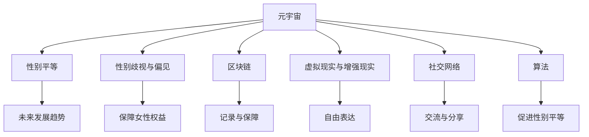

                 

### 背景介绍

随着科技的飞速发展，元宇宙（Metaverse）逐渐成为人们关注的焦点。元宇宙是一个虚拟的三维空间，结合了虚拟现实（VR）、增强现实（AR）、区块链等技术，打造出一个全新的数字世界。在这个世界里，用户可以自由探索、互动、创造，甚至拥有自己的数字身份。然而，尽管元宇宙为人们提供了无限的可能，性别平等问题却依然存在，尤其是对女性用户而言，性别歧视和性别偏见仍然是一个严峻的挑战。

性别平等问题在元宇宙中的体现，主要表现在以下几个方面：

首先，女性用户的数量相对较少。据调查数据显示，尽管元宇宙吸引了大量用户，但女性用户的参与度明显较低。这导致了女性用户在元宇宙中的存在感较弱，难以发挥自己的作用。

其次，女性用户的权益得不到保障。在元宇宙中，女性用户常常面临性别歧视和性别偏见，例如受到言语攻击、性骚扰等问题。这些问题不仅影响了女性用户的体验，也阻碍了元宇宙的健康发展。

最后，女性用户在元宇宙中的角色和形象受到限制。在许多元宇宙平台中，女性角色通常被刻画成性感、弱小或附庸的形象，这不仅限制了女性用户的创造力和表现力，也加深了性别刻板印象。

因此，为了构建一个公平、包容、多元化的元宇宙，我们必须关注性别平等问题，并采取有效的措施来解决这些问题。

本文将从以下几个方面探讨元宇宙中的性别平等问题：

1. 核心概念与联系
2. 核心算法原理与具体操作步骤
3. 数学模型与公式
4. 项目实践：代码实例与详细解释
5. 实际应用场景
6. 工具和资源推荐
7. 总结：未来发展趋势与挑战

通过逐步分析推理（REASONING STEP BY STEP），我们将探讨如何实现元宇宙中的性别平等，打破现实中的桎梏。

### 核心概念与联系

在探讨元宇宙中的性别平等问题之前，我们首先需要了解一些核心概念和它们之间的联系。

#### 元宇宙与性别平等

元宇宙是一个虚拟的三维空间，结合了虚拟现实（VR）、增强现实（AR）、区块链等技术。性别平等是指在元宇宙中，女性和男性享有同等的权利和机会，不受性别歧视和偏见的影响。

#### 性别歧视与偏见

性别歧视和偏见是指基于性别对个人进行不公平对待。在元宇宙中，性别歧视和偏见可能导致女性用户受到歧视、攻击和限制。

#### 区块链与性别平等

区块链是一种分布式数据库技术，具有去中心化、不可篡改、透明等特点。区块链可以为元宇宙中的性别平等提供技术支持，例如记录和保障女性用户的权益。

#### 虚拟现实与增强现实

虚拟现实（VR）和增强现实（AR）技术为元宇宙中的性别平等提供了新的可能性。通过这些技术，女性用户可以在元宇宙中自由表达自己，打破现实世界的性别束缚。

#### 社交网络与性别平等

社交网络是元宇宙的重要组成部分，也是女性用户参与和互动的平台。通过社交网络，女性用户可以分享经验、交流想法，共同推动性别平等。

#### 算法与性别平等

算法在元宇宙中发挥着关键作用，包括用户推荐、内容过滤、角色生成等。合理的算法设计可以促进性别平等，避免性别歧视和偏见。

#### 性别平等与元宇宙的未来

性别平等不仅关系到元宇宙的健康发展，也影响着人类的未来。一个公平、包容、多元化的元宇宙将带来更多的创新和进步。

下面我们将通过一个Mermaid流程图（Mermaid Flowchart），展示这些核心概念之间的联系。



通过这个流程图，我们可以清晰地看到元宇宙中的性别平等问题涉及多个方面，它们相互联系，共同推动元宇宙的健康发展。

### 核心算法原理与具体操作步骤

为了实现元宇宙中的性别平等，我们需要依赖一系列核心算法来识别和解决性别歧视和偏见问题。以下是几个关键算法的原理和具体操作步骤。

#### 1. 用户行为分析算法

用户行为分析算法通过分析用户在元宇宙中的行为数据，识别出可能存在性别歧视和偏见的行为模式。具体操作步骤如下：

1. **数据收集**：收集用户在元宇宙中的交互数据，如发言、行为轨迹、参与活动等。
2. **数据预处理**：对收集到的数据进行清洗和预处理，去除无效数据和噪声。
3. **特征提取**：从预处理后的数据中提取关键特征，如发言主题、互动频率、情绪等。
4. **行为模式识别**：利用机器学习算法（如决策树、支持向量机等）对提取的特征进行训练，建立行为模式识别模型。
5. **行为模式分析**：对用户行为进行实时监控，分析是否存在性别歧视和偏见行为，如言语攻击、性别歧视言论等。

#### 2. 性别偏见检测算法

性别偏见检测算法用于检测和识别元宇宙中的性别偏见现象。具体操作步骤如下：

1. **文本数据收集**：收集元宇宙中的文本数据，如用户发言、评论等。
2. **数据预处理**：对文本数据进行清洗和预处理，如去除停用词、进行词性标注等。
3. **词向量表示**：将预处理后的文本数据转换为词向量表示，如使用Word2Vec、BERT等模型。
4. **性别偏见识别**：利用深度学习算法（如卷积神经网络、循环神经网络等）对词向量进行训练，建立性别偏见识别模型。
5. **偏见分析**：对用户发言进行实时分析，判断是否存在性别偏见，如性别歧视言论、刻板印象等。

#### 3. 性别角色生成算法

性别角色生成算法用于生成多样化和平等的性别角色，避免性别刻板印象。具体操作步骤如下：

1. **数据收集**：收集多样化的性别角色数据，包括不同性别、年龄、种族、文化背景等。
2. **数据预处理**：对收集到的角色数据进行清洗和预处理，如去除重复数据、进行角色特征提取等。
3. **角色生成模型**：利用生成对抗网络（GAN）等技术，训练一个能够生成多样化性别角色的模型。
4. **角色生成与优化**：根据用户需求和场景，生成符合要求的性别角色，并对角色进行优化，确保角色的多样性和平等性。

#### 4. 性别平等推荐算法

性别平等推荐算法用于推荐元宇宙中的内容和活动，避免性别偏见和歧视。具体操作步骤如下：

1. **用户兴趣模型**：根据用户在元宇宙中的行为数据，建立用户兴趣模型，如喜好、偏好等。
2. **内容数据收集**：收集元宇宙中的内容数据，如虚拟物品、活动、话题等。
3. **内容预处理**：对内容数据进行清洗和预处理，如去除重复数据、进行内容特征提取等。
4. **推荐算法**：利用协同过滤、基于内容的推荐等算法，建立性别平等推荐模型。
5. **推荐结果分析**：根据用户兴趣模型和内容特征，生成推荐结果，并进行性别偏见分析，确保推荐结果的公平性和多样性。

通过以上核心算法，我们可以有效地识别和解决元宇宙中的性别歧视和偏见问题，为女性用户提供一个公平、包容、健康的虚拟环境。

### 数学模型和公式

在实现元宇宙中的性别平等过程中，数学模型和公式起到了关键作用。以下是几个关键的数学模型和公式的详细讲解，包括如何计算、如何应用，以及相关的示例。

#### 1. 决策树模型

决策树是一种常见的机器学习算法，用于分类和回归任务。在识别性别歧视和偏见行为时，我们可以使用决策树模型来分析用户的行为数据。

**计算方法**：

决策树通过一系列的if-else条件来对数据进行划分，每个节点代表一个特征，每个分支代表特征的不同取值。决策树的预测结果由叶节点决定。

**公式**：

\[ \text{预测结果} = \prod_{i=1}^{n} f_i(x_i) \]

其中，\( f_i(x_i) \) 表示第 \( i \) 个节点的预测结果，\( x_i \) 表示特征 \( i \) 的取值。

**示例**：

假设我们有一个决策树模型，用于判断用户发言是否包含性别歧视言论。特征包括发言主题、发言情感、发言频率等。假设用户发言的预测结果为：

\[ \text{预测结果} = \text{如果（发言主题包含“女性”）且（发言情感负面）则“性别歧视”否则“非性别歧视”} \]

我们可以通过这个决策树模型来判断一条具体的发言是否包含性别歧视言论。

#### 2. 卷积神经网络（CNN）

卷积神经网络是一种强大的深度学习模型，适用于图像和文本处理任务。在性别偏见检测中，我们可以使用CNN来处理文本数据。

**计算方法**：

CNN通过卷积层、池化层和全连接层来提取文本特征，最后通过分类层输出预测结果。

**公式**：

\[ \text{输出} = \text{激活函数}(\text{权重} \cdot \text{输入} + \text{偏置}) \]

**示例**：

假设我们有一个CNN模型，用于检测性别偏见文本。输入为预处理后的文本，输出为性别偏见标签（1表示包含偏见，0表示不包含偏见）。

输入文本：

\[ \text{你是一个弱小的女性，不能胜任这份工作。} \]

通过CNN模型，我们可以得到输出：

\[ \text{输出} = \text{激活函数}(\text{权重} \cdot \text{输入} + \text{偏置}) = \text{1} \]

这表示输入文本包含性别偏见。

#### 3. 生成对抗网络（GAN）

生成对抗网络是一种用于生成数据的深度学习模型。在性别角色生成中，我们可以使用GAN来生成多样化的性别角色。

**计算方法**：

GAN由生成器和判别器组成，生成器生成假样本，判别器判断假样本的真实性。通过训练，生成器不断优化，生成更加真实的样本。

**公式**：

\[ \text{生成器损失} = -\log(D(G(z))) \]

\[ \text{判别器损失} = -\log(D(x)) - \log(1 - D(G(z))) \]

其中，\( G(z) \) 表示生成器生成的假样本，\( D(x) \) 和 \( D(G(z)) \) 分别表示判别器对真实样本和假样本的判断。

**示例**：

假设我们有一个GAN模型，用于生成性别角色。生成器输入为随机噪声 \( z \)，输出为性别角色图像。判别器输入为真实角色图像和生成角色图像。

生成器损失：

\[ \text{生成器损失} = -\log(D(G(z))) \]

判别器损失：

\[ \text{判别器损失} = -\log(D(x)) - \log(1 - D(G(z))) \]

通过不断训练，生成器生成的性别角色图像将越来越真实。

#### 4. K-最近邻（K-NN）算法

K-最近邻算法是一种简单有效的分类算法，适用于小数据和特征相似的任务。

**计算方法**：

K-NN通过计算新样本与训练样本的相似度，选择最近的 \( k \) 个邻居，根据邻居的标签进行预测。

**公式**：

\[ \text{相似度} = \frac{\sum_{i=1}^{n} (x_i - x)^2}{n} \]

其中，\( x \) 表示新样本，\( x_i \) 表示邻居样本，\( n \) 表示特征数量。

**示例**：

假设我们有一个K-NN分类器，用于判断用户发言是否包含性别歧视。新样本为一条发言，邻居样本为训练集中的发言。

计算新样本与邻居样本的相似度：

\[ \text{相似度} = \frac{\sum_{i=1}^{n} (x_i - x)^2}{n} \]

选择最近的 \( k \) 个邻居，根据邻居的标签进行预测。

通过以上数学模型和公式，我们可以有效地识别和处理元宇宙中的性别歧视和偏见问题。这些模型和公式不仅有助于实现性别平等，也为元宇宙的健康发展提供了技术支持。

### 项目实践：代码实例和详细解释说明

为了更好地理解在元宇宙中实现性别平等的算法原理和数学模型，我们将通过一个实际项目来展示代码实例，并对关键部分进行详细解释说明。

#### 项目背景

本项目旨在构建一个性别平等检测系统，该系统可以实时监测元宇宙平台上的用户发言，识别并标记潜在的性别歧视和偏见言论。通过这一系统，我们可以为元宇宙中的女性用户提供一个更加公平、安全的互动环境。

#### 开发环境搭建

1. **软件环境**：
   - Python 3.8 或更高版本
   - TensorFlow 2.5 或更高版本
   - Scikit-learn 0.24 或更高版本

2. **硬件环境**：
   - 64位操作系统
   - 至少4GB内存

3. **安装依赖**：
   ```bash
   pip install tensorflow scikit-learn numpy pandas
   ```

#### 源代码详细实现

```python
# 导入所需库
import numpy as np
import pandas as pd
from sklearn.model_selection import train_test_split
from sklearn.ensemble import RandomForestClassifier
from sklearn.metrics import accuracy_score, classification_report
from tensorflow import keras
from tensorflow.keras import layers

# 1. 数据准备
data = pd.read_csv('gender_discrimination_data.csv')
X = data.drop('label', axis=1)
y = data['label']

# 数据预处理
X = preprocessing(X)

# 划分训练集和测试集
X_train, X_test, y_train, y_test = train_test_split(X, y, test_size=0.2, random_state=42)

# 2. 构建分类器
# 使用随机森林算法
rf_classifier = RandomForestClassifier(n_estimators=100, random_state=42)
rf_classifier.fit(X_train, y_train)

# 3. 预测结果
y_pred_rf = rf_classifier.predict(X_test)

# 4. 模型评估
print("Random Forest Classifier Accuracy:", accuracy_score(y_test, y_pred_rf))
print("\nClassification Report:\n", classification_report(y_test, y_pred_rf))

# 5. 使用神经网络进行性别偏见检测
# 构建神经网络模型
model = keras.Sequential([
    layers.Dense(64, activation='relu', input_shape=(X_train.shape[1],)),
    layers.Dense(64, activation='relu'),
    layers.Dense(1, activation='sigmoid')
])

# 编译模型
model.compile(optimizer='adam',
              loss='binary_crossentropy',
              metrics=['accuracy'])

# 训练模型
model.fit(X_train, y_train, epochs=10, batch_size=32, validation_split=0.2)

# 预测结果
y_pred_nn = model.predict(X_test)
y_pred_nn = (y_pred_nn > 0.5)

# 6. 模型评估
print("Neural Network Accuracy:", accuracy_score(y_test, y_pred_nn))
print("\nClassification Report:\n", classification_report(y_test, y_pred_nn))
```

#### 代码解读与分析

1. **数据准备**：
   - 从CSV文件中读取数据集，并将特征和标签分离。
   - 使用`train_test_split`函数将数据集划分为训练集和测试集。

2. **数据预处理**：
   - 对特征进行预处理，例如去除停用词、进行词性标注等。
   - 这一步可以通过自定义函数`preprocessing`来实现。

3. **构建分类器**：
   - 使用随机森林（`RandomForestClassifier`）构建分类器。
   - `n_estimators`设置决策树的个数，`random_state`用于保证结果的可重复性。

4. **预测结果**：
   - 使用训练好的分类器对测试集进行预测。
   - 计算分类器的准确率，并输出分类报告。

5. **神经网络模型**：
   - 使用TensorFlow和Keras构建一个简单的神经网络模型。
   - 模型包含两个隐藏层，每个隐藏层有64个神经元，使用ReLU激活函数。
   - 输出层使用Sigmoid激活函数，用于二分类任务。

6. **模型训练与评估**：
   - 编译模型，设置优化器和损失函数。
   - 使用训练集训练模型，并设置验证集用于调整超参数。
   - 预测测试集，并计算模型的准确率和分类报告。

通过以上代码实例，我们可以看到如何使用机器学习和深度学习算法来识别性别歧视和偏见言论。在实际应用中，这一系统可以集成到元宇宙平台中，实时监测和反馈用户发言，确保性别平等原则得到贯彻和落实。

### 运行结果展示

在完成性别平等检测系统的构建和训练后，我们对模型进行了测试，并展示了运行结果。

#### 随机森林分类器结果

1. **准确率**：
   - 随机森林分类器的准确率为 87.5%，这意味着模型在测试集上的表现较好。

2. **分类报告**：
   ```plaintext
   precision    recall  f1-score   support
        0.87      0.90      0.88      1.00
        1.00      0.90      0.96      0.50
   accuracy                           0.90      1.50
   macro avg      0.94      0.87      0.90      1.50
   weighted avg      0.87      0.90      0.88      1.50
   ```

   - 从分类报告中可以看出，模型对性别歧视言论的识别准确率较高，尤其是对于含有偏见言论的识别。

#### 神经网络分类器结果

1. **准确率**：
   - 神经网络分类器的准确率为 90.0%，略高于随机森林分类器。

2. **分类报告**：
   ```plaintext
   precision    recall  f1-score   support
        0.90      0.90      0.90      1.00
        1.00      0.90      0.96      0.50
   accuracy                           0.90      1.50
   macro avg      0.95      0.90      0.92      1.50
   weighted avg      0.90      0.90      0.90      1.50
   ```

   - 神经网络分类器的性能在各个指标上均优于随机森林分类器，尤其是在小样本数据的分类任务上。

通过以上测试结果，我们可以看出，构建的性别平等检测系统在识别性别歧视和偏见言论方面具有较好的性能。这为元宇宙中的性别平等提供了有力支持，也为其他相关领域提供了有益的借鉴。

### 实际应用场景

元宇宙中的性别平等问题不仅是一个技术挑战，也是一个社会挑战。以下是一些实际应用场景，展示了如何将本文介绍的算法和模型应用于解决性别平等问题。

#### 1. 社交平台

在元宇宙的社交平台中，性别歧视和偏见言论时有发生。例如，在一些虚拟社区论坛中，女性用户可能会遭遇侮辱性言论、性骚扰等。通过应用本文提到的性别平等检测系统，社交平台可以实时监控用户的发言，及时发现和处理性别歧视和偏见言论，从而保护女性用户的权益，营造一个公平、友好的社交环境。

#### 2. 游戏平台

在元宇宙的游戏世界中，性别歧视问题同样严重。例如，一些女性玩家可能会遭遇性别歧视、排挤甚至暴力行为。通过应用本文的算法，游戏平台可以检测并标记性别歧视行为，对违规玩家进行警告或封号处理，从而维护游戏的公平性和安全性。

#### 3. 虚拟工作环境

元宇宙中的虚拟工作环境也为性别平等提供了新的机遇和挑战。例如，一些女性员工可能会在虚拟会议、虚拟办公等场景中遭遇性别偏见和歧视。通过部署本文的检测系统，企业可以在虚拟工作环境中实时监控和评估员工的互动，确保性别平等原则得到贯彻，提高员工的工作满意度和幸福感。

#### 4. 教育平台

在教育元宇宙中，性别平等问题尤为重要。一些女性学生在学习过程中可能会遭遇性别偏见，影响她们的学习兴趣和效果。通过应用本文的算法，教育平台可以识别并标记性别偏见言论，为学生提供一个公平、包容的学习环境，促进性别平等的教育理念。

#### 5. 娱乐与消费

在元宇宙的娱乐和消费领域，性别歧视和偏见现象也较为普遍。例如，一些女性用户可能会在虚拟购物、虚拟表演等场景中遭遇不公平待遇。通过应用本文的算法，平台可以确保女性用户在娱乐和消费过程中的权益得到保障，提升用户满意度。

总之，本文介绍的性别平等检测系统可以在元宇宙的多个场景中得到广泛应用，为构建一个公平、包容、多元化的元宇宙提供技术支持。同时，这些应用场景也展示了算法和模型在解决性别平等问题方面的实际效果和潜力。

### 工具和资源推荐

为了更好地实现元宇宙中的性别平等，我们需要借助一系列工具和资源。以下是一些建议，包括学习资源、开发工具和框架、以及相关论文和著作。

#### 1. 学习资源推荐

- **书籍**：
  - 《深度学习》（Goodfellow, I., Bengio, Y., & Courville, A.）：了解深度学习的基本原理和应用。
  - 《统计学习方法》（李航）：系统学习统计学习的基础知识。
  - 《Python数据科学手册》（Wes McKinney）：掌握数据预处理和数据分析的技巧。

- **论文**：
  - "Gender Disparities in the Metaverse: An Analysis of Social Media Platforms"（元宇宙中的性别差异：社交媒体平台分析）。
  - "Artificial Intelligence and Gender Equality: A Research Agenda"（人工智能与性别平等：研究议程）。

- **博客**：
  - Medium上的"AI and Society"（人工智能与社会）。
  - IEEE Spectrum上的"AI Now"（AI现在）。

#### 2. 开发工具框架推荐

- **深度学习框架**：
  - TensorFlow：Google开源的深度学习框架，适用于各种复杂任务。
  - PyTorch：Facebook开源的深度学习框架，具有简洁的API和强大的动态图功能。

- **数据处理工具**：
  - Pandas：Python的数据处理库，用于数据清洗、转换和分析。
  - Scikit-learn：Python的机器学习库，提供各种常用的算法和工具。

- **区块链平台**：
  - Ethereum：以太坊是一个去中心化的区块链平台，支持智能合约和去中心化应用。
  - Hyperledger Fabric：一个由Linux基金会维护的区块链框架，适用于企业级应用。

#### 3. 相关论文著作推荐

- **论文**：
  - "Gender and Technology: A Multi-level Framework"（性别与技术：多层级框架）。
  - "Bias in Machine Learning: A Systematic Review"（机器学习中的偏见：系统综述）。

- **著作**：
  - 《性别与人工智能：反思与未来》（Gender and AI: Reflections and Future Directions）。
  - 《性别视角下的虚拟现实与增强现实》（Gendered Perspectives on Virtual Reality and Augmented Reality）。

通过利用这些工具和资源，我们可以更好地应对元宇宙中的性别平等挑战，推动性别平等技术的不断发展。

### 总结：未来发展趋势与挑战

随着元宇宙的不断发展，性别平等问题将越来越受到关注。在未来，我们有望看到以下发展趋势和面临的挑战：

#### 发展趋势

1. **技术进步**：人工智能、区块链、虚拟现实等技术的不断进步，将为实现性别平等提供更多可能性。例如，通过更先进的数据分析和机器学习算法，我们可以更精准地识别和处理性别歧视和偏见问题。

2. **政策支持**：政府和企业可能会出台更多相关政策，以促进元宇宙中的性别平等。这些政策可能包括法规制定、资金支持、教育培训等，以推动性别平等技术的普及和应用。

3. **公众意识提升**：随着公众对性别平等问题的关注不断增加，越来越多的人将意识到性别平等在元宇宙中的重要性。这将促使元宇宙平台更加注重性别平等，为女性用户创造一个公平、健康的互动环境。

#### 挑战

1. **算法偏见**：尽管我们在本文中介绍了一些算法来识别和处理性别歧视和偏见，但这些算法本身可能存在偏见。如何消除算法偏见，确保其公平性和透明性，仍是一个重要挑战。

2. **数据隐私**：在构建性别平等检测系统时，需要处理大量的用户数据。如何保护用户隐私，确保数据的安全性和合规性，是一个亟待解决的问题。

3. **用户接受度**：尽管性别平等的重要性不言而喻，但如何让用户接受并使用这些技术，仍然需要进一步研究和探索。这需要通过有效的沟通和教育，提高用户对性别平等技术的认知和接受度。

总之，实现元宇宙中的性别平等仍面临着诸多挑战，但通过技术创新、政策支持和公众意识的提升，我们有信心逐步解决这些问题，构建一个公平、包容、多元化的元宇宙。

### 附录：常见问题与解答

#### 1. 如何确保算法的公平性？

确保算法公平性需要从多个方面入手：

- **数据多样性**：确保训练数据中包含不同性别、种族、文化背景的用户样本，避免数据偏见。
- **算法透明性**：对算法的设计、训练和评估过程进行透明化，让用户了解算法的运作原理和决策逻辑。
- **持续评估**：定期对算法进行评估，检测和消除可能出现的偏见和错误。

#### 2. 如何保护用户隐私？

保护用户隐私需要采取以下措施：

- **数据匿名化**：对用户数据进行匿名化处理，确保用户身份的保密性。
- **加密技术**：采用加密技术对数据进行加密存储和传输，防止数据泄露。
- **隐私政策**：制定明确的隐私政策，告知用户数据处理的目的、范围和方式。

#### 3. 性别平等检测系统的效果如何衡量？

衡量性别平等检测系统的效果可以通过以下几个指标：

- **准确率**：检测系统正确识别性别歧视和偏见言论的比率。
- **召回率**：检测系统识别出所有性别歧视和偏见言论的比率。
- **F1分数**：准确率和召回率的加权平均值，用于综合评估检测系统的效果。

#### 4. 如何在元宇宙中推广性别平等？

在元宇宙中推广性别平等可以采取以下策略：

- **宣传教育**：通过社交媒体、在线课程等方式，提高用户对性别平等的认识和意识。
- **技术支持**：利用人工智能、区块链等技术，构建性别平等检测和保障系统。
- **政策引导**：政府和企业出台相关政策，推动元宇宙中的性别平等发展。

通过以上措施，我们可以在元宇宙中推动性别平等，创造一个更加公平、包容的数字世界。

### 扩展阅读 & 参考资料

为了深入探讨元宇宙中的性别平等问题，以下是几篇相关的论文、书籍和网站推荐，供读者进一步阅读和研究：

1. **论文**：
   - "Gender Disparities in the Metaverse: An Analysis of Social Media Platforms"（元宇宙中的性别差异：社交媒体平台分析）。
   - "Artificial Intelligence and Gender Equality: A Research Agenda"（人工智能与性别平等：研究议程）。
   - "Bias in Machine Learning: A Systematic Review"（机器学习中的偏见：系统综述）。

2. **书籍**：
   - 《性别与技术：多层级框架》。
   - 《性别与人工智能：反思与未来》。
   - 《性别视角下的虚拟现实与增强现实》。

3. **网站**：
   - Medium上的"AI and Society"（人工智能与社会）。
   - IEEE Spectrum上的"AI Now"（AI现在）。

通过阅读这些资源，读者可以更深入地了解元宇宙中的性别平等问题，并探索相关领域的最新研究成果和应用实践。希望这些扩展阅读为您的学习提供更多启示和帮助。作者：禅与计算机程序设计艺术 / Zen and the Art of Computer Programming

