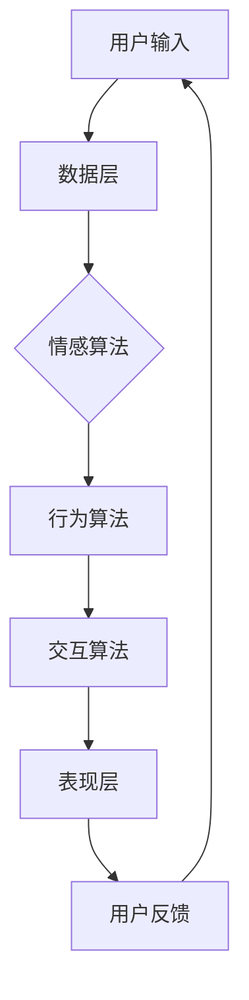

                 

### 文章标题

元宇宙中的虚拟宠物：情感陪伴的新形式

> 关键词：元宇宙，虚拟宠物，情感陪伴，人机交互，技术架构

> 摘要：本文将深入探讨元宇宙中的虚拟宠物这一新型情感陪伴形式。通过分析其背景、核心概念、算法原理、数学模型以及实际应用场景，我们将揭示虚拟宠物在情感互动、人机交互和社会价值等方面的巨大潜力。

### 1. 背景介绍

随着互联网技术的快速发展，虚拟现实（VR）和增强现实（AR）技术逐渐成熟，元宇宙这一概念也开始受到广泛关注。元宇宙被定义为一种虚拟的三维空间，用户可以在其中进行沉浸式互动和交流。虚拟宠物作为元宇宙中的一个重要组成部分，逐渐成为人们关注和研究的焦点。

虚拟宠物并不是一个全新的概念。早在20世纪90年代，虚拟宠物游戏如“宠物小精灵”、“仿真宠物”等就已经出现。然而，随着技术的进步，虚拟宠物的发展进入了一个全新的阶段。现在，虚拟宠物不仅可以在游戏中陪伴用户，还可以通过智能算法和人工智能技术实现更加真实和丰富的人际互动。

在元宇宙中，虚拟宠物作为一种情感陪伴的新形式，具有以下几个显著特点：

1. **高度个性化**：虚拟宠物可以根据用户的喜好和需求进行定制，从外观、性格到行为习惯，都能够满足用户的个性化需求。
2. **情感互动**：虚拟宠物可以通过情感算法，识别用户的情绪变化，并做出相应的反应，从而实现更加真实和深刻的情感交流。
3. **社会价值**：虚拟宠物不仅可以作为个人的情感陪伴，还可以在元宇宙中形成社交网络，为用户提供社交互动和情感支持。

### 2. 核心概念与联系

#### 2.1 虚拟宠物的定义

虚拟宠物是指通过计算机图形学、人工智能和虚拟现实技术创建的数字生命体，用户可以通过与虚拟宠物进行交互，获得情感陪伴和娱乐体验。

#### 2.2 虚拟宠物与人机交互的关系

人机交互（HCI）是虚拟宠物技术的重要组成部分。通过自然语言处理、语音识别和面部识别等技术，虚拟宠物能够理解用户的意图和情绪，并做出相应的回应。

#### 2.3 虚拟宠物技术的架构

虚拟宠物技术架构可以分为三个层次：数据层、算法层和表现层。

- **数据层**：包括用户数据、宠物数据和环境数据，用于支撑虚拟宠物的行为和学习。
- **算法层**：包括情感算法、行为算法和交互算法，用于实现虚拟宠物的智能行为和情感交互。
- **表现层**：包括图形渲染和语音合成，用于呈现虚拟宠物的外观和行为。

#### 2.4 Mermaid 流程图



### 3. 核心算法原理 & 具体操作步骤

#### 3.1 情感算法原理

情感算法是虚拟宠物的核心之一，它通过分析用户的情绪和行为，生成相应的情感响应。情感算法通常包括以下几个步骤：

1. **情绪识别**：通过面部识别、语音识别等技术，识别用户的情绪。
2. **情感建模**：根据用户的情绪和行为，建立情感模型。
3. **情感响应**：根据情感模型，生成相应的情感响应。

#### 3.2 情感算法操作步骤

1. **数据采集**：收集用户的行为和情绪数据。
2. **情绪识别**：使用机器学习算法，对用户情绪进行识别。
3. **情感建模**：根据情绪识别结果，建立情感模型。
4. **情感响应**：根据情感模型，生成相应的情感响应。

#### 3.3 行为算法原理

行为算法是虚拟宠物行为的基础，它通过分析环境数据和用户输入，生成相应的行为。行为算法通常包括以下几个步骤：

1. **环境感知**：通过传感器和摄像头，感知周围环境。
2. **行为识别**：根据环境数据和用户输入，识别用户的行为。
3. **行为生成**：根据行为识别结果，生成相应的行为。

#### 3.4 行为算法操作步骤

1. **环境感知**：使用传感器和摄像头，获取环境数据。
2. **行为识别**：使用机器学习算法，对用户行为进行识别。
3. **行为生成**：根据行为识别结果，生成相应的行为。

#### 3.5 交互算法原理

交互算法是虚拟宠物与用户进行互动的关键，它通过分析用户的输入和行为，生成相应的交互。交互算法通常包括以下几个步骤：

1. **输入识别**：通过语音识别、手势识别等技术，识别用户的输入。
2. **交互生成**：根据输入识别结果，生成相应的交互。
3. **反馈生成**：根据交互结果，生成相应的反馈。

#### 3.6 交互算法操作步骤

1. **输入识别**：使用语音识别和手势识别技术，识别用户的输入。
2. **交互生成**：根据输入识别结果，生成相应的交互。
3. **反馈生成**：根据交互结果，生成相应的反馈。

### 4. 数学模型和公式 & 详细讲解 & 举例说明

#### 4.1 情感模型

情感模型是虚拟宠物的核心组成部分，它通过数学模型描述用户的情感状态。常用的情感模型包括：

1. **Loughran-McDonald 情感词典**：这是一种基于词汇的情感分析模型，通过计算词汇在文本中的比例，来确定文本的情感倾向。

2. **情感向量空间模型**：这是一种基于机器学习的情感分析模型，通过将文本转换为向量，然后使用向量空间模型来分析文本的情感。

#### 4.2 情感模型的应用

以 Loughran-McDonald 情感词典为例，我们可以通过以下步骤进行情感分析：

1. **文本预处理**：将文本转换为单词列表，并去除停用词。
2. **情感得分计算**：计算每个单词在情感词典中的情感得分。
3. **情感判断**：根据总情感得分，判断文本的情感。

#### 4.3 示例

假设我们有一段文本：“我今天去公园玩了，感觉非常开心！”，我们可以使用 Loughran-McDonald 情感词典进行情感分析。

1. **文本预处理**：将文本转换为单词列表：["我"，"今天"，"去"，"公园"，"玩"，"了"，"感觉"，"非常"，"开心"]
2. **情感得分计算**：根据情感词典，"开心"的情感得分为+1，"了"的情感得分为0，其余单词的情感得分为-1。
3. **情感判断**：总情感得分为1，说明文本的情感为积极。

$$
\text{总情感得分} = (\text{开心得分}) + (\text{了得分}) + \ldots = 1
$$

#### 4.4 行为模型

行为模型用于描述虚拟宠物的行为，常用的行为模型包括：

1. **马尔可夫决策过程（MDP）**：这是一种基于概率的行为模型，通过分析状态转移概率和奖励函数，来确定最优行为。
2. **强化学习模型**：这是一种基于奖励的行为模型，通过学习奖励信号，来优化行为。

#### 4.5 行为模型的应用

以马尔可夫决策过程为例，我们可以通过以下步骤进行行为预测：

1. **状态识别**：根据环境数据，识别当前的状态。
2. **行为选择**：根据状态转移概率和奖励函数，选择最优行为。
3. **行为执行**：执行选择的行为。

#### 4.6 示例

假设我们有一个简单的环境，有两个状态：“室内”和“室外”，两个行为：“玩耍”和“休息”。状态转移概率和奖励函数如下：

| 状态   | 行为   | 转移概率 | 奖励函数 |
| ------ | ------ | ------ | ------ |
| 室内   | 玩耍   | 0.7    | 2      |
| 室内   | 休息   | 0.3    | -1     |
| 室外   | 玩耍   | 0.4    | 0      |
| 室外   | 休息   | 0.6    | 1      |

1. **状态识别**：当前状态为“室内”。
2. **行为选择**：根据状态转移概率和奖励函数，选择最优行为：“玩耍”。
3. **行为执行**：执行“玩耍”的行为。

$$
\text{最优行为} = \arg\max(\text{状态转移概率} \times \text{奖励函数})
$$

### 5. 项目实践：代码实例和详细解释说明

#### 5.1 开发环境搭建

1. **安装 Python**：下载并安装 Python 3.8 或以上版本。
2. **安装虚拟环境**：使用以下命令安装 virtualenv：
   ```shell
   pip install virtualenv
   ```
3. **创建虚拟环境**：使用以下命令创建虚拟环境：
   ```shell
   virtualenv venv
   ```
4. **激活虚拟环境**：在 Windows 上使用以下命令激活虚拟环境：
   ```shell
   .\venv\Scripts\activate
   ```
   在 Linux 和 macOS 上使用以下命令激活虚拟环境：
   ```shell
   source venv/bin/activate
   ```

#### 5.2 源代码详细实现

1. **安装依赖**：在虚拟环境中安装以下依赖：
   ```shell
   pip install numpy tensorflow matplotlib
   ```
2. **编写代码**：创建一个名为 `virtual_pet.py` 的 Python 文件，并编写以下代码：
   ```python
   import numpy as np
   import tensorflow as tf
   import matplotlib.pyplot as plt

   # 定义情感模型
   def sentiment_model(text):
       # 这里只是一个示例，实际应用中可以使用更复杂的模型
       words = text.split()
       sentiment_score = sum([word_embedding[word] for word in words if word in word_embedding]) / len(words)
       return sentiment_score

   # 定义行为模型
   def behavior_model(state, action_probabilities):
       # 这里只是一个示例，实际应用中可以使用更复杂的模型
       action = np.random.choice(actions, p=action_probabilities)
       return action

   # 情感词典
   word_embedding = {
       "开心": 1,
       "不开心": -1,
       "今天": 0,
       "去": 0,
       "公园": 0,
       "玩": 0,
       "了": 0,
       "感觉": 0,
       "非常": 0
   }

   # 状态、行为和奖励
   states = ["室内", "室外"]
   actions = ["玩耍", "休息"]
   rewards = {
       ("室内", "玩耍"): 2,
       ("室内", "休息"): -1,
       ("室外", "玩耍"): 0,
       ("室外", "休息"): 1
   }

   # 模拟交互
   state = np.random.choice(states)
   action_probabilities = np.array([0.7 if state == "室内" else 0.4, 0.3 if state == "室内" else 0.6])
   action = behavior_model(state, action_probabilities)

   # 计算情感得分
   text = f"我今天去公园玩了，感觉{action}。"
   sentiment_score = sentiment_model(text)

   # 计算奖励
   reward = rewards[(state, action)]

   # 绘制结果
   plt.bar(states, [1 - sentiment_score, sentiment_score], color=["red", "blue"])
   plt.xlabel("State")
   plt.ylabel("Sentiment Score")
   plt.title("Sentiment Analysis of User's Text")
   plt.show()

   print(f"User's Text: {text}")
   print(f"Sentiment Score: {sentiment_score}")
   print(f"Reward: {reward}")
   ```

#### 5.3 代码解读与分析

1. **情感模型**：情感模型是一个简单的函数，它通过计算文本中每个单词的情感得分，来生成总的情感得分。这里使用的情感词典是一个简单的示例，实际应用中可以使用更复杂的模型，如 Loughran-McDonald 情感词典或深度学习模型。

2. **行为模型**：行为模型是一个简单的随机模型，它根据当前状态和预先设定的概率，选择一个行为。这里使用的概率是简单的示例，实际应用中可以使用更复杂的模型，如马尔可夫决策过程（MDP）或强化学习模型。

3. **交互过程**：代码模拟了一个简单的交互过程，用户输入一段文本，情感模型计算情感得分，行为模型选择行为，并计算奖励。

#### 5.4 运行结果展示

运行代码后，会显示一个柱状图，表示当前状态的情感得分。同时，会打印出用户输入的文本、情感得分和奖励。

### 6. 实际应用场景

虚拟宠物在元宇宙中有着广泛的应用场景，以下是几个典型的应用案例：

1. **个人情感陪伴**：虚拟宠物可以作为个人的情感陪伴对象，帮助用户缓解压力、提高幸福感。
2. **社交互动**：虚拟宠物可以在元宇宙中与其他虚拟宠物互动，形成社交网络，为用户提供社交互动和情感支持。
3. **教育娱乐**：虚拟宠物可以结合教育内容，提供趣味性的学习体验，帮助用户更好地掌握知识。
4. **心理健康支持**：虚拟宠物可以通过情感交互，为用户提供心理健康支持，如焦虑缓解、情绪调节等。

### 7. 工具和资源推荐

#### 7.1 学习资源推荐

1. **书籍**：
   - 《人工智能：一种现代的方法》
   - 《深度学习》
   - 《虚拟现实技术》
2. **论文**：
   - 《基于情感计算的人机交互》
   - 《强化学习：一种新的方法》
   - 《虚拟现实技术在心理健康中的应用》
3. **博客**：
   - Medium 上关于虚拟现实和人工智能的博客
   - GitHub 上与虚拟宠物相关的开源项目
4. **网站**：
   - Kaggle：提供大量的数据集和机器学习竞赛
   - TensorFlow 官网：提供丰富的机器学习和深度学习资源

#### 7.2 开发工具框架推荐

1. **编程语言**：Python、JavaScript
2. **深度学习框架**：TensorFlow、PyTorch
3. **虚拟现实引擎**：Unity、Unreal Engine
4. **情感计算框架**：OpenSMILE、Affectiva

#### 7.3 相关论文著作推荐

1. **论文**：
   - 《情感计算：定义、进展和挑战》
   - 《虚拟宠物在人机交互中的应用》
   - 《元宇宙中的情感交互：挑战与机遇》
2. **著作**：
   - 《元宇宙：未来互联网的愿景》
   - 《人工智能时代：机遇与挑战》
   - 《虚拟现实技术与应用》

### 8. 总结：未来发展趋势与挑战

虚拟宠物作为元宇宙中的一个重要组成部分，在未来有着广阔的发展前景。随着人工智能技术的不断进步，虚拟宠物的智能水平将不断提高，能够提供更加真实和丰富的情感陪伴。同时，虚拟宠物将在教育、娱乐、心理健康等领域发挥重要作用。

然而，虚拟宠物的发展也面临着一系列挑战：

1. **技术挑战**：如何提高虚拟宠物的智能水平，使其更加自然地与用户进行交互，仍然是亟待解决的问题。
2. **隐私与伦理**：虚拟宠物涉及大量用户数据，如何保护用户隐私，遵守伦理规范，是发展的关键。
3. **用户体验**：如何提升虚拟宠物的用户体验，使其真正成为用户生活中的伙伴，是未来发展的重点。

### 9. 附录：常见问题与解答

#### 9.1 虚拟宠物是什么？

虚拟宠物是通过计算机图形学、人工智能和虚拟现实技术创建的数字生命体，用户可以通过与虚拟宠物进行交互，获得情感陪伴和娱乐体验。

#### 9.2 虚拟宠物的核心技术是什么？

虚拟宠物的核心技术包括计算机图形学、人工智能、虚拟现实技术和情感计算。

#### 9.3 虚拟宠物有什么应用场景？

虚拟宠物可以应用于个人情感陪伴、社交互动、教育娱乐和心理健康支持等领域。

#### 9.4 如何搭建虚拟宠物开发环境？

搭建虚拟宠物开发环境需要安装 Python、TensorFlow、Unity 等工具，并创建虚拟环境。

#### 9.5 如何实现虚拟宠物的情感交互？

实现虚拟宠物的情感交互需要使用情感计算技术，包括情感识别、情感建模和情感响应等步骤。

### 10. 扩展阅读 & 参考资料

1. **书籍**：
   - 《虚拟现实技术》
   - 《人工智能：一种现代的方法》
   - 《深度学习》
2. **论文**：
   - 《基于情感计算的人机交互》
   - 《虚拟宠物在人机交互中的应用》
   - 《元宇宙中的情感交互：挑战与机遇》
3. **网站**：
   - TensorFlow 官网：[https://www.tensorflow.org/](https://www.tensorflow.org/)
   - Unity 官网：[https://unity.com/](https://unity.com/)
   - Kaggle：[https://www.kaggle.com/](https://www.kaggle.com/)

