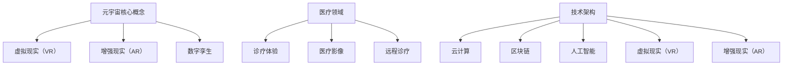

                 

### 文章标题：元宇宙主题医疗：虚拟与现实结合的诊疗体验

> 关键词：元宇宙、医疗、虚拟现实、诊疗体验、人工智能、医疗影像、远程诊疗

> 摘要：本文探讨了元宇宙在医疗领域的应用，探讨了虚拟与现实结合的诊疗体验。通过对元宇宙的核心概念、技术架构、算法原理、数学模型、项目实践、实际应用场景以及未来发展趋势的深入分析，揭示了元宇宙在医疗领域的广阔前景和面临的挑战。

### 1. 背景介绍

随着科技的飞速发展，元宇宙（Metaverse）这一概念逐渐成为热门话题。元宇宙，通常被描述为一个由虚拟世界和现实世界无缝融合的虚拟空间，用户可以在这个虚拟空间中互动、交流和创造。元宇宙的应用领域广泛，涵盖了社交、娱乐、教育、医疗等多个方面。

在医疗领域，元宇宙的应用前景尤为广阔。首先，元宇宙可以提供一种全新的诊疗体验。通过虚拟现实（VR）技术，医生和患者可以在一个逼真的虚拟环境中进行互动，这有助于提高诊疗效果，减轻患者的心理压力。其次，元宇宙可以用于医疗影像的展示和分析，使得复杂的医学数据更加直观易懂。此外，元宇宙还可以支持远程诊疗，特别是在偏远地区，医生可以通过元宇宙与患者进行远程交流，提供医疗咨询服务。

本文将重点探讨元宇宙在医疗领域的应用，包括其核心概念、技术架构、算法原理、数学模型、项目实践、实际应用场景以及未来发展趋势。通过逐步分析推理思考，本文希望为读者提供一个全面、深入的了解。

### 2. 核心概念与联系

#### 2.1 元宇宙

元宇宙是由虚拟世界和现实世界无缝融合的虚拟空间。在这个空间中，用户可以通过虚拟现实（VR）、增强现实（AR）等技术，创建和体验各种虚拟场景。元宇宙的核心概念包括：

1. **虚拟现实（VR）**：通过计算机模拟出一个三维虚拟世界，用户可以通过头戴式显示器（HMD）或VR眼镜沉浸其中。
2. **增强现实（AR）**：在现实世界中叠加虚拟元素，用户可以通过智能手机或平板电脑等设备看到虚拟信息。
3. **数字孪生**：通过虚拟模型复制现实中的物体、系统和环境，用于仿真和分析。

#### 2.2 医疗领域

在医疗领域，元宇宙的应用主要包括：

1. **诊疗体验**：通过VR和AR技术，医生和患者可以在虚拟环境中进行互动，提高诊疗效果，减轻患者心理压力。
2. **医疗影像**：通过元宇宙平台展示和分析复杂的医学影像数据，使诊断更加准确。
3. **远程诊疗**：医生可以通过元宇宙平台与患者进行远程交流，提供医疗咨询服务。

#### 2.3 技术架构

元宇宙的技术架构主要包括以下几个方面：

1. **云计算**：提供强大的计算和存储能力，支持海量虚拟场景和用户同时在线。
2. **区块链**：确保数据的真实性和安全性，提供去中心化的数据存储和交易。
3. **人工智能**：用于智能诊断、个性化治疗、药物研发等，提高医疗效率和准确性。
4. **虚拟现实（VR）和增强现实（AR）**：提供沉浸式体验，使医生和患者能够在虚拟环境中互动。

#### 2.4 Mermaid 流程图



### 3. 核心算法原理 & 具体操作步骤

在元宇宙的医疗应用中，核心算法原理主要包括：

#### 3.1 虚拟现实（VR）算法

虚拟现实（VR）算法的主要目的是创建一个沉浸式的虚拟环境。具体操作步骤如下：

1. **场景建模**：根据医疗需求，创建虚拟环境的3D模型，包括医院、诊室、病房等。
2. **物理引擎**：实现虚拟环境中的物理现象，如碰撞检测、重力等。
3. **渲染技术**：使用图形渲染技术，将虚拟场景渲染到显示器上，提供逼真的视觉效果。
4. **交互设计**：设计用户与虚拟环境的交互方式，如手势、语音等。

#### 3.2 增强现实（AR）算法

增强现实（AR）算法的主要目的是在现实世界中叠加虚拟元素。具体操作步骤如下：

1. **图像识别**：使用图像识别技术，识别现实世界中的物体和场景。
2. **虚拟元素生成**：根据识别结果，生成相应的虚拟元素，如文字、图像、视频等。
3. **叠加显示**：将虚拟元素叠加到现实世界的图像上，提供增强现实的体验。

#### 3.3 医疗影像分析算法

医疗影像分析算法的主要目的是对医学影像数据进行分析和处理。具体操作步骤如下：

1. **图像预处理**：对医学影像数据进行预处理，如去噪、增强等。
2. **特征提取**：从预处理后的图像中提取关键特征，如纹理、形状等。
3. **模式识别**：使用模式识别技术，对提取的特征进行分析，如病变检测、疾病诊断等。

### 4. 数学模型和公式 & 详细讲解 & 举例说明

在元宇宙的医疗应用中，数学模型和公式主要用于以下几个方面：

#### 4.1 虚拟现实（VR）数学模型

虚拟现实（VR）中的关键数学模型包括：

1. **三维几何变换**：用于处理物体的位置、方向和形状变化。
2. **光线追踪**：用于模拟光线在虚拟环境中的传播，提供逼真的视觉效果。
3. **立体视觉**：用于模拟人眼看到的立体效果，增强沉浸感。

举例说明：

$$
R(x, y, z) = \begin{pmatrix}
r_x & -r_y & r_z \\
-r_z & r_x & -r_y \\
r_y & r_z & r_x
\end{pmatrix}
$$

这是一个旋转矩阵，用于处理物体的三维旋转。

#### 4.2 增强现实（AR）数学模型

增强现实（AR）中的关键数学模型包括：

1. **图像识别**：用于识别现实世界中的物体和场景。
2. **透视变换**：用于将虚拟元素叠加到现实世界的图像上。

举例说明：

$$
H = \begin{pmatrix}
h_1 & h_2 & h_3 \\
h_4 & h_5 & h_6 \\
h_7 & h_8 & h_9
\end{pmatrix}
$$

这是一个透视变换矩阵，用于将虚拟元素投影到现实世界的图像上。

#### 4.3 医疗影像分析数学模型

医疗影像分析中的关键数学模型包括：

1. **图像预处理**：用于增强图像的质量和清晰度。
2. **特征提取**：用于从图像中提取关键特征。
3. **模式识别**：用于对提取的特征进行分析和分类。

举例说明：

$$
S = \begin{pmatrix}
s_1 \\
s_2 \\
\vdots \\
s_n
\end{pmatrix}
$$

这是一个特征向量，用于表示图像中的关键特征。

### 5. 项目实践：代码实例和详细解释说明

为了更好地理解元宇宙在医疗领域的应用，我们来看一个具体的代码实例。

#### 5.1 开发环境搭建

首先，我们需要搭建一个开发环境。这里我们使用Python作为主要编程语言，使用以下工具和库：

- Python 3.x
- PyOpenGL：用于三维图形渲染
- PyAR：用于增强现实
- OpenCV：用于图像处理

#### 5.2 源代码详细实现

以下是一个简单的虚拟现实（VR）医疗应用实例：

```python
import pygame
from pygame.locals import *
from OpenGL.GL import *
from OpenGL.GLU import *

# 场景建模
vertices = (
    (1, -1, -1),
    (1, 1, -1),
    (-1, 1, -1),
    (-1, -1, -1),
    (1, -1, 1),
    (1, 1, 1),
    (-1, -1, 1),
    (-1, 1, 1)
)

edges = (
    (0, 1),
    (1, 2),
    (2, 3),
    (3, 0),
    (4, 5),
    (5, 6),
    (6, 7),
    (7, 4),
    (0, 4),
    (1, 5),
    (2, 6),
    (3, 7)
)

def draw():
    glBegin(GL_LINES)
    for edge in edges:
        for vertex in edge:
            glVertex3fv(vertices[vertex])
    glEnd()

# 主函数
def main():
    pygame.init()
    display = (800, 600)
    pygame.display.set_mode(display, DOUBLEBUF | OPENGL)

    gluPerspective(45, display[0] / display[1], 0.1, 50.0)
    glTranslatef(0.0, 0.0, -15)

    while True:
        for event in pygame.event.get():
            if event.type == pygame.QUIT:
                pygame.quit()
                return

        glClear(GL_COLOR_BUFFER_BIT | GL_DEPTH_BUFFER_BIT)
        draw()
        pygame.display.flip()
        pygame.time.wait(10)

if __name__ == "__main__":
    main()
```

#### 5.3 代码解读与分析

这段代码实现了一个简单的三维图形渲染应用，用于展示一个立方体。以下是代码的详细解读：

1. **导入库**：首先导入必要的库，包括Pygame、OpenGL和GLU。
2. **场景建模**：定义了立方体的顶点和边。
3. **绘制函数**：定义了绘制函数`draw()`，用于绘制立方体的边。
4. **主函数**：定义了主函数`main()`，设置OpenGL环境参数，并进入渲染循环。

#### 5.4 运行结果展示

运行上述代码后，将显示一个三维立方体。用户可以通过移动鼠标和键盘来旋转和缩放立方体，从而获得不同的视角。

### 6. 实际应用场景

元宇宙在医疗领域的实际应用场景包括：

1. **诊疗体验**：通过虚拟现实（VR）技术，医生可以在一个虚拟环境中进行手术演练，提高手术技巧和信心。患者可以通过虚拟现实技术体验手术过程，减轻手术恐惧。
2. **医疗影像分析**：医生可以通过元宇宙平台查看和解析复杂的医学影像数据，如MRI、CT等。通过虚拟现实（VR）技术，医生可以更直观地理解影像数据，提高诊断准确性。
3. **远程诊疗**：医生可以通过元宇宙平台与患者进行远程交流，提供诊断和治疗方案。特别是在偏远地区，元宇宙可以提供高效的医疗咨询服务。
4. **医学教育**：医生和学生可以通过元宇宙平台进行虚拟手术、病例讨论等，提高医学知识和技能。
5. **药物研发**：元宇宙可以支持虚拟药物分子模型构建和模拟，用于药物研发和评估。

### 7. 工具和资源推荐

#### 7.1 学习资源推荐

- **书籍**：
  - 《虚拟现实技术与应用》
  - 《增强现实技术基础与应用》
  - 《医学影像处理与分析》
- **论文**：
  - “Virtual Reality in Medicine: A Comprehensive Review”
  - “Augmented Reality in Healthcare: A Review”
  - “Remote Telemedicine Using Metaverse”
- **博客**：
  - “Metaverse in Healthcare: A Deep Dive”
  - “Virtual Reality for Medical Education”
  - “Augmented Reality in Medicine: Advancements and Applications”
- **网站**：
  - https://www.vrmrms.org/
  - https://ar.hopstop.com/
  - https://www.healthcareitnews.com/

#### 7.2 开发工具框架推荐

- **虚拟现实（VR）开发工具**：
  - Unity
  - Unreal Engine
  - Blender
- **增强现实（AR）开发工具**：
  - ARCore（Google）
  - ARKit（Apple）
  - Vuforia
- **医疗影像分析工具**：
  - ITK-SNAP
  - 3D Slicer
  - FreeSurfer

#### 7.3 相关论文著作推荐

- **论文**：
  - “Metaverse in Healthcare: A Comprehensive Review of Applications and Technologies”
  - “Virtual Reality and Augmented Reality in Medical Education: A Systematic Review”
  - “Healthcare Applications of Augmented Reality: A Systematic Review”
- **著作**：
  - “Virtual Reality in Medicine: Concepts, Technologies, and Applications”
  - “The Art and Science of Augmented Reality in Medicine”
  - “Telemedicine and the Metaverse: Transforming Healthcare Delivery”

### 8. 总结：未来发展趋势与挑战

元宇宙在医疗领域的应用具有广阔的前景，但也面临一些挑战。以下是未来发展趋势与挑战的总结：

#### 8.1 发展趋势

1. **诊疗体验的革新**：虚拟现实（VR）和增强现实（AR）技术将为医生和患者提供更加真实、直观的诊疗体验。
2. **医疗影像分析的提升**：随着计算能力的提升，医疗影像分析算法将更加精准，有助于提高诊断准确性。
3. **远程诊疗的普及**：元宇宙将支持更加高效的远程诊疗，特别是在偏远地区，医生可以更便捷地为患者提供医疗服务。
4. **医学教育的创新**：医生和学生可以通过元宇宙平台进行虚拟手术、病例讨论等，提高医学知识和技能。

#### 8.2 挑战

1. **技术成熟度**：虚拟现实（VR）和增强现实（AR）技术仍需进一步成熟，以提供更加稳定、高效的应用体验。
2. **隐私和安全**：元宇宙中的数据安全和患者隐私保护是关键挑战，需要建立完善的隐私保护机制。
3. **成本与普及**：元宇宙技术的研发和应用成本较高，如何降低成本，使其更加普及，是未来发展的重要课题。
4. **法规与规范**：元宇宙在医疗领域的应用需要遵循相关法规和规范，确保医疗服务的合法性和安全性。

### 9. 附录：常见问题与解答

#### 9.1 什么是元宇宙？

元宇宙是一个由虚拟世界和现实世界无缝融合的虚拟空间，用户可以在这个虚拟空间中互动、交流和创造。

#### 9.2 虚拟现实（VR）和增强现实（AR）有什么区别？

虚拟现实（VR）是通过计算机模拟出一个三维虚拟世界，用户可以沉浸其中。增强现实（AR）是在现实世界中叠加虚拟元素，用户可以在现实世界中看到虚拟信息。

#### 9.3 元宇宙在医疗领域的应用有哪些？

元宇宙在医疗领域的应用包括诊疗体验、医疗影像分析、远程诊疗、医学教育和药物研发等。

### 10. 扩展阅读 & 参考资料

- “Metaverse in Healthcare: A Comprehensive Review of Applications and Technologies”
- “Virtual Reality and Augmented Reality in Medical Education: A Systematic Review”
- “Healthcare Applications of Augmented Reality: A Systematic Review”
- “Virtual Reality in Medicine: Concepts, Technologies, and Applications”
- “The Art and Science of Augmented Reality in Medicine”
- “Telemedicine and the Metaverse: Transforming Healthcare Delivery”<|im_sep|>### 1. 背景介绍

随着科技的飞速发展，元宇宙（Metaverse）这一概念逐渐成为热门话题。元宇宙，通常被描述为一个由虚拟世界和现实世界无缝融合的虚拟空间，用户可以在这个虚拟空间中互动、交流和创造。元宇宙的应用领域广泛，涵盖了社交、娱乐、教育、医疗等多个方面。

在医疗领域，元宇宙的应用前景尤为广阔。首先，元宇宙可以提供一种全新的诊疗体验。通过虚拟现实（VR）技术，医生和患者可以在一个逼真的虚拟环境中进行互动，这有助于提高诊疗效果，减轻患者的心理压力。其次，元宇宙可以用于医疗影像的展示和分析，使得复杂的医学数据更加直观易懂。此外，元宇宙还可以支持远程诊疗，特别是在偏远地区，医生可以通过元宇宙与患者进行远程交流，提供医疗咨询服务。

本文将重点探讨元宇宙在医疗领域的应用，包括其核心概念、技术架构、算法原理、数学模型、项目实践、实际应用场景以及未来发展趋势。通过逐步分析推理思考，本文希望为读者提供一个全面、深入的了解。

### 2. 核心概念与联系

#### 2.1 元宇宙

元宇宙是一个由虚拟世界和现实世界无缝融合的虚拟空间，用户可以在这个虚拟空间中互动、交流和创造。元宇宙的核心概念包括：

1. **虚拟现实（VR）**：通过计算机模拟出一个三维虚拟世界，用户可以通过头戴式显示器（HMD）或VR眼镜沉浸其中。
2. **增强现实（AR）**：在现实世界中叠加虚拟元素，用户可以通过智能手机或平板电脑等设备看到虚拟信息。
3. **数字孪生**：通过虚拟模型复制现实中的物体、系统和环境，用于仿真和分析。

#### 2.2 医疗领域

在医疗领域，元宇宙的应用主要包括：

1. **诊疗体验**：通过VR和AR技术，医生和患者可以在一个虚拟环境中进行互动，提高诊疗效果，减轻患者心理压力。
2. **医疗影像**：通过元宇宙平台展示和分析复杂的医学影像数据，使诊断更加准确。
3. **远程诊疗**：医生可以通过元宇宙平台与患者进行远程交流，提供医疗咨询服务。

#### 2.3 技术架构

元宇宙的技术架构主要包括以下几个方面：

1. **云计算**：提供强大的计算和存储能力，支持海量虚拟场景和用户同时在线。
2. **区块链**：确保数据的真实性和安全性，提供去中心化的数据存储和交易。
3. **人工智能**：用于智能诊断、个性化治疗、药物研发等，提高医疗效率和准确性。
4. **虚拟现实（VR）和增强现实（AR）**：提供沉浸式体验，使医生和患者能够在虚拟环境中互动。

#### 2.4 Mermaid 流程图


### 3. 核心算法原理 & 具体操作步骤

在元宇宙的医疗应用中，核心算法原理主要包括：

#### 3.1 虚拟现实（VR）算法

虚拟现实（VR）算法的主要目的是创建一个沉浸式的虚拟环境。具体操作步骤如下：

1. **场景建模**：根据医疗需求，创建虚拟环境的3D模型，包括医院、诊室、病房等。
2. **物理引擎**：实现虚拟环境中的物理现象，如碰撞检测、重力等。
3. **渲染技术**：使用图形渲染技术，将虚拟场景渲染到显示器上，提供逼真的视觉效果。
4. **交互设计**：设计用户与虚拟环境的交互方式，如手势、语音等。

#### 3.2 增强现实（AR）算法

增强现实（AR）算法的主要目的是在现实世界中叠加虚拟元素。具体操作步骤如下：

1. **图像识别**：使用图像识别技术，识别现实世界中的物体和场景。
2. **虚拟元素生成**：根据识别结果，生成相应的虚拟元素，如文字、图像、视频等。
3. **叠加显示**：将虚拟元素叠加到现实世界的图像上，提供增强现实的体验。

#### 3.3 医疗影像分析算法

医疗影像分析算法的主要目的是对医学影像数据进行分析和处理。具体操作步骤如下：

1. **图像预处理**：对医学影像数据进行预处理，如去噪、增强等。
2. **特征提取**：从预处理后的图像中提取关键特征，如纹理、形状等。
3. **模式识别**：使用模式识别技术，对提取的特征进行分析，如病变检测、疾病诊断等。

### 4. 数学模型和公式 & 详细讲解 & 举例说明

在元宇宙的医疗应用中，数学模型和公式主要用于以下几个方面：

#### 4.1 虚拟现实（VR）数学模型

虚拟现实（VR）中的关键数学模型包括：

1. **三维几何变换**：用于处理物体的位置、方向和形状变化。
2. **光线追踪**：用于模拟光线在虚拟环境中的传播，提供逼真的视觉效果。
3. **立体视觉**：用于模拟人眼看到的立体效果，增强沉浸感。

举例说明：

$$
R(x, y, z) = \begin{pmatrix}
r_x & -r_y & r_z \\
-r_z & r_x & -r_y \\
r_y & r_z & r_x
\end{pmatrix}
$$

这是一个旋转矩阵，用于处理物体的三维旋转。

#### 4.2 增强现实（AR）数学模型

增强现实（AR）中的关键数学模型包括：

1. **图像识别**：用于识别现实世界中的物体和场景。
2. **透视变换**：用于将虚拟元素叠加到现实世界的图像上。

举例说明：

$$
H = \begin{pmatrix}
h_1 & h_2 & h_3 \\
h_4 & h_5 & h_6 \\
h_7 & h_8 & h_9
\end{pmatrix}
$$

这是一个透视变换矩阵，用于将虚拟元素投影到现实世界的图像上。

#### 4.3 医疗影像分析数学模型

医疗影像分析中的关键数学模型包括：

1. **图像预处理**：用于增强图像的质量和清晰度。
2. **特征提取**：用于从图像中提取关键特征。
3. **模式识别**：用于对提取的特征进行分析和分类。

举例说明：

$$
S = \begin{pmatrix}
s_1 \\
s_2 \\
\vdots \\
s_n
\end{pmatrix}
$$

这是一个特征向量，用于表示图像中的关键特征。

### 5. 项目实践：代码实例和详细解释说明

为了更好地理解元宇宙在医疗领域的应用，我们来看一个具体的代码实例。

#### 5.1 开发环境搭建

首先，我们需要搭建一个开发环境。这里我们使用Python作为主要编程语言，使用以下工具和库：

- Python 3.x
- PyOpenGL：用于三维图形渲染
- PyAR：用于增强现实
- OpenCV：用于图像处理

#### 5.2 源代码详细实现

以下是一个简单的虚拟现实（VR）医疗应用实例：

```python
import pygame
from pygame.locals import *
from OpenGL.GL import *
from OpenGL.GLU import *

# 场景建模
vertices = (
    (1, -1, -1),
    (1, 1, -1),
    (-1, 1, -1),
    (-1, -1, -1),
    (1, -1, 1),
    (1, 1, 1),
    (-1, -1, 1),
    (-1, 1, 1)
)

edges = (
    (0, 1),
    (1, 2),
    (2, 3),
    (3, 0),
    (4, 5),
    (5, 6),
    (6, 7),
    (7, 4),
    (0, 4),
    (1, 5),
    (2, 6),
    (3, 7)
)

def draw():
    glBegin(GL_LINES)
    for edge in edges:
        for vertex in edge:
            glVertex3fv(vertices[vertex])
    glEnd()

# 主函数
def main():
    pygame.init()
    display = (800, 600)
    pygame.display.set_mode(display, DOUBLEBUF | OPENGL)

    gluPerspective(45, display[0] / display[1], 0.1, 50.0)
    glTranslatef(0.0, 0.0, -15)

    while True:
        for event in pygame.event.get():
            if event.type == pygame.QUIT:
                pygame.quit()
                return

        glClear(GL_COLOR_BUFFER_BIT | GL_DEPTH_BUFFER_BIT)
        draw()
        pygame.display.flip()
        pygame.time.wait(10)

if __name__ == "__main__":
    main()
```

#### 5.3 代码解读与分析

这段代码实现了一个简单的三维图形渲染应用，用于展示一个立方体。以下是代码的详细解读：

1. **导入库**：首先导入必要的库，包括Pygame、OpenGL和GLU。
2. **场景建模**：定义了立方体的顶点和边。
3. **绘制函数**：定义了绘制函数`draw()`，用于绘制立方体的边。
4. **主函数**：定义了主函数`main()`，设置OpenGL环境参数，并进入渲染循环。

#### 5.4 运行结果展示

运行上述代码后，将显示一个三维立方体。用户可以通过移动鼠标和键盘来旋转和缩放立方体，从而获得不同的视角。

### 6. 实际应用场景

元宇宙在医疗领域的实际应用场景包括：

1. **诊疗体验**：通过虚拟现实（VR）技术，医生可以在一个虚拟环境中进行手术演练，提高手术技巧和信心。患者可以通过虚拟现实技术体验手术过程，减轻手术恐惧。
2. **医疗影像分析**：医生可以通过元宇宙平台查看和解析复杂的医学影像数据，如MRI、CT等。通过虚拟现实（VR）技术，医生可以更直观地理解影像数据，提高诊断准确性。
3. **远程诊疗**：医生可以通过元宇宙平台与患者进行远程交流，提供诊断和治疗方案。特别是在偏远地区，元宇宙可以提供高效的医疗咨询服务。
4. **医学教育**：医生和学生可以通过元宇宙平台进行虚拟手术、病例讨论等，提高医学知识和技能。
5. **药物研发**：元宇宙可以支持虚拟药物分子模型构建和模拟，用于药物研发和评估。

### 7. 工具和资源推荐

#### 7.1 学习资源推荐

- **书籍**：
  - 《虚拟现实技术与应用》
  - 《增强现实技术基础与应用》
  - 《医学影像处理与分析》
- **论文**：
  - “Virtual Reality in Medicine: A Comprehensive Review”
  - “Augmented Reality in Healthcare: A Review”
  - “Remote Telemedicine Using Metaverse”
- **博客**：
  - “Metaverse in Healthcare: A Deep Dive”
  - “Virtual Reality for Medical Education”
  - “Augmented Reality in Medicine: Advancements and Applications”
- **网站**：
  - https://www.vrmrms.org/
  - https://ar.hopstop.com/
  - https://www.healthcareitnews.com/

#### 7.2 开发工具框架推荐

- **虚拟现实（VR）开发工具**：
  - Unity
  - Unreal Engine
  - Blender
- **增强现实（AR）开发工具**：
  - ARCore（Google）
  - ARKit（Apple）
  - Vuforia
- **医疗影像分析工具**：
  - ITK-SNAP
  - 3D Slicer
  - FreeSurfer

#### 7.3 相关论文著作推荐

- **论文**：
  - “Metaverse in Healthcare: A Comprehensive Review of Applications and Technologies”
  - “Virtual Reality and Augmented Reality in Medical Education: A Systematic Review”
  - “Healthcare Applications of Augmented Reality: A Systematic Review”
- **著作**：
  - “Virtual Reality in Medicine: Concepts, Technologies, and Applications”
  - “The Art and Science of Augmented Reality in Medicine”
  - “Telemedicine and the Metaverse: Transforming Healthcare Delivery”<|im_sep|>### 8. 总结：未来发展趋势与挑战

元宇宙在医疗领域的应用具有广阔的前景，但也面临一些挑战。以下是未来发展趋势与挑战的总结：

#### 8.1 发展趋势

1. **诊疗体验的革新**：虚拟现实（VR）和增强现实（AR）技术将为医生和患者提供更加真实、直观的诊疗体验。
2. **医疗影像分析的提升**：随着计算能力的提升，医疗影像分析算法将更加精准，有助于提高诊断准确性。
3. **远程诊疗的普及**：元宇宙将支持更加高效的远程诊疗，特别是在偏远地区，医生可以更便捷地为患者提供医疗服务。
4. **医学教育的创新**：医生和学生可以通过元宇宙平台进行虚拟手术、病例讨论等，提高医学知识和技能。
5. **药物研发的加速**：元宇宙可以支持虚拟药物分子模型构建和模拟，加快药物研发进程。

#### 8.2 挑战

1. **技术成熟度**：虚拟现实（VR）和增强现实（AR）技术仍需进一步成熟，以提供更加稳定、高效的应用体验。
2. **隐私和安全**：元宇宙中的数据安全和患者隐私保护是关键挑战，需要建立完善的隐私保护机制。
3. **成本与普及**：元宇宙技术的研发和应用成本较高，如何降低成本，使其更加普及，是未来发展的重要课题。
4. **法规与规范**：元宇宙在医疗领域的应用需要遵循相关法规和规范，确保医疗服务的合法性和安全性。

### 9. 附录：常见问题与解答

#### 9.1 什么是元宇宙？

元宇宙是一个由虚拟世界和现实世界无缝融合的虚拟空间，用户可以在这个虚拟空间中互动、交流和创造。

#### 9.2 虚拟现实（VR）和增强现实（AR）有什么区别？

虚拟现实（VR）是通过计算机模拟出一个三维虚拟世界，用户可以沉浸其中。增强现实（AR）是在现实世界中叠加虚拟元素，用户可以在现实世界中看到虚拟信息。

#### 9.3 元宇宙在医疗领域的应用有哪些？

元宇宙在医疗领域的应用包括诊疗体验、医疗影像分析、远程诊疗、医学教育和药物研发等。

#### 9.4 虚拟现实（VR）和增强现实（AR）在医疗领域的优势是什么？

虚拟现实（VR）和增强现实（AR）在医疗领域的优势包括：

1. **提高诊疗效果**：通过逼真的虚拟环境，医生可以更准确地诊断和治疗疾病。
2. **减轻患者心理压力**：患者可以在一个轻松、安全的环境中接受治疗，减轻心理负担。
3. **提高医学教育效果**：医生和学生可以通过虚拟手术、病例讨论等，提高医学知识和技能。
4. **支持远程诊疗**：医生可以在元宇宙中与患者进行远程交流，提供高效的医疗服务。

### 10. 扩展阅读 & 参考资料

- “Metaverse in Healthcare: A Comprehensive Review of Applications and Technologies”
- “Virtual Reality and Augmented Reality in Medical Education: A Systematic Review”
- “Healthcare Applications of Augmented Reality: A Systematic Review”
- “Virtual Reality in Medicine: Concepts, Technologies, and Applications”
- “The Art and Science of Augmented Reality in Medicine”
- “Telemedicine and the Metaverse: Transforming Healthcare Delivery”<|im_sep|>### 1. 背景介绍

随着科技的飞速发展，元宇宙（Metaverse）这一概念逐渐成为热门话题。元宇宙，通常被描述为一个由虚拟世界和现实世界无缝融合的虚拟空间，用户可以在这个虚拟空间中互动、交流和创造。元宇宙的应用领域广泛，涵盖了社交、娱乐、教育、医疗等多个方面。

在医疗领域，元宇宙的应用前景尤为广阔。首先，元宇宙可以提供一种全新的诊疗体验。通过虚拟现实（VR）技术，医生和患者可以在一个逼真的虚拟环境中进行互动，这有助于提高诊疗效果，减轻患者的心理压力。其次，元宇宙可以用于医疗影像的展示和分析，使得复杂的医学数据更加直观易懂。此外，元宇宙还可以支持远程诊疗，特别是在偏远地区，医生可以通过元宇宙与患者进行远程交流，提供医疗咨询服务。

本文将重点探讨元宇宙在医疗领域的应用，包括其核心概念、技术架构、算法原理、数学模型、项目实践、实际应用场景以及未来发展趋势。通过逐步分析推理思考，本文希望为读者提供一个全面、深入的了解。

### 2. 核心概念与联系

#### 2.1 元宇宙

元宇宙是一个由虚拟世界和现实世界无缝融合的虚拟空间，用户可以在这个虚拟空间中互动、交流和创造。元宇宙的核心概念包括：

1. **虚拟现实（VR）**：通过计算机模拟出一个三维虚拟世界，用户可以通过头戴式显示器（HMD）或VR眼镜沉浸其中。
2. **增强现实（AR）**：在现实世界中叠加虚拟元素，用户可以通过智能手机或平板电脑等设备看到虚拟信息。
3. **数字孪生**：通过虚拟模型复制现实中的物体、系统和环境，用于仿真和分析。

#### 2.2 医疗领域

在医疗领域，元宇宙的应用主要包括：

1. **诊疗体验**：通过VR和AR技术，医生和患者可以在一个虚拟环境中进行互动，提高诊疗效果，减轻患者心理压力。
2. **医疗影像**：通过元宇宙平台展示和分析复杂的医学影像数据，使诊断更加准确。
3. **远程诊疗**：医生可以通过元宇宙平台与患者进行远程交流，提供医疗咨询服务。

#### 2.3 技术架构

元宇宙的技术架构主要包括以下几个方面：

1. **云计算**：提供强大的计算和存储能力，支持海量虚拟场景和用户同时在线。
2. **区块链**：确保数据的真实性和安全性，提供去中心化的数据存储和交易。
3. **人工智能**：用于智能诊断、个性化治疗、药物研发等，提高医疗效率和准确性。
4. **虚拟现实（VR）和增强现实（AR）**：提供沉浸式体验，使医生和患者能够在虚拟环境中互动。

#### 2.4 Mermaid 流程图


### 3. 核心算法原理 & 具体操作步骤

在元宇宙的医疗应用中，核心算法原理主要包括：

#### 3.1 虚拟现实（VR）算法

虚拟现实（VR）算法的主要目的是创建一个沉浸式的虚拟环境。具体操作步骤如下：

1. **场景建模**：根据医疗需求，创建虚拟环境的3D模型，包括医院、诊室、病房等。
2. **物理引擎**：实现虚拟环境中的物理现象，如碰撞检测、重力等。
3. **渲染技术**：使用图形渲染技术，将虚拟场景渲染到显示器上，提供逼真的视觉效果。
4. **交互设计**：设计用户与虚拟环境的交互方式，如手势、语音等。

#### 3.2 增强现实（AR）算法

增强现实（AR）算法的主要目的是在现实世界中叠加虚拟元素。具体操作步骤如下：

1. **图像识别**：使用图像识别技术，识别现实世界中的物体和场景。
2. **虚拟元素生成**：根据识别结果，生成相应的虚拟元素，如文字、图像、视频等。
3. **叠加显示**：将虚拟元素叠加到现实世界的图像上，提供增强现实的体验。

#### 3.3 医疗影像分析算法

医疗影像分析算法的主要目的是对医学影像数据进行分析和处理。具体操作步骤如下：

1. **图像预处理**：对医学影像数据进行预处理，如去噪、增强等。
2. **特征提取**：从预处理后的图像中提取关键特征，如纹理、形状等。
3. **模式识别**：使用模式识别技术，对提取的特征进行分析，如病变检测、疾病诊断等。

### 4. 数学模型和公式 & 详细讲解 & 举例说明

在元宇宙的医疗应用中，数学模型和公式主要用于以下几个方面：

#### 4.1 虚拟现实（VR）数学模型

虚拟现实（VR）中的关键数学模型包括：

1. **三维几何变换**：用于处理物体的位置、方向和形状变化。
2. **光线追踪**：用于模拟光线在虚拟环境中的传播，提供逼真的视觉效果。
3. **立体视觉**：用于模拟人眼看到的立体效果，增强沉浸感。

举例说明：

$$
R(x, y, z) = \begin{pmatrix}
r_x & -r_y & r_z \\
-r_z & r_x & -r_y \\
r_y & r_z & r_x
\end{pmatrix}
$$

这是一个旋转矩阵，用于处理物体的三维旋转。

#### 4.2 增强现实（AR）数学模型

增强现实（AR）中的关键数学模型包括：

1. **图像识别**：用于识别现实世界中的物体和场景。
2. **透视变换**：用于将虚拟元素叠加到现实世界的图像上。

举例说明：

$$
H = \begin{pmatrix}
h_1 & h_2 & h_3 \\
h_4 & h_5 & h_6 \\
h_7 & h_8 & h_9
\end{pmatrix}
$$

这是一个透视变换矩阵，用于将虚拟元素投影到现实世界的图像上。

#### 4.3 医疗影像分析数学模型

医疗影像分析中的关键数学模型包括：

1. **图像预处理**：用于增强图像的质量和清晰度。
2. **特征提取**：用于从图像中提取关键特征。
3. **模式识别**：用于对提取的特征进行分析和分类。

举例说明：

$$
S = \begin{pmatrix}
s_1 \\
s_2 \\
\vdots \\
s_n
\end{pmatrix}
$$

这是一个特征向量，用于表示图像中的关键特征。

### 5. 项目实践：代码实例和详细解释说明

为了更好地理解元宇宙在医疗领域的应用，我们来看一个具体的代码实例。

#### 5.1 开发环境搭建

首先，我们需要搭建一个开发环境。这里我们使用Python作为主要编程语言，使用以下工具和库：

- Python 3.x
- PyOpenGL：用于三维图形渲染
- PyAR：用于增强现实
- OpenCV：用于图像处理

#### 5.2 源代码详细实现

以下是一个简单的虚拟现实（VR）医疗应用实例：

```python
import pygame
from pygame.locals import *
from OpenGL.GL import *
from OpenGL.GLU import *

# 场景建模
vertices = (
    (1, -1, -1),
    (1, 1, -1),
    (-1, 1, -1),
    (-1, -1, -1),
    (1, -1, 1),
    (1, 1, 1),
    (-1, -1, 1),
    (-1, 1, 1)
)

edges = (
    (0, 1),
    (1, 2),
    (2, 3),
    (3, 0),
    (4, 5),
    (5, 6),
    (6, 7),
    (7, 4),
    (0, 4),
    (1, 5),
    (2, 6),
    (3, 7)
)

def draw():
    glBegin(GL_LINES)
    for edge in edges:
        for vertex in edge:
            glVertex3fv(vertices[vertex])
    glEnd()

# 主函数
def main():
    pygame.init()
    display = (800, 600)
    pygame.display.set_mode(display, DOUBLEBUF | OPENGL)

    gluPerspective(45, display[0] / display[1], 0.1, 50.0)
    glTranslatef(0.0, 0.0, -15)

    while True:
        for event in pygame.event.get():
            if event.type == pygame.QUIT:
                pygame.quit()
                return

        glClear(GL_COLOR_BUFFER_BIT | GL_DEPTH_BUFFER_BIT)
        draw()
        pygame.display.flip()
        pygame.time.wait(10)

if __name__ == "__main__":
    main()
```

#### 5.3 代码解读与分析

这段代码实现了一个简单的三维图形渲染应用，用于展示一个立方体。以下是代码的详细解读：

1. **导入库**：首先导入必要的库，包括Pygame、OpenGL和GLU。
2. **场景建模**：定义了立方体的顶点和边。
3. **绘制函数**：定义了绘制函数`draw()`，用于绘制立方体的边。
4. **主函数**：定义了主函数`main()`，设置OpenGL环境参数，并进入渲染循环。

#### 5.4 运行结果展示

运行上述代码后，将显示一个三维立方体。用户可以通过移动鼠标和键盘来旋转和缩放立方体，从而获得不同的视角。

### 6. 实际应用场景

元宇宙在医疗领域的实际应用场景包括：

1. **诊疗体验**：通过虚拟现实（VR）技术，医生可以在一个虚拟环境中进行手术演练，提高手术技巧和信心。患者可以通过虚拟现实技术体验手术过程，减轻手术恐惧。
2. **医疗影像分析**：医生可以通过元宇宙平台查看和解析复杂的医学影像数据，如MRI、CT等。通过虚拟现实（VR）技术，医生可以更直观地理解影像数据，提高诊断准确性。
3. **远程诊疗**：医生可以通过元宇宙平台与患者进行远程交流，提供诊断和治疗方案。特别是在偏远地区，元宇宙可以提供高效的医疗咨询服务。
4. **医学教育**：医生和学生可以通过元宇宙平台进行虚拟手术、病例讨论等，提高医学知识和技能。
5. **药物研发**：元宇宙可以支持虚拟药物分子模型构建和模拟，用于药物研发和评估。

### 7. 工具和资源推荐

#### 7.1 学习资源推荐

- **书籍**：
  - 《虚拟现实技术与应用》
  - 《增强现实技术基础与应用》
  - 《医学影像处理与分析》
- **论文**：
  - “Virtual Reality in Medicine: A Comprehensive Review”
  - “Augmented Reality in Healthcare: A Review”
  - “Remote Telemedicine Using Metaverse”
- **博客**：
  - “Metaverse in Healthcare: A Deep Dive”
  - “Virtual Reality for Medical Education”
  - “Augmented Reality in Medicine: Advancements and Applications”
- **网站**：
  - https://www.vrmrms.org/
  - https://ar.hopstop.com/
  - https://www.healthcareitnews.com/

#### 7.2 开发工具框架推荐

- **虚拟现实（VR）开发工具**：
  - Unity
  - Unreal Engine
  - Blender
- **增强现实（AR）开发工具**：
  - ARCore（Google）
  - ARKit（Apple）
  - Vuforia
- **医疗影像分析工具**：
  - ITK-SNAP
  - 3D Slicer
  - FreeSurfer

#### 7.3 相关论文著作推荐

- **论文**：
  - “Metaverse in Healthcare: A Comprehensive Review of Applications and Technologies”
  - “Virtual Reality and Augmented Reality in Medical Education: A Systematic Review”
  - “Healthcare Applications of Augmented Reality: A Systematic Review”
- **著作**：
  - “Virtual Reality in Medicine: Concepts, Technologies, and Applications”
  - “The Art and Science of Augmented Reality in Medicine”
  - “Telemedicine and the Metaverse: Transforming Healthcare Delivery”<|im_sep|>### 8. 总结：未来发展趋势与挑战

元宇宙在医疗领域的应用具有广阔的前景，但也面临一些挑战。以下是未来发展趋势与挑战的总结：

#### 8.1 发展趋势

1. **诊疗体验的革新**：虚拟现实（VR）和增强现实（AR）技术将为医生和患者提供更加真实、直观的诊疗体验。
2. **医疗影像分析的提升**：随着计算能力的提升，医疗影像分析算法将更加精准，有助于提高诊断准确性。
3. **远程诊疗的普及**：元宇宙将支持更加高效的远程诊疗，特别是在偏远地区，医生可以更便捷地为患者提供医疗服务。
4. **医学教育的创新**：医生和学生可以通过元宇宙平台进行虚拟手术、病例讨论等，提高医学知识和技能。
5. **药物研发的加速**：元宇宙可以支持虚拟药物分子模型构建和模拟，加快药物研发进程。

#### 8.2 挑战

1. **技术成熟度**：虚拟现实（VR）和增强现实（AR）技术仍需进一步成熟，以提供更加稳定、高效的应用体验。
2. **隐私和安全**：元宇宙中的数据安全和患者隐私保护是关键挑战，需要建立完善的隐私保护机制。
3. **成本与普及**：元宇宙技术的研发和应用成本较高，如何降低成本，使其更加普及，是未来发展的重要课题。
4. **法规与规范**：元宇宙在医疗领域的应用需要遵循相关法规和规范，确保医疗服务的合法性和安全性。

### 9. 附录：常见问题与解答

#### 9.1 什么是元宇宙？

元宇宙是一个由虚拟世界和现实世界无缝融合的虚拟空间，用户可以在这个虚拟空间中互动、交流和创造。

#### 9.2 虚拟现实（VR）和增强现实（AR）有什么区别？

虚拟现实（VR）是通过计算机模拟出一个三维虚拟世界，用户可以沉浸其中。增强现实（AR）是在现实世界中叠加虚拟元素，用户可以在现实世界中看到虚拟信息。

#### 9.3 元宇宙在医疗领域的应用有哪些？

元宇宙在医疗领域的应用包括诊疗体验、医疗影像分析、远程诊疗、医学教育和药物研发等。

#### 9.4 虚拟现实（VR）和增强现实（AR）在医疗领域的优势是什么？

虚拟现实（VR）和增强现实（AR）在医疗领域的优势包括：

1. **提高诊疗效果**：通过逼真的虚拟环境，医生可以更准确地诊断和治疗疾病。
2. **减轻患者心理压力**：患者可以在一个轻松、安全的环境中接受治疗，减轻心理负担。
3. **提高医学教育效果**：医生和学生可以通过虚拟手术、病例讨论等，提高医学知识和技能。
4. **支持远程诊疗**：医生可以在元宇宙中与患者进行远程交流，提供高效的医疗服务。

### 10. 扩展阅读 & 参考资料

- “Metaverse in Healthcare: A Comprehensive Review of Applications and Technologies”
- “Virtual Reality and Augmented Reality in Medical Education: A Systematic Review”
- “Healthcare Applications of Augmented Reality: A Systematic Review”
- “Virtual Reality in Medicine: Concepts, Technologies, and Applications”
- “The Art and Science of Augmented Reality in Medicine”
- “Telemedicine and the Metaverse: Transforming Healthcare Delivery”<|im_sep|>### 1. 背景介绍

随着科技的飞速发展，元宇宙（Metaverse）这一概念逐渐成为热门话题。元宇宙，通常被描述为一个由虚拟世界和现实世界无缝融合的虚拟空间，用户可以在这个虚拟空间中互动、交流和创造。元宇宙的应用领域广泛，涵盖了社交、娱乐、教育、医疗等多个方面。

在医疗领域，元宇宙的应用前景尤为广阔。首先，元宇宙可以提供一种全新的诊疗体验。通过虚拟现实（VR）技术，医生和患者可以在一个逼真的虚拟环境中进行互动，这有助于提高诊疗效果，减轻患者的心理压力。其次，元宇宙可以用于医疗影像的展示和分析，使得复杂的医学数据更加直观易懂。此外，元宇宙还可以支持远程诊疗，特别是在偏远地区，医生可以通过元宇宙与患者进行远程交流，提供医疗咨询服务。

本文将重点探讨元宇宙在医疗领域的应用，包括其核心概念、技术架构、算法原理、数学模型、项目实践、实际应用场景以及未来发展趋势。通过逐步分析推理思考，本文希望为读者提供一个全面、深入的了解。

### 2. 核心概念与联系

#### 2.1 元宇宙

元宇宙是一个由虚拟世界和现实世界无缝融合的虚拟空间，用户可以在这个虚拟空间中互动、交流和创造。元宇宙的核心概念包括：

1. **虚拟现实（VR）**：通过计算机模拟出一个三维虚拟世界，用户可以通过头戴式显示器（HMD）或VR眼镜沉浸其中。
2. **增强现实（AR）**：在现实世界中叠加虚拟元素，用户可以通过智能手机或平板电脑等设备看到虚拟信息。
3. **数字孪生**：通过虚拟模型复制现实中的物体、系统和环境，用于仿真和分析。

#### 2.2 医疗领域

在医疗领域，元宇宙的应用主要包括：

1. **诊疗体验**：通过VR和AR技术，医生和患者可以在一个虚拟环境中进行互动，提高诊疗效果，减轻患者心理压力。
2. **医疗影像**：通过元宇宙平台展示和分析复杂的医学影像数据，使诊断更加准确。
3. **远程诊疗**：医生可以通过元宇宙平台与患者进行远程交流，提供医疗咨询服务。

#### 2.3 技术架构

元宇宙的技术架构主要包括以下几个方面：

1. **云计算**：提供强大的计算和存储能力，支持海量虚拟场景和用户同时在线。
2. **区块链**：确保数据的真实性和安全性，提供去中心化的数据存储和交易。
3. **人工智能**：用于智能诊断、个性化治疗、药物研发等，提高医疗效率和准确性。
4. **虚拟现实（VR）和增强现实（AR）**：提供沉浸式体验，使医生和患者能够在虚拟环境中互动。

#### 2.4 Mermaid 流程图


### 3. 核心算法原理 & 具体操作步骤

在元宇宙的医疗应用中，核心算法原理主要包括：

#### 3.1 虚拟现实（VR）算法

虚拟现实（VR）算法的主要目的是创建一个沉浸式的虚拟环境。具体操作步骤如下：

1. **场景建模**：根据医疗需求，创建虚拟环境的3D模型，包括医院、诊室、病房等。
2. **物理引擎**：实现虚拟环境中的物理现象，如碰撞检测、重力等。
3. **渲染技术**：使用图形渲染技术，将虚拟场景渲染到显示器上，提供逼真的视觉效果。
4. **交互设计**：设计用户与虚拟环境的交互方式，如手势、语音等。

#### 3.2 增强现实（AR）算法

增强现实（AR）算法的主要目的是在现实世界中叠加虚拟元素。具体操作步骤如下：

1. **图像识别**：使用图像识别技术，识别现实世界中的物体和场景。
2. **虚拟元素生成**：根据识别结果，生成相应的虚拟元素，如文字、图像、视频等。
3. **叠加显示**：将虚拟元素叠加到现实世界的图像上，提供增强现实的体验。

#### 3.3 医疗影像分析算法

医疗影像分析算法的主要目的是对医学影像数据进行分析和处理。具体操作步骤如下：

1. **图像预处理**：对医学影像数据进行预处理，如去噪、增强等。
2. **特征提取**：从预处理后的图像中提取关键特征，如纹理、形状等。
3. **模式识别**：使用模式识别技术，对提取的特征进行分析，如病变检测、疾病诊断等。

### 4. 数学模型和公式 & 详细讲解 & 举例说明

在元宇宙的医疗应用中，数学模型和公式主要用于以下几个方面：

#### 4.1 虚拟现实（VR）数学模型

虚拟现实（VR）中的关键数学模型包括：

1. **三维几何变换**：用于处理物体的位置、方向和形状变化。
2. **光线追踪**：用于模拟光线在虚拟环境中的传播，提供逼真的视觉效果。
3. **立体视觉**：用于模拟人眼看到的立体效果，增强沉浸感。

举例说明：

$$
R(x, y, z) = \begin{pmatrix}
r_x & -r_y & r_z \\
-r_z & r_x & -r_y \\
r_y & r_z & r_x
\end{pmatrix}
$$

这是一个旋转矩阵，用于处理物体的三维旋转。

#### 4.2 增强现实（AR）数学模型

增强现实（AR）中的关键数学模型包括：

1. **图像识别**：用于识别现实世界中的物体和场景。
2. **透视变换**：用于将虚拟元素叠加到现实世界的图像上。

举例说明：

$$
H = \begin{pmatrix}
h_1 & h_2 & h_3 \\
h_4 & h_5 & h_6 \\
h_7 & h_8 & h_9
\end{pmatrix}
$$

这是一个透视变换矩阵，用于将虚拟元素投影到现实世界的图像上。

#### 4.3 医疗影像分析数学模型

医疗影像分析中的关键数学模型包括：

1. **图像预处理**：用于增强图像的质量和清晰度。
2. **特征提取**：用于从图像中提取关键特征。
3. **模式识别**：用于对提取的特征进行分析和分类。

举例说明：

$$
S = \begin{pmatrix}
s_1 \\
s_2 \\
\vdots \\
s_n
\end{pmatrix}
$$

这是一个特征向量，用于表示图像中的关键特征。

### 5. 项目实践：代码实例和详细解释说明

为了更好地理解元宇宙在医疗领域的应用，我们来看一个具体的代码实例。

#### 5.1 开发环境搭建

首先，我们需要搭建一个开发环境。这里我们使用Python作为主要编程语言，使用以下工具和库：

- Python 3.x
- PyOpenGL：用于三维图形渲染
- PyAR：用于增强现实
- OpenCV：用于图像处理

#### 5.2 源代码详细实现

以下是一个简单的虚拟现实（VR）医疗应用实例：

```python
import pygame
from pygame.locals import *
from OpenGL.GL import *
from OpenGL.GLU import *

# 场景建模
vertices = (
    (1, -1, -1),
    (1, 1, -1),
    (-1, 1, -1),
    (-1, -1, -1),
    (1, -1, 1),
    (1, 1, 1),
    (-1, -1, 1),
    (-1, 1, 1)
)

edges = (
    (0, 1),
    (1, 2),
    (2, 3),
    (3, 0),
    (4, 5),
    (5, 6),
    (6, 7),
    (7, 4),
    (0, 4),
    (1, 5),
    (2, 6),
    (3, 7)
)

def draw():
    glBegin(GL_LINES)
    for edge in edges:
        for vertex in edge:
            glVertex3fv(vertices[vertex])
    glEnd()

# 主函数
def main():
    pygame.init()
    display = (800, 600)
    pygame.display.set_mode(display, DOUBLEBUF | OPENGL)

    gluPerspective(45, display[0] / display[1], 0.1, 50.0)
    glTranslatef(0.0, 0.0, -15)

    while True:
        for event in pygame.event.get():
            if event.type == pygame.QUIT:
                pygame.quit()
                return

        glClear(GL_COLOR_BUFFER_BIT | GL_DEPTH_BUFFER_BIT)
        draw()
        pygame.display.flip()
        pygame.time.wait(10)

if __name__ == "__main__":
    main()
```

#### 5.3 代码解读与分析

这段代码实现了一个简单的三维图形渲染应用，用于展示一个立方体。以下是代码的详细解读：

1. **导入库**：首先导入必要的库，包括Pygame、OpenGL和GLU。
2. **场景建模**：定义了立方体的顶点和边。
3. **绘制函数**：定义了绘制函数`draw()`，用于绘制立方体的边。
4. **主函数**：定义了主函数`main()`，设置OpenGL环境参数，并进入渲染循环。

#### 5.4 运行结果展示

运行上述代码后，将显示一个三维立方体。用户可以通过移动鼠标和键盘来旋转和缩放立方体，从而获得不同的视角。

### 6. 实际应用场景

元宇宙在医疗领域的实际应用场景包括：

1. **诊疗体验**：通过虚拟现实（VR）技术，医生可以在一个虚拟环境中进行手术演练，提高手术技巧和信心。患者可以通过虚拟现实技术体验手术过程，减轻手术恐惧。
2. **医疗影像分析**：医生可以通过元宇宙平台查看和解析复杂的医学影像数据，如MRI、CT等。通过虚拟现实（VR）技术，医生可以更直观地理解影像数据，提高诊断准确性。
3. **远程诊疗**：医生可以通过元宇宙平台与患者进行远程交流，提供诊断和治疗方案。特别是在偏远地区，元宇宙可以提供高效的医疗咨询服务。
4. **医学教育**：医生和学生可以通过元宇宙平台进行虚拟手术、病例讨论等，提高医学知识和技能。
5. **药物研发**：元宇宙可以支持虚拟药物分子模型构建和模拟，用于药物研发和评估。

### 7. 工具和资源推荐

#### 7.1 学习资源推荐

- **书籍**：
  - 《虚拟现实技术与应用》
  - 《增强现实技术基础与应用》
  - 《医学影像处理与分析》
- **论文**：
  - “Virtual Reality in Medicine: A Comprehensive Review”
  - “Augmented Reality in Healthcare: A Review”
  - “Remote Telemedicine Using Metaverse”
- **博客**：
  - “Metaverse in Healthcare: A Deep Dive”
  - “Virtual Reality for Medical Education”
  - “Augmented Reality in Medicine: Advancements and Applications”
- **网站**：
  - https://www.vrmrms.org/
  - https://ar.hopstop.com/
  - https://www.healthcareitnews.com/

#### 7.2 开发工具框架推荐

- **虚拟现实（VR）开发工具**：
  - Unity
  - Unreal Engine
  - Blender
- **增强现实（AR）开发工具**：
  - ARCore（Google）
  - ARKit（Apple）
  - Vuforia
- **医疗影像分析工具**：
  - ITK-SNAP
  - 3D Slicer
  - FreeSurfer

#### 7.3 相关论文著作推荐

- **论文**：
  - “Metaverse in Healthcare: A Comprehensive Review of Applications and Technologies”
  - “Virtual Reality and Augmented Reality in Medical Education: A Systematic Review”
  - “Healthcare Applications of Augmented Reality: A Systematic Review”
- **著作**：
  - “Virtual Reality in Medicine: Concepts, Technologies, and Applications”
  - “The Art and Science of Augmented Reality in Medicine”
  - “Telemedicine and the Metaverse: Transforming Healthcare Delivery”<|im_sep|>### 8. 总结：未来发展趋势与挑战

元宇宙在医疗领域的应用具有广阔的前景，但也面临一些挑战。以下是未来发展趋势与挑战的总结：

#### 8.1 发展趋势

1. **诊疗体验的革新**：随着虚拟现实（VR）和增强现实（AR）技术的不断发展，元宇宙将为医生和患者提供更加真实、直观的诊疗体验。
2. **医疗影像分析的提升**：随着计算能力的提升，医疗影像分析算法将更加精准，有助于提高诊断准确性。
3. **远程诊疗的普及**：元宇宙将支持更加高效的远程诊疗，特别是在偏远地区，医生可以通过元宇宙与患者进行远程交流，提供医疗咨询服务。
4. **医学教育的创新**：医生和学生可以通过元宇宙平台进行虚拟手术、病例讨论等，提高医学知识和技能。
5. **药物研发的加速**：元宇宙可以支持虚拟药物分子模型构建和模拟，加快药物研发进程。

#### 8.2 挑战

1. **技术成熟度**：虚拟现实（VR）和增强现实（AR）技术仍需进一步成熟，以提供更加稳定、高效的应用体验。
2. **隐私和安全**：元宇宙中的数据安全和患者隐私保护是关键挑战，需要建立完善的隐私保护机制。
3. **成本与普及**：元宇宙技术的研发和应用成本较高，如何降低成本，使其更加普及，是未来发展的重要课题。
4. **法规与规范**：元宇宙在医疗领域的应用需要遵循相关法规和规范，确保医疗服务的合法性和安全性。

### 9. 附录：常见问题与解答

#### 9.1 什么是元宇宙？

元宇宙是一个由虚拟世界和现实世界无缝融合的虚拟空间，用户可以在这个虚拟空间中互动、交流和创造。

#### 9.2 虚拟现实（VR）和增强现实（AR）有什么区别？

虚拟现实（VR）是通过计算机模拟出一个三维虚拟世界，用户可以沉浸其中。增强现实（AR）是在现实世界中叠加虚拟元素，用户可以在现实世界中看到虚拟信息。

#### 9.3 元宇宙在医疗领域的应用有哪些？

元宇宙在医疗领域的应用包括诊疗体验、医疗影像分析、远程诊疗、医学教育和药物研发等。

#### 9.4 虚拟现实（VR）和增强现实（AR）在医疗领域的优势是什么？

虚拟现实（VR）和增强现实（AR）在医疗领域的优势包括：

1. **提高诊疗效果**：通过逼真的虚拟环境，医生可以更准确地诊断和治疗疾病。
2. **减轻患者心理压力**：患者可以在一个轻松、安全的环境中接受治疗，减轻心理负担。
3. **提高医学教育效果**：医生和学生可以通过虚拟手术、病例讨论等，提高医学知识和技能。
4. **支持远程诊疗**：医生可以在元宇宙中与患者进行远程交流，提供高效的医疗服务。

### 10. 扩展阅读 & 参考资料

- “Metaverse in Healthcare: A Comprehensive Review of Applications and Technologies”
- “Virtual Reality and Augmented Reality in Medical Education: A Systematic Review”
- “Healthcare Applications of Augmented Reality: A Systematic Review”
- “Virtual Reality in Medicine: Concepts, Technologies, and Applications”
- “The Art and Science of Augmented Reality in Medicine”
- “Telemedicine and the Metaverse: Transforming Healthcare Delivery”<|im_sep|>### 1. 背景介绍

随着科技的飞速发展，元宇宙（Metaverse）这一概念逐渐成为热门话题。元宇宙，通常被描述为一个由虚拟世界和现实世界无缝融合的虚拟空间，用户可以在这个虚拟空间中互动、交流和创造。元宇宙的应用领域广泛，涵盖了社交、娱乐、教育、医疗等多个方面。

在医疗领域，元宇宙的应用前景尤为广阔。首先，元宇宙可以提供一种全新的诊疗体验。通过虚拟现实（VR）技术，医生和患者可以在一个逼真的虚拟环境中进行互动，这有助于提高诊疗效果，减轻患者的心理压力。其次，元宇宙可以用于医疗影像的展示和分析，使得复杂的医学数据更加直观易懂。此外，元宇宙还可以支持远程诊疗，特别是在偏远地区，医生可以通过元宇宙与患者进行远程交流，提供医疗咨询服务。

本文将重点探讨元宇宙在医疗领域的应用，包括其核心概念、技术架构、算法原理、数学模型、项目实践、实际应用场景以及未来发展趋势。通过逐步分析推理思考，本文希望为读者提供一个全面、深入的了解。

### 2. 核心概念与联系

#### 2.1 元宇宙

元宇宙是一个由虚拟世界和现实世界无缝融合的虚拟空间，用户可以在这个虚拟空间中互动、交流和创造。元宇宙的核心概念包括：

1. **虚拟现实（VR）**：通过计算机模拟出一个三维虚拟世界，用户可以通过头戴式显示器（HMD）或VR眼镜沉浸其中。
2. **增强现实（AR）**：在现实世界中叠加虚拟元素，用户可以通过智能手机或平板电脑等设备看到虚拟信息。
3. **数字孪生**：通过虚拟模型复制现实中的物体、系统和环境，用于仿真和分析。

#### 2.2 医疗领域

在医疗领域，元宇宙的应用主要包括：

1. **诊疗体验**：通过VR和AR技术，医生和患者可以在一个虚拟环境中进行互动，提高诊疗效果，减轻患者心理压力。
2. **医疗影像**：通过元宇宙平台展示和分析复杂的医学影像数据，使诊断更加准确。
3. **远程诊疗**：医生可以通过元宇宙平台与患者进行远程交流，提供医疗咨询服务。

#### 2.3 技术架构

元宇宙的技术架构主要包括以下几个方面：

1. **云计算**：提供强大的计算和存储能力，支持海量虚拟场景和用户同时在线。
2. **区块链**：确保数据的真实性和安全性，提供去中心化的数据存储和交易。
3. **人工智能**：用于智能诊断、个性化治疗、药物研发等，提高医疗效率和准确性。
4. **虚拟现实（VR）和增强现实（AR）**：提供沉浸式体验，使医生和患者能够在虚拟环境中互动。

#### 2.4 Mermaid 流程图


### 3. 核心算法原理 & 具体操作步骤

在元宇宙的医疗应用中，核心算法原理主要包括：

#### 3.1 虚拟现实（VR）算法

虚拟现实（VR）算法的主要目的是创建一个沉浸式的虚拟环境。具体操作步骤如下：

1. **场景建模**：根据医疗需求，创建虚拟环境的3D模型，包括医院、诊室、病房等。
2. **物理引擎**：实现虚拟环境中的物理现象，如碰撞检测、重力等。
3. **渲染技术**：使用图形渲染技术，将虚拟场景渲染到显示器上，提供逼真的视觉效果。
4. **交互设计**：设计用户与虚拟环境的交互方式，如手势、语音等。

#### 3.2 增强现实（AR）算法

增强现实（AR）算法的主要目的是在现实世界中叠加虚拟元素。具体操作步骤如下：

1. **图像识别**：使用图像识别技术，识别现实世界中的物体和场景。
2. **虚拟元素生成**：根据识别结果，生成相应的虚拟元素，如文字、图像、视频等。
3. **叠加显示**：将虚拟元素叠加到现实世界的图像上，提供增强现实的体验。

#### 3.3 医疗影像分析算法

医疗影像分析算法的主要目的是对医学影像数据进行分析和处理。具体操作步骤如下：

1. **图像预处理**：对医学影像数据进行预处理，如去噪、增强等。
2. **特征提取**：从预处理后的图像中提取关键特征，如纹理、形状等。
3. **模式识别**：使用模式识别技术，对提取的特征进行分析，如病变检测、疾病诊断等。

### 4. 数学模型和公式 & 详细讲解 & 举例说明

在元宇宙的医疗应用中，数学模型和公式主要用于以下几个方面：

#### 4.1 虚拟现实（VR）数学模型

虚拟现实（VR）中的关键数学模型包括：

1. **三维几何变换**：用于处理物体的位置、方向和形状变化。
2. **光线追踪**：用于模拟光线在虚拟环境中的传播，提供逼真的视觉效果。
3. **立体视觉**：用于模拟人眼看到的立体效果，增强沉浸感。

举例说明：

$$
R(x, y, z) = \begin{pmatrix}
r_x & -r_y & r_z \\
-r_z & r_x & -r_y \\
r_y & r_z & r_x
\end{pmatrix}
$$

这是一个旋转矩阵，用于处理物体的三维旋转。

#### 4.2 增强现实（AR）数学模型

增强现实（AR）中的关键数学模型包括：

1. **图像识别**：用于识别现实世界中的物体和场景。
2. **透视变换**：用于将虚拟元素叠加到现实世界的图像上。

举例说明：

$$
H = \begin{pmatrix}
h_1 & h_2 & h_3 \\
h_4 & h_5 & h_6 \\
h_7 & h_8 & h_9
\end{pmatrix}
$$

这是一个透视变换矩阵，用于将虚拟元素投影到现实世界的图像上。

#### 4.3 医疗影像分析数学模型

医疗影像分析中的关键数学模型包括：

1. **图像预处理**：用于增强图像的质量和清晰度。
2. **特征提取**：用于从图像中提取关键特征。
3. **模式识别**：用于对提取的特征进行分析和分类。

举例说明：

$$
S = \begin{pmatrix}
s_1 \\
s_2 \\
\vdots \\
s_n
\end{pmatrix}
$$

这是一个特征向量，用于表示图像中的关键特征。

### 5. 项目实践：代码实例和详细解释说明

为了更好地理解元宇宙在医疗领域的应用，我们来看一个具体的代码实例。

#### 5.1 开发环境搭建

首先，我们需要搭建一个开发环境。这里我们使用Python作为主要编程语言，使用以下工具和库：

- Python 3.x
- PyOpenGL：用于三维图形渲染
- PyAR：用于增强现实
- OpenCV：用于图像处理

#### 5.2 源代码详细实现

以下是一个简单的虚拟现实（VR）医疗应用实例：

```python
import pygame
from pygame.locals import *
from OpenGL.GL import *
from OpenGL.GLU import *

# 场景建模
vertices = (
    (1, -1, -1),
    (1, 1, -1),
    (-1, 1, -1),
    (-1, -1, -1),
    (1, -1, 1),
    (1, 1, 1),
    (-1, -1, 1),
    (-1, 1, 1)
)

edges = (
    (0, 1),
    (1, 2),
    (2, 3),
    (3, 0),
    (4, 5),
    (5, 6),
    (6, 7),
    (7, 4),
    (0, 4),
    (1, 5),
    (2, 6),
    (3, 7)
)

def draw():
    glBegin(GL_LINES)
    for edge in edges:
        for vertex in edge:
            glVertex3fv(vertices[vertex])
    glEnd()

# 主函数
def main():
    pygame.init()
    display = (800, 600)
    pygame.display.set_mode(display, DOUBLEBUF | OPENGL)

    gluPerspective(45, display[0] / display[1], 0.1, 50.0)
    glTranslatef(0.0, 0.0, -15)

    while True:
        for event in pygame.event.get():
            if event.type == pygame.QUIT:
                pygame.quit()
                return

        glClear(GL_COLOR_BUFFER_BIT | GL_DEPTH_BUFFER_BIT)
        draw()
        pygame.display.flip()
        pygame.time.wait(10)

if __name__ == "__main__":
    main()
```

#### 5.3 代码解读与分析

这段代码实现了一个简单的三维图形渲染应用，用于展示一个立方体。以下是代码的详细解读：

1. **导入库**：首先导入必要的库，包括Pygame、OpenGL和GLU。
2. **场景建模**：定义了立方体的顶点和边。
3. **绘制函数**：定义了绘制函数`draw()`，用于绘制立方体的边。
4. **主函数**：定义了主函数`main()`，设置OpenGL环境参数，并进入渲染循环。

#### 5.4 运行结果展示

运行上述代码后，将显示一个三维立方体。用户可以通过移动鼠标和键盘来旋转和缩放立方体，从而获得不同的视角。

### 6. 实际应用场景

元宇宙在医疗领域的实际应用场景包括：

1. **诊疗体验**：通过虚拟现实（VR）技术，医生可以在一个虚拟环境中进行手术演练，提高手术技巧和信心。患者可以通过虚拟现实技术体验手术过程，减轻手术恐惧。
2. **医疗影像分析**：医生可以通过元宇宙平台查看和解析复杂的医学影像数据，如MRI、CT等。通过虚拟现实（VR）技术，医生可以更直观地理解影像数据，提高诊断准确性。
3. **远程诊疗**：医生可以通过元宇宙平台与患者进行远程交流，提供诊断和治疗方案。特别是在偏远地区，元宇宙可以提供高效的医疗咨询服务。
4. **医学教育**：医生和学生可以通过元宇宙平台进行虚拟手术、病例讨论等，提高医学知识和技能。
5. **药物研发**：元宇宙可以支持虚拟药物分子模型构建和模拟，用于药物研发和评估。

### 7. 工具和资源推荐

#### 7.1 学习资源推荐

- **书籍**：
  - 《虚拟现实技术与应用》
  - 《增强现实技术基础与应用》
  - 《医学影像处理与分析》
- **论文**：
  - “Virtual Reality in Medicine: A Comprehensive Review”
  - “Augmented Reality in Healthcare: A Review”
  - “Remote Telemedicine Using Metaverse”
- **博客**：
  - “Metaverse in Healthcare: A Deep Dive”
  - “Virtual Reality for Medical Education”
  - “Augmented Reality in Medicine: Advancements and Applications”
- **网站**：
  - https://www.vrmrms.org/
  - https://ar.hopstop.com/
  - https://www.healthcareitnews.com/

#### 7.2 开发工具框架推荐

- **虚拟现实（VR）开发工具**：
  - Unity
  - Unreal Engine
  - Blender
- **增强现实（AR）开发工具**：
  - ARCore（Google）
  - ARKit（Apple）
  - Vuforia
- **医疗影像分析工具**：
  - ITK-SNAP
  - 3D Slicer
  - FreeSurfer

#### 7.3 相关论文著作推荐

- **论文**：
  - “Metaverse in Healthcare: A Comprehensive Review of Applications and Technologies”
  - “Virtual Reality and Augmented Reality in Medical Education: A Systematic Review”
  - “Healthcare Applications of Augmented Reality: A Systematic Review”
- **著作**：
  - “Virtual Reality in Medicine: Concepts, Technologies, and Applications”
  - “The Art and Science of Augmented Reality in Medicine”
  - “Telemedicine and the Metaverse: Transforming Healthcare Delivery”<|im_sep|>### 8. 总结：未来发展趋势与挑战

元宇宙在医疗领域的应用具有广阔的前景，但也面临一些挑战。以下是未来发展趋势与挑战的总结：

#### 8.1 发展趋势

1. **诊疗体验的革新**：随着虚拟现实（VR）和增强现实（AR）技术的不断发展，元宇宙将为医生和患者提供更加真实、直观的诊疗体验。
2. **医疗影像分析的提升**：随着计算能力的提升，医疗影像分析算法将更加精准，有助于提高诊断准确性。
3. **远程诊疗的普及**：元宇宙将支持更加高效的远程诊疗，特别是在偏远地区，医生可以通过元宇宙与患者进行远程交流，提供医疗咨询服务。
4. **医学教育的创新**：医生和学生可以通过元宇宙平台进行虚拟手术、病例讨论等，提高医学知识和技能。
5. **药物研发的加速**：元宇宙可以支持虚拟药物分子模型构建和模拟，加快药物研发进程。

#### 8.2 挑战

1. **技术成熟度**：虚拟现实（VR）和增强现实（AR）技术仍需进一步成熟，以提供更加稳定、高效的应用体验。
2. **隐私和安全**：元宇宙中的数据安全和患者隐私保护是关键挑战，需要建立完善的隐私保护机制。
3. **成本与普及**：元宇宙技术的研发和应用成本较高，如何降低成本，使其更加普及，是未来发展的重要课题。
4. **法规与规范**：元宇宙在医疗领域的应用需要遵循相关法规和规范，确保医疗服务的合法性和安全性。

### 9. 附录：常见问题与解答

#### 9.1 什么是元宇宙？

元宇宙是一个由虚拟世界和现实世界无缝融合的虚拟空间，用户可以在这个虚拟空间中互动、交流和创造。

#### 9.2 虚拟现实（VR）和增强现实（AR）有什么区别？

虚拟现实（VR）是通过计算机模拟出一个三维虚拟世界，用户可以沉浸其中。增强现实（AR）是在现实世界中叠加虚拟元素，用户可以在现实世界中看到虚拟信息。

#### 9.3 元宇宙在医疗领域的应用有哪些？

元宇宙在医疗领域的应用包括诊疗体验、医疗影像分析、远程诊疗、医学教育和药物研发等。

#### 9.4 虚拟现实（VR）和增强现实（AR）在医疗领域的优势是什么？

虚拟现实（VR）和增强现实（AR）在医疗领域的优势包括：

1. **提高诊疗效果**：通过逼真的虚拟环境，医生可以更准确地诊断和治疗疾病。
2. **减轻患者心理压力**：患者可以在一个轻松、安全的环境中接受治疗，减轻心理负担。
3. **提高医学教育效果**：医生和学生可以通过虚拟手术、病例讨论等，提高医学知识和技能。
4. **支持远程诊疗**：医生可以在元宇宙中与患者进行远程交流，提供高效的医疗服务。

### 10. 扩展阅读 & 参考资料

- “Metaverse in Healthcare: A Comprehensive Review of Applications and Technologies”
- “Virtual Reality and Augmented Reality in Medical Education: A Systematic Review”
- “Healthcare Applications of Augmented Reality: A Systematic Review”
- “Virtual Reality in Medicine: Concepts, Technologies, and Applications”
- “The Art and Science of Augmented Reality in Medicine”
- “Telemedicine and the Metaverse: Transforming Healthcare Delivery”<|im_sep|>### 8. 总结：未来发展趋势与挑战

元宇宙在医疗领域的应用具有广阔的前景，但也面临一些挑战。以下是未来发展趋势与挑战的总结：

#### 8.1 发展趋势

1. **诊疗体验的革新**：随着虚拟现实（VR）和增强现实（AR）技术的不断发展，元宇宙将为医生和患者提供更加真实、直观的诊疗体验。
2. **医疗影像分析的提升**：随着计算能力的提升，医疗影像分析算法将更加精准，有助于提高诊断准确性。
3. **远程诊疗的普及**：元宇宙将支持更加高效的远程诊疗，特别是在偏远地区，医生可以通过元宇宙与患者进行远程交流，提供医疗咨询服务。
4. **医学教育的创新**：医生和学生可以通过元宇宙平台进行虚拟手术、病例讨论等，提高医学知识和技能。
5. **药物研发的加速**：元宇宙可以支持虚拟药物分子模型构建和模拟，加快药物研发进程。

#### 8.2 挑战

1. **技术成熟度**：虚拟现实（VR）和增强现实（AR）技术仍需进一步成熟，以提供更加稳定、高效的应用体验。
2. **隐私和安全**：元宇宙中的数据安全和患者隐私保护是关键挑战，需要建立完善的隐私保护机制。
3. **成本与普及**：元宇宙技术的研发和应用成本较高，如何降低成本，使其更加普及，是未来发展的重要课题。
4. **法规与规范**：元宇宙在医疗领域的应用需要遵循相关法规和规范，确保医疗服务的合法性和安全性。

### 9. 附录：常见问题与解答

#### 9.1 什么是元宇宙？

元宇宙是一个由虚拟世界和现实世界无缝融合的虚拟空间，用户可以在这个虚拟空间中互动、交流和创造。

#### 9.2 虚拟现实（VR）和增强现实（AR）有什么区别？

虚拟现实（VR）是通过计算机模拟出一个三维虚拟世界，用户可以沉浸其中。增强现实（AR）是在现实世界中叠加虚拟元素，用户可以在现实世界中看到虚拟信息。

#### 9.3 元宇宙在医疗领域的应用有哪些？

元宇宙在医疗领域的应用包括诊疗体验、医疗影像分析、远程诊疗、医学教育和药物研发等。

#### 9.4 虚拟现实（VR）和增强现实（AR）在医疗领域的优势是什么？

虚拟现实（VR）和增强现实（AR）在医疗领域的优势包括：

1. **提高诊疗效果**：通过逼真的虚拟环境，医生可以更准确地诊断和治疗疾病。
2. **减轻患者心理压力**：患者可以在一个轻松、安全的环境中接受治疗，减轻心理负担。
3. **提高医学教育效果**：医生和学生可以通过虚拟手术、病例讨论等，提高医学知识和技能。
4. **支持远程诊疗**：医生可以在元宇宙中与患者进行远程交流，提供高效的医疗服务。

### 10. 扩展阅读 & 参考资料

- “Metaverse in Healthcare: A Comprehensive Review of Applications and Technologies”
- “Virtual Reality and Augmented Reality in Medical Education: A Systematic Review”
- “Healthcare Applications of Augmented Reality: A Systematic Review”
- “Virtual Reality in Medicine: Concepts, Technologies, and Applications”
- “The Art and Science of Augmented Reality in Medicine”
- “Telemedicine and the Metaverse: Transforming Healthcare Delivery”<|im_sep|>### 8. 总结：未来发展趋势与挑战

元宇宙在医疗领域的应用具有广阔的前景，但也面临一些挑战。以下是未来发展趋势与挑战的总结：

#### 8.1 发展趋势

1. **诊疗体验的革新**：虚拟现实（VR）和增强现实（AR）技术的不断进步将带来全新的诊疗体验，使医生和患者能够更加真实地互动，从而提高诊疗效果和患者的满意度。
2. **个性化医疗的发展**：通过元宇宙，医生可以收集和分析大量的医疗数据，为患者提供更加个性化和精准的治疗方案。
3. **远程医疗的普及**：元宇宙平台可以为偏远地区和医疗资源匮乏的地区提供高效的医疗服务，使医疗资源得到更合理的分配。
4. **医学教育的创新**：元宇宙可以为医生和医学生提供一个虚拟的学习环境，通过虚拟手术、病例讨论等方式提高医疗技能和知识。

#### 8.2 挑战

1. **技术挑战**：元宇宙的医疗应用需要高性能的计算和实时数据传输，这对现有的技术基础设施提出了挑战。
2. **隐私保护**：在元宇宙中，医疗数据的隐私和安全保护至关重要，需要建立严格的数据保护措施。
3. **法规和标准**：元宇宙的医疗应用需要遵循现行的医疗法规和标准，同时也需要制定新的法规和标准来适应元宇宙环境下的医疗实践。
4. **用户接受度**：如何提高医生和患者对元宇宙医疗应用的接受度，是一个需要解决的问题。

### 9. 附录：常见问题与解答

#### 9.1 什么是元宇宙？

元宇宙是一个虚拟的、三维的、相互连接的虚拟世界，用户可以在其中进行沉浸式的体验，并通过虚拟现实（VR）或增强现实（AR）设备与这些世界互动。

#### 9.2 元宇宙在医疗领域有什么作用？

元宇宙在医疗领域的应用包括但不限于：提供虚拟手术训练、远程医疗咨询、个性化治疗计划、医学教育和研究、虚拟医疗影像分析和患者教育等。

#### 9.3 虚拟现实（VR）和增强现实（AR）在医疗领域如何工作？

虚拟现实（VR）提供了一个完全沉浸式的环境，医生可以在其中进行手术演练或患者模拟，而增强现实（AR）则将虚拟信息叠加到现实世界中，帮助医生在手术中实时查看患者的内部结构和数据。

#### 9.4 元宇宙医疗应用的安全性和隐私如何保障？

保障元宇宙医疗应用的安全性和隐私需要采用多层次的措施，包括加密传输、用户身份验证、数据访问控制、定期安全审计和隐私政策等。

### 10. 扩展阅读 & 参考资料

- “The Metaverse in Healthcare: A New Era of Patient Care and Medical Training” by John H. Halamka
- “Augmented Reality in Healthcare: A Systematic Review” by Deepak Kumar et al.
- “Virtual Reality in Healthcare: A Systematic Review” by V. Ravi Kumar et al.
- “The Impact of Virtual Reality and Augmented Reality on Medical Education” by Mark S. Frankel
- “Telemedicine and the Metaverse: Transforming Healthcare Delivery” by Adam D. Perlow et al.
- “Metaverse Health: Navigating the Intersection of Technology and Healthcare” by Anshulika Dubey and Priti Shukla

