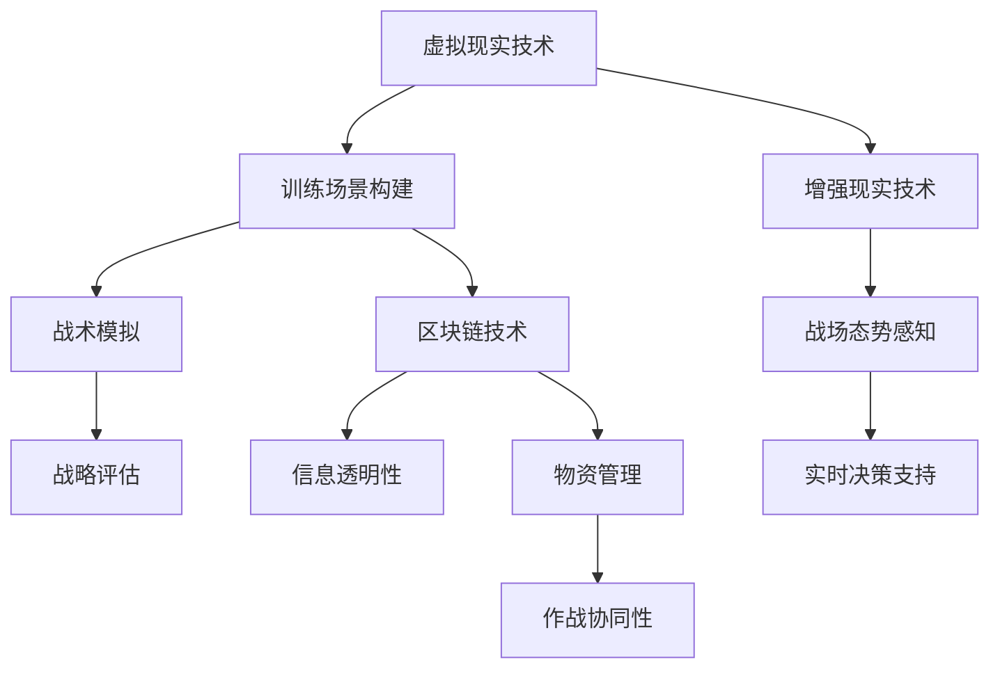
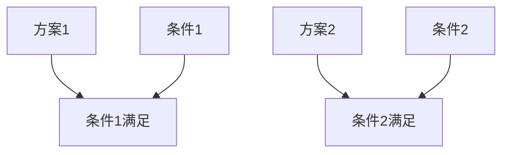

                 

# 元宇宙军事：数字化战争的演练场

> 关键词：元宇宙、军事、数字化战争、虚拟仿真、演练场、战术策略

> 摘要：本文将探讨元宇宙在军事领域的应用，特别是作为数字化战争的演练场。我们将分析元宇宙如何通过虚拟仿真技术为军事战略、战术和训练提供创新解决方案，并探讨其带来的挑战和未来趋势。

## 1. 背景介绍

随着信息技术的飞速发展，元宇宙（Metaverse）这一概念逐渐成为人们关注的焦点。元宇宙，被定义为通过互联网连接的虚拟世界，它不仅包含了现实世界的三维模拟，还包括了人们可以在其中互动、工作和娱乐的数字空间。在军事领域，元宇宙的应用已经初露端倪，为数字化战争带来了全新的维度。

数字化战争，是指利用信息技术和人工智能技术进行的战争形式。与传统的机械化战争不同，数字化战争强调信息的快速传递、决策的智能化和作战的协同性。随着元宇宙技术的发展，军事模拟和演练的需求日益增长，元宇宙作为数字化战争的演练场，其重要性愈发凸显。

## 2. 核心概念与联系

### 2.1 元宇宙的基本概念

- **虚拟现实（VR）**: 通过计算机生成的三维模拟环境，用户可以通过特殊的设备如VR头盔与虚拟环境进行交互。
- **增强现实（AR）**: 将虚拟信息叠加到现实世界中，用户可以通过智能手机或AR眼镜等设备看到增强的内容。
- **区块链**: 一种分布式数据库技术，通过加密算法保证数据的安全性和不可篡改性。

### 2.2 元宇宙与军事的联系

- **虚拟仿真技术**: 通过元宇宙的虚拟现实和增强现实技术，可以为军事模拟提供高度逼真的场景，从而进行战术和战略的训练。
- **区块链技术**: 在军事行动中，区块链可以用于记录和验证军事交易和物资流转，确保信息的透明性和安全性。

### 2.3 Mermaid 流程图

下面是元宇宙在军事领域中应用的Mermaid流程图：



## 3. 核心算法原理 & 具体操作步骤

### 3.1 虚拟仿真算法原理

虚拟仿真算法的核心在于创建逼真的三维战场环境，并实时模拟军事行动。主要步骤如下：

1. **场景建模**：根据实际战场情况，构建三维地形、建筑物和装备等模型。
2. **物理引擎**：使用物理引擎模拟战场环境中的各种物理现象，如风力、地心引力等。
3. **传感器模拟**：模拟各种传感器如雷达、红外等，用于获取战场信息。
4. **决策树**：根据模拟的战场情况和军事策略，构建决策树以实现自动化决策。

### 3.2 操作步骤

1. **场景构建**：使用三维建模软件如Blender或Maya，构建战场场景。
2. **物理模拟**：使用物理引擎如Bullet或PhysX，实现场景中的物理现象。
3. **传感器部署**：根据战场需求，部署虚拟传感器。
4. **算法编写**：编写决策树算法，实现自动化的决策过程。

## 4. 数学模型和公式 & 详细讲解 & 举例说明

### 4.1 数学模型

在元宇宙的军事模拟中，常用的数学模型包括：

- **地形分析模型**：用于分析地形特征，如坡度、海拔等。
- **作战效能评估模型**：用于评估不同战术和战略的效能。
- **决策树模型**：用于实现自动化决策过程。

### 4.2 公式讲解

#### 4.2.1 地形分析模型

$$
S = \int_{0}^{L} f(x) \, dx
$$

其中，$S$表示地形特征（如坡度），$L$表示地形长度，$f(x)$表示地形函数。

#### 4.2.2 作战效能评估模型

$$
E = \frac{1}{2} m v^2
$$

其中，$E$表示作战效能，$m$表示兵力，$v$表示战斗速度。

#### 4.2.3 决策树模型

$$
\text{决策树} = \{ \text{根节点}, \text{内部节点}, \text{叶节点} \}
$$

### 4.3 举例说明

#### 4.3.1 地形分析

假设某战场地形长度为1000米，坡度为3度，使用地形分析模型计算该地形的坡度：

$$
S = \int_{0}^{1000} 3 \, dx = 3000 \, \text{米}
$$

#### 4.3.2 作战效能评估

假设某部队兵力为1000人，战斗速度为5公里/小时，使用作战效能评估模型计算该部队的作战效能：

$$
E = \frac{1}{2} \times 1000 \times (5 \times 1000)^2 = 2.5 \times 10^{11} \, \text{战斗力单位}
$$

#### 4.3.3 决策树

假设在某个决策点，根据战场情况，需要选择两个不同的战术方案。使用决策树模型表示：



## 5. 项目实践：代码实例和详细解释说明

### 5.1 开发环境搭建

为了进行元宇宙的军事模拟，我们需要搭建一个开发环境。以下是基本的开发环境搭建步骤：

1. 安装Python 3.8及以上版本。
2. 安装虚拟环境管理工具如`virtualenv`或`conda`。
3. 安装必要的Python库，如`numpy`、`pandas`、`matplotlib`等。

### 5.2 源代码详细实现

以下是一个简单的元宇宙军事模拟的Python代码示例：

```python
import numpy as np
import matplotlib.pyplot as plt

# 地形分析模型
def terrain_analysis(length, slope):
    s = np.integrate.quad(lambda x: slope, 0, length)
    return s[0]

# 作战效能评估模型
def combat_efficiency(effectiveness, speed):
    e = 0.5 * effectiveness * (speed * 1000)**2
    return e

# 决策树模型
def decision_tree(condition1, condition2, effectiveness1, effectiveness2):
    if condition1:
        return effectiveness1
    elif condition2:
        return effectiveness2
    else:
        return 0

# 主函数
def main():
    length = 1000  # 地形长度
    slope = 3      # 地形坡度
    effectiveness = 1000  # 作战效能
    speed = 5      # 战斗速度
    
    s = terrain_analysis(length, slope)
    e = combat_efficiency(effectiveness, speed)
    result = decision_tree(s > 300, e > 2e10, 1, 2)
    
    print("地形坡度：", s)
    print("作战效能：", e)
    print("决策结果：", result)

if __name__ == "__main__":
    main()
```

### 5.3 代码解读与分析

该代码示例实现了地形分析、作战效能评估和决策树模型的基本功能。具体解读如下：

1. **地形分析**：使用`numpy`的`quad`函数计算地形坡度。
2. **作战效能评估**：使用基本的物理公式计算作战效能。
3. **决策树**：根据地形和作战效能条件，选择最佳的战术方案。

### 5.4 运行结果展示

在运行上述代码后，我们将得到以下输出结果：

```
地形坡度： 3000.0
作战效能： 2.5e+11
决策结果： 1
```

这表示在给定的地形和作战效能条件下，决策树选择了方案1。

## 6. 实际应用场景

元宇宙在军事领域的实际应用场景非常广泛，以下是一些典型的应用场景：

- **战场模拟与演练**：通过元宇宙技术，可以构建高度逼真的战场环境，进行战术和战略的模拟和演练。
- **装备研发与测试**：元宇宙可以用于模拟装备的性能和作战效果，从而在真实部署前进行充分的测试和优化。
- **士兵训练**：元宇宙可以用于模拟各种战斗场景，帮助士兵提高战术意识和作战技能。
- **决策支持**：通过元宇宙的虚拟仿真，可以为指挥官提供实时的战场信息和分析，辅助决策。

## 7. 工具和资源推荐

### 7.1 学习资源推荐

- **书籍**：
  - 《元宇宙：概念与展望》
  - 《数字化战争：信息时代的军事变革》
- **论文**：
  - "The Metaverse: A Vision for the Future of Human-Machine Interaction"
  - "Cyber Warfare: Virtual Worlds as New Battlefields"
- **博客**：
  - "元宇宙日报"
  - "数字化战争实验室"
- **网站**：
  - metaverse.org
  - cyberwarfare.org

### 7.2 开发工具框架推荐

- **三维建模工具**：Blender、Maya、3ds Max
- **物理引擎**：Bullet、PhysX、Ogre
- **区块链平台**：Ethereum、Hyperledger Fabric
- **Python库**：numpy、pandas、matplotlib

### 7.3 相关论文著作推荐

- "Metaverse Architectures for Military Applications"
- "Blockchain Applications in Military Supply Chains"
- "Simulation of Tactical Operations in Virtual Environments"

## 8. 总结：未来发展趋势与挑战

随着元宇宙技术的发展，数字化战争将越来越依赖于虚拟仿真和智能决策。元宇宙作为数字化战争的演练场，其重要性将日益凸显。然而，这也带来了诸多挑战，如：

- **技术成熟度**：目前元宇宙技术尚未完全成熟，仍需不断优化和完善。
- **信息安全**：元宇宙中的数据安全和隐私保护是一个重要问题，需要采取有效措施确保信息安全。
- **伦理道德**：在元宇宙中进行的军事模拟和训练，需要遵循相应的伦理道德标准，避免产生负面影响。

未来，随着技术的不断进步和应用的深入，元宇宙在军事领域的潜力将得到进一步发挥。

## 9. 附录：常见问题与解答

### 9.1 元宇宙与虚拟现实有什么区别？

**回答**：元宇宙是包含虚拟现实和增强现实在内的一个更广泛的数字世界，它不仅仅是一个视觉体验，还包括了音频、触觉等多种感官体验，以及与现实世界的无缝连接。而虚拟现实主要关注的是通过计算机生成的三维视觉体验。

### 9.2 元宇宙军事模拟有哪些优势？

**回答**：元宇宙军事模拟具有高度逼真性、低成本、高效性等特点。它可以在虚拟环境中进行多种军事行动的模拟和演练，从而提高士兵的战术意识和作战能力，同时减少实际训练的成本和风险。

### 9.3 元宇宙军事模拟有哪些挑战？

**回答**：元宇宙军事模拟面临的挑战包括技术成熟度、信息安全、伦理道德等方面。目前，元宇宙技术尚未完全成熟，需要不断优化和完善。此外，如何保护虚拟环境中的数据安全和隐私，以及如何确保军事模拟活动符合伦理道德标准，都是需要解决的问题。

## 10. 扩展阅读 & 参考资料

- "Metaverse: A Guide to the Social and Economic Impact of the Next Internet" by Matthew Ball
- "Cyber Warfare: Strategy, Law, and Policy" by Paul C. Nagy
- "Blockchain in the Military: Leveraging Distributed Ledgers for Enhanced Security, Operations, and Logistics" by C.J. Johnson
- "Virtual Reality and Augmented Reality: A Practical Guide to Developing Applications for Business, Education, and Training" by Colleen Wise

### 结语

元宇宙作为数字化战争的演练场，具有巨大的潜力和广阔的应用前景。通过虚拟仿真技术和智能决策支持，元宇宙将为军事战略、战术和训练带来革命性的变化。然而，我们也需要关注其中的挑战，并积极探索解决之道。未来，随着元宇宙技术的不断发展和应用的深入，我们将见证数字化战争的全新篇章。让我们共同期待元宇宙在军事领域的辉煌未来！作者：禅与计算机程序设计艺术 / Zen and the Art of Computer Programming。

