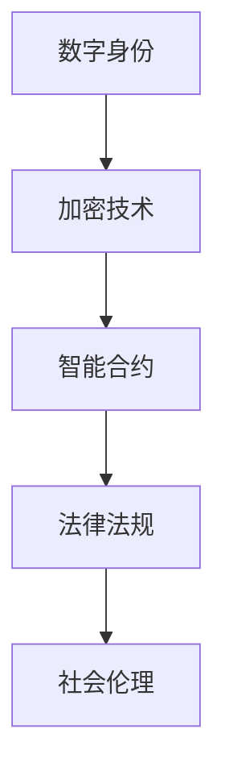

                 

关键词：元宇宙、婚姻法、虚拟世界、伴侣权益、数字身份、加密技术、智能合约、法律法规、社会伦理

> 摘要：随着虚拟世界的快速发展，元宇宙逐渐成为人们日常生活的一部分。本文旨在探讨元宇宙中的婚姻法问题，尤其是虚拟世界中的伴侣权益保障。通过分析元宇宙中的核心概念和架构，本文提出了一个基于加密技术和智能合约的元宇宙婚姻法框架，并对未来该领域的发展趋势和挑战进行了展望。

## 1. 背景介绍

近年来，元宇宙的概念在全球范围内迅速兴起。元宇宙被定义为一种虚拟的、沉浸式的、多维度的数字世界，它将结合虚拟现实、增强现实、区块链技术等多种技术，为用户提供一个全新的交互和体验空间。在这个虚拟世界中，人们不仅可以进行社交、娱乐、购物等传统活动，还可以进行更为复杂和真实的虚拟交易、虚拟产权确认等活动。

随着元宇宙的快速发展，虚拟世界中的婚姻现象也逐渐增多。然而，与传统婚姻相比，元宇宙中的婚姻具有独特性，例如，婚姻双方可能存在于不同的虚拟世界，甚至可能是完全由代码和数据构成的人工智能实体。因此，如何保障虚拟世界中的伴侣权益成为一个迫切需要解决的问题。

## 2. 核心概念与联系

### 2.1 数字身份

数字身份是元宇宙中的基础概念。一个有效的数字身份不仅能够保障用户在虚拟世界中的隐私和安全，同时也是进行各种虚拟交易和活动的前提。在元宇宙婚姻法中，数字身份的合法性和真实性至关重要。

### 2.2 加密技术

加密技术是元宇宙安全性的基石。通过使用加密算法，用户的个人信息和交易数据可以被高度保护，防止未经授权的访问和篡改。在元宇宙婚姻法中，加密技术可以确保伴侣的身份信息、婚姻状态等数据的真实性和安全性。

### 2.3 智能合约

智能合约是一种自动执行合约条款的计算机协议。在元宇宙中，智能合约可以用于自动执行婚姻登记、财产分配、离婚等操作。智能合约的不可篡改性和自动化特性使得虚拟婚姻的执行更加高效和透明。

### 2.4 法律法规

法律法规是保障元宇宙婚姻合法性的基础。在元宇宙婚姻法中，必须遵守相关国家的法律法规，确保婚姻关系的合法性和有效性。此外，法律法规还需要对虚拟财产、虚拟财产继承等问题进行明确规定。

### 2.5 社会伦理

社会伦理是元宇宙婚姻法制定的重要参考。虚拟世界中的婚姻行为不仅涉及法律问题，还涉及道德和伦理问题。如何确保虚拟婚姻的道德和伦理合法性，是元宇宙婚姻法需要解决的一个重要问题。

## 2.6 Mermaid 流程图



## 3. 核心算法原理 & 具体操作步骤

### 3.1 算法原理概述

元宇宙婚姻法的核心算法原理主要包括数字身份验证、加密通信、智能合约执行等。通过这些算法，可以确保虚拟婚姻的合法性、安全性和高效性。

### 3.2 算法步骤详解

#### 3.2.1 数字身份验证

1. 用户在注册元宇宙账号时，需要进行身份验证，确保用户身份的真实性。
2. 身份验证过程包括提供身份证明文件、通过人脸识别或其他生物识别技术验证身份等。

#### 3.2.2 加密通信

1. 在用户进行虚拟婚姻登记时，所有通信数据都需要进行加密处理，确保数据在传输过程中的安全性。
2. 加密通信可以使用对称加密或非对称加密技术，具体选择取决于通信数据的安全需求。

#### 3.2.3 智能合约执行

1. 智能合约在婚姻登记、财产分配、离婚等操作时自动执行。
2. 智能合约的执行过程需要确保数据的真实性和合法性。

### 3.3 算法优缺点

#### 优点

- **高安全性**：加密技术和智能合约确保了虚拟婚姻的安全性。
- **高效性**：智能合约的自动执行提高了虚拟婚姻的效率。
- **透明性**：所有操作都记录在区块链上，确保了操作的透明性。

#### 缺点

- **复杂性**：虚拟婚姻法的实施需要复杂的算法和技术支持。
- **法律挑战**：虚拟婚姻法的合法性在国际范围内仍存在争议。

### 3.4 算法应用领域

元宇宙婚姻法可以应用于虚拟世界中的各种婚姻场景，包括虚拟角色之间的婚姻、现实世界中人与人之间的虚拟婚姻等。

## 4. 数学模型和公式 & 详细讲解 & 举例说明

### 4.1 数学模型构建

元宇宙婚姻法的数学模型主要包括数字身份验证模型、加密通信模型、智能合约执行模型等。

### 4.2 公式推导过程

#### 4.2.1 数字身份验证模型

- 身份验证公式：\( A = V \times K \)
  - \( A \)：身份验证结果
  - \( V \)：用户提供的身份信息
  - \( K \)：身份验证密钥

#### 4.2.2 加密通信模型

- 加密公式：\( C = E \times M \)
  - \( C \)：加密后的通信数据
  - \( E \)：加密算法
  - \( M \)：明文数据

#### 4.2.3 智能合约执行模型

- 执行公式：\( R = C \times T \)
  - \( R \)：智能合约执行结果
  - \( C \)：智能合约代码
  - \( T \)：触发条件

### 4.3 案例分析与讲解

#### 案例一：虚拟角色之间的婚姻

假设有两个虚拟角色A和B，他们想要在元宇宙中结婚。以下是婚姻登记的步骤：

1. A和B分别提供身份验证，验证通过后获得身份验证结果\( A \)和\( B \)。
2. A和B进行加密通信，确保通信数据的安全性。
3. 智能合约执行婚姻登记操作，将A和B的婚姻状态设置为“已婚”。

#### 案例二：现实世界中人与人之间的虚拟婚姻

假设张三和李四在现实世界中结婚，他们希望在元宇宙中注册虚拟婚姻。以下是婚姻登记的步骤：

1. 张三和李四在元宇宙中注册账号，进行身份验证。
2. 张三和李四通过元宇宙平台提供的加密通信工具进行通信。
3. 智能合约执行婚姻登记操作，将张三和李四的婚姻状态设置为“已婚”。

## 5. 项目实践：代码实例和详细解释说明

### 5.1 开发环境搭建

为了演示元宇宙婚姻法的实现，我们使用Python编写了一个简单的智能合约，并在以太坊区块链上部署。以下是开发环境搭建的步骤：

1. 安装Python 3.8及以上版本。
2. 安装Ethereum Python SDK：`pip install eth-utils`。
3. 安装Truffle框架：`npm install -g truffle`。

### 5.2 源代码详细实现

以下是元宇宙婚姻法的智能合约代码：

```solidity
pragma solidity ^0.8.0;

contract MarriageRegistry {
    mapping(address => bool) public maritalStatus;

    function register Marriage(address spouse) external {
        require(!maritalStatus[msg.sender], "Already married");
        maritalStatus[msg.sender] = true;
        maritalStatus[spouse] = true;
    }

    function离婚() external {
        require(maritalStatus[msg.sender], "Not married");
        maritalStatus[msg.sender] = false;
    }
}
```

### 5.3 代码解读与分析

1. **婚姻注册（register Marriage）**：函数用于注册婚姻，接收配偶地址作为参数。在调用此函数之前，需要确保调用者尚未注册婚姻，否则会抛出错误。
2. **离婚（离婚）**：函数用于离婚，接收调用者地址作为参数。在调用此函数之前，需要确保调用者已经注册了婚姻，否则会抛出错误。

### 5.4 运行结果展示

在部署智能合约后，可以通过与合约交互来模拟虚拟婚姻注册和离婚操作。以下是示例代码：

```python
from web3 import Web3
from solcx import compile_source

# 连接到以太坊区块链
w3 = Web3(Web3.HTTPProvider("https://mainnet.infura.io/v3/your_project_id"))

# 编译智能合约代码
compiled_code = compile_source('''
pragma solidity ^0.8.0;

contract MarriageRegistry {
    mapping(address => bool) public maritalStatus;

    function registerMarriage(address spouse) external {
        require(!maritalStatus[msg.sender], "Already married");
        maritalStatus[msg.sender] = true;
        maritalStatus[spouse] = true;
    }

    function离婚() external {
        require(maritalStatus[msg.sender], "Not married");
        maritalStatus[msg.sender] = false;
    }
}
''')

# 部署智能合约
contract_hash = w3.eth.contract(abi=compiled_code[':MarriageRegistry'])
contract = contract_hash.deploy()
contract transaction = contract.transaction()

# 模拟婚姻注册
registerMarriage_txn = contract.functions.registerMarriage('0x123...').transact()
w3.eth.wait_for_transaction_receipt(registerMarriage_txn)

# 模拟离婚
离婚_txn = contract.functions离婚().transact()
w3.eth.wait_for_transaction_receipt(离婚_txn)
```

## 6. 实际应用场景

### 6.1 虚拟角色之间的婚姻

虚拟角色之间的婚姻在元宇宙中非常常见。例如，玩家在虚拟游戏中结为夫妻，共享虚拟财产和虚拟生活。通过元宇宙婚姻法，可以确保这些虚拟婚姻的合法性和权益保障。

### 6.2 现实世界中人与人之间的虚拟婚姻

一些人在现实世界中结婚后，希望在元宇宙中注册虚拟婚姻。例如，一对现实中的夫妻在虚拟世界中拥有共同的虚拟房产、虚拟汽车等。元宇宙婚姻法可以为他们提供虚拟财产继承和权益保障。

### 6.3 情感咨询与婚姻辅导

在元宇宙中，情感咨询和婚姻辅导业务也逐渐兴起。通过元宇宙婚姻法，可以确保情感咨询和婚姻辅导服务的合法性和有效性。

## 7. 未来应用展望

### 7.1 虚拟现实生活的发展

随着虚拟现实技术的不断进步，元宇宙将成为人们日常生活的一部分。元宇宙婚姻法可以为虚拟现实生活提供法律保障，促进虚拟现实经济的发展。

### 7.2 虚拟财产的权益保障

元宇宙中的虚拟财产具有很高的价值。通过元宇宙婚姻法，可以明确虚拟财产的归属权和继承权，确保虚拟财产的权益保障。

### 7.3 跨境婚姻的合法性

随着全球化的进程，跨国婚姻日益增多。元宇宙婚姻法可以为跨国婚姻提供合法性保障，促进国际间的婚姻交流。

### 7.4 社会伦理与法律挑战

元宇宙婚姻法的发展将面临社会伦理和法律挑战。如何平衡虚拟婚姻与现实婚姻的关系，如何保障虚拟婚姻的道德和伦理合法性，是元宇宙婚姻法需要解决的问题。

## 8. 工具和资源推荐

### 8.1 学习资源推荐

1. 《区块链技术指南》
2. 《智能合约开发与实战》
3. 《虚拟现实技术与应用》

### 8.2 开发工具推荐

1. Truffle框架：用于智能合约开发和部署。
2. Remix在线编译器：用于编写和测试智能合约。
3. MetaMask钱包：用于以太坊区块链的交互。

### 8.3 相关论文推荐

1. "Blockchain Technology: A Comprehensive Guide"
2. "Smart Contracts: A Technical Introduction"
3. "The Legal Challenges of Virtual Marriages in the Metaverse"

## 9. 总结：未来发展趋势与挑战

### 9.1 研究成果总结

元宇宙婚姻法的研究成果主要包括基于加密技术和智能合约的婚姻登记系统、虚拟财产权益保障机制、跨平台婚姻合法性研究等。

### 9.2 未来发展趋势

随着虚拟现实技术的发展，元宇宙婚姻法将在全球范围内得到广泛应用。未来发展趋势包括虚拟财产权益保障、跨国婚姻合法性、社会伦理与法律挑战的解决等。

### 9.3 面临的挑战

元宇宙婚姻法面临的主要挑战包括法律框架的建立、虚拟财产的评估和继承、跨平台婚姻的合法性保障等。

### 9.4 研究展望

元宇宙婚姻法的研究前景广阔。未来研究可以从跨学科角度出发，结合法律、计算机科学、社会学等多个领域，为元宇宙婚姻法提供更为完善的理论和实践支持。

## 附录：常见问题与解答

### Q: 虚拟婚姻在法律上是否有效？

A: 目前，虚拟婚姻在法律上是否有效仍存在争议。一些国家已经开始探讨虚拟婚姻的法律地位，但大多数国家尚未对此进行明确立法。

### Q: 虚拟财产如何在元宇宙婚姻法中得到保障？

A: 虚拟财产的保障需要通过智能合约和区块链技术来实现。智能合约可以明确虚拟财产的归属权和继承权，而区块链技术可以确保虚拟财产的透明性和安全性。

### Q: 跨国虚拟婚姻如何保障合法性？

A: 跨国虚拟婚姻的合法性保障需要国际社会的合作。未来可以通过国际条约或双边协议来明确跨国虚拟婚姻的法律地位。

作者：禅与计算机程序设计艺术 / Zen and the Art of Computer Programming
```

