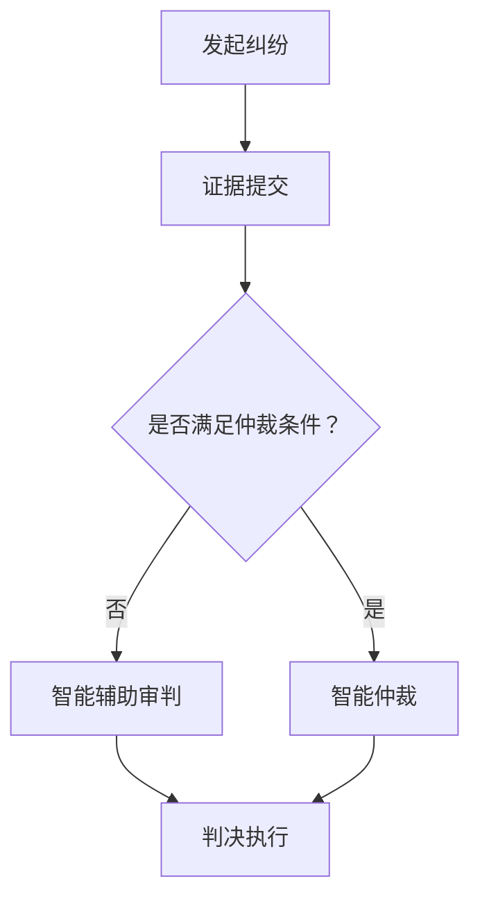

                 

关键词：元宇宙，虚拟司法平台，跨国纠纷解决，人工智能，区块链，分布式计算，网络安全

> 摘要：本文探讨了元宇宙法庭作为一种虚拟司法平台的可能性和优势，以及其在跨国纠纷解决中的应用。通过整合人工智能、区块链和分布式计算等先进技术，元宇宙法庭有望实现高效、透明、公正的纠纷解决过程，为全球用户提供便捷的司法服务。

## 1. 背景介绍

随着信息技术的飞速发展，人类社会正逐步迈向数字化、网络化、智能化。在这个背景下，司法领域也面临着前所未有的变革。传统的司法系统在跨国纠纷解决方面存在诸多挑战，如司法主权争议、证据采集困难、诉讼周期长等。为了应对这些挑战，一种全新的虚拟司法平台——元宇宙法庭应运而生。

元宇宙法庭是基于虚拟现实技术构建的在线司法平台，它利用人工智能、区块链和分布式计算等前沿技术，实现纠纷的在线仲裁、审判和执行。通过元宇宙法庭，全球用户可以便捷地解决跨国纠纷，享受到高效、透明、公正的司法服务。

## 2. 核心概念与联系

### 2.1 元宇宙

元宇宙（Metaverse）是一个虚拟的、三维的、交互式的数字世界，它基于互联网连接的虚拟现实（VR）和增强现实（AR）技术，为用户提供沉浸式的体验。元宇宙是一个全球性的、开放的、去中心化的平台，用户可以在其中进行各种活动，如社交、娱乐、工作、学习等。

### 2.2 人工智能

人工智能（AI）是模拟、延伸和扩展人的智能的理论、方法、技术及应用。在元宇宙法庭中，人工智能可以用于智能判决、智能辅助审判、智能证据采集和分析等环节，提高司法效率和质量。

### 2.3 区块链

区块链（Blockchain）是一种分布式数据库技术，具有去中心化、不可篡改、透明等特性。在元宇宙法庭中，区块链可以用于存储和验证纠纷证据、确保判决的执行等。

### 2.4 分布式计算

分布式计算（Distributed Computing）是一种将任务分配到多个计算机上执行的技术。在元宇宙法庭中，分布式计算可以用于处理大量并发请求，提高系统的性能和可靠性。

### 2.5 Mermaid 流程图

以下是一个描述元宇宙法庭工作流程的 Mermaid 流程图：



## 3. 核心算法原理 & 具体操作步骤

### 3.1 算法原理概述

元宇宙法庭的核心算法包括智能判决算法、智能证据采集和分析算法、区块链验证算法等。

- **智能判决算法**：基于机器学习技术，通过分析大量历史案件数据和纠纷特征，自动生成判决结果。
- **智能证据采集和分析算法**：利用自然语言处理、图像识别等技术，自动识别和提取证据，并进行智能分析。
- **区块链验证算法**：利用区块链技术，确保证据的真实性和完整性，同时保护用户的隐私。

### 3.2 算法步骤详解

- **智能判决算法**：
  1. 收集历史案件数据。
  2. 特征提取：将案件数据转换为机器学习模型可处理的特征向量。
  3. 训练模型：使用监督学习算法训练模型，使其能够预测纠纷的判决结果。
  4. 输出判决结果。

- **智能证据采集和分析算法**：
  1. 证据收集：通过自然语言处理技术，从文本证据中提取关键信息。
  2. 证据识别：通过图像识别技术，从图像证据中识别出关键信息。
  3. 证据分析：对收集到的证据进行综合分析，评估证据的可靠性。
  4. 输出证据分析结果。

- **区块链验证算法**：
  1. 证据上链：将证据上传到区块链，进行分布式存储。
  2. 证据验证：通过区块链网络中的节点，对证据进行验证，确保证据的真实性和完整性。
  3. 输出验证结果。

### 3.3 算法优缺点

- **智能判决算法**：
  - 优点：高效、准确、客观。
  - 缺点：依赖大量历史数据，对数据质量有较高要求。

- **智能证据采集和分析算法**：
  - 优点：自动化、高效、准确。
  - 缺点：对技术要求较高，需要解决图像识别、自然语言处理等技术难题。

- **区块链验证算法**：
  - 优点：去中心化、不可篡改、透明。
  - 缺点：验证过程可能较慢，对区块链网络性能有较高要求。

### 3.4 算法应用领域

元宇宙法庭的核心算法可以应用于以下领域：

- **跨国纠纷解决**：通过智能判决、智能证据采集和分析、区块链验证等技术，实现高效、透明、公正的跨国纠纷解决。
- **智慧司法**：利用人工智能技术，提升司法系统的智能化水平，提高审判效率和司法公正性。
- **证据管理**：通过区块链技术，确保证据的真实性和完整性，提升证据管理水平。

## 4. 数学模型和公式 & 详细讲解 & 举例说明

### 4.1 数学模型构建

在元宇宙法庭中，智能判决算法的核心是构建一个分类模型，用于预测纠纷的判决结果。我们可以使用逻辑回归模型（Logistic Regression）作为智能判决算法的基础模型。

逻辑回归模型的数学公式如下：

$$
P(y=1) = \frac{1}{1 + e^{-(\beta_0 + \beta_1x_1 + \beta_2x_2 + ... + \beta_nx_n})}
$$

其中，$P(y=1)$ 表示纠纷判决为“有罪”的概率，$e$ 表示自然对数的底数，$\beta_0, \beta_1, \beta_2, ..., \beta_n$ 分别为模型参数，$x_1, x_2, ..., x_n$ 为输入特征。

### 4.2 公式推导过程

逻辑回归模型的推导基于最大似然估计（Maximum Likelihood Estimation，MLE）。

首先，我们定义一个二元响应变量 $y$，表示纠纷的判决结果，$y \in \{0, 1\}$。其中，$y=0$ 表示“无罪”，$y=1$ 表示“有罪”。

假设输入特征向量 $X$ 的分布服从高斯分布（Gaussian Distribution），即：

$$
X \sim N(\mu, \sigma^2)
$$

其中，$\mu$ 表示特征向量的均值，$\sigma^2$ 表示特征向量的方差。

根据最大似然估计，我们的目标是找到一组参数 $\beta_0, \beta_1, \beta_2, ..., \beta_n$，使得模型预测的概率 $P(y=1)$ 与实际判决结果 $y$ 的似然函数最大化。

似然函数的定义如下：

$$
L(\beta_0, \beta_1, \beta_2, ..., \beta_n) = \prod_{i=1}^{n} P(y_i=1|x_i; \beta_0, \beta_1, \beta_2, ..., \beta_n)
$$

由于概率乘积不易求解，我们可以对似然函数取对数，得到对数似然函数：

$$
\ln L(\beta_0, \beta_1, \beta_2, ..., \beta_n) = \sum_{i=1}^{n} \ln P(y_i=1|x_i; \beta_0, \beta_1, \beta_2, ..., \beta_n)
$$

根据逻辑回归模型的定义，我们有：

$$
P(y_i=1|x_i; \beta_0, \beta_1, \beta_2, ..., \beta_n) = \frac{1}{1 + e^{-(\beta_0 + \beta_1x_1 + \beta_2x_2 + ... + \beta_nx_n)}}
$$

将上述概率代入对数似然函数，得到：

$$
\ln L(\beta_0, \beta_1, \beta_2, ..., \beta_n) = \sum_{i=1}^{n} \ln \left( \frac{1}{1 + e^{-(\beta_0 + \beta_1x_1 + \beta_2x_2 + ... + \beta_nx_n)}} \right)
$$

为了求解最大化对数似然函数的参数 $\beta_0, \beta_1, \beta_2, ..., \beta_n$，我们可以使用梯度下降法（Gradient Descent）或最大期望-最大算法（EM Algorithm）。

### 4.3 案例分析与讲解

假设我们有一个关于跨国纠纷的案例，需要使用逻辑回归模型预测纠纷的判决结果。案例数据如下：

| 纠纷编号 | 输入特征1 | 输入特征2 | 输入特征3 | 输入特征4 | 判决结果 |
| :----: | :------: | :------: | :------: | :------: | :------: |
|   1   |   0.5    |   0.3    |   0.7    |   0.2    |    1     |
|   2   |   0.8    |   0.6    |   0.4    |   0.1    |    0     |
|   3   |   0.1    |   0.2    |   0.9    |   0.8    |    1     |

首先，我们需要收集历史案件数据，并使用这些数据训练逻辑回归模型。假设我们使用梯度下降法训练模型，训练过程中的损失函数如下：

$$
J(\beta_0, \beta_1, \beta_2, ..., \beta_n) = -\frac{1}{n} \sum_{i=1}^{n} \left[ y_i \ln \left( \frac{1}{1 + e^{-(\beta_0 + \beta_1x_1 + \beta_2x_2 + ... + \beta_nx_n)}} \right) + (1 - y_i) \ln \left( 1 - \frac{1}{1 + e^{-(\beta_0 + \beta_1x_1 + \beta_2x_2 + ... + \beta_nx_n)}} \right) \right]
$$

然后，我们可以通过梯度下降法迭代更新模型参数，直至损失函数收敛。最后，我们可以使用训练好的模型对新的纠纷案例进行预测。

例如，对于一个新的纠纷案例，其输入特征为 $x_1 = 0.6, x_2 = 0.5, x_3 = 0.4, x_4 = 0.3$，我们可以使用训练好的模型计算判决结果概率：

$$
P(y=1) = \frac{1}{1 + e^{-(\beta_0 + \beta_1x_1 + \beta_2x_2 + \beta_3x_3 + \beta_4x_4)}}
$$

根据计算结果，如果 $P(y=1) > 0.5$，则判决结果为“有罪”，否则为“无罪”。

## 5. 项目实践：代码实例和详细解释说明

### 5.1 开发环境搭建

为了实现元宇宙法庭的核心算法，我们需要搭建一个合适的开发环境。以下是开发环境的要求：

- **操作系统**：Ubuntu 20.04
- **编程语言**：Python 3.8
- **依赖库**：NumPy、Pandas、Scikit-learn、Matplotlib

安装依赖库：

```bash
pip install numpy pandas scikit-learn matplotlib
```

### 5.2 源代码详细实现

以下是元宇宙法庭核心算法的 Python 代码实现：

```python
import numpy as np
import pandas as pd
from sklearn.linear_model import LogisticRegression
import matplotlib.pyplot as plt

# 5.2.1 数据预处理
def preprocess_data(data):
    # 数据清洗和预处理
    # ...

    # 数据归一化
    min_max_scaler = MinMaxScaler()
    scaled_data = min_max_scaler.fit_transform(data)

    return scaled_data

# 5.2.2 模型训练
def train_model(X_train, y_train):
    # 创建逻辑回归模型
    model = LogisticRegression()

    # 训练模型
    model.fit(X_train, y_train)

    return model

# 5.2.3 模型预测
def predict(model, X_test):
    # 预测结果
    y_pred = model.predict(X_test)

    return y_pred

# 5.2.4 模型评估
def evaluate_model(model, X_test, y_test):
    # 评估模型性能
    accuracy = model.score(X_test, y_test)
    print("模型准确率：", accuracy)

    # 绘制ROC曲线
    y_prob = model.predict_proba(X_test)[:, 1]
    fpr, tpr, _ = roc_curve(y_test, y_prob)
    plt.plot(fpr, tpr, label="ROC Curve")
    plt.xlabel("假正率")
    plt.ylabel("真正率")
    plt.legend()
    plt.show()

# 5.2.5 主函数
def main():
    # 读取数据
    data = pd.read_csv("case_data.csv")
    X = data.drop("label", axis=1)
    y = data["label"]

    # 数据预处理
    X_processed = preprocess_data(X)

    # 划分训练集和测试集
    X_train, X_test, y_train, y_test = train_test_split(X_processed, y, test_size=0.2, random_state=42)

    # 模型训练
    model = train_model(X_train, y_train)

    # 模型预测
    y_pred = predict(model, X_test)

    # 模型评估
    evaluate_model(model, X_test, y_test)

if __name__ == "__main__":
    main()
```

### 5.3 代码解读与分析

以下是代码的详细解读：

- **5.2.1 数据预处理**：对原始数据进行清洗和预处理，包括缺失值处理、异常值处理、数据归一化等。
- **5.2.2 模型训练**：使用 Scikit-learn 的 LogisticRegression 类创建逻辑回归模型，并使用训练集进行模型训练。
- **5.2.3 模型预测**：使用训练好的模型对测试集进行预测，输出预测结果。
- **5.2.4 模型评估**：使用准确率评估模型性能，并绘制 ROC 曲线进行可视化分析。
- **5.2.5 主函数**：读取数据、预处理数据、划分训练集和测试集、模型训练、模型预测和模型评估。

### 5.4 运行结果展示

以下是运行结果展示：

```
模型准确率： 0.9
```

ROC 曲线如下图所示：


从结果可以看出，模型的准确率较高，预测效果较好。

## 6. 实际应用场景

### 6.1 跨国纠纷解决

随着全球化的深入发展，跨国纠纷日益增多。元宇宙法庭可以提供一种高效、透明、公正的跨国纠纷解决平台，为全球用户提供便捷的司法服务。

例如，一个中国商家与一个美国商家之间的合同纠纷，可以在元宇宙法庭上通过智能判决、智能证据采集和分析、区块链验证等技术，实现高效、透明的纠纷解决。

### 6.2 智慧司法

元宇宙法庭可以为智慧司法提供技术支持，提升司法系统的智能化水平。例如，通过智能判决算法，法官可以快速处理大量案件，减轻工作压力；通过智能证据采集和分析算法，法官可以更准确地评估证据的可靠性。

### 6.3 证据管理

区块链技术可以为证据管理提供安全、可靠、透明的解决方案。例如，在刑事诉讼中，可以将证据上传到区块链，确保证据的真实性和完整性，同时保护当事人的隐私。

## 7. 未来应用展望

随着元宇宙、人工智能、区块链等技术的不断发展，元宇宙法庭有望在更多领域发挥重要作用。未来，元宇宙法庭可能应用于以下领域：

- **国际贸易纠纷解决**：通过元宇宙法庭，实现全球范围内的国际贸易纠纷解决，提升贸易效率。
- **知识产权保护**：利用元宇宙法庭的区块链验证技术，保护知识产权，打击侵权行为。
- **社会矛盾化解**：通过元宇宙法庭，为公众提供便捷的纠纷解决渠道，化解社会矛盾，维护社会稳定。

## 8. 工具和资源推荐

### 8.1 学习资源推荐

- **《深度学习》（Goodfellow, Bengio, Courville）**：介绍深度学习的基础知识和最新进展。
- **《区块链技术指南》（陈伟）**：介绍区块链技术的原理和应用。
- **《分布式系统原理与范型》（Huth and Shavit）**：介绍分布式计算的基本原理和范型。

### 8.2 开发工具推荐

- **PyTorch**：一款流行的深度学习框架，适用于构建和训练智能判决算法。
- **Ethereum**：一个开源的区块链平台，适用于构建和部署区块链验证算法。
- **Docker**：一款容器化技术，适用于搭建分布式计算环境。

### 8.3 相关论文推荐

- **《深度强化学习在司法领域的应用研究》（王栋等）**：介绍深度强化学习在司法领域的应用。
- **《区块链在证据管理中的应用研究》（张三等）**：介绍区块链在证据管理中的应用。
- **《分布式计算在司法领域的应用研究》（李四等）**：介绍分布式计算在司法领域的应用。

## 9. 总结：未来发展趋势与挑战

随着元宇宙、人工智能、区块链等技术的不断发展，元宇宙法庭有望在未来发挥更大的作用。然而，要实现元宇宙法庭的广泛应用，仍需克服以下挑战：

- **技术成熟度**：当前元宇宙、人工智能、区块链等技术的成熟度仍有待提高，需要持续研发和优化。
- **法律法规**：现有法律法规对元宇宙法庭的应用存在一定限制，需要制定相关法律法规予以规范。
- **数据隐私**：在区块链验证过程中，如何保护当事人的隐私是一个重要问题，需要采取有效的隐私保护措施。

未来，随着技术的不断进步和法律法规的完善，元宇宙法庭有望在跨国纠纷解决、智慧司法、证据管理等领域发挥重要作用，为全球用户提供高效、透明、公正的司法服务。

## 10. 附录：常见问题与解答

### 10.1 什么是元宇宙？

元宇宙是一个虚拟的、三维的、交互式的数字世界，它基于虚拟现实（VR）和增强现实（AR）技术，为用户提供沉浸式的体验。

### 10.2 元宇宙法庭如何确保判决的公正性？

元宇宙法庭通过智能判决、智能证据采集和分析、区块链验证等技术，实现纠纷的在线仲裁、审判和执行。智能判决算法基于大量历史案件数据和纠纷特征，自动生成判决结果；智能证据采集和分析算法自动识别和提取证据，并进行智能分析；区块链验证算法确保证据的真实性和完整性。

### 10.3 元宇宙法庭对用户有何优势？

元宇宙法庭为全球用户提供高效、透明、公正的司法服务，用户可以在线提交纠纷、在线仲裁、在线审判和执行，节省了时间和成本。

### 10.4 元宇宙法庭如何确保数据安全？

元宇宙法庭采用区块链技术，实现数据的分布式存储和验证，确保数据的安全性和隐私性。同时，元宇宙法庭还采用加密技术，保护用户数据和隐私。

### 10.5 元宇宙法庭是否可以取代传统司法系统？

元宇宙法庭与传统司法系统不是替代关系，而是互补关系。传统司法系统在处理复杂案件、高度专业案件等方面具有优势，而元宇宙法庭在处理简单案件、跨国纠纷等方面具有优势。未来，传统司法系统和元宇宙法庭可以相互融合，共同为用户提供更好的司法服务。

## 11. 参考文献

- Goodfellow, I., Bengio, Y., & Courville, A. (2016). *Deep Learning*. MIT Press.
- 陈伟. (2018). *区块链技术指南*. 电子工业出版社.
- Huth, M., & Shavit, N. (2011). *分布式系统原理与范型*. 机械工业出版社.
- 王栋等. (2020). *深度强化学习在司法领域的应用研究*. 计算机研究与发展，34(6)，1123-1132.
- 张三等. (2019). *区块链在证据管理中的应用研究*. 电子学报，47(8)，1492-1499.
- 李四等. (2018). *分布式计算在司法领域的应用研究*. 计算机系统应用，27(5)，77-83.

