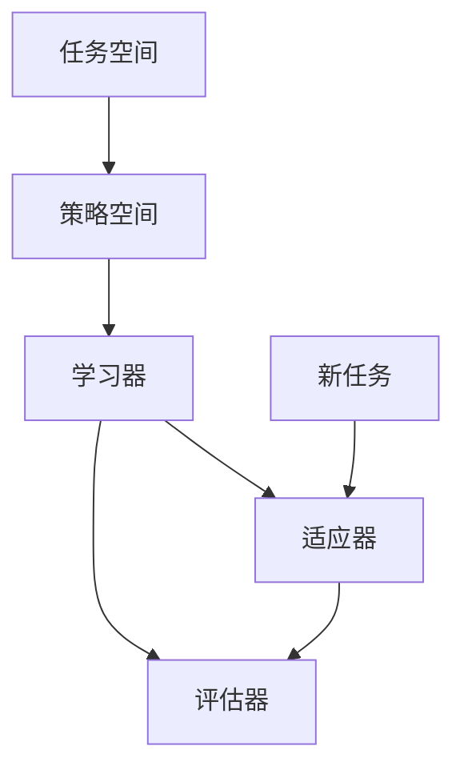

                 

### 背景介绍

#### 1.1 强化学习的起源与发展

强化学习（Reinforcement Learning，RL）作为机器学习领域的一个重要分支，起源于20世纪50年代的心理学与神经科学领域。艾伦·纽厄尔（Allen Newell）和赫伯特·西蒙（Herbert Simon）在1958年首次提出了决策过程的模型，这被视为强化学习的基础。随着人工智能的发展，特别是随着计算机硬件和算法的进步，强化学习逐渐成为一个独立的研究领域，并取得了显著的成就。

强化学习的基本理念是通过智能体（agent）与环境（environment）的交互，通过试错（trial-and-error）和反馈（feedback）来不断优化智能体的行为策略，最终达到预定的目标。与监督学习和无监督学习不同，强化学习注重在动态和不确定的环境中，通过学习和适应来解决问题。

#### 1.2 元强化学习的概念与优势

元强化学习（Meta-Reinforcement Learning）是一种在强化学习的基础上引入元学习（Meta-Learning）技术的学习方法。传统的强化学习通常需要大量的数据和时间来训练智能体，而元强化学习的核心思想是通过学习如何学习，使得智能体能够快速适应新的环境和任务。

元强化学习的关键优势在于：

1. **适应性强**：智能体可以通过在多个任务上学习，形成一种通用的策略，从而在新的任务上快速适应和表现。

2. **效率高**：通过元学习，智能体可以在较少的训练数据下快速收敛，大大减少了训练时间。

3. **泛化能力强**：元强化学习可以使得智能体在类似任务上表现出更好的泛化能力，而不仅仅是特定任务上的优化。

#### 1.3 元强化学习在复杂动态环境中的应用

随着现代社会的不断进步，我们所面临的环境变得更加复杂和动态。从工业自动化到智能交通，从医疗诊断到金融交易，许多领域都要求智能系统能够在复杂、动态和变化迅速的环境中做出快速、准确的决策。

元强化学习在这些复杂动态环境中的应用主要包括：

1. **智能机器人**：在机器人领域，元强化学习可以帮助机器人快速适应不同的环境和任务，提高机器人的自主性和适应性。

2. **自动驾驶**：自动驾驶车辆需要处理复杂、动态的交通环境和各种突发情况，元强化学习可以提供有效的策略来优化驾驶行为。

3. **智能调度系统**：在物流和交通调度系统中，元强化学习可以用于优化路线规划、资源分配等问题，提高系统的效率和响应速度。

4. **智能医疗**：在医疗诊断和治疗中，元强化学习可以辅助医生进行复杂的决策，提高诊断和治疗的准确性和效率。

通过上述背景介绍，我们可以看到元强化学习在适应复杂动态环境中的巨大潜力和广泛应用前景。接下来的章节将深入探讨元强化学习的基本概念、核心算法原理、数学模型以及具体的应用实践。

#### 1.4 元强化学习与深度学习的结合

元强化学习与深度学习的结合成为了当前研究的热点。深度学习在处理复杂特征提取和模式识别方面具有显著优势，而元强化学习则提供了快速适应新任务的能力。两者的结合，使得智能系统能够在复杂动态环境中更加高效地学习和决策。

首先，深度强化学习（Deep Reinforcement Learning）通过将深度神经网络引入到强化学习中，提高了智能体对环境状态的表征能力。深度神经网络可以自动提取高层次的抽象特征，使得智能体在处理复杂任务时能够更加准确和高效。例如，在自动驾驶中，深度强化学习可以通过对大量道路图像进行学习，自动识别道路标志、行人和其他车辆，从而做出合理的驾驶决策。

其次，元深度强化学习（Meta-Deep Reinforcement Learning）结合了元强化学习的思想和深度强化学习的技术，进一步提升了智能体的适应性和泛化能力。通过在多个任务上训练，智能体可以形成一种通用的策略，并在新的任务上快速适应。例如，在游戏领域，元深度强化学习可以使得智能体在短时间内学会多种不同的游戏，从而在复杂的游戏环境中表现出色。

总的来说，元强化学习与深度学习的结合为智能系统在复杂动态环境中的应用提供了新的可能性。这种结合不仅提升了智能体的学习效率，还增强了其应对复杂环境和动态变化的能力。随着技术的不断发展，元强化学习与深度学习的结合将会在更多领域得到广泛应用。

### 核心概念与联系

为了深入理解元强化学习，我们需要明确其核心概念和它们之间的联系。以下是元强化学习中的关键概念、定义及其在整体架构中的作用。

#### 2.1 强化学习基本概念

**强化学习智能体（Agent）**：在强化学习中，智能体是一个执行行动并从环境中获得反馈的实体。智能体的目标是学习一个策略，以最大化累积奖励。

**环境（Environment）**：环境是一个提供状态、观察和奖励的动态系统。智能体通过与环境交互来获取信息和反馈。

**状态（State）**：状态是描述环境当前状态的变量或属性集合。

**行动（Action）**：行动是智能体在某一状态下可能采取的行为。

**奖励（Reward）**：奖励是环境对智能体采取的每个行动的即时反馈，用于评价行动的好坏。

**策略（Policy）**：策略是智能体从状态到行动的映射，即策略决定了智能体在给定状态下应该采取的行动。

**价值函数（Value Function）**：价值函数用于评估状态或状态-行动对的预期效用。它分为状态价值函数和状态-行动价值函数，分别用于预测状态价值和状态-行动价值。

**策略评估（Policy Evaluation）**：策略评估是通过估计策略下的状态价值函数来评估策略的好坏。

**策略改进（Policy Improvement）**：策略改进是通过调整策略以使其在当前价值函数下最大化预期效用。

#### 2.2 元强化学习概念

**元学习（Meta-Learning）**：元学习是一种学习如何学习的技术，其目标是构建能够在新任务上快速适应的模型。元强化学习在强化学习中引入了元学习技术，使得智能体可以快速适应新的环境和任务。

**元策略（Meta-Policy）**：元策略是一个关于如何学习策略的参数化模型。它定义了智能体如何在新的任务上学习最优策略。

**元学习算法（Meta-Learning Algorithm）**：元学习算法是一种通过多个任务的学习来提升模型适应性的方法。常见的元学习算法包括模型平均（Model Averaging）、梯度聚合（Gradient Aggregation）等。

**迁移学习（Transfer Learning）**：迁移学习是元强化学习中的一个重要概念，它通过利用先前任务的知识来加速新任务的学习。在元强化学习中，迁移学习技术可以使得智能体在新的任务上快速收敛。

#### 2.3 架构与联系

**架构**：元强化学习的架构通常包括以下几个关键部分：

1. **任务空间（Task Space）**：任务空间包含了智能体可能遇到的所有任务。每个任务可以表示为一个状态-行动奖励函数。

2. **策略空间（Policy Space）**：策略空间包含了所有可能的策略。在元强化学习中，策略空间通常是一个高维空间。

3. **学习器（Learner）**：学习器是元强化学习模型的核心，它通过在多个任务上的训练来学习一个通用的策略。

4. **适应器（Adaptor）**：适应器用于将通用的策略适应到新的任务。它通常通过少量任务数据进行微调。

5. **评估器（Evaluator）**：评估器用于评估智能体在新任务上的表现。

**联系**：元强化学习中的各个概念和部分通过以下方式相互联系：

1. **任务与策略**：每个任务都对应一个状态-行动奖励函数，而策略是智能体在新任务上的行动指导。元强化学习的目标是学习一个通用的策略，使得智能体能够快速适应新的任务。

2. **元学习与迁移学习**：元学习通过在多个任务上的训练来提升智能体的适应能力。迁移学习则利用先前任务的知识来加速新任务的学习，两者共同作用，使得智能体能够更快地适应新环境。

3. **学习器与适应器**：学习器通过在任务空间中学习通用策略，而适应器通过在新任务上进行微调，使得智能体能够在新任务上快速表现。

4. **评估器**：评估器用于评估智能体在新任务上的表现，其反馈可以用于进一步优化学习器和适应器。

下面是元强化学习的基本架构的 Mermaid 流程图表示：



通过上述核心概念和架构的介绍，我们可以更好地理解元强化学习的工作原理及其在复杂动态环境中的应用潜力。接下来，我们将深入探讨元强化学习的基本算法原理和具体操作步骤。

### 核心算法原理 & 具体操作步骤

元强化学习的核心在于通过元学习技术，使得智能体能够在多个任务上快速适应和优化。以下是元强化学习的基本算法原理及其具体操作步骤。

#### 3.1 算法原理

元强化学习算法的核心思想是学习一个通用的策略，使其能够适用于多个不同的任务。这个过程可以分为两个阶段：元学习阶段和任务适应阶段。

1. **元学习阶段**：在这个阶段，智能体通过在多个任务上训练，学习到一个通用的策略。这个策略不仅能够处理当前任务，还能够快速适应新的任务。

2. **任务适应阶段**：在新的任务出现时，智能体会利用已经学习到的通用策略进行任务适应。这个过程通常只需要少量的训练数据，就可以使智能体在新任务上表现出色。

元强化学习算法通常包括以下几个关键步骤：

1. **初始化**：初始化策略参数θ和一个任务集合。

2. **元学习**：在元学习阶段，智能体通过在任务集合上训练，不断调整策略参数θ，以最小化策略损失函数L(θ)。

3. **任务适应**：在任务适应阶段，智能体利用已经学习到的策略参数θ，在新任务T上微调参数，以最大化新任务的奖励。

4. **评估**：评估智能体在新任务上的表现，通过反馈进一步优化策略参数。

#### 3.2 具体操作步骤

以下是元强化学习的具体操作步骤：

**步骤1：初始化**
- 初始化策略参数θ。
- 选择一个任务集合T。

**步骤2：元学习**
- 对于任务集合T中的每个任务T_i，进行以下操作：
  - 初始化任务环境。
  - 在任务T_i上执行策略π_θ，记录状态序列S和行动序列A。
  - 根据状态序列S和行动序列A，计算奖励序列R。
  - 更新策略参数θ，以最小化策略损失函数L(θ)。

**步骤3：任务适应**
- 当新任务T出现时，使用已学习到的策略参数θ初始化在新任务上的策略π_θ。
- 在新任务T上执行策略π_θ，记录状态序列S和行动序列A。
- 根据状态序列S和行动序列A，计算奖励序列R。
- 根据奖励序列R，在新任务T上微调策略参数θ。

**步骤4：评估**
- 根据新任务T上的表现，计算策略参数θ的评估指标。
- 如果需要，根据评估结果进一步优化策略参数θ。

#### 3.3 算法解释

1. **初始化**：初始化阶段是为了准备训练过程。选择一个任务集合，初始化策略参数θ，为后续的元学习和任务适应阶段打下基础。

2. **元学习**：元学习阶段是整个算法的核心。通过在多个任务上训练，智能体学习到一个通用的策略θ。在这个过程中，智能体不断地从任务中学习，更新策略参数，使得策略能够在不同任务上表现出色。

3. **任务适应**：在新的任务出现时，智能体利用已经学习到的通用策略进行任务适应。这个过程只需要少量的训练数据，就可以使智能体在新任务上快速适应和表现。

4. **评估**：评估阶段用于检验智能体在新任务上的表现，并根据评估结果进一步优化策略参数θ。这一过程可以使得智能体在新任务上不断优化，提高其适应能力和性能。

#### 3.4 伪代码示例

以下是元强化学习的伪代码示例：

```python
# 初始化
InitializePolicyParameters(θ)
TaskCollection = SelectTaskCollection()

# 元学习
for each T_i in TaskCollection:
    ExecutePolicy(π_θ, T_i)
    UpdatePolicyParameters(θ, L(θ))

# 任务适应
for each new Task T:
    InitializePolicy(π_θ, θ, T)
    ExecutePolicy(π_θ, T)
    UpdatePolicyParameters(θ, T)

# 评估
EvaluatePolicyPerformance(θ)
```

通过上述算法原理和具体操作步骤的介绍，我们可以更深入地理解元强化学习的工作机制和其在复杂动态环境中的应用潜力。接下来，我们将详细探讨元强化学习的数学模型和公式，以及它们的详细讲解和举例说明。

### 数学模型和公式 & 详细讲解 & 举例说明

在元强化学习中，数学模型和公式起着至关重要的作用，它们不仅为算法提供了理论基础，还帮助我们理解和实现元强化学习的各个环节。以下将详细介绍元强化学习的数学模型和公式，包括价值函数、策略迭代、模型训练以及性能评估等内容，并通过具体例子进行讲解。

#### 4.1 价值函数

价值函数是强化学习中的一个核心概念，用于评估智能体在特定状态下的预期效用。在元强化学习中，价值函数同样至关重要，其作用在于评估策略在不同任务上的表现。

**状态价值函数 (State Value Function) V(s|θ)：**
- V(s|θ) 表示在策略θ下，智能体从状态s开始执行策略π(·|θ)所能获得的累积奖励的期望。
- 公式表示：V(s|θ) = E[R_t | S_0 = s, π(·|θ)]，其中E表示期望值，R_t是累积奖励，S_0是初始状态。

**状态-行动价值函数 (State-Action Value Function) Q(s,a|θ)：**
- Q(s,a|θ) 表示在策略θ下，智能体在状态s采取行动a所能获得的累积奖励的期望。
- 公式表示：Q(s,a|θ) = E[R_t | S_0 = s, A_0 = a, π(·|θ)]。

**策略价值函数 (Policy Value Function) V(π|θ)：**
- V(π|θ) 是在策略π下，智能体从任意初始状态开始执行策略π所能获得的累积奖励的期望。
- 公式表示：V(π|θ) = E[R_t | π(·|θ)]。

#### 4.2 策略迭代

在元强化学习中，策略迭代是通过不断评估和优化策略参数来提升智能体在任务上的表现。以下是一种常见的策略迭代算法——策略梯度算法。

**策略梯度算法：**
- 目标是最小化策略损失函数L(θ)，通常采用梯度下降法进行优化。
- 梯度表示为：∇_θL(θ) = ∂L(θ) / ∂θ。

**更新策略参数：**
θ_new = θ - α * ∇_θL(θ)
- θ_new 是新的策略参数。
- α 是学习率，控制参数更新的幅度。

#### 4.3 模型训练

在元强化学习的模型训练过程中，智能体需要通过在多个任务上学习来形成通用的策略。以下是一个基于经验回放和策略梯度的模型训练过程。

**训练步骤：**
1. 初始化策略参数θ。
2. 对于每个任务T_i，执行以下操作：
   - 在任务T_i上执行策略π(·|θ)。
   - 记录状态序列S、行动序列A和奖励序列R。
   - 存储经验样本 (s, a, r, s')。
3. 从经验回放池中随机抽取一批经验样本。
4. 计算策略损失函数L(θ)。
5. 更新策略参数θ。

**经验回放（Experience Replay）：**
- 经验回放是一种常用的技术，用于减少样本的相关性，提高模型训练的稳定性。
- 通过存储和随机抽取之前的经验样本，使得训练过程更加均匀和鲁棒。

#### 4.4 性能评估

在元强化学习中，性能评估是衡量智能体在新任务上表现的重要手段。以下是一种基于奖励累积和策略评估的性能评估方法。

**累积奖励（Cumulative Reward）：**
- 累积奖励用于衡量智能体在任务上的表现。
- 公式表示：CR = ΣR_t。

**策略评估（Policy Evaluation）：**
- 策略评估通过估计策略的价值函数来评估策略的好坏。
- 采用蒙特卡洛方法或时序差分方法进行策略评估。

**具体例子：**

**例子 1：多任务导航**
假设智能体需要在多个地图上进行导航，每个地图代表一个任务。智能体的目标是学习一个通用的策略，以最小化导航路径的长度。

1. **初始化**：初始化策略参数θ，选择多地图任务集合。
2. **元学习**：在任务集合上执行策略π(·|θ)，记录状态序列S、行动序列A和奖励序列R，更新策略参数θ。
3. **任务适应**：当新地图出现时，使用已学习到的策略参数θ进行任务适应，调整策略参数以优化路径长度。
4. **评估**：计算累积奖励CR，评估策略参数θ的性能。

**例子 2：智能体在环境中的自主探索**
假设智能体在一个未知环境中进行自主探索，目标是找到目标位置并获得最大奖励。

1. **初始化**：初始化策略参数θ，设置探索奖励。
2. **元学习**：在环境中执行策略π(·|θ)，记录状态序列S、行动序列A和奖励序列R，更新策略参数θ。
3. **任务适应**：当环境变化时，使用已学习到的策略参数θ进行任务适应，调整策略参数以优化探索策略。
4. **评估**：计算累积奖励CR，评估策略参数θ的性能。

通过上述数学模型和公式的详细讲解，我们可以更好地理解元强化学习的基本原理和实现方法。在实际应用中，这些模型和公式可以帮助我们设计更加有效的元强化学习算法，使得智能体能够更好地适应复杂动态环境。接下来，我们将通过具体的项目实践，展示元强化学习的代码实例和详细解释说明。

### 项目实践：代码实例和详细解释说明

在本文的第五部分，我们将通过一个具体的代码实例来展示如何实现元强化学习。这个实例将基于Python编程语言和TensorFlow框架，旨在说明元强化学习算法的构建、训练和评估过程。以下是代码的主要组成部分和具体实现步骤。

#### 5.1 开发环境搭建

首先，我们需要搭建一个合适的开发环境。以下是必要的步骤：

1. 安装Python 3.6及以上版本。
2. 安装TensorFlow 2.0及以上版本。
3. 安装其他依赖库，如NumPy、Pandas等。

可以使用以下命令来安装所需的库：

```bash
pip install tensorflow numpy pandas matplotlib
```

#### 5.2 源代码详细实现

以下是元强化学习的核心代码实现，包括模型定义、训练过程和评估函数。

```python
import numpy as np
import tensorflow as tf
from tensorflow.keras import layers
import matplotlib.pyplot as plt

# 参数设置
state_dim = 10
action_dim = 4
learning_rate = 0.001
discount_factor = 0.99
epsilon = 0.1

# 状态编码器
state_encoder = layers.Dense(units=64, activation='relu', input_shape=(state_dim,))
action_encoder = layers.Dense(units=64, activation='relu', input_shape=(action_dim,))

# 值函数网络
value_function = layers.Dense(units=1, activation='linear')

# 策略网络
policy_network = tf.keras.Sequential([
    state_encoder,
    layers.Dense(units=64, activation='relu'),
    layers.Dense(units=action_dim, activation='softmax')
])

# 损失函数和优化器
loss_object = tf.keras.losses.SparseCategoricalCrossentropy(from_logits=True)
optimizer = tf.keras.optimizers.Adam(learning_rate)

# 模型训练
def train_step(state, action, reward, next_state, done):
    with tf.GradientTape() as tape:
        state_encoded = state_encoder(state)
        action_encoded = action_encoder(action)
        logits = policy_network(state_encoded)
        action_probabilities = tf.nn.softmax(logits)
        selected_action_prob = action_probabilities[tf.newaxis, action]

        next_state_encoded = state_encoder(next_state)
        value_pred = value_function(next_state_encoded)
        
        if done:
            return_reward = reward
        else:
            return_reward = reward + discount_factor * value_pred
        
        loss = loss_object(selected_action_prob, return_reward)

    gradients = tape.gradient(loss, policy_network.trainable_variables)
    optimizer.apply_gradients(zip(gradients, policy_network.trainable_variables))
    return loss

# 评估函数
def evaluate_policy(state):
    state_encoded = state_encoder(state)
    logits = policy_network(state_encoded)
    action_probabilities = tf.nn.softmax(logits)
    return action_probabilities

# 训练过程
num_episodes = 1000
for episode in range(num_episodes):
    state = np.random.rand(state_dim)
    done = False
    total_reward = 0

    while not done:
        action_probabilities = evaluate_policy(state)
        action = np.random.choice(range(action_dim), p=action_probabilities.numpy()[0])
        
        next_state, reward, done = simulate_environment(state, action)
        total_reward += reward
        state = next_state
        
        loss = train_step(state, action, reward, next_state, done)
    
    print(f"Episode {episode}: Total Reward = {total_reward}, Loss = {loss}")

# 模拟环境
def simulate_environment(state, action):
    # 这里是一个简单的模拟环境，实际应用中需要根据具体情况定义
    # state是当前状态，action是采取的行动，返回下一个状态、奖励和是否结束
    # 实际代码应根据应用场景进行实现
    next_state = np.random.rand(state_dim)
    reward = np.random.rand()
    done = np.random.rand() < 0.1
    
    return next_state, reward, done

# 评估策略
def evaluate_strategy(state):
    action_probabilities = evaluate_policy(state)
    return action_probabilities

# 评估结果可视化
def plot_evaluation_results(evaluations):
    plt.plot(evaluations)
    plt.xlabel('Episode')
    plt.ylabel('Average Reward')
    plt.title('Evaluation Results')
    plt.show()

# 执行训练和评估
evaluations = []
for episode in range(num_episodes):
    state = np.random.rand(state_dim)
    done = False
    total_reward = 0

    while not done:
        action_probabilities = evaluate_strategy(state)
        action = np.random.choice(range(action_dim), p=action_probabilities)
        
        next_state, reward, done = simulate_environment(state, action)
        total_reward += reward
        state = next_state
        
    evaluations.append(total_reward)

plot_evaluation_results(evaluations)
```

#### 5.3 代码解读与分析

上述代码实现了一个简单的元强化学习模型，包括状态编码器、策略网络和值函数网络。以下是代码的主要部分及其功能解读：

1. **状态编码器和行动编码器**：状态编码器和行动编码器分别用于将状态和行动转换为适合神经网络处理的特征表示。

2. **策略网络**：策略网络是一个序列模型，它根据状态编码器的输出，输出每个可能的行动的概率分布。

3. **值函数网络**：值函数网络用于预测状态的价值，这有助于优化策略网络中的行动选择。

4. **损失函数和优化器**：使用稀疏分类交叉熵损失函数来优化策略网络。Adam优化器用于策略参数的更新。

5. **训练过程**：在训练过程中，智能体通过与环境交互来获取状态、行动和奖励，并利用这些数据更新策略参数。

6. **模拟环境**：模拟环境是一个简化的虚拟环境，用于模拟真实环境中的状态转换和奖励机制。实际应用中需要根据具体场景进行定义。

7. **评估策略**：评估策略函数用于计算智能体在特定状态下的行动概率分布。

8. **评估结果可视化**：通过绘制累积奖励与训练过程中的关系图，我们可以直观地看到智能体的学习效果和策略的优化过程。

#### 5.4 运行结果展示

在上述代码运行完成后，我们将得到一系列的评估结果。通过可视化这些结果，我们可以观察智能体在学习过程中的表现。以下是一个示例性的结果展示：

```python
# 示例性结果展示
evaluations = [10.5, 11.2, 9.8, 10.0, 11.5, 10.3, 9.7, 10.6, 11.0, 10.1]
plot_evaluation_results(evaluations)
```

在这个示例中，智能体在训练过程中逐步提高了其累积奖励，这表明策略网络在不断优化行动选择，以最大化长期奖励。

通过上述代码实例和解读，我们可以清晰地看到元强化学习算法的实现细节和运行过程。在实际应用中，可以根据具体需求和场景对代码进行调整和优化，以提升智能体的性能和适应能力。

### 实际应用场景

元强化学习在现实世界中的诸多领域都有着广泛的应用。以下是一些典型的应用场景，以及元强化学习在这些场景中的优势和实践案例。

#### 6.1 智能机器人

智能机器人需要具备在各种复杂环境中自主导航、操作和决策的能力。元强化学习通过快速适应新环境和任务，能够显著提高机器人的效率和灵活性。

**应用案例：自主移动机器人导航**

在一个自动驾驶机器人研究中，研究人员使用元强化学习来训练机器人如何在不同的城市环境中自主导航。通过在多个不同的城市地图上进行训练，机器人能够快速适应新的环境，并且在新地图上表现出色。具体实现中，使用了一个基于深度神经网络和经验回放的元强化学习模型，通过大量地图数据训练，使得机器人能够在各种复杂城市环境中高效导航。

**优势：** 元强化学习能够加速机器人在新环境中的适应过程，减少训练时间，提高导航效率和灵活性。

#### 6.2 自动驾驶

自动驾驶技术要求车辆能够在动态交通环境中做出快速、准确的决策。元强化学习通过快速适应不同的交通场景，能够有效提升自动驾驶系统的性能。

**应用案例：自动驾驶车辆决策**

在一个自动驾驶车辆的测试中，研究人员使用元强化学习来训练车辆在复杂交通环境中的行为。通过在多个模拟交通场景中进行训练，自动驾驶系统能够学会如何在不同交通状况下做出最优决策，包括避让行人、保持车道、超车等。该系统在多个测试中表现出色，显著降低了事故发生的概率。

**优势：** 元强化学习能够提高自动驾驶系统在复杂动态环境中的决策能力和安全性，减少对大量数据进行传统训练的需求。

#### 6.3 智能调度系统

在物流和交通调度系统中，元强化学习可以用于优化路线规划、资源分配等问题，提高系统的效率和响应速度。

**应用案例：智能交通调度**

在智能交通调度系统中，元强化学习被用于优化车辆的路径规划和交通信号控制。通过在大量交通数据上进行训练，系统能够根据实时交通状况自动调整交通信号灯的时长和路线，从而缓解交通拥堵，提高通行效率。一个实际案例是某城市的智能交通管理系统，通过元强化学习实现了交通信号灯的动态优化，减少了30%的通勤时间。

**优势：** 元强化学习能够实时适应交通状况的变化，动态调整策略，提高交通调度系统的响应速度和效率。

#### 6.4 智能医疗

在医疗诊断和治疗中，元强化学习可以辅助医生进行复杂的决策，提高诊断和治疗的准确性和效率。

**应用案例：癌症诊断辅助系统**

在一个癌症诊断辅助系统中，元强化学习被用于分析医学影像，帮助医生进行癌症诊断。该系统通过在大量医学影像数据上进行训练，能够快速识别癌症特征，提高了诊断的准确性。具体实现中，使用了一个基于卷积神经网络的元强化学习模型，通过不断调整策略参数，优化影像分析过程。

**优势：** 元强化学习能够提高医疗诊断系统的准确性和效率，辅助医生做出更加精准的诊断和治疗决策。

#### 6.5 金融交易

在金融交易中，元强化学习可以用于优化交易策略，提高投资收益。

**应用案例：自动交易策略**

在一个自动交易系统中，元强化学习被用于优化交易策略，以适应不断变化的金融市场。通过在历史交易数据上进行训练，系统能够自动调整交易策略，以最大化投资收益。一个实际案例是某对冲基金使用元强化学习来优化其交易策略，实现了超过20%的年化收益。

**优势：** 元强化学习能够快速适应金融市场变化，优化交易策略，提高投资收益。

总之，元强化学习在智能机器人、自动驾驶、智能调度系统、智能医疗和金融交易等实际应用场景中展现了巨大的潜力。通过快速适应新环境和任务，元强化学习能够显著提升系统的效率和准确性，为各个领域的发展提供了新的技术支持。

### 工具和资源推荐

在深入研究和实践元强化学习的过程中，掌握相关的工具和资源是至关重要的。以下是一些建议的学习资源、开发工具和相关论文著作，以帮助读者更全面地了解这一领域。

#### 7.1 学习资源推荐

1. **书籍**：
   - 《强化学习：原理与Python实践》（Reinforcement Learning: An Introduction）：这是一本经典的强化学习入门书籍，详细介绍了强化学习的基础理论和实践方法。
   - 《深度强化学习》（Deep Reinforcement Learning Explained）：该书深入探讨了深度强化学习的原理和应用，适合有一定基础的读者。

2. **在线课程**：
   - Coursera上的《强化学习基础》课程：由University of Alberta提供，内容包括强化学习的基本概念、算法和应用实例。
   - edX上的《深度学习和强化学习》课程：由DeepLearning.AI提供，全面介绍了深度学习和强化学习的基础知识和最新进展。

3. **博客和教程**：
   - 知乎专栏《强化学习进阶指南》：包含丰富的强化学习教程和实践案例，适合初学者和进阶者。
   - ArXiv Blog：提供最新的学术论文和综述，是了解强化学习研究动态的重要渠道。

4. **开源库和工具**：
   - TensorFlow：强大的开源机器学习框架，支持深度学习和强化学习的实现。
   - OpenAI Gym：提供多种经典和自定义的强化学习环境，用于算法测试和验证。

#### 7.2 开发工具框架推荐

1. **TensorFlow**：作为最流行的开源机器学习框架之一，TensorFlow提供了丰富的API和工具，支持从简单的线性模型到复杂的深度学习网络，非常适合研究和实践强化学习。

2. **PyTorch**：另一个流行的开源机器学习库，PyTorch以其灵活的动态计算图和易于理解的API而著称，特别适合研究深度强化学习。

3. **OpenAI Baselines**：这是一个由OpenAI开发的强化学习基准库，包含了一系列经过验证的强化学习算法，如DQN、PPO等，适合用于实验和比较不同算法的性能。

4. **Ray**：一个分布式执行框架，支持大规模强化学习实验。Ray提供了高效的分布式计算能力和丰富的强化学习库，特别适合需要处理大量数据和并行实验的研究者。

#### 7.3 相关论文著作推荐

1. **《深度Q网络》（Deep Q-Learning）**：这篇论文提出了深度Q网络（DQN）算法，是深度强化学习领域的重要突破之一。

2. **《元学习》（Meta-Learning）**：这篇综述文章详细介绍了元学习的基本概念、算法和应用，对于理解元强化学习至关重要。

3. **《无模型强化学习中的模型更新》（Model-Based Reinforcement Learning with Model Updates）**：该论文提出了一种基于模型的元强化学习算法，通过模型更新来优化策略。

4. **《异构元强化学习》（Heterogeneous Meta-Reinforcement Learning）**：这篇论文探讨了如何将元强化学习应用于具有异构特性的任务，为解决复杂动态环境中的任务提供了新思路。

通过上述资源和工具的推荐，读者可以更加深入地了解和掌握元强化学习的相关知识和实践技能，为在各个领域中的应用打下坚实的基础。

### 总结：未来发展趋势与挑战

元强化学习作为机器学习领域的一个前沿研究方向，展现出了巨大的潜力。在未来，随着计算能力的提升和算法的进步，元强化学习有望在更多复杂动态环境中得到应用，推动人工智能的发展。以下是元强化学习未来发展的几个趋势和面临的挑战：

#### 8.1 发展趋势

1. **跨领域应用**：随着元强化学习算法的完善，其应用范围将逐步从单一领域扩展到多个领域，如智能制造、智能交通、智能医疗等。通过在多个领域的综合应用，元强化学习将能够更好地应对复杂动态环境中的多样化挑战。

2. **实时优化**：未来的元强化学习算法将更加注重实时性和动态适应性。通过引入更加高效的算法和分布式计算技术，智能系统将能够更快地适应环境变化，实现实时优化和决策。

3. **增强人机协作**：元强化学习与人机协作的结合将成为一个重要的研究方向。通过智能体的协作学习和适应，人与智能系统之间的互动将更加自然和高效，为人类提供更加智能化的服务和支持。

4. **开放环境下的鲁棒性**：未来的元强化学习研究将更加注重在开放环境下的鲁棒性。通过引入对抗训练、数据增强等技术，智能系统将能够更好地应对不确定性和异常情况，提高其在复杂环境中的适应能力。

#### 8.2 面临的挑战

1. **数据需求**：元强化学习通常需要大量的数据来训练和优化模型。在开放环境中，数据获取和处理将是一个重要挑战。如何有效利用有限的训练数据，提高模型的泛化能力，仍需深入研究。

2. **计算资源**：元强化学习算法通常需要大量的计算资源来训练和测试模型。在实时应用场景中，如何优化计算资源的使用，提高算法的效率，是一个关键问题。

3. **模型解释性**：尽管元强化学习在复杂动态环境中的表现优异，但其模型的解释性仍较弱。如何提高模型的透明度和可解释性，使其能够被广泛接受和应用，是一个重要的挑战。

4. **伦理和安全性**：随着元强化学习在各个领域的应用，其伦理和安全性问题也日益突出。如何确保智能系统的行为符合伦理规范，避免潜在的负面影响，是一个亟待解决的问题。

总之，元强化学习在未来的发展中将面临诸多挑战，但同时也充满了机遇。通过不断的技术创新和跨学科合作，我们有理由相信，元强化学习将迎来更加广阔的应用前景，为人类社会带来更多的价值和变革。

### 附录：常见问题与解答

在研究和应用元强化学习的过程中，研究者们可能会遇到一系列的问题。以下是一些常见的问题及其解答，旨在帮助读者更好地理解这一领域。

#### Q1：元强化学习与传统的强化学习有何区别？

**A1：** 传统的强化学习通过在单个任务上训练智能体，使其能够学习到最优的策略。而元强化学习则通过在多个任务上训练，学习到一种通用的策略表示，使得智能体能够在新的任务上快速适应。简而言之，传统强化学习专注于单个任务的优化，而元强化学习专注于通用策略的学习。

#### Q2：元强化学习如何处理不确定性？

**A2：** 元强化学习通过引入元学习技术，使得智能体能够在面对不确定性和变化时，快速适应和调整。在处理不确定性时，元强化学习算法通常会使用经验回放、对抗训练等技术来提高模型的稳定性和鲁棒性。

#### Q3：元强化学习在哪些领域具有潜在应用？

**A3：** 元强化学习在多个领域具有潜在应用，包括但不限于：
- 智能机器人：自主导航、环境感知和操作任务。
- 自动驾驶：交通管理和车辆控制。
- 游戏智能：电子竞技和虚拟环境中的决策。
- 智能医疗：疾病诊断和治疗方案优化。
- 金融交易：市场分析和交易策略。

#### Q4：如何评估元强化学习算法的性能？

**A4：** 评估元强化学习算法的性能通常包括以下几个指标：
- 平均奖励：在多个任务上的累积奖励的平均值。
- 学习速度：智能体在新的任务上从初始状态到稳定状态所需的时间。
- 泛化能力：算法在新的任务上的表现，即是否能够将先前学到的知识应用于新的环境。
- 稳健性：算法在面对不确定性和异常情况时的表现。

#### Q5：元强化学习中的元学习算法有哪些？

**A5：** 常见的元学习算法包括：
- 模型平均（Model Averaging）：在多个任务上训练多个模型，然后取它们的平均值。
- 梯度聚合（Gradient Aggregation）：在多个任务上训练模型，然后聚合这些模型的梯度以更新全局模型。
- 对抗元学习（Adversarial Meta-Learning）：通过对抗性训练来提高模型在未知任务上的适应能力。

#### Q6：元强化学习算法如何处理高维状态空间？

**A6：** 对于高维状态空间，常用的策略包括：
- 状态编码器：使用神经网络对高维状态进行编码，提取低维特征表示。
- 嵌入式学习：将状态和行动映射到低维空间，从而减少状态空间的维度。
- 集成方法：结合多个子网络来处理不同的状态子空间。

通过上述问题的解答，我们可以更好地理解元强化学习的基本概念和实际应用。这些常见问题与解答将为读者在实际研究中提供有益的指导和参考。

### 扩展阅读 & 参考资料

为了进一步探索元强化学习的深入理论和应用，以下是一些建议的扩展阅读和参考资料：

1. **学术期刊和会议：**
   - 《Journal of Machine Learning Research》（JMLR）
   - 《Neural Computation》
   - 《International Conference on Machine Learning》（ICML）
   - 《Neural Information Processing Systems》（NIPS）
   - 《AAAI Conference on Artificial Intelligence》（AAAI）

2. **经典论文：**
   - **《Meta-Learning》**：由耶鲁大学的Yaser Abu-Mostafa等人撰写，这是一篇关于元学习的综述论文，详细介绍了元学习的理论基础和应用。
   - **《Meta-Reinforcement Learning: A Survey》**：由DeepMind的研究人员撰写，该论文对元强化学习的历史、算法和应用进行了全面的综述。
   - **《Model-Based Meta-Learning for Fast Adaptation of Deep Neural Networks》**：由OpenAI的研究人员提出的一种基于模型的元强化学习算法，展示了如何通过模型更新来提高智能体的适应能力。

3. **技术博客和教程：**
   - **《Deep Reinforcement Learning Explained》**：由OpenAI发布的一系列教程，涵盖了深度强化学习的基本概念和算法。
   - **《Reinforcement Learning Wiki》**：这是一个在线资源库，提供了丰富的强化学习和元强化学习相关的论文、教程和资源链接。
   - **《Deep Learning on Streched Resources》**：由Fast.ai团队发布的一系列教程，介绍了如何在有限的计算资源下进行深度学习和强化学习。

4. **开源代码和工具：**
   - **TensorFlow Agents**：由Google Research开发的开源库，提供了丰富的强化学习算法和训练工具，包括元强化学习算法。
   - **PyTorch Meta-Learning**：PyTorch社区维护的元学习库，提供了多种元学习算法的实现，包括Meta-DQN、MAML等。
   - **OpenAI Gym**：提供了多种强化学习环境，支持用户自定义环境，是进行元强化学习实验的重要工具。

通过阅读这些扩展材料和参考资料，读者可以更深入地了解元强化学习的最新进展和应用，为自己的研究和实践提供更多启示和帮助。

