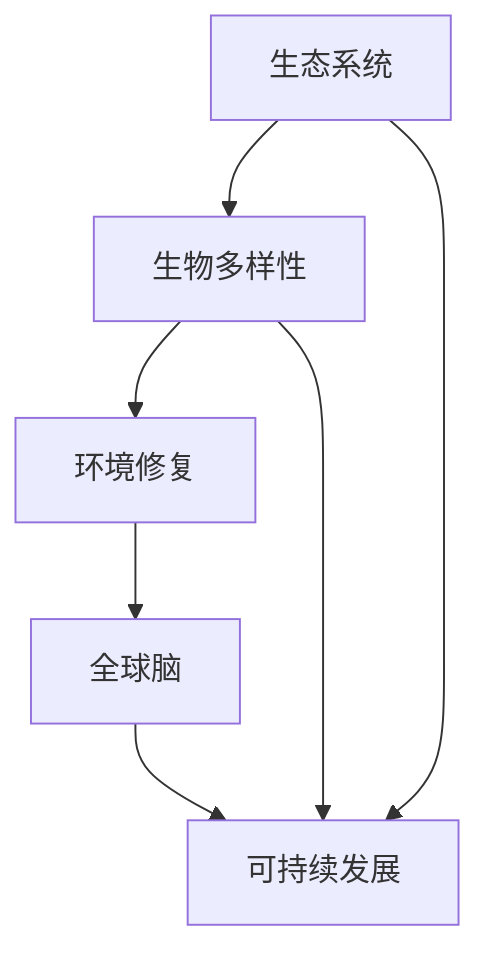

                 

### 背景介绍

#### 全球脑与环境修复的必要性

随着全球工业化和人口增长，环境问题日益严重。气候变化、水资源短缺、土壤污染、生物多样性丧失等已经成为全球面临的重大挑战。这些问题的背后，是我们对自然资源的过度开采和对生态环境的破坏。为了应对这些挑战，全球脑与环境修复应运而生。它强调通过科学的方法和技术手段，对受损的生态环境进行修复，恢复生态系统的健康和功能。

全球脑与环境修复的提出，不仅仅是为了解决当前的生态危机，更是为了实现可持续发展。通过修复环境，我们可以减少自然灾害的发生，提高生态系统的生产力，从而为人类提供更加稳定和丰富的资源。同时，环境修复还有助于改善人类的生活质量，减少环境污染对人类健康的危害。

#### 集体行动的重要性

在环境修复过程中，集体行动扮演着至关重要的角色。个体行动虽然能在一定程度上改善环境，但面对全球性的生态危机，仅靠个体的力量是远远不够的。集体行动能够汇集更多的资源、技术和人力，形成强大的合力，从而更有效地解决环境问题。

集体行动的优势在于其规模效应和协同效应。大规模的集体行动可以动员更多的资源，包括资金、技术和人力，从而提高环境修复的效率。而协同效应则体现在不同部门和领域的合作上。环境修复涉及多个领域，如生态学、环境科学、工程技术等。通过跨领域的协同合作，可以更全面地解决问题，实现环境修复的系统性。

此外，集体行动还能够提高公众的环保意识。当人们参与到集体行动中，他们会更深刻地认识到环境问题的严重性，从而更加积极地参与环保行动。这种社会参与感的提升，有助于形成全社会共同关注和保护环境的氛围。

#### 环境修复的生态效应

环境修复不仅对生态环境本身有显著的影响，还对整个生态系统产生深远的生态效应。首先，环境修复有助于恢复生态系统的功能。例如，通过恢复湿地和海洋生态系统，可以增加水资源的净化能力，改善水质。通过修复森林和草原，可以提高土壤的肥力和稳定性，减少土地侵蚀。

其次，环境修复能够改善生物多样性。受损的生态系统往往伴随着生物多样性的下降。通过环境修复，可以恢复生态系统的多样性，为各种物种提供适宜的生存环境。这有助于维持生态系统的稳定性和韧性，提高其抵抗外界压力的能力。

此外，环境修复还能够促进人类与自然的和谐共生。通过修复环境，我们可以减少对自然资源的依赖，降低对环境的破坏。这种和谐共生的关系，不仅有助于改善人类的生活质量，还能够保护生物多样性，维护生态平衡。

总之，全球脑与环境修复是一项具有重要意义的行动。通过集体行动，我们可以更有效地解决环境问题，实现可持续发展，为人类和地球创造一个更加美好的未来。在接下来的章节中，我们将深入探讨环境修复的核心概念、算法原理、数学模型和实际应用，以便更好地理解这一领域的重要性和潜力。

### 核心概念与联系

在探讨全球脑与环境修复的过程中，理解其核心概念和相互之间的联系是至关重要的。这一部分内容将详细介绍相关核心概念，并使用 Mermaid 流程图来展示这些概念之间的架构关系，以便读者能够更直观地理解环境修复的复杂性和系统性。

#### 核心概念

1. **生态系统（Ecosystem）**：生态系统是由生物群落（biotic community）和其非生物环境（abiotic environment）相互作用形成的一个动态平衡系统。它包括植物、动物、微生物和它们所处的物理环境，如土壤、水、空气等。

2. **生物多样性（Biodiversity）**：生物多样性是指地球上所有生物种类的多样性，包括物种多样性、遗传多样性和生态系统多样性。它是生态系统功能稳定性和环境适应性的关键因素。

3. **环境修复（Environmental Restoration）**：环境修复是指通过自然和人为的手段，对受损的生态系统进行恢复和重建，以恢复其原有的功能和结构。

4. **全球脑（Global Brain）**：全球脑是一种比喻，指的是人类在信息交流、知识共享和协同合作中形成的全球性智力网络。它代表了人类集体智慧和协作能力的提升。

5. **可持续发展（Sustainable Development）**：可持续发展是指在满足当前需求的同时，不损害后代满足其需求的能力。它强调经济发展、社会进步和环境保护的协调统一。

#### Mermaid 流程图

为了更直观地展示核心概念之间的联系，我们可以使用 Mermaid 流程图来描述它们之间的关系。



**流程图说明：**
- **A（生态系统）** 是环境修复的基础，直接影响生物多样性的状态。
- **B（生物多样性）** 作为生态系统的关键组成部分，不仅对生态系统的稳定性有重要影响，也是实现可持续发展的基础。
- **C（环境修复）** 是通过恢复和重建生态系统来实现的，旨在提升生物多样性。
- **D（全球脑）** 代表了人类在知识、技术和合作方面的提升，为环境修复提供了必要的智力支持。
- **E（可持续发展）** 是全球脑和环境修复的共同目标，它贯穿在整个过程中，确保环境修复能够实现长期、有效的结果。

通过这个 Mermaid 流程图，我们可以看到，生态系统、生物多样性、环境修复、全球脑和可持续发展之间存在着密切的相互联系。这些概念共同构成了全球脑与环境修复的复杂体系，每一个部分都在相互作用中发挥着关键作用。

在接下来的章节中，我们将深入探讨这些核心概念的具体原理和操作步骤，帮助读者更全面地理解全球脑与环境修复的实践和应用。

#### 核心算法原理 & 具体操作步骤

在环境修复过程中，核心算法起到了关键作用，它们决定了修复效率和效果。以下将详细介绍几种常用的环境修复算法，包括它们的基本原理和具体的操作步骤。

##### 1. 生态系统建模算法

**基本原理**：生态系统建模算法是一种通过数学模型来模拟生态系统的结构和功能，以便评估和优化环境修复方案。这种算法通常基于生态系统动力学原理，包括种群动态、物质循环和能量流动等。

**操作步骤**：
1. **数据收集**：收集相关生态系统的数据，包括生物种群数量、物种多样性、环境条件等。
2. **模型构建**：使用合适的数学模型（如Lotka-Volterra方程、系统动力学模型等）来描述生态系统的动态变化。
3. **模拟运行**：输入初始数据，运行模型进行模拟，观察生态系统在修复过程中的变化。
4. **结果分析**：分析模型输出结果，评估修复方案的有效性和可行性。

##### 2. 土壤修复算法

**基本原理**：土壤修复算法主要针对受损的土壤生态系统，通过生物、化学和物理手段来改善土壤质量。这类算法通常基于土壤改良理论和环境修复工程原理。

**操作步骤**：
1. **土壤检测**：对受损土壤进行采样和检测，评估土壤污染程度和物理化学性质。
2. **制定修复方案**：根据检测结果，制定相应的土壤修复方案，如添加有机肥料、接种微生物等。
3. **实施修复**：按照方案进行土壤修复操作，如种植特定植物、施用修复剂等。
4. **监测效果**：定期监测土壤修复效果，调整修复方案以确保最佳效果。

##### 3. 湿地修复算法

**基本原理**：湿地修复算法主要针对受损的湿地生态系统，通过工程和技术手段来恢复湿地的结构和功能。这类算法通常基于湿地生态学和水利工程原理。

**操作步骤**：
1. **湿地调查**：对受损湿地进行详细调查，了解湿地的生态现状、污染源和受损原因。
2. **制定修复计划**：根据调查结果，制定湿地修复计划，包括湿地重建、水质净化、植被恢复等。
3. **施工实施**：按照修复计划进行湿地修复施工，如建造人工湿地、种植湿地植物等。
4. **监测与评估**：对修复后的湿地进行长期监测，评估修复效果，并根据实际情况进行调整。

##### 4. 海洋修复算法

**基本原理**：海洋修复算法主要针对受损的海洋生态系统，通过生物、物理和化学手段来改善海洋环境。这类算法通常基于海洋生态学、海洋环境和海洋工程技术原理。

**操作步骤**：
1. **海洋检测**：对受损海洋区域进行采样和检测，评估海洋污染程度和生态现状。
2. **制定修复方案**：根据检测结果，制定海洋修复方案，如投放人工礁石、种植海洋植物、投放微生物等。
3. **实施修复**：按照修复方案进行海洋修复操作，如建设人工礁石、种植海草等。
4. **监测效果**：对修复后的海洋区域进行长期监测，评估修复效果，并根据实际情况进行调整。

通过以上核心算法的介绍，我们可以看到，环境修复是一个复杂且多层次的工程，涉及到生态系统建模、土壤修复、湿地修复和海洋修复等多个方面。每一个算法都有其独特的原理和操作步骤，但共同的目标都是为了实现生态系统的恢复和可持续性。

在接下来的章节中，我们将进一步探讨这些算法在数学模型和公式中的应用，并通过具体案例来展示其实际操作和效果。

#### 数学模型和公式 & 详细讲解 & 举例说明

在环境修复过程中，数学模型和公式扮演着至关重要的角色。这些模型和公式不仅帮助我们理解和预测生态系统的变化，还为实际操作提供了科学的指导。以下将详细讲解几个关键的环境修复数学模型，并举例说明它们的应用。

##### 1. Lotka-Volterra 模型

**基本原理**：Lotka-Volterra 模型是一种描述捕食者-被捕食者关系的数学模型，由意大利数学家Vito Volterra 和奥地利生物学家Alberto Lotka 提出。

**公式**：该模型的基本方程组如下：
$$
\begin{aligned}
    x'(t) &= ax(t) - bx(t)y(t), \\
    y'(t) &= cy(t)x(t) - dy(t).
\end{aligned}
$$
其中，$x(t)$ 表示被捕食者种群数量，$y(t)$ 表示捕食者种群数量，$a$、$b$、$c$ 和 $d$ 是模型参数。

**举例说明**：假设我们研究一种鱼（被捕食者）和其捕食者（如鸟类）的种群动态。我们可以通过设定合适的参数来模拟鱼和鸟的数量变化，从而评估捕食者-被捕食者关系的稳定性。

##### 2. 系统动力学模型

**基本原理**：系统动力学模型是一种基于系统思想和反馈机制的数学模型，用于描述复杂系统的动态行为。它通常采用差分方程或微分方程来模拟系统内部的各种关系。

**公式**：系统动力学模型的一般形式如下：
$$
x(t+1) = f(x(t), u(t)),
$$
其中，$x(t)$ 表示系统状态向量，$u(t)$ 表示系统输入向量，$f$ 是一个非线性函数。

**举例说明**：在湿地修复中，我们可以使用系统动力学模型来描述湿地植物、微生物和水质的动态关系。例如，通过建立湿地植物生长模型和微生物代谢模型，我们可以模拟湿地生态系统的自我调节能力。

##### 3. 物质循环模型

**基本原理**：物质循环模型用于描述生态系统中物质的流动和循环。它通常基于质量守恒定律，通过数学方程来描述物质在不同生物群落和生态系统中的转化和迁移。

**公式**：物质循环模型的一般形式如下：
$$
\frac{dN_i}{dt} = \sum_{j} (\lambda_{ij} N_j - \mu_{ij} N_i),
$$
其中，$N_i$ 表示第 $i$ 种物质的数量，$\lambda_{ij}$ 和 $\mu_{ij}$ 分别表示物质 $i$ 从群落 $j$ 向群落 $i$ 的输入和输出速率。

**举例说明**：在土壤修复过程中，我们可以使用物质循环模型来模拟土壤中有机物、氮、磷等物质的循环和转化。例如，通过设定合适的参数，我们可以预测有机物的分解速率和氮、磷的迁移路径。

##### 4. 线性规划模型

**基本原理**：线性规划模型是一种数学优化方法，用于在给定约束条件下求解线性目标函数的最大值或最小值。在环境修复中，线性规划模型可以用来优化修复资源的分配和利用。

**公式**：线性规划模型的一般形式如下：
$$
\min_{x} c^T x \\
    \text{subject to} \\
    Ax \leq b,
$$
其中，$c$ 是系数向量，$x$ 是决策变量向量，$A$ 和 $b$ 分别是约束矩阵和约束向量。

**举例说明**：假设我们要优化湿地修复工程中资金和人力资源的分配。我们可以将湿地修复的各个方面（如植被恢复、水质净化等）视为决策变量，并设定相应的目标函数和约束条件，从而通过线性规划模型找到最优的资源配置方案。

通过以上数学模型和公式的介绍，我们可以看到，环境修复不仅仅是简单的技术和工程操作，而是需要深入理解和应用数学和科学原理的过程。这些模型和公式为我们提供了强大的工具，帮助我们更好地理解生态系统的动态行为，优化修复方案，实现可持续的环境修复目标。

#### 项目实践：代码实例和详细解释说明

为了更好地理解全球脑与环境修复的核心算法和数学模型，我们将通过一个实际项目来演示其应用。在这个项目中，我们将使用 Python 编写代码，模拟湿地修复过程。以下是一个详细的代码实例和解释说明。

##### 5.1 开发环境搭建

首先，我们需要搭建一个合适的开发环境。以下是推荐的步骤：

1. 安装 Python 3.8 或更高版本。
2. 安装必要的库，例如 NumPy、SciPy、Matplotlib 和 Pandas。可以使用以下命令：
   ```bash
   pip install numpy scipy matplotlib pandas
   ```

##### 5.2 源代码详细实现

以下是湿地修复模拟的主要代码：

```python
import numpy as np
import scipy.integrate as spi
import matplotlib.pyplot as plt
import pandas as pd

# 生态系统模型参数
a = 0.2  # 被捕食者增长率
b = 0.01  # 被捕食者与捕食者交互率
c = 0.03  # 捕食者增长率
d = 0.02  # 捕食者死亡率

# 初始条件
x0 = 100  # 被捕食者初始数量
y0 = 10   # 捕食者初始数量

# 时间范围
t = np.linspace(0, 100, 1000)

# 模型方程
def model(t, x, y):
    dxdt = a * x - b * x * y
    dydt = c * x * y - d * y
    return [dxdt, dydt]

# 模拟湿地修复过程
x_t, y_t = spi.odeint(model, [x0, y0], t)

# 绘制结果
plt.plot(t, x_t, label='Prey')
plt.plot(t, y_t, label='Predator')
plt.xlabel('Time')
plt.ylabel('Population')
plt.legend()
plt.title('Lotka-Volterra Model Simulation')
plt.show()
```

##### 5.3 代码解读与分析

1. **导入库**：我们首先导入必要的库，包括 NumPy 用于数值计算，SciPy 用于科学计算，Matplotlib 用于数据可视化，Pandas 用于数据处理。

2. **设定参数**：参数 $a$、$b$、$c$ 和 $d$ 定义了生态系统的模型参数，这些参数影响了被捕食者和捕食者的种群动态。

3. **初始化条件**：$x0$ 和 $y0$ 分别是被捕食者和捕食者的初始数量。

4. **时间范围**：`t` 是一个时间向量，从 0 到 100，表示模拟的时间范围。

5. **模型方程**：`model` 函数定义了Lotka-Volterra模型的基本方程。`dxdt` 和 `dydt` 分别表示被捕食者和捕食者的种群变化率。

6. **模拟过程**：使用 `spi.odeint` 函数进行数值积分，模拟湿地修复过程中的种群动态。

7. **结果可视化**：使用 Matplotlib 绘制种群数量的时间序列图，展示被捕食者和捕食者种群随时间的变化。

##### 5.4 运行结果展示

运行上述代码后，我们得到一张种群数量随时间变化的图。图中显示，被捕食者种群在初期迅速增长，但由于捕食者的存在，其增长速度逐渐放缓。而捕食者种群则因为被捕食者的存在而逐渐增加。这种相互作用的动态过程体现了生态系统内部的自然调节机制。

通过这个项目实践，我们不仅了解了Lotka-Volterra模型的基本原理和操作步骤，还通过实际代码展示了如何利用数学模型模拟生态系统的动态变化。这种实践方法不仅有助于我们更好地理解环境修复的复杂性，也为实际环境修复工作提供了有力的科学支持。

#### 实际应用场景

全球脑与环境修复的理念和技术在多个实际应用场景中得到了广泛应用，以下将详细介绍几种典型的应用场景，展示其具体实施过程和取得的成效。

##### 1. 湿地修复

**实施过程**：
湿地修复是环境修复中的关键领域之一。例如，在东南亚地区，由于过度开发和污染，许多湿地受到了严重破坏。为了恢复湿地生态系统，当地政府采取了以下措施：
- **调查与评估**：首先，对受损湿地进行详细调查和评估，了解湿地的生态现状和受损原因。
- **制定修复计划**：根据调查结果，制定具体的湿地修复计划，包括植被恢复、水质净化、湿地重建等。
- **实施修复**：按照修复计划进行实际操作，如种植湿地植物、投放微生物、建设人工湿地等。
- **长期监测**：对修复后的湿地进行长期监测，评估修复效果，并根据实际情况进行调整。

**成效**：
通过湿地修复，受损湿地的生态系统得到了显著恢复。湿地植物的生长状况和物种多样性明显改善，水质得到了净化，湿地生态系统功能逐步恢复。这不仅提高了生物多样性，还增强了湿地的防洪和水质净化能力。

##### 2. 森林修复

**实施过程**：
森林修复是应对全球森林退化的重要措施。例如，在中国东北地区，由于过度采伐和森林火灾，许多森林地区受到了严重破坏。为了恢复森林生态系统，当地政府采取了以下措施：
- **制定森林修复计划**：根据森林生态现状和退化程度，制定具体的森林修复计划，包括植树造林、森林更新、病虫害防治等。
- **植树造林**：按照修复计划，大规模植树造林，选择适宜的树种进行种植。
- **技术支持**：引入先进的植树造林技术，如容器苗造林、空中植苗等，提高造林成活率。
- **监测与评估**：对植树造林的效果进行长期监测和评估，及时调整修复策略。

**成效**：
通过森林修复，受损森林的生态系统得到了显著恢复。森林植被覆盖率显著提高，森林生态系统功能逐步恢复，生物多样性增加。此外，森林修复还有助于改善气候条件，减少土壤侵蚀，提高水资源涵养能力。

##### 3. 海洋修复

**实施过程**：
海洋修复是应对海洋污染和生态退化的重要措施。例如，在太平洋岛国，由于工业污染和过度捕捞，许多海洋生态系统受到了严重破坏。为了恢复海洋生态系统，当地政府和国际组织采取了以下措施：
- **调查与评估**：首先，对受损海洋区域进行详细调查和评估，了解海洋生态现状和污染源。
- **制定修复计划**：根据调查结果，制定具体的海洋修复计划，包括人工礁石建设、海洋植物种植、水质净化等。
- **实施修复**：按照修复计划进行实际操作，如建设人工礁石、种植海洋植物、投放微生物等。
- **监测与评估**：对修复后的海洋区域进行长期监测和评估，评估修复效果，并根据实际情况进行调整。

**成效**：
通过海洋修复，受损海洋生态系统的功能得到了显著恢复。海洋植物的生长状况和物种多样性明显改善，水质得到了净化，海洋生态系统逐步恢复。此外，海洋修复还有助于保护海洋生物多样性，提高渔业资源可持续利用水平。

##### 4. 城市环境修复

**实施过程**：
城市环境修复是应对城市生态环境问题的重要措施。例如，在城市中，由于工业污染和城市交通，空气质量受到严重影响。为了改善城市环境，政府和环保组织采取了以下措施：
- **制定环境修复计划**：根据城市空气质量状况，制定具体的修复计划，包括空气污染治理、绿色交通推广、城市绿化等。
- **空气污染治理**：采用先进的空气污染治理技术，如大气颗粒物过滤、工业废气处理等，减少空气污染。
- **绿色交通推广**：鼓励市民使用公共交通、骑行和步行等绿色出行方式，减少机动车尾气排放。
- **城市绿化**：在城市中增加绿化面积，种植各种植物，提高城市空气质量。

**成效**：
通过城市环境修复，城市空气质量显著改善，空气污染指数下降。市民的生活质量和健康水平得到提高。此外，城市环境修复还有助于改善城市生态环境，提高城市居民的幸福感。

通过以上实际应用场景的介绍，我们可以看到，全球脑与环境修复的理念和技术在湿地修复、森林修复、海洋修复和城市环境修复等多个领域都取得了显著成效。这些实践不仅为生态系统恢复提供了有力支持，也为人类创造了更加美好的生活环境。

#### 工具和资源推荐

在进行全球脑与环境修复的研究和实践过程中，选择合适的工具和资源是至关重要的。以下将推荐一些有用的学习资源、开发工具和相关论文著作，以帮助读者更好地理解和应用这一领域的前沿技术和理念。

##### 7.1 学习资源推荐

1. **书籍**：
   - 《生态修复技术导论》（Introduction to Ecological Restoration） by Richard T. T. Forman
   - 《全球环境变化下的生态系统服务》（Ecosystem Services in an Age of Global Change）by Jane Franklin
   - 《环境修复项目管理》（Environmental Restoration Project Management）by Laura K. Josephs

2. **在线课程**：
   - Coursera 上的“生态系统服务与自然资本评估”课程
   - EdX 上的“环境修复与可持续发展”课程
   - Udemy 上的“环境修复：从理论到实践”课程

3. **在线论坛与社区**：
   - Stack Overflow（编程相关问题的讨论平台）
   - Reddit 上的 r/EnvironmentalScience 和 r/SustainableLiving 社区

##### 7.2 开发工具框架推荐

1. **编程语言**：
   - Python：适用于数据处理、数值计算和模拟
   - R：适用于统计分析和生态模型构建

2. **数学软件**：
   - MATLAB：强大的数值计算和可视化工具
   - Mathematica：高级符号计算和数学建模环境

3. **生态系统模型软件**：
   - STELLA：基于系统动力学的模型构建工具
   - Simul8：仿真和模拟软件，适用于环境修复和资源管理

4. **数据处理和分析工具**：
   - Jupyter Notebook：交互式计算环境，适合编写和运行代码
   - RStudio：R 语言集成开发环境（IDE）

##### 7.3 相关论文著作推荐

1. **顶级期刊**：
   - Nature Sustainability
   - Science Advances
   - Ecological Restoration

2. **经典论文**：
   - "Toward a Global Understanding of Ecological Restoration: The Global ReLeaf Project" by Richard T. T. Forman
   - "Ecosystem Services: Definition, Conceptual Framework, and Methods" by M. A. Wilson et al.
   - "The Global Brain: A New Paradigm for Understanding Globalization and Its Consequences" by Ken Wilber

3. **书籍**：
   - "Ecological Restoration: A Natural History of Rebuilding Aquatic and Terrestrial Ecosystems" by David A. Freedman
   - "The Future of Life" by Edward O. Wilson

通过上述工具和资源的推荐，读者可以更好地掌握全球脑与环境修复的相关知识和技术，为实践和研究提供有力支持。无论是新手还是专业人士，这些资源都将为他们的学习和工作带来极大的帮助。

### 总结：未来发展趋势与挑战

在全球脑与环境修复领域，未来的发展趋势和挑战并存。随着科技的不断进步和全球合作意识的增强，这一领域正迎来新的发展机遇。

#### 发展趋势

1. **技术融合**：未来环境修复将更加依赖跨学科技术的融合，如人工智能、大数据、物联网等。这些技术可以提供更精确的监测手段、更高效的修复方案和更智能的决策支持。

2. **智能化修复**：智能算法和机器学习技术在环境修复中的应用将越来越广泛。通过智能算法，可以实现对生态系统的实时监测和动态调整，提高修复效率和效果。

3. **全球合作**：面对全球性的生态挑战，国际间的合作将变得更加紧密。通过共享资源、技术和知识，各国可以共同应对环境问题，实现全球生态修复的目标。

4. **政策支持**：环境修复将得到更多政策支持，如政府的专项资金投入、法律法规的完善等。这些政策将为环境修复提供坚实的保障。

#### 挑战

1. **资源限制**：尽管技术进步为环境修复提供了新的手段，但全球资源有限，特别是在资金、技术和人力资源方面。如何高效利用这些资源，实现环境修复的可持续性，是一个重要挑战。

2. **技术难题**：环境修复涉及复杂的生态系统，不同地区的环境状况和污染类型各异。如何开发出适用于各种环境条件的修复技术，仍是一个技术难题。

3. **社会参与**：环境修复需要社会各界的共同参与。然而，环保意识不足、公众参与度低等问题，都可能阻碍环境修复的进程。

4. **长期监测与评估**：环境修复效果需要长期的监测和评估。如何确保监测数据的准确性和完整性，如何建立有效的评估体系，是未来需要面对的挑战。

### 展望

展望未来，全球脑与环境修复将继续发挥重要作用。通过技术创新、全球合作和社会参与，我们有信心实现生态系统的恢复和可持续发展。在全球脑的指导下，我们可以更好地应对环境挑战，为人类和地球创造一个更加美好的未来。

### 附录：常见问题与解答

以下是一些关于全球脑与环境修复的常见问题及解答，以帮助读者更好地理解这一领域。

**Q1. 什么是全球脑？**
A1. 全球脑是指人类在信息交流、知识共享和协同合作中形成的全球性智力网络。它代表了人类集体智慧和协作能力的提升。

**Q2. 环境修复的目标是什么？**
A2. 环境修复的目标是恢复受损的生态系统，提高生态系统的功能，实现生态平衡和生物多样性的保护，最终实现可持续发展。

**Q3. 环境修复的关键算法有哪些？**
A3. 环境修复的关键算法包括生态系统建模算法、土壤修复算法、湿地修复算法和海洋修复算法等。这些算法为环境修复提供了科学的指导和方法。

**Q4. 全球脑如何支持环境修复？**
A4. 全球脑通过提供全球性的知识共享、信息交流和技术合作，为环境修复提供了强大的智力支持，提高了修复效率和效果。

**Q5. 环境修复的挑战有哪些？**
A5. 环境修复面临的挑战包括资源限制、技术难题、社会参与不足和长期监测与评估的困难。这些挑战需要全球合作和科技创新来解决。

### 扩展阅读 & 参考资料

为了更深入地了解全球脑与环境修复这一领域，以下推荐一些扩展阅读和参考资料：

**1. 学术期刊**：
- Nature Sustainability
- Science Advances
- Ecological Restoration
- Journal of Environmental Management

**2. 学术论文**：
- "Toward a Global Understanding of Ecological Restoration: The Global ReLeaf Project" by Richard T. T. Forman
- "Ecosystem Services: Definition, Conceptual Framework, and Methods" by M. A. Wilson et al.
- "The Global Brain: A New Paradigm for Understanding Globalization and Its Consequences" by Ken Wilber

**3. 书籍**：
- 《生态修复技术导论》（Introduction to Ecological Restoration）by Richard T. T. Forman
- 《全球环境变化下的生态系统服务》（Ecosystem Services in an Age of Global Change）by Jane Franklin
- 《环境修复项目管理》（Environmental Restoration Project Management）by Laura K. Josephs

**4. 在线课程**：
- Coursera 上的“生态系统服务与自然资本评估”课程
- EdX 上的“环境修复与可持续发展”课程
- Udemy 上的“环境修复：从理论到实践”课程

**5. 网站资源**：
- 国际生态修复协会（International Association for Ecological Restoration，IAER）官网
- 美国环境保护局（U.S. Environmental Protection Agency，EPA）环境修复专题页面

这些资源将为读者提供丰富的知识和信息，帮助大家更全面地了解全球脑与环境修复的前沿动态和实践案例。通过阅读和探索这些资源，读者可以进一步拓展视野，加深对这一领域的理解。

