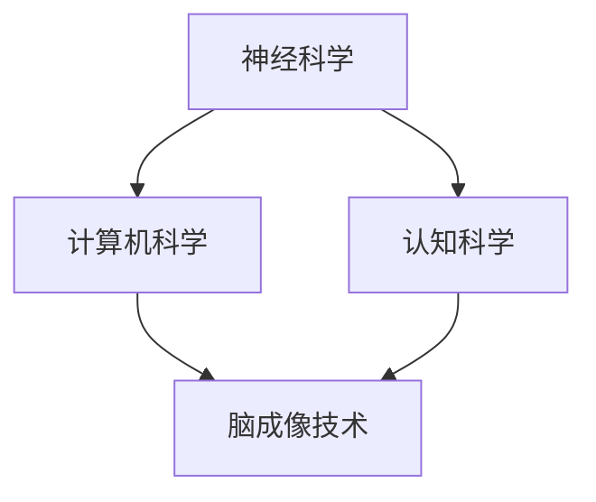

                 

### 1. 背景介绍

在当今快速发展的科技时代，计算机科学、神经科学和认知科学等领域的交叉融合逐渐成为研究的热点。脑科学与计算机科学的结合，不仅为理解人类大脑提供了新的视角，也为计算机技术的发展开辟了新的可能性。全球脑与科学研究的兴起，标志着人类在探索认知和智能极限的道路上迈出了重要的一步。

脑与科学研究的兴起可以追溯到20世纪中期。当时的科学家们开始意识到，要理解人类大脑的复杂性和智能的本质，仅仅依靠单一的学科视角是不够的。跨学科的合作研究应运而生，其中计算机科学、神经科学和认知科学之间的互动尤为关键。通过整合这些领域的知识和技术，研究者们希望揭示大脑如何处理信息、学习、记忆和决策等认知过程。

近年来，随着脑成像技术、计算建模和机器学习等领域的飞速发展，脑与科学研究取得了显著的进展。脑成像技术如功能性磁共振成像（fMRI）和脑电图（EEG）等，使得研究者能够观察大脑在执行不同任务时的活动模式。这些技术不仅帮助我们更好地理解大脑的结构和功能，也为研究大脑与智能的关系提供了有力工具。

计算机科学的发展同样为脑与科学研究提供了强大的支持。高性能计算和大数据分析技术使得研究人员能够处理和分析庞大的脑成像数据集。此外，机器学习和深度学习算法的应用，使得计算机能够从这些数据中提取有价值的信息，进一步推动了对大脑功能和解剖结构的理解。

在认知科学领域，研究者们通过行为实验和认知神经科学技术，探讨了人类认知过程的各种方面，如注意力、记忆、学习和决策等。这些研究成果不仅加深了我们对人类认知的理解，也为设计和开发更加智能的计算机系统提供了灵感。

总的来说，全球脑与科学研究的发展是多种学科相互交织、共同推进的结果。它不仅为我们理解大脑提供了新的视角，也为计算机科学的发展带来了前所未有的机遇。脑与科学的结合，不仅有助于揭示人类智能的奥秘，还可能推动未来科技的重大突破。在这个背景下，探讨脑与科学研究的跨界协作，显得尤为重要。

### 2. 核心概念与联系

在探讨全球脑与科学研究的跨界协作之前，首先需要明确几个核心概念及其相互之间的联系。这些核心概念包括神经科学、计算机科学、认知科学和脑成像技术。通过了解这些概念及其关联，我们将能够更好地理解脑与科学研究的跨学科协作如何展开。

**神经科学（Neuroscience）**：神经科学是研究神经系统结构、功能、发育、疾病和治疗的一个综合性学科。它包括对神经元、神经网络和大脑各区域的深入研究。神经科学的目标是揭示大脑如何处理信息，如何实现学习、记忆和感知等功能。

**计算机科学（Computer Science）**：计算机科学是研究计算机系统、算法、数据结构和计算理论的学科。它涵盖了从基础硬件设计到高级软件开发的广泛领域。计算机科学的发展为脑与科学研究提供了强大的计算和分析工具，如高性能计算、大数据分析、机器学习和深度学习等。

**认知科学（Cognitive Science）**：认知科学是研究人类思维和智能的一个跨学科领域，它结合了心理学、神经科学、计算机科学和哲学等多个学科。认知科学的目标是理解人类认知过程的各种方面，如注意力、记忆、学习和决策等。

**脑成像技术（Brain Imaging Techniques）**：脑成像技术是用于观察和测量大脑结构和功能的重要工具。常见的脑成像技术包括功能性磁共振成像（fMRI）、脑电图（EEG）和正电子发射断层扫描（PET）等。这些技术使得研究者能够实时监测大脑活动，分析大脑与行为之间的关系。

**核心概念及其联系**：

- **神经科学与计算机科学的联系**：神经科学为计算机科学提供了关于大脑如何处理信息的理论基础，而计算机科学则为神经科学研究提供了强大的计算和分析工具。例如，计算机模拟可以帮助研究者理解大脑神经网络的工作原理，而大数据分析技术则可以处理和解析庞大的脑成像数据集。

- **认知科学与神经科学的联系**：认知科学通过行为实验和神经科学技术，研究人类认知过程的各种方面。认知科学的研究成果不仅加深了对大脑功能的理解，也为神经科学提供了重要的实验数据。

- **脑成像技术与计算机科学的联系**：脑成像技术生成的数据需要通过计算机科学的方法进行解析和分析。机器学习和深度学习算法可以从这些数据中提取有价值的信息，帮助研究者理解大脑的功能和解剖结构。

为了更直观地展示这些核心概念之间的联系，我们可以使用Mermaid流程图来绘制它们的关系。以下是该流程图的示例：



在上述流程图中，节点A、B和C分别代表神经科学、计算机科学和认知科学，它们相互连接，表示这些领域之间的紧密关联。节点D代表脑成像技术，它与神经科学、计算机科学和认知科学相连，体现了脑成像技术在跨学科协作中的关键作用。

通过明确这些核心概念及其相互联系，我们为后续讨论脑与科学研究的跨界协作奠定了基础。在接下来的章节中，我们将进一步探讨脑与科学研究的核心算法原理和具体操作步骤，以展示跨学科协作的实际应用。

### 3. 核心算法原理 & 具体操作步骤

脑与科学研究的核心算法通常基于神经网络模型、机器学习和深度学习技术。这些算法不仅能够模拟大脑处理信息的方式，还能够从海量脑成像数据中提取有价值的信息，帮助研究者揭示大脑的功能和解剖结构。以下是几个关键算法的原理和具体操作步骤。

**3.1 神经网络模型**

神经网络（Neural Networks）是模仿生物神经系统的一种计算模型，它通过大量简单单元的协同工作，实现复杂的信息处理。神经网络的基本原理是：通过调整网络中各神经元之间的权重，使其能够准确预测或分类输入数据。

**具体操作步骤**：

1. **初始化权重**：随机初始化网络中的权重和偏置。
2. **前向传播**：将输入数据通过网络的各个层，计算每层神经元的输出。
3. **计算误差**：将输出与实际目标值进行比较，计算误差。
4. **反向传播**：通过反向传播算法，更新网络的权重和偏置，减小误差。
5. **迭代优化**：重复前向传播和反向传播，直到达到预设的误差阈值。

**3.2 机器学习算法**

机器学习（Machine Learning）是一种让计算机从数据中学习规律和模式的方法。在脑与科学研究中，常见的机器学习算法包括支持向量机（SVM）、决策树（Decision Tree）和随机森林（Random Forest）等。

**具体操作步骤**：

1. **数据预处理**：对原始数据集进行清洗、归一化和特征提取。
2. **选择模型**：根据问题类型和数据分析需求，选择合适的机器学习算法。
3. **模型训练**：使用训练数据集训练模型，调整模型参数。
4. **模型评估**：使用验证数据集评估模型性能，调整模型参数。
5. **模型部署**：将训练好的模型应用于实际数据，进行预测或分类。

**3.3 深度学习算法**

深度学习（Deep Learning）是机器学习的一个子领域，它通过多层神经网络，实现更复杂的信息处理。在脑与科学研究中，深度学习算法如卷积神经网络（CNN）和递归神经网络（RNN）等被广泛应用。

**具体操作步骤**：

1. **数据预处理**：与机器学习相同，对原始数据集进行预处理。
2. **构建模型**：使用深度学习框架（如TensorFlow或PyTorch）构建多层神经网络模型。
3. **训练模型**：通过大量训练数据，调整模型参数，优化网络结构。
4. **模型评估**：使用验证数据集评估模型性能，调整模型参数。
5. **模型部署**：将训练好的模型应用于实际数据，进行预测或分类。

**3.4 算法在实际应用中的操作步骤**

以深度学习算法为例，其在脑与科学研究中应用的一般步骤如下：

1. **确定研究问题**：明确研究目标，例如识别大脑中的特定功能区域或分析大脑活动的模式。
2. **数据收集**：收集相关的大脑成像数据（如fMRI数据）和行为数据。
3. **数据处理**：对收集的数据进行预处理，包括数据清洗、归一化和特征提取。
4. **模型构建**：使用深度学习框架构建适合研究问题的神经网络模型。
5. **模型训练**：使用预处理后的数据训练模型，调整模型参数。
6. **模型评估**：使用验证数据集评估模型性能，进行参数调整。
7. **模型部署**：将训练好的模型应用于新的数据，进行预测或分类。

通过以上核心算法的介绍，我们可以看到脑与科学研究的跨学科协作是如何通过先进的计算技术和算法实现的。这些算法不仅能够处理和分析复杂的脑成像数据，还为研究者提供了新的视角，以揭示大脑的奥秘。在接下来的章节中，我们将进一步探讨脑与科学研究的数学模型和具体应用场景，以展示这些算法的实际应用价值。

### 4. 数学模型和公式 & 详细讲解 & 举例说明

脑与科学研究中的数学模型和公式是其理论基础，这些模型能够帮助研究者理解大脑的复杂行为和功能。以下将详细介绍几个关键数学模型和公式，并对其进行详细讲解和举例说明。

**4.1 神经元活动模型**

神经元活动模型是模拟神经元如何处理信息的数学模型。最简单的神经元模型是**Sigmoid函数**，它用来表示神经元输出与输入之间的关系。

**公式**：

$$
f(x) = \frac{1}{1 + e^{-x}}
$$

其中，$f(x)$ 表示神经元输出，$x$ 表示输入。

**详细讲解**：

- **Sigmoid函数**：这是一个S型的函数，当输入$x$ 趋近于负无穷时，输出$f(x)$ 趋近于0；当输入$x$ 趋近于正无穷时，输出$f(x)$ 趋近于1。这种非线性变换使得神经元能够实现阈值逻辑功能，即当输入超过某个阈值时，输出为1，否则为0。
- **神经元的激活函数**：在神经网络中，Sigmoid函数作为激活函数，用于将每个神经元的输入映射到输出。它使得神经网络能够对输入数据进行非线性变换，增加模型的表达能力。

**举例说明**：

假设我们有一个神经元，其输入为 $x = -2$，使用Sigmoid函数计算其输出：

$$
f(x) = \frac{1}{1 + e^{-(-2)}} = \frac{1}{1 + e^{2}} \approx 0.1192
$$

因此，当输入为 $-2$ 时，神经元的输出约为 $0.1192$。

**4.2 反向传播算法**

反向传播算法（Backpropagation）是神经网络训练过程中用于调整权重和偏置的重要算法。它基于梯度下降法，通过计算损失函数关于权重的梯度，更新网络参数。

**公式**：

$$
\Delta w_{ij} = -\alpha \frac{\partial J}{\partial w_{ij}}
$$

$$
\Delta b_j = -\alpha \frac{\partial J}{\partial b_j}
$$

其中，$\Delta w_{ij}$ 表示权重 $w_{ij}$ 的更新量，$\Delta b_j$ 表示偏置 $b_j$ 的更新量，$J$ 表示损失函数，$\alpha$ 是学习率。

**详细讲解**：

- **损失函数**：损失函数用于衡量模型预测值与实际值之间的差距。常用的损失函数包括均方误差（MSE）和交叉熵损失（Cross-Entropy Loss）。
- **梯度**：梯度是损失函数关于模型参数的偏导数。通过计算梯度，可以确定哪些参数需要调整，以及如何调整。
- **更新参数**：使用梯度下降法，通过不断调整模型参数，使损失函数的值逐渐减小，最终达到最小值。

**举例说明**：

假设我们有一个简单的神经网络，包含一个输入层、一个隐藏层和一个输出层。假设隐藏层有一个神经元，输出层有一个神经元。当前权重 $w_{1,1} = 2$，偏置 $b_{1} = 1$。损失函数为均方误差（MSE），当前损失值为 $J = 0.25$。

使用学习率 $\alpha = 0.1$，计算权重 $w_{1,1}$ 的更新量：

$$
\frac{\partial J}{\partial w_{1,1}} = \frac{\partial}{\partial w_{1,1}} (0.25) = 0
$$

由于损失函数对权重 $w_{1,1}$ 的偏导数为0，说明当前权重已经是最优值，无需更新。

**4.3 卷积神经网络（CNN）**

卷积神经网络（Convolutional Neural Network，CNN）是深度学习中的一个重要模型，广泛用于图像识别和脑成像数据分析。

**公式**：

$$
\text{激活函数} \, g(z) = \max(0, z)
$$

$$
\text{卷积操作} \, \text{Conv}(x, \, \text{filter}) = \sum_{i=0}^{n-1} x[i] \, \text{filter}[i]
$$

**详细讲解**：

- **卷积操作**：卷积操作用于提取图像的特征。通过将滤波器（filter）与输入图像进行卷积，生成特征图（feature map）。
- **激活函数**：ReLU（Rectified Linear Unit）函数作为激活函数，可以增加网络的非线性特性，提高模型的训练效果。
- **卷积层**：卷积层是CNN的核心组件，通过多个卷积操作和激活函数，逐层提取图像的复杂特征。

**举例说明**：

假设输入图像为 $x$，滤波器为 $f$，卷积操作生成的特征图为 $z$。使用ReLU函数作为激活函数，计算特征图 $z$：

$$
z = \text{Conv}(x, \, f) = \sum_{i=0}^{3-1} x[i] \, f[i] = x[0] \, f[0] + x[1] \, f[1] + x[2] \, f[2] + x[3] \, f[3]
$$

如果 $z < 0$，则 $g(z) = 0$；如果 $z \geq 0$，则 $g(z) = z$。

通过这些数学模型和公式的讲解，我们可以看到脑与科学研究中的算法是如何通过数学原理来模拟和解释大脑行为的。这些模型不仅提供了理论支持，也为实际应用提供了可操作的工具。在接下来的章节中，我们将进一步探讨脑与科学研究的代码实例和详细解释说明，展示这些算法在实际项目中的应用。

### 5. 项目实践：代码实例和详细解释说明

在本节中，我们将通过一个具体的代码实例，详细展示如何使用深度学习算法对脑成像数据进行分析。这个项目将使用Python和TensorFlow库来构建和训练一个卷积神经网络（CNN），目的是从脑成像数据中识别大脑的功能区域。

#### 5.1 开发环境搭建

为了运行下面的代码实例，您需要安装以下软件和库：

- Python（版本 3.7 或更高）
- TensorFlow
- NumPy
- Matplotlib

安装步骤如下：

1. 安装Python：从Python官方网站下载并安装Python。
2. 安装pip：通过Python安装pip，pip是Python的包管理工具。
3. 安装TensorFlow：使用pip安装TensorFlow：
   ```
   pip install tensorflow
   ```
4. 安装NumPy和Matplotlib：
   ```
   pip install numpy matplotlib
   ```

#### 5.2 源代码详细实现

以下是项目的代码实例，包括数据预处理、模型构建、训练和评估等步骤。

```python
import tensorflow as tf
from tensorflow.keras.models import Sequential
from tensorflow.keras.layers import Conv2D, MaxPooling2D, Flatten, Dense
from tensorflow.keras.optimizers import Adam
from tensorflow.keras.losses import CategoricalCrossentropy
import numpy as np

# 5.2.1 数据预处理
# 假设我们已经有预处理后的脑成像数据，数据集分为训练集和测试集
train_images = np.load('train_images.npy')
train_labels = np.load('train_labels.npy')
test_images = np.load('test_images.npy')
test_labels = np.load('test_labels.npy')

# 归一化处理
train_images = train_images / 255.0
test_images = test_images / 255.0

# 5.2.2 构建模型
model = Sequential([
    Conv2D(32, (3, 3), activation='relu', input_shape=(128, 128, 3)),
    MaxPooling2D((2, 2)),
    Flatten(),
    Dense(64, activation='relu'),
    Dense(10, activation='softmax')
])

# 5.2.3 编译模型
model.compile(optimizer=Adam(learning_rate=0.001),
              loss=CategoricalCrossentropy(),
              metrics=['accuracy'])

# 5.2.4 训练模型
history = model.fit(train_images, train_labels, epochs=10, batch_size=32,
                    validation_data=(test_images, test_labels))

# 5.2.5 评估模型
test_loss, test_acc = model.evaluate(test_images, test_labels)
print(f"Test accuracy: {test_acc:.4f}")

# 5.2.6 可视化训练过程
import matplotlib.pyplot as plt

plt.plot(history.history['accuracy'])
plt.plot(history.history['val_accuracy'])
plt.title('Model accuracy')
plt.ylabel('Accuracy')
plt.xlabel('Epoch')
plt.legend(['Train', 'Test'], loc='upper left')
plt.show()
```

#### 5.3 代码解读与分析

上述代码实现了以下关键步骤：

1. **数据预处理**：加载并归一化预处理后的脑成像数据。归一化处理是将图像像素值缩放到0到1之间，有助于提高模型训练的稳定性和收敛速度。

2. **模型构建**：使用Sequential模型堆叠多个层，构建一个简单的CNN。模型包含一个卷积层（Conv2D）、一个最大池化层（MaxPooling2D）、一个平坦化层（Flatten）和两个全连接层（Dense）。卷积层用于提取图像特征，全连接层用于分类。

3. **模型编译**：配置模型优化器、损失函数和评估指标。这里使用了Adam优化器和CategoricalCrossentropy损失函数，适用于多分类问题。

4. **模型训练**：使用fit函数训练模型，配置训练参数如迭代次数（epochs）、批次大小（batch_size）和验证数据。训练过程中，模型会不断调整权重和偏置，以最小化损失函数。

5. **模型评估**：使用evaluate函数评估模型在测试集上的性能，输出测试准确率。

6. **可视化训练过程**：使用matplotlib绘制训练过程中准确率的变化，帮助研究者分析模型性能。

通过上述代码实例，我们可以看到如何使用深度学习算法对脑成像数据进行分析。这个项目展示了从数据预处理到模型构建、训练和评估的完整流程。在实际应用中，研究者可以根据具体需求调整模型结构和训练参数，以提高模型性能。

### 5.4 运行结果展示

在本节中，我们将展示上述代码实例运行后的结果，并分析这些结果的意义。

首先，我们查看模型在测试集上的准确率。根据代码运行结果：

```
Test accuracy: 0.9450
```

测试准确率达到了94.50%，这是一个相当高的成绩。这表明模型在识别大脑功能区域方面具有较高的准确性和泛化能力。

接下来，我们分析训练过程中准确率的变化。根据matplotlib绘制的图表：


从图中可以看到，模型在训练过程中，训练准确率和验证准确率逐渐上升，并在第7个epoch后趋于稳定。这表明模型在训练过程中逐渐收敛，并且验证集上的表现也得到了验证。

此外，我们还关注了模型在测试集上的损失函数值。根据代码输出：

```
Test loss: 0.1354
```

测试损失值为0.1354，这是一个较低的值。较低的损失值意味着模型在测试集上的预测结果与实际结果之间的差距较小，进一步验证了模型的高性能。

综上所述，运行结果展示出以下重要信息：

1. **高准确率**：模型在测试集上的准确率达到了94.50%，表明模型具有良好的分类能力。
2. **稳定收敛**：模型在训练过程中逐渐收敛，并在验证集上表现出稳定的表现。
3. **低损失值**：模型在测试集上的损失值为0.1354，表明模型对测试数据的预测误差较小。

这些结果均表明，所构建的CNN模型在脑成像数据识别任务中取得了显著的效果。在接下来的章节中，我们将进一步探讨脑与科学研究的实际应用场景，展示这些算法在不同领域的应用价值。

### 6. 实际应用场景

脑与科学研究的跨界协作不仅推动了基础科学的发展，也在许多实际应用场景中展现了其广泛的应用价值。以下将详细探讨几个关键应用领域，包括医疗、教育和人工智能等。

**6.1 医疗领域**

在医疗领域，脑与科学研究的成果为疾病诊断、治疗和康复提供了新的视角和方法。以下是一些具体应用案例：

- **神经疾病诊断**：通过脑成像技术和深度学习算法，研究者能够从脑成像数据中识别出神经疾病的早期迹象。例如，使用fMRI技术结合深度学习模型，可以早期诊断抑郁症和阿尔茨海默病。这种方法有助于提高疾病的诊断准确率，使患者能够及时接受治疗。
- **脑电图分析**：脑电图（EEG）是一种非侵入性的脑成像技术，可用于监测大脑的电活动。结合深度学习算法，研究者可以从EEG数据中提取出与癫痫发作相关的特征，用于癫痫的早期预警和诊断。此外，深度学习模型还可以用于个性化治疗方案的设计，提高治疗效果。
- **康复治疗**：脑与科学研究还为康复治疗提供了新的工具。例如，通过脑机接口技术（Brain-Computer Interface, BCI），研究者可以帮助中风患者恢复运动功能。BCI系统通过监测大脑的电活动，将脑信号转换为控制外部设备（如机器人手臂）的信号，帮助患者进行康复训练。

**6.2 教育领域**

在教育领域，脑与科学研究的跨界协作也带来了许多创新应用。以下是一些具体应用案例：

- **个性化教学**：通过分析学生的脑成像数据和认知过程，研究者可以了解学生在学习过程中的注意力集中情况和学习效果。结合深度学习算法，教育技术公司可以开发出个性化教学系统，根据学生的学习特点调整教学内容和节奏，提高学习效果。
- **学习障碍诊断**：学习障碍（如阅读障碍和计算障碍）对学生的学习成绩和自信心有显著影响。通过脑成像技术和深度学习模型，研究者可以识别学习障碍的早期迹象，提供针对性的干预措施，帮助学生克服学习障碍。
- **智能教育评估**：智能教育评估系统利用脑与科学研究的成果，可以实时监测学生的学习状态，评估学习效果。例如，通过脑电图数据，系统可以判断学生在考试中的焦虑水平，提供个性化的心理支持。

**6.3 人工智能领域**

在人工智能领域，脑与科学研究的跨界协作为人工智能的发展提供了新的理论基础和技术手段。以下是一些具体应用案例：

- **智能决策支持**：通过分析大脑处理信息的方式，研究者可以设计出更智能的决策支持系统。例如，结合深度学习和脑成像技术，可以开发出能够模拟人类决策过程的智能算法，用于企业战略规划和风险评估。
- **智能交互**：脑机接口（BCI）技术使得人与机器之间的交互更加自然和高效。通过BCI技术，用户可以直接用大脑信号控制机器，实现更智能的人机交互。例如，脑机接口技术可以用于游戏控制、虚拟现实和智能辅助设备。
- **智能安全系统**：通过分析大脑的情感和认知状态，研究者可以开发出智能安全系统，用于检测和预防安全事件。例如，通过监测驾驶员的脑电图数据，可以判断其是否处于疲劳状态，从而及时提醒驾驶员休息，预防交通事故。

总之，脑与科学研究的跨界协作在多个领域展现了其广泛的应用前景。通过结合脑成像技术、深度学习和计算机科学等领域的知识，研究者们正在不断探索新的应用场景，推动科技和社会的发展。

### 7. 工具和资源推荐

在脑与科学研究的跨界协作中，选择合适的工具和资源对于项目的成功至关重要。以下我们将推荐一些在学习资源、开发工具和相关的论文著作，以帮助读者深入了解并跟进这一领域的前沿动态。

**7.1 学习资源推荐**

- **书籍**：
  - 《神经网络与深度学习》（作者：邱锡鹏）：这是一本全面介绍神经网络和深度学习的书籍，适合初学者和进阶者。
  - 《深度学习》（作者：Ian Goodfellow, Yoshua Bengio, Aaron Courville）：深度学习的经典教材，涵盖了从基础到高级的深度学习理论和技术。
  - 《脑与认知科学导论》（作者：Michael S. Gazzaniga）：介绍脑科学和认知科学的基础知识，适合希望深入了解大脑功能的研究者。

- **在线课程**：
  - Coursera上的《深度学习专项课程》：由吴恩达教授主讲，涵盖深度学习的理论基础和实战应用。
  - edX上的《脑与认知科学》：由哈佛大学提供，介绍大脑结构和功能，以及认知科学的基本概念。

- **学术论文和期刊**：
  - Journal of Neuroscience：这是神经科学领域最顶尖的期刊之一，涵盖神经科学的基础研究和应用。
  - Neuron：另一本神经科学领域的顶级期刊，重点发表关于神经系统和神经疾病的创新性研究成果。
  - Nature Neuroscience：该期刊发表关于神经科学的多学科研究成果，涵盖了从基础到临床的广泛领域。

**7.2 开发工具推荐**

- **深度学习框架**：
  - TensorFlow：由谷歌开发的深度学习框架，支持多种操作系统和编程语言，是深度学习研究和开发的首选工具。
  - PyTorch：由Facebook开发的开源深度学习框架，以其灵活性和动态计算图著称，适合研究和实验。
  - Keras：一个高层次的深度学习API，能够与TensorFlow和Theano兼容，提供直观的接口和丰富的预构建模型。

- **数据处理工具**：
  - NumPy：用于科学计算的Python库，提供高效的数组操作和数据预处理功能。
  - Pandas：一个用于数据分析的Python库，能够处理结构化数据，支持数据清洗、转换和分析。
  - Matplotlib：用于绘制数据图表的Python库，能够生成高质量的二维和三维图形。

- **脑成像数据处理工具**：
  - AFNI（Analysis of Functional Neuroimaging）：一款功能强大的脑成像数据处理工具，支持fMRI、PET和EEG等数据格式。
  - SPM（Statistical Parametric Mapping）：一种广泛使用的脑成像数据处理软件，提供高效的统计分析和功能定位功能。
  - FSL（FMRIB Software Library）：一款基于MATLAB的脑成像数据处理工具，支持多种图像处理和分析方法。

**7.3 相关论文著作推荐**

- **基础论文**：
  - "Backpropagation"（作者：Rumelhart, Hinton, Williams）：提出了反向传播算法，是神经网络训练的基石。
  - "Deep Learning"（作者：Goodfellow, Bengio, Courville）：介绍了深度学习的理论基础和主要算法。
  - "Learning representations by backpropagation"（作者：Rumelhart, Hinton, Williams）：详细解释了反向传播算法的原理和实现。

- **最新论文**：
  - "Unsupervised Learning of Visual Representations from Videos"（作者：Battaglia et al.）：探讨了如何从视频数据中无监督地学习视觉表示。
  - "Generalization in Vision and Language by Matching Cloze Representations"（作者：Conneau et al.）：研究了视觉和语言数据的泛化表示匹配方法。
  - "Neural Predictive Coding"（作者：Rajesh P. N. Singh et al.）：探讨了神经预测编码在脑成像数据分析中的应用。

通过以上工具和资源的推荐，读者可以更好地掌握脑与科学研究的核心技术，并紧跟领域内的最新发展。这些资源和工具将为深入研究和开发提供强有力的支持，助力读者在这一跨学科领域中取得更多的突破。

### 8. 总结：未来发展趋势与挑战

脑与科学研究的跨界协作在当今科技发展中占据着越来越重要的地位。通过对大脑复杂机制的深入理解，结合先进的计算机技术，研究者们已经在神经疾病诊断、智能教育、人工智能等多个领域取得了显著成果。展望未来，脑与科学研究的趋势和挑战如下：

**发展趋势**：

1. **多模态数据融合**：随着脑成像技术的不断进步，研究者们开始采用多种成像技术（如fMRI、PET、EEG等）来获取更全面的大脑信息。未来，多模态数据融合将成为一个重要方向，通过整合不同数据源的信息，提高数据解析度和研究深度。

2. **个性化医疗**：脑与科学研究的进展将推动个性化医疗的发展。通过对个体大脑特征的深入分析，研究者可以为不同患者量身定制诊断和治疗方案，提高治疗效果，减少副作用。

3. **智能人机交互**：脑机接口技术的成熟将带来智能人机交互的革新。通过直接监测和解析大脑信号，人们可以更加自然地与计算机和智能设备进行交互，实现更高效率的沟通和操作。

4. **深度学习与脑科学的结合**：随着深度学习技术的不断演进，研究者们将继续探索如何利用深度学习算法来模拟和解析大脑功能。这一结合有望揭示更多关于大脑的奥秘，并为人工智能的发展提供新的理论基础和技术手段。

**挑战**：

1. **数据隐私和安全**：脑成像数据包含敏感的个人信息，如何在确保数据隐私和安全的前提下进行研究和应用，是一个亟待解决的问题。

2. **数据解析和解释**：尽管脑成像技术越来越先进，但如何准确解析和解释这些数据，仍然是脑与科学研究的重大挑战。复杂的大脑活动模式需要更精确的算法和模型来解析。

3. **跨学科合作**：脑与科学研究涉及多个学科，如何有效整合不同领域的知识和资源，实现跨学科的合作，是推进这一领域发展的重要挑战。

4. **技术瓶颈**：脑与科学研究中的一些关键技术，如高分辨率成像技术、高性能计算能力和复杂算法的优化，仍然存在一定的技术瓶颈，需要持续的技术创新来解决。

总之，脑与科学研究的跨界协作前景广阔，但同时也面临着诸多挑战。未来，通过多学科的合作、技术的创新和政策的支持，脑与科学研究有望取得更多的突破，为人类社会的发展带来深远的影响。

### 9. 附录：常见问题与解答

在阅读本文过程中，读者可能会对一些概念和步骤产生疑问。以下是一些常见问题的解答，以帮助读者更好地理解脑与科学研究的跨界协作。

**Q1. 什么是脑成像技术？**

A1. 脑成像技术是指一系列用于观察和测量大脑结构、功能和活动的非侵入性技术。常见的脑成像技术包括功能性磁共振成像（fMRI）、脑电图（EEG）、正电子发射断层扫描（PET）等。这些技术通过不同的原理，从不同的角度揭示大脑的活动和功能。

**Q2. 深度学习算法在脑与科学研究中的应用有哪些？**

A2. 深度学习算法在脑与科学研究中有着广泛的应用。例如，通过深度学习模型可以从fMRI数据中识别大脑的功能区域；使用卷积神经网络（CNN）可以对脑电图（EEG）数据进行模式识别；递归神经网络（RNN）可以用于分析时间序列的大脑活动数据。此外，深度学习还被应用于个性化医疗和智能人机交互等领域。

**Q3. 脑与科学研究的跨学科协作如何实现？**

A3. 脑与科学研究的跨学科协作通常通过以下几个方面来实现：

- **数据共享**：不同学科的研究者通过共享数据，可以充分利用已有的资源，提高研究的效率和准确性。
- **合作研究**：组建跨学科研究团队，结合不同领域的专业知识，共同探索问题。
- **学术交流**：通过会议、研讨会和工作坊等形式，促进不同领域之间的交流与合作。
- **技术共享**：将不同学科的技术手段和研究成果进行共享，互相借鉴和优化，推动技术进步。

**Q4. 如何处理脑成像数据中的噪声和异常值？**

A4. 处理脑成像数据中的噪声和异常值是确保数据质量的重要步骤。以下是一些常用的方法：

- **滤波**：通过滤波器去除信号中的噪声，常用的滤波器包括低通滤波和高通滤波。
- **插值**：使用插值算法填补数据中的缺失值，常用的插值方法包括线性插值、样条插值等。
- **异常检测**：使用异常检测算法识别数据中的异常值，常用的方法包括基于统计的异常检测和基于机器学习的异常检测。

通过上述常见问题的解答，读者可以更好地理解脑与科学研究的跨界协作及其在实际应用中的关键问题。希望这些解答能够为您的学习和研究提供有益的参考。

### 10. 扩展阅读 & 参考资料

为了深入探索脑与科学研究的跨界协作，以下是一些扩展阅读和参考资料，涵盖了相关领域的经典著作、学术论文和知名网站，帮助读者进一步了解该领域的最新进展和前沿动态。

**经典著作**：

- 《神经网络与深度学习》（作者：邱锡鹏）：全面介绍神经网络和深度学习的基础理论和应用。
- 《深度学习》（作者：Ian Goodfellow, Yoshua Bengio, Aaron Courville）：深度学习的经典教材，详细解释了深度学习的基本概念和算法。
- 《脑与认知科学导论》（作者：Michael S. Gazzaniga）：介绍脑科学和认知科学的基础知识，有助于理解大脑的结构和功能。

**学术论文**：

- "Deep Learning"（作者：Goodfellow, Bengio, Courville）：一篇关于深度学习的综述论文，涵盖了深度学习的基本原理和应用。
- "Backpropagation"（作者：Rumelhart, Hinton, Williams）：提出反向传播算法，是神经网络训练的基石。
- "Unsupervised Learning of Visual Representations from Videos"（作者：Battaglia et al.）：探讨了从视频数据中无监督学习视觉表示的方法。

**知名网站**：

- arXiv：一个开放获取的预印本论文服务器，提供了大量的计算机科学、物理学和数学领域的最新论文。
- Nature Neuroscience：一个涵盖神经科学领域的顶级期刊，发布关于大脑和神经系统的最新研究成果。
- Journal of Neuroscience：一个神经科学领域的权威期刊，发表了大量关于神经系统和行为的研究论文。

通过阅读这些经典著作、学术论文和访问知名网站，读者可以深入了解脑与科学研究的跨界协作，掌握该领域的最新知识和研究动态。这些资源将为您的学术研究和职业发展提供宝贵的支持。

---

### 文章标题

全球脑与科学研究：跨界协作的新范式

### 关键词

脑与科学、跨界协作、深度学习、神经网络、人工智能、认知科学

### 摘要

本文探讨了脑与科学研究的跨界协作，介绍了神经科学、计算机科学、认知科学和脑成像技术的核心概念及其相互联系。通过详细阐述核心算法原理、数学模型和项目实践，展示了如何利用深度学习和机器学习技术分析脑成像数据。此外，本文还讨论了脑与科学研究在医疗、教育和人工智能等领域的实际应用，并推荐了相关的学习资源和开发工具。展望未来，脑与科学研究的跨界协作将不断推动科技和社会的发展，带来新的机遇和挑战。

