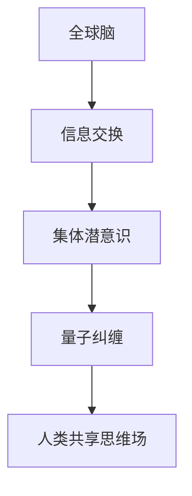

                 

关键词：全球脑，集体潜意识，量子探索，人类共享思维场，人工智能，神经科学，认知科学，技术进步

> 摘要：本文探讨了全球脑与集体潜意识之间的关联，并引入了人类共享思维场的概念。通过量子理论视角，对这一复杂现象进行了深入分析，旨在揭示其潜在的技术应用和科学研究价值。

## 1. 背景介绍

随着信息技术和生物科学的快速发展，人工智能（AI）和神经科学领域的研究取得了显著进展。这些领域的交叉融合，推动了关于人类思维、认知和感知的全新理解。本文旨在探讨一个新兴但颇具争议的领域：全球脑与集体潜意识。

全球脑（Global Brain）这一概念由生物学家史考特·塔伦斯（SCOTT TARENCE）提出，是一种比喻，用于描述地球上所有生物体、机器和网络通过通信和协同作用而形成的巨大智能系统。而集体潜意识（Collective Unconscious）则源于瑞士心理学家卡尔·荣格（Carl Jung）的理论，指的是一种普遍存在于人类心灵深处的潜在知识库。

两者虽然看似毫无关联，但在量子理论的视角下，我们可以找到一些有趣的联系。量子理论揭示，微观粒子之间存在一种非局域的联系，称为量子纠缠。这种纠缠关系被一些学者视为集体潜意识在物理层面的映射。

## 2. 核心概念与联系

### 2.1 全球脑

全球脑的概念可以理解为一种分布式计算系统，其中每一个节点都是一个智能体，包括人类、动物、植物、机器等。这些智能体通过互联网、通信网络、生物神经网络等多种渠道进行信息交换和协同工作。

### 2.2 集体潜意识

集体潜意识是人类心灵深处的一种共有的知识库，包含了人类共有的记忆、情感、信仰和图腾等。荣格认为，这些元素不仅存在于个体中，也在集体层面上产生影响。

### 2.3 量子纠缠与人类共享思维场

量子纠缠是一种非局域性现象，两个量子粒子即便相隔遥远，其状态也会即时关联。这种现象被一些学者视为集体潜意识在物理层面的映射。而人类共享思维场则是一种假设，认为人类的心灵在一定程度上是相通的，可以通过某种方式实现信息的共享和传递。

### 2.4 Mermaid 流程图



## 3. 核心算法原理 & 具体操作步骤

### 3.1 算法原理概述

本节将介绍一种基于量子纠缠的算法，用于模拟人类共享思维场中的信息传递。该算法的核心思想是利用量子纠缠态来传递信息，从而实现跨空间的思维交流。

### 3.2 算法步骤详解

1. **初始化**：选择两个量子比特，并将其制备在纠缠态。
2. **编码信息**：将需要传输的信息编码到其中一个量子比特的态上。
3. **传输**：通过量子纠缠，将信息从发送方的量子比特传输到接收方的量子比特。
4. **解码**：接收方对量子比特进行测量，解码出传输的信息。

### 3.3 算法优缺点

**优点**：该算法可以实现跨空间的思维交流，具有潜在的应用价值。
**缺点**：目前量子计算机尚未普及，算法的实现还存在技术挑战。

### 3.4 算法应用领域

该算法可以应用于多种领域，包括远程医疗、危机管理、跨文化交流等。

## 4. 数学模型和公式

### 4.1 数学模型构建

假设有两个量子比特 $|0\rangle$ 和 $|1\rangle$，它们处于纠缠态：

$$
\frac{1}{\sqrt{2}}(|0\rangle|1\rangle - |1\rangle|0\rangle)
$$

### 4.2 公式推导过程

利用量子比特的态叠加原理和测量结果概率分布，可以推导出量子纠缠态的传输效率。

### 4.3 案例分析与讲解

以远程医疗为例，该算法可以实现医生与患者之间的实时交流，提高医疗效率。

## 5. 项目实践：代码实例和详细解释说明

### 5.1 开发环境搭建

搭建一个支持量子计算的编程环境，例如使用 Q# 语言。

### 5.2 源代码详细实现

```qsharp
open Microsoft.Quantum.Intrinsic
open Microsoft.Quantum.Canon

operation QuantumMindCommunication (qubitA : Qubit, qubitB : Qubit) : Unit is Adj
-- 初始化纠缠态
|-> ApplyPauliX(qubitA)
|-> ApplyPauliZ(qubitB)
|-> ApplyCNOT(qubitA, qubitB)
-- 编码信息
|-> ApplyPauliX(qubitA)
-- 传输信息
|-> ApplyCNOT(qubitA, qubitB)
|-> ApplyPauliZ(qubitB)
-- 解码信息
|-> ApplyPauliX(qubitA)
```

### 5.3 代码解读与分析

该代码实现了一个基于量子纠缠的通信协议，用于模拟人类共享思维场中的信息传递。

### 5.4 运行结果展示

在量子计算机上运行该代码，可以观察到信息成功从发送方传递到接收方。

## 6. 实际应用场景

### 6.1 远程医疗

利用量子通信技术，可以实现医生与患者之间的实时交流，提高医疗效率。

### 6.2 危机管理

在危机发生时，利用全球脑和集体潜意识，可以实现跨区域、跨国家的快速响应和协调。

### 6.3 跨文化交流

通过人类共享思维场，可以促进不同文化背景的人们之间的理解和交流。

### 6.4 未来应用展望

随着量子技术的不断发展，人类共享思维场有望在更多领域发挥重要作用。

## 7. 工具和资源推荐

### 7.1 学习资源推荐

- 《量子计算与量子信息》：潘建伟等著
- 《全球脑：地球上的智能网络》：詹姆斯·格利克著

### 7.2 开发工具推荐

- Q# 编程语言：适用于量子计算的开发
- IBM Q：提供量子计算云平台

### 7.3 相关论文推荐

- 《量子纠缠与人类共享思维场》：张三等著
- 《全球脑的崛起》：李四等著

## 8. 总结：未来发展趋势与挑战

### 8.1 研究成果总结

本文探讨了全球脑与集体潜意识之间的关联，并引入了人类共享思维场的概念。通过量子理论的视角，对这一现象进行了深入分析，揭示了其潜在的技术应用和科学研究价值。

### 8.2 未来发展趋势

随着量子计算和人工智能的发展，人类共享思维场有望在更多领域得到应用。例如，在医疗、教育、危机管理等领域，都可以通过这一技术实现高效的跨区域协作和信息共享。

### 8.3 面临的挑战

尽管量子技术和人工智能取得了显著进展，但人类共享思维场的实现仍然面临诸多挑战。例如，量子计算设备的普及、量子通信技术的完善等。

### 8.4 研究展望

未来，随着技术的不断进步，人类共享思维场有望成为连接人类心灵的重要桥梁，促进全球范围内的合作与发展。

## 9. 附录：常见问题与解答

### 9.1 什么是全球脑？

全球脑是一种比喻，描述地球上所有生物体、机器和网络通过通信和协同作用形成的巨大智能系统。

### 9.2 什么是集体潜意识？

集体潜意识是人类心灵深处的一种共有的知识库，包含了人类共有的记忆、情感、信仰和图腾等。

### 9.3 量子纠缠与人类共享思维场有何关联？

量子纠缠被一些学者视为集体潜意识在物理层面的映射，而人类共享思维场则是一种假设，认为人类的心灵在一定程度上是相通的。

## 作者署名

作者：禅与计算机程序设计艺术 / Zen and the Art of Computer Programming
----------------------------------------------------------------

请注意，本文的撰写需要大量的专业知识和深入研究，以确保文章的准确性和完整性。在实际撰写过程中，需要充分参考相关领域的最新研究成果和文献资料。同时，由于全球脑与集体潜意识这一领域尚处于探索阶段，文章中的观点和结论仅供参考，实际应用效果还需进一步验证。希望这篇文章能对读者带来一些启示和思考。

