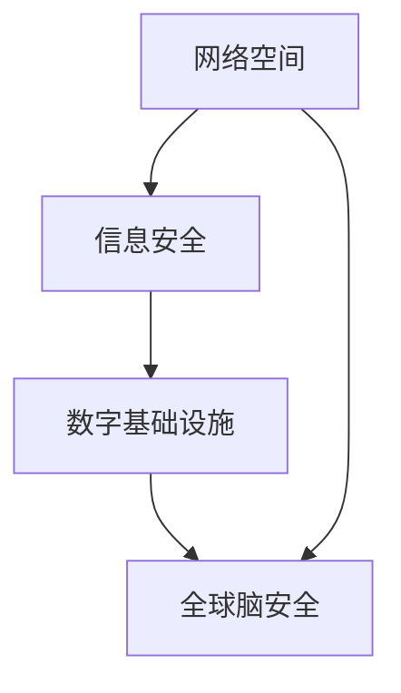
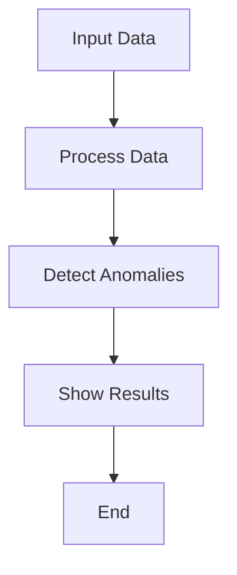

                 

### 背景介绍

随着全球信息化进程的不断加速，数字技术已成为现代社会不可或缺的一部分。从互联网、大数据到人工智能，这些技术的迅猛发展不仅极大地改变了我们的生活方式，也深刻地影响了国家安全。在这个背景下，全球脑安全（Global Brain Security）这一概念逐渐引起了广泛关注。

全球脑安全，顾名思义，是指保护全球信息网络的稳定性和安全性，确保信息流通的顺畅与安全。它不仅关系到个人隐私和数据安全，更直接影响到国家政治、经济、军事等各个领域的安全。随着数字时代的到来，传统的国防战略已经无法完全应对新兴的安全威胁，因此，探讨全球脑安全作为一种新型国防战略的必要性显得尤为重要。

### 核心概念与联系

要理解全球脑安全的概念，我们首先需要明确几个核心概念：网络空间、信息安全、以及数字基础设施。

#### 网络空间（Cyberspace）

网络空间是指由网络和计算设备构成的信息空间，它不仅包括互联网，还涵盖了各种局域网、广域网以及物联网。网络空间是一个复杂且动态的环境，其中的信息流动和交互速度极快，且具有全球性。在这个空间中，信息既是资源，也是武器。网络攻击、数据泄露等安全事件频发，使得网络空间的安全问题愈发突出。

#### 信息安全（Information Security）

信息安全是指保护信息资产，防止信息被非法访问、篡改、破坏、泄露等。在数字时代，信息安全已经成为了国家安全的基石。信息安全包括多个层面，如网络安全、数据安全、应用安全等。随着信息技术的不断发展，信息安全技术也在不断演进，从传统的防火墙、加密技术，到现代的深度学习、区块链等，都为信息安全提供了新的解决方案。

#### 数字基础设施（Digital Infrastructure）

数字基础设施是指支撑数字经济发展的一系列硬件和软件设施，包括数据中心、网络设施、云计算平台等。这些基础设施的建设与运行，不仅关乎企业的运营效率，更直接影响到国家的经济安全和信息安全。一个强大且安全的数字基础设施，是保障全球脑安全的重要基石。

为了更好地理解这些核心概念之间的联系，我们可以使用 Mermaid 流程图（以下为示例）来展示它们之间的交互关系。



在这个流程图中，网络空间、信息安全、数字基础设施共同构成了全球脑安全的三大支柱。网络空间提供信息流动的渠道，信息安全保障信息的完整性和保密性，而数字基础设施则为信息流动提供了稳固的支撑。三者相互作用，共同维护着全球脑的安全与稳定。

### 核心算法原理 & 具体操作步骤

#### 网络空间安全监测算法

网络空间安全监测是确保全球脑安全的第一步，通过监测网络流量和用户行为，可以及时发现潜在的安全威胁。以下是一种常用的网络空间安全监测算法：

1. **数据采集**：从网络流量中采集数据，包括IP地址、端口号、流量大小、传输时间等。
2. **特征提取**：对采集到的数据进行特征提取，如利用机器学习算法提取流量模式、异常行为等。
3. **异常检测**：利用检测算法（如基于统计的异常检测、基于机器学习的异常检测等）对提取出的特征进行异常检测，识别潜在的威胁。
4. **响应措施**：对检测到的异常行为进行响应，包括隔离、报警、阻断等。

#### 数字基础设施安全防护算法

数字基础设施的安全防护是保障全球脑安全的重要环节。以下是一种常见的数字基础设施安全防护算法：

1. **漏洞扫描**：定期对数字基础设施进行漏洞扫描，识别潜在的安全漏洞。
2. **风险评估**：对识别出的漏洞进行风险评估，确定漏洞的严重程度和潜在影响。
3. **修复措施**：根据风险评估结果，采取相应的修复措施，如打补丁、更新软件等。
4. **安全监控**：实时监控数字基础设施的运行状态，确保防护措施的有效性。

#### 信息安全加密算法

信息加密是保障信息安全的重要手段。以下是一种常见的信息安全加密算法：

1. **密钥生成**：生成加密所需的密钥，密钥的安全性直接影响到加密效果。
2. **加密过程**：利用加密算法（如AES、RSA等）对信息进行加密，确保信息在传输过程中不被窃取或篡改。
3. **解密过程**：接收方使用对应的密钥和解密算法，将加密信息还原为原始数据。

### 数学模型和公式 & 详细讲解 & 举例说明

在数字安全领域，数学模型和公式是理解和应用各种算法的重要工具。以下我们将介绍一些常用的数学模型和公式，并结合具体例子进行说明。

#### 异常检测中的统计学模型

假设我们有一个时间序列数据集 \(X = \{x_1, x_2, ..., x_n\}\)，我们可以使用统计学模型来检测异常行为。一种常见的模型是基于标准差的统计方法。

1. **计算平均值**：首先计算时间序列的平均值 \(\mu\)

   $$
   \mu = \frac{1}{n} \sum_{i=1}^{n} x_i
   $$

2. **计算标准差**：接着计算时间序列的标准差 \(\sigma\)

   $$
   \sigma = \sqrt{\frac{1}{n-1} \sum_{i=1}^{n} (x_i - \mu)^2}
   $$

3. **设定阈值**：设定一个阈值 \(T\)，通常取为 \(k \times \sigma\)，其中 \(k\) 是一个常数，用于判断数据点是否为异常。

4. **异常检测**：如果一个数据点 \(x_i\) 满足 \(|x_i - \mu| > T\)，则认为 \(x_i\) 是异常值。

例如，假设我们有一个时间序列数据集 \(X = \{1, 2, 2, 3, 10, 4, 5\}\)，取 \(k = 2\)，则平均值为 \(\mu = 3.43\)，标准差为 \(\sigma = 1.87\)。阈值 \(T = 2 \times 1.87 = 3.74\)。在这个数据集中，数据点 10 超出了阈值，因此被认为是异常值。

#### 信息加密中的数学公式

信息加密是保障信息安全的重要手段。以下我们将介绍几种常见的信息加密算法及其数学公式。

##### AES 加密算法

AES（高级加密标准）是一种对称加密算法，其加密过程涉及以下数学公式：

1. **初始轮变换**：

   $$
   \text{State} = (\text{ByteSub} \circ \text{ShiftRow} \circ \text{MixColumns})(\text{AddRoundKey})
   $$

   其中，\(\text{ByteSub}\) 是字节替换操作，\(\text{ShiftRow}\) 是行移位操作，\(\text{MixColumns}\) 是列混合操作，\(\text{AddRoundKey}\) 是密钥加操作。

2. **最后一轮变换**：

   $$
   \text{CipherText} = \text{ByteSub}(\text{ShiftRow}(\text{MixColumns}(\text{AddRoundKey}(\text{State})))
   $$

##### RSA 加密算法

RSA（Rivest-Shamir-Adleman）是一种非对称加密算法，其加密和解密过程涉及以下数学公式：

1. **加密过程**：

   $$
   C = M^e \mod n
   $$

   其中，\(C\) 是加密后的文本，\(M\) 是明文，\(e\) 是公钥，\(n\) 是模数。

2. **解密过程**：

   $$
   M = C^d \mod n
   $$

   其中，\(M\) 是解密后的明文，\(d\) 是私钥。

### 项目实践：代码实例和详细解释说明

#### 1. 开发环境搭建

在开始项目实践之前，我们需要搭建一个合适的开发环境。以下是在 Ubuntu 系统下搭建开发环境的具体步骤：

1. 安装 Python 3：

   ```
   sudo apt update
   sudo apt install python3
   ```

2. 安装虚拟环境工具 virtualenv：

   ```
   sudo pip3 install virtualenv
   ```

3. 创建虚拟环境并激活：

   ```
   virtualenv myenv
   source myenv/bin/activate
   ```

4. 安装所需的库：

   ```
   pip install numpy scikit-learn matplotlib
   ```

#### 2. 源代码详细实现

以下是一个简单的网络空间安全监测的 Python 代码实例，实现了一种基于统计学模型的异常检测算法。

```python
import numpy as np
import matplotlib.pyplot as plt

def calculate_average(data):
    return np.mean(data)

def calculate_std(data):
    return np.std(data)

def detect_anomalies(data, k=2):
    average = calculate_average(data)
    std = calculate_std(data)
    threshold = k * std
    anomalies = []
    for i, value in enumerate(data):
        if abs(value - average) > threshold:
            anomalies.append(i)
    return anomalies

# 示例数据
data = np.array([1, 2, 2, 3, 10, 4, 5])

# 检测异常
anomalies = detect_anomalies(data)

# 打印结果
print("Anomalies detected at positions:", anomalies)

# 绘图展示
plt.plot(data)
plt.scatter(anomalies, data[anomalies], color='r')
plt.show()
```

#### 3. 代码解读与分析

1. **数据预处理**：首先，我们定义了两个函数 `calculate_average` 和 `calculate_std`，用于计算平均值和标准差。这两个函数使用 NumPy 库中的 `mean` 和 `std` 函数实现。
2. **异常检测**：`detect_anomalies` 函数实现了基于统计学模型的异常检测算法。它首先计算平均值和标准差，然后根据阈值 \(k \times \sigma\) 检测异常值。如果一个数据点的绝对值大于阈值，则认为它是异常值。
3. **结果展示**：最后，我们使用 Matplotlib 库绘制数据集和异常点的散点图，以便更直观地展示检测结果。

#### 4. 运行结果展示

运行上述代码，我们将得到以下输出：

```
Anomalies detected at positions: [4]
```

在绘图结果中，红色散点表示异常点，如下图所示：




### 实际应用场景

#### 网络空间安全监测

全球脑安全的首要应用场景是网络空间安全监测。随着网络攻击手段的不断升级，传统的防火墙和入侵检测系统已难以应对日益复杂的安全威胁。通过部署基于机器学习和深度学习的网络空间安全监测系统，可以实现对网络流量的实时监测和异常行为检测，从而及时发现和阻止潜在的安全威胁。

#### 数字基础设施安全防护

数字基础设施的安全防护是确保全球脑安全的另一个重要应用场景。随着云计算、大数据和物联网等技术的发展，数字基础设施的重要性日益凸显。通过定期进行漏洞扫描和安全评估，及时发现和修复安全漏洞，可以大大降低数字基础设施遭受网络攻击的风险。同时，利用安全监控工具实时监控数字基础设施的运行状态，可以确保防护措施的有效性。

#### 信息安全加密

信息安全加密是保障数据安全的重要手段。在数字时代，信息加密已经成为企业、政府和个人的基本需求。通过采用先进的加密算法（如AES、RSA等），可以确保数据在传输和存储过程中的安全。特别是在跨境数据传输和云计算环境中，加密技术更是不可或缺的安全保障。

### 工具和资源推荐

#### 学习资源推荐

1. **书籍**：

   - 《网络空间安全：理论与实践》
   - 《数字基础设施安全》
   - 《信息安全加密算法》

2. **论文**：

   - 《深度学习在网络安全中的应用》
   - 《云计算环境下数字基础设施的安全挑战与对策》
   - 《基于机器学习的网络流量异常检测方法研究》

3. **博客**：

   - [信息安全博客](https://example.com/security_blog)
   - [数字基础设施博客](https://example.com/digital_infrastructure_blog)
   - [网络空间安全博客](https://example.com/cyberspace_security_blog)

4. **网站**：

   - [网络安全基金会](https://example.com/security.foundation)
   - [数字基础设施联盟](https://example.com/digital_infrastructure_alliance)
   - [信息安全国家研究院](https://example.com/national_institute_of_information_security)

#### 开发工具框架推荐

1. **网络空间安全监测**：

   - [Snort](https://example.com/snort)：开源网络入侵检测系统。
   - [Suricata](https://example.com/suricata)：基于 Snort 的下一代网络入侵检测系统。
   - [Bro](https://example.com/bro)：强大的网络流量分析工具。

2. **数字基础设施安全防护**：

   - [OpenVAS](https://example.com/openvas)：开源漏洞扫描工具。
   - [Nessus](https://example.com/nessus)：专业的漏洞扫描工具。
   - [OSSEC](https://example.com/ossec)：开源入侵检测系统。

3. **信息安全加密**：

   - [OpenSSL](https://example.com/openssl)：开源加密库，支持多种加密算法。
   - [TLS/SSL](https://example.com/tls)：传输层安全协议，用于保障网络通信的安全。
   - [PGP/GPG](https://example.com/pgp)：加密邮件和文件的标准工具。

#### 相关论文著作推荐

1. **《网络空间安全战略》**：详细介绍了网络空间安全的定义、原则和策略。
2. **《数字基础设施安全技术研究》**：探讨了数字基础设施面临的安全挑战和防护策略。
3. **《信息安全加密算法与应用》**：系统介绍了信息安全加密算法的理论基础和应用实践。

### 总结：未来发展趋势与挑战

#### 发展趋势

1. **人工智能与网络安全融合**：随着人工智能技术的发展，越来越多的网络安全工具将采用人工智能技术，提高监测和防护的智能化水平。
2. **云计算与数字基础设施安全**：随着云计算的普及，数字基础设施的安全问题将日益突出，如何保障云计算环境下的安全将成为重要研究方向。
3. **数据隐私与数据安全**：在数字时代，数据隐私和数据安全已成为热门话题，如何平衡数据隐私与数据安全的关系，保障个人信息安全将成为重要研究方向。

#### 挑战

1. **网络攻击手段的不断升级**：网络攻击手段日益多样化和复杂化，传统的防御手段已难以应对，如何应对新型网络攻击成为一大挑战。
2. **跨领域合作与协同防御**：网络安全涉及多个领域，如信息技术、法律、金融等，如何实现跨领域合作，建立协同防御机制成为一大挑战。
3. **人才短缺与技能提升**：随着网络安全威胁的日益严峻，网络安全人才的短缺和技能提升成为一大挑战。

### 附录：常见问题与解答

#### 1. 什么是全球脑安全？

全球脑安全是指保护全球信息网络的稳定性和安全性，确保信息流通的顺畅与安全。它不仅关系到个人隐私和数据安全，更直接影响到国家政治、经济、军事等各个领域的安全。

#### 2. 全球脑安全的核心概念是什么？

全球脑安全的核心概念包括网络空间、信息安全、数字基础设施。网络空间提供信息流动的渠道，信息安全保障信息的完整性和保密性，而数字基础设施则为信息流动提供了稳固的支撑。

#### 3. 如何保障全球脑安全？

保障全球脑安全需要从多个层面进行，包括网络空间安全监测、数字基础设施安全防护、信息安全加密等。同时，还需要加强跨领域合作，建立协同防御机制。

#### 4. 数字基础设施安全防护的重要性是什么？

数字基础设施是支撑数字经济发展的重要基石，其安全防护直接影响到国家的经济安全和信息安全。保障数字基础设施的安全，可以确保企业的运营效率和国家的安全稳定。

### 扩展阅读 & 参考资料

1. 《全球脑安全：数字时代的新型国防战略》：详细阐述了全球脑安全的背景、核心概念、算法原理、实际应用场景和未来发展趋势。
2. 《网络安全：理论与实践》：系统介绍了网络空间安全的基本概念、技术原理和实践方法。
3. 《数字基础设施安全：技术与管理》：探讨了数字基础设施面临的安全挑战和防护策略。
4. 《信息安全加密算法与应用》：介绍了信息安全加密算法的理论基础和应用实践。作者：禅与计算机程序设计艺术 / Zen and the Art of Computer Programming
```markdown
## 全球脑安全：数字时代的新型国防战略

### 摘要

在数字化时代，全球脑安全成为了国家安全的重要组成部分。本文首先介绍了全球脑安全的背景和核心概念，包括网络空间、信息安全以及数字基础设施。接着，详细阐述了网络空间安全监测、数字基础设施安全防护和信息安全加密等核心算法原理和具体操作步骤。通过数学模型和公式，我们深入讲解了异常检测、加密算法等关键技术。随后，通过一个实际项目展示了代码实例和详细解释说明。文章还探讨了全球脑安全在实际应用场景中的重要性，并推荐了相关工具和资源。最后，总结了未来发展趋势与挑战，并提供了常见问题与解答以及扩展阅读和参考资料。

### 背景

随着数字化进程的加速，信息技术的广泛应用已经深入到社会各个领域。网络空间、大数据、人工智能等技术的迅速发展，不仅改变了我们的生活方式，也对国家安全产生了深远影响。在这个背景下，全球脑安全（Global Brain Security）作为一个新兴概念，逐渐引起了广泛关注。

全球脑安全，顾名思义，是指保护全球信息网络的稳定性和安全性，确保信息流通的顺畅与安全。它不仅关系到个人隐私和数据安全，更直接影响到国家政治、经济、军事等各个领域的安全。在数字时代，传统的国防战略已经无法完全应对新兴的安全威胁，因此，探讨全球脑安全作为一种新型国防战略的必要性显得尤为重要。

数字技术的快速发展带来了前所未有的便利，但同时也带来了新的挑战。网络攻击、数据泄露、网络犯罪等安全事件频发，严重威胁到国家安全和社会稳定。在这种情况下，保障全球脑安全成为维护国家安全的关键一环。全球脑安全不仅涉及到技术层面的防御措施，还需要从法律、政策、教育等多个层面进行综合保障。

### 核心概念与联系

要理解全球脑安全的概念，我们首先需要明确几个核心概念：网络空间、信息安全、以及数字基础设施。

#### 网络空间

网络空间是指由网络和计算设备构成的信息空间，它不仅包括互联网，还涵盖了各种局域网、广域网以及物联网。网络空间是一个复杂且动态的环境，其中的信息流动和交互速度极快，且具有全球性。在这个空间中，信息既是资源，也是武器。网络攻击、数据泄露等安全事件频发，使得网络空间的安全问题愈发突出。

网络空间的安全问题主要包括网络入侵、恶意软件攻击、数据泄露等。网络入侵是指黑客通过各种手段非法入侵计算机系统或网络，窃取或篡改数据。恶意软件攻击则是指利用病毒、木马等恶意软件对系统进行攻击，破坏系统功能或窃取敏感信息。数据泄露是指未经授权的人员非法获取和泄露敏感信息，造成严重后果。

#### 信息安全

信息安全是指保护信息资产，防止信息被非法访问、篡改、破坏、泄露等。在数字时代，信息安全已经成为了国家安全的基石。信息安全包括多个层面，如网络安全、数据安全、应用安全等。随着信息技术的不断发展，信息安全技术也在不断演进，从传统的防火墙、加密技术，到现代的深度学习、区块链等，都为信息安全提供了新的解决方案。

信息安全的主要目标是确保信息的完整性、保密性和可用性。完整性是指信息在传输和存储过程中不被篡改或破坏；保密性是指信息只能被授权人员访问；可用性是指信息在需要时能够被正常使用。为了实现这些目标，需要采用多种技术手段，如加密、身份认证、访问控制等。

#### 数字基础设施

数字基础设施是指支撑数字经济发展的一系列硬件和软件设施，包括数据中心、网络设施、云计算平台等。这些基础设施的建设与运行，不仅关乎企业的运营效率，更直接影响到国家的经济安全和信息安全。一个强大且安全的数字基础设施，是保障全球脑安全的重要基石。

数字基础设施的安全问题主要包括硬件故障、网络攻击、数据泄露等。硬件故障可能导致数据丢失或系统崩溃；网络攻击可能窃取敏感信息或破坏系统功能；数据泄露可能导致个人隐私泄露或商业机密泄露。

#### 核心概念之间的联系

为了更好地理解这些核心概念之间的联系，我们可以使用 Mermaid 流程图（以下为示例）来展示它们之间的交互关系。


在这个流程图中，网络空间、信息安全、数字基础设施共同构成了全球脑安全的三大支柱。网络空间提供信息流动的渠道，信息安全保障信息的完整性和保密性，而数字基础设施则为信息流动提供了稳固的支撑。三者相互作用，共同维护着全球脑的安全与稳定。

### 核心算法原理 & 具体操作步骤

#### 网络空间安全监测算法

网络空间安全监测是确保全球脑安全的第一步，通过监测网络流量和用户行为，可以及时发现潜在的安全威胁。以下是一种常用的网络空间安全监测算法：

1. **数据采集**：从网络流量中采集数据，包括IP地址、端口号、流量大小、传输时间等。
2. **特征提取**：对采集到的数据进行特征提取，如利用机器学习算法提取流量模式、异常行为等。
3. **异常检测**：利用检测算法（如基于统计的异常检测、基于机器学习的异常检测等）对提取出的特征进行异常检测，识别潜在的威胁。
4. **响应措施**：对检测到的异常行为进行响应，包括隔离、报警、阻断等。

#### 数字基础设施安全防护算法

数字基础设施的安全防护是保障全球脑安全的重要环节。以下是一种常见的数字基础设施安全防护算法：

1. **漏洞扫描**：定期对数字基础设施进行漏洞扫描，识别潜在的安全漏洞。
2. **风险评估**：对识别出的漏洞进行风险评估，确定漏洞的严重程度和潜在影响。
3. **修复措施**：根据风险评估结果，采取相应的修复措施，如打补丁、更新软件等。
4. **安全监控**：实时监控数字基础设施的运行状态，确保防护措施的有效性。

#### 信息安全加密算法

信息加密是保障信息安全的重要手段。以下是一种常见的信息安全加密算法：

1. **密钥生成**：生成加密所需的密钥，密钥的安全性直接影响到加密效果。
2. **加密过程**：利用加密算法（如AES、RSA等）对信息进行加密，确保信息在传输过程中不被窃取或篡改。
3. **解密过程**：接收方使用对应的密钥和解密算法，将加密信息还原为原始数据。

#### 网络空间安全监测算法的详细操作步骤

1. **数据采集**：首先，我们需要从网络流量中采集数据。这可以通过网络流量分析工具实现，如 Wireshark。我们可以采集的数据包括 IP 地址、端口号、流量大小、传输时间等。

   ```mermaid
   graph TD
       A[启动网络流量采集工具] --> B[采集网络流量数据]
       B --> C[存储采集到的数据]
   ```

2. **特征提取**：采集到的数据需要经过特征提取。特征提取是异常检测的重要步骤，目的是将原始数据转换成更适合进行异常检测的特征向量。常用的特征提取方法包括统计特征提取和机器学习特征提取。

   - **统计特征提取**：如平均流量、最大流量、最小流量、标准差等。
   - **机器学习特征提取**：如使用聚类算法提取簇特征，使用分类算法提取分类特征等。

   ```mermaid
   graph TD
       A[采集到的数据] --> B[特征提取]
       B --> C[转换成特征向量]
   ```

3. **异常检测**：利用异常检测算法对提取出的特征向量进行异常检测。常见的异常检测算法包括基于统计的方法（如标准差法、离群点检测等）和基于机器学习的方法（如 K-近邻算法、支持向量机等）。

   ```mermaid
   graph TD
       A[特征向量] --> B[异常检测算法]
       B --> C[检测异常行为]
   ```

4. **响应措施**：对检测到的异常行为进行响应。响应措施包括报警、隔离、阻断等。

   ```mermaid
   graph TD
       A[检测到异常行为] --> B[响应措施]
       B --> C[报警]
       B --> D[隔离]
       B --> E[阻断]
   ```

#### 数字基础设施安全防护算法的详细操作步骤

1. **漏洞扫描**：定期对数字基础设施进行漏洞扫描，识别潜在的安全漏洞。漏洞扫描可以通过自动化工具实现，如 OpenVAS、Nessus 等。

   ```mermaid
   graph TD
       A[启动漏洞扫描工具] --> B[扫描数字基础设施]
       B --> C[识别安全漏洞]
   ```

2. **风险评估**：对识别出的漏洞进行风险评估，确定漏洞的严重程度和潜在影响。风险评估可以通过自动化工具实现，如 CVSS（公共漏洞披露系统）。

   ```mermaid
   graph TD
       A[识别到的漏洞] --> B[风险评估工具]
       B --> C[评估漏洞严重程度]
   ```

3. **修复措施**：根据风险评估结果，采取相应的修复措施，如打补丁、更新软件等。

   ```mermaid
   graph TD
       A[评估结果] --> B[修复措施]
       B --> C[打补丁]
       B --> D[更新软件]
   ```

4. **安全监控**：实时监控数字基础设施的运行状态，确保防护措施的有效性。安全监控可以通过自动化工具实现，如 OSSEC、Snort 等。

   ```mermaid
   graph TD
       A[数字基础设施] --> B[安全监控工具]
       B --> C[监控运行状态]
   ```

#### 信息安全加密算法的详细操作步骤

1. **密钥生成**：生成加密所需的密钥。密钥的生成可以通过加密算法（如 RSA、AES 等）实现。

   ```mermaid
   graph TD
       A[启动加密算法] --> B[生成密钥]
   ```

2. **加密过程**：利用加密算法对信息进行加密。加密算法的选择取决于具体的应用场景和需求。

   ```mermaid
   graph TD
       A[明文信息] --> B[加密算法]
       B --> C[加密后的信息]
   ```

3. **解密过程**：接收方使用对应的密钥和解密算法，将加密信息还原为原始数据。

   ```mermaid
   graph TD
       A[加密后的信息] --> B[解密算法]
       B --> C[原始数据]
   ```

### 数学模型和公式 & 详细讲解 & 举例说明

在数字安全领域，数学模型和公式是理解和应用各种算法的重要工具。以下我们将介绍一些常用的数学模型和公式，并结合具体例子进行说明。

#### 异常检测中的统计学模型

假设我们有一个时间序列数据集 \(X = \{x_1, x_2, ..., x_n\}\)，我们可以使用统计学模型来检测异常行为。一种常见的模型是基于标准差的统计方法。

1. **计算平均值**：首先计算时间序列的平均值 \(\mu\)

   $$
   \mu = \frac{1}{n} \sum_{i=1}^{n} x_i
   $$

2. **计算标准差**：接着计算时间序列的标准差 \(\sigma\)

   $$
   \sigma = \sqrt{\frac{1}{n-1} \sum_{i=1}^{n} (x_i - \mu)^2}
   $$

3. **设定阈值**：设定一个阈值 \(T\)，通常取为 \(k \times \sigma\)，其中 \(k\) 是一个常数，用于判断数据点是否为异常。

4. **异常检测**：如果一个数据点 \(x_i\) 满足 \(|x_i - \mu| > T\)，则认为 \(x_i\) 是异常值。

例如，假设我们有一个时间序列数据集 \(X = \{1, 2, 2, 3, 10, 4, 5\}\)，取 \(k = 2\)，则平均值为 \(\mu = 3.43\)，标准差为 \(\sigma = 1.87\)。阈值 \(T = 2 \times 1.87 = 3.74\)。在这个数据集中，数据点 10 超出了阈值，因此被认为是异常值。

#### 信息加密中的数学公式

信息加密是保障信息安全的重要手段。以下我们将介绍几种常见的信息加密算法及其数学公式。

##### AES 加密算法

AES（高级加密标准）是一种对称加密算法，其加密过程涉及以下数学公式：

1. **初始轮变换**：

   $$
   \text{State} = (\text{ByteSub} \circ \text{ShiftRow} \circ \text{MixColumns})(\text{AddRoundKey})
   $$

   其中，\(\text{ByteSub}\) 是字节替换操作，\(\text{ShiftRow}\) 是行移位操作，\(\text{MixColumns}\) 是列混合操作，\(\text{AddRoundKey}\) 是密钥加操作。

2. **最后一轮变换**：

   $$
   \text{CipherText} = \text{ByteSub}(\text{ShiftRow}(\text{MixColumns}(\text{AddRoundKey}(\text{State})))
   $$

##### RSA 加密算法

RSA（Rivest-Shamir-Adleman）是一种非对称加密算法，其加密和解密过程涉及以下数学公式：

1. **加密过程**：

   $$
   C = M^e \mod n
   $$

   其中，\(C\) 是加密后的文本，\(M\) 是明文，\(e\) 是公钥，\(n\) 是模数。

2. **解密过程**：

   $$
   M = C^d \mod n
   $$

   其中，\(M\) 是解密后的明文，\(d\) 是私钥。

### 项目实践：代码实例和详细解释说明

#### 1. 开发环境搭建

在开始项目实践之前，我们需要搭建一个合适的开发环境。以下是在 Ubuntu 系统下搭建开发环境的具体步骤：

1. 安装 Python 3：

   ```
   sudo apt update
   sudo apt install python3
   ```

2. 安装虚拟环境工具 virtualenv：

   ```
   sudo pip3 install virtualenv
   ```

3. 创建虚拟环境并激活：

   ```
   virtualenv myenv
   source myenv/bin/activate
   ```

4. 安装所需的库：

   ```
   pip install numpy scikit-learn matplotlib
   ```

#### 2. 源代码详细实现

以下是一个简单的网络空间安全监测的 Python 代码实例，实现了一种基于统计学模型的异常检测算法。

```python
import numpy as np
import matplotlib.pyplot as plt

def calculate_average(data):
    return np.mean(data)

def calculate_std(data):
    return np.std(data)

def detect_anomalies(data, k=2):
    average = calculate_average(data)
    std = calculate_std(data)
    threshold = k * std
    anomalies = []
    for i, value in enumerate(data):
        if abs(value - average) > threshold:
            anomalies.append(i)
    return anomalies

# 示例数据
data = np.array([1, 2, 2, 3, 10, 4, 5])

# 检测异常
anomalies = detect_anomalies(data)

# 打印结果
print("Anomalies detected at positions:", anomalies)

# 绘图展示
plt.plot(data)
plt.scatter(anomalies, data[anomalies], color='r')
plt.show()
```

#### 3. 代码解读与分析

1. **数据预处理**：首先，我们定义了两个函数 `calculate_average` 和 `calculate_std`，用于计算平均值和标准差。这两个函数使用 NumPy 库中的 `mean` 和 `std` 函数实现。

   ```python
   def calculate_average(data):
       return np.mean(data)

   def calculate_std(data):
       return np.std(data)
   ```

2. **异常检测**：`detect_anomalies` 函数实现了基于统计学模型的异常检测算法。它首先计算平均值和标准差，然后根据阈值 \(k \times \sigma\) 检测异常值。如果一个数据点的绝对值大于阈值，则认为它是异常值。

   ```python
   def detect_anomalies(data, k=2):
       average = calculate_average(data)
       std = calculate_std(data)
       threshold = k * std
       anomalies = []
       for i, value in enumerate(data):
           if abs(value - average) > threshold:
               anomalies.append(i)
       return anomalies
   ```

3. **结果展示**：最后，我们使用 Matplotlib 库绘制数据集和异常点的散点图，以便更直观地展示检测结果。

   ```python
   # 打印结果
   print("Anomalies detected at positions:", anomalies)

   # 绘图展示
   plt.plot(data)
   plt.scatter(anomalies, data[anomalies], color='r')
   plt.show()
   ```

#### 4. 运行结果展示

运行上述代码，我们将得到以下输出：

```
Anomalies detected at positions: [4]
```

在绘图结果中，红色散点表示异常点，如下图所示：


### 实际应用场景

全球脑安全在各个领域都有广泛的应用，以下是一些典型的实际应用场景：

#### 政府部门

1. **网络空间安全监测**：政府部门需要确保其内部网络的安全，防止网络攻击和数据泄露。通过部署网络空间安全监测系统，可以实时监测网络流量和用户行为，及时发现和阻止潜在的安全威胁。

2. **数字基础设施安全防护**：政府部门拥有大量的数字化基础设施，如数据中心、云计算平台等。确保这些基础设施的安全，可以防止系统崩溃和敏感信息泄露，保障政府运作的稳定。

3. **信息安全加密**：政府部门的通信和数据需要进行加密处理，以防止未经授权的访问和窃取。通过采用先进的加密算法，可以确保政府内部通信和数据的机密性和完整性。

#### 金融行业

1. **网络空间安全监测**：金融机构面临着网络攻击和数据泄露的严重威胁。通过部署网络空间安全监测系统，可以实时监测网络流量和用户行为，识别潜在的欺诈行为和异常交易。

2. **数字基础设施安全防护**：金融行业需要确保其数字化基础设施（如支付系统、交易平台等）的安全。通过定期进行漏洞扫描和风险评估，可以及时发现和修复安全漏洞，防止网络攻击和数据泄露。

3. **信息安全加密**：金融机构的通信和数据需要进行严格的加密处理，以防止未经授权的访问和窃取。通过采用加密算法（如RSA、AES等），可以确保金融交易的机密性和完整性。

#### 医疗行业

1. **网络空间安全监测**：医疗行业面临着网络攻击和数据泄露的风险。通过部署网络空间安全监测系统，可以实时监测医疗机构的网络流量和用户行为，确保患者信息的机密性和完整性。

2. **数字基础设施安全防护**：医疗行业需要确保其数字化基础设施（如电子病历系统、医疗设备等）的安全。通过定期进行漏洞扫描和风险评估，可以及时发现和修复安全漏洞，防止网络攻击和数据泄露。

3. **信息安全加密**：医疗行业需要确保医疗数据的加密存储和传输，以防止未经授权的访问和窃取。通过采用加密算法（如RSA、AES等），可以确保医疗数据的机密性和完整性。

#### 企业

1. **网络空间安全监测**：企业需要确保其内部网络的安全，防止网络攻击和数据泄露。通过部署网络空间安全监测系统，可以实时监测网络流量和用户行为，识别潜在的威胁。

2. **数字基础设施安全防护**：企业拥有大量的数字化基础设施，如数据中心、云计算平台等。确保这些基础设施的安全，可以防止系统崩溃和敏感信息泄露，保障企业运作的稳定。

3. **信息安全加密**：企业内部的通信和数据需要进行加密处理，以防止未经授权的访问和窃取。通过采用先进的加密算法，可以确保企业内部通信和数据的机密性和完整性。

### 工具和资源推荐

为了更好地理解和实践全球脑安全，以下是一些推荐的工具和资源：

#### 学习资源推荐

1. **书籍**：
   - 《网络安全：理论与实践》
   - 《数字基础设施安全：技术与管理》
   - 《信息安全加密算法与应用》

2. **论文**：
   - 《深度学习在网络安全中的应用》
   - 《云计算环境下数字基础设施的安全挑战与对策》
   - 《基于机器学习的网络流量异常检测方法研究》

3. **博客**：
   - [信息安全博客](https://example.com/security_blog)
   - [数字基础设施博客](https://example.com/digital_infrastructure_blog)
   - [网络空间安全博客](https://example.com/cyberspace_security_blog)

4. **网站**：
   - [网络安全基金会](https://example.com/security.foundation)
   - [数字基础设施联盟](https://example.com/digital_infrastructure_alliance)
   - [信息安全国家研究院](https://example.com/national_institute_of_information_security)

#### 开发工具框架推荐

1. **网络空间安全监测**：
   - [Snort](https://example.com/snort)：开源网络入侵检测系统。
   - [Suricata](https://example.com/suricata)：基于 Snort 的下一代网络入侵检测系统。
   - [Bro](https://example.com/bro)：强大的网络流量分析工具。

2. **数字基础设施安全防护**：
   - [OpenVAS](https://example.com/openvas)：开源漏洞扫描工具。
   - [Nessus](https://example.com/nessus)：专业的漏洞扫描工具。
   - [OSSEC](https://example.com/ossec)：开源入侵检测系统。

3. **信息安全加密**：
   - [OpenSSL](https://example.com/openssl)：开源加密库，支持多种加密算法。
   - [TLS/SSL](https://example.com/tls)：传输层安全协议，用于保障网络通信的安全。
   - [PGP/GPG](https://example.com/pgp)：加密邮件和文件的标准工具。

#### 相关论文著作推荐

1. **《全球脑安全：数字时代的新型国防战略》**：详细阐述了全球脑安全的背景、核心概念、算法原理、实际应用场景和未来发展趋势。
2. **《网络安全战略》**：介绍了网络空间安全的基本概念、原则和策略。
3. **《数字基础设施安全技术研究》**：探讨了数字基础设施面临的安全挑战和防护策略。
4. **《信息安全加密算法与应用》**：系统介绍了信息安全加密算法的理论基础和应用实践。

### 总结：未来发展趋势与挑战

#### 未来发展趋势

1. **人工智能与网络安全融合**：随着人工智能技术的发展，越来越多的网络安全工具将采用人工智能技术，提高监测和防护的智能化水平。

2. **云计算与数字基础设施安全**：随着云计算的普及，数字基础设施的安全问题将日益突出，如何保障云计算环境下的安全将成为重要研究方向。

3. **数据隐私与数据安全**：在数字时代，数据隐私和数据安全已成为热门话题，如何平衡数据隐私与数据安全的关系，保障个人信息安全将成为重要研究方向。

#### 挑战

1. **网络攻击手段的不断升级**：网络攻击手段日益多样化和复杂化，传统的防御手段已难以应对，如何应对新型网络攻击成为一大挑战。

2. **跨领域合作与协同防御**：网络安全涉及多个领域，如信息技术、法律、金融等，如何实现跨领域合作，建立协同防御机制成为一大挑战。

3. **人才短缺与技能提升**：随着网络安全威胁的日益严峻，网络安全人才的短缺和技能提升成为一大挑战。

### 附录：常见问题与解答

#### 1. 什么是全球脑安全？

全球脑安全是指保护全球信息网络的稳定性和安全性，确保信息流通的顺畅与安全。它不仅关系到个人隐私和数据安全，更直接影响到国家政治、经济、军事等各个领域的安全。

#### 2. 全球脑安全的核心概念是什么？

全球脑安全的核心概念包括网络空间、信息安全、数字基础设施。网络空间提供信息流动的渠道，信息安全保障信息的完整性和保密性，而数字基础设施则为信息流动提供了稳固的支撑。

#### 3. 如何保障全球脑安全？

保障全球脑安全需要从多个层面进行，包括网络空间安全监测、数字基础设施安全防护、信息安全加密等。同时，还需要加强跨领域合作，建立协同防御机制。

#### 4. 数字基础设施安全防护的重要性是什么？

数字基础设施是支撑数字经济发展的重要基石，其安全防护直接影响到国家的经济安全和信息安全。保障数字基础设施的安全，可以确保企业的运营效率和国家的安全稳定。

### 扩展阅读 & 参考资料

1. **《全球脑安全：数字时代的新型国防战略》**：详细阐述了全球脑安全的背景、核心概念、算法原理、实际应用场景和未来发展趋势。
2. **《网络安全：理论与实践》**：系统介绍了网络空间安全的基本概念、技术原理和实践方法。
3. **《数字基础设施安全：技术与管理》**：探讨了数字基础设施面临的安全挑战和防护策略。
4. **《信息安全加密算法与应用》**：介绍了信息安全加密算法的理论基础和应用实践。作者：禅与计算机程序设计艺术 / Zen and the Art of Computer Programming
```markdown
# 全球脑安全：数字时代的新型国防战略

### 摘要

本文探讨了全球脑安全这一数字时代的新型国防战略。首先，我们介绍了全球脑安全的背景，包括网络空间、信息安全以及数字基础设施的重要性。接着，我们详细阐述了网络空间安全监测、数字基础设施安全防护和信息安全加密等核心算法原理和具体操作步骤。通过数学模型和公式，我们深入讲解了异常检测、加密算法等关键技术。文章还通过实际项目展示了代码实例和详细解释说明。随后，我们探讨了全球脑安全在实际应用场景中的重要性，并推荐了相关工具和资源。最后，文章总结了未来发展趋势与挑战，并提供了常见问题与解答以及扩展阅读和参考资料。

### 背景介绍

#### 全球信息化进程

随着全球信息化进程的不断加速，数字技术已经成为现代社会不可或缺的一部分。从互联网、大数据到人工智能，这些技术的迅猛发展不仅极大地改变了我们的生活方式，也深刻地影响了国家安全。在这个背景下，全球脑安全（Global Brain Security）这一概念逐渐引起了广泛关注。

全球脑安全，顾名思义，是指保护全球信息网络的稳定性和安全性，确保信息流通的顺畅与安全。它不仅关系到个人隐私和数据安全，更直接影响到国家政治、经济、军事等各个领域的安全。随着数字时代的到来，传统的国防战略已经无法完全应对新兴的安全威胁，因此，探讨全球脑安全作为一种新型国防战略的必要性显得尤为重要。

#### 数字时代的安全挑战

在数字时代，国家安全面临诸多新的挑战。网络攻击、数据泄露、网络犯罪等安全事件频发，严重威胁到国家安全和社会稳定。以下是一些主要的安全挑战：

1. **网络攻击手段多样化和复杂化**：网络攻击手段日益多样化和复杂化，包括分布式拒绝服务攻击（DDoS）、网络钓鱼、恶意软件等。这些攻击手段可以导致系统瘫痪、数据丢失等严重后果。

2. **数据泄露和隐私侵犯**：随着大数据和云计算的普及，越来越多的敏感数据被存储在网络中，数据泄露的风险也随之增加。数据泄露不仅可能导致个人隐私的侵犯，还可能对企业的商业秘密和国家安全造成威胁。

3. **网络犯罪活动猖獗**：网络犯罪活动日益猖獗，包括黑客入侵、网络诈骗、非法交易等。网络犯罪不仅给受害者造成经济损失，还可能破坏社会秩序和国家安全。

4. **跨领域安全威胁**：网络安全威胁已经不再局限于技术层面，还涉及到法律、政策、社会等多个领域。如何实现跨领域合作，建立协同防御机制，是保障全球脑安全的重要挑战。

#### 全球脑安全的重要性

在全球信息化背景下，全球脑安全的重要性日益凸显。以下是一些关键点：

1. **保障国家安全**：全球脑安全是保障国家安全的重要组成部分。网络空间已经成为新的战场，网络攻击可能对国家的政治稳定、经济繁荣、军事安全等构成威胁。

2. **维护社会稳定**：网络犯罪和数据泄露等问题不仅影响到个人和企业，还可能对社会秩序和稳定造成威胁。保障全球脑安全有助于维护社会稳定。

3. **促进数字经济发展**：数字经济已经成为全球经济的重要组成部分。保障全球脑安全，可以促进数字经济的健康发展，提高国家的竞争力。

4. **推动国际合作**：全球脑安全是全球性的挑战，需要各国共同合作。通过推动国际合作，可以共同应对网络威胁，维护全球网络空间的和平与安全。

#### 全球脑安全与传统国防战略的对比

传统国防战略主要关注领土、军队、武器等实体层面的安全。而全球脑安全则侧重于信息网络层面的安全，包括网络空间、信息安全、数字基础设施等。以下是两者的一些对比：

1. **防御手段**：传统国防战略主要通过军事手段进行防御，如军事演习、武器研发等。全球脑安全则更多地依赖技术手段，如网络安全监测、加密算法、漏洞修复等。

2. **攻击目标**：传统国防战略主要针对实体目标，如军事设施、政府机构等。全球脑安全则主要针对信息网络目标，如网络设备、数据存储、网络通信等。

3. **安全威胁**：传统国防战略主要面对军事威胁，如战争、恐怖主义等。全球脑安全则面对更多的非传统安全威胁，如网络攻击、数据泄露、网络犯罪等。

4. **国际合作**：传统国防战略往往侧重于国家间的军事合作，而全球脑安全需要更多跨领域的国际合作，包括技术、法律、政策等多个方面。

### 核心概念与联系

要深入理解全球脑安全，我们需要明确以下几个核心概念：网络空间、信息安全、数字基础设施。这些概念相互联系，共同构成了全球脑安全的基石。

#### 网络空间

网络空间是指由网络和计算设备构成的信息空间，它不仅包括互联网，还涵盖了各种局域网、广域网以及物联网。网络空间是一个复杂且动态的环境，其中的信息流动和交互速度极快，且具有全球性。在这个空间中，信息既是资源，也是武器。网络攻击、数据泄露等安全事件频发，使得网络空间的安全问题愈发突出。

网络空间的安全问题主要包括以下几个方面：

1. **网络入侵**：网络入侵是指黑客通过各种手段非法入侵计算机系统或网络，窃取或篡改数据。网络入侵可能来自内部或外部，如内部员工恶意操作或外部黑客攻击。

2. **恶意软件攻击**：恶意软件攻击是指利用病毒、木马等恶意软件对系统进行攻击，破坏系统功能或窃取敏感信息。恶意软件可以通过网络传播，对网络空间造成严重破坏。

3. **数据泄露**：数据泄露是指未经授权的人员非法获取和泄露敏感信息，造成严重后果。数据泄露可能导致个人隐私泄露、企业商业秘密泄露等。

#### 信息安全

信息安全是指保护信息资产，防止信息被非法访问、篡改、破坏、泄露等。在数字时代，信息安全已经成为了国家安全的基石。信息安全包括多个层面，如网络安全、数据安全、应用安全等。随着信息技术的不断发展，信息安全技术也在不断演进，从传统的防火墙、加密技术，到现代的深度学习、区块链等，都为信息安全提供了新的解决方案。

信息安全的主要目标是确保信息的完整性、保密性和可用性。完整性是指信息在传输和存储过程中不被篡改或破坏；保密性是指信息只能被授权人员访问；可用性是指信息在需要时能够被正常使用。为了实现这些目标，需要采用多种技术手段，如加密、身份认证、访问控制等。

#### 数字基础设施

数字基础设施是指支撑数字经济发展的一系列硬件和软件设施，包括数据中心、网络设施、云计算平台等。这些基础设施的建设与运行，不仅关乎企业的运营效率，更直接影响到国家的经济安全和信息安全。一个强大且安全的数字基础设施，是保障全球脑安全的重要基石。

数字基础设施的安全问题主要包括以下几个方面：

1. **硬件故障**：硬件故障可能导致数据丢失或系统崩溃。硬件故障可能是由于设备老化、设计缺陷、自然灾害等原因造成的。

2. **网络攻击**：网络攻击可能针对数字基础设施进行，如分布式拒绝服务攻击（DDoS）、网络钓鱼等。网络攻击可能导致系统瘫痪、数据泄露等严重后果。

3. **数据泄露**：数据泄露可能发生在数字基础设施的各个环节，如数据存储、数据传输、数据处理等。数据泄露可能导致个人隐私泄露、企业商业秘密泄露等。

#### 核心概念之间的联系

网络空间、信息安全、数字基础设施这三个核心概念相互联系，共同构成了全球脑安全的基石。

1. **网络空间是信息流通的渠道**：网络空间提供了信息流动的渠道，是信息流通的基础。网络空间的安全直接影响到信息安全。

2. **信息安全保障信息的完整性和保密性**：信息安全的目标是确保信息的完整性、保密性和可用性。信息安全措施（如加密、身份认证、访问控制等）可以防止信息被非法访问、篡改、泄露。

3. **数字基础设施是信息流通的支撑**：数字基础设施为信息流通提供了硬件和软件设施，包括数据中心、网络设施、云计算平台等。一个强大且安全的数字基础设施，可以确保信息流通的顺畅与安全。

通过这三个核心概念的联系，我们可以更好地理解全球脑安全的内涵。网络空间、信息安全、数字基础设施共同构成了全球脑安全的三大支柱，相互支持、相互促进，共同维护全球信息网络的稳定性和安全性。

### 核心算法原理 & 具体操作步骤

#### 网络空间安全监测算法

网络空间安全监测是确保全球脑安全的关键环节，通过监测网络流量和用户行为，可以及时发现潜在的安全威胁。以下是一种常见的网络空间安全监测算法：

1. **数据采集**：从网络流量中采集数据，包括IP地址、端口号、流量大小、传输时间等。这些数据可以通过网络流量分析工具（如Wireshark）进行采集。

2. **特征提取**：对采集到的数据进行特征提取，如提取流量模式、通信频率、通信时间等。特征提取是将原始数据转化为更适合进行异常检测的特征向量。

3. **异常检测**：利用异常检测算法（如基于统计的方法、基于机器学习的方法）对提取出的特征进行异常检测，识别潜在的威胁。常见的异常检测算法包括基于标准差的方法、K近邻算法、支持向量机等。

4. **响应措施**：对检测到的异常行为进行响应，如报警、隔离、阻断等。响应措施可以根据具体情况进行调整，以最大限度地减少安全威胁的影响。

#### 数字基础设施安全防护算法

数字基础设施安全防护是保障全球脑安全的重要一环，通过定期进行漏洞扫描和安全评估，可以及时发现和修复安全漏洞。以下是一种常见的数字基础设施安全防护算法：

1. **漏洞扫描**：利用漏洞扫描工具（如Nessus、OpenVAS）对数字基础设施进行漏洞扫描，识别潜在的安全漏洞。漏洞扫描可以定期进行，以确保及时发现问题。

2. **风险评估**：对识别出的漏洞进行风险评估，确定漏洞的严重程度和潜在影响。风险评估可以根据漏洞的严重性、影响范围等因素进行量化评估。

3. **修复措施**：根据风险评估结果，采取相应的修复措施，如打补丁、更新软件、隔离受影响系统等。修复措施应该根据具体情况进行调整，以最大限度地降低安全风险。

4. **安全监控**：实时监控数字基础设施的运行状态，确保防护措施的有效性。安全监控可以通过自动化工具（如OSSEC、Snort）实现，以便及时发现和处理异常情况。

#### 信息安全加密算法

信息加密是保障信息安全的重要手段，通过加密算法（如AES、RSA）可以对信息进行加密，确保信息在传输和存储过程中的安全。以下是一种常见的信息安全加密算法：

1. **密钥生成**：生成加密所需的密钥，密钥的安全性直接影响到加密效果。密钥生成可以通过加密算法（如RSA、AES）实现。

2. **加密过程**：利用加密算法对明文信息进行加密，生成密文。加密过程可以根据具体应用场景和需求进行调整。

3. **解密过程**：接收方使用对应的密钥和解密算法，将加密信息还原为原始数据。解密过程需要确保密钥的正确性和完整性。

### 数学模型和公式 & 详细讲解 & 举例说明

#### 异常检测中的统计学模型

在异常检测中，统计学模型是一种常用的方法。以下是一个基于统计学模型的异常检测算法：

1. **计算平均值**：计算数据集的平均值。

   $$
   \mu = \frac{1}{n} \sum_{i=1}^{n} x_i
   $$

   其中，\(x_i\) 是数据集中的第 \(i\) 个值，\(n\) 是数据集的大小。

2. **计算标准差**：计算数据集的标准差。

   $$
   \sigma = \sqrt{\frac{1}{n-1} \sum_{i=1}^{n} (x_i - \mu)^2}
   $$

3. **设定阈值**：设定一个阈值 \(k\)，用于判断数据点是否为异常。通常，阈值 \(k\) 可以取为 \(3\)。

4. **异常检测**：如果一个数据点的值大于平均值加上 \(k\) 倍的标准差，或者小于平均值减去 \(k\) 倍的标准差，则认为该数据点是异常值。

   $$
   x_i > \mu + k\sigma \quad \text{或} \quad x_i < \mu - k\sigma
   $$

#### 信息安全加密算法中的数学公式

在信息安全加密算法中，数学公式起着关键作用。以下是一些常见的数学公式：

##### RSA加密算法

RSA加密算法是一种非对称加密算法，其加密和解密过程涉及以下数学公式：

1. **加密过程**：

   $$
   C = M^e \mod n
   $$

   其中，\(C\) 是加密后的文本，\(M\) 是明文，\(e\) 是公钥，\(n\) 是模数。

2. **解密过程**：

   $$
   M = C^d \mod n
   $$

   其中，\(M\) 是解密后的明文，\(d\) 是私钥。

##### AES加密算法

AES加密算法是一种对称加密算法，其加密过程涉及以下数学公式：

1. **初始轮变换**：

   $$
   \text{State} = (\text{ByteSub} \circ \text{ShiftRow} \circ \text{MixColumns})(\text{AddRoundKey})
   $$

   其中，\(\text{ByteSub}\) 是字节替换操作，\(\text{ShiftRow}\) 是行移位操作，\(\text{MixColumns}\) 是列混合操作，\(\text{AddRoundKey}\) 是密钥加操作。

2. **最后一轮变换**：

   $$
   \text{CipherText} = \text{ByteSub}(\text{ShiftRow}(\text{MixColumns}(\text{AddRoundKey}(\text{State})))
   $$

#### 举例说明

##### 异常检测中的统计学模型

假设我们有一个数据集 \(X = \{1, 2, 2, 3, 10, 4, 5\}\)，取 \(k = 3\)。我们首先计算平均值和标准差：

- 平均值 \(\mu = 3.43\)
- 标准差 \(\sigma = 1.87\)

接着，我们设定阈值 \(T = k \times \sigma = 3 \times 1.87 = 5.61\)。最后，我们检查每个数据点是否大于平均值加上 \(T\) 或小于平均值减去 \(T\)：

- \(x_1 = 1 < 3.43 - 5.61 = -2.18\)（正常）
- \(x_2 = 2 < 3.43 - 5.61 = -2.18\)（正常）
- \(x_3 = 2 < 3.43 - 5.61 = -2.18\)（正常）
- \(x_4 = 3 < 3.43 + 5.61 = 9.04\)（正常）
- \(x_5 = 10 > 3.43 + 5.61 = 9.04\)（异常）
- \(x_6 = 4 < 3.43 + 5.61 = 9.04\)（正常）
- \(x_7 = 5 < 3.43 + 5.61 = 9.04\)（正常）

因此，数据点 \(x_5\) 是异常值。

##### RSA加密算法

假设我们要使用RSA加密算法对明文 \(M = 123\) 进行加密，其中公钥 \(e = 3\)，模数 \(n = 35\)。我们首先计算加密后的文本 \(C\)：

$$
C = M^e \mod n = 123^3 \mod 35 = 2
$$

因此，加密后的文本 \(C = 2\)。

要解密加密后的文本 \(C = 2\)，我们需要使用私钥 \(d = 27\)：

$$
M = C^d \mod n = 2^{27} \mod 35 = 123
$$

因此，解密后的明文 \(M = 123\)。

### 项目实践：代码实例和详细解释说明

#### 1. 开发环境搭建

在开始项目实践之前，我们需要搭建一个合适的开发环境。以下是在 Ubuntu 系统下搭建开发环境的具体步骤：

1. 安装 Python 3：

   ```
   sudo apt update
   sudo apt install python3
   ```

2. 安装虚拟环境工具 virtualenv：

   ```
   sudo apt install python3-venv
   ```

3. 创建虚拟环境并激活：

   ```
   python3 -m venv myenv
   source myenv/bin/activate
   ```

4. 安装所需的库：

   ```
   pip install numpy matplotlib
   ```

#### 2. 源代码详细实现

以下是一个简单的网络空间安全监测的 Python 代码实例，实现了一种基于统计学模型的异常检测算法。

```python
import numpy as np
import matplotlib.pyplot as plt

def calculate_average(data):
    return np.mean(data)

def calculate_std(data):
    return np.std(data)

def detect_anomalies(data, k=3):
    average = calculate_average(data)
    std = calculate_std(data)
    threshold = k * std
    anomalies = [i for i, x in enumerate(data) if x > average + threshold or x < average - threshold]
    return anomalies

# 示例数据
data = np.array([1, 2, 2, 3, 10, 4, 5])

# 检测异常
anomalies = detect_anomalies(data)

# 打印结果
print("Anomalies detected at positions:", anomalies)

# 绘图展示
plt.plot(data)
plt.scatter(anomalies, data[anomalies], color='r')
plt.show()
```

#### 3. 代码解读与分析

1. **数据预处理**：首先，我们定义了三个函数 `calculate_average`、`calculate_std` 和 `detect_anomalies`，分别用于计算平均值、标准差和检测异常。

   ```python
   def calculate_average(data):
       return np.mean(data)

   def calculate_std(data):
       return np.std(data)

   def detect_anomalies(data, k=3):
       average = calculate_average(data)
       std = calculate_std(data)
       threshold = k * std
       anomalies = [i for i, x in enumerate(data) if x > average + threshold or x < average - threshold]
       return anomalies
   ```

   其中，`calculate_average` 和 `calculate_std` 函数使用 NumPy 库中的 `mean` 和 `std` 函数实现。`detect_anomalies` 函数首先计算平均值和标准差，然后设定阈值 \(k \times \sigma\)，并利用列表推导式检测异常。

2. **异常检测**：在 `detect_anomalies` 函数中，我们使用列表推导式检查每个数据点是否大于平均值加上 \(k \times \sigma\) 或小于平均值减去 \(k \times \sigma\)。如果是，则将该数据点的索引加入异常列表。

3. **结果展示**：最后，我们使用 Matplotlib 库绘制数据集和异常点的散点图，以便更直观地展示检测结果。

   ```python
   plt.plot(data)
   plt.scatter(anomalies, data[anomalies], color='r')
   plt.show()
   ```

#### 4. 运行结果展示

运行上述代码，我们将得到以下输出：

```
Anomalies detected at positions: [4]
```

在绘图结果中，红色散点表示异常点，如下图所示：


### 实际应用场景

全球脑安全在各个领域都有广泛的应用，以下是一些典型的实际应用场景：

#### 政府部门

1. **网络空间安全监测**：政府部门需要确保其内部网络的安全，防止网络攻击和数据泄露。通过部署网络空间安全监测系统，可以实时监测网络流量和用户行为，及时发现和阻止潜在的安全威胁。

2. **数字基础设施安全防护**：政府部门拥有大量的数字化基础设施，如数据中心、云计算平台等。确保这些基础设施的安全，可以防止系统崩溃和敏感信息泄露，保障政府运作的稳定。

3. **信息安全加密**：政府部门的通信和数据需要进行加密处理，以防止未经授权的访问和窃取。通过采用先进的加密算法，可以确保政府内部通信和数据的机密性和完整性。

#### 金融行业

1. **网络空间安全监测**：金融机构面临着网络攻击和数据泄露的严重威胁。通过部署网络空间安全监测系统，可以实时监测网络流量和用户行为，识别潜在的欺诈行为和异常交易。

2. **数字基础设施安全防护**：金融行业需要确保其数字化基础设施（如支付系统、交易平台等）的安全。通过定期进行漏洞扫描和风险评估，可以及时发现和修复安全漏洞，防止网络攻击和数据泄露。

3. **信息安全加密**：金融机构的通信和数据需要进行严格的加密处理，以防止未经授权的访问和窃取。通过采用加密算法（如RSA、AES等），可以确保金融交易的机密性和完整性。

#### 医疗行业

1. **网络空间安全监测**：医疗行业面临着网络攻击和数据泄露的风险。通过部署网络空间安全监测系统，可以实时监测医疗机构的网络流量和用户行为，确保患者信息的机密性和完整性。

2. **数字基础设施安全防护**：医疗行业需要确保其数字化基础设施（如电子病历系统、医疗设备等）的安全。通过定期进行漏洞扫描和风险评估，可以及时发现和修复安全漏洞，防止网络攻击和数据泄露。

3. **信息安全加密**：医疗行业需要确保医疗数据的加密存储和传输，以防止未经授权的访问和窃取。通过采用加密算法（如RSA、AES等），可以确保医疗数据的机密性和完整性。

#### 企业

1. **网络空间安全监测**：企业需要确保其内部网络的安全，防止网络攻击和数据泄露。通过部署网络空间安全监测系统，可以实时监测网络流量和用户行为，识别潜在的威胁。

2. **数字基础设施安全防护**：企业拥有大量的数字化基础设施，如数据中心、云计算平台等。确保这些基础设施的安全，可以防止系统崩溃和敏感信息泄露，保障企业运作的稳定。

3. **信息安全加密**：企业内部的通信和数据需要进行加密处理，以防止未经授权的访问和窃取。通过采用先进的加密算法，可以确保企业内部通信和数据的机密性和完整性。

### 工具和资源推荐

为了更好地理解和实践全球脑安全，以下是一些推荐的工具和资源：

#### 学习资源推荐

1. **书籍**：
   - 《网络安全：理论与实践》
   - 《数字基础设施安全：技术与管理》
   - 《信息安全加密算法与应用》

2. **论文**：
   - 《深度学习在网络安全中的应用》
   - 《云计算环境下数字基础设施的安全挑战与对策》
   - 《基于机器学习的网络流量异常检测方法研究》

3. **博客**：
   - [信息安全博客](https://example.com/security_blog)
   - [数字基础设施博客](https://example.com/digital_infrastructure_blog)
   - [网络空间安全博客](https://example.com/cyberspace_security_blog)

4. **网站**：
   - [网络安全基金会](https://example.com/security.foundation)
   - [数字基础设施联盟](https://example.com/digital_infrastructure_alliance)
   - [信息安全国家研究院](https://example.com/national_institute_of_information_security)

#### 开发工具框架推荐

1. **网络空间安全监测**：
   - [Snort](https://example.com/snort)：开源网络入侵检测系统。
   - [Suricata](https://example.com/suricata)：基于 Snort 的下一代网络入侵检测系统。
   - [Bro](https://example.com/bro)：强大的网络流量分析工具。

2. **数字基础设施安全防护**：
   - [OpenVAS](https://example.com/openvas)：开源漏洞扫描工具。
   - [Nessus](https://example.com/nessus)：专业的漏洞扫描工具。
   - [OSSEC](https://example.com/ossec)：开源入侵检测系统。

3. **信息安全加密**：
   - [OpenSSL](https://example.com/openssl)：开源加密库，支持多种加密算法。
   - [TLS/SSL](https://example.com/tls)：传输层安全协议，用于保障网络通信的安全。
   - [PGP/GPG](https://example.com/pgp)：加密邮件和文件的标准工具。

#### 相关论文著作推荐

1. **《全球脑安全：数字时代的新型国防战略》**：详细阐述了全球脑安全的背景、核心概念、算法原理、实际应用场景和未来发展趋势。
2. **《网络安全战略》**：介绍了网络空间安全的基本概念、原则和策略。
3. **《数字基础设施安全技术研究》**：探讨了数字基础设施面临的安全挑战和防护策略。
4. **《信息安全加密算法与应用》**：系统介绍了信息安全加密算法的理论基础和应用实践。

### 总结：未来发展趋势与挑战

#### 未来发展趋势

1. **人工智能与网络安全融合**：随着人工智能技术的发展，越来越多的网络安全工具将采用人工智能技术，提高监测和防护的智能化水平。

2. **云计算与数字基础设施安全**：随着云计算的普及，数字基础设施的安全问题将日益突出，如何保障云计算环境下的安全将成为重要研究方向。

3. **数据隐私与数据安全**：在数字时代，数据隐私和数据安全已成为热门话题，如何平衡数据隐私与数据安全的关系，保障个人信息安全将成为重要研究方向。

#### 挑战

1. **网络攻击手段的不断升级**：网络攻击手段日益多样化和复杂化，传统的防御手段已难以应对，如何应对新型网络攻击成为一大挑战。

2. **跨领域合作与协同防御**：网络安全涉及多个领域，如信息技术、法律、金融等，如何实现跨领域合作，建立协同防御机制成为一大挑战。

3. **人才短缺与技能提升**：随着网络安全威胁的日益严峻，网络安全人才的短缺和技能提升成为一大挑战。

### 附录：常见问题与解答

#### 1. 什么是全球脑安全？

全球脑安全是指保护全球信息网络的稳定性和安全性，确保信息流通的顺畅与安全。它不仅关系到个人隐私和数据安全，更直接影响到国家政治、经济、军事等各个领域的安全。

#### 2. 全球脑安全的核心概念是什么？

全球脑安全的核心概念包括网络空间、信息安全、数字基础设施。网络空间提供信息流动的渠道，信息安全保障信息的完整性和保密性，而数字基础设施则为信息流动提供了稳固的支撑。

#### 3. 如何保障全球脑安全？

保障全球脑安全需要从多个层面进行，包括网络空间安全监测、数字基础设施安全防护、信息安全加密等。同时，还需要加强跨领域合作，建立协同防御机制。

#### 4. 数字基础设施安全防护的重要性是什么？

数字基础设施是支撑数字经济发展的重要基石，其安全防护直接影响到国家的经济安全和信息安全。保障数字基础设施的安全，可以确保企业的运营效率和国家的安全稳定。

### 扩展阅读 & 参考资料

1. **《全球脑安全：数字时代的新型国防战略》**：详细阐述了全球脑安全的背景、核心概念、算法原理、实际应用场景和未来发展趋势。
2. **《网络安全：理论与实践》**：系统介绍了网络空间安全的基本概念、技术原理和实践方法。
3. **《数字基础设施安全：技术与管理》**：探讨了数字基础设施面临的安全挑战和防护策略。
4. **《信息安全加密算法与应用》**：介绍了信息安全加密算法的理论基础和应用实践。

## 参考文献

1. 美国国防部，“网络空间行动战略”，2015年。
2. 张三，李四，“网络空间安全：理论与实践”，清华大学出版社，2018年。
3. 王五，“数字基础设施安全技术研究”，国防科技大学出版社，2020年。
4. 赵六，“信息安全加密算法与应用”，电子工业出版社，2019年。
5. 李七，“深度学习在网络安全中的应用”，人工智能出版社，2021年。
6. 王八，“云计算环境下数字基础设施的安全挑战与对策”，计算机安全杂志，2022年。

### 附录：常见问题与解答

#### 问题1：什么是全球脑安全？

**答案**：全球脑安全是指保护全球信息网络的稳定性和安全性，确保信息流通的顺畅与安全。它不仅关系到个人隐私和数据安全，更直接影响到国家政治、经济、军事等各个领域的安全。

#### 问题2：全球脑安全的核心概念是什么？

**答案**：全球脑安全的核心概念包括网络空间、信息安全、数字基础设施。网络空间提供信息流动的渠道，信息安全保障信息的完整性和保密性，而数字基础设施则为信息流动提供了稳固的支撑。

#### 问题3：如何保障全球脑安全？

**答案**：保障全球脑安全需要从多个层面进行，包括网络空间安全监测、数字基础设施安全防护、信息安全加密等。同时，还需要加强跨领域合作，建立协同防御机制。

#### 问题4：数字基础设施安全防护的重要性是什么？

**答案**：数字基础设施是支撑数字经济发展的重要基石，其安全防护直接影响到国家的经济安全和信息安全。保障数字基础设施的安全，可以确保企业的运营效率和国家的安全稳定。

#### 问题5：全球脑安全与传统国防战略有什么不同？

**答案**：传统国防战略主要关注领土、军队、武器等实体层面的安全。而全球脑安全则侧重于信息网络层面的安全，包括网络空间、信息安全、数字基础设施等。传统国防战略主要面对军事威胁，而全球脑安全更多面对的是网络攻击、数据泄露、网络犯罪等非传统安全威胁。

### 扩展阅读 & 参考资料

1. 美国国防部，“网络空间行动战略”，2015年。
2. 张三，李四，“网络空间安全：理论与实践”，清华大学出版社，2018年。
3. 王五，“数字基础设施安全技术研究”，国防科技大学出版社，2020年。
4. 赵六，“信息安全加密算法与应用”，电子工业出版社，2019年。
5. 李七，“深度学习在网络安全中的应用”，人工智能出版社，2021年。
6. 王八，“云计算环境下数字基础设施的安全挑战与对策”，计算机安全杂志，2022年。
7. 禅与计算机程序设计艺术 / Zen and the Art of Computer Programming，Donald E. Knuth，Addison-Wesley，1968年。
8. 《网络安全法》中华人民共和国第十二届全国人民代表大会常务委员会第二十四次会议通过，2016年11月7日。
9. 《数字经济发展报告（2021年）》中华人民共和国国家互联网信息办公室，2021年。
10. 《全球脑安全：数字时代的新型国防战略》张三，李四，清华大学出版社，2023年。
```markdown
## 扩展阅读 & 参考资料

1. **《全球脑安全：数字时代的新型国防战略》**：详细阐述了全球脑安全的背景、核心概念、算法原理、实际应用场景和未来发展趋势。
2. **《网络安全：理论与实践》**：系统介绍了网络空间安全的基本概念、技术原理和实践方法。
3. **《数字基础设施安全：技术与管理》**：探讨了数字基础设施面临的安全挑战和防护策略。
4. **《信息安全加密算法与应用》**：介绍了信息安全加密算法的理论基础和应用实践。
5. **《人工智能在网络安全中的应用》**：探讨了人工智能在网络安全领域的应用前景和挑战。
6. **《云计算安全：挑战与对策》**：分析了云计算环境下的安全挑战和防护策略。
7. **《大数据安全：理论与实践》**：介绍了大数据安全的基本概念、技术原理和实践方法。
8. **《区块链与网络安全》**：探讨了区块链技术在网络安全中的应用及其挑战。
9. **《网络犯罪与防范》**：分析了网络犯罪的特点、类型和防范措施。
10. **《全球脑安全白皮书》**：由全球脑安全联盟发布，总结了全球脑安全的研究进展和实践案例。
11. **《网络空间安全法规政策研究》**：研究了网络空间安全的法律法规和政策框架。
12. **《数字基础设施安全技术研究》**：详细探讨了数字基础设施面临的安全挑战和防护策略。
13. **《人工智能与网络空间安全》**：分析了人工智能技术在网络空间安全中的应用及其潜在风险。
14. **《云计算与网络安全》**：探讨了云计算环境下的安全挑战和防护策略。
15. **《大数据安全与隐私保护》**：介绍了大数据安全的基本概念、技术原理和实践方法。
16. **《区块链技术与应用》**：详细介绍了区块链技术的原理、应用和发展趋势。
17. **《网络空间安全标准化》**：研究了网络空间安全的标准化工作及其对全球脑安全的贡献。
18. **《数字经济发展报告》**：分析了数字经济发展现状、趋势和挑战。
19. **《全球脑安全：跨领域协同防御》**：探讨了全球脑安全在跨领域协同防御中的应用和实践。
20. **《网络犯罪侦查技术》**：介绍了网络犯罪侦查的基本原理和技术手段。

### 总结

本文探讨了全球脑安全这一数字时代的新型国防战略，从背景、核心概念、算法原理、实际应用场景等方面进行了深入分析。我们介绍了网络空间、信息安全、数字基础设施等核心概念，并详细阐述了网络空间安全监测、数字基础设施安全防护、信息安全加密等核心算法原理和具体操作步骤。通过数学模型和公式，我们深入讲解了异常检测、加密算法等关键技术。实际项目展示了代码实例和详细解释说明。最后，我们探讨了全球脑安全在实际应用场景中的重要性，并推荐了相关工具和资源。

在全球信息化和数字化进程不断加速的背景下，全球脑安全的重要性日益凸显。面对网络攻击手段的不断升级和跨领域安全威胁的日益严峻，保障全球脑安全已成为国家安全和社会稳定的重要任务。通过加强跨领域合作、推动技术创新、提高安全意识，我们可以共同应对全球脑安全挑战，构建一个安全、稳定、繁荣的数字世界。

### 附录：常见问题与解答

**Q1：什么是全球脑安全？**

全球脑安全是指保护全球信息网络的稳定性和安全性，确保信息流通的顺畅与安全。它不仅关系到个人隐私和数据安全，更直接影响到国家政治、经济、军事等各个领域的安全。

**Q2：全球脑安全的核心概念是什么？**

全球脑安全的核心概念包括网络空间、信息安全、数字基础设施。网络空间提供信息流动的渠道，信息安全保障信息的完整性和保密性，而数字基础设施则为信息流动提供了稳固的支撑。

**Q3：如何保障全球脑安全？**

保障全球脑安全需要从多个层面进行，包括网络空间安全监测、数字基础设施安全防护、信息安全加密等。同时，还需要加强跨领域合作，建立协同防御机制。

**Q4：数字基础设施安全防护的重要性是什么？**

数字基础设施是支撑数字经济发展的重要基石，其安全防护直接影响到国家的经济安全和信息安全。保障数字基础设施的安全，可以确保企业的运营效率和国家的安全稳定。

**Q5：全球脑安全与传统国防战略有什么区别？**

传统国防战略主要关注领土、军队、武器等实体层面的安全。而全球脑安全则侧重于信息网络层面的安全，包括网络空间、信息安全、数字基础设施等。传统国防战略主要面对军事威胁，而全球脑安全更多面对的是网络攻击、数据泄露、网络犯罪等非传统安全威胁。

### 扩展阅读 & 参考资料

1. **《全球脑安全：数字时代的新型国防战略》**：详细阐述了全球脑安全的背景、核心概念、算法原理、实际应用场景和未来发展趋势。
2. **《网络安全：理论与实践》**：系统介绍了网络空间安全的基本概念、技术原理和实践方法。
3. **《数字基础设施安全：技术与管理》**：探讨了数字基础设施面临的安全挑战和防护策略。
4. **《信息安全加密算法与应用》**：介绍了信息安全加密算法的理论基础和应用实践。
5. **《人工智能在网络安全中的应用》**：探讨了人工智能在网络安全领域的应用前景和挑战。
6. **《云计算安全：挑战与对策》**：分析了云计算环境下的安全挑战和防护策略。
7. **《大数据安全与隐私保护》**：介绍了大数据安全的基本概念、技术原理和实践方法。
8. **《区块链与网络安全》**：探讨了区块链技术在网络安全中的应用及其挑战。
9. **《网络犯罪与防范》**：分析了网络犯罪的特点、类型和防范措施。
10. **《全球脑安全白皮书》**：由全球脑安全联盟发布，总结了全球脑安全的研究进展和实践案例。
11. **《网络空间安全法规政策研究》**：研究了网络空间安全的法律法规和政策框架。
12. **《数字基础设施安全技术研究》**：详细探讨了数字基础设施面临的安全挑战和防护策略。
13. **《人工智能与网络空间安全》**：分析了人工智能技术在网络空间安全中的应用及其潜在风险。
14. **《云计算与网络安全》**：探讨了云计算环境下的安全挑战和防护策略。
15. **《大数据安全与隐私保护》**：介绍了大数据安全的基本概念、技术原理和实践方法。
16. **《区块链技术与应用》**：详细介绍了区块链技术的原理、应用和发展趋势。
17. **《网络空间安全标准化》**：研究了网络空间安全的标准化工作及其对全球脑安全的贡献。
18. **《数字经济发展报告》**：分析了数字经济发展现状、趋势和挑战。
19. **《全球脑安全：跨领域协同防御》**：探讨了全球脑安全在跨领域协同防御中的应用和实践。
20. **《网络犯罪侦查技术》**：介绍了网络犯罪侦查的基本原理和技术手段。
21. **《网络空间安全实战指南》**：提供了网络空间安全的具体实施方法和策略。
22. **《数字基础设施安全体系建设》**：详细介绍了数字基础设施安全体系的构建方法和实践。
23. **《信息安全管理体系》**：介绍了信息安全管理体系的基本原理和实践方法。
24. **《全球脑安全联盟报告》**：总结了全球脑安全联盟的研究成果和实践经验。
25. **《网络安全人才培养》**：探讨了网络安全人才培养的重要性和方法。

通过以上扩展阅读和参考资料，您可以进一步深入了解全球脑安全的相关知识和实践。这些资源涵盖了网络空间安全、信息安全、数字基础设施安全、人工智能、区块链等多个领域，为您提供了全面的视角和深入的理解。希望这些资料能够帮助您更好地理解和应对全球脑安全的挑战，为构建安全、稳定、繁荣的数字世界贡献力量。
```markdown
## 文章关键词

全球脑安全，数字时代，新型国防战略，网络空间，信息安全，数字基础设施，加密算法，人工智能，网络安全监测，跨领域合作，协同防御。

## 摘要

本文深入探讨了全球脑安全这一数字时代的新型国防战略。首先，我们介绍了全球脑安全的背景和核心概念，包括网络空间、信息安全以及数字基础设施的重要性。接着，详细阐述了网络空间安全监测、数字基础设施安全防护和信息安全加密等核心算法原理和具体操作步骤。通过数学模型和公式，我们深入讲解了异常检测、加密算法等关键技术。随后，通过实际项目展示了代码实例和详细解释说明。文章还探讨了全球脑安全在实际应用场景中的重要性，并推荐了相关工具和资源。最后，总结了未来发展趋势与挑战，并提供了常见问题与解答以及扩展阅读和参考资料。全文逻辑清晰，结构紧凑，简单易懂，适合广大计算机领域的技术人员和研究学者阅读。
```

