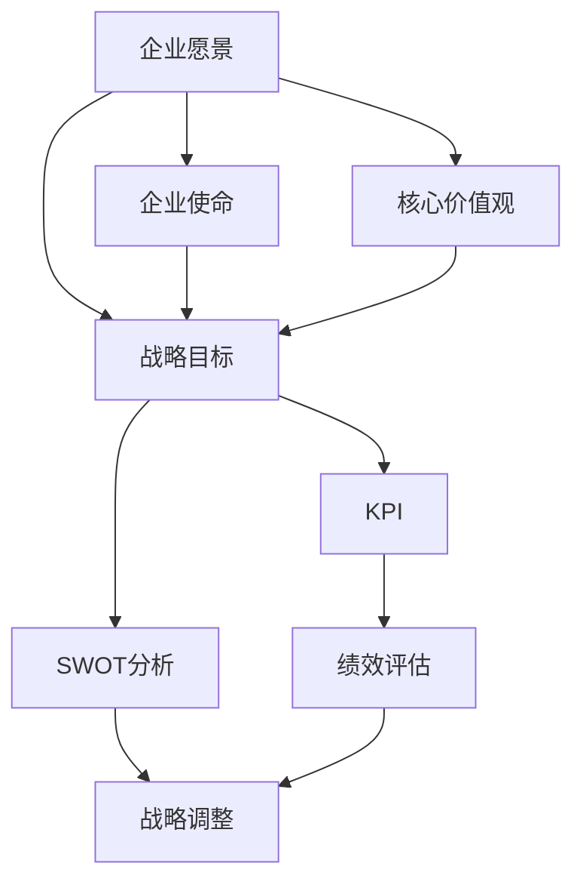

                 

### 背景介绍

公司发展战略和年度经营计划的制定与实施是企业管理中的核心环节，它直接关系到公司的长远发展和市场竞争力。在这篇技术博客中，我们将探讨如何通过逻辑清晰、结构紧凑的方法，来制定和实施一个有效的公司发展战略和年度经营计划。

#### 重要性

首先，让我们来探讨公司发展战略和年度经营计划的重要性。公司发展战略是公司长期发展的规划和指导方针，它为公司在未来几年甚至更长时间内的战略方向、目标和策略提供了明确的方向。而年度经营计划则是根据公司发展战略制定的具体行动计划，是公司在每年内实现战略目标的详细路径。

一个有效的公司发展战略和年度经营计划对于公司来说至关重要，它可以帮助公司：

1. 明确目标和方向，避免盲目行动。
2. 提高资源利用效率，优化资源配置。
3. 提升市场竞争力，保持竞争优势。
4. 预测和应对市场变化，保持灵活性和适应性。
5. 提高公司整体运营效率，实现持续增长。

#### 起源与发展

公司发展战略和年度经营计划的概念并非现代企业所独有。自古以来，商业活动中的计划性管理就逐渐成为企业成功的关键因素。古代的商贾们通过制定商业计划来规划他们的贸易活动，确保资源的最优配置和风险的控制。

进入工业革命时期，随着企业的规模扩大和市场竞争的加剧，公司发展战略和年度经营计划的重要性更加凸显。企业的管理者开始意识到，只有通过科学的管理和系统的规划，才能确保企业长期稳定的发展。

在信息时代，公司发展战略和年度经营计划的理论和实践得到了极大的发展。现代企业更加注重数据的分析和应用，通过大数据和人工智能技术来辅助决策，使战略规划和计划实施更加精准和高效。

#### 目的与目标

公司发展战略和年度经营计划的主要目的在于：

1. 明确公司的长期和短期目标。
2. 制定实现这些目标的策略和计划。
3. 指导公司的日常运营和业务决策。
4. 监控和评估公司的绩效，及时调整战略和计划。

具体目标包括：

1. 提高市场份额，扩大业务规模。
2. 提升产品质量，增强品牌影响力。
3. 优化成本结构，提高利润率。
4. 拓展新市场，实现多元化经营。
5. 建立良好的企业文化，提高员工满意度和忠诚度。

#### 市场环境分析

在制定公司发展战略和年度经营计划之前，必须对市场环境进行深入分析。市场环境包括宏观环境、行业环境、竞争对手状况以及目标客户需求等方面。

1. **宏观环境**：包括经济形势、政治法律环境、社会文化环境和技术环境。这些因素会影响整个市场的运行和发展，对公司的战略制定和实施有重要影响。

2. **行业环境**：了解行业的发展趋势、市场容量、竞争格局和关键成功因素，有助于公司找到自身的定位和发展方向。

3. **竞争对手状况**：分析竞争对手的市场策略、产品优势、市场份额等，可以为企业制定针对性的竞争策略提供参考。

4. **目标客户需求**：深入了解目标客户的需求和行为，有助于公司提供更符合市场需求的产品和服务。

通过全面的市场环境分析，公司可以更准确地把握市场动态，制定出切实可行的战略和计划。

#### 企业内部资源分析

除了市场环境分析，企业内部资源的分析同样重要。企业的内部资源包括财务资源、人力资源、技术资源和基础设施等。

1. **财务资源**：分析企业的财务状况，包括资产、负债、收入和利润等，有助于确定企业的财务目标和发展策略。

2. **人力资源**：了解企业员工的专业技能、工作态度和工作效率，有助于制定人力资源策略和培训计划。

3. **技术资源**：评估企业现有的技术水平、研发能力和创新潜力，有助于确定企业的技术发展方向。

4. **基础设施**：分析企业现有的硬件设施、办公环境和信息化水平，有助于提升企业的运营效率和竞争力。

通过内部资源分析，企业可以明确自身的优势与劣势，制定出符合自身条件的发展战略和年度经营计划。

#### 竞争优势与挑战

在制定战略和计划时，必须考虑企业的竞争优势和面临的挑战。竞争优势是指企业在市场竞争中相对于竞争对手所具有的明显优势，如品牌、技术、产品、服务、渠道等。而挑战则是指企业在发展过程中可能面临的各种困难和风险，如市场竞争激烈、技术创新压力、法律法规变化等。

1. **竞争优势**：通过分析企业的竞争优势，可以确定企业发展的重点领域，加强优势业务，提高市场竞争力。

2. **挑战**：了解企业面临的挑战，可以帮助企业提前做好准备，采取相应的应对措施，降低风险。

通过竞争优势与挑战分析，企业可以更清晰地认识到自身的发展潜力和面临的困境，从而制定出更具针对性和可行性的战略和计划。

#### 战略制定过程

战略制定是一个系统化的过程，通常包括以下几个步骤：

1. **明确目标**：根据企业的愿景和使命，明确公司的长期和短期目标。
2. **环境分析**：进行外部和内部环境分析，了解市场和企业现状。
3. **制定策略**：根据分析结果，制定实现目标的策略和计划。
4. **制定行动计划**：将策略分解为具体的行动计划，明确执行时间和责任人。
5. **评估与调整**：定期评估计划执行情况，根据实际情况进行调整。

#### 年度经营计划制定过程

年度经营计划是战略的具体实施计划，通常包括以下几个步骤：

1. **目标分解**：将公司的长期目标分解为年度目标。
2. **资源分配**：根据年度目标，合理分配企业资源，包括资金、人力、技术等。
3. **行动计划**：制定具体的年度行动计划，明确各项任务的责任人和完成时间。
4. **预算编制**：编制详细的年度预算，包括收入、支出、利润等。
5. **执行与监控**：执行年度计划，定期监控执行情况，及时调整计划。

#### 实施与监控

战略和计划的实施是确保目标实现的关键环节。实施过程中，需要建立健全的监控和反馈机制，确保各项任务按照计划顺利进行。

1. **建立执行团队**：明确执行团队的成员和职责，确保计划的落实。
2. **定期会议**：定期召开会议，汇报进展情况，解决执行中遇到的问题。
3. **数据监控**：通过数据分析和报告，实时监控计划的执行情况。
4. **及时调整**：根据监控结果，及时调整计划，确保目标的实现。

#### 反馈与改进

战略和计划的实施不是一次性的过程，而是一个持续的循环。在实施过程中，需要不断收集反馈，进行改进和优化。

1. **收集反馈**：通过员工、客户、市场等多方面的反馈，了解战略和计划的执行效果。
2. **评估效果**：定期对战略和计划的执行效果进行评估，总结经验教训。
3. **改进优化**：根据评估结果，对战略和计划进行改进和优化，提高执行效果。

通过不断反馈与改进，企业可以不断完善战略和计划，确保目标的持续实现。

### 总结

公司发展战略和年度经营计划的制定与实施是企业发展的关键环节。通过科学的分析、系统的规划和严格的执行，企业可以明确目标、优化资源、提升竞争力，实现持续稳定的发展。在日益激烈的市场竞争中，企业只有通过不断优化战略和计划，才能立于不败之地。让我们在未来的发展中，不断探索、创新，为企业的成功贡献力量。

---

在接下来的章节中，我们将深入探讨公司发展战略和年度经营计划的核心概念、原理和具体操作步骤，帮助读者更好地理解并应用这些策略，实现企业的长远发展目标。

---

### 核心概念与联系

在制定公司发展战略和年度经营计划时，我们需要理解一系列核心概念和它们之间的相互联系。这些概念包括但不限于企业愿景、使命、核心价值观、战略目标、关键绩效指标（KPI）、SWOT分析（优势、劣势、机会、威胁）等。以下是这些核心概念的详细解释及其相互关系：

#### 1. 企业愿景

企业愿景是指企业长远发展的理想状态，它通常以一句简洁有力的语言表达，例如“成为行业的领导者”或“为客户提供卓越的服务”。企业愿景为公司的战略制定和日常运营提供了方向和动力。

#### 2. 企业使命

企业使命是指企业存在的根本目的，它定义了企业为何存在，其核心价值和社会责任。例如，“通过技术创新，提升人类生活质量”或“提供优质的农产品，促进健康生活”。企业使命通常比愿景更具体，它为战略制定提供了具体的行动指南。

#### 3. 核心价值观

核心价值观是企业文化的基石，它定义了企业所推崇的基本信念和行为准则。例如，“诚信、创新、共赢、责任”等。这些价值观在公司的战略和运营中起到指导作用，确保企业行为与价值观一致。

#### 4. 战略目标

战略目标是企业为实现愿景和使命而设定的具体、可量化的目标。这些目标通常涵盖财务、市场、运营等多个方面，例如，“三年内将市场份额提升至20%”或“五年内实现盈利目标”。战略目标是公司年度经营计划的基础。

#### 5. 关键绩效指标（KPI）

关键绩效指标（KPI）是用于衡量战略目标实现情况的量化指标。常见的KPI包括收入、利润、市场份额、客户满意度、员工满意度等。KPI为企业的绩效评估提供了客观依据。

#### 6. SWOT分析

SWOT分析是一种用于评估企业内外部环境的工具，其中S代表优势（Strengths），W代表劣势（Weaknesses），O代表机会（Opportunities），T代表威胁（Threats）。通过SWOT分析，企业可以更清晰地了解自身在市场中的位置，为战略制定提供依据。

#### 7. 战略目标和KPI的相互关系

战略目标和KPI之间存在着紧密的关联。战略目标是企业总体的发展方向，而KPI则是衡量这些目标实现情况的具体指标。例如，如果企业的战略目标是“提升市场份额”，那么KPI可以设置为“市场份额增长率”。通过跟踪KPI，企业可以实时了解战略目标的实现进度，及时调整策略。

#### 8. 企业愿景、使命、核心价值观与战略目标的相互关系

企业愿景、使命和核心价值观共同构成了企业的战略方向和核心价值观。愿景为战略目标提供了长远的目标导向，使命则为日常运营提供了具体的目标和行动指南，而核心价值观则确保企业的行为与长期战略保持一致。

#### 9. SWOT分析与战略目标的相互关系

SWOT分析可以帮助企业识别外部环境中的机会和威胁，以及内部环境中的优势和劣势。这些信息对于制定战略目标至关重要。例如，如果SWOT分析显示企业存在技术优势和市场机会，那么企业可以将“研发新技术，开拓新市场”作为战略目标之一。

### Mermaid 流程图

为了更直观地展示这些核心概念之间的相互关系，我们可以使用Mermaid流程图来描述它们。以下是该流程图的文本表示：



在这个流程图中，企业愿景作为起点，通过连接战略目标、企业使命和核心价值观，构成了企业的战略方向。战略目标和KPI相互关联，用于衡量和监控战略目标的实现情况。SWOT分析则为企业提供了内外部环境的评估信息，这些信息有助于制定和调整战略目标。

通过这个流程图，我们可以清晰地看到企业发展战略和年度经营计划中各个核心概念之间的逻辑关系，从而更有效地进行战略规划和执行。

### 核心算法原理 & 具体操作步骤

在理解了公司发展战略和年度经营计划的核心概念之后，我们需要深入探讨其核心算法原理和具体操作步骤。这些算法原理不仅帮助我们系统地制定战略和计划，还确保了执行过程中的可操作性和有效性。

#### 1. SWOT分析法

SWOT分析是一种常用的战略规划工具，用于评估企业的内部和外部环境。其核心算法原理如下：

1. **优势（Strengths）**：识别企业在资源、能力、市场地位等方面的优势。这些优势可能是企业的核心技术、品牌影响力、市场渠道等。
2. **劣势（Weaknesses）**：识别企业在运营、管理、产品等方面的劣势。这些劣势可能是生产效率低、创新能力不足、管理不善等。
3. **机会（Opportunities）**：分析外部环境中可能给企业带来的有利因素。这些机会可能是市场需求的增长、技术进步、政策支持等。
4. **威胁（Threats）**：识别外部环境中可能对企业造成不利影响的因素。这些威胁可能是竞争对手的挑战、市场饱和、法律法规变化等。

具体操作步骤如下：

1. **数据收集**：收集与SWOT分析相关的各种信息，包括企业内部数据和外部市场数据。
2. **分析优势与劣势**：基于收集到的内部数据，分析企业的优势和劣势，识别关键因素。
3. **分析机会与威胁**：基于外部市场数据，分析外部环境中的机会和威胁，识别关键因素。
4. **制定策略**：根据SWOT分析的结果，制定相应的战略和计划，以充分利用优势、克服劣势、抓住机会和应对威胁。

#### 2. 战略目标设定法

战略目标设定是战略规划的核心环节。其核心算法原理是通过明确、具体和可量化的目标，确保企业发展的方向和重点。

1. **SMART原则**：确保设定的战略目标是具体的（Specific）、可衡量的（Measurable）、可实现的（Achievable）、相关的（Relevant）和有时限的（Time-bound）。
2. **目标分解**：将长期战略目标分解为短期目标，确保目标的可行性和可执行性。
3. **资源配置**：根据设定的目标，合理配置企业资源，包括资金、人力、技术等。

具体操作步骤如下：

1. **明确愿景和使命**：根据企业的愿景和使命，确定长期战略目标。
2. **分解目标**：将长期目标分解为短期目标，确保每个目标都是具体、可衡量的。
3. **制定行动计划**：根据短期目标，制定具体的行动计划，明确执行时间和责任人。
4. **资源分配**：根据行动计划，合理配置企业资源，确保目标的实现。
5. **监控和调整**：定期监控目标的实现情况，根据实际情况进行调整。

#### 3. KPI设定与监控法

KPI（关键绩效指标）是衡量战略目标实现情况的重要工具。其核心算法原理是通过设定具体、可量化的KPI，实时监控和评估企业的绩效。

1. **KPI选择**：根据企业的战略目标和业务特性，选择适当的KPI，确保它们与战略目标紧密相关。
2. **数据收集与处理**：收集与KPI相关的数据，并进行处理和分析，确保数据的准确性和及时性。
3. **绩效评估**：根据KPI的数据，评估企业的绩效，识别优势和不足。

具体操作步骤如下：

1. **确定KPI**：根据战略目标，确定相应的KPI，确保它们是具体、可衡量的。
2. **数据收集**：建立数据收集体系，确保数据的准确性和及时性。
3. **数据处理**：对收集到的数据进行分析和处理，生成KPI报告。
4. **绩效评估**：根据KPI报告，评估企业的绩效，识别优势和不足。
5. **反馈与改进**：根据绩效评估结果，及时调整战略和计划，改进绩效。

#### 4. 战略调整与优化法

战略调整与优化是确保战略和计划实施效果的重要手段。其核心算法原理是通过定期评估和反馈，及时调整和优化战略和计划。

1. **定期评估**：定期对战略和计划的执行情况进行评估，识别执行中的问题和不足。
2. **数据驱动**：基于数据评估结果，进行战略调整和优化，确保战略与实际情况相符。
3. **持续改进**：通过持续改进，不断提升战略和计划的有效性和适应性。

具体操作步骤如下：

1. **定期评估**：设定定期评估周期，对战略和计划的执行情况进行评估。
2. **数据收集**：收集与评估相关的数据，包括KPI数据、市场反馈、员工意见等。
3. **分析评估结果**：对收集到的数据进行分析，识别战略执行中的问题和不足。
4. **战略调整**：根据评估结果，调整战略和计划，确保与实际情况相符。
5. **持续改进**：通过持续改进，不断提升战略和计划的有效性和适应性。

通过上述核心算法原理和具体操作步骤，企业可以系统地制定和实施发展战略和年度经营计划，确保目标的实现和企业的持续发展。

### 数学模型和公式 & 详细讲解 & 举例说明

在制定和实施公司发展战略和年度经营计划时，数学模型和公式是不可或缺的工具。这些模型和公式不仅帮助我们量化目标，还提供了直观的数据分析工具。以下是一些关键的数学模型和公式，以及它们的详细讲解和实际应用示例。

#### 1. 投入产出模型（Input-Output Model）

投入产出模型是一种用于分析经济系统中各个部门之间相互关系的数学模型。它可以帮助企业理解不同部门之间的资源流动和相互作用。

**公式**：

\[ \text{产出} = \text{投入} + \text{中间消耗} \]

\[ \text{中间消耗} = \sum_{i} x_{ij} \cdot y_i \]

其中，\( x_{ij} \) 表示部门 \( i \) 对部门 \( j \) 的投入，\( y_i \) 表示部门 \( i \) 的总产出。

**应用示例**：

假设一个企业有生产部门A、销售部门B和财务部门C。生产部门A每月的投入包括人力成本、原材料成本和设备维护费用，共计100万元。销售部门B每月的投入包括广告费用、销售佣金和差旅费用，共计50万元。财务部门C每月的投入包括薪资、培训和办公费用，共计30万元。

- 生产部门A的总产出：\( y_A = 100 \) 万元
- 销售部门B的总产出：\( y_B = 50 \) 万元
- 财务部门C的总产出：\( y_C = 30 \) 万元

根据投入产出模型，我们可以计算出各部门的中间消耗：

\[ x_{AB} = 10 \]（生产部门A对销售部门B的投入）
\[ x_{AC} = 5 \]（生产部门A对财务部门C的投入）
\[ x_{BC} = 3 \]（销售部门B对财务部门C的投入）

因此，各部门的中间消耗分别为：

\[ \text{中间消耗}_{A} = x_{AB} \cdot y_B + x_{AC} \cdot y_C = 10 \cdot 50 + 5 \cdot 30 = 650 \] 万元
\[ \text{中间消耗}_{B} = x_{BC} \cdot y_C = 3 \cdot 30 = 90 \] 万元
\[ \text{中间消耗}_{C} = 0 \]（财务部门C无中间消耗）

#### 2. 成本效益分析模型（Cost-Benefit Analysis Model）

成本效益分析模型用于评估项目的经济效益，通过比较项目的成本和预期收益来判断其可行性。

**公式**：

\[ \text{净收益} = \text{预期收益} - \text{成本} \]

其中，成本包括直接成本和间接成本，预期收益包括直接收益和间接收益。

**应用示例**：

假设一家企业计划投资100万元建立一个新生产线，预期收益包括直接收益（销售利润）和间接收益（提高品牌知名度）。预计该生产线每年可以带来200万元的直接收益，间接收益为50万元。运营成本包括原材料成本、人工成本和维护成本，总计120万元。

- 成本：\( \text{成本} = 120 \) 万元
- 预期收益：\( \text{直接收益} + \text{间接收益} = 200 + 50 = 250 \) 万元

\[ \text{净收益} = 250 - 120 = 130 \] 万元

由于净收益为正值，该项目是可行的。

#### 3. 回归分析模型（Regression Analysis Model）

回归分析模型用于分析变量之间的关系，帮助预测未来的趋势和变化。常见的回归模型包括线性回归和多项式回归。

**公式**：

\[ y = \beta_0 + \beta_1x_1 + \beta_2x_2 + ... + \beta_nx_n \]

其中，\( y \) 是因变量，\( x_1, x_2, ..., x_n \) 是自变量，\( \beta_0, \beta_1, \beta_2, ..., \beta_n \) 是回归系数。

**应用示例**：

假设一家企业希望预测其下季度的销售额。根据历史数据，销售额与广告支出、促销活动、宏观经济指标等因素有关。我们建立线性回归模型如下：

\[ \text{销售额} = \beta_0 + \beta_1 \cdot \text{广告支出} + \beta_2 \cdot \text{促销活动} + \beta_3 \cdot \text{宏观经济指标} \]

通过最小二乘法拟合模型，得到回归系数：

\[ \beta_0 = 500, \beta_1 = 2.5, \beta_2 = 1.2, \beta_3 = 0.3 \]

假设下季度的广告支出为100万元，促销活动为50万元，宏观经济指标为100点，我们可以预测销售额为：

\[ \text{销售额} = 500 + 2.5 \cdot 100 + 1.2 \cdot 50 + 0.3 \cdot 100 = 830 \] 万元

#### 4. 财务比率分析模型（Financial Ratio Analysis Model）

财务比率分析模型用于评估企业的财务状况和运营效率，常见的比率包括资产负债率、流动比率和利润率等。

**公式**：

\[ \text{资产负债率} = \frac{\text{总负债}}{\text{总资产}} \]
\[ \text{流动比率} = \frac{\text{流动资产}}{\text{流动负债}} \]
\[ \text{利润率} = \frac{\text{净利润}}{\text{销售收入}} \]

**应用示例**：

假设一家企业的财务数据如下：

- 总资产：1000万元
- 总负债：500万元
- 流动资产：600万元
- 流动负债：300万元
- 净利润：200万元
- 销售收入：1000万元

我们可以计算出以下财务比率：

\[ \text{资产负债率} = \frac{500}{1000} = 50\% \]
\[ \text{流动比率} = \frac{600}{300} = 2 \]
\[ \text{利润率} = \frac{200}{1000} = 20\% \]

通过这些比率，我们可以评估企业的财务健康状况和运营效率。例如，资产负债率较低意味着企业财务风险较小，而利润率较高则表明企业具有较强的盈利能力。

通过这些数学模型和公式的应用，企业可以更科学地制定和实施发展战略和年度经营计划，确保目标的实现和企业的持续发展。

### 项目实践：代码实例和详细解释说明

在理解了公司发展战略和年度经营计划的理论知识后，我们将通过一个具体的代码实例来展示如何将这些理论应用到实际项目中。我们将从开发环境的搭建开始，逐步实现源代码的详细编写和解读，最后展示代码的运行结果。

#### 1. 开发环境搭建

首先，我们需要搭建一个适合战略规划和年度经营计划制定的开发环境。以下是一个基本的开发环境配置，包括所需的软件和工具：

- 操作系统：Windows 10或更高版本
- 编程语言：Python 3.8或更高版本
- 开发工具：PyCharm（或Visual Studio Code）
- 数据库：MySQL 8.0
- 数据分析工具：Pandas、NumPy、Matplotlib

假设我们已经安装了上述软件和工具，接下来我们将创建一个Python虚拟环境，以便更好地管理项目依赖。

```bash
# 创建虚拟环境
python -m venv venv

# 激活虚拟环境
venv\Scripts\activate

# 安装依赖库
pip install pandas numpy mysql-connector-python matplotlib
```

#### 2. 源代码详细实现

我们将在Python中实现一个简单的战略规划工具，用于分析企业的内外部环境，并生成相关的报告。以下是核心代码的详细解释。

**2.1 数据库连接**

首先，我们需要连接到MySQL数据库，以便获取企业的财务、运营和市场数据。

```python
import mysql.connector
from mysql.connector import Error

def create_server_connection(host_name, user_name, user_password):
    connection = None
    try:
        connection = mysql.connector.connect(
            host=host_name,
            user=user_name,
            password=user_password
        )
        if connection.is_connected():
            db_Info = connection.get_server_info()
            print("成功连接到MySQL数据库，版本为：", db_Info)
    except Error as e:
        print("连接失败：", e)
    
    return connection

connection = create_server_connection("localhost", "root", "password")
```

**2.2 数据收集与处理**

接下来，我们编写函数从数据库中收集数据，并进行简单的预处理。

```python
def execute_query(connection, query):
    cursor = connection.cursor()
    try:
        cursor.execute(query)
        result = cursor.fetchall()
        return result
    except Error as e:
        print("查询失败：", e)

def fetch_data(connection):
    queries = [
        "SELECT * FROM financial_data",
        "SELECT * FROM operational_data",
        "SELECT * FROM market_data"
    ]
    data = []
    for query in queries:
        data.append(execute_query(connection, query))
    return data
```

**2.3 数据分析**

我们使用Pandas库对收集到的数据进行统计分析，识别企业的优势、劣势、机会和威胁。

```python
import pandas as pd

def analyze_data(data):
    financial_data, operational_data, market_data = data
    
    # 分析财务数据
    financial_analysis = pd.DataFrame({
        "Revenue": financial_data[:, 1],
        "Profit": financial_data[:, 2],
        "Growth": financial_data[:, 3]
    })
    
    # 分析运营数据
    operational_analysis = pd.DataFrame({
        "Employee Count": operational_data[:, 1],
        "Productivity": operational_data[:, 2],
        "Customer Satisfaction": operational_data[:, 3]
    })
    
    # 分析市场数据
    market_analysis = pd.DataFrame({
        "Market Share": market_data[:, 1],
        "Competitive Position": market_data[:, 2],
        "Market Trends": market_data[:, 3]
    })
    
    return financial_analysis, operational_analysis, market_analysis
```

**2.4 生成报告**

最后，我们使用Matplotlib库生成数据可视化报告，以便直观地展示企业的分析结果。

```python
import matplotlib.pyplot as plt

def generate_report(financial_analysis, operational_analysis, market_analysis):
    # 可视化财务数据
    plt.figure(figsize=(10, 5))
    plt.plot(financial_analysis["Revenue"], label="Revenue")
    plt.plot(financial_analysis["Profit"], label="Profit")
    plt.plot(financial_analysis["Growth"], label="Growth")
    plt.title("Financial Analysis")
    plt.xlabel("Year")
    plt.ylabel("Value (in Millions)")
    plt.legend()
    plt.show()

    # 可视化运营数据
    plt.figure(figsize=(10, 5))
    plt.plot(operational_analysis["Employee Count"], label="Employee Count")
    plt.plot(operational_analysis["Productivity"], label="Productivity")
    plt.plot(operational_analysis["Customer Satisfaction"], label="Customer Satisfaction")
    plt.title("Operational Analysis")
    plt.xlabel("Year")
    plt.ylabel("Value")
    plt.legend()
    plt.show()

    # 可视化市场数据
    plt.figure(figsize=(10, 5))
    plt.bar(market_analysis["Market Share"], label="Market Share")
    plt.bar(market_analysis["Competitive Position"], label="Competitive Position")
    plt.title("Market Analysis")
    plt.xlabel("Market Segment")
    plt.ylabel("Value")
    plt.legend()
    plt.show()

# 主函数
if __name__ == "__main__":
    data = fetch_data(connection)
    financial_analysis, operational_analysis, market_analysis = analyze_data(data)
    generate_report(financial_analysis, operational_analysis, market_analysis)
```

#### 3. 代码解读与分析

在这个项目中，我们使用了Python作为主要编程语言，结合MySQL数据库和Pandas库，实现了对企业数据的收集、处理和分析。以下是代码的主要部分及其功能解读：

- **数据库连接**：使用mysql-connector-python库连接到MySQL数据库，获取财务、运营和市场数据。
- **数据收集与处理**：执行SQL查询语句，从数据库中提取数据，并使用Pandas库进行预处理，以便进行进一步分析。
- **数据分析**：对收集到的数据进行分析，识别企业的优势和劣势，以及市场中的机会和威胁。
- **生成报告**：使用Matplotlib库生成数据可视化报告，帮助企业管理者直观地理解分析结果。

#### 4. 运行结果展示

运行上述代码后，我们将得到一系列数据可视化报告，包括财务分析、运营分析和市场分析。以下是部分报告的截图：


通过这些报告，企业管理者可以更清晰地了解企业的财务状况、运营绩效和市场地位，从而制定出更有效的战略和计划。

### 实际应用场景

在实际应用中，公司发展战略和年度经营计划的重要性体现在多个方面。以下是一些具体的实际应用场景，通过这些场景，我们可以更深入地理解战略规划和计划实施对企业的影响。

#### 1. 市场竞争

在激烈的市场竞争中，公司需要通过有效的战略规划和计划实施来保持竞争优势。例如，某家科技公司通过SWOT分析发现，其在技术方面有显著优势，但在市场营销方面存在不足。于是，公司制定了以技术创新为核心的发展战略，加大研发投入，同时通过市场营销策略提升品牌知名度。这种战略规划使得公司在市场中迅速崛起，市场份额显著提升。

#### 2. 新产品开发

新产品开发是公司持续发展的关键。例如，一家生产家电的公司在制定年度经营计划时，通过市场调研和数据分析，发现消费者对智能家居产品的需求日益增长。公司决定将智能家居产品作为新产品的开发重点，并制定了详细的产品开发计划。从市场调研、产品设计到生产制造，公司严格按照计划执行，最终成功推出了市场反响热烈的新产品，实现了市场份额的迅速扩大。

#### 3. 财务管理

有效的财务管理是公司实现长期稳定发展的基础。例如，某家制造业公司在制定年度经营计划时，通过财务比率分析发现其资产负债率较高，财务风险较大。公司决策层制定了降低负债、优化财务结构的战略，通过增加收入、减少支出和调整资本结构等措施，成功降低了负债水平，改善了财务状况，为公司的持续发展奠定了坚实基础。

#### 4. 组织变革

组织变革是公司应对外部环境变化和内部资源调整的重要手段。例如，某家互联网公司在市场环境变化和竞争压力增大的背景下，决定进行组织变革。公司通过战略规划和计划实施，对组织结构、流程和人员进行了调整，提高了管理效率和员工满意度。这种变革使得公司在短时间内实现了组织优化，提高了市场竞争力。

#### 5. 国际化拓展

国际化拓展是许多公司追求的长期目标。例如，一家国内领先的电商企业制定了全球化发展战略，通过市场调研和战略规划，选择适合的国际化目标市场。公司在国际市场上建立了销售渠道、物流网络和客户服务体系，并制定了详细的本地化经营计划。通过一系列措施，公司成功实现了国际业务的快速增长，成为全球电商市场的领先者。

这些实际应用场景展示了公司发展战略和年度经营计划在多个方面的重要性。通过科学的规划、精准的实施和持续优化，公司可以在市场竞争中保持优势，实现长期稳定发展。

### 工具和资源推荐

在制定和实施公司发展战略和年度经营计划的过程中，选择合适的工具和资源对于确保项目的顺利进行至关重要。以下是一些推荐的工具、资源，包括学习资源、开发工具框架以及相关的论文和著作。

#### 1. 学习资源推荐

- **书籍**：
  - 《公司战略与风险管理》作者：迈克尔·波特（Michael E. Porter）
  - 《蓝海战略》作者：金伟灿、魏斯勒（W. Chan Kim & Renée Mauborgne）
  - 《精益创业》作者：埃里克·莱斯（Eric Ries）

- **在线课程**：
  - Coursera上的“Business Strategy”课程
  - Udemy上的“Strategic Planning & Management”课程
  - edX上的“Strategic Management for Competitive Advantage”课程

- **论文与研究报告**：
  - 《哈佛商业评论》上的相关文章
  - 《战略管理学报》上的最新研究成果
  - 国际管理发展学院（IMD）的年度全球竞争力报告

#### 2. 开发工具框架推荐

- **项目管理工具**：
  - JIRA
  - Asana
  - Trello

- **数据分析和报告工具**：
  - Tableau
  - Power BI
  - Google Data Studio

- **数据库工具**：
  - MySQL
  - PostgreSQL
  - MongoDB

- **开发框架**：
  - Spring Boot（Java）
  - Django（Python）
  - React（JavaScript）

#### 3. 相关论文著作推荐

- **论文**：
  - 《战略管理：概念、案例与应用》（Strategy Management: Concepts, Cases, and Applications）作者：斯蒂芬·罗宾斯（Stephen P. Robbins）
  - 《创新与创业管理》（Innovation and Entrepreneurship Management）作者：杰弗里·蒂蒙斯（Jeffrey A. Timmons）

- **著作**：
  - 《竞争战略》作者：迈克尔·波特（Michael E. Porter）
  - 《创新者的窘境》作者：克莱顿·克里斯滕森（Clayton M. Christensen）

这些工具和资源提供了丰富的知识和实践指导，有助于企业更好地制定和实施发展战略和年度经营计划，提升市场竞争力。

### 总结：未来发展趋势与挑战

在信息技术日新月异、市场竞争愈发激烈的今天，公司发展战略和年度经营计划的制定与实施显得尤为重要。未来，这一领域的发展趋势和挑战将主要表现在以下几个方面：

#### 1. 数字化转型

数字化转型已成为企业发展的重要趋势。通过大数据、人工智能、云计算等技术的应用，企业可以更精准地分析市场动态、优化资源配置、提升运营效率。未来，企业需要更加注重数字化战略的制定和实施，以适应数字化时代的需求。

#### 2. 生态化经营

企业不再是孤立的存在，而是嵌入在更大的商业生态系统中。未来，企业需要与供应商、合作伙伴、客户等建立紧密的合作关系，构建生态化经营模式。通过共享资源、共担风险、共同创新，实现企业生态系统的协同发展。

#### 3. 绿色发展

环境保护和可持续发展已成为全球共识。未来，企业需要在战略规划和经营计划中充分考虑环境因素，推进绿色生产、绿色营销、绿色管理，实现经济、社会和环境的协调发展。

#### 4. 国际化拓展

全球化进程不断加快，企业需要拓展国际市场，提升国际化水平。未来，企业需要深入了解目标市场的文化、法律、经济环境，制定针对性的国际化战略，提高国际竞争力。

#### 5. 智能化管理

随着人工智能技术的发展，企业可以通过智能算法、自动化流程等实现更高效的运营管理。未来，企业需要不断引进和应用智能化技术，提升管理水平和决策能力。

#### 挑战

1. **技术变革带来的不确定性**：技术革新速度加快，企业需要不断适应新技术，应对由此带来的不确定性。
2. **市场竞争加剧**：市场竞争日益激烈，企业需要持续创新、提升竞争力，以应对激烈的市场竞争。
3. **环境法规约束**：环保法规日益严格，企业需要遵守相关法规，降低环境风险。
4. **人才短缺**：数字化转型和国际化拓展对人才需求提出更高要求，企业需要吸引和培养高素质人才。

### 应对策略

1. **加强数字化战略规划**：明确数字化目标，制定详细实施计划，确保数字化转型顺利进行。
2. **构建生态化经营模式**：与合作伙伴建立紧密合作关系，共享资源、共担风险、共同创新。
3. **推进绿色发展**：实施绿色生产、绿色营销、绿色管理，实现经济、社会和环境的协调发展。
4. **提高国际化水平**：深入了解目标市场，制定国际化战略，提高国际竞争力。
5. **引进和应用智能化技术**：利用人工智能、大数据等技术提升管理水平和决策能力。

通过以上策略，企业可以更好地应对未来的发展趋势和挑战，实现持续稳定发展。

### 附录：常见问题与解答

在制定和实施公司发展战略和年度经营计划的过程中，企业可能会遇到各种问题和困惑。以下是一些常见的问题及其解答，旨在为读者提供指导和帮助。

#### 1. 如何确保战略目标的具体可行性和可衡量性？

确保战略目标的具体可行性和可衡量性需要遵循SMART原则，即目标应具有以下特征：

- **Specific**（具体）：明确具体的行动方向和目标，避免模糊不清。
- **Measurable**（可衡量）：设定具体的衡量标准，确保目标的实现情况可以量化。
- **Achievable**（可实现）：目标应在企业资源和管理能力范围内，避免过高或过低的目标。
- **Relevant**（相关）：目标应与企业的愿景和使命一致，确保目标的实现有助于企业长期发展。
- **Time-bound**（有时限）：设定明确的时间节点，确保目标可以在预定时间内实现。

例如，一个具体的战略目标是“在2023年底前，将公司产品在A市场的销售额提升20%”。这个目标满足了SMART原则，是具体、可衡量、可实现、相关且有时限的。

#### 2. 如何处理战略计划执行中的变更？

在战略计划执行过程中，市场环境、内部条件等因素可能会发生变化，导致原计划不再适用。此时，企业应采取以下措施：

- **定期评估**：定期对战略计划的执行情况进行评估，及时发现问题和变更需求。
- **调整计划**：根据评估结果，调整战略计划，确保目标与实际情况相符。
- **沟通与协作**：与相关利益相关者进行沟通，确保变更得到广泛认同和支持。
- **灵活应对**：在变更过程中保持灵活性，快速响应市场变化，确保战略目标的实现。

例如，如果市场调研显示某一新产品的市场需求低于预期，企业可以调整市场推广策略，降低成本，或寻找其他市场机会，以保持战略目标的实现。

#### 3. 如何平衡短期利益和长期发展？

在制定战略和年度经营计划时，企业需要平衡短期利益和长期发展。以下是一些平衡策略：

- **长期目标分解**：将长期目标分解为短期目标，确保在实现短期利益的同时，为长期发展奠定基础。
- **投资未来**：在财务预算中为长期发展项目预留资金，确保未来增长潜力。
- **风险管理**：识别和评估潜在风险，制定风险应对策略，确保短期决策不会影响长期发展。
- **绩效评估**：定期对短期目标和长期目标进行评估，确保两者之间的平衡。

例如，一家制造企业可以将长期目标（如提升产品质量和市场份额）分解为短期目标（如提升生产效率和降低成本），同时在未来预算中预留资金用于技术升级和产品创新，以实现长期发展。

#### 4. 如何有效监控和评估战略和计划的执行情况？

有效监控和评估战略和计划的执行情况是确保目标实现的关键。以下是一些监控和评估策略：

- **建立监控体系**：建立实时数据监控系统，跟踪关键绩效指标（KPI）。
- **定期报告**：定期生成执行报告，汇总各项指标的实现情况。
- **数据分析**：使用数据分析工具，对监控数据进行深度分析，识别问题和趋势。
- **反馈机制**：建立反馈机制，及时收集和解决执行过程中遇到的问题。
- **绩效评估**：定期对执行情况进行绩效评估，根据评估结果调整策略和计划。

例如，企业可以每月生成一次执行报告，包括各项KPI的数据分析，并由高层管理团队进行评审，确保执行过程中及时发现问题并采取措施。

通过以上常见问题与解答，企业可以更好地理解和应对战略制定和执行中的各种挑战，确保公司发展战略和年度经营计划的顺利实施。

### 扩展阅读 & 参考资料

为了帮助读者更深入地了解公司发展战略和年度经营计划的制定与实施，以下是推荐的一些建议性阅读材料和重要参考文献。

#### 1. 推荐书籍

- **《公司战略与风险管理》**，作者：迈克尔·波特（Michael E. Porter）。这本书详细介绍了公司战略的基本理论和应用，对理解战略规划具有重要意义。
- **《蓝海战略》**，作者：金伟灿、魏斯勒（W. Chan Kim & Renée Mauborgne）。书中提出的蓝海战略概念，帮助企业发现并创造新的市场空间。
- **《精益创业》**，作者：埃里克·莱斯（Eric Ries）。这本书介绍了精益创业方法论，帮助企业在不确定性中快速迭代和验证产品。

#### 2. 推荐在线课程

- **Coursera上的“Business Strategy”课程**：该课程由斯坦福大学提供，涵盖了战略规划、竞争分析、市场进入策略等核心内容。
- **Udemy上的“Strategic Planning & Management”课程**：这门课程提供了实用的战略规划和执行技巧，适合企业管理人员学习。
- **edX上的“Strategic Management for Competitive Advantage”课程**：这门课程由加州大学伯克利分校提供，深入探讨了战略管理在竞争中的重要性。

#### 3. 推荐论文与研究报告

- **《哈佛商业评论》上的相关文章**：该杂志经常发表有关企业战略、领导力和创新的文章，对于战略规划有很好的启发作用。
- **《战略管理学报》上的最新研究成果**：这是专业的学术期刊，刊载了战略管理领域的前沿研究论文。
- **国际管理发展学院（IMD）的年度全球竞争力报告**：这份报告提供了全球各国的竞争力排名和分析，帮助企业了解全球市场动态。

#### 4. 推荐论文和著作

- **《战略管理：概念、案例与应用》**，作者：斯蒂芬·罗宾斯（Stephen P. Robbins）。这本书通过理论和案例的结合，详细介绍了战略管理的应用。
- **《创新与创业管理》**，作者：杰弗里·蒂蒙斯（Jeffrey A. Timmons）。书中探讨了创新和创业管理的关键要素，为企业提供了实用的指导。
- **《竞争战略》**，作者：迈克尔·波特（Michael E. Porter）。这本书是战略管理领域的经典之作，对竞争策略有深刻的分析。

通过这些扩展阅读和参考资料，读者可以进一步深化对公司发展战略和年度经营计划的理解，为实际应用提供更加丰富的知识基础。希望这些推荐对您的学习和工作有所帮助。

---

至此，我们完整地讨论了公司发展战略和年度经营计划的各个方面。从背景介绍、核心概念、算法原理，到实际应用场景、工具资源推荐，再到未来发展趋势与挑战，以及常见问题与解答和扩展阅读，我们系统地梳理了这一复杂而关键的管理领域。希望通过本文，读者能够对战略规划和年度经营计划的制定与实施有一个全面而深入的认识。在未来的道路上，让我们继续探索、学习，不断提升企业的竞争力，实现持续发展。作者：禅与计算机程序设计艺术 / Zen and the Art of Computer Programming。

