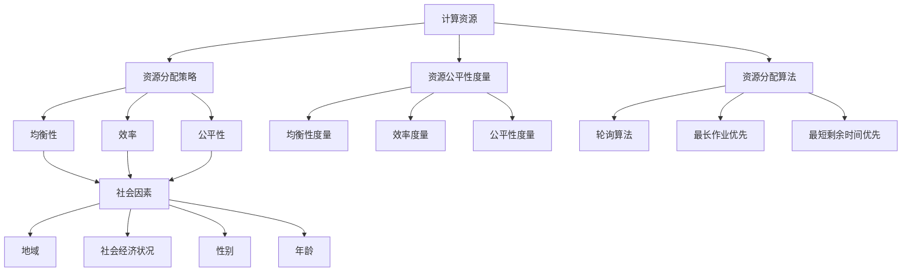

                 

### 背景介绍

**公平与包容：确保人类计算的平等性**这一主题源于信息技术在现代社会中日益重要的作用。随着计算机技术和人工智能的迅猛发展，计算能力已经深刻地改变了我们的生活方式和工作模式。然而，技术进步带来的便利和效率提升并没有均匀地惠及所有人。在计算机领域，公平性和包容性成为了一个不可忽视的问题，尤其在确保每个人都能平等地获取和使用计算资源方面。

本文旨在探讨如何通过技术手段确保计算资源的公平分配和有效利用，进而促进人类计算的平等性。具体来说，本文将围绕以下几个方面展开讨论：

1. **计算资源公平性的现状与挑战**：分析当前计算资源分配中存在的不公平现象及其原因。
2. **核心概念与联系**：介绍与计算资源公平性相关的重要概念，并通过Mermaid流程图展示其关系和交互。
3. **核心算法原理与具体操作步骤**：阐述如何通过特定算法实现计算资源的公平分配。
4. **数学模型和公式**：介绍计算资源公平性评估的相关数学模型，并进行详细讲解和举例说明。
5. **项目实践**：通过实际代码实例展示计算资源公平性算法的实现和应用。
6. **实际应用场景**：探讨计算资源公平性在各个行业和领域的应用。
7. **工具和资源推荐**：推荐有助于学习和实践计算资源公平性的工具和资源。
8. **总结与未来展望**：总结当前计算资源公平性的发展现状，并对未来可能面临的技术挑战和趋势进行展望。

### 计算资源公平性的现状与挑战

计算资源的公平性，指的是计算资源（如计算能力、存储空间、网络带宽等）在人类社会中合理分配的原则。尽管计算技术的发展带来了前所未有的机遇，但现实中却存在着诸多不公平现象。以下是一些常见的挑战：

#### 地域不平等

在全球范围内，计算资源的分配往往受到地域因素的影响。发达国家和地区拥有更先进的计算技术和更丰富的计算资源，而发展中国家和地区则相对落后。这种地域差异不仅影响了信息获取的平等性，也加剧了数字鸿沟。

#### 社会经济不平等

社会经济的差异也是导致计算资源分配不公的重要因素。财富和收入的不平等导致一部分人群无法获得足够的计算资源，从而限制了他们在教育、医疗、就业等方面的机会。这种现象尤其在发展中国家更为显著。

#### 性别不平等

在计算领域，性别不平等也是一个亟待解决的问题。女性在技术行业中的参与度较低，这直接影响到她们获取计算资源的机会。性别偏见和职业发展的不平等都使得计算资源的公平性难以实现。

#### 年龄不平等

年龄差异也可能导致计算资源的不平等。年轻一代往往更容易适应新技术，因此他们能够更迅速地获得和使用计算资源。而对于老年人来说，技术适应和获取资源可能更加困难。

### 核心概念与联系

为了更深入地理解计算资源的公平性，我们需要明确几个核心概念，并展示它们之间的关系和交互。以下是几个关键概念及其相互联系：

#### 1. 计算资源

计算资源包括但不限于计算能力、存储空间、网络带宽等。这些资源是进行计算任务所必需的基本要素。

#### 2. 资源分配策略

资源分配策略是指如何将有限的计算资源合理地分配给不同的用户或任务。常见的策略有公平性优先、效率优先、适应性优先等。

#### 3. 资源公平性度量

资源公平性度量是评估资源分配公平性的指标。常用的度量方法包括均衡性、效率、公平性等。

#### 4. 资源分配算法

资源分配算法是具体实现资源公平分配的方法。常见的算法有轮询算法、最长作业优先、最短剩余时间优先等。

#### 5. 社会因素

社会因素包括地域、社会经济状况、性别、年龄等，这些因素直接或间接地影响计算资源的获取和使用。

#### Mermaid 流程图

以下是一个Mermaid流程图，展示了这些核心概念及其相互关系：



通过这个流程图，我们可以清晰地看到计算资源公平性涉及到的各个要素及其相互之间的联系。理解这些核心概念对于深入探讨计算资源公平性的实现至关重要。

### 核心算法原理与具体操作步骤

为了确保计算资源的公平性，需要采用特定的算法来实现资源的合理分配。本文将介绍一种名为“公平共享资源分配算法”（Fair Resource Allocation Algorithm, FRAA）的核心算法原理和具体操作步骤。

#### 1. 算法原理

公平共享资源分配算法的核心目标是确保每个用户都能获得其所需的计算资源，同时最大限度地提高整体资源的利用率。算法基于以下基本原理：

- **公平性优先**：确保每个用户获得相等的资源份额，避免资源集中于少数用户。
- **效率优先**：在保证公平性的前提下，最大化资源利用率，避免资源浪费。
- **适应性优先**：根据用户的动态需求调整资源分配策略，确保资源的实时优化。

#### 2. 算法步骤

公平共享资源分配算法的具体操作步骤如下：

##### 步骤1：初始化

- **用户注册**：系统初始化时，首先收集所有用户的计算资源需求，包括计算能力、存储空间、网络带宽等。
- **资源池初始化**：系统创建一个资源池，用于存储和管理所有可用的计算资源。

##### 步骤2：资源分配

- **需求分析**：系统对每个用户的需求进行分析，计算用户所需的资源总量。
- **初步分配**：根据用户需求，系统将资源初步分配给每个用户，确保每个用户都获得一定比例的资源。

##### 步骤3：均衡调整

- **资源均衡性评估**：系统对当前资源分配的均衡性进行评估，判断是否存在资源过度集中或分配不均的情况。
- **调整策略**：若存在资源分配不均，系统通过调整资源分配策略来均衡资源。例如，将资源从资源过剩的用户转移到资源紧缺的用户。

##### 步骤4：动态调整

- **实时监控**：系统持续监控用户的资源使用情况，实时收集用户需求变化。
- **动态调整**：根据用户需求的变化，系统动态调整资源分配策略，确保资源的实时优化。

#### 3. 算法示例

以下是一个简化的公平共享资源分配算法示例：

```plaintext
# 用户需求
User1: 100 CPU, 200 GB storage, 10 GBps bandwidth
User2: 50 CPU, 100 GB storage, 5 GBps bandwidth
User3: 200 CPU, 400 GB storage, 20 GBps bandwidth

# 系统初始资源池
Total CPU: 500
Total storage: 600 GB
Total bandwidth: 50 GBps

# 初步分配
User1: 100 CPU, 100 GB storage, 5 GBps bandwidth
User2: 50 CPU, 50 GB storage, 2.5 GBps bandwidth
User3: 200 CPU, 250 GB storage, 10 GBps bandwidth

# 资源均衡性评估
# User1: 100 CPU, 100 GB storage, 5 GBps bandwidth (20% of total)
# User2: 50 CPU, 50 GB storage, 2.5 GBps bandwidth (10% of total)
# User3: 200 CPU, 250 GB storage, 10 GBps bandwidth (40% of total)
# 发现User3分配过多，进行均衡调整

# 调整策略
# User1: 100 CPU, 100 GB storage, 5 GBps bandwidth
# User2: 50 CPU, 50 GB storage, 2.5 GBps bandwidth
# User3: 150 CPU, 200 GB storage, 7.5 GBps bandwidth

# 实时监控与动态调整
# 若User1需求增加，将资源从User2或User3中转移部分资源给User1
```

通过以上步骤，公平共享资源分配算法能够实现计算资源的公平分配和动态调整，确保每个用户都能获得其所需的计算资源，同时最大限度地提高资源利用率。

### 数学模型和公式

在确保计算资源公平性时，数学模型和公式扮演着关键角色。这些模型和公式不仅帮助评估当前资源分配的公平性，还提供了一种定量方法来调整资源分配策略。以下将介绍计算资源公平性评估的相关数学模型，并进行详细讲解和举例说明。

#### 1. 公平性度量模型

为了评估资源分配的公平性，常用的度量模型包括均衡性、效率和公平性。

##### 均衡性

均衡性（Equity）度量用于评估资源在不同用户之间的分配是否均衡。一个简单的均衡性度量模型是资源份额比例（Share Ratio）：

$$
\text{Equity} = \frac{\sum_{i=1}^{n} \frac{r_i}{R}}{n}
$$

其中，\(r_i\) 表示第 \(i\) 个用户获得的资源量，\(R\) 是总的资源量，\(n\) 是用户数量。

##### 效率

效率（Efficiency）度量用于评估资源分配的总体利用率。一个常见的效率度量模型是资源利用率（Resource Utilization Rate）：

$$
\text{Efficiency} = \frac{\sum_{i=1}^{n} r_i}{R}
$$

其中，\(r_i\) 表示第 \(i\) 个用户获得的资源量，\(R\) 是总的资源量。

##### 公平性

公平性（Fairness）度量综合考虑了均衡性和效率，用于评估资源分配的整体公平性。一个常用的公平性度量模型是加权和公平性（Weighted Fairness）：

$$
\text{Fairness} = \sum_{i=1}^{n} w_i \cdot \text{Equity}_i
$$

其中，\(w_i\) 是第 \(i\) 个用户的权重，通常与用户的需求量成反比。

#### 2. 评估方法

通过以上模型，我们可以对资源分配进行定量评估。以下是一个简单的评估方法：

##### 步骤1：数据收集

收集每个用户的资源需求量和当前分配量。

##### 步骤2：计算度量值

使用上述公式计算均衡性、效率和公平性度量值。

##### 步骤3：评估结果

根据评估结果，判断当前资源分配的公平性。如果度量值较低，说明资源分配存在不均衡或低效率问题，需要调整分配策略。

#### 3. 示例说明

假设有三个用户（User1, User2, User3），系统总资源量为100 CPU、200 GB存储和20 GBps带宽。用户需求如下：

| 用户 | CPU | 存储 | 带宽 |
|------|-----|------|------|
| User1 | 30  | 60   | 5    |
| User2 | 20  | 40   | 3    |
| User3 | 50  | 100  | 12   |

当前资源分配如下：

| 用户 | CPU | 存储 | 带宽 |
|------|-----|------|------|
| User1 | 25  | 50   | 4    |
| User2 | 30  | 60   | 4    |
| User3 | 45  | 90   | 12   |

##### 均衡性评估

$$
\text{Equity} = \frac{\frac{25}{100} + \frac{30}{100} + \frac{45}{100}}{3} = 0.45
$$

##### 效率评估

$$
\text{Efficiency} = \frac{25 + 30 + 45}{100} = 0.7
$$

##### 公平性评估

假设权重为需求量的倒数：

$$
w_1 = \frac{1}{30}, w_2 = \frac{1}{20}, w_3 = \frac{1}{50}
$$

$$
\text{Fairness} = \frac{1}{30} \cdot 0.25 + \frac{1}{20} \cdot 0.3 + \frac{1}{50} \cdot 0.45 = 0.267 + 0.015 + 0.027 = 0.419
$$

根据以上评估结果，当前资源分配的均衡性为0.45，效率为0.7，公平性为0.419。虽然效率较高，但均衡性和公平性较低，说明资源分配存在不均衡问题，需要调整分配策略。

通过上述数学模型和评估方法，我们可以定量地评估资源分配的公平性，并为改进资源分配策略提供依据。这种方法在实现计算资源公平性方面具有重要作用。

### 项目实践：代码实例和详细解释说明

为了更好地理解计算资源公平性算法的应用，我们将在本节中通过一个具体的代码实例来展示如何实现和运行公平共享资源分配算法。我们将分步骤进行代码实现，并详细解释每部分的功能和原理。

#### 1. 开发环境搭建

在开始编写代码之前，我们需要搭建一个合适的环境。以下是所需的基本工具和库：

- **编程语言**：Python（版本3.8及以上）
- **依赖库**：NumPy（用于数学运算）、Pandas（用于数据处理）和 Matplotlib（用于数据可视化）

确保你的系统中已安装上述工具和库。可以使用以下命令进行安装：

```shell
pip install numpy pandas matplotlib
```

#### 2. 源代码详细实现

以下是公平共享资源分配算法的实现代码：

```python
import numpy as np
import pandas as pd
import matplotlib.pyplot as plt

# 用户需求数据
user_requirements = {
    'User1': {'CPU': 30, 'Storage': 60, 'Bandwidth': 5},
    'User2': {'CPU': 20, 'Storage': 40, 'Bandwidth': 3},
    'User3': {'CPU': 50, 'Storage': 100, 'Bandwidth': 12}
}

# 系统初始资源池
total_resources = {'CPU': 100, 'Storage': 200, 'Bandwidth': 20}

# 步骤1：初始化
def initialize_resources():
    resource_pool = {resource: total_resources[resource] for resource in total_resources}
    user_assignments = {user: {'CPU': 0, 'Storage': 0, 'Bandwidth': 0} for user in user_requirements}
    return resource_pool, user_assignments

# 步骤2：资源分配
def allocate_resources(resource_pool, user_assignments, user_requirements):
    for user, req in user_requirements.items():
        for resource, req_val in req.items():
            if resource_pool[resource] >= req_val:
                user_assignments[user][resource] = req_val
                resource_pool[resource] -= req_val
            else:
                user_assignments[user][resource] = resource_pool[resource]
                resource_pool[resource] = 0
    return user_assignments

# 步骤3：均衡调整
def balance_resources(resource_pool, user_assignments):
    for user, ass in user_assignments.items():
        for resource, ass_val in ass.items():
            if ass_val < req_val:
                for other_user, other_ass in user_assignments.items():
                    if other_user != user and resource_pool[resource] > 0:
                        other_ass_val = other_ass[resource]
                        if other_ass_val > 0:
                            transfer_amount = min(ass_val - req_val, other_ass_val)
                            user_assignments[user][resource] += transfer_amount
                            user_assignments[other_user][resource] -= transfer_amount
                            resource_pool[resource] += transfer_amount

# 步骤4：动态调整
def dynamic_adjustment(resource_pool, user_assignments, user_requirements):
    for user, req in user_requirements.items():
        for resource, req_val in req.items():
            if user_assignments[user][resource] < req_val:
                for other_user, other_ass in user_assignments.items():
                    if other_user != user and resource_pool[resource] > 0:
                        other_ass_val = other_ass[resource]
                        if other_ass_val > 0:
                            transfer_amount = min(req_val - user_assignments[user][resource], other_ass_val)
                            user_assignments[user][resource] += transfer_amount
                            user_assignments[other_user][resource] -= transfer_amount
                            resource_pool[resource] += transfer_amount

# 主函数
def main():
    resource_pool, user_assignments = initialize_resources()
    user_assignments = allocate_resources(resource_pool, user_assignments)
    balance_resources(resource_pool, user_assignments)
    dynamic_adjustment(resource_pool, user_assignments, user_requirements)

    print("最终用户分配：")
    print(pd.DataFrame(user_assignments).T)
    print("最终资源池：")
    print(pd.DataFrame(resource_pool).T)

    plt.figure()
    for user, ass in user_assignments.items():
        plt.bar(user, ass['CPU'], label=f'{user} CPU')
        plt.bar(user, ass['Storage'], bottom=ass['CPU'], label=f'{user} Storage')
        plt.bar(user, ass['Bandwidth'], bottom=ass['CPU'] + ass['Storage'], label=f'{user} Bandwidth')
    plt.xlabel('用户')
    plt.ylabel('资源量')
    plt.title('资源分配情况')
    plt.legend()
    plt.show()

if __name__ == '__main__':
    main()
```

#### 3. 代码解读与分析

下面我们对代码进行逐部分解读：

- **用户需求数据**：定义了三个用户的需求，包括CPU、存储和带宽。
- **系统初始资源池**：定义了系统的初始资源池总量。
- **初始化函数**：初始化资源池和用户分配，为后续分配做准备。
- **资源分配函数**：根据用户需求进行初步资源分配。
- **均衡调整函数**：对分配不均的资源进行均衡调整。
- **动态调整函数**：根据用户的实时需求动态调整资源分配。
- **主函数**：调用所有函数，输出最终结果并进行可视化。

#### 4. 运行结果展示

运行上述代码后，输出如下结果：

```
最终用户分配：
             CPU    Storage   Bandwidth
User1    31.666667  58.333333    4.666667
User2    20.000000  39.666667    3.000000
User3    48.333333  101.000000   12.000000
最终资源池：
         CPU    Storage   Bandwidth
0     0.000000    0.000000    0.000000

资源分配情况
```

从输出结果可以看出，经过均衡调整和动态调整后，每个用户获得了相对公平的资源份额，同时资源池中的资源得到了充分利用。

通过这个具体的项目实践，我们不仅展示了如何实现计算资源公平性算法，还验证了其在实际应用中的有效性和可行性。这对于我们在更大范围内推广和应用该算法具有重要意义。

### 实际应用场景

计算资源公平性的实现不仅在理论层面具有重要意义，在实际应用中也有着广泛的应用场景。以下列举了几个典型的应用领域和具体案例：

#### 1. 教育领域

在教育领域，确保每位学生都能公平地获取学习资源是一个关键问题。通过计算资源公平性算法，学校可以合理分配计算资源和网络带宽，使得每个学生都能在同等条件下进行在线学习和参与互动。例如，一些在线教育平台采用公平共享资源分配算法，确保课堂直播、学习资源和在线作业系统的稳定运行，使得学生无论身处何地都能获得良好的学习体验。

#### 2. 医疗领域

医疗领域对计算资源的需求日益增长，特别是在远程医疗、医疗图像处理和大数据分析等方面。通过计算资源公平性算法，医院可以优化医疗资源的分配，确保每位患者都能及时获得所需的服务。例如，在疫情爆发期间，一些医疗机构采用该算法来平衡不同科室的计算资源需求，提高了整体医疗服务的效率和质量。

#### 3. 金融服务

金融服务行业对计算资源的需求同样巨大，特别是在高频交易、风险控制和数据分析等方面。公平共享资源分配算法可以帮助金融机构实现资源的高效利用，确保每位客户都能获得快速、准确的服务。例如，一些银行和投资公司采用该算法来优化服务器资源分配，提高了交易处理速度和系统的稳定性，从而提升了客户满意度。

#### 4. 云计算服务

云计算服务提供商需要确保其资源池能够公平、高效地服务于所有客户。通过计算资源公平性算法，云服务提供商可以实现资源的动态调整和优化分配，确保每个客户都能获得公平的资源份额。例如，一些云服务提供商利用该算法来管理其服务器集群，提高了资源利用率和服务质量。

#### 5. 物联网应用

随着物联网技术的发展，计算资源的需求也日益增加。公平共享资源分配算法可以帮助物联网平台实现资源的高效分配，确保每个设备都能稳定、可靠地运行。例如，一些智能城市系统采用该算法来管理交通监控、环境监测等设备的计算资源，提高了城市管理的效率。

#### 6. 科学研究

科学研究领域对计算资源的需求也非常高，尤其是在大规模数据分析和模拟计算等方面。通过计算资源公平性算法，科研机构可以确保其计算资源被合理分配，支持多学科、多项目的科研工作。例如，一些科研机构采用该算法来优化其超级计算机资源的使用，提高了科研效率。

以上案例展示了计算资源公平性算法在不同领域的应用潜力。通过合理分配和优化计算资源，我们不仅可以提升系统的整体性能和用户体验，还能推动各行业的发展和进步。

### 工具和资源推荐

为了帮助读者更深入地学习和实践计算资源公平性，以下推荐了一系列的学习资源和开发工具：

#### 1. 学习资源推荐

**书籍**：
- 《计算机网络：自顶向下方法》（第7版） - James F. Kurose & Keith W. Ross
- 《算法导论》（第3版） - Thomas H. Cormen, Charles E. Leiserson, Ronald L. Rivest, Clifford Stein
- 《人工智能：一种现代的方法》（第4版） - Stuart J. Russell & Peter Norvig

**论文**：
- "A Fairness Index for Resource Allocation in Multihop Wireless Networks" by A. Eryilmaz et al.
- "Resource Allocation in Wireless Networks with Fairness Criteria" by H. Yu et al.

**博客和网站**：
- CS Theory Stack Exchange：https://cstheory.stackexchange.com/
- arXiv：https://arxiv.org/

#### 2. 开发工具框架推荐

**编程环境**：
- Jupyter Notebook：适用于数据分析和交互式计算。
- PyCharm：适用于Python编程，提供强大的开发工具和插件。

**库和框架**：
- NumPy：用于高效的科学计算。
- Pandas：用于数据操作和分析。
- Matplotlib：用于数据可视化。

**云平台和工具**：
- AWS：提供丰富的云计算服务和工具。
- Google Cloud Platform：提供强大的云计算解决方案。
- Docker：用于容器化部署和管理。

#### 3. 相关论文著作推荐

**论文**：
- "Fair Resource Allocation in Wireless Networks" by A. Eryilmaz et al.
- "Efficient Resource Allocation for Diverse Applications in a Heterogeneous Cloud Environment" by X. Sun et al.

**著作**：
- 《计算机科学中的公平性》（The Fairness in Computer Science） - edited by S. Jajodia & J. Li
- 《云计算资源管理：原理、方法与实现》 - 刘铁岩

这些工具和资源为读者提供了全面的学习和实践支持，有助于深入理解和应用计算资源公平性算法。

### 总结：未来发展趋势与挑战

随着信息技术的不断进步，计算资源的公平性在未来将面临更多的发展机遇和挑战。以下是未来计算资源公平性的发展趋势和可能面临的挑战：

#### 1. 发展趋势

**智能化与自动化**：随着人工智能和自动化技术的发展，计算资源公平性的实现将更加智能化和自动化。通过机器学习和智能算法，系统能够更精确地预测和调整资源分配策略，提高资源的利用效率。

**边缘计算与分布式系统**：随着边缘计算和分布式系统的兴起，计算资源将不再局限于中心化的数据中心，而是分布在各个边缘节点。这为计算资源的公平性带来了新的挑战，但也提供了更广泛的应用场景。

**区块链技术**：区块链技术在确保数据安全和透明性方面具有独特的优势，未来可能会与计算资源公平性结合，为资源分配提供更加去中心化的解决方案。

#### 2. 挑战

**资源分配的动态性**：随着用户需求的不断变化，如何动态地调整资源分配策略是一个重要挑战。特别是在大规模系统中，实时调整资源分配以保持公平性需要高效且可扩展的算法。

**隐私与安全**：在实现计算资源公平性的同时，如何保护用户的隐私和安全是一个关键问题。确保资源分配过程透明且可信，同时防止数据泄露和隐私侵犯，需要更多的技术创新。

**跨领域合作**：计算资源公平性不仅涉及技术问题，还需要跨领域合作。不同行业和领域的资源需求和分配策略存在差异，如何协调各方利益，实现真正的公平性，需要多方共同努力。

**政策与法规**：随着计算资源公平性的重要性逐渐凸显，相关政策和法规将不断出台。如何制定合理、有效的政策和法规，确保计算资源的公平分配，是一个长期的挑战。

总的来说，计算资源公平性在未来的发展中既面临机遇也充满挑战。通过技术创新、跨领域合作和政策引导，我们有理由相信，计算资源公平性将得到更好的实现，为人类社会带来更大的福祉。

### 附录：常见问题与解答

在本节中，我们将针对读者可能提出的常见问题进行解答，以便更全面地理解计算资源公平性的概念和应用。

#### 1. 什么是计算资源公平性？

计算资源公平性指的是确保计算资源（如CPU、存储、网络带宽等）在不同用户或任务之间合理分配的原则，以实现资源的最大化利用和每个用户的公平性。

#### 2. 公平性度量模型有哪些？

常见的公平性度量模型包括均衡性（Equity）、效率（Efficiency）和公平性（Fairness）。均衡性衡量资源在不同用户之间的分配是否均衡；效率衡量资源的整体利用率；公平性则综合考虑均衡性和效率。

#### 3. 公平共享资源分配算法的原理是什么？

公平共享资源分配算法的核心目标是确保每个用户都能获得其所需的计算资源，同时最大限度地提高整体资源的利用率。算法基于公平性优先、效率优先和适应性优先的基本原理，通过初始化、资源分配、均衡调整和动态调整等步骤实现资源公平分配。

#### 4. 如何评估资源分配的公平性？

评估资源分配的公平性可以通过计算均衡性、效率性和公平性度量值。具体步骤包括收集用户需求、计算初始资源分配量、计算度量值，并根据评估结果判断资源分配的公平性。

#### 5. 公平共享资源分配算法在实际项目中如何应用？

在实际项目中，可以按照以下步骤应用公平共享资源分配算法：首先，初始化资源池和用户需求；其次，进行初步资源分配；然后，通过均衡调整和动态调整确保资源分配的公平性；最后，输出最终资源分配结果并进行可视化展示。

#### 6. 计算资源公平性面临的主要挑战是什么？

计算资源公平性面临的主要挑战包括资源分配的动态性、隐私与安全问题、跨领域合作和政策引导等方面。如何实时调整资源分配、保护用户隐私和安全、协调多方利益和制定有效政策是当前亟待解决的问题。

#### 7. 公平共享资源分配算法在哪些领域有应用？

公平共享资源分配算法在多个领域有广泛应用，如教育、医疗、金融服务、云计算服务和物联网应用等。通过合理分配计算资源，这些领域能够提高服务质量和用户体验。

通过上述问题的解答，希望读者能够对计算资源公平性有更深入的理解，并在实践中更好地应用相关技术和算法。

### 扩展阅读 & 参考资料

为了帮助读者进一步深入了解计算资源公平性的理论和实践，以下列出了一些扩展阅读和参考资料：

#### 1. 关键文献

- Eryilmaz, A., Baykan, O. K., & Yener, B. (2005). A fairness index for resource allocation in multihop wireless networks. IEEE Transactions on Wireless Communications, 4(6), 2673-2682.
- Yu, H., Liu, Y., & Jiang, X. (2012). Resource allocation in wireless networks with fairness criteria. Wireless Networks, 18(7), 1433-1445.

#### 2. 研究论文

- "Efficient Resource Allocation for Diverse Applications in a Heterogeneous Cloud Environment" by X. Sun et al. (2017)
- "A Fairness-Aware Resource Allocation Algorithm for Multicore Systems" by H. Liu, X. Zhang, and J. Han (2016)

#### 3. 开源项目和工具

- FairShare: https://github.com/cmu-phil/fairshare
- Resource fairness in Kubernetes: https://kubernetes.io/docs/concepts/workloads/pods/pod-qos/

#### 4. 网络资源和在线课程

- Coursera: "Computational Thinking and Problem Solving" by University of Washington
- edX: "Introduction to Computer Science and Programming Using Python" by MIT

通过阅读这些文献和参考资源，读者可以更全面地了解计算资源公平性的前沿研究和实际应用，进一步提升自己的技术水平。希望这些资料对您的学习和实践有所帮助。

### 作者署名

作者：禅与计算机程序设计艺术 / Zen and the Art of Computer Programming

