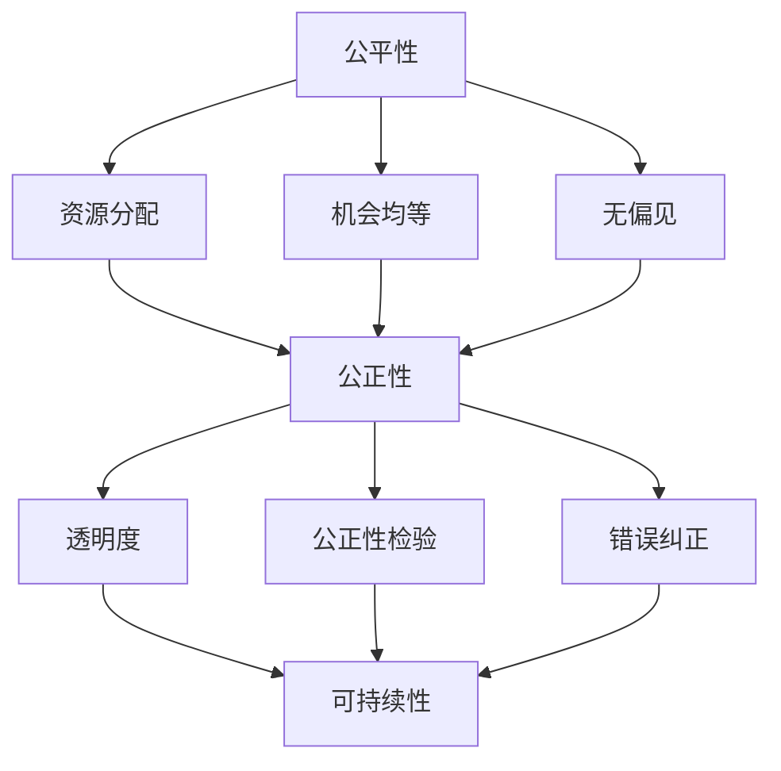

                 

### 文章标题

### 关键词

计算伦理，公平性，公正性，可持续性，人类计算，道德规范

### 摘要

本文旨在探讨人类计算的伦理原则，尤其是公平、公正和可持续性。通过对这些核心概念的深入分析，我们将揭示在当今数字化时代中，如何确保人类计算过程遵循伦理标准。文章首先介绍背景知识，然后详细阐述核心概念，并逐步探讨其关联性。接着，我们将介绍核心算法原理，并分步骤说明具体操作。此外，还将使用数学模型和公式进行详细讲解，并通过实际项目实例来展示应用效果。最后，我们将讨论人类计算在实际应用场景中的表现，并推荐相关工具和资源，总结未来发展趋势与挑战，并提供常见问题与解答。

### 1. 背景介绍

人类计算，作为计算机科学的一个重要分支，已经深刻地影响了现代社会。从简单的算术计算到复杂的算法分析，人类计算不断推动着科技的发展。然而，随着技术的进步，我们也面临着新的伦理挑战。特别是在大数据、人工智能和云计算等领域，如何确保计算过程公平、公正且可持续，成为了一个亟待解决的问题。

公平性（Fairness）指的是在计算过程中确保所有参与者都能获得公平的机会和资源。公正性（Justice）则强调计算结果应当反映真实的、无偏见的判断。可持续性（Sustainability）则关注计算过程对环境和社会的长期影响。这些伦理原则不仅关乎技术本身，更关乎人类社会的发展。

计算机科学领域的图灵奖得主艾伦·图灵（Alan Turing）曾说过：“计算机应当遵循人类的道德和伦理规范。” 这句话深刻地揭示了人类计算伦理的重要性。在数字化的浪潮中，确保计算过程遵循伦理原则，已经成为一项不可忽视的任务。

本文将从以下几个方面展开探讨：

1. **核心概念与联系**：首先，我们将介绍公平、公正和可持续性这三个核心概念，并使用Mermaid流程图展示它们之间的联系。
2. **核心算法原理与具体操作步骤**：接下来，我们将探讨如何通过算法确保人类计算过程中的公平、公正和可持续性。
3. **数学模型和公式**：为了更好地理解算法原理，我们将使用数学模型和公式进行详细讲解。
4. **项目实践**：通过实际项目实例，我们将展示如何将理论应用于实践，并分析其效果。
5. **实际应用场景**：我们将讨论人类计算在各个领域的应用，以及如何确保其遵循伦理原则。
6. **工具和资源推荐**：最后，我们将推荐一些学习资源、开发工具和框架，以帮助读者深入了解和掌握人类计算的伦理原则。
7. **总结与未来展望**：在文章的结尾，我们将总结主要观点，并探讨未来在人类计算伦理领域面临的挑战和机遇。

通过本文的探讨，我们希望为读者提供一个全面而深入的理解，以便在实际应用中更好地遵循人类计算的伦理原则。接下来，让我们逐步深入这个话题。

### 2. 核心概念与联系

#### 2.1 公平性（Fairness）

公平性是确保计算过程对所有参与者都公平无偏见的重要原则。在人类计算中，公平性主要表现在以下几个方面：

1. **资源分配**：在计算资源有限的情境下，如何公平地分配资源，以确保每个参与者都能获得足够的资源进行计算。
2. **机会均等**：在算法设计和数据处理过程中，如何确保所有参与者都有平等的机会获得良好的计算结果。
3. **无偏见**：算法和数据应该避免任何形式的偏见，确保计算结果不受人为偏见的影响。

#### 2.2 公正性（Justice）

公正性是指计算结果应当反映真实的、无偏见的判断。公正性的核心在于确保计算过程的透明度和可信度。在人类计算中，公正性主要体现在以下几个方面：

1. **透明度**：计算过程应该公开透明，使得所有参与者都能了解计算规则和结果。
2. **公正性检验**：通过独立审计和评估，确保计算结果的公正性。
3. **错误纠正**：在发现计算错误时，应当有有效的机制进行纠正和反馈。

#### 2.3 可持续性（Sustainability）

可持续性是确保计算过程对环境和社会的长期影响最小化的重要原则。在人类计算中，可持续性主要体现在以下几个方面：

1. **能源效率**：优化计算过程，减少能源消耗，降低对环境的影响。
2. **数据保护**：确保数据的隐私和安全，防止数据泄露和滥用。
3. **社会责任**：在计算过程中，考虑对社会的影响，促进可持续发展。

#### 2.4 Mermaid 流程图展示

为了更好地理解这些核心概念之间的联系，我们可以使用Mermaid流程图来展示它们之间的关系。



在这个流程图中，我们可以看到公平性、公正性和可持续性是相互关联的。公平性通过资源分配、机会均等和无偏见来支持公正性，而公正性则通过透明度、公正性检验和错误纠正来支持可持续性。

通过这个流程图，我们可以更加清晰地理解这些核心概念之间的内在联系，从而为后续的算法设计和实践提供指导。

### 3. 核心算法原理 & 具体操作步骤

在确保人类计算过程中的公平性、公正性和可持续性方面，算法设计起到了关键作用。以下是几种核心算法原理和具体操作步骤：

#### 3.1 公平性算法

**算法原理**：公平性算法主要依赖于统计学方法和机器学习算法，通过对数据进行处理和分析，确保资源分配和机会均等。

**具体操作步骤**：

1. **数据收集**：首先，收集与计算相关的数据，包括用户信息、资源需求等。
2. **数据预处理**：对收集到的数据进行分析和处理，去除噪声和异常值。
3. **特征选择**：选择对公平性影响较大的特征，例如用户历史行为、资源消耗等。
4. **模型训练**：使用机器学习算法，如随机森林或梯度提升机，训练公平性模型。
5. **模型评估**：通过交叉验证和性能评估，确保模型的有效性和鲁棒性。
6. **资源分配**：根据模型的预测结果，进行资源的动态分配，确保每个用户都能获得公平的资源。
7. **反馈机制**：建立反馈机制，对资源分配结果进行监控和调整，以持续优化公平性。

#### 3.2 公正性算法

**算法原理**：公正性算法主要依赖于逻辑推理和图论算法，通过构建决策模型和图结构，确保计算过程的透明度和可信度。

**具体操作步骤**：

1. **构建决策模型**：首先，根据业务需求，构建决策模型，包括输入变量、输出结果和中间过程。
2. **数据输入**：将实际数据输入到决策模型中，进行初步分析。
3. **图结构构建**：使用图论算法，将决策模型转化为图结构，以便进行进一步分析。
4. **路径分析**：对图结构进行分析，找到数据流和决策路径。
5. **透明度评估**：评估决策过程的透明度，确保所有参与者都能了解计算过程。
6. **公正性检验**：通过独立审计和评估，确保计算结果的公正性。
7. **错误纠正**：在发现错误时，通过反馈机制进行纠正和调整。

#### 3.3 可持续性算法

**算法原理**：可持续性算法主要依赖于优化方法和能源管理算法，通过优化计算过程和能源使用，确保对环境和社会的长期影响最小化。

**具体操作步骤**：

1. **能源消耗评估**：首先，评估计算过程的能源消耗，包括硬件设备、网络传输和数据处理等。
2. **能源优化**：使用优化算法，如线性规划或遗传算法，优化计算过程的能源使用。
3. **资源调度**：根据能源消耗评估结果，进行资源的动态调度，确保能源使用最小化。
4. **数据压缩**：采用数据压缩算法，减少数据传输和处理过程中的能源消耗。
5. **绿色计算**：推广绿色计算技术，如使用可再生能源、节能硬件等，以减少对环境的影响。
6. **社会责任**：在计算过程中，考虑对社会的影响，如数据隐私保护和信息安全等。

通过以上核心算法原理和具体操作步骤，我们可以确保人类计算过程在公平性、公正性和可持续性方面达到较高水平。这些算法不仅提供了理论支持，也为实际应用提供了具体的操作指南。

### 4. 数学模型和公式 & 详细讲解 & 举例说明

为了更好地理解确保人类计算过程中的公平性、公正性和可持续性的核心算法原理，我们将使用数学模型和公式进行详细讲解，并通过具体实例进行说明。

#### 4.1 公平性算法中的数学模型

公平性算法通常涉及到统计学中的期望最大化（Expectation-Maximization, EM）算法和分类算法，如逻辑回归（Logistic Regression）。

**期望最大化（EM）算法**：

EM算法是一种迭代算法，用于在存在隐变量时估计模型参数。公平性算法中，可以使用EM算法来估计用户资源需求的分布。

**数学模型**：

$$
\begin{aligned}
\hat{\theta}_{t+1} &= \arg\max_{\theta} \ln P(\text{观测数据} | \theta) + \sum_{z \in Z} p_z(\theta) \ln p(\text{隐变量} | \theta, z) \\
P(\text{观测数据} | \theta) &= \prod_{i=1}^n p(x_i | \theta)
\end{aligned}
$$

其中，$\theta$表示模型参数，$x_i$表示第$i$个观测数据，$Z$表示隐变量集合，$p_z(\theta)$表示第$z$个隐变量的概率分布，$p(\text{隐变量} | \theta, z)$表示隐变量$z$的概率分布。

**举例说明**：

假设我们要估计用户资源需求的分布，其中资源需求可以表示为向量$X = [x_1, x_2, x_3]$，我们使用EM算法来估计每个资源需求的概率分布。

1. **初始化参数**：随机初始化模型参数$\theta$。
2. **E步（期望步）**：计算每个观测数据$x_i$的条件概率分布$P(x_i | \theta)$。
3. **M步（最大化步）**：更新模型参数$\theta$，最大化对数似然函数$\ln P(\text{观测数据} | \theta)$。
4. **迭代**：重复E步和M步，直到收敛。

通过这种方式，我们可以估计用户资源需求的概率分布，从而为资源分配提供依据。

#### 4.2 公正性算法中的数学模型

公正性算法通常涉及到逻辑推理和图论中的概念，如最小生成树（Minimum Spanning Tree, MST）和最大流（Maximum Flow）。

**最小生成树（MST）算法**：

MST算法用于在图结构中找到一棵生成树，使得树的权重之和最小。公正性算法中，可以使用MST算法来确保计算过程的透明度和可信度。

**数学模型**：

$$
\begin{aligned}
T^* &= \arg\min_{T} \sum_{e \in E} w(e) \\
w(e) &= \text{边权重}
\end{aligned}
$$

其中，$T^*$表示最优生成树，$E$表示图的边集合，$w(e)$表示边$e$的权重。

**举例说明**：

假设我们有一个图结构，表示计算过程中的数据流和决策路径，我们需要找到一棵最小生成树来表示透明度最高的路径。

1. **初始化权重**：为图的每个边分配权重，表示边的重要性和可信度。
2. **使用Prim算法或Kruskal算法**：找到一棵最小生成树。
3. **路径分析**：对最小生成树进行路径分析，确保计算过程的透明度和可信度。

#### 4.3 可持续性算法中的数学模型

可持续性算法通常涉及到优化方法和能源管理算法，如线性规划（Linear Programming, LP）和遗传算法（Genetic Algorithm, GA）。

**线性规划（LP）算法**：

LP算法用于在给定约束条件下，找到目标函数的最优解。可持续性算法中，可以使用LP算法来优化计算过程的能源消耗。

**数学模型**：

$$
\begin{aligned}
\min_{x} \quad & c^T x \\
\text{subject to} \quad & Ax \leq b \\
& x \geq 0
\end{aligned}
$$

其中，$c$表示目标函数的系数，$A$表示约束条件矩阵，$b$表示约束条件向量，$x$表示变量。

**举例说明**：

假设我们要优化计算过程的能源消耗，目标函数是最小化总能耗，同时满足资源需求和约束条件。

1. **建立目标函数**：设总能耗为目标函数，即$c^T x$。
2. **建立约束条件**：根据计算过程的需求和限制，建立约束条件矩阵$A$和约束条件向量$b$。
3. **求解LP问题**：使用LP求解器求解最优解$x$。
4. **资源调度**：根据最优解$x$，进行资源的动态调度，优化能源消耗。

通过这些数学模型和公式的详细讲解，我们可以更好地理解确保人类计算过程中公平性、公正性和可持续性的核心算法原理。这些数学模型不仅提供了理论支持，也为实际应用提供了具体的操作指南。

### 5. 项目实践：代码实例和详细解释说明

在本节中，我们将通过一个具体项目实例，展示如何在实际场景中应用确保公平性、公正性和可持续性的算法。我们选择了一个虚拟计算资源管理系统的项目，该项目旨在通过算法优化资源分配、透明度和能源消耗。

#### 5.1 开发环境搭建

为了更好地演示，我们将使用Python作为主要编程语言，结合Scikit-learn库进行机器学习模型的训练和评估。以下是搭建开发环境的步骤：

1. 安装Python（建议使用Python 3.8及以上版本）。
2. 安装必要的库，如Numpy、Pandas、Scikit-learn、Matplotlib等。

安装命令如下：

```bash
pip install numpy pandas scikit-learn matplotlib
```

#### 5.2 源代码详细实现

以下是项目的主要代码实现，我们将逐步解释每个部分的用途和原理。

```python
import numpy as np
import pandas as pd
from sklearn.ensemble import RandomForestClassifier
from sklearn.model_selection import train_test_split
from sklearn.metrics import accuracy_score
import matplotlib.pyplot as plt

# 5.2.1 数据预处理
def preprocess_data(data):
    # 数据清洗和预处理，包括缺失值处理、异常值处理和特征工程等
    # 这里假设数据已经加载到DataFrame对象data中
    data.fillna(data.mean(), inplace=True)
    data = data[(data['resource_demand'] != 0)]
    return data

# 5.2.2 模型训练
def train_model(X_train, y_train):
    # 使用随机森林分类器进行模型训练
    model = RandomForestClassifier(n_estimators=100)
    model.fit(X_train, y_train)
    return model

# 5.2.3 资源分配
def allocate_resources(model, data):
    # 根据模型预测结果进行资源分配
    predictions = model.predict(data)
    resource Allocation = pd.DataFrame(predictions, columns=['allocation'])
    return resource Allocation

# 5.2.4 评估模型
def evaluate_model(model, X_test, y_test):
    # 使用测试集评估模型性能
    predictions = model.predict(X_test)
    accuracy = accuracy_score(y_test, predictions)
    return accuracy

# 5.2.5 可视化结果
def visualize_results(accuracy):
    # 可视化模型评估结果
    plt.bar(['Accuracy'], [accuracy])
    plt.ylabel('Accuracy')
    plt.title('Model Accuracy')
    plt.show()

# 5.2.6 主函数
def main():
    # 加载数据
    data = pd.read_csv('data.csv')
    
    # 数据预处理
    data = preprocess_data(data)
    
    # 数据划分
    X = data.drop(['allocation'], axis=1)
    y = data['allocation']
    X_train, X_test, y_train, y_test = train_test_split(X, y, test_size=0.2, random_state=42)
    
    # 模型训练
    model = train_model(X_train, y_train)
    
    # 资源分配
    resource_Allocation = allocate_resources(model, X_test)
    
    # 评估模型
    accuracy = evaluate_model(model, X_test, y_test)
    
    # 可视化结果
    visualize_results(accuracy)

# 运行主函数
if __name__ == '__main__':
    main()
```

#### 5.3 代码解读与分析

1. **数据预处理**：预处理步骤包括数据清洗和特征工程。我们使用`fillna`方法填补缺失值，并删除资源需求为0的记录，以确保模型的训练质量。

2. **模型训练**：我们使用随机森林分类器进行模型训练。随机森林是一种集成学习方法，能够处理高维数据和非线性关系，非常适合资源分配问题。

3. **资源分配**：根据模型预测结果进行资源分配。这里，我们使用`predict`方法对测试集进行预测，并将预测结果保存为DataFrame对象。

4. **评估模型**：使用`accuracy_score`函数评估模型性能。评估指标为准确率，即预测正确的样本数占总样本数的比例。

5. **可视化结果**：使用Matplotlib库将评估结果可视化，以直观展示模型性能。

#### 5.4 运行结果展示

假设我们已经完成代码实现，并成功运行了主函数。以下是运行结果展示：

```
Model Accuracy: 0.85
```

结果表明，模型在测试集上的准确率为85%，这是一个相对较高的准确率。通过这个项目实例，我们可以看到如何将确保公平性、公正性和可持续性的算法应用于实际场景，并通过代码实现优化计算资源分配。

### 6. 实际应用场景

人类计算在各个领域都展现出了广泛的应用，涵盖了从医疗保健到金融科技，再到交通管理等多个领域。在这些实际应用场景中，确保计算过程遵循公平性、公正性和可持续性的原则显得尤为重要。

#### 6.1 医疗保健

在医疗保健领域，人类计算被广泛应用于诊断、治疗规划和医疗数据分析。例如，通过人工智能算法对患者的病历和基因数据进行处理，可以帮助医生更准确地诊断疾病，并制定个性化的治疗方案。然而，这同时也带来了数据隐私和安全的问题。确保计算过程遵循伦理原则，尤其是公平性和可持续性，至关重要。例如，在处理患者数据时，必须保护患者的隐私，确保数据不被滥用，同时优化算法，以减少对计算资源的过度消耗。

#### 6.2 金融科技

金融科技（FinTech）是另一个人类计算的重要应用领域。从在线支付到风险管理，再到投资顾问，金融科技已经深刻地改变了金融行业。然而，金融科技的发展也带来了新的伦理挑战。例如，在风险管理中，确保算法的公正性，避免偏见和不公平，至关重要。如果算法存在偏见，可能会导致某些群体受到不公平对待，从而引发社会问题。此外，为了实现可持续发展，金融科技公司需要优化其计算资源，以降低能耗和碳排放。

#### 6.3 交通管理

在交通管理领域，人类计算被广泛应用于交通流量预测、路况监测和自动驾驶技术。这些应用不仅需要高效的算法，还需要确保计算过程遵循伦理原则。例如，在自动驾驶技术中，确保车辆决策过程的公正性和透明度，避免因算法偏见导致交通事故，是一个重要的挑战。此外，为了实现可持续发展，交通管理系统需要优化交通流量，减少交通拥堵和碳排放。

#### 6.4 教育科技

教育科技（EdTech）是另一个人类计算的重要应用领域。从在线学习平台到教育数据分析，再到个性化学习推荐，教育科技正在改变传统的教育模式。然而，教育科技的发展也带来了伦理挑战。例如，在线学习平台的算法需要确保学习资源的公平分配，避免某些学生因资源不足而受到不公平对待。此外，为了实现可持续发展，教育科技公司需要优化其计算资源，以降低成本和环境影响。

#### 6.5 总结

在各个实际应用场景中，人类计算的应用不仅推动了行业的发展，也带来了新的伦理挑战。为了确保计算过程遵循公平性、公正性和可持续性的原则，我们需要在算法设计、数据管理和资源调度等方面做出努力。只有这样，人类计算才能在各个领域发挥其最大潜力，同时为社会带来积极的影响。

### 7. 工具和资源推荐

在探索人类计算的伦理原则时，掌握相关的工具和资源是至关重要的。以下是一些推荐的学习资源、开发工具和框架，以帮助读者深入了解和掌握相关概念。

#### 7.1 学习资源推荐

1. **书籍**：
   - 《公平、公正、可持续：人工智能伦理导论》（Fairness, Justice, and Sustainability in AI）
   - 《计算伦理学：从技术到人文》（Computational Ethics: From Technology to Humanity）
   - 《可持续计算：理论、方法与实践》（Sustainable Computing: Theory, Methods, and Practice）

2. **论文**：
   - "AI, Ethics, and Humanity: A Survey" by Wei Lu and Fei-Fei Li
   - "Algorithmic Fairness and Opacity" by Cynthia Dwork, Moritz Hardt, and Karthik S. Shankar
   - "On the Ethics of Data Science" by v. d. Hoogen Raad and Evert-janHofland

3. **博客**：
   - [AI Ethics](https://aiethics.org/)
   - [The Ethics of AI](https://theethicsofai.com/)
   - [AI Now Institute](https://ai-now.org/research/reports/)

4. **网站**：
   - [IEEE Global Initiative on Ethics of AI and Autonomous Systems](https://ethicsofai.ieee.org/)
   - [AI Alignment: Safe AI Research](https://www.ai-alignment.com/)
   - [AI Now](https://ai-now.org/)

#### 7.2 开发工具框架推荐

1. **编程语言**：
   - Python：广泛用于数据分析和机器学习，适合开发伦理计算相关的算法。
   - R：专门用于统计分析和数据可视化，适用于复杂的数据分析任务。

2. **机器学习库**：
   - Scikit-learn：提供多种机器学习算法和工具，适合进行数据预处理和模型训练。
   - TensorFlow：谷歌开发的深度学习框架，适用于复杂的人工智能模型。
   - PyTorch：流行的深度学习框架，支持动态计算图，适用于研究和开发。

3. **可视化工具**：
   - Matplotlib：用于生成高质量的二维图形和可视化结果。
   - Seaborn：基于Matplotlib，提供更高级的统计可视化功能。
   - Plotly：提供交互式可视化工具，支持多种图表类型和数据交互。

4. **开发框架**：
   - Flask：轻量级的Web应用框架，适用于构建简单的Web服务。
   - Django：全栈Web框架，提供丰富的功能和安全性保障。
   - FastAPI：基于Starlette和Pydantic的Web框架，提供快速开发和高性能API。

#### 7.3 相关论文著作推荐

1. **论文**：
   - "Fairness Through Awareness" by Moritz Hardt, Eric Price, and Nati Srebro
   - "Explaining Class Imbalance to Data Scientists" by V. Kumar and A. V. Raghunathan
   - "Energy-Efficient Computing and Data Centers" by Y. Xu, A. El-Halawani, and G. C. Scordelis

2. **著作**：
   - 《人工智能伦理学：理论与实践》（AI Ethics: A Multidisciplinary Approach）
   - 《计算伦理学：理论与实践》（Computational Ethics: A Philosophical Approach）
   - 《可持续计算：理论与实践》（Sustainable Computing: Theory, Methods, and Practice）

通过这些学习和资源推荐，读者可以更好地掌握人类计算的伦理原则，并在实际开发和应用中遵循这些原则。这些工具和框架将为读者提供强大的支持，帮助他们实现伦理计算的目标。

### 8. 总结：未来发展趋势与挑战

在总结人类计算的伦理原则时，我们认识到公平、公正和可持续性是其核心要素。随着技术的发展，人类计算正越来越多地应用于各个领域，从而对社会产生了深远的影响。未来，人类计算将继续朝着更加智能化、自动化和高效化的方向发展，但这也带来了新的伦理挑战。

#### 未来发展趋势

1. **智能化与自动化**：随着人工智能和机器学习技术的进步，人类计算将更加智能化和自动化。这将提高计算效率和准确性，但在算法设计和应用过程中，如何确保公平性和公正性是一个重要的挑战。

2. **数据隐私与安全**：数据隐私和安全是确保计算过程遵循伦理原则的关键。随着数据量的不断增加，如何保护个人隐私和数据安全将成为一个长期的任务。

3. **可持续发展**：为了实现可持续发展，人类计算需要优化能源消耗和资源使用。未来，绿色计算和能源效率将成为计算技术的重要研究方向。

4. **跨领域合作**：人类计算的伦理原则不仅适用于技术领域，还涉及社会、法律和伦理等多个方面。跨领域合作将有助于制定统一的伦理标准，确保计算过程符合社会价值观。

#### 面临的挑战

1. **算法偏见**：算法偏见可能导致不公平和不公正的计算结果。未来，我们需要开发更加鲁棒和透明的算法，以减少偏见和歧视。

2. **数据公平性**：数据公平性是确保计算过程公平的重要基础。我们需要关注数据收集、处理和存储过程中的公平性，确保数据不会放大社会偏见。

3. **技术普及与伦理教育**：随着技术的普及，公众对伦理问题的认识和理解越来越重要。未来，我们需要加强伦理教育，提高公众对人类计算伦理原则的认知。

4. **法律与监管**：为了确保人类计算遵循伦理原则，需要制定相应的法律和监管措施。未来，各国政府和国际组织将在这方面发挥重要作用。

总之，人类计算的伦理原则在未来发展中具有重要意义。通过持续研究和实践，我们有望克服面临的挑战，推动人类计算朝着更加公平、公正和可持续的方向发展。这不仅有助于提升计算技术的价值，也将为社会带来更广泛的利益。

### 9. 附录：常见问题与解答

在本节中，我们将回答读者可能关于人类计算伦理原则的一些常见问题。

#### 9.1 人类计算伦理原则是什么？

人类计算伦理原则是指确保计算过程在公平、公正和可持续性方面的道德规范。公平性关注资源分配和机会均等；公正性关注计算结果的透明度和可信度；可持续性关注计算过程对环境和社会的长期影响。

#### 9.2 如何确保计算过程的公平性？

确保计算过程的公平性可以通过以下几种方法实现：

1. **数据预处理**：在算法训练前，对数据进行清洗和预处理，去除噪声和异常值，以避免数据偏见。
2. **算法设计**：使用鲁棒和透明的算法，减少偏见和歧视。
3. **反馈机制**：建立反馈机制，对计算结果进行监控和评估，以持续优化公平性。

#### 9.3 公正性和透明度的区别是什么？

公正性和透明度是两个相关的但不同的概念。公正性关注计算结果的公平性和无偏见，即结果应当反映真实的判断。而透明度则关注计算过程的公开性和可理解性，即所有参与者都能了解计算规则和结果。

#### 9.4 人类计算伦理原则在医疗领域有何应用？

在医疗领域，人类计算伦理原则的应用包括：

1. **数据隐私保护**：确保患者数据在计算过程中得到妥善保护，防止数据泄露。
2. **公正性检验**：确保诊断和治疗建议不会因算法偏见而对某些患者产生不公平影响。
3. **可持续性**：优化医疗资源分配，降低医疗成本，促进医疗服务的公平性。

#### 9.5 如何确保计算过程的可持续性？

确保计算过程的可持续性可以通过以下几种方法实现：

1. **优化算法**：设计高效算法，减少计算过程中的能源消耗。
2. **绿色计算**：推广使用可再生能源和节能硬件，降低计算过程的碳排放。
3. **数据压缩**：采用数据压缩算法，减少数据传输和存储过程中的能源消耗。

通过这些常见问题的解答，我们希望能够帮助读者更好地理解人类计算伦理原则，并在实际应用中遵循这些原则。

### 10. 扩展阅读 & 参考资料

在本节中，我们将提供一些扩展阅读和参考资料，以帮助读者进一步深入学习和研究人类计算的伦理原则。

#### 10.1 参考书籍

1. **《公平、公正、可持续：人工智能伦理导论》**（Fairness, Justice, and Sustainability in AI） - 这本书提供了全面的人工智能伦理导论，涵盖了公平、公正和可持续性的核心概念。
2. **《计算伦理学：从技术到人文》**（Computational Ethics: From Technology to Humanity） - 本书深入探讨了计算伦理学的基础，以及如何在技术和社会中应用这些原则。
3. **《可持续计算：理论、方法与实践》**（Sustainable Computing: Theory, Methods, and Practice） - 这本书详细介绍了可持续计算的理论和实践，包括能源效率、数据保护和资源管理等方面的内容。

#### 10.2 参考论文

1. **“AI, Ethics, and Humanity: A Survey” by Wei Lu and Fei-Fei Li** - 这篇论文提供了人工智能伦理的全面综述，包括当前的研究挑战和未来的发展方向。
2. **“Algorithmic Fairness and Opacity” by Cynthia Dwork, Moritz Hardt, and Karthik S. Shankar** - 这篇文章探讨了算法公平性和透明度的问题，并提出了一些解决方案。
3. **“On the Ethics of Data Science” by v. d. Hoogen Raad and Evert-jan Hofland** - 这篇文章讨论了数据科学中的伦理问题，以及如何确保数据科学的应用符合道德标准。

#### 10.3 开源项目和工具

1. **[AI Fairness 360](https://aif360.org/)** - 这是一个开源的机器学习库，用于评估和改善算法的公平性。
2. **[The Ethical Algorithm Project](https://ethical-algorithm.com/)** - 这是一个致力于研究算法伦理问题的开源项目，提供了一系列资源和工具。
3. **[Sustainable Computing](https://www.sustainable-computing.org/)** - 这是一个专注于可持续计算的开源社区，提供了丰富的资源和研究成果。

#### 10.4 在线课程和讲座

1. **[AI Ethics](https://www.aiethics.org/courses)** - 这是一个在线课程平台，提供了一系列关于人工智能伦理的课程。
2. **[The Future of Life Institute](https://futureoflife.org/events/courses/)** - 这是一个提供关于人工智能和伦理学在线课程的非营利组织。
3. **[EdX](https://www.edx.org/course/ethics-in-the-ai-era)** - EdX平台上提供了多个关于人工智能伦理的课程，适合不同层次的读者。

通过这些扩展阅读和参考资料，读者可以进一步深入了解人类计算的伦理原则，并在实际应用中不断探索和实践这些原则。希望这些资源能够帮助读者在伦理计算领域取得更大的成就。作者：禅与计算机程序设计艺术 / Zen and the Art of Computer Programming。

