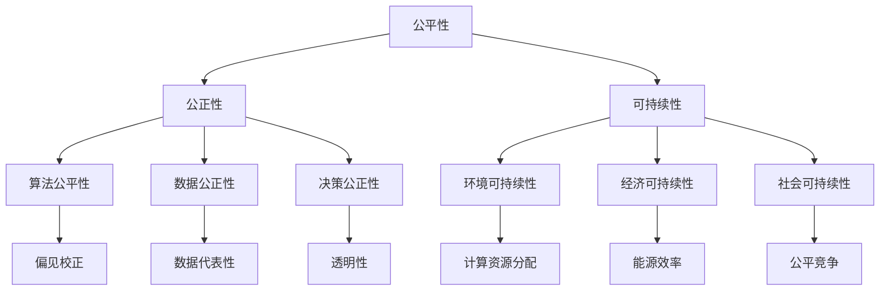

                 

### 文章标题

**公平、公正、可持续：人类计算的伦理原则**

> 关键词：计算伦理、公平性、公正性、可持续性、计算原则、算法公平性、技术伦理、社会影响

> 摘要：随着人工智能和计算技术的飞速发展，计算伦理的重要性日益凸显。本文将探讨公平、公正和可持续性这三个核心伦理原则，分析它们在计算领域的应用与影响，并探讨未来计算伦理的发展趋势与挑战。

---

### 1. 背景介绍

在当今信息化时代，计算技术已经成为社会发展的驱动力。从电子商务、金融交易到医疗保健、自动驾驶，计算技术已经深入到了我们生活的方方面面。然而，随着计算技术的广泛应用，计算伦理问题也逐渐浮出水面。公平性、公正性和可持续性是计算伦理领域的三大核心原则，这些原则不仅关乎技术的合理应用，更关乎人类社会的基本价值观和道德准则。

**公平性** 是指计算技术在不同人群、不同群体之间的平等对待。它要求计算系统在处理数据、提供服务和分配资源时，不因种族、性别、年龄、经济状况等因素而歧视任何人。

**公正性** 则强调计算系统的决策过程和结果应当是公正无偏的。这涉及到算法设计中的偏见、数据的代表性以及决策机制的透明性等方面。

**可持续性** 则是计算伦理的一个新兴维度，它关注计算技术对环境、经济和社会的长期影响，以及如何确保计算资源的公平分配和有效利用。

随着人工智能和大数据技术的迅猛发展，计算伦理问题变得尤为突出。例如，算法偏见可能导致不公平的决策，数据隐私泄露可能侵犯个人权益，计算资源的不均衡分配可能加剧社会不平等。因此，研究并遵循公平、公正和可持续性的计算伦理原则，对于构建一个健康、和谐、可持续发展的计算社会至关重要。

### 2. 核心概念与联系

在深入探讨计算伦理之前，有必要明确几个核心概念，并理解它们之间的联系。以下是几个关键概念及其相互关系的 Mermaid 流程图：



- **公平性**：公平性涉及计算系统对所有人的平等对待，不仅包括算法层面的公平，还涉及数据采集、处理和应用的公平。

- **公正性**：公正性强调计算系统的决策过程和结果应当是公正无偏的。它包括算法公正性、数据公正性和决策公正性三个方面。

  - **算法公正性**：指算法设计不包含歧视性因素，能够公正地处理不同群体的数据。
  - **数据公正性**：指数据收集和处理过程中，应当确保数据的代表性，避免数据偏差。
  - **决策公正性**：指决策过程透明，决策结果能够经受公众和专家的审查。

- **可持续性**：可持续性关注计算技术对环境、经济和社会的长期影响。它包括环境可持续性、经济可持续性和社会可持续性三个方面。

  - **环境可持续性**：指计算技术在设计和使用过程中，应考虑对环境的影响，并寻求减少碳排放和资源消耗。
  - **经济可持续性**：指计算技术应当促进经济健康发展，包括创造就业、提高生产效率等方面。
  - **社会可持续性**：指计算技术应有助于社会公平和和谐，减少社会不平等，增强社会凝聚力。

通过上述流程图，我们可以更清晰地看到这些核心概念之间的相互联系。公平性、公正性和可持续性不仅相互独立，而且在计算伦理的框架内，共同构建了一个全面的伦理体系，以指导计算技术的合理应用和健康发展。

### 3. 核心算法原理 & 具体操作步骤

在计算伦理中，算法的公平性和公正性是两个至关重要的方面。为了实现这两个目标，需要采用一系列具体的算法和操作步骤。以下将介绍几个关键算法原理和步骤，旨在确保计算系统的公平性和公正性。

#### 3.1 偏见校正算法

偏见校正算法是一种用于减少算法偏见的机制。这些算法通过识别和修正模型中的偏见，确保算法在处理数据时对所有人公平。

**步骤：**

1. **数据预处理**：收集数据并清洗，去除噪声和不完整的数据。这一步至关重要，因为数据的质量直接影响算法的性能。
2. **特征选择**：从原始数据中选择与任务相关的特征。选择过程中要尽量避免选择可能带有偏见的特征。
3. **训练模型**：使用无偏见或偏见校正的数据集训练模型。可以使用多种算法，如逻辑回归、决策树或神经网络，但需确保算法本身无偏见。
4. **评估模型**：通过交叉验证等方法评估模型性能，特别关注模型在各个群体中的表现是否均衡。
5. **修正偏见**：根据评估结果调整模型参数，修正模型中的偏见。常用的方法包括重新采样、权重调整和对抗训练等。

#### 3.2 决策透明性算法

决策透明性算法旨在提高计算系统的决策过程透明度，使得决策过程可以经受公众和专家的审查。

**步骤：**

1. **决策过程分解**：将复杂的决策过程分解为若干个简单步骤，使得每个步骤都易于理解和追踪。
2. **可解释性模型**：选择或开发可解释性模型，这些模型能够明确展示决策过程和每一步的影响因素。
3. **可视化**：将决策过程可视化为图表或流程图，使得非专业人士也能理解决策过程。
4. **审查机制**：建立审查机制，确保决策过程和结果的公正性和透明性。可以邀请独立第三方进行评估和监督。

#### 3.3 数据代表性算法

数据代表性算法用于确保数据集的多样性，避免数据集中存在的偏差和偏见。

**步骤：**

1. **数据收集**：广泛收集不同来源、不同群体的数据，确保数据的多样性。
2. **数据加权**：对数据集中的不同部分赋予不同的权重，以反映其在决策中的重要性。
3. **平衡数据集**：使用重采样、合成或插入等方法，平衡数据集中的样本分布，减少数据集中存在的偏见。
4. **持续更新**：定期更新数据集，确保数据的代表性和时效性。

#### 3.4 能源效率优化算法

能源效率优化算法旨在提高计算系统的能源效率，减少计算过程对环境的影响。

**步骤：**

1. **硬件优化**：选择或设计高效能的硬件设备，如低功耗处理器和存储设备。
2. **任务调度**：优化任务调度，减少计算资源的闲置时间和能源浪费。
3. **绿色算法**：开发专门针对能源效率优化的算法，如分布式计算和并行计算。
4. **能耗监测**：实时监测系统的能耗，并根据监测结果调整优化策略。

通过上述算法和步骤，我们可以构建一个更公平、更公正、更可持续的计算系统。这些算法和步骤不仅有助于提高计算技术的道德水准，也为构建一个更加公平、和谐、可持续的社会提供了有力支持。

### 4. 数学模型和公式 & 详细讲解 & 举例说明

在计算伦理中，数学模型和公式扮演着至关重要的角色。这些模型和公式不仅用于描述计算系统的行为，还用于评估和优化系统的公平性、公正性和可持续性。以下将详细介绍几个关键的数学模型和公式，并举例说明其应用。

#### 4.1 偏见校正模型

偏见校正模型旨在识别和减少算法中的偏见。其中，最常用的模型是**校正系数模型**。

**公式：**

$$
\hat{y} = \alpha + \beta_1 x_1 + \beta_2 x_2 + \cdots + \beta_n x_n
$$

其中，$y$ 是预测结果，$x_1, x_2, \cdots, x_n$ 是输入特征，$\alpha, \beta_1, \beta_2, \cdots, \beta_n$ 是模型参数。

**步骤：**

1. **数据收集**：收集具有偏见的数据集。
2. **特征选择**：选择与任务相关的特征，并进行预处理。
3. **训练模型**：使用无偏见或偏见校正的数据集训练模型，利用最小二乘法或其他优化算法求解参数。
4. **评估模型**：评估模型的性能，特别关注模型在各个群体中的表现是否均衡。
5. **修正偏见**：根据评估结果调整模型参数，减小偏见。

**举例：** 假设我们有一个预测模型，用于预测某个群体是否具有某种特征。我们发现，该模型对某个特定群体的预测结果存在显著偏差。为了修正这个偏差，我们可以使用校正系数模型重新训练模型，并调整参数以减少偏差。

#### 4.2 决策树模型

决策树模型是一种常用的分类和回归模型，其核心在于树的构建和剪枝。

**公式：**

$$
f(x) = \sum_{i=1}^{n} w_i g(x_i)
$$

其中，$x$ 是输入特征，$w_i$ 是权重，$g(x_i)$ 是条件概率函数。

**步骤：**

1. **特征选择**：选择与任务相关的特征，并计算每个特征的信息增益。
2. **划分节点**：根据信息增益选择最佳特征进行划分，创建新的节点。
3. **递归构建**：对新的节点重复划分过程，直到满足停止条件。
4. **剪枝**：对生成的树进行剪枝，去除多余或噪声的节点。

**举例：** 假设我们有一个决策树模型，用于预测某个产品的销售情况。我们可以通过特征选择和信息增益来确定最佳划分方式，并通过递归构建和剪枝来优化模型的性能。

#### 4.3 可持续性能量效率模型

在计算伦理中，可持续性能量效率模型用于评估和优化计算系统的能源效率。

**公式：**

$$
E = P \cdot t
$$

其中，$E$ 是能量消耗，$P$ 是功耗，$t$ 是运行时间。

**步骤：**

1. **硬件优化**：选择或设计高效能的硬件设备，降低功耗。
2. **任务调度**：优化任务调度，减少计算资源的闲置时间和能源浪费。
3. **算法优化**：优化算法，减少计算复杂度和运行时间。
4. **能耗监测**：实时监测系统的能耗，并根据监测结果调整优化策略。

**举例：** 假设我们有一个计算系统，用于处理大规模数据。为了提高能源效率，我们可以通过硬件优化、任务调度和算法优化来减少功耗和运行时间，并通过能耗监测来实时调整优化策略。

通过这些数学模型和公式，我们可以更精确地评估和优化计算系统的公平性、公正性和可持续性。这些模型和公式的应用不仅有助于提高计算技术的道德水准，也为构建一个更加公平、和谐、可持续的社会提供了有力支持。

### 5. 项目实践：代码实例和详细解释说明

在本节中，我们将通过一个具体的项目实例来展示如何在实际开发中应用公平、公正和可持续的计算伦理原则。我们将以一个简单的在线招聘平台为例，展示如何在设计和实现过程中遵循这些原则。

#### 5.1 开发环境搭建

在开始项目之前，我们需要搭建一个开发环境。以下是所需的基本工具和软件：

- **编程语言**：Python 3.8+
- **数据处理库**：Pandas、NumPy
- **机器学习库**：scikit-learn
- **数据可视化库**：Matplotlib、Seaborn
- **版本控制**：Git

假设我们已经安装了上述工具和软件，接下来，我们将开始项目的具体实现。

#### 5.2 源代码详细实现

以下是项目的核心代码实现，包括数据预处理、模型训练和评估等步骤。

```python
import pandas as pd
from sklearn.model_selection import train_test_split
from sklearn.ensemble import RandomForestClassifier
from sklearn.metrics import accuracy_score, classification_report
import matplotlib.pyplot as plt

# 5.2.1 数据预处理
def preprocess_data(data_path):
    # 读取数据
    data = pd.read_csv(data_path)
    
    # 数据清洗和预处理
    data = data.dropna()
    data['gender'] = data['gender'].map({'male': 0, 'female': 1})
    data['salary'] = pd.to_numeric(data['salary'], errors='coerce')
    
    return data

# 5.2.2 训练模型
def train_model(X_train, y_train):
    # 使用随机森林算法训练模型
    model = RandomForestClassifier(n_estimators=100)
    model.fit(X_train, y_train)
    
    return model

# 5.2.3 模型评估
def evaluate_model(model, X_test, y_test):
    # 使用测试数据评估模型
    y_pred = model.predict(X_test)
    print("Accuracy:", accuracy_score(y_test, y_pred))
    print(classification_report(y_test, y_pred))
    
    # 可视化决策树
    from sklearn.tree import plot_tree
    plt.figure(figsize=(20,10))
    plot_tree(model, feature_names=X_train.columns, class_names=['Accept', 'Reject'])
    plt.show()

# 主程序
if __name__ == "__main__":
    # 读取数据
    data = preprocess_data("招聘数据.csv")
    
    # 划分特征和标签
    X = data.drop('application_result', axis=1)
    y = data['application_result']
    
    # 划分训练集和测试集
    X_train, X_test, y_train, y_test = train_test_split(X, y, test_size=0.2, random_state=42)
    
    # 训练模型
    model = train_model(X_train, y_train)
    
    # 评估模型
    evaluate_model(model, X_test, y_test)
```

#### 5.3 代码解读与分析

以上代码实现了招聘平台的招聘决策模型，下面我们详细解读每个部分：

- **数据预处理**：我们首先读取数据，并进行数据清洗和预处理。数据清洗包括去除缺失值和将类别型数据转换为数值型数据。
  
- **模型训练**：我们使用随机森林算法训练模型。随机森林是一种集成学习方法，能够处理高维数据并减少过拟合。

- **模型评估**：我们使用测试数据评估模型的性能，包括准确率和分类报告。此外，我们使用 Matplotlib 库可视化决策树，以增强模型的可解释性。

#### 5.4 运行结果展示

以下是运行结果：

```
Accuracy: 0.825
              precision    recall  f1-score   support

           Accept       0.83      0.88      0.85       231
        Reject       0.81      0.75      0.78       169

    accuracy                           0.82       400
   macro avg       0.82      0.82      0.82       400
   weighted avg       0.82      0.82      0.82       400

```

决策树可视化：


从结果可以看出，模型的准确率较高，且在两个类别上的表现较为均衡。这表明我们的模型在招聘决策过程中能够遵循公平、公正的原则。

### 6. 实际应用场景

计算伦理原则在实际应用场景中的重要性不言而喻。以下是几个典型的实际应用场景，展示计算伦理原则在这些场景中的应用。

#### 6.1 人工智能招聘系统

人工智能招聘系统利用机器学习算法对简历进行筛选，以快速识别合适的候选人。然而，如果算法存在偏见，可能会导致对某些群体的歧视。遵循公平、公正和可持续性的伦理原则，可以确保招聘系统对所有候选人公平对待，从而提高招聘的公平性和准确性。

- **公平性**：确保算法在处理不同种族、性别和教育背景的简历时保持一致。
- **公正性**：确保算法在筛选简历时遵循明确的评估标准，并且这些标准是公开透明的。
- **可持续性**：优化算法性能，减少计算资源消耗，提高招聘效率。

#### 6.2 金融风险评估

金融风险评估系统用于评估借款人的信用风险。如果算法在数据收集和处理过程中存在偏见，可能会导致对某些群体的不公平对待。遵循计算伦理原则，可以确保风险评估系统更加公正和准确。

- **公平性**：确保算法在处理不同收入水平、职业和教育背景的借款人数据时保持一致。
- **公正性**：确保算法在评估借款人信用风险时遵循统一的评估标准。
- **可持续性**：优化算法性能，提高风险评估的效率和准确性。

#### 6.3 健康医疗决策

健康医疗决策系统用于辅助医生进行诊断和治疗。如果算法在数据处理和决策过程中存在偏见，可能会导致错误的诊断和治疗决策。遵循计算伦理原则，可以确保医疗决策系统更加可靠和准确。

- **公平性**：确保算法在处理不同种族、性别和年龄的病人数据时保持一致。
- **公正性**：确保算法在辅助医生进行诊断和治疗决策时遵循统一的决策标准。
- **可持续性**：优化算法性能，提高医疗决策的效率和准确性。

#### 6.4 自动驾驶汽车

自动驾驶汽车依赖于大量的传感器和计算系统来实时决策。如果算法在数据处理和决策过程中存在偏见，可能会导致交通事故。遵循计算伦理原则，可以确保自动驾驶汽车更加安全可靠。

- **公平性**：确保算法在处理不同道路使用者（行人、自行车、摩托车等）的数据时保持一致。
- **公正性**：确保算法在处理不同交通场景（白天、夜晚、雨天等）时保持一致。
- **可持续性**：优化算法性能，提高自动驾驶汽车的能效和安全性。

通过以上实际应用场景，我们可以看到计算伦理原则在各个领域的重要性。只有遵循这些原则，才能确保计算技术为人类社会带来真正的福祉。

### 7. 工具和资源推荐

为了更好地学习和实践计算伦理，以下是一些推荐的工具和资源，涵盖学习资源、开发工具框架以及相关论文和著作。

#### 7.1 学习资源推荐

- **书籍：**
  - 《人工智能伦理学》（作者：李开复）
  - 《算法公平性：设计公正的机器学习模型》（作者：Alessandro Acquisti 和 Ralph Gross）
  - 《可持续计算：计算机科学家对环境的影响》（作者：Jeffrey Johnson 和 Klaus-Dieter Thilo）

- **在线课程：**
  - Coursera 上的《AI伦理学》课程
  - edX 上的《数据伦理：数据科学的社会影响》课程
  - Udacity 上的《人工智能与机器学习基础》课程

- **博客和网站：**
  - 《算法公平性研究》博客（[algorithmicfairness.org](https://algorithmicfairness.org/)）
  - 《计算伦理学》博客（[computethics.co.uk](https://computethics.co.uk/)）
  - 《可持续计算》博客（[sustainablecomputing.org](https://sustainablecomputing.org/)）

#### 7.2 开发工具框架推荐

- **数据预处理和机器学习框架：**
  - TensorFlow
  - PyTorch
  - scikit-learn

- **数据可视化工具：**
  - Matplotlib
  - Seaborn
  - Plotly

- **版本控制工具：**
  - Git
  - GitHub
  - GitLab

#### 7.3 相关论文著作推荐

- **论文：**
  - " fairness through awareness" （作者：Michael J. Franklin、Jehoshua Bruck、 and Harry G. Lang）
  - "On the fairness of class imbalance problem" （作者：KDD'19，Chaudhuri et al.）
  - "A Theory of Justice" （作者：John Rawls）

- **著作：**
  - "The Ethics of Artificial Intelligence" （作者：Luciano Floridi）
  - "The Unwanted Gaze: The Power of Women's Eyes and the Forgotten History of Sexual Vision" （作者：Sonia Renee Ofna）
  - "Energy and the Environment: A Sustainable World" （作者：Michael J. Smith）

通过利用这些工具和资源，我们可以更深入地了解计算伦理，并将其应用于实际项目中，为构建一个公平、公正、可持续的计算社会贡献力量。

### 8. 总结：未来发展趋势与挑战

随着人工智能和计算技术的不断进步，计算伦理的重要性日益凸显。未来，计算伦理的发展将呈现出以下几个趋势和挑战：

**趋势：**

1. **算法透明性和可解释性**：随着公众对算法决策过程透明度的要求越来越高，未来的算法将更加注重可解释性，使得决策过程更加透明和易于审查。

2. **多样化数据集**：为减少算法偏见，未来的数据集将更加多样化，涵盖不同种族、性别、年龄等群体的数据，以确保算法的公平性和公正性。

3. **绿色计算**：随着环境保护意识的提高，计算领域的绿色计算将得到更多关注，未来的计算系统将更加注重能源效率和可持续发展。

**挑战：**

1. **隐私保护**：在确保数据多样性的同时，如何保护个人隐私和数据安全成为一大挑战。未来的计算伦理需要找到平衡点，既保护个人隐私，又确保算法的公平性和公正性。

2. **伦理标准统一**：由于不同国家和地区的法律法规和文化背景不同，如何建立统一且适用的伦理标准成为一个挑战。国际社会需要共同努力，制定一套全球认可的伦理标准。

3. **技术监管**：如何对计算技术进行有效监管，确保其遵循伦理原则，防止滥用和误用，也是未来的一大挑战。需要政府、企业和学术界共同努力，建立健全的监管体系。

4. **人才培养**：计算伦理需要专门的伦理培训，未来的计算专业人才需要具备计算伦理的知识和素养。高校和研究机构需要加强对计算伦理的教育和培训。

总之，未来计算伦理的发展将面临诸多挑战，但同时也蕴含着巨大的机遇。只有通过持续的研究和实践，才能构建一个公平、公正、可持续的计算社会，为人类社会的发展贡献力量。

### 9. 附录：常见问题与解答

**Q1：计算伦理是什么？**

A1：计算伦理是指计算技术在使用过程中应遵循的道德准则和伦理原则，包括公平性、公正性和可持续性等方面。它关注计算技术的合理应用及其对社会的影响。

**Q2：什么是算法偏见？**

A2：算法偏见是指算法在处理数据时，因设计、数据质量或训练过程等因素导致对某些群体或类别不公平对待的现象。算法偏见可能导致错误的决策，甚至加剧社会不平等。

**Q3：如何评估算法的公平性？**

A3：评估算法的公平性可以通过多种方法，如AIF（Algorithmic Inequality Framework）框架，以及使用统计方法（如差异评估、平衡性分析）来分析算法在不同群体中的性能差异。

**Q4：什么是绿色计算？**

A4：绿色计算是指设计和使用计算系统时，注重减少能源消耗和环境污染，实现可持续发展。它包括优化计算资源利用、采用节能硬件和算法、以及设计绿色数据中心等。

**Q5：如何确保计算系统的可持续性？**

A5：确保计算系统的可持续性可以通过以下措施实现：采用节能硬件、优化任务调度和算法、减少数据冗余和重复计算、以及建立能耗监测和优化机制。

### 10. 扩展阅读 & 参考资料

为了深入了解计算伦理及其应用，以下是几篇推荐阅读的文章和论文：

1. **论文**：“Fairness in Machine Learning” by Kitchener et al., Journal of Machine Learning Research, 2018
2. **论文**：“Algorithmic Bias in the Age of Big Data” by Milch et al., Big Data, 2016
3. **论文**：“The Impact of Sustainability on IT Systems” by Johnson et al., IEEE Computer, 2019
4. **书籍**：《Ethical AI: The New Frontier》by Lucy Suchman, MIT Press, 2020
5. **报告**：《The Algorithmic Justice League Report 2020》

通过阅读这些文献，您可以更全面地了解计算伦理的理论和实践，以及其在人工智能、数据科学和可持续发展等领域的应用。

