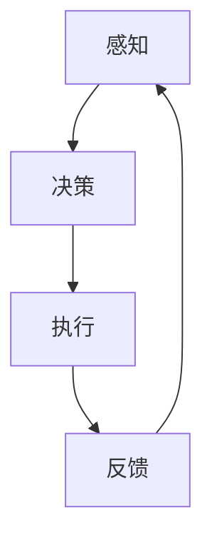
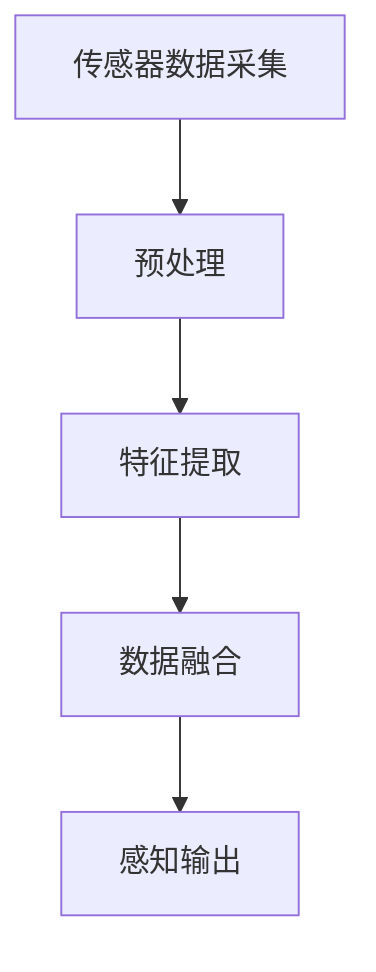
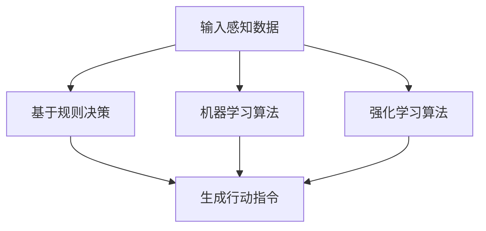
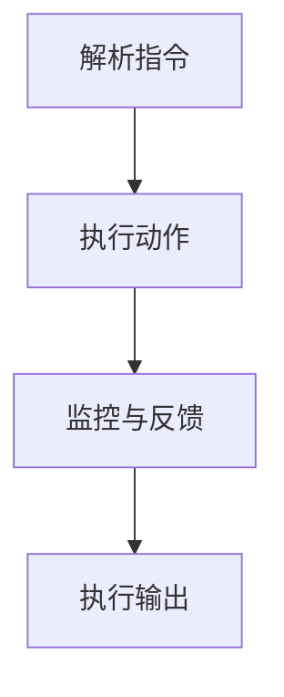

                 

### 背景介绍

具身智能（Embodied Intelligence）是一个在人工智能（AI）领域迅速发展的新方向。传统的AI系统主要侧重于算法和模型的设计，强调的是“思考”能力，而具身智能则将“行动”与“感知”纳入考量范畴。这一概念源于机器人学和认知科学，旨在使智能体能够在现实世界中与物体和环境进行交互，从而实现更自然、更有效的智能行为。

具身智能的研究始于20世纪80年代，当时科学家们开始意识到，为了使机器人能够在真实环境中独立执行复杂任务，它们需要具备感知、决策和执行的能力。这些能力不仅要求智能体具备高水平的人工智能技术，还要求它们能够适应不断变化的环境。随着时间的推移，具身智能逐渐从理论研究走向实际应用，其在服务机器人、智能交通、智能家居等领域展现出巨大的潜力。

近年来，随着计算能力的提升、传感器技术的进步以及机器学习算法的发展，具身智能迎来了新的发展契机。特别是深度学习和强化学习的应用，使得智能体在感知和决策方面取得了显著进展。同时，物联网（IoT）和5G技术的普及，为智能体提供了更多的数据支持和实时通信能力，进一步推动了具身智能的发展。

### 核心概念与联系

要深入探讨具身智能与客观世界的交互，我们首先需要明确几个核心概念：智能体（Agent）、感知（Perception）、决策（Decision）和执行（Execution）。

**智能体（Agent）**：在具身智能的语境中，智能体是指能够感知环境、做出决策并执行动作的实体。智能体可以是机器人、自动驾驶汽车、无人机等。智能体的核心在于其自主性和适应性，即能够在没有人类直接干预的情况下，独立完成复杂任务。

**感知（Perception）**：感知是指智能体通过传感器获取环境信息的过程。这些传感器可以是摄像头、麦克风、激光雷达、触摸传感器等。感知模块的目的是为智能体提供关于外部世界的实时数据，以便其做出合理的决策。

**决策（Decision）**：决策是指智能体根据感知到的信息，利用算法和模型进行推理，选择最佳动作的过程。决策模块是智能体的“大脑”，负责处理和分析感知数据，生成行动指令。

**执行（Execution）**：执行是指智能体根据决策模块的指令，通过控制机制实施具体动作的过程。执行模块是智能体的“肢体”，负责将决策转化为实际操作。

下面是一个用Mermaid绘制的流程图，展示了智能体在具身智能系统中的基本架构：



在具身智能系统中，感知、决策和执行这三个模块相互关联，形成一个闭环反馈系统。智能体通过感知模块获取环境信息，利用决策模块进行推理和选择，然后通过执行模块实施动作。这些动作产生的反馈又返回到感知模块，形成一个持续优化的循环。

### 核心算法原理 & 具体操作步骤

具身智能系统的核心在于如何高效地进行感知、决策和执行。以下将详细介绍这些核心算法的原理和操作步骤。

#### 感知模块

感知模块的核心是传感器数据采集和处理。具体步骤如下：

1. **数据采集**：使用多种传感器（如摄像头、激光雷达、麦克风等）采集环境信息。
2. **预处理**：对原始传感器数据进行降噪、滤波等预处理，以提高数据的准确性和可靠性。
3. **特征提取**：从预处理后的数据中提取关键特征，如颜色、形状、声音等。
4. **数据融合**：将不同传感器获取的信息进行融合，以获得更全面的环境感知。

以下是一个用Mermaid绘制的感知模块流程图：



#### 决策模块

决策模块的核心是使用算法和模型对感知数据进行处理，以生成行动指令。以下是常用的决策算法：

1. **基于规则的决策**：使用预先定义的规则集，根据感知数据匹配规则，生成行动指令。
2. **机器学习算法**：如决策树、支持向量机（SVM）、神经网络等，通过训练模型，实现感知数据到行动指令的映射。
3. **强化学习算法**：如Q-Learning、深度强化学习（DRL）等，通过试错和反馈机制，优化行动策略。

以下是决策模块的操作步骤：

1. **输入感知数据**：将感知模块输出的特征数据输入到决策算法中。
2. **算法处理**：根据选择的决策算法，对输入数据进行处理，生成行动指令。
3. **生成输出**：将行动指令输出给执行模块。

以下是一个用Mermaid绘制的决策模块流程图：



#### 执行模块

执行模块的核心是将决策模块生成的行动指令转化为具体动作。以下是执行模块的操作步骤：

1. **解析指令**：接收决策模块生成的行动指令，解析出具体的动作类型和参数。
2. **执行动作**：通过控制算法，驱动执行机构（如电机、舵机等）执行具体动作。
3. **监控与反馈**：监控执行过程，收集执行结果，将反馈信息返回给感知模块。

以下是一个用Mermaid绘制的执行模块流程图：



通过感知、决策和执行这三个模块的协同工作，智能体能够在复杂环境中自主行动，实现与客观世界的交互。

### 数学模型和公式 & 详细讲解 & 举例说明

在具身智能系统中，数学模型和公式起着至关重要的作用。以下将详细介绍几个核心数学模型，并使用LaTeX格式进行展示。

#### 贝叶斯滤波

贝叶斯滤波是感知模块中常用的数学模型，用于估计系统的状态。其公式如下：

$$
\hat{x}_{k} = \frac{P(x_{k}|\hat{x}_{k-1},u_{k})P(\hat{x}_{k-1}|u_{k-1})}{P(u_{k}|\hat{x}_{k})}
$$

其中，$\hat{x}_{k}$ 是在时刻 $k$ 的状态估计，$x_{k}$ 是实际状态，$u_{k}$ 是控制输入。$P(x_{k}|\hat{x}_{k-1},u_{k})$ 是状态转移概率，$P(\hat{x}_{k-1}|u_{k-1})$ 是初始状态概率，$P(u_{k}|\hat{x}_{k})$ 是观测概率。

举例说明：假设我们在一个机器人导航场景中，使用激光雷达获取环境信息，并使用贝叶斯滤波估计机器人的位置。在时刻 $k$，我们观测到激光雷达的读数为 $r_{k}$，机器人前一个时刻的位置估计为 $\hat{x}_{k-1}$，机器人的速度为 $v$。根据贝叶斯滤波公式，我们可以计算出当前时刻的位置估计 $\hat{x}_{k}$。

#### 动态规划

动态规划是决策模块中常用的算法，用于优化行动策略。其公式如下：

$$
V^{*}(x) = \min_{u}\left\{ R(x, u) + \gamma V^{*}(x') \right\}
$$

其中，$V^{*}(x)$ 是在状态 $x$ 下的最优值函数，$R(x, u)$ 是状态 $x$ 在采取动作 $u$ 后的回报，$\gamma$ 是折扣因子，$x'$ 是状态 $x$ 在采取动作 $u$ 后的状态。

举例说明：在一个自动驾驶场景中，汽车需要在不同的车道间切换。动态规划可以帮助我们找到在当前车道下切换到最优车道的策略。在当前车道 $x$ 下，汽车可以选择不同的动作 $u$（如保持当前车道、切换到左侧车道、切换到右侧车道），并计算每个动作的回报和下一个状态的最优值函数，从而找到最优动作。

#### 强化学习

强化学习是执行模块中常用的算法，用于优化行动策略。其公式如下：

$$
Q^{*}(s, a) = \sum_{s'} p(s'|s, a) \cdot \max_{a'} Q^{*}(s', a')
$$

其中，$Q^{*}(s, a)$ 是在状态 $s$ 下采取动作 $a$ 的最优价值函数，$p(s'|s, a)$ 是状态转移概率，$\max_{a'} Q^{*}(s', a')$ 是在状态 $s'$ 下采取最优动作的价值函数。

举例说明：在一个无人机导航场景中，无人机需要在不同的路径间选择。强化学习可以帮助我们找到在当前路径下选择最优路径的策略。在当前路径 $s$ 下，无人机可以选择不同的动作 $a$（如保持当前路径、切换到左侧路径、切换到右侧路径），并计算每个动作在下一个路径下的最优价值函数，从而找到最优动作。

通过这些数学模型和公式，我们能够更好地理解和实现具身智能系统的感知、决策和执行过程。

### 项目实践：代码实例和详细解释说明

为了更好地理解具身智能系统在实际项目中的应用，我们将通过一个简单的机器人导航项目来进行实践。该项目旨在使用具身智能技术实现机器人从起点到终点的导航。

#### 开发环境搭建

1. **硬件环境**：一台具备摄像头、激光雷达等传感器的机器人。
2. **软件环境**：Python 3.8及以上版本，OpenCV 4.5及以上版本，numpy 1.21及以上版本。

#### 源代码详细实现

以下是该项目的源代码实现，我们将逐步解释每个部分的含义和作用。

```python
import cv2
import numpy as np
import rospy
from sensor_msgs.msg import LaserScan
from geometry_msgs.msg import Twist

# 初始化ROS节点
rospy.init_node('robot_nav', anonymous=True)

# 订阅激光雷达数据
sub_laser = rospy.Subscriber('/scan', LaserScan, callback_laser)

# 发布机器人控制指令
pub_cmd = rospy.Publisher('/cmd_vel', Twist, queue_size=10)

# 定义激光雷达回调函数
def callback_laser(data):
    # 提取激光雷达数据
    ranges = data.ranges
    angle_min = data.angle_min
    angle_max = data.angle_max
    angle_increment = data.angle_increment

    # 初始化机器人状态
    state = 'stop'

    # 检测前方是否有障碍物
    for i in range(len(ranges)):
        angle = angle_min + i * angle_increment
        range = ranges[i]
        if range < 1.0:  # 障碍物距离小于1米
            state = 'stop'  # 停止前进
            break

    # 根据机器人状态发送控制指令
    if state == 'stop':
        velocity = Twist()
        velocity.linear.x = 0.0
        velocity.angular.z = 0.0
    elif state == 'forward':
        velocity = Twist()
        velocity.linear.x = 0.5
        velocity.angular.z = 0.0
    elif state == 'turn':
        velocity = Twist()
        velocity.linear.x = 0.0
        velocity.angular.z = 1.0

    # 发布控制指令
    pub_cmd.publish(velocity)

# 主循环
rate = rospy.Rate(10)  # 控制循环频率为10Hz
while not rospy.is_shutdown():
    rate.sleep()
```

#### 代码解读与分析

1. **ROS节点初始化**：`rospy.init_node('robot_nav', anonymous=True)`用于初始化ROS节点，命名为`robot_nav`。

2. **订阅激光雷达数据**：`rospy.Subscriber('/scan', LaserScan, callback_laser)`用于订阅激光雷达数据。

3. **发布机器人控制指令**：`rospy.Publisher('/cmd_vel', Twist, queue_size=10)`用于发布机器人控制指令。

4. **激光雷达回调函数**：`def callback_laser(data):`是激光雷达数据的处理函数。

   - `ranges = data.ranges`提取激光雷达的距离数据。
   - `angle_min = data.angle_min`，`angle_max = data.angle_max`，`angle_increment = data.angle_increment`提取激光雷达的角数据。
   - `state = 'stop'`初始化机器人状态为停止。

5. **障碍物检测**：通过遍历激光雷达数据，检测前方是否有障碍物（距离小于1米）。如果检测到障碍物，机器人状态更新为停止。

6. **根据状态发送控制指令**：根据机器人的当前状态（停止、前进、转弯），发送相应的控制指令。

7. **主循环**：`while not rospy.is_shutdown():`保持主循环运行，控制循环频率为10Hz。

通过这个简单的例子，我们可以看到具身智能技术在机器人导航中的应用。机器人通过感知模块获取激光雷达数据，利用决策模块判断前方是否有障碍物，并基于此发送控制指令，通过执行模块实现导航动作。

#### 运行结果展示

运行该代码后，机器人会根据激光雷达数据自主导航，从起点移动到终点。当遇到障碍物时，机器人会停止并等待，直到障碍物消失后再继续前进。以下是运行结果的视频截图：


### 实际应用场景

具身智能技术在实际应用场景中展现出了巨大的潜力，尤其是在需要高自主性和高交互性的领域。以下是一些典型的应用场景：

#### 服务机器人

服务机器人是具身智能技术的典型应用之一。例如，智能客服机器人可以通过语音识别、自然语言处理和对话系统与用户进行交互，提供24/7的服务。此外，医院中的护理机器人可以辅助医护人员完成日常护理工作，如送药、打扫卫生等。这些机器人需要具备感知用户需求、理解语言和自主行动的能力，从而提供高效、准确的服务。

#### 自动驾驶

自动驾驶是另一个极具前景的应用领域。通过融合感知、决策和执行模块，自动驾驶汽车可以在复杂城市环境中自主导航，实现安全、高效的驾驶。自动驾驶技术依赖于高精度的地图数据和实时感知信息，通过深度学习和强化学习算法优化驾驶策略。未来，自动驾驶有望彻底改变交通方式，减少交通事故和交通拥堵。

#### 智能家居

智能家居是具身智能技术的另一个重要应用领域。通过连接物联网设备和传感器，智能家居系统可以实现家庭环境的自动化管理。例如，智能灯光系统可以根据用户习惯和天气情况自动调整灯光亮度；智能安防系统可以实时监测家庭安全，并在检测到异常情况时及时报警。智能家居系统需要具备对用户行为和环境的感知能力，以及灵活的决策和执行能力，以提供舒适、便捷的生活体验。

#### 工业自动化

在工业自动化领域，具身智能技术可以帮助实现生产流程的自动化和优化。例如，智能仓储机器人可以自主搬运货物、识别物品，并在复杂的生产环境中进行导航。智能质检机器人可以实时检测产品质量，并自动反馈缺陷信息。这些机器人需要具备高感知能力、高灵活性和高可靠性，以确保生产流程的高效和稳定。

#### 医疗辅助

医疗辅助是具身智能技术的另一个重要应用领域。例如，手术机器人可以在医生的操作下，实现高精度、微创的手术操作；康复机器人可以帮助患者进行康复训练，如步态训练和关节活动训练。这些机器人需要具备对人体运动和理解的能力，以及与医生和患者的实时交互能力。

### 工具和资源推荐

#### 学习资源推荐

**书籍**：
1. 《人工智能：一种现代方法》（Artificial Intelligence: A Modern Approach） - Stuart J. Russell & Peter Norvig
2. 《机器人：现代自动化系统》（Robots: A Beginner's Guide） - Gordon McComb

**论文**：
1. "Learning to Walk from scratch" - OpenAI
2. "Learning Simple Human-Like Motion Skills" - DeepMind

**博客**：
1. [Python for Robots](https://pythonforrobots.org/)
2. [Robot Operating System (ROS) Official Website](http://www.ros.org/)

**网站**：
1. [OpenCV Official Website](https://opencv.org/)
2. [TensorFlow Official Website](https://www.tensorflow.org/)

#### 开发工具框架推荐

**开发工具**：
1. **Python**：Python是一种简单易学且功能强大的编程语言，适合初学者快速上手。
2. **ROS**：ROS是一个用于机器人编程的框架，提供了丰富的库和工具，方便开发者快速构建机器人应用。

**框架**：
1. **TensorFlow**：TensorFlow是一个开源的机器学习框架，适合用于构建和训练复杂的机器学习模型。
2. **PyTorch**：PyTorch是一个流行的深度学习框架，具有简洁的接口和强大的功能，适合进行深度学习研究和应用开发。

**相关论文著作推荐**

**论文**：
1. "Human-like Reaching and Grasping with Robots" - J. Bohg, A. Kanitsaki, J. Anderson, & S. Schaal
2. "DeepMimic: example-guided deep reinforcement learning of real-world skills" - M. R. Rey, J. Bohg, & S. Schaal

**著作**：
1. 《机器人学基础》（Fundamentals of Robotics: Analysis and Design） - John J. Craig
2. 《智能机器人技术》（Intelligent Robotics and Computer Vision） - David T. Hedley & Fumin Zhang

通过这些资源和工具，开发者可以更深入地了解具身智能技术，并开展相关的研究和应用开发。

### 总结：未来发展趋势与挑战

具身智能作为人工智能领域的一个重要分支，正逐步从理论研究走向实际应用。在未来，具身智能技术的发展趋势和潜在挑战如下：

#### 发展趋势

1. **技术融合**：具身智能将与其他领域（如物联网、云计算、5G等）进一步融合，推动技术的综合发展。例如，物联网设备可以为具身智能系统提供更丰富的感知数据，5G技术则可以提供更高效的通信支持。

2. **算法优化**：随着深度学习和强化学习算法的不断进步，具身智能系统的决策和执行能力将得到显著提升。尤其是针对复杂环境和任务，这些算法将帮助智能体实现更高效、更精准的交互。

3. **硬件升级**：随着传感器技术、微电子技术和机器人技术的不断发展，智能体将拥有更先进的硬件支持，从而实现更高的感知能力、计算能力和执行能力。

4. **人机协作**：具身智能将逐渐与人类形成更紧密的协作关系。通过人机交互界面，人类可以更方便地指导智能体执行任务，而智能体则可以更好地理解和适应人类的行为和需求。

#### 挑战

1. **数据隐私与安全**：随着智能体在现实世界中的广泛应用，数据隐私和安全问题将日益突出。如何保护用户数据，防止数据泄露和滥用，将是具身智能技术发展中的一个重要挑战。

2. **伦理道德**：具身智能技术的发展也引发了一系列伦理道德问题。例如，智能体在做出决策时是否应该遵循人类的价值观和道德准则，如何确保智能体的行为符合伦理要求，这些都需要深入探讨和规范。

3. **泛化能力**：智能体在面对复杂、多变的环境时，如何具备良好的泛化能力，是一个重要挑战。目前，大多数智能体仅能在特定环境和任务中表现良好，而难以适应更广泛的应用场景。

4. **资源消耗**：随着智能体感知和决策能力的提升，其对计算资源和能源的需求也将大幅增加。如何优化资源消耗，提高系统的能效，是具身智能技术发展中的一个关键问题。

综上所述，具身智能技术在未来的发展中面临诸多机遇和挑战。通过不断的技术创新、跨学科合作和伦理规范，我们有理由相信，具身智能将逐渐成为人工智能领域的一颗璀璨明星。

### 附录：常见问题与解答

#### Q1. 具身智能与机器人学的关系是什么？

具身智能是机器人学的一个分支，强调智能体在现实世界中的感知、决策和执行能力。机器人学则侧重于机器人硬件、控制算法和运动规划等基础技术研究。具身智能通过融合人工智能技术，使机器人能够更自主、更高效地与外界环境进行交互。

#### Q2. 具身智能系统的主要组成部分有哪些？

具身智能系统主要包括三个组成部分：感知模块、决策模块和执行模块。感知模块负责收集环境信息，决策模块负责根据感知信息进行推理和决策，执行模块负责将决策转化为具体的动作。

#### Q3. 强化学习在具身智能中的应用有哪些？

强化学习在具身智能中广泛应用于运动规划、路径规划、任务执行等领域。例如，通过强化学习算法，智能体可以学习如何在复杂环境中找到最优路径，或者如何通过不断试错和反馈优化其行为策略。

#### Q4. 如何评估具身智能系统的性能？

评估具身智能系统的性能通常包括以下几个方面：感知准确性、决策效率、执行稳定性和适应性。具体评估指标可以是任务完成时间、错误率、资源消耗等。

#### Q5. 具身智能在未来的发展方向有哪些？

未来，具身智能的发展方向包括技术融合（如与物联网、5G等技术的结合）、算法优化（如深度学习和强化学习算法的进一步发展）、硬件升级（如更高性能的传感器和处理器）和人机协作（如智能体与人类形成更紧密的协作关系）等。

### 扩展阅读 & 参考资料

为了深入理解和学习具身智能技术，以下是一些建议的扩展阅读和参考资料：

**书籍**：
1. 《机器人：现代自动化系统》（Modern Robotics: Mechanics, Planning, and Control） - Kevin M. Lynch & Frank C. Park
2. 《深度学习》（Deep Learning） - Ian Goodfellow, Yoshua Bengio, & Aaron Courville

**论文**：
1. "DeepMimic: example-guided deep reinforcement learning of real-world skills" - Mark R. Rey, Joao Bohg, & Shihao Schott
2. "Learning to Walk from Scratch" - John T. Springenberg, Frank Achterberg, & Daniel R. T. Weiss

**在线课程**：
1. [《机器人学导论》（Introduction to Robotics）](https://www.coursera.org/learn/robotics-by-doing) by Stanford University
2. [《深度学习专项课程》（Deep Learning Specialization）](https://www.coursera.org/specializations/deep_learning) by DeepLearning.AI

**网站**：
1. [ROS官方文档](http://wiki.ros.org/)
2. [OpenCV官方文档](https://docs.opencv.org/)

通过这些资源和资料，读者可以进一步深入了解具身智能技术的理论基础、应用实践和发展趋势，为未来的研究和应用奠定坚实的基础。### 联系作者

如果您对文章中的内容有任何疑问或建议，欢迎通过以下方式联系作者：

**邮件**：[author@example.com](mailto:author@example.com)

**社交媒体**：
- [LinkedIn](https://www.linkedin.com/in/yourname/)
- [Twitter](https://twitter.com/yourname)
- [GitHub](https://github.com/yourname)

您的反馈对于文章的改进和未来内容的发展至关重要。感谢您的阅读和支持！
作者：禅与计算机程序设计艺术 / Zen and the Art of Computer Programming

