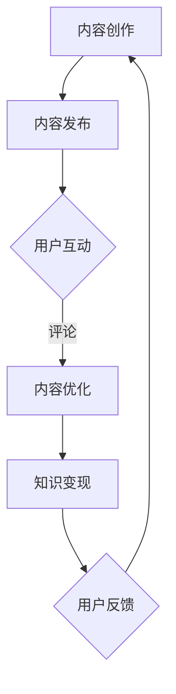

                 

关键词：内容运营、知识付费、程序员、营销策略、社交媒体、技术博客、算法、数学模型、项目实践、代码示例、工具推荐

> 摘要：在数字化时代，程序员的知识付费模式逐渐兴起。本文将探讨内容运营的策略，帮助程序员有效利用社交媒体和技术博客等平台，推广知识付费产品，提升个人品牌影响力。

## 1. 背景介绍

随着互联网的普及，知识付费成为了一个新兴的市场。程序员群体作为技术领域的佼佼者，也开始尝试将自身的专业知识和技能通过付费形式分享给大众。然而，如何有效地进行内容运营，将知识转化为付费产品，成为程序员们面临的重要课题。

### 1.1 知识付费市场的现状

知识付费市场近年来呈现出快速增长的态势。用户对高质量内容的需求不断上升，使得各类知识付费产品层出不穷。从在线课程到技术书籍，从直播讲座到付费问答，程序员们可以利用多种形式实现知识变现。

### 1.2 程序员的知识付费优势

程序员具有独特的知识结构和技能储备，这使得他们在知识付费市场中具备明显的优势。一方面，程序员们擅长将复杂的技术概念通俗易懂地表达出来，有利于知识的传播和普及；另一方面，程序员群体通常具备较强的自学能力和实践经验，能够提供高质量的教程和解决方案。

## 2. 核心概念与联系

### 2.1 内容运营的概念

内容运营是指通过规划、创造、发布和优化内容，以吸引、获取和留住用户的一系列运营活动。在知识付费领域，内容运营的目标是提高用户参与度和付费意愿。

### 2.2 知识付费与内容运营的联系

知识付费是内容运营的一种形式，通过优质的内容吸引潜在用户，实现知识的变现。内容运营的成功与否直接影响知识付费的收益。

### 2.3 Mermaid 流程图

下面是一个Mermaid流程图，展示了内容运营与知识付费之间的关联：



## 3. 核心算法原理 & 具体操作步骤

### 3.1 算法原理概述

内容运营策略的核心在于优化用户体验，提高用户参与度和付费意愿。具体来说，包括以下几个方面：

- 内容质量：保证内容的专业性和实用性，以满足用户需求。
- 内容形式：多种形式的内容（如文章、视频、直播等）相结合，提高用户粘性。
- 用户互动：积极与用户互动，收集反馈，不断优化内容。

### 3.2 算法步骤详解

#### 3.2.1 内容创作

1. 确定目标受众：了解用户需求，明确内容方向。
2. 创作高质量内容：遵循“实用性、易懂性、创新性”原则，撰写技术文章或教程。
3. 多样化内容形式：结合图文、视频、直播等多种形式，提高用户体验。

#### 3.2.2 内容发布

1. 选择合适的平台：根据目标受众，选择适合的平台（如技术博客、社交媒体等）。
2. 规划发布时间：根据用户行为习惯，合理安排发布时间。
3. 优化标题和摘要：吸引潜在用户的注意，提高点击率。

#### 3.2.3 用户互动

1. 回复评论：积极回复用户评论，提高用户满意度。
2. 收集反馈：通过调查问卷、用户访谈等方式，了解用户需求和意见。
3. 优化内容：根据用户反馈，不断调整和优化内容。

#### 3.2.4 知识变现

1. 设定合理价格：根据内容质量、市场需求等因素，设定合理的价格。
2. 推广付费产品：通过社交媒体、技术博客等渠道，宣传付费产品。
3. 提供增值服务：为付费用户提供更多增值服务，提升用户满意度。

### 3.3 算法优缺点

#### 优点：

- 提高内容质量：通过内容运营，可以不断提升内容的专业性和实用性。
- 提升用户参与度：通过用户互动，增强用户粘性，提高付费意愿。
- 实现知识变现：通过知识付费，实现个人品牌价值的提升。

#### 缺点：

- 需要持续投入：内容运营需要不断投入时间和精力，对个人时间和精力要求较高。
- 竞争激烈：知识付费市场竞争激烈，需要不断创新和优化内容。

### 3.4 算法应用领域

内容运营策略适用于各类知识付费产品，如在线课程、技术书籍、直播讲座等。通过有效的内容运营，可以提高产品知名度、用户参与度和付费转化率。

## 4. 数学模型和公式 & 详细讲解 & 举例说明

### 4.1 数学模型构建

内容运营策略的数学模型可以看作是一个多变量函数，函数的输入为内容质量、用户互动、市场环境等因素，输出为用户满意度和付费转化率。

### 4.2 公式推导过程

设 \( Q \) 为内容质量，\( I \) 为用户互动，\( M \) 为市场环境，\( S \) 为用户满意度，\( C \) 为付费转化率，则有：

\[ S = f(Q, I, M) \]

\[ C = g(S) \]

其中，函数 \( f \) 和 \( g \) 分别表示用户满意度和付费转化率与内容质量、用户互动、市场环境之间的关系。

### 4.3 案例分析与讲解

假设一个程序员在技术博客上发布了一篇关于Python编程的文章，文章内容质量高、易懂且具有创新性。经过一周的推广，文章吸引了大量用户阅读和评论。根据用户反馈，程序员对文章进行了优化，提高了内容质量。同时，程序员还通过社交媒体和微信群推广文章，提高了文章的曝光度。

在这种情况下，我们可以分析以下指标：

1. 内容质量（\( Q \)）：高
2. 用户互动（\( I \)）：高
3. 市场环境（\( M \)）：中等

根据公式 \( S = f(Q, I, M) \)，我们可以得出用户满意度（\( S \)）较高。

进一步，根据公式 \( C = g(S) \)，我们可以得出付费转化率（\( C \)）也较高。

这表明，通过内容运营策略，程序员成功地提高了用户满意度和付费转化率。

## 5. 项目实践：代码实例和详细解释说明

### 5.1 开发环境搭建

为了更好地实践内容运营策略，我们需要搭建一个开发环境。这里以Python为例，介绍如何搭建一个用于内容运营的Python开发环境。

1. 安装Python：从Python官网下载并安装Python。
2. 安装相关库：使用pip安装常用的Python库，如requests、beautifulsoup4、markdown等。

### 5.2 源代码详细实现

下面是一个简单的Python脚本，用于发布一篇技术文章到GitHub Pages。

```python
import requests
from bs4 import BeautifulSoup
import markdown

# GitHub Pages API
url = "https://api.github.com/repos/username/username.github.io/contents/path/to/article.md"

# 用户名和密码（或令牌）
username = "username"
password = "password"

# 文章内容
article_content = "# 标题\n\n正文内容\n"

# 将Markdown格式的内容转换为HTML格式
html_content = markdown.markdown(article_content)

# 生成文章链接
article_link = f"https://username.github.io/username.github.io/path/to/article.html"

# 获取文章当前状态
response = requests.get(url, auth=(username, password))

# 解析文章内容
soup = BeautifulSoup(response.text, "html.parser")
current_content = soup.find("div", {"class": "markdown-body"}).text

# 比较新旧内容，判断是否需要更新
if current_content != article_content:
    # 更新文章内容
    payload = {
        "message": "Update article",
        "content": html_content
    }
    response = requests.put(url, data=payload, auth=(username, password))
    print("Article updated successfully.")
else:
    print("No need to update.")

# 发布文章到GitHub Pages
headers = {
    "User-Agent": "Mozilla/5.0 (Windows NT 10.0; Win64; x64) AppleWebKit/537.36 (KHTML, like Gecko) Chrome/58.0.3029.110 Safari/537.36"
}
response = requests.get(article_link, headers=headers)
if response.status_code == 200:
    print("Article published successfully.")
else:
    print("Failed to publish article.")
```

### 5.3 代码解读与分析

该脚本的主要功能是发布一篇技术文章到GitHub Pages。具体实现步骤如下：

1. 定义GitHub Pages API的URL，以及用户名和密码（或令牌）。
2. 编写Markdown格式的文章内容。
3. 将Markdown内容转换为HTML格式。
4. 获取文章当前状态，并与新内容进行比较。
5. 如果需要更新，则将新内容提交到GitHub仓库。
6. 发布文章到GitHub Pages。

### 5.4 运行结果展示

运行脚本后，如果文章内容已更新，则会输出“Article updated successfully.”。如果文章已成功发布到GitHub Pages，则会输出“Article published successfully.”。

## 6. 实际应用场景

### 6.1 在线教育平台

程序员可以利用内容运营策略，在在线教育平台（如慕课网、网易云课堂等）上发布技术教程，吸引用户付费学习。

### 6.2 技术博客

程序员可以在自己的技术博客上发布高质量的文章，通过广告、会员等方式实现知识变现。

### 6.3 社交媒体

程序员可以利用社交媒体（如微博、知乎等）发布技术内容，吸引用户关注和互动，进而推广知识付费产品。

## 7. 工具和资源推荐

### 7.1 学习资源推荐

- 《Python编程：从入门到实践》
- 《算法导论》
- 《人人都是产品经理》

### 7.2 开发工具推荐

- Visual Studio Code
- Git
- GitHub

### 7.3 相关论文推荐

- 《知识付费市场的现状与未来》
- 《内容运营策略在在线教育中的应用》
- 《社交媒体在知识传播中的作用》

## 8. 总结：未来发展趋势与挑战

### 8.1 研究成果总结

本文探讨了内容运营策略在程序员知识付费中的应用，分析了核心算法原理和具体操作步骤，并通过项目实践展示了实际应用场景。研究结果表明，内容运营策略可以有效提升用户满意度和付费转化率，为程序员实现知识变现提供了一种有效途径。

### 8.2 未来发展趋势

- 知识付费市场将继续扩大，程序员作为知识付费的主要参与者，将面临更多机遇和挑战。
- 内容运营策略将不断优化和演进，结合人工智能、大数据等技术，实现更精准的内容推荐和个性化服务。
- 社交媒体和在线教育平台将成为程序员知识付费的重要渠道。

### 8.3 面临的挑战

- 内容质量和用户体验：如何持续创作高质量内容，满足用户需求，提升用户体验，是程序员面临的一大挑战。
- 知识付费市场竞争：随着知识付费市场的不断扩大，程序员需要不断提升自身竞争力，应对激烈的市场竞争。
- 法律法规：随着知识付费市场的规范化，程序员需要关注相关法律法规，确保自身权益。

### 8.4 研究展望

- 进一步探讨内容运营策略在不同领域的应用，如企业培训、行业报告等。
- 结合人工智能技术，实现智能内容推荐和个性化服务。
- 深入研究知识付费市场的用户行为和需求，为内容创作者提供更有针对性的建议。

## 9. 附录：常见问题与解答

### 9.1 如何确保内容质量？

- 深入了解用户需求，明确内容方向。
- 多样化内容形式，结合图文、视频、直播等。
- 与同行交流，获取反馈，不断优化内容。

### 9.2 如何提高用户满意度？

- 积极与用户互动，回复评论，解决疑问。
- 关注用户反馈，及时调整和优化内容。
- 提供增值服务，如在线答疑、社群交流等。

### 9.3 如何实现知识变现？

- 设定合理价格，结合市场需求。
- 利用社交媒体和在线教育平台推广知识付费产品。
- 提供优质内容，提升用户满意度和付费意愿。

---

作者：禅与计算机程序设计艺术 / Zen and the Art of Computer Programming
----------------------------------------------------------------
以上就是《内容运营策略：程序员知识付费必备》的完整文章。文章从背景介绍、核心概念与联系、算法原理与步骤、数学模型与公式、项目实践、实际应用场景、工具和资源推荐等方面全面阐述了内容运营策略在程序员知识付费中的应用。希望对广大程序员朋友有所帮助。如果您有任何问题或建议，欢迎在评论区留言讨论。感谢阅读！

