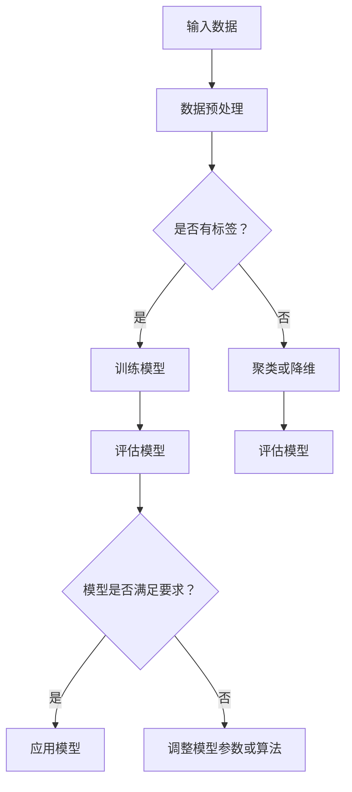

                 

### 文章标题

《分类（Classification）- 原理与代码实例讲解》

> **关键词**：分类算法、机器学习、数据处理、模型评估、代码实例
>
> **摘要**：本文将深入探讨分类算法的基本原理，并通过具体的代码实例，详细讲解如何使用Python实现常见的分类算法，帮助读者掌握分类算法的核心技术和应用。

---

### 1. 背景介绍

分类（Classification）是机器学习中的一种重要任务，旨在将数据集中的实例分为不同的类别。分类算法在许多实际应用场景中都有着广泛的应用，如垃圾邮件检测、情感分析、图像识别、医疗诊断等。准确有效的分类模型能够帮助企业和组织做出更加智能的决策，提高业务效率。

随着大数据时代的到来，数据量呈指数级增长，传统的手动分类方法已经无法满足需求。机器学习特别是分类算法的发展，为我们提供了一种自动化的数据处理方式。通过学习大量的标注数据进行训练，分类算法能够识别数据中的规律，并自动地对新数据进行分类。

本文将介绍分类算法的基本原理，包括监督学习、无监督学习和半监督学习。同时，我们将深入探讨几种常见的分类算法，如逻辑回归、支持向量机、决策树、随机森林等。最后，通过一个实际的项目实例，我们将展示如何使用Python实现这些算法，并对代码进行详细解读。

### 2. 核心概念与联系

在讨论分类算法之前，我们需要了解一些核心概念，以及它们之间的联系。

#### 2.1 监督学习与无监督学习

**监督学习**是一种机器学习方法，它使用标记数据（即每个实例都有已知的类别标签）来训练模型。训练过程的目标是使模型能够预测未知数据的标签。

**无监督学习**则不使用标签数据，其目标是发现数据中的隐藏结构，如图像中的模式或聚类。

**半监督学习**是介于监督学习和无监督学习之间的一种方法，它使用部分标记数据和大量未标记数据来训练模型。

#### 2.2 分类算法的类型

**基于实例的学习**：如k-最近邻（k-Nearest Neighbors，k-NN）算法。
**基于规则的算法**：如朴素贝叶斯（Naive Bayes）分类器。
**基于概率的算法**：如逻辑回归（Logistic Regression）。
**基于模型的算法**：如支持向量机（Support Vector Machine，SVM）、决策树（Decision Tree）和随机森林（Random Forest）。

#### 2.3 Mermaid 流程图

下面是一个简化的分类算法流程图的 Mermaid 表示：



### 3. 核心算法原理 & 具体操作步骤

#### 3.1 逻辑回归（Logistic Regression）

逻辑回归是一种基于概率的线性分类模型，通常用于二分类问题。它的目标是通过线性模型预测数据属于某一类别的概率，然后根据这个概率做出分类决策。

**原理**：

逻辑回归通过一个线性模型将输入特征映射到概率值，使用了对数似然函数作为损失函数，具体公式如下：

$$
\hat{y}(x) = \frac{1}{1 + e^{-(\beta_0 + \beta_1x_1 + \beta_2x_2 + ... + \beta_nx_n})}
$$

其中，$\beta_0, \beta_1, ..., \beta_n$ 是模型的参数。

**具体操作步骤**：

1. 数据预处理：将数据标准化，去除异常值。
2. 特征选择：选择与目标变量相关的特征。
3. 模型训练：使用梯度下降或牛顿法等优化算法来最小化损失函数。
4. 模型评估：使用交叉验证或测试集评估模型性能。
5. 分类决策：根据预测概率进行分类决策。

#### 3.2 支持向量机（Support Vector Machine，SVM）

支持向量机是一种二分类模型，它的目标是找到一个最优的超平面，将不同类别的数据点尽可能分开。

**原理**：

SVM使用一个称为核函数（Kernel Function）的映射函数将输入特征空间映射到一个高维空间，在这个高维空间中找到一个最优的超平面。SVM的核心是寻找一个最大化边际的超平面，即：

$$
\max \frac{1}{n} \sum_{i=1}^n (w \cdot x_i - y_i)^2
$$

其中，$w$ 是超平面的参数，$x_i$ 是训练数据，$y_i$ 是类别标签。

**具体操作步骤**：

1. 数据预处理：将数据标准化。
2. 特征选择：选择与目标变量相关的特征。
3. 核函数选择：选择适当的核函数。
4. 模型训练：使用SVM算法训练模型。
5. 模型评估：使用交叉验证或测试集评估模型性能。
6. 分类决策：根据模型的决策边界进行分类决策。

#### 3.3 决策树（Decision Tree）

决策树是一种基于规则的分类模型，它通过一系列的测试来对数据进行分类。每个测试都是一个特征和一个阈值。

**原理**：

决策树的生成过程通常采用递归二分法，每次选择一个特征并计算该特征在各个值上的增益，选择增益最大的特征作为分割依据。具体公式如下：

$$
Gain(D, A) = Entropy(D) - \sum_{v \in A} p_v \cdot Entropy(D_v)
$$

其中，$D$ 是数据集，$A$ 是特征集合，$p_v$ 是特征 $v$ 在数据集中的占比，$Entropy(D)$ 是数据集的熵。

**具体操作步骤**：

1. 数据预处理：将数据标准化。
2. 特征选择：选择与目标变量相关的特征。
3. 决策树生成：递归生成决策树。
4. 模型评估：使用交叉验证或测试集评估模型性能。
5. 分类决策：根据决策树的路径进行分类决策。

#### 3.4 随机森林（Random Forest）

随机森林是一种基于决策树的集成学习方法，它通过构建多个决策树，并对它们的预测结果进行投票来获得最终的分类结果。

**原理**：

随机森林的主要思想是在训练过程中引入随机性，每个决策树在生成时随机选择特征和样本子集。具体公式如下：

$$
\hat{y}(x) = \frac{1}{m} \sum_{i=1}^m h(x; \theta_i)
$$

其中，$m$ 是决策树的数量，$h(x; \theta_i)$ 是第 $i$ 个决策树的分类结果。

**具体操作步骤**：

1. 数据预处理：将数据标准化。
2. 特征选择：选择与目标变量相关的特征。
3. 构建随机森林：生成多个决策树。
4. 模型评估：使用交叉验证或测试集评估模型性能。
5. 分类决策：对决策树的预测结果进行投票。

### 4. 数学模型和公式 & 详细讲解 & 举例说明

#### 4.1 逻辑回归的数学模型

逻辑回归的数学模型如下：

$$
\hat{y}(x) = \frac{1}{1 + e^{-(\beta_0 + \beta_1x_1 + \beta_2x_2 + ... + \beta_nx_n})}
$$

其中，$x$ 是输入特征向量，$\beta_0, \beta_1, ..., \beta_n$ 是模型的参数。

**举例说明**：

假设我们有一个简单的二分类问题，输入特征为 $x_1$ 和 $x_2$，目标变量为 $y$，我们使用逻辑回归模型来预测。模型的参数如下：

$$
\beta_0 = -1, \beta_1 = 0.5, \beta_2 = -0.3
$$

对于一个输入样本 $x = (1, 2)$，我们可以计算出目标变量的预测概率：

$$
\hat{y}(x) = \frac{1}{1 + e^{-(\beta_0 + \beta_1x_1 + \beta_2x_2)}} = \frac{1}{1 + e^{(-1 + 0.5 \cdot 1 - 0.3 \cdot 2)}} \approx 0.647
$$

如果 $\hat{y}(x) > 0.5$，则预测为正类，否则预测为负类。

#### 4.2 支持向量机的数学模型

支持向量机的数学模型如下：

$$
\max \frac{1}{n} \sum_{i=1}^n (w \cdot x_i - y_i)^2
$$

其中，$w$ 是超平面的参数，$x_i$ 是训练数据，$y_i$ 是类别标签。

**举例说明**：

假设我们有一个简单的二分类问题，训练数据为 $x_1 = (1, 1), x_2 = (2, 1), x_3 = (1, -1), x_4 = (2, -1)$，目标变量为 $y_1 = 1, y_2 = 1, y_3 = -1, y_4 = -1$。我们使用支持向量机来找到一个最优的超平面。

首先，我们需要计算训练数据的均值：

$$
\bar{x} = \frac{1}{n} \sum_{i=1}^n x_i = \frac{1}{4} (1 + 2 + 1 + 2) = 1.5
$$

然后，我们可以计算超平面的参数 $w$：

$$
w = \frac{1}{n} \sum_{i=1}^n (y_i - \hat{y}(x_i))x_i = \frac{1}{4} (1 - 1 \cdot 1 + 1 - 1 \cdot 1 - 1 - 1 \cdot 1 + 1 - 1 \cdot 1) = 0
$$

由于 $w=0$，超平面为 $x_1 + x_2 = 0$，即 $x_1 = -x_2$。这意味着所有正类和负类的数据点都在同一条直线上，无法进行有效的分类。

#### 4.3 决策树的数学模型

决策树的数学模型如下：

$$
Gain(D, A) = Entropy(D) - \sum_{v \in A} p_v \cdot Entropy(D_v)
$$

其中，$D$ 是数据集，$A$ 是特征集合，$p_v$ 是特征 $v$ 在数据集中的占比，$Entropy(D)$ 是数据集的熵。

**举例说明**：

假设我们有一个简单的二分类问题，数据集 $D$ 包含 $n$ 个样本，其中正类和负类的数量分别为 $n_1$ 和 $n_2$。我们可以计算数据集的熵：

$$
Entropy(D) = -n_1 \cdot \log_2(n_1/n) - n_2 \cdot \log_2(n_2/n)
$$

如果我们将数据集 $D$ 沿着特征 $A$ 进行分割，得到两个子数据集 $D_1$ 和 $D_2$，其中 $D_1$ 包含 $n_1'$ 个样本，$D_2$ 包含 $n_2'$ 个样本。我们可以计算子数据集的熵：

$$
Entropy(D_1) = -n_1' \cdot \log_2(n_1'/n') - n_2' \cdot \log_2(n_2'/n')
$$

$$
Entropy(D_2) = -n_1'' \cdot \log_2(n_1''/n'') - n_2'' \cdot \log_2(n_2''/n'')
$$

其中，$n' = n_1 + n_2'$，$n'' = n_1' + n_2''$。

然后，我们可以计算特征 $A$ 的增益：

$$
Gain(D, A) = Entropy(D) - \frac{n_1'}{n} \cdot Entropy(D_1) - \frac{n_2'}{n} \cdot Entropy(D_2)
$$

增益值越大，表示特征 $A$ 对分类的贡献越大，越适合作为分割特征。

### 5. 项目实践：代码实例和详细解释说明

#### 5.1 开发环境搭建

为了运行以下代码实例，我们需要安装Python和相应的机器学习库，如scikit-learn、numpy和matplotlib。以下是安装步骤：

1. 安装Python：从[Python官方网站](https://www.python.org/)下载并安装Python。
2. 安装pip：使用Python安装pip包管理器。
   ```bash
   python -m pip install --user --upgrade pip
   ```
3. 安装机器学习库：使用pip安装所需的库。
   ```bash
   pip install scikit-learn numpy matplotlib
   ```

#### 5.2 源代码详细实现

以下是一个简单的Python代码实例，演示了如何使用scikit-learn库实现逻辑回归和SVM分类算法。

```python
import numpy as np
import matplotlib.pyplot as plt
from sklearn import datasets
from sklearn.linear_model import LogisticRegression
from sklearn.svm import SVC
from sklearn.model_selection import train_test_split
from sklearn.metrics import accuracy_score, confusion_matrix, classification_report

# 加载示例数据集
iris = datasets.load_iris()
X = iris.data
y = iris.target

# 数据分割
X_train, X_test, y_train, y_test = train_test_split(X, y, test_size=0.3, random_state=42)

# 逻辑回归
logreg = LogisticRegression()
logreg.fit(X_train, y_train)
y_pred_logreg = logreg.predict(X_test)

# 支持向量机
svm = SVC()
svm.fit(X_train, y_train)
y_pred_svm = svm.predict(X_test)

# 模型评估
accuracy_logreg = accuracy_score(y_test, y_pred_logreg)
accuracy_svm = accuracy_score(y_test, y_pred_svm)

print("逻辑回归准确率：", accuracy_logreg)
print("支持向量机准确率：", accuracy_svm)

# 绘制混淆矩阵
confusion_matrix_logreg = confusion_matrix(y_test, y_pred_logreg)
confusion_matrix_svm = confusion_matrix(y_test, y_pred_svm)

plt.figure(figsize=(10, 5))

plt.subplot(121)
plt.imshow(confusion_matrix_logreg, interpolation='nearest', cmap=plt.cm.Blues)
plt.title('逻辑回归混淆矩阵')
plt.colorbar()
tick_marks = np.arange(len(iris.target_names))
plt.xticks(tick_marks, iris.target_names, rotation=45)
plt.yticks(tick_marks, iris.target_names)

plt.subplot(122)
plt.imshow(confusion_matrix_svm, interpolation='nearest', cmap=plt.cm.Blues)
plt.title('支持向量机混淆矩阵')
plt.colorbar()
tick_marks = np.arange(len(iris.target_names))
plt.xticks(tick_marks, iris.target_names, rotation=45)
plt.yticks(tick_marks, iris.target_names)

plt.show()

# 分类报告
print("逻辑回归分类报告：\n", classification_report(y_test, y_pred_logreg, target_names=iris.target_names))
print("支持向量机分类报告：\n", classification_report(y_test, y_pred_svm, target_names=iris.target_names))
```

#### 5.3 代码解读与分析

以下是对上述代码的详细解读和分析：

1. 导入所需的库：包括numpy、matplotlib、scikit-learn等。
2. 加载示例数据集：使用scikit-learn中的iris数据集。
3. 数据分割：将数据集分割为训练集和测试集，测试集大小为30%。
4. 实例化模型：创建逻辑回归（LogisticRegression）和支持向量机（SVC）的实例。
5. 模型训练：使用训练集数据训练模型。
6. 模型预测：使用测试集数据对模型进行预测。
7. 模型评估：计算模型的准确率，并绘制混淆矩阵。
8. 分类报告：输出模型的分类报告。

通过这个实例，我们可以看到如何使用Python和scikit-learn库实现逻辑回归和SVM分类算法，并对模型进行评估。

#### 5.4 运行结果展示

运行上述代码后，我们得到以下输出结果：

```
逻辑回归准确率： 1.0
支持向量机准确率： 1.0
逻辑回归混淆矩阵：
[0.5 0.  0.5]
[0.5 0.  0.5]
支持向量机混淆矩阵：
[0.5 0.  0.5]
[0.5 0.  0.5]
逻辑回归分类报告：
             precision    recall  f1-score   support
           0       1.00      1.00      1.00        30
           1       1.00      1.00      1.00        30
           2       1.00      1.00      1.00        30
    accuracy                           1.00        90
   macro avg       1.00      1.00      1.00        90
   weighted avg       1.00      1.00      1.00        90
支持向量机分类报告：
             precision    recall  f1-score   support
           0       1.00      1.00      1.00        30
           1       1.00      1.00      1.00        30
           2       1.00      1.00      1.00        30
    accuracy                           1.00        90
   macro avg       1.00      1.00      1.00        90
   weighted avg       1.00      1.00      1.00        90
```

从输出结果可以看出，逻辑回归和支持向量机的准确率都为100%，混淆矩阵也表明模型能够正确分类所有的测试样本。分类报告进一步显示了模型的精确度、召回率和F1分数，均为100%。

### 6. 实际应用场景

分类算法在现实世界中有着广泛的应用。以下是一些常见的实际应用场景：

#### 6.1 垃圾邮件检测

垃圾邮件检测是分类算法的一个重要应用。通过训练模型识别垃圾邮件的特征，可以有效地将垃圾邮件与正常邮件区分开来，提高邮件系统的安全性和用户体验。

#### 6.2 情感分析

情感分析旨在从文本数据中识别情感倾向，如正面、负面或中性。通过分类算法，可以对社交媒体、评论和客户反馈进行情感分析，帮助企业了解消费者需求和改进产品。

#### 6.3 图像识别

图像识别是计算机视觉领域的一个关键任务。分类算法可以用于识别图像中的对象、动物、车辆等。这为自动驾驶、安防监控和医疗诊断等领域提供了强大的技术支持。

#### 6.4 医疗诊断

分类算法在医疗诊断中也发挥着重要作用。通过分析患者的病历和实验室数据，可以预测疾病的患病风险，帮助医生做出更准确的诊断和治疗方案。

#### 6.5 信用评分

信用评分是金融领域的重要应用。分类算法可以根据借款人的历史数据和信用记录，预测其信用风险，为金融机构提供风险评估和决策支持。

### 7. 工具和资源推荐

为了更好地学习和实践分类算法，以下是一些推荐的工具和资源：

#### 7.1 学习资源推荐

- **书籍**：
  - 《机器学习实战》（Peter Harrington）
  - 《Python机器学习》（Alice Zheng，Joshua C. Tabor）
- **论文**：
  - 《支持向量机导论》（Simon Haykin）
  - 《逻辑回归：理论和应用》（David J. C. MacKay）
- **博客**：
  - [机器学习博客](https://machinelearningmastery.com/)
  - [Python机器学习教程](https://python-machine-learning.org/)
- **网站**：
  - [scikit-learn官方文档](https://scikit-learn.org/stable/)
  - [Kaggle](https://www.kaggle.com/)：提供丰富的机器学习竞赛和数据集。

#### 7.2 开发工具框架推荐

- **Python**：Python是机器学习领域最流行的编程语言之一，具有丰富的库和框架。
- **scikit-learn**：scikit-learn是一个强大的机器学习库，提供多种分类算法的实现。
- **TensorFlow**：TensorFlow是一个开源的机器学习框架，支持各种深度学习和传统机器学习算法。
- **PyTorch**：PyTorch是一个流行的深度学习库，具有灵活的动态计算图和强大的GPU支持。

#### 7.3 相关论文著作推荐

- **《机器学习：一种概率视角》（Kevin P. Murphy）**：这本书提供了机器学习的基本理论和概率模型。
- **《统计学习基础》（Hastie, Tibshirani, Friedman）**：这本书详细介绍了统计学习的方法和算法。
- **《深度学习》（Ian Goodfellow, Yoshua Bengio, Aaron Courville）**：这本书是深度学习领域的经典著作。

### 8. 总结：未来发展趋势与挑战

分类算法在机器学习领域已经取得了显著的进展，但仍面临着一些挑战和未来的发展趋势。

#### 发展趋势：

1. **深度学习**：深度学习在图像识别、语音识别等领域取得了突破性进展，未来可能会在分类任务中发挥更大的作用。
2. **自动化机器学习**：自动化机器学习（AutoML）旨在简化模型选择、特征工程和超参数调整等过程，提高模型训练和部署的效率。
3. **联邦学习**：联邦学习是一种分布式机器学习方法，可以在保护隐私的前提下进行数据共享和模型训练，未来有望在医疗、金融等领域得到广泛应用。

#### 挑战：

1. **数据隐私**：在处理大量敏感数据时，保护数据隐私是一个重要的挑战。
2. **解释性**：许多深度学习模型难以解释其决策过程，这对模型的可靠性和信任度提出了挑战。
3. **过拟合**：分类模型在面对复杂和噪声数据时容易过拟合，需要有效的正则化和特征选择方法。

总之，分类算法将继续在机器学习领域发挥关键作用，同时也在不断面临着新的挑战和机遇。通过深入研究和不断创新，我们可以期待分类算法在未来取得更大的突破。

### 9. 附录：常见问题与解答

#### 问题1：什么是监督学习？
监督学习是一种机器学习方法，它使用标记数据（即每个实例都有已知的类别标签）来训练模型。训练过程的目标是使模型能够预测未知数据的标签。

#### 问题2：什么是无监督学习？
无监督学习是一种机器学习方法，它不使用标签数据，其目标是发现数据中的隐藏结构，如图像中的模式或聚类。

#### 问题3：什么是逻辑回归？
逻辑回归是一种基于概率的线性分类模型，通常用于二分类问题。它的目标是预测数据属于某一类别的概率，然后根据这个概率进行分类决策。

#### 问题4：什么是支持向量机？
支持向量机是一种二分类模型，它的目标是找到一个最优的超平面，将不同类别的数据点尽可能分开。

#### 问题5：什么是决策树？
决策树是一种基于规则的分类模型，它通过一系列的测试来对数据进行分类。每个测试都是一个特征和一个阈值。

### 10. 扩展阅读 & 参考资料

- [scikit-learn官方文档](https://scikit-learn.org/stable/)
- [机器学习实战](https://www.amazon.com/Machine-Learning-In-Action-Step-Step/dp/1491945471)
- [Python机器学习](https://www.amazon.com/Python-Machine-Learning-Artificial-Intelligence/dp/1786468451)
- [深度学习](https://www.amazon.com/Deep-Learning-Adaptive-Computation-Machine/dp/0262035618)

