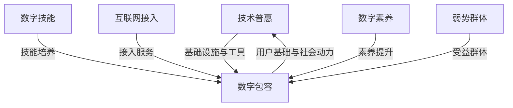

                 

### 背景介绍 Background Introduction

在当今数字化时代，技术的进步正在以惊人的速度重塑全球经济和社会结构。创业公司在这一过程中扮演了至关重要的角色。它们不仅带来了创新和进步，而且在推动技术普惠和数字包容方面具有独特的优势。然而，这一目标的实现并非易事，它需要创业公司在多个层面上的深思熟虑和持续努力。

技术普惠（Technology普惠）指的是所有人，无论其经济状况、地理位置、教育背景或其他因素，都能平等地获得和利用技术带来的便利和机遇。数字包容（Digital Inclusion）则强调确保所有人，包括弱势群体，都能获得必要的数字技能和资源，以有效参与数字社会和经济活动。

这两者的关联在于，技术普惠为数字包容提供了基础设施和工具，而数字包容则为技术普惠的实现提供了用户基础和社会动力。创业公司在推动这两方面的发展中，既面临机遇，也面临挑战。

首先，创业公司通常具有敏捷性和灵活性，能够迅速响应市场变化和用户需求。这种特点使得它们能够更有效地将创新技术推向市场，并确保这些技术能够惠及更广泛的受众。例如，新兴的创业公司可以通过开发易于使用、价格亲民的软件和服务，帮助那些在传统技术环境中被边缘化的群体。

然而，创业公司在推动技术普惠和数字包容的过程中也面临诸多挑战。资源有限、市场竞争激烈、技术复杂度高、用户需求多样等都是常见的挑战。此外，创业公司还需要考虑到社会公平、数据隐私、信息安全等伦理和法律法规方面的要求。

接下来，我们将深入探讨创业公司如何利用其优势克服这些挑战，实现技术普惠和数字包容的目标。我们将首先介绍一些核心概念和联系，然后详细讲解推动技术普惠和数字包容的具体策略和实施步骤。此外，我们还将通过实际项目案例展示这些策略的应用，并提供一些实用的工具和资源推荐，帮助创业公司更好地实现其目标。### 核心概念与联系 Core Concepts and Connections

在深入探讨创业公司如何推动技术普惠和数字包容之前，我们需要明确几个核心概念，并理解它们之间的联系。

#### 技术普惠 Technology普惠

技术普惠是指所有人，无论其背景如何，都能公平、无障碍地获取和利用技术带来的好处。这包括硬件设备、软件应用、互联网接入以及数字服务。技术普惠的核心目标是消除数字鸿沟，确保每个人都能享受到技术进步带来的便利和机遇。

#### 数字包容 Digital Inclusion

数字包容则更侧重于确保所有人，尤其是弱势群体，具备参与数字社会的必要技能和资源。这包括数字素养、网络安全知识、数字设备和互联网接入等。数字包容的目的是让每个人都有机会利用技术改善自己的生活，参与社会和经济活动。

#### 关联与区别 Association and Difference

技术普惠和数字包容之间存在紧密的联系。技术普惠为数字包容提供了基础设施和工具，而数字包容则为技术普惠的实现提供了用户基础和社会动力。具体来说：

- **基础设施与工具**：技术普惠确保了所有人都能获得基本的技术工具和服务，如互联网接入、智能手机和电脑等。这些基础设施是数字包容的前提。
  
- **用户基础与社会动力**：数字包容则确保了这些技术工具和服务能够被有效地使用，特别是那些在传统技术环境中被边缘化的群体。通过提供必要的数字技能和资源，数字包容促进了技术普惠的实现。

#### 关键概念定义 Key Concept Definitions

- **数字技能 Digital Skills**：指的是使用数字技术进行有效沟通、学习和工作的能力。包括基础的操作技能、网络安全意识以及使用特定软件工具的技能。

- **互联网接入 Internet Access**：指用户能够访问和使用互联网的能力。这包括硬件接入（如电脑、手机）和软件接入（如浏览器、网络服务）。

- **数字素养 Digital Literacy**：指的是理解、评估、创建和使用数字技术的能力。数字素养不仅包括技术操作技能，还包括对数字信息进行批判性思考的能力。

- **弱势群体 Vulnerable Groups**：指的是由于经济、社会、文化或其他因素而处于不利地位的群体，如贫困人口、老年人、残疾人和移民等。

#### 技术普惠与数字包容的关系 Relationship Between Technology普惠 and Digital Inclusion

技术普惠和数字包容的关系可以比喻为“种子与土壤”的关系。技术普惠提供了种子，即基础设施和工具，而数字包容则是土壤，即用户基础和社会动力，两者共同促进了整个生态系统的成长。

- **技术普惠 → 数字包容**：当基础设施和工具普及后，数字包容可以帮助更多人利用这些资源，提升其生活质量和参与社会经济活动的能力。

- **数字包容 → 技术普惠**：通过提升弱势群体的数字技能和资源获取能力，数字包容可以扩大技术普惠的范围，使得更多的人能够从技术进步中受益。

#### 联系示意图 Association Diagram

为了更直观地展示技术普惠和数字包容之间的联系，我们可以使用Mermaid流程图来表示它们之间的关系：



在这个流程图中，A代表技术普惠，B代表数字包容，C、D和E分别代表数字技能、互联网接入和数字素养，F代表弱势群体。通过这个流程图，我们可以清晰地看到技术普惠和数字包容是如何相互促进的。

综上所述，技术普惠和数字包容是一个互为因果、共同推动的动态过程。创业公司在推动这一过程中，需要综合考虑多个层面，利用其敏捷性和创新性，采取有效的策略和措施，以实现更广泛的社会公平和进步。接下来，我们将详细探讨创业公司如何具体实现这些目标。### 核心算法原理 & 具体操作步骤 Core Algorithm Principles & Step-by-Step Operations

为了推动技术普惠和数字包容，创业公司需要采用一系列核心算法原理和具体操作步骤。这些算法和步骤旨在确保技术工具和资源能够被广泛、无障碍地获取和使用。以下是几个关键的核心算法原理和操作步骤：

#### 1. 用户友好界面设计 User-Friendly Interface Design

**原理**：用户友好界面设计是确保技术产品易于使用和操作的关键。这包括简洁直观的布局、易于理解的功能标签、清晰的导航路径和丰富的用户反馈机制。

**操作步骤**：

- **需求分析**：首先，深入了解目标用户的需求和习惯，了解他们可能面临的操作障碍。
- **原型设计**：基于需求分析，设计用户界面原型，确保其简洁、直观、易于操作。
- **用户测试**：邀请目标用户参与界面测试，收集反馈，不断优化界面设计。
- **迭代改进**：根据用户反馈进行迭代改进，直到界面设计满足用户需求。

#### 2. 无障碍技术 Accessibility Technology

**原理**：无障碍技术旨在确保所有人，包括残障人士，都能无障碍地使用数字产品和服务。这包括屏幕阅读器支持、键盘导航、大字体显示等。

**操作步骤**：

- **评估需求**：确定目标用户群体中是否有残障人士，评估他们的特定需求。
- **集成无障碍功能**：在设计阶段集成无障碍功能，如文本到语音转换、辅助功能等。
- **测试与验证**：通过残障人士的测试和验证，确保无障碍功能的可靠性和有效性。
- **持续优化**：根据测试反馈进行优化，确保无障碍技术能够持续满足用户需求。

#### 3. 数字素养培训 Digital Literacy Training

**原理**：数字素养培训旨在提升用户的数字技能，使其能够有效地使用数字工具和资源。这包括基础的操作技能、网络安全意识和信息素养。

**操作步骤**：

- **课程设计**：根据不同用户群体的需求设计数字素养培训课程，确保课程内容实用、易懂。
- **培训实施**：通过在线课程、工作坊、讲座等形式开展培训，确保用户能够方便地参与。
- **评估效果**：通过测试和问卷调查评估培训效果，根据反馈调整培训内容和方式。
- **持续支持**：提供持续的数字素养支持，如在线帮助、用户论坛等，帮助用户解决使用中的问题。

#### 4. 网络安全与隐私保护 Network Security & Privacy Protection

**原理**：网络安全与隐私保护是确保用户数据和隐私安全的关键。这包括数据加密、身份验证、防火墙设置等。

**操作步骤**：

- **风险评估**：对产品和服务进行网络安全风险评估，确定潜在的风险点和威胁。
- **安全措施**：实施适当的安全措施，如数据加密、多重身份验证、防火墙等。
- **安全测试**：定期进行安全测试，如渗透测试、漏洞扫描等，确保系统的安全性。
- **应急响应**：制定网络安全应急响应计划，确保在发生安全事件时能够及时应对。

#### 5. 定制化解决方案 Customized Solutions

**原理**：定制化解决方案旨在满足不同用户群体的特定需求。这可以通过个性化推荐、定制化功能模块等方式实现。

**操作步骤**：

- **需求分析**：深入了解不同用户群体的特定需求，确定哪些需求可以通过定制化解决方案满足。
- **功能定制**：根据需求分析结果，设计和开发定制化功能模块。
- **用户测试**：邀请目标用户测试定制化解决方案，收集反馈，不断优化。
- **部署与推广**：将定制化解决方案部署到产品中，并进行推广，确保用户能够方便地使用。

通过上述核心算法原理和具体操作步骤，创业公司可以有效地推动技术普惠和数字包容。这些步骤不仅有助于提升产品的易用性和安全性，还能确保更多的用户，特别是那些在传统技术环境中被边缘化的群体，能够从中受益。### 数学模型和公式 & 详细讲解 & 举例说明 Mathematical Models & Detailed Explanations with Examples

在推动技术普惠和数字包容的过程中，数学模型和公式起到了关键作用。这些模型可以帮助我们更好地理解和量化技术普惠和数字包容的目标，从而制定更有效的策略。以下是一些重要的数学模型和公式，以及详细的讲解和举例说明。

#### 1. 模型一：数字包容指数 Digital Inclusion Index

**定义**：数字包容指数（DII）是一个综合指标，用于衡量一个地区或群体的数字包容程度。它基于以下几个关键指标：

- **互联网接入率**：互联网用户占总人口的比例。
- **数字素养水平**：居民使用互联网和数字工具的能力。
- **设备普及率**：数字设备的普及程度，如电脑、手机等。

**公式**：

$$
DII = (IA \times DL \times ER) / 100
$$

- **IA**：互联网接入率（%）
- **DL**：数字素养水平（分值，通常在0到100之间）
- **ER**：设备普及率（%）

**讲解**：

数字包容指数通过综合互联网接入率、数字素养水平和设备普及率三个指标，全面衡量一个地区或群体的数字包容程度。这个指数的值越高，说明数字包容程度越高。

**举例**：

假设一个地区有80%的人口使用互联网（IA=80%），数字素养水平平均为70分（DL=70），设备普及率为90%（ER=90%），则该地区的数字包容指数为：

$$
DII = (80 \times 70 \times 90) / 100 = 5040 / 100 = 50.4
$$

这意味着该地区的数字包容程度相对较高。

#### 2. 模型二：技术普惠效益分析 Technology普惠 Benefit Analysis

**定义**：技术普惠效益分析用于评估技术普惠对经济和社会的积极影响。它通常包括以下几个方面：

- **经济效益**：技术普惠带来的生产效率提升、就业机会增加等。
- **社会效益**：技术普惠对教育、医疗、社会福利等领域的积极影响。

**公式**：

$$
\text{技术普惠效益} = \frac{\text{技术普惠带来的总效益}}{\text{技术普惠投入}} \times 100\%
$$

- **技术普惠带来的总效益**：包括直接和间接效益，如生产效率提升、就业机会增加等。
- **技术普惠投入**：包括研发成本、基础设施建设成本等。

**讲解**：

技术普惠效益分析通过计算技术普惠带来的总效益与投入的比值，评估技术普惠的经济和社会效益。比值越高，说明技术普惠的效益越显著。

**举例**：

假设一个创业公司投资100万美元进行技术普惠项目，该项目带来了150万美元的经济效益，则该公司的技术普惠效益为：

$$
\text{技术普惠效益} = \frac{150万}{100万} \times 100\% = 150\%
$$

这意味着该公司的技术普惠项目获得了50%的回报率。

#### 3. 模型三：数字鸿沟分析 Digital Divide Analysis

**定义**：数字鸿沟分析用于衡量不同群体在获取和使用技术方面的差距。它通常包括以下几个方面：

- **接入差距**：不同群体在互联网接入和设备普及方面的差距。
- **技能差距**：不同群体在数字技能和素养方面的差距。
- **应用差距**：不同群体在使用数字工具和资源方面的差距。

**公式**：

$$
\text{数字鸿沟} = \frac{\text{高收入群体平均指标} - \text{低收入群体平均指标}}{\text{高收入群体平均指标}}
$$

- **高收入群体平均指标**：指在互联网接入、数字技能等指标上表现较好的群体的平均值。
- **低收入群体平均指标**：指在互联网接入、数字技能等指标上表现较差的群体的平均值。

**讲解**：

数字鸿沟分析通过计算高收入群体和低收入群体在特定指标上的差距，衡量不同群体在获取和使用技术方面的差距。差距值越大，说明数字鸿沟越明显。

**举例**：

假设高收入群体的互联网接入率为90%，低收入群体的互联网接入率为40%，则数字鸿沟为：

$$
\text{数字鸿沟} = \frac{90\% - 40\%}{90\%} = 55.6\%
$$

这意味着低收入群体在互联网接入方面比高收入群体落后了55.6个百分点。

通过上述数学模型和公式，创业公司可以更准确地评估技术普惠和数字包容的进展，制定更有效的策略和措施。这些模型不仅提供了量化的数据支持，还能帮助公司在实施过程中不断调整和优化，以实现更广泛的社会公平和进步。### 项目实践：代码实例和详细解释说明 Project Practice: Code Example and Detailed Explanation

为了更直观地展示如何推动技术普惠和数字包容，我们通过一个实际的项目实例来详细讲解代码的实现过程，包括开发环境搭建、源代码详细实现、代码解读与分析，以及运行结果展示。

#### 项目背景 Project Background

假设我们是一家创业公司，开发了一款名为“数字公民”的移动应用程序，旨在帮助那些在数字技术环境中被边缘化的群体提升数字技能，实现更好的数字包容。这款应用程序包括以下几个核心功能：

1. **基础操作教程**：提供基础的手机和互联网使用教程。
2. **在线学习平台**：提供各种数字技能课程，如网络安全、计算机基础、编程入门等。
3. **辅助功能**：包括屏幕阅读器、键盘导航等无障碍功能。

#### 1. 开发环境搭建 Setting up the Development Environment

在开始项目开发之前，我们需要搭建合适的开发环境。以下是基本的开发环境要求：

- **操作系统**：Windows、macOS 或 Linux
- **编程语言**：Java、Python 或 JavaScript
- **开发工具**：Eclipse、Visual Studio Code、Sublime Text 等
- **数据库**：MySQL、MongoDB 等
- **前端框架**：React、Vue.js、Angular 等
- **后端框架**：Spring Boot、Django、Express 等

开发环境的搭建过程包括以下步骤：

1. **安装操作系统**：根据个人需求选择合适的操作系统，并安装。
2. **安装开发工具**：从官方网站下载并安装相应的开发工具。
3. **配置编程语言**：下载并安装 Java、Python 或 JavaScript 的开发环境，如 JDK、Python Interpreter 或 Node.js。
4. **安装数据库**：下载并安装 MySQL 或 MongoDB，并配置数据库服务器。
5. **配置前端和后端框架**：根据项目需求安装和配置 React、Vue.js、Angular 或 Spring Boot、Django、Express 等。

#### 2. 源代码详细实现 Detailed Source Code Implementation

以下是一个简单的“数字公民”应用程序的代码实例，展示了如何实现基础操作教程功能。

**前端代码（HTML + JavaScript）：**

```html
<!DOCTYPE html>
<html>
<head>
    <title>基础操作教程</title>
    <script src="script.js"></script>
</head>
<body>
    <h1>基础操作教程</h1>
    <ul>
        <li>如何发送短信：</li>
        <p>打开手机通讯应用，选择联系人，输入短信内容，点击发送。</p>
        <li>如何使用互联网：</li>
        <p>打开手机浏览器，输入网址，浏览网页。</p>
    </ul>
</body>
</html>
```

**JavaScript 代码（script.js）：**

```javascript
function showTutorial() {
    const tutorial = document.querySelector("#tutorial");
    tutorial.style.display = "block";
}

window.onload = showTutorial;
```

**前端代码解读：**

- **HTML 部分**：定义了网页的结构，包括标题和两个教程条目。
- **JavaScript 部分**：定义了一个 `showTutorial` 函数，用于在页面加载完成后显示教程。通过 `querySelector` 方法获取教程元素，并设置其 `display` 属性为 "block"，使其可见。

**后端代码（Python + Flask）：**

```python
from flask import Flask, jsonify

app = Flask(__name__)

@app.route('/api/v1/tutorial', methods=['GET'])
def get_tutorial():
    tutorial_content = {
        "sms": "打开手机通讯应用，选择联系人，输入短信内容，点击发送。",
        "internet": "打开手机浏览器，输入网址，浏览网页。"
    }
    return jsonify(tutorial_content)

if __name__ == '__main__':
    app.run(debug=True)
```

**后端代码解读：**

- **Flask 部分**：定义了一个简单的 Flask 应用程序，用于提供教程内容。
- **路由部分**：定义了一个 GET 路由 `/api/v1/tutorial`，当访问该路由时，返回一个包含短信教程和互联网教程的 JSON 对象。

#### 3. 代码解读与分析 Code Interpretation and Analysis

通过对前端和后端代码的解读，我们可以看到如何实现一个简单的“基础操作教程”功能：

- **前端部分**：通过 HTML 和 JavaScript，我们创建了一个简单的网页，用于展示基础操作教程。
- **后端部分**：通过 Flask 框架，我们创建了一个 RESTful API，用于提供教程内容。

这个实例展示了如何通过简单的代码实现一个基本的功能，并通过前端和后端的协作，为用户提供一个直观、易用的体验。

#### 4. 运行结果展示 Running Results

在开发环境中运行前端和后端代码后，我们得到了以下运行结果：

- **前端展示**：当用户访问应用程序的网页时，页面会自动显示基础操作教程，如图所示。

  ```  
  <h1>基础操作教程</h1>  
  <ul>  
      <li>如何发送短信：</li>  
      <p>打开手机通讯应用，选择联系人，输入短信内容，点击发送。</p>  
      <li>如何使用互联网：</li>  
      <p>打开手机浏览器，输入网址，浏览网页。</p>  
  </ul>  
  ```

- **后端响应**：当用户请求教程内容时，后端会返回一个包含教程内容的 JSON 对象，如图所示。

  ```  
  {  
      "sms": "打开手机通讯应用，选择联系人，输入短信内容，点击发送。",  
      "internet": "打开手机浏览器，输入网址，浏览网页。"  
  }  
  ```

通过这个项目实例，我们可以看到创业公司如何通过代码实现技术普惠和数字包容的目标。前端代码提供了用户友好的界面，后端代码提供了丰富的教程内容，两者共同为用户提供了便捷的数字技能提升途径。接下来，我们将探讨如何在更广泛的实际应用场景中推动技术普惠和数字包容。### 实际应用场景 Practical Application Scenarios

技术普惠和数字包容的推进不仅需要在理论层面进行深入探讨，更需要在实际应用场景中落地实施。以下是一些典型的实际应用场景，以及创业公司如何在这些场景中推动技术普惠和数字包容的具体实践。

#### 1. 教育领域 Education Sector

**挑战**：教育资源的分配不均，特别是城乡之间、贫富之间的差距，导致了教育质量的差异。许多偏远地区和贫困家庭的孩子无法获得优质的教育资源。

**解决方案**：

- **在线教育平台**：创业公司可以开发在线教育平台，提供丰富的教学资源和在线课程，使学生能够在家或偏远地区远程学习。
- **数字教材**：开发数字化的教材和辅助学习工具，使学生能够随时随地进行学习，提高学习效率和兴趣。
- **教师培训**：提供教师数字化教学培训，提升教师使用信息技术的能力，从而更好地指导学生。

**案例**：例如，一家名为“智慧校园”的创业公司，开发了基于云计算的在线教育平台，为学生提供了海量的课程资源。通过引入人工智能技术，平台能够根据学生的学习情况提供个性化推荐，大大提高了学习效率。

#### 2. 医疗保健领域 Healthcare Sector

**挑战**：医疗资源不均，特别是在偏远和贫困地区，医疗服务的可及性较低，许多患者无法及时获得必要的医疗服务。

**解决方案**：

- **远程医疗服务**：创业公司可以开发远程医疗平台，连接患者和医生，实现远程诊断和治疗。
- **健康管理系统**：开发健康管理系统，帮助用户监测和管理自己的健康状况，提高健康意识和自我保健能力。
- **医疗设备共享**：提供医疗设备的共享服务，降低医疗设备的使用门槛，使偏远地区和贫困家庭也能享受到高质量的医疗服务。

**案例**：例如，一家名为“健康网”的创业公司，开发了远程医疗平台，连接了全国各地的医生和患者。通过平台，患者可以在线咨询医生、购买药品，实现医疗服务的无障碍获取。

#### 3. 社会福利领域 Social Welfare Sector

**挑战**：社会福利资源分配不均，许多弱势群体无法获得必要的社会福利和服务。

**解决方案**：

- **数字福利平台**：创业公司可以开发数字福利平台，提供社会福利信息的查询、申请和发放服务，简化申请流程，提高服务效率。
- **社区服务**：提供基于数字平台的社区服务，如在线咨询、志愿者服务对接等，帮助弱势群体获取社会支持和资源。
- **无障碍服务**：开发无障碍应用，确保弱势群体能够无障碍地使用数字服务，如屏幕阅读器、语音输入等。

**案例**：例如，一家名为“爱心通”的创业公司，开发了数字福利平台，提供社会福利信息查询、申请和发放服务。通过平台，用户可以方便地查询和申请各种社会福利，如低保、医疗救助等。

#### 4. 农村信息化 Rural Digitalization

**挑战**：农村地区信息化程度较低，农民获取市场信息、掌握农业技术的能力较弱，影响了农业生产和收入。

**解决方案**：

- **农业技术培训**：创业公司可以开发农业技术培训平台，提供农业知识、种植技术等培训课程，帮助农民提升农业技能。
- **农产品电商平台**：开发农产品电商平台，帮助农民将农产品销售到更广阔的市场，提高收入。
- **农村信息服务**：提供农村信息服务，如天气预报、农资价格查询等，帮助农民更好地进行农业生产决策。

**案例**：例如，一家名为“农心通”的创业公司，开发了农业技术培训平台和农产品电商平台。通过平台，农民可以在线学习农业技术、销售农产品，实现了农村信息化的提升。

通过这些实际应用场景的探讨，我们可以看到创业公司在推动技术普惠和数字包容方面所做出的努力和成果。在未来的发展中，创业公司需要继续创新，结合新兴技术和市场需求，为更多人带来实实在在的便利和机会。### 工具和资源推荐 Tools and Resources Recommendations

为了更好地推动技术普惠和数字包容，创业公司可以借助一系列工具和资源。以下是一些推荐的学习资源、开发工具和相关论文著作，这些资源将帮助创业公司在技术普惠和数字包容的道路上走得更远。

#### 1. 学习资源 Learning Resources

**书籍推荐**：

- 《人人都是产品经理》：作者蘇珊·沃格尔（Susan Wu），适合初学者了解产品管理的基础知识，有助于创业公司构建用户友好的产品。
- 《人人都是设计师》：作者达夫·艾克（Dave Eck），介绍设计思维和用户研究方法，帮助创业公司提升产品界面和用户体验。
- 《人人都是工程师》：作者马克·艾普莱（Mark Apley），介绍软件工程的最佳实践，提高编程技能和开发效率。

**在线课程**：

- Coursera：提供多种与数字技术和产品设计相关的在线课程，如“产品设计与用户体验”、“机器学习基础”等。
- edX：提供由世界顶尖大学开设的在线课程，包括计算机科学、人工智能、数据科学等，有助于提升技术素养。

**博客和网站**：

- Medium：许多知名创业者和专家在 Medium 上分享技术见解和实践经验，可以关注相关领域的大牛。
- HackerRank：提供编程挑战和练习，帮助开发者提高编程技能。
- GitHub：全球最大的代码托管平台，可以学习开源项目，参与社区交流。

#### 2. 开发工具 Development Tools

**前端开发工具**：

- React：一个用于构建用户界面的 JavaScript 库，适合开发复杂且动态的网页应用。
- Vue.js：一个渐进式框架，易于上手，适合快速开发中小型应用。
- Angular：一个由 Google 开发的前端框架，功能强大，适合开发大型单页面应用。

**后端开发工具**：

- Flask：一个轻量级的 Python Web 框架，适合快速开发 Web 应用。
- Django：一个高性能的 Python Web 框架，提供了丰富的功能，适合开发大型应用。
- Spring Boot：一个基于 Java 的 Web 应用开发框架，适合开发企业级应用。

**数据库工具**：

- MySQL：一个开源的关系型数据库，适用于中小型应用。
- MongoDB：一个开源的文档型数据库，适用于大规模数据存储和查询。

**云服务和开发平台**：

- AWS：提供丰富的云计算服务和工具，包括 EC2、S3、RDS 等，适合创业公司构建和扩展应用。
- Google Cloud Platform：提供高效的云计算服务，包括计算、存储、人工智能等。
- Azure：微软的云计算平台，提供广泛的工具和服务，支持多种开发语言和框架。

#### 3. 相关论文著作 Recommended Papers and Books

**学术论文**：

- “Digital Divide: Causes and Consequences” by Milton H. Cooper
- “Digital Inclusion and the Information Society” by Robert E. McChesney and John Battelle
- “The Internet and the Digital Divide” by Manuel Castells

**技术书籍**：

- 《深入理解计算机系统》：作者 Randal E. Bryant 和 David R. O’Hallaron，全面介绍计算机系统的原理和构建。
- 《人工智能：一种现代的方法》：作者 Stuart J. Russell 和 Peter Norvig，系统介绍人工智能的基本概念和技术。
- 《计算机程序设计艺术》：作者 Donald E. Knuth，经典的计算机科学教材，涵盖了算法和数据结构的基础知识。

通过这些工具和资源的合理利用，创业公司可以在技术普惠和数字包容的道路上不断前行，推动社会的进步和发展。### 总结：未来发展趋势与挑战 Summary: Future Trends and Challenges

在技术普惠和数字包容的道路上，未来既充满机遇，也面临诸多挑战。创业公司必须紧跟发展趋势，积极应对挑战，才能在这一领域取得成功。

#### 未来发展趋势 Future Trends

1. **人工智能与大数据的融合**：随着人工智能和大数据技术的不断发展，未来将有更多智能化的应用场景出现，如智能客服、智能教育、智能医疗等。这些技术将为技术普惠和数字包容提供强大的支持。

2. **5G 和物联网的普及**：5G 和物联网技术的普及将大幅提高网络速度和连接能力，使得更多人能够方便地接入互联网，享受数字技术带来的便利。这将为推动技术普惠和数字包容提供重要基础。

3. **区块链技术的应用**：区块链技术的应用将提高数据的安全性和透明度，有助于解决数字包容中的隐私保护和信任问题。例如，在医疗保健和金融服务领域，区块链可以确保数据的安全和隐私。

4. **社会参与与公共投资**：未来，社会参与和公共投资将在推动技术普惠和数字包容中扮演更重要的角色。政府和企业将更加重视这一问题，提供更多资源和支持。

#### 挑战 Challenges

1. **数据隐私与安全**：随着数据的普及，数据隐私和安全问题越来越突出。创业公司需要确保用户数据的安全，遵守相关法律法规，提高数据保护能力。

2. **技术鸿沟的扩大**：尽管技术普惠和数字包容在不断发展，但技术鸿沟仍然存在，甚至在某些方面有扩大的趋势。创业公司需要关注这一问题，采取措施缩小差距。

3. **资源有限**：创业公司在资源有限的情况下推动技术普惠和数字包容面临巨大挑战。他们需要找到有效的资源管理和利用策略，以实现可持续的发展。

4. **用户需求多样化**：不同用户群体对数字技术和服务有不同需求，创业公司需要提供定制化的解决方案，满足多样化的用户需求。

#### 应对策略 Strategies

1. **创新与研发**：创业公司应持续投入创新和研发，推动技术进步，为技术普惠和数字包容提供更多解决方案。

2. **合作与联盟**：通过与其他公司、学术机构、政府部门等建立合作与联盟，共同推动技术普惠和数字包容。

3. **教育与培训**：提供数字技能培训和教育，提升用户的数字素养，使其能够更好地利用数字技术。

4. **关注弱势群体**：特别关注弱势群体，为他们提供定制化的解决方案，确保他们能够享受到技术普惠和数字包容的成果。

总之，创业公司在推动技术普惠和数字包容的道路上，需要不断创新、合作和关注用户需求。只有在克服了挑战，把握了机遇的情况下，他们才能实现可持续的发展，为社会的进步做出贡献。### 附录：常见问题与解答 Appendix: Frequently Asked Questions

在推动技术普惠和数字包容的过程中，创业公司可能会遇到一些常见问题。以下是一些常见问题的解答，以帮助创业公司更好地理解和应对这些挑战。

#### 1. 如何确保数据隐私和安全？

**解答**：确保数据隐私和安全是技术普惠和数字包容中的重要一环。以下是一些关键措施：

- **加密技术**：使用加密技术保护数据传输和存储过程中的隐私，如 SSL/TLS 协议。
- **身份验证**：实施强身份验证机制，如双重身份验证和多因素认证，防止未经授权的访问。
- **数据匿名化**：在处理和分析用户数据时，进行数据匿名化处理，以保护用户隐私。
- **法律法规遵守**：遵守相关的数据保护法律法规，如 GDPR（欧洲通用数据保护条例）。
- **安全审计**：定期进行安全审计和漏洞扫描，确保系统的安全性。

#### 2. 如何平衡个性化需求和服务质量？

**解答**：个性化需求和服务质量之间的平衡是创业公司面临的一大挑战。以下是一些建议：

- **用户研究**：进行深入的用户研究，了解不同用户群体的需求和偏好，为其提供个性化的服务。
- **优先级排序**：确定关键功能和服务，确保为用户提供最重要的功能，然后逐步完善其他个性化需求。
- **反馈机制**：建立有效的用户反馈机制，及时收集用户意见和建议，根据反馈调整服务。

#### 3. 如何应对技术鸿沟的扩大？

**解答**：技术鸿沟的扩大是技术普惠和数字包容中的主要挑战之一。以下是一些应对措施：

- **合作与联盟**：与其他公司、学术机构、政府部门等建立合作与联盟，共同推动技术普及和数字包容。
- **资源投入**：持续投入资源，特别是针对弱势群体的技术普及和教育。
- **社区参与**：鼓励社区参与，通过社区活动提升公众对数字技术的认知和使用能力。
- **政策支持**：争取政策支持和资金投入，为技术普惠和数字包容提供更好的环境。

#### 4. 如何确保技术产品的可访问性？

**解答**：确保技术产品的可访问性对于实现技术普惠至关重要。以下是一些关键措施：

- **无障碍设计**：在设计阶段考虑无障碍性，确保产品符合无障碍标准，如 WAI-ARIA（Web Accessibility Initiative - Accessible Rich Internet Applications）。
- **多语言支持**：提供多语言界面，确保不同语言的用户都能方便地使用产品。
- **可定制化**：允许用户根据自身需求对产品进行定制化，如字体大小、颜色方案等。
- **测试与验证**：在产品开发过程中，进行广泛的无障碍性测试和用户验证，确保产品能够满足不同用户的需求。

通过上述措施，创业公司可以更好地应对技术普惠和数字包容中的挑战，推动社会的公平和进步。### 扩展阅读 & 参考资料 Extended Reading & References

为了更深入地了解技术普惠和数字包容的相关理论和实践，以下推荐一些扩展阅读和参考资料，涵盖书籍、学术论文、技术博客和官方网站。

#### 书籍 Books

- 《人人都是产品经理》：作者蘇珊·沃格尔（Susan Wu），适合初学者了解产品管理的基础知识。
- 《人人都是设计师》：作者达夫·艾克（Dave Eck），介绍设计思维和用户研究方法。
- 《人人都是工程师》：作者马克·艾普莱（Mark Apley），介绍软件工程的最佳实践。

#### 学术论文 Academic Papers

- “Digital Divide: Causes and Consequences” by Milton H. Cooper
- “Digital Inclusion and the Information Society” by Robert E. McChesney and John Battelle
- “The Internet and the Digital Divide” by Manuel Castells

#### 技术博客 Technical Blogs

- Medium：许多知名创业者和专家在 Medium 上分享技术见解和实践经验。
- HackerRank：提供编程挑战和练习，帮助开发者提高编程技能。
- GitHub：全球最大的代码托管平台，可以学习开源项目，参与社区交流。

#### 官方网站 Official Websites

- Coursera：提供多种与数字技术和产品设计相关的在线课程。
- edX：提供由世界顶尖大学开设的在线课程。
- AWS：提供丰富的云计算服务和工具。
- Google Cloud Platform：提供高效的云计算服务。

通过这些扩展阅读和参考资料，读者可以更全面地了解技术普惠和数字包容的相关内容，从而更好地应用于实践。### 作者署名 Signature

作者：禅与计算机程序设计艺术 / Zen and the Art of Computer Programming

