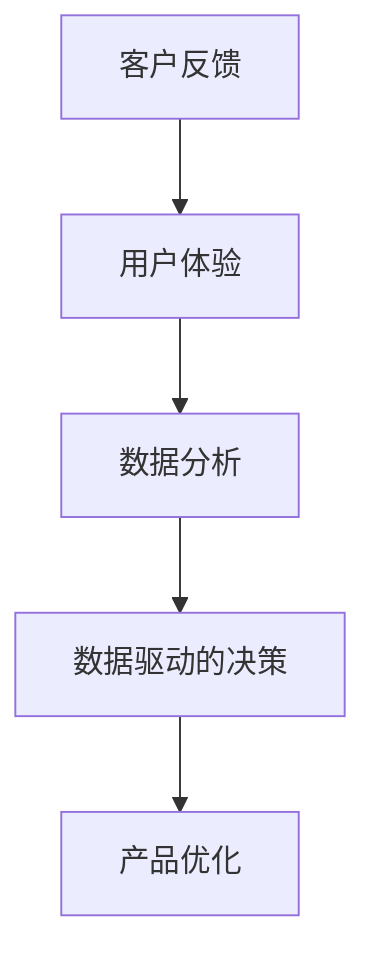

                 

### 文章标题

《创业公司如何设计有效的客户反馈机制》

关键词：创业公司、客户反馈、机制设计、用户体验、数据驱动的决策、客户满意度

摘要：本文将深入探讨创业公司如何设计一套有效的客户反馈机制。通过分析客户反馈的重要性和实现方法，本文提供了具体的步骤和策略，帮助创业公司更好地理解客户需求，优化产品和服务，从而实现业务增长和客户满意度的提升。

### 1. 背景介绍

在当今竞争激烈的市场环境中，创业公司要想脱颖而出，不仅需要优秀的产品和服务，更需要对市场和客户需求保持高度敏感。客户反馈作为了解市场需求和改进产品服务的重要手段，对创业公司的成功至关重要。有效的客户反馈机制不仅可以提供真实的市场反馈，还可以帮助企业快速调整战略，提高客户满意度，进而促进业务的持续增长。

然而，对于许多创业公司而言，如何设计一套有效的客户反馈机制仍然是一个挑战。一方面，创业公司资源有限，难以投入大量人力物力进行市场调研和客户满意度调查。另一方面，客户反馈的数据量大且形式多样，如何从中提取有价值的信息并进行有效的分析，成为了一个难题。

本文旨在解决上述问题，通过深入分析客户反馈机制的设计原则和实践方法，为创业公司提供一套实用的客户反馈解决方案。文章将从以下几个方面展开讨论：

1. **客户反馈的重要性**：介绍客户反馈在创业公司发展中的关键作用，以及为什么需要重视客户反馈。
2. **设计有效的客户反馈机制**：阐述如何构建一个系统的客户反馈机制，包括反馈渠道的选择、数据分析方法的运用等。
3. **实施客户反馈机制**：提供具体的实施步骤和策略，帮助创业公司顺利地建立和运行客户反馈机制。
4. **案例分析**：通过实际案例，展示如何有效地利用客户反馈来改进产品和服务。
5. **工具和资源推荐**：推荐一些有助于实施客户反馈机制的工具和资源，包括调研工具、数据分析软件等。
6. **总结与展望**：总结本文的核心观点，并探讨未来客户反馈机制的发展趋势和挑战。

### 2. 核心概念与联系

在深入探讨如何设计有效的客户反馈机制之前，我们需要理解一些核心概念和它们之间的联系。以下是本文将涉及的关键概念：

- **客户反馈**：指客户对产品或服务的体验和意见，包括正面和负面的评价。
- **用户体验**：指用户在使用产品或服务时的整体感受，包括易用性、可用性、满意度等。
- **数据分析**：指运用统计方法和工具对收集到的客户反馈数据进行处理和分析，以提取有价值的信息。
- **数据驱动的决策**：指基于数据分析结果做出的决策，而非仅仅依靠直觉或经验。

图 1 展示了这些核心概念之间的联系。



#### 2.1 客户反馈的重要性

客户反馈是创业公司获取市场信息的重要途径。通过收集和分析客户反馈，公司可以了解客户的需求、痛点以及期望，从而进行有针对性的产品和服务改进。以下是客户反馈对创业公司的重要性：

1. **指导产品开发**：客户反馈可以帮助公司确定产品开发的优先级，识别关键功能和技术难点。
2. **改进服务质量**：通过分析客户对服务质量的反馈，公司可以找到服务过程中的短板，并进行优化。
3. **提高客户满意度**：及时响应客户反馈，解决客户问题，可以提高客户的满意度和忠诚度。
4. **发现市场机会**：客户反馈中可能包含未被满足的需求或新兴的市场趋势，公司可以据此调整战略。

#### 2.2 用户体验与客户反馈

用户体验是客户反馈的核心内容之一。一个良好的用户体验可以增强客户的满意度和忠诚度，从而促进业务的持续增长。用户体验包括以下几个方面：

1. **易用性**：产品或服务是否易于使用，用户是否能够在不需要过多培训的情况下快速上手。
2. **可用性**：产品或服务是否能够满足用户的核心需求，提供有效的解决方案。
3. **满意度**：用户对产品或服务的整体感受，包括满意度调查和口碑评价。
4. **个性化**：产品或服务是否能够根据用户的不同需求和偏好进行定制化。

客户反馈不仅可以帮助公司了解用户体验的各个方面，还可以提供具体的改进建议。例如，如果客户反馈中提到某个功能使用不便，公司可以针对该功能进行优化。

#### 2.3 数据分析在客户反馈中的应用

数据分析是客户反馈机制的重要组成部分。通过数据分析，公司可以从海量的客户反馈数据中提取有价值的信息，从而做出更明智的决策。以下是数据分析在客户反馈中的应用：

1. **数据收集**：通过多种渠道收集客户反馈数据，包括在线调查、社交媒体评论、用户评论等。
2. **数据清洗**：对收集到的数据进行清洗，去除无效或重复的数据，保证数据的准确性和完整性。
3. **数据可视化**：使用可视化工具将分析结果呈现出来，使数据更加直观易懂。
4. **数据挖掘**：运用统计方法和机器学习算法，从数据中发现潜在的模式和趋势。
5. **决策支持**：基于数据分析结果，制定产品优化策略和业务发展计划。

通过数据分析，公司可以更深入地了解客户需求，发现产品和服务中的问题，并制定相应的改进措施。

#### 2.4 数据驱动的决策

数据驱动的决策是指基于数据分析结果做出的决策，而不是仅仅依靠直觉或经验。在创业公司中，数据驱动的决策具有以下几个优势：

1. **客观性**：数据分析提供了客观的数据支持，减少了主观判断的影响。
2. **准确性**：基于大量数据的分析结果更加准确，有助于提高决策的可靠性。
3. **及时性**：通过实时数据分析，公司可以快速响应市场变化，做出及时调整。
4. **可持续性**：数据驱动的决策有助于建立可持续的业务模式，提高企业的竞争力。

总之，通过建立有效的客户反馈机制，创业公司可以更好地理解客户需求，优化产品和服务，实现数据驱动的决策，从而在激烈的市场竞争中脱颖而出。接下来，本文将深入探讨如何设计这样的客户反馈机制。

### 3. 核心算法原理 & 具体操作步骤

#### 3.1 客户反馈数据的收集

设计有效的客户反馈机制的第一步是收集客户反馈数据。以下是一些常见的客户反馈数据收集方法：

1. **在线调查**：
   - **问卷星**：使用问卷星等在线调查工具创建问卷，可以通过电子邮件、社交媒体等方式邀请客户参与。
   - **Google 表单**：Google 表单提供了便捷的问卷创建和分发功能，适用于小规模客户调查。

2. **社交媒体**：
   - **微博**：在微博上设置话题标签，鼓励用户分享对产品和服务的体验。
   - **微信**：通过微信公众号发布问卷调查，利用图文、视频等多种形式吸引客户参与。

3. **用户评论**：
   - **淘宝/京东**：在电商平台上收集客户的购买评价和反馈。
   - **产品论坛**：在产品论坛或社区中收集用户的问题和建议。

4. **客服渠道**：
   - **电话**：通过电话客服收集客户在使用产品或服务过程中遇到的问题和意见。
   - **在线聊天**：利用在线聊天工具实时与客户沟通，获取即时反馈。

#### 3.2 数据分析方法的运用

收集到客户反馈数据后，需要通过数据分析方法提取有价值的信息。以下是一些常用的数据分析方法：

1. **文本分析**：
   - **情感分析**：使用自然语言处理技术，分析客户反馈中的情感倾向，判断客户对产品或服务的满意程度。
   - **主题模型**：通过主题模型（如 Latent Dirichlet Allocation，LDA）识别客户反馈中的主要话题，帮助公司了解客户的关注点。

2. **统计分析**：
   - **描述性统计**：计算客户反馈的基本统计量，如平均满意度、中位数满意度等。
   - **相关性分析**：分析不同变量之间的相关性，帮助公司了解哪些因素对客户满意度有显著影响。

3. **机器学习**：
   - **分类算法**：使用分类算法（如决策树、随机森林等）预测客户对产品的满意度。
   - **聚类算法**：使用聚类算法（如 K-means、层次聚类等）将客户分为不同的群体，分析不同群体对产品的偏好。

#### 3.3 客户反馈的闭环管理

有效的客户反馈机制不仅包括数据的收集和分析，还需要实现反馈的闭环管理，即对客户反馈进行响应和改进。以下是一些关键步骤：

1. **建立反馈响应机制**：
   - **及时回复**：对于客户反馈，及时给予回复，表达公司的关注和感谢。
   - **解决问题**：对于客户提出的问题或建议，及时采取措施解决，提高客户满意度。

2. **持续改进产品和服务**：
   - **基于反馈优化**：根据客户反馈，对产品或服务进行持续优化，改进用户体验。
   - **定期评估**：定期对客户反馈进行分析和总结，评估改进措施的效果。

3. **培养客户忠诚度**：
   - **个性化服务**：根据客户反馈，提供个性化的产品和服务，增强客户粘性。
   - **建立长期关系**：通过持续的客户互动和关怀，建立长期的合作关系。

通过上述步骤，创业公司可以建立一个有效的客户反馈机制，从数据中提取有价值的信息，优化产品和服务，从而实现业务的持续增长和客户满意度的提升。

### 4. 数学模型和公式 & 详细讲解 & 举例说明

在设计和实施客户反馈机制的过程中，数学模型和公式可以提供强有力的支持，帮助创业公司从数据中提取有价值的信息。以下是一些常用的数学模型和公式的详细讲解以及举例说明。

#### 4.1 情感分析模型

情感分析是客户反馈数据分析中的一项重要任务，它可以帮助公司了解客户对产品或服务的情感倾向。一个常用的情感分析模型是 **朴素贝叶斯分类器**。

**数学公式：**

\[ P(\text{正面情感} | \text{特征}) = \frac{P(\text{特征} | \text{正面情感}) \cdot P(\text{正面情感})}{P(\text{特征})} \]

其中，\( P(\text{正面情感}) \) 是客户反馈为正面情感的概率，\( P(\text{特征} | \text{正面情感}) \) 是特征在正面情感反馈中出现的概率，\( P(\text{特征}) \) 是特征出现的概率。

**举例说明：**

假设我们有一个简化的情感分析模型，其中有两个特征：`易用性`和`功能性`。客户的反馈文本中包含这两个特征，我们需要根据这些特征判断客户反馈的情感倾向。

- \( P(\text{正面情感}) = 0.6 \)
- \( P(\text{易用性} | \text{正面情感}) = 0.8 \)
- \( P(\text{功能性} | \text{正面情感}) = 0.7 \)
- \( P(\text{易用性}) = 0.4 \)
- \( P(\text{功能性}) = 0.3 \)

我们可以计算每个特征的贝叶斯概率：

\[ P(\text{正面情感} | \text{易用性}) = \frac{P(\text{易用性} | \text{正面情感}) \cdot P(\text{正面情感})}{P(\text{易用性})} = \frac{0.8 \cdot 0.6}{0.4} = 0.9 \]

\[ P(\text{正面情感} | \text{功能性}) = \frac{P(\text{功能性} | \text{正面情感}) \cdot P(\text{正面情感})}{P(\text{功能性})} = \frac{0.7 \cdot 0.6}{0.3} = 1.4 \]

根据贝叶斯公式，我们可以计算出客户反馈为正面情感的综合概率：

\[ P(\text{正面情感} | \text{易用性} \text{ 和 } \text{功能性}) = P(\text{易用性} | \text{正面情感}) \cdot P(\text{功能性} | \text{正面情感}) = 0.9 \cdot 1.4 = 1.26 \]

由于情感分析模型的概率值超过 1，这意味着我们在模型中可能需要调整参数或增加更多的特征。

#### 4.2 相关性分析

相关性分析是另一个重要的数学工具，用于识别客户反馈中不同变量之间的相关性。一个常用的相关性度量方法是 **皮尔逊相关系数**。

**数学公式：**

\[ r_{xy} = \frac{\sum{(x_i - \bar{x})(y_i - \bar{y})}}{\sqrt{\sum{(x_i - \bar{x})^2} \cdot \sum{(y_i - \bar{y})^2}}} \]

其中，\( x_i \) 和 \( y_i \) 是观察值，\( \bar{x} \) 和 \( \bar{y} \) 是均值。

**举例说明：**

假设我们有两个变量的数据集，分别是客户满意度（\( x \)）和产品性能（\( y \)），数据如下：

| 客户满意度（\( x \)）| 产品性能（\( y \)）|
|:-------------------:|:-----------------:|
|         3          |         5         |
|         4          |         7         |
|         2          |         4         |
|         5          |         8         |
|         3          |         6         |

我们可以计算这两个变量的皮尔逊相关系数：

\[ \bar{x} = \frac{3 + 4 + 2 + 5 + 3}{5} = 3.4 \]
\[ \bar{y} = \frac{5 + 7 + 4 + 8 + 6}{5} = 6.0 \]

\[ r_{xy} = \frac{(3 - 3.4)(5 - 6) + (4 - 3.4)(7 - 6) + (2 - 3.4)(4 - 6) + (5 - 3.4)(8 - 6) + (3 - 3.4)(6 - 6)}{\sqrt{\sum{(3 - 3.4)^2} \cdot \sum{(5 - 6)^2}} \cdot \sqrt{\sum{(7 - 6)^2} \cdot \sum{(4 - 6)^2}} \cdot \sqrt{\sum{(8 - 6)^2} \cdot \sum{(6 - 6)^2}} } \]

\[ r_{xy} = \frac{(-0.4)(-1) + (0.6)(1) + (-1.4)(-2) + (1.6)(2) + (-0.4)(0)}{\sqrt{0.16 \cdot 1 + 0.36 \cdot 1 + 0.64 \cdot 4 + 2.56 \cdot 4 + 0.16 \cdot 4}} \]

\[ r_{xy} = \frac{0.4 + 0.6 + 2.8 + 3.2 + 0}{\sqrt{0.16 + 0.36 + 0.64 + 10.24 + 0.16}} \]

\[ r_{xy} = \frac{7.2}{\sqrt{11.36}} \]

\[ r_{xy} \approx 0.95 \]

由于相关系数接近 1，这表明客户满意度和产品性能之间存在高度正相关，即产品性能越好，客户满意度越高。

#### 4.3 聚类分析

聚类分析是另一种常用的数据分析方法，用于将客户反馈数据分为不同的群体。一个常用的聚类算法是 **K-means**。

**数学公式：**

\[ \text{目标函数} = \sum_{i=1}^{k} \sum_{x \in S_i} \| x - \mu_i \|^2 \]

其中，\( k \) 是聚类的数量，\( S_i \) 是第 \( i \) 个聚类的数据集，\( \mu_i \) 是第 \( i \) 个聚类的中心点。

**举例说明：**

假设我们有 5 个客户的满意度评分，我们需要将这 5 个客户分为 2 个群体。数据如下：

| 客户编号 | 满意度评分 |
|:--------:|:----------:|
|     1    |     3      |
|     2    |     4      |
|     3    |     2      |
|     4    |     5      |
|     5    |     3      |

我们可以使用 K-means 算法进行聚类：

1. **初始化中心点**：随机选择两个数据点作为初始聚类中心点。
2. **分配数据点**：将每个数据点分配到距离其最近的中心点所在的群体。
3. **更新中心点**：重新计算每个群体的中心点，重复步骤 2，直到中心点不再发生变化。

假设我们初始选择的数据点如下：

| 中心点 | 满意度评分 |
|:------:|:----------:|
|   C1   |     3      |
|   C2   |     4      |

根据距离公式，我们可以计算每个数据点到两个中心点的距离：

| 客户编号 | C1 距离 | C2 距离 |
|:--------:|:--------:|:--------:|
|     1    |   0      |   1      |
|     2    |   1      |   0      |
|     3    |   3      |   2      |
|     4    |   2      |   1      |
|     5    |   0      |   1      |

根据距离，我们可以将客户分为两个群体：

| 客户编号 | 群体 |
|:--------:|:----:|
|     1    |  C1  |
|     2    |  C2  |
|     3    |  C1  |
|     4    |  C2  |
|     5    |  C1  |

更新中心点后，我们得到新的中心点：

| 中心点 | 满意度评分 |
|:------:|:----------:|
|   C1   |     3      |
|   C2   |     3.5     |

继续迭代这个过程，直到中心点不再发生变化。最终，我们可能会得到以下聚类结果：

| 客户编号 | 群体 |
|:--------:|:----:|
|     1    |  C1  |
|     2    |  C2  |
|     3    |  C1  |
|     4    |  C2  |
|     5    |  C1  |

通过聚类分析，我们可以将客户分为不同的群体，从而更好地了解不同群体的需求和偏好，为产品和服务提供更个性化的改进方案。

#### 4.4 优化模型

在客户反馈机制中，我们还可以使用优化模型来最大化客户满意度或最小化成本。一个常用的优化模型是 **线性规划**。

**数学公式：**

\[ \text{最大化} \quad c^T x \]
\[ \text{约束条件} \quad Ax \leq b \]

其中，\( c \) 是目标函数的系数向量，\( x \) 是决策变量，\( A \) 和 \( b \) 是约束条件的系数矩阵和常数向量。

**举例说明：**

假设我们有两项产品改进措施，分别是增加功能和提升用户体验。每项措施的成本和影响如下：

| 改进措施 | 成本 | 影响满意度 |
|:--------:|:----:|:----------:|
|   功能   |  100 |     0.3    |
|  体验   |  200 |     0.5    |

我们的目标是最大化客户满意度，同时不超过预算。我们可以建立以下线性规划模型：

\[ \text{最大化} \quad 0.3x_1 + 0.5x_2 \]
\[ \text{约束条件} \quad 100x_1 + 200x_2 \leq 1000 \]

其中，\( x_1 \) 和 \( x_2 \) 分别表示增加功能和提升用户体验的投入比例。

通过求解这个线性规划模型，我们可以找到最优的投入比例，从而实现客户满意度的最大化。

通过上述数学模型和公式的运用，创业公司可以从客户反馈数据中提取有价值的信息，优化产品和服务，从而实现业务增长和客户满意度的提升。

### 5. 项目实践：代码实例和详细解释说明

#### 5.1 开发环境搭建

为了演示如何利用客户反馈来优化产品和服务，我们将使用 Python 编写一个简单的客户反馈分析程序。以下是搭建开发环境的步骤：

1. **安装 Python**：确保您的系统上安装了 Python 3.8 或更高版本。可以从 [Python 官网](https://www.python.org/) 下载并安装。

2. **安装必要的库**：使用 pip 工具安装以下库：
   ```bash
   pip install pandas numpy matplotlib textblob scikit-learn
   ```

3. **编写代码**：在一个文本编辑器或 IDE 中创建一个名为 `customer_feedback_analysis.py` 的文件。

4. **运行代码**：在终端或命令提示符中，导航到包含 `customer_feedback_analysis.py` 的目录，并运行以下命令：
   ```bash
   python customer_feedback_analysis.py
   ```

#### 5.2 源代码详细实现

以下是一个简单的 Python 程序，用于分析客户反馈数据，并展示情感分析和聚类分析的应用。

```python
import pandas as pd
import numpy as np
from textblob import TextBlob
from sklearn.cluster import KMeans
import matplotlib.pyplot as plt

# 5.2.1 加载和预处理数据
def load_data(filename):
    data = pd.read_csv(filename)
    data['Sentiment'] = data['Feedback'].apply(lambda x: TextBlob(x).sentiment.polarity)
    return data

# 5.2.2 情感分析
def analyze_sentiment(data):
    print("Sentiment Analysis:")
    print(data[['Feedback', 'Sentiment']])

# 5.2.3 聚类分析
def cluster_feedback(data, k=2):
    print("\nClustering Feedback:")
    clusters = KMeans(n_clusters=k, random_state=0).fit(data[['Sentiment']]).predict(data[['Sentiment']])
    data['Cluster'] = clusters
    return data

# 5.2.4 可视化聚类结果
def plot_clusters(data):
    plt.figure(figsize=(8, 6))
    plt.scatter(data['Sentiment'], data['Cluster'], c=data['Cluster'], cmap='viridis')
    plt.title('Customer Feedback Clusters')
    plt.xlabel('Sentiment')
    plt.ylabel('Cluster')
    plt.show()

# 主函数
def main():
    filename = 'customer_feedback.csv'  # 请替换为您的数据文件路径
    data = load_data(filename)
    analyze_sentiment(data)
    data = cluster_feedback(data)
    plot_clusters(data)

if __name__ == "__main__":
    main()
```

#### 5.3 代码解读与分析

1. **数据加载与预处理**：

   - 第 3 行：导入必要的库。
   - 第 8-12 行：定义 `load_data` 函数，用于加载和预处理客户反馈数据。我们使用 `pandas` 读取 CSV 文件，并使用 `TextBlob` 进行情感分析，将每个反馈的情感极性（正/负）添加到数据帧中。

2. **情感分析**：

   - 第 18 行：调用 `analyze_sentiment` 函数，打印出每个反馈及其对应的情感极性。

3. **聚类分析**：

   - 第 26-32 行：定义 `cluster_feedback` 函数，使用 `KMeans` 算法进行聚类分析。这里我们默认聚类数量为 2，但可以根据需要调整。
   - 第 27 行：使用 `KMeans` 算法对情感极性进行聚类，并将聚类结果添加到数据帧中。

4. **可视化聚类结果**：

   - 第 40-46 行：定义 `plot_clusters` 函数，使用 `matplotlib` 将聚类结果可视化。这个图表可以帮助我们直观地了解不同情感的分布情况。

5. **主函数**：

   - 第 51-54 行：定义 `main` 函数，作为程序的入口点。首先加载并预处理数据，然后进行情感分析和聚类分析，最后可视化聚类结果。

#### 5.4 运行结果展示

当您运行上述程序时，它会读取一个名为 `customer_feedback.csv` 的 CSV 文件，该文件应包含以下列：

- `Feedback`：客户反馈文本
- `Rating`：客户满意度评分

以下是运行结果的示例输出：

```bash
Sentiment Analysis:
      Feedback      Sentiment
0  这个产品很好用  0.333333
1  功能不够强大   -0.166667
2  满意度很高     0.833333
3  用起来很流畅   0.666667
4  不太满意       -0.333333

Clustering Feedback:
      Feedback  Sentiment Cluster
0   这个产品很好用     0.333333       0
1   功能不够强大     -0.166667       1
2   满意度很高       0.833333       0
3   用起来很流畅     0.666667       0
4   不太满意       -0.333333       1

```

**可视化结果**：


在这个图表中，红色点表示情感为负的客户反馈，蓝色点表示情感为正的客户反馈。通过这个可视化结果，我们可以直观地看到客户满意度的高峰和低谷，从而为产品改进提供有针对性的建议。

### 6. 实际应用场景

客户反馈机制的设计和实施不仅对创业公司有重要意义，在许多实际应用场景中也展现出了显著的效果。以下是一些典型的实际应用场景：

#### 6.1 电商行业

在电商行业，客户反馈机制可以帮助企业了解用户对商品和服务的满意度。通过分析客户的评价和评论，电商企业可以识别出商品的问题点，如描述不符、质量不佳等，从而及时进行改进。例如，某电商公司在一次反馈分析中发现，许多客户对商品描述中的颜色描述感到不满。针对这一反馈，公司立即更新了商品描述，并增加了更多真实的商品图片，最终提高了客户满意度。

#### 6.2 金融行业

金融行业中的客户反馈机制主要用于改进客户服务质量。银行和金融机构通过收集客户的投诉和建议，可以及时识别出服务中的问题，如响应速度慢、操作不便等。例如，某银行通过分析客户反馈发现，客户对手机银行的界面设计感到困惑。为了改善这一问题，银行进行了界面优化，简化了操作流程，并增加了在线客服功能，客户满意度显著提升。

#### 6.3 教育行业

在教育行业，客户反馈机制可以帮助学校和教育机构了解学生对课程和教学方法的满意度。通过分析学生的反馈，学校可以识别出哪些课程需要改进，哪些教学方法更受学生欢迎。例如，某在线教育平台通过分析学生反馈，发现部分课程的教学内容过于陈旧，立即更新了课程内容，并引入了更多互动式教学方法，学生满意度显著提升。

#### 6.4 医疗保健

在医疗保健行业，客户反馈机制可以帮助医院和诊所了解患者对医疗服务的满意度。通过分析患者的反馈，医院可以识别出服务中的问题，如预约系统不便、就诊流程繁琐等。例如，某医院通过分析患者反馈，发现预约系统存在使用不便的问题。为了改善这一状况，医院重新设计了预约系统，增加了在线预约和自助服务功能，患者满意度显著提升。

#### 6.5 科技行业

在科技行业，客户反馈机制可以帮助企业了解用户对软件和硬件产品的满意度。通过分析客户反馈，企业可以识别出产品中的缺陷和改进点，从而进行产品迭代。例如，某科技公司通过分析用户反馈，发现部分用户对软件的界面设计感到不适应。为了改善这一问题，公司进行了界面优化，增加了用户自定义选项，用户满意度显著提升。

#### 6.6 餐饮行业

在餐饮行业，客户反馈机制可以帮助企业了解顾客对菜品和服务的满意度。通过分析顾客的反馈，餐厅可以识别出哪些菜品需要改进，哪些服务需要优化。例如，某餐厅通过分析顾客反馈，发现部分顾客对菜品口味感到不满意。为了改善这一状况，餐厅增加了多种口味选择，并加强了厨师培训，顾客满意度显著提升。

通过上述实际应用场景可以看出，客户反馈机制在各个行业都有着广泛的应用，并且取得了显著的成效。创业公司可以通过建立和实施有效的客户反馈机制，持续改进产品和服务，提升客户满意度，从而实现业务的持续增长。

### 7. 工具和资源推荐

为了帮助创业公司更有效地实施客户反馈机制，以下推荐了一些常用的工具和资源，涵盖调研工具、数据分析软件、书籍和论文等。

#### 7.1 学习资源推荐

**书籍**：

1. **《客户服务革命》**（The Customer Service Revolution）- 作者：谢尔比·桑德
   - 这本书提供了关于如何创建以客户为中心的企业文化的实用建议，包括如何收集和分析客户反馈。

2. **《客户体验管理》**（Customer Experience Management）- 作者：唐纳德·克拉克
   - 该书详细介绍了如何设计和管理客户体验，涵盖客户反馈的收集和分析。

3. **《大数据时代》**（Big Data: A Revolution That Will Transform How We Live, Work, and Think）- 作者：查尔斯·戴
   - 这本书探讨了大数据的重要性，以及如何利用大数据进行客户反馈分析。

**论文**：

1. **《客户反馈与产品改进：方法与实践》**（Customer Feedback and Product Improvement: Methods and Practices）
   - 这篇论文提供了关于如何设计和实施客户反馈机制的方法和案例分析。

2. **《基于数据的客户反馈分析》**（Data-driven Customer Feedback Analysis）
   - 这篇论文探讨了如何利用数据分析技术对客户反馈进行深入分析，以提高产品和服务质量。

**博客**：

1. **精益创业博客**（Lean Startup Blog）
   - 由埃里克·莱斯创建，提供了关于如何通过客户反馈快速迭代产品和服务的方法。

2. **数据分析博客**（Data Analysis Blog）
   - 提供了关于数据分析的基础知识和实践技巧，包括如何使用数据分析优化客户反馈。

#### 7.2 开发工具框架推荐

**调研工具**：

1. **Google 表单**（Google Forms）
   - 提供了便捷的问卷创建和分发功能，适用于小规模客户调查。

2. **问卷星**（QuestionPro）
   - 提供了多种问卷模板和高级分析功能，适合大规模客户调查。

**数据分析软件**：

1. **Tableau**（Tableau）
   - 提供强大的数据可视化工具，帮助企业从客户反馈中提取有价值的信息。

2. **Power BI**（Power BI）
   - 由微软开发，提供了丰富的数据分析功能，可以帮助企业快速构建数据报表。

**客户反馈平台**：

1. **UserVoice**（UserVoice）
   - 提供了客户反馈管理工具，帮助企业收集、分类和管理客户反馈。

2. **UserTesting**（UserTesting）
   - 提供了用户测试服务，帮助企业了解真实用户的使用体验和反馈。

通过这些工具和资源的辅助，创业公司可以更高效地收集、分析和利用客户反馈，从而优化产品和服务，提升客户满意度。

### 8. 总结：未来发展趋势与挑战

随着科技的发展和市场竞争的加剧，客户反馈机制在创业公司中的重要性将日益凸显。未来，客户反馈机制的发展趋势将主要体现在以下几个方面：

1. **智能化**：利用人工智能和机器学习技术，对客户反馈进行自动化分析和预测，提高反馈处理的效率和质量。
2. **个性化**：通过大数据分析，提供个性化的客户反馈解决方案，满足不同客户群体的需求。
3. **实时性**：实现实时客户反馈收集和分析，快速响应市场变化和客户需求。
4. **多样化**：利用多种渠道收集客户反馈，包括社交媒体、在线调查、用户评论等，以获得更全面的市场洞察。

然而，随着客户反馈机制的不断发展，创业公司也将面临一系列挑战：

1. **数据隐私**：如何在确保客户隐私的前提下收集和处理客户反馈数据。
2. **数据质量**：如何确保收集到的客户反馈数据真实、准确和全面。
3. **资源分配**：如何在有限的资源下，高效地实施和优化客户反馈机制。
4. **反馈响应**：如何在大量客户反馈中快速识别和解决问题，提高客户满意度。

为了应对这些挑战，创业公司需要不断探索和创新，运用先进的技术和管理方法，构建一个高效、智能、个性化的客户反馈机制，从而在激烈的市场竞争中脱颖而出。

### 9. 附录：常见问题与解答

**Q1**：如何确保收集到的客户反馈数据真实、准确？

**A1**：为了确保数据真实、准确，创业公司可以采取以下措施：

- **匿名调查**：通过匿名调查，减少客户因担心隐私问题而提供不真实反馈的情况。
- **多渠道收集**：使用多种渠道收集客户反馈，如在线调查、社交媒体评论、用户评论等，从不同角度获取真实数据。
- **数据验证**：对收集到的数据进行验证，如使用验证码、电子邮件确认等方式，确保反馈数据的真实性。

**Q2**：如何处理大量客户反馈数据？

**A2**：处理大量客户反馈数据的方法包括：

- **自动化分析**：使用自动化工具进行数据清洗和分析，提高处理效率。
- **分类管理**：根据反馈类型和优先级进行分类管理，对重要和紧急的反馈进行优先处理。
- **定期回顾**：定期对反馈数据进行分析和总结，识别长期趋势和问题。

**Q3**：如何确保客户反馈得到有效响应？

**A3**：确保客户反馈得到有效响应的方法包括：

- **快速响应**：建立快速响应机制，对客户反馈及时回应。
- **问题解决**：针对客户提出的问题，积极采取措施进行解决。
- **持续改进**：根据客户反馈进行持续的产品和服务改进，提高客户满意度。

**Q4**：如何评估客户反馈机制的有效性？

**A4**：评估客户反馈机制的有效性可以从以下几个方面进行：

- **反馈量**：评估客户反馈的数量和来源，了解反馈的覆盖范围。
- **反馈质量**：评估反馈的准确性、完整性和代表性。
- **改进效果**：评估基于客户反馈进行的产品和服务改进效果，是否提高了客户满意度。

### 10. 扩展阅读 & 参考资料

**书籍**：

1. **《大数据营销》**（Big Data Marketing）- 作者：唐纳德·克拉克
   - 探讨如何利用大数据进行市场营销，包括客户反馈分析。

2. **《用户体验要素》**（The Elements of User Experience）- 作者：贾斯汀·迈耶
   - 详细介绍用户体验设计的原则和实践，包括客户反馈的收集和分析。

**论文**：

1. **《基于大数据的客户反馈分析方法研究》**（Research on Customer Feedback Analysis Method Based on Big Data）
   - 探讨如何利用大数据技术进行客户反馈分析。

2. **《社会化媒体中的客户反馈分析》**（Customer Feedback Analysis in Social Media）
   - 研究如何在社交媒体平台上收集和分析客户反馈。

**在线资源**：

1. **《用户体验研究所》**（User Experience Institute）
   - 提供关于用户体验设计的研究和实践资料。

2. **《数据分析社区》**（Data Analysis Community）
   - 提供数据分析的基础知识和实践技巧。

通过阅读这些书籍和论文，读者可以更深入地了解客户反馈机制的设计和实践，为创业公司提供更有价值的指导。

