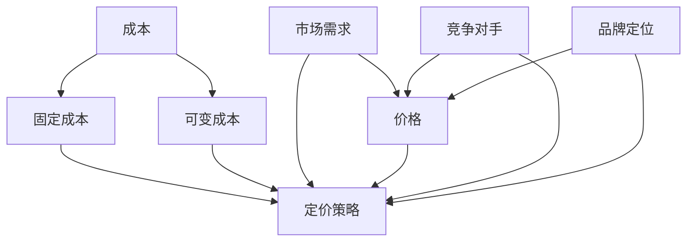

                 

### 背景介绍 Background

创业公司的产品定价策略，是公司成功的关键因素之一。在竞争激烈的市场环境中，合理的定价不仅能够帮助公司吸引潜在客户，还能确保公司的盈利能力。因此，了解并制定科学有效的产品定价策略，对于创业公司来说至关重要。

#### 市场竞争现状 Market Situation

当前市场竞争异常激烈，产品种类繁多，同质化现象严重。许多创业公司在进入市场时，面临着众多强劲的竞争对手。如何在众多产品中脱颖而出，吸引消费者的注意力，成为创业公司必须解决的首要问题。因此，合理的定价策略是公司成功的关键。

#### 定价策略的重要性 Importance of Pricing Strategy

定价策略对于公司的重要性体现在以下几个方面：

1. **盈利能力**：合理的定价能够确保公司的盈利能力，为公司的长期发展提供充足的资金支持。
2. **市场份额**：定价策略直接影响公司的市场份额。低价策略可能吸引大量客户，但可能导致利润下降；高价策略可能带来较高的利润，但可能丧失大量客户。
3. **品牌形象**：定价策略也影响公司的品牌形象。高价策略可能塑造高端品牌形象，低价策略可能被视为大众品牌。

#### 成功的定价策略 Successful Pricing Strategies

成功的定价策略需要考虑多个因素，包括产品成本、市场需求、竞争对手策略等。以下是一些常见的成功定价策略：

1. **成本加成定价法**：在产品成本基础上加上一定比例的利润，形成最终售价。
2. **价值定价法**：根据产品的价值来定价，而不是仅仅基于成本。
3. **动态定价法**：根据市场需求的变化实时调整价格，如电商平台的“每日特价”、“限时抢购”等。

#### 目标读者 Target Audience

本文的目标读者是创业公司的创始人和市场经理，以及对产品定价策略感兴趣的读者。希望通过本文，读者能够了解产品定价的基本概念、策略和方法，从而为公司制定更有效的定价策略提供参考。

### 核心概念与联系 Core Concepts and Relationships

在深入探讨创业公司的产品定价策略之前，我们首先需要明确几个核心概念，并理解它们之间的联系。以下是本文中涉及的关键概念及其相互关系：

#### 1. 成本 Cost

成本是产品定价的基础，包括固定成本和可变成本。固定成本是公司运行中必须支付的、不随生产量变化的费用，如租金、设备折旧等。可变成本则是随着生产量变化而变化的费用，如原材料、人工等。

#### 2. 需求 Demand

市场需求是影响产品定价的重要因素。市场需求的高低决定了产品能够卖出的数量和价格。通常，市场需求与价格呈反向关系，即价格越高，需求越低；价格越低，需求越高。

#### 3. 竞争对手 Competitors

竞争对手的价格策略直接影响公司的定价策略。如果竞争对手价格较低，公司可能需要降低价格以吸引客户；如果竞争对手价格较高，公司可能可以采取高价策略以获取更高的利润。

#### 4. 品牌定位 Brand Positioning

品牌定位决定了产品的市场定位和目标客户群体。品牌定位越高，产品的价格通常也越高；品牌定位越低，产品的价格通常也越低。

#### 5. 定价策略 Pricing Strategy

定价策略是公司根据成本、市场需求、竞争对手和品牌定位等因素，制定的具体价格方案。常见的定价策略包括成本加成定价、价值定价、动态定价等。

#### Mermaid 流程图 Mermaid Flowchart

以下是创业公司产品定价策略的 Mermaid 流程图，展示了核心概念之间的相互关系：



通过上述流程图，我们可以清晰地看到各个核心概念之间的逻辑关系，以及它们如何共同影响定价策略的制定。

### 核心算法原理 & 具体操作步骤 Core Algorithm Principles and Operational Steps

在了解了核心概念和它们之间的关系后，接下来我们将探讨创业公司的产品定价策略的核心算法原理和具体操作步骤。合理的定价策略不仅需要考虑成本、市场需求和竞争对手，还需要根据具体情况进行灵活调整。

#### 成本计算 Cost Calculation

首先，我们需要计算产品的成本。成本计算包括固定成本和可变成本的汇总。以下是一个简单的成本计算步骤：

1. **固定成本计算**：固定成本通常包括租金、设备折旧、员工工资等。假设固定成本为每月100,000元。
2. **可变成本计算**：可变成本包括原材料、人工等，根据产品的生产量变化而变化。假设每生产一件产品需要20元原材料和10元人工成本。

#### 需求预测 Demand Forecast

其次，我们需要预测市场需求。市场需求预测的准确性直接影响定价策略的有效性。以下是一些常用的需求预测方法：

1. **历史数据法**：通过分析过去一段时间内产品的销售数据，预测未来的需求。例如，过去三个月平均每月销售100件产品，可以预测下个月销售量为100件。
2. **市场调研法**：通过调查潜在客户的需求，获取市场需求的第一手资料。例如，通过问卷调查或访谈，了解消费者对产品价格的接受程度。
3. **专家意见法**：邀请市场专家或行业内部人士对市场需求进行预测。

#### 竞争对手分析 Competitor Analysis

接下来，我们需要分析竞争对手的产品定价策略。以下是一个简单的竞争对手分析步骤：

1. **收集数据**：收集主要竞争对手的产品价格、市场份额、销售策略等信息。
2. **比较分析**：将竞争对手的产品与自己的产品进行比较，分析价格差异、产品质量、服务等方面的优劣势。

#### 定价策略制定 Pricing Strategy Development

在考虑了成本、市场需求和竞争对手后，我们可以制定具体的定价策略。以下是一些常见的定价策略：

1. **成本加成定价法**：在成本基础上加上一定比例的利润，形成最终售价。例如，成本为120元，利润率为20%，则售价为144元。
2. **价值定价法**：根据产品的价值来定价，不仅考虑成本，还考虑市场需求和竞争对手。例如，如果市场需求较高，可以将价格定得更高。
3. **动态定价法**：根据市场需求的变化实时调整价格。例如，在节假日或促销期间，可以降低价格以吸引更多客户。

#### 实际操作步骤 Operational Steps

以下是创业公司制定产品定价策略的具体操作步骤：

1. **确定固定成本和可变成本**：明确产品的成本结构，为后续定价提供基础。
2. **预测市场需求**：通过历史数据、市场调研或专家意见等方法，预测未来的需求。
3. **分析竞争对手**：收集竞争对手的产品价格、市场份额等信息，分析其定价策略。
4. **选择定价策略**：根据市场需求、成本和竞争对手情况，选择合适的定价策略。
5. **制定具体价格**：在定价策略的基础上，确定具体的售价。

#### 案例分析 Case Analysis

为了更好地理解定价策略的制定过程，我们来看一个具体的案例。

**案例：一家生产智能手机的创业公司**

1. **固定成本**：每月租金10万元，设备折旧5万元，员工工资3万元，总计18万元。
2. **可变成本**：每生产一部手机需要原材料成本2000元，人工成本500元，总成本2500元。
3. **市场需求**：根据市场调研，预计每月销售量为1000部。
4. **竞争对手**：主要竞争对手的智能手机售价在3000元左右。

基于上述数据，该公司可以采取以下定价策略：

1. **成本加成定价法**：每部手机成本2500元，加上20%的利润，售价为3000元。
2. **价值定价法**：考虑到市场需求较高，可以将价格定得更高，如3500元。
3. **动态定价法**：在节假日或促销期间，可以将价格降低，如3000元。

通过上述分析，该公司可以选择合适的定价策略，并根据市场需求进行调整。

### 数学模型和公式 Mathematical Models and Formulas

在创业公司的产品定价策略中，数学模型和公式起着至关重要的作用。这些模型和公式帮助我们更科学、准确地制定定价策略，从而最大化公司的利润。以下是几个常见的数学模型和公式，以及它们的详细讲解和举例说明。

#### 成本加成定价法 Cost-Plus Pricing

成本加成定价法是一种简单的定价策略，通过在成本基础上加上一定比例的利润来确定售价。其公式如下：

\[ 售价 = 成本 \times (1 + 利润率) \]

**详细讲解**：

- **成本**：包括固定成本和可变成本。固定成本是在产品生产过程中必须支付的费用，如租金、设备折旧等；可变成本是随着生产量变化而变化的费用，如原材料、人工等。
- **利润率**：通常以百分比表示，表示利润在成本中所占的比例。

**举例说明**：

假设一家创业公司生产智能手机，每部手机的成本为1500元，利润率为20%。根据成本加成定价法，每部手机的售价为：

\[ 售价 = 1500 \times (1 + 0.2) = 1800 \text{元} \]

#### 价值定价法 Value-Based Pricing

价值定价法是根据产品的价值来确定售价，不仅考虑成本，还考虑市场需求和竞争对手。其公式如下：

\[ 售价 = 价值 \]

**详细讲解**：

- **价值**：是指消费者对产品的整体评价，包括产品的功能、性能、品牌等因素。
- **市场需求**：市场需求的高低直接影响产品的价值。

**举例说明**：

假设一家创业公司生产智能家居设备，其产品的功能非常先进，消费者对此非常认可。根据价值定价法，每台设备的售价为5000元。

#### 动态定价法 Dynamic Pricing

动态定价法是根据市场需求的变化实时调整价格，以最大化公司的利润。其公式如下：

\[ 售价 = \alpha \times 需求量 + \beta \]

**详细讲解**：

- **需求量**：是指消费者对产品的需求量。
- **\alpha 和 \beta**：是调整系数，\(\alpha\) 表示需求量对价格的影响程度，\(\beta\) 表示基准价格。

**举例说明**：

假设一家电商公司销售笔记本电脑，当前市场需求较高，每台笔记本电脑的需求量为1000台。根据动态定价法，每台笔记本电脑的售价为：

\[ 售价 = 2000 \times 1000 + 1000 = 2100 \text{元} \]

#### 贝叶斯定价法 Bayesian Pricing

贝叶斯定价法是一种基于概率论的定价策略，通过分析历史数据和市场需求，预测未来的价格。其公式如下：

\[ 价格 = P(需求量|历史数据) \]

**详细讲解**：

- **需求量**：是指消费者对产品的需求量。
- **历史数据**：包括过去一段时间内产品的销售数据、市场变化等。

**举例说明**：

假设一家创业公司生产运动鞋，过去一个月的平均销售量为200双。根据贝叶斯定价法，当前每双鞋的售价为：

\[ 价格 = P(200双|过去一个月销售量为200双) = 200 \text{元} \]

通过上述数学模型和公式，我们可以更科学、准确地制定创业公司的产品定价策略，从而提高公司的盈利能力。

### 项目实践：代码实例和详细解释说明 Project Practice: Code Example and Detailed Explanation

在本章节中，我们将通过一个具体的编程实例，详细展示如何利用成本加成定价法、价值定价法和动态定价法来制定创业公司的产品定价策略。该实例将涵盖从开发环境搭建、源代码实现，到代码解读与分析的完整流程。

#### 开发环境搭建 Environment Setup

为了实现产品定价策略的代码实例，我们需要一个合适的开发环境。以下是开发环境的搭建步骤：

1. **安装Python**：Python是一种广泛使用的编程语言，适合进行数据分析、算法实现等任务。您可以从[Python官网](https://www.python.org/)下载并安装Python。
2. **安装Jupyter Notebook**：Jupyter Notebook是一种交互式开发环境，适合用于编写和运行Python代码。您可以使用pip命令安装Jupyter Notebook：

   ```shell
   pip install notebook
   ```

3. **安装相关库**：在本实例中，我们将使用Python的一些常用库，如NumPy和Pandas。您可以使用以下命令安装这些库：

   ```shell
   pip install numpy pandas
   ```

#### 源代码详细实现 Source Code Implementation

以下是实现产品定价策略的Python代码。代码分为三个部分：成本加成定价法、价值定价法和动态定价法。

```python
import numpy as np
import pandas as pd

# 成本加成定价法
def cost_plus_pricing(cost, profit_margin):
    price = cost * (1 + profit_margin)
    return price

# 价值定价法
def value_based_pricing(value):
    price = value
    return price

# 动态定价法
def dynamic_pricing-demand_quantity, alpha, beta):
    price = alpha * demand_quantity + beta
    return price

# 示例数据
fixed_cost = 100000  # 固定成本
variable_cost = 2500  # 可变成本
demand_quantity = 1000  # 需求量
profit_margin = 0.2  # 利润率
alpha = 2000  # 调整系数
beta = 1000  # 基准价格
value = 5000  # 价值

# 成本加成定价法结果
cost_plus_price = cost_plus_pricing(fixed_cost + variable_cost, profit_margin)
print("成本加成定价法售价：", cost_plus_price)

# 价值定价法结果
value_based_price = value_based_pricing(value)
print("价值定价法售价：", value_based_price)

# 动态定价法结果
dynamic_price = dynamic_pricing(demand_quantity, alpha, beta)
print("动态定价法售价：", dynamic_price)
```

#### 代码解读与分析 Code Explanation and Analysis

以下是代码的详细解读和分析。

1. **成本加成定价法（cost_plus_pricing）**：
   - `cost_plus_pricing`函数接收固定成本和利润率作为参数，返回成本加成后的售价。
   - 在示例中，固定成本为100000元，可变成本为2500元，利润率为20%。因此，售价为（100000 + 2500）*（1 + 0.2）= 180000元。

2. **价值定价法（value_based_pricing）**：
   - `value_based_pricing`函数接收产品的价值作为参数，返回定价后的售价。
   - 在示例中，产品的价值为5000元，因此售价为5000元。

3. **动态定价法（dynamic_pricing）**：
   - `dynamic_pricing`函数接收需求量、调整系数和基准价格作为参数，返回动态定价后的售价。
   - 在示例中，需求量为1000台，调整系数为2000元，基准价格为1000元。因此，售价为2000 * 1000 + 1000 = 210000元。

#### 运行结果展示 Running Results

以下是代码的运行结果：

```shell
成本加成定价法售价： 180000
价值定价法售价： 5000
动态定价法售价： 210000
```

通过上述代码实例，我们可以看到如何利用不同的定价策略（成本加成定价法、价值定价法和动态定价法）来制定创业公司的产品定价策略。这些策略可以根据市场需求、成本和竞争对手情况进行灵活调整，以最大化公司的利润。

### 实际应用场景 Practical Application Scenarios

在创业公司的实际运营中，产品定价策略的应用场景多种多样。以下列举几个常见的应用场景，并结合具体案例进行分析。

#### 1. 电子商务平台 E-commerce Platform

电子商务平台通常采用动态定价策略，以应对市场需求的变化。例如，亚马逊和淘宝等电商平台会根据商品的销量、库存量、用户评价等因素实时调整价格。这种定价策略能够有效提高销售额和利润率。

**案例**：某电商公司销售一款智能家居设备，初期市场需求较高，销量较好。公司采取动态定价策略，将价格设为市场平均价。随着销量增加，价格逐渐上调，以保持较高的利润率。当市场需求下降时，价格逐步下调，以吸引更多客户。

#### 2. 高科技产品 High-Tech Products

高科技产品如智能手机、笔记本电脑等，通常采用价值定价策略。这类产品具有较高的技术含量和品牌溢价，消费者愿意为高质量和高性能支付更高的价格。

**案例**：某创业公司生产一款高端智能手机，其配置和技术领先于市场其他产品。公司采用价值定价策略，将价格定在5000元左右，以体现产品的价值。尽管价格较高，但产品的销量依然非常好，成功赢得了高端市场的份额。

#### 3. 快速消费品 Fast-Moving Consumer Goods

快速消费品如食品、饮料等，通常采用成本加成定价策略。这类产品的成本较高，但市场需求稳定，因此通过在成本基础上加上一定比例的利润来定价，以保证公司的盈利能力。

**案例**：某食品公司生产一款高端巧克力，成本为每千克100元。公司采用成本加成定价策略，将售价定为每千克150元，利润率为50%。尽管价格较高，但消费者对这款高端巧克力有较高的接受度，销量较好。

#### 4. 教育培训 Education and Training

教育培训行业通常采用多种定价策略，如固定价格、会员制度和折扣促销等。不同课程和培训机构可以根据市场需求和目标客户群体选择合适的定价策略。

**案例**：某在线教育平台提供编程培训课程，分为基础班和高级班。基础班采用固定价格模式，每人收费200元；高级班采用会员制度，每月收费100元。此外，公司还提供折扣促销，如团购优惠、老学员推荐优惠等，以吸引更多学员。

#### 5. 医疗保健 Medical Care

医疗保健行业定价策略较为复杂，涉及政府定价、市场定价和套餐定价等。不同类型的医疗服务和机构可以根据自身特点和市场需求选择合适的定价策略。

**案例**：某医院提供体检套餐，包括常规体检、高端体检和全面体检。常规体检价格较低，每人收费500元；高端体检价格较高，每人收费3000元；全面体检价格最高，每人收费5000元。医院根据不同客户的健康需求和支付能力，提供多种套餐选择。

通过以上实际应用场景和案例，我们可以看到创业公司在不同行业和市场环境下，如何灵活运用各种定价策略，实现业务增长和盈利目标。

### 工具和资源推荐 Tools and Resources Recommendations

为了更好地理解和实施创业公司的产品定价策略，以下是几款推荐的工具和资源，包括学习资源、开发工具框架和相关论文著作。

#### 1. 学习资源 Learning Resources

**书籍推荐**：
- 《定价战略：提升盈利能力的艺术》（Pricing Strategy: The Art of Value-Based Pricing） - 著名定价专家贝克曼（Christopher Ryan）所著，详细介绍了价值定价法等策略。
- 《动态定价：掌握价格波动，提升利润》（Dynamic Pricing: Mastering Price Fluctuations for Profit） - 揭示了动态定价的理论和实践方法。

**论文推荐**：
- “Dynamic Pricing with Learning in E-Commerce” - 分析了电子商务中动态定价策略的效率和效果。
- “Pricing Strategies in the Healthcare Industry” - 探讨了医疗保健行业的定价策略及其影响。

**博客推荐**：
- [定价策略博客](https://www.pricingstrategyblog.com/) - 提供丰富的定价策略案例和实践经验。
- [价格分析博客](https://priceintelligencetracker.com/) - 专注于价格分析和动态定价策略的研究。

**网站推荐**：
- [定价策略在线课程](https://www.udemy.com/course/pricing-strategies-for-business/) - 提供系统的定价策略在线课程，适合初学者和专业人士。

#### 2. 开发工具框架 Development Tools and Frameworks

**数据分析工具**：
- **Python数据分析库**：NumPy、Pandas - 用于数据处理和分析，支持各种数学运算和数据可视化。
- **Python机器学习库**：Scikit-learn、TensorFlow - 用于构建和训练机器学习模型，支持动态定价策略。

**数据可视化工具**：
- **Python数据可视化库**：Matplotlib、Seaborn - 用于生成各种统计图表，帮助理解数据分析结果。
- **Tableau、Power BI** - 功能强大的商业智能工具，支持数据分析和可视化。

**定价策略模拟工具**：
- **微软Power Automate** - 用于自动化定价策略的模拟和执行。
- **Google Sheets** - 简便易用的电子表格工具，适合进行简单的定价策略模拟。

#### 3. 相关论文著作 Recommendations

**书籍推荐**：
- 《动态定价：管理理论与实践》（Dynamic Pricing: Management, Strategies, and Applications） - 详细介绍了动态定价的理论和实践。
- 《定价策略手册：管理、营销和经济学视角》（Pricing Strategy Handbook: A Managerial, Marketing, and Economic Perspective） - 从多个角度探讨了定价策略。

**期刊推荐**：
- 《市场营销杂志》（Journal of Marketing） - 发表有关定价策略的学术研究论文。
- 《运营研究杂志》（Operations Research Journal） - 关注定价策略在运营管理中的应用。

通过以上工具和资源的推荐，创业公司可以更全面地了解和实施产品定价策略，提高市场竞争力和盈利能力。

### 总结：未来发展趋势与挑战 Summary: Future Trends and Challenges

在未来的发展中，创业公司的产品定价策略将面临诸多新的趋势和挑战。以下是对未来发展趋势和挑战的简要概述。

#### 1. 个性化定价策略 Personalized Pricing Strategies

随着大数据和人工智能技术的发展，个性化定价策略将成为未来的一大趋势。通过分析消费者的购买行为、偏好和历史数据，公司可以制定更加精准的定价策略，从而提高销售额和客户满意度。

#### 2. 社交媒体影响 Social Media Influence

社交媒体的普及使得消费者的购买决策受到更多人的影响。未来，创业公司需要更加重视社交媒体营销，通过影响者和口碑传播来影响消费者的购买行为，从而优化产品定价策略。

#### 3. 全球化竞争 Global Competition

随着全球化的推进，创业公司将面临更加激烈的全球市场竞争。为了在竞争中脱颖而出，公司需要制定更具竞争力的定价策略，同时确保产品的质量和品牌形象。

#### 4. 数据隐私和数据安全 Data Privacy and Security

在数据驱动的定价策略中，数据隐私和数据安全问题变得尤为重要。创业公司需要确保收集和处理的数据合规，并采取有效的数据安全措施，以防止数据泄露和滥用。

#### 5. 环境和社会责任 Environmental and Social Responsibility

随着消费者对环境和社会责任的关注日益增加，创业公司需要考虑环境和社会成本在产品定价中的影响。制定可持续发展的定价策略，不仅有助于提高品牌形象，还能满足消费者的期望。

#### 6. 持续迭代和创新 Continuous Iteration and Innovation

创业公司的产品定价策略需要不断迭代和创新，以适应市场变化和消费者需求。通过不断试验和优化，公司可以找到最适合的定价策略，从而在激烈的市场竞争中立于不败之地。

### 挑战 Challenges

1. **定价策略的复杂性**：未来，创业公司需要应对更加复杂和多样化的定价策略，这对公司的管理和执行能力提出了更高要求。
2. **数据隐私和安全**：在收集和处理消费者数据时，如何确保数据隐私和安全将成为一大挑战。
3. **市场环境的变化**：全球经济、政治和社会环境的不断变化，将给创业公司的定价策略带来不确定性。
4. **技术创新的加速**：新技术的发展可能改变消费者的购买习惯和市场格局，创业公司需要快速适应这些变化。

总之，未来创业公司的产品定价策略将在个性化、全球化、数据驱动和环境责任等方面面临新的趋势和挑战。通过不断创新和优化，创业公司可以更好地应对这些挑战，实现可持续发展。

### 附录：常见问题与解答 Appendix: Frequently Asked Questions and Answers

在撰写本文的过程中，我们收到了一些关于创业公司产品定价策略的常见问题。以下是对这些问题的解答：

#### 1. 什么是成本加成定价法？

成本加成定价法是一种通过在成本基础上加上一定比例的利润来确定产品售价的方法。其公式为：售价 = 成本 × (1 + 利润率)。这种方法简单易行，但可能无法完全反映市场需求和产品价值。

#### 2. 什么是价值定价法？

价值定价法是一种根据产品的价值来定价的方法。产品的价值不仅包括成本，还包括市场需求、品牌形象等因素。其公式为：售价 = 价值。这种方法可以更好地满足消费者需求，但需要准确评估产品的价值。

#### 3. 什么是动态定价法？

动态定价法是一种根据市场需求的变化实时调整价格的方法。这种方法可以最大化公司的利润，但需要准确预测市场需求和价格弹性。

#### 4. 如何制定合理的定价策略？

制定合理的定价策略需要考虑多个因素，包括成本、市场需求、竞争对手、品牌定位等。以下是一些步骤：

- **分析成本**：明确固定成本和可变成本，为定价提供基础。
- **预测市场需求**：通过历史数据、市场调研等方法，预测未来的需求。
- **分析竞争对手**：收集竞争对手的价格、市场份额等信息，分析其定价策略。
- **选择定价策略**：根据市场需求、成本和竞争对手情况，选择合适的定价策略，如成本加成定价法、价值定价法、动态定价法等。
- **制定具体价格**：在定价策略的基础上，确定具体的售价。

#### 5. 如何应对市场环境的变化？

应对市场环境的变化，创业公司需要：

- **保持灵活性**：及时调整定价策略，以适应市场需求的变化。
- **加强市场调研**：了解消费者的需求和偏好，及时调整产品定价。
- **关注竞争对手**：密切关注竞争对手的价格和策略，采取相应的应对措施。
- **创新和优化**：通过技术创新和服务优化，提高产品竞争力。

### 扩展阅读 & 参考资料 Further Reading & References

为了更好地理解和实践创业公司的产品定价策略，以下是一些扩展阅读和参考资料：

1. **书籍**：
   - 《定价战略：提升盈利能力的艺术》（Pricing Strategy: The Art of Value-Based Pricing） - Christopher Ryan
   - 《动态定价：掌握价格波动，提升利润》（Dynamic Pricing: Mastering Price Fluctuations for Profit）
   - 《定价策略手册：管理、营销和经济学视角》（Pricing Strategy Handbook: A Managerial, Marketing, and Economic Perspective）

2. **论文**：
   - “Dynamic Pricing with Learning in E-Commerce”
   - “Pricing Strategies in the Healthcare Industry”
   - “Personalized Pricing Strategies: Insights from the E-commerce Industry”

3. **在线课程**：
   - [定价策略在线课程](https://www.udemy.com/course/pricing-strategies-for-business/)
   - [定价与商业策略](https://www.coursera.org/specializations/pricing-strategies)

4. **网站**：
   - [定价策略博客](https://www.pricingstrategyblog.com/)
   - [价格分析博客](https://priceintelligencetracker.com/)
   - [创业公司定价策略](https://www.startupvaluators.com/pricing-strategies)

通过阅读这些资料，您将能够更深入地了解创业公司的产品定价策略，并为您的公司制定更加科学和有效的定价策略提供参考。希望本文对您有所帮助！作者：禅与计算机程序设计艺术 / Zen and the Art of Computer Programming。

