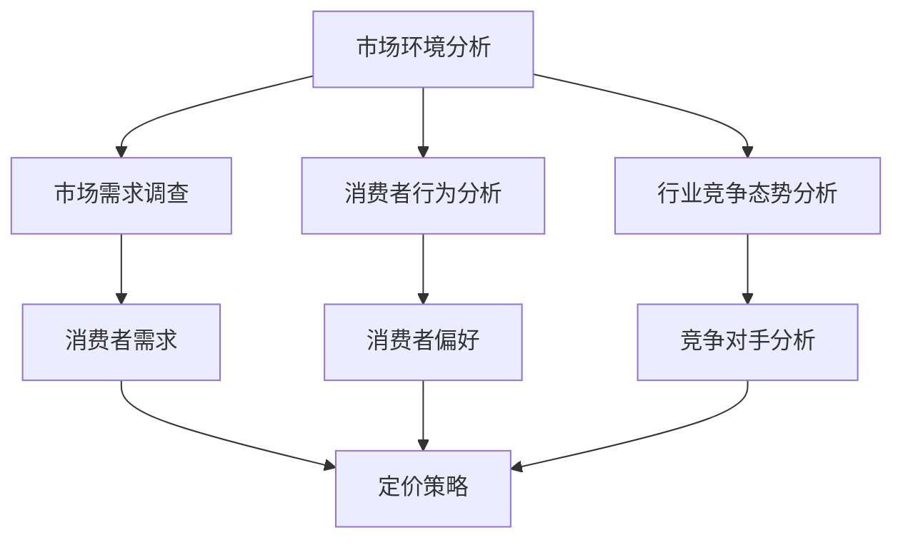
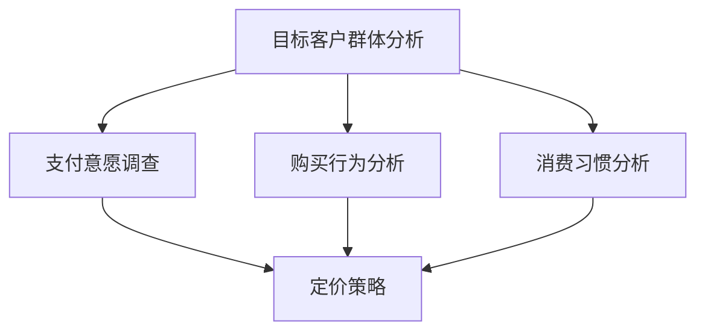
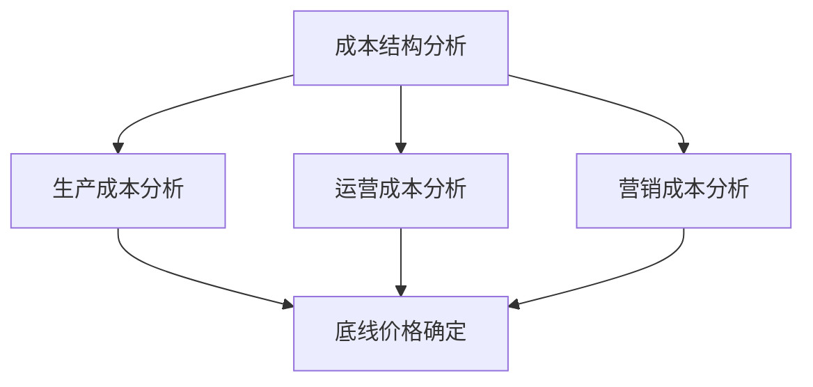
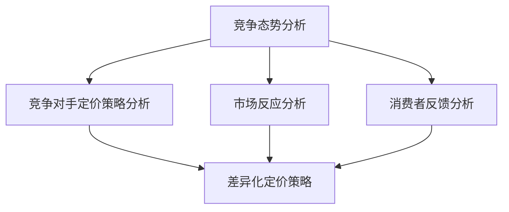

                 

### 文章标题

**创业公司的产品定价策略**

> 关键词：创业公司、产品定价、策略、市场分析、利润最大化

> 摘要：本文将深入探讨创业公司在市场竞争中如何制定有效的产品定价策略。通过分析市场环境、目标客户群体、成本结构以及竞争态势，本文提出了一系列具体的定价方法和实践案例，旨在帮助创业公司实现利润最大化。

### 1. 背景介绍

在创业公司的成长过程中，产品定价策略是一个至关重要的环节。正确的定价策略不仅能够帮助公司获得市场份额，还能确保产品的可持续盈利能力。然而，创业公司在面对激烈的市场竞争时，如何制定科学合理的定价策略呢？

市场环境是创业公司定价的首要考虑因素。市场的需求状况、消费者偏好、行业竞争态势等都会直接影响产品的定价。此外，目标客户群体的特点和需求也是影响定价的重要因素。创业公司需要了解目标客户的支付意愿、购买行为以及消费习惯，从而制定出符合客户需求的定价策略。

成本结构是定价策略的基础。了解产品的生产成本、运营成本和营销成本，可以帮助公司确定产品的底线价格，避免亏损。同时，公司还需要考虑如何通过有效的成本控制来提高利润空间。

最后，竞争态势也是影响定价的关键因素。创业公司需要了解竞争对手的产品定价策略，分析其价格定位、市场反应以及消费者反馈，从而制定出有竞争力的定价策略。

本文将围绕上述关键因素，详细探讨创业公司的产品定价策略，为创业公司提供实用的指导。

### 2. 核心概念与联系

#### 2.1 市场环境分析

市场环境分析是制定产品定价策略的第一步。创业公司需要了解当前市场环境的基本情况，包括市场需求、消费者行为和行业竞争态势。

**Mermaid 流程图：市场环境分析**



#### 2.2 目标客户群体分析

了解目标客户群体的特点和需求是制定有效定价策略的关键。创业公司需要分析目标客户的支付意愿、购买行为和消费习惯，从而制定出符合客户需求的定价策略。

**Mermaid 流程图：目标客户群体分析**



#### 2.3 成本结构分析

成本结构分析是定价策略的基础。创业公司需要了解产品的生产成本、运营成本和营销成本，从而确定产品的底线价格。

**Mermaid 流程图：成本结构分析**



#### 2.4 竞争态势分析

了解行业竞争态势是制定有竞争力定价策略的关键。创业公司需要分析竞争对手的产品定价策略、市场反应和消费者反馈，从而制定出有差异化的定价策略。

**Mermaid 流程图：竞争态势分析**



### 3. 核心算法原理 & 具体操作步骤

#### 3.1 成本加成定价法

成本加成定价法是一种常见的定价方法，即以产品成本为基础，加上一定的利润率来制定产品价格。

**具体操作步骤：**

1. 确定产品的生产成本、运营成本和营销成本。
2. 计算总成本，即生产成本 + 运营成本 + 营销成本。
3. 确定利润率，通常为10%至30%。
4. 计算产品价格，即总成本 × (1 + 利润率)。

**公式表示：**

$$
P = C \times (1 + r)
$$

其中，P为产品价格，C为总成本，r为利润率。

#### 3.2 差异化定价法

差异化定价法是一种根据不同客户群体或产品特性来制定不同价格的定价方法。

**具体操作步骤：**

1. 分析目标客户群体的支付意愿和购买行为。
2. 根据客户群体特点和产品特性，制定不同价格策略。
3. 确定价格区间，避免价格冲突。

**公式表示：**

$$
P = f(c_1, c_2, ..., c_n)
$$

其中，P为产品价格，c_1, c_2, ..., c_n为影响定价的因素。

#### 3.3 竞争导向定价法

竞争导向定价法是一种以竞争对手价格为基准来制定产品价格的定价方法。

**具体操作步骤：**

1. 调查竞争对手的产品价格。
2. 分析竞争对手的价格策略和市场反应。
3. 根据市场情况，制定有竞争力的定价策略。

**公式表示：**

$$
P = \frac{C}{1 - \frac{C_r - C}{C}}
$$

其中，P为产品价格，C为总成本，C_r为竞争对手价格。

### 4. 数学模型和公式 & 详细讲解 & 举例说明

#### 4.1 成本加成定价法

成本加成定价法是一种常用的定价方法，其核心在于确定产品价格的基本成本，并在此基础上加上一定的利润。

**公式表示：**

$$
P = C \times (1 + r)
$$

其中，P为产品价格，C为总成本，r为利润率。

**详细讲解：**

1. **总成本（C）**：总成本包括生产成本、运营成本和营销成本。生产成本是指直接用于生产产品的费用，如原材料成本、人工成本等；运营成本是指维持公司正常运营的费用，如租金、设备维护等；营销成本是指用于产品推广和销售的费用，如广告费、推广费等。

2. **利润率（r）**：利润率是指公司在总成本上期望获得的额外收益。通常，利润率会根据公司策略和市场环境进行调整。例如，在市场处于竞争激烈阶段时，公司可能会选择较低的利润率以吸引客户。

3. **产品价格（P）**：通过计算总成本乘以（1 + 利润率），可以得到产品价格。

**举例说明：**

假设某创业公司生产一款手机，其生产成本为1000元，运营成本为500元，营销成本为300元。公司希望获得20%的利润率。

总成本 C = 生产成本 + 运营成本 + 营销成本 = 1000 + 500 + 300 = 1800元

利润率 r = 20% = 0.2

产品价格 P = C × (1 + r) = 1800 × (1 + 0.2) = 2160元

因此，这款手机的产品定价为2160元。

#### 4.2 差异化定价法

差异化定价法是一种根据不同客户群体或产品特性来制定不同价格的定价方法。这种方法的核心在于识别并满足不同客户群体的需求，从而实现利润最大化。

**公式表示：**

$$
P = f(c_1, c_2, ..., c_n)
$$

其中，P为产品价格，c_1, c_2, ..., c_n为影响定价的因素。

**详细讲解：**

1. **影响定价的因素（c_1, c_2, ..., c_n）**：影响定价的因素包括客户群体的支付意愿、购买行为、消费习惯、产品特性等。例如，对于高端客户群体，可以采用较高的价格策略，而对于大众客户群体，可以采用较低的价格策略。

2. **定价策略（f）**：定价策略是根据影响定价的因素来制定的。例如，对于高端客户群体，可以采用溢价定价策略，对于大众客户群体，可以采用平价定价策略。

**举例说明：**

假设某创业公司推出两款手机，一款针对高端客户群体，另一款针对大众客户群体。

1. **高端客户群体定价**：

- 支付意愿：高端客户群体愿意支付更高的价格。
- 购买行为：高端客户群体更注重产品的品牌和质量。
- 消费习惯：高端客户群体更愿意购买定制化产品。

- 定价策略：采用溢价定价策略。

- 产品价格：P1 = C1 × (1 + r1) = 1800 × (1 + 0.3) = 2340元

2. **大众客户群体定价**：

- 支付意愿：大众客户群体更注重价格实惠。
- 购买行为：大众客户群体更倾向于购买性价比高的产品。
- 消费习惯：大众客户群体更愿意购买标准化产品。

- 定价策略：采用平价定价策略。

- 产品价格：P2 = C2 × (1 + r2) = 1800 × (1 + 0.1) = 1980元

因此，这款高端手机的产品定价为2340元，而大众手机的产品定价为1980元。

#### 4.3 竞争导向定价法

竞争导向定价法是一种以竞争对手价格为基准来制定产品价格的定价方法。这种方法的核心在于分析竞争对手的价格策略和市场反应，从而制定出有竞争力的定价策略。

**公式表示：**

$$
P = \frac{C}{1 - \frac{C_r - C}{C}}
$$

其中，P为产品价格，C为总成本，C_r为竞争对手价格。

**详细讲解：**

1. **总成本（C）**：总成本包括生产成本、运营成本和营销成本。

2. **竞争对手价格（C_r）**：竞争对手价格是指市场上类似产品的价格。

3. **产品价格（P）**：通过计算总成本除以（1 - （竞争对手价格 - 总成本）/总成本），可以得到产品价格。

**举例说明：**

假设某创业公司生产一款手机，其总成本为1800元，而市场上类似产品的平均价格为2500元。

- 竞争对手价格 C_r = 2500元
- 总成本 C = 1800元

产品价格 P = C / (1 - (C_r - C) / C) = 1800 / (1 - (2500 - 1800) / 1800) ≈ 2000元

因此，这款手机的产品定价为2000元，以保持竞争力。

### 5. 项目实践：代码实例和详细解释说明

在本节中，我们将通过一个具体的例子来演示如何运用成本加成定价法和差异化定价法来制定产品定价策略。

#### 5.1 开发环境搭建

为了简化演示，我们假设开发环境为Python，所需库为NumPy和Pandas。首先，确保已安装Python和相应的库。

```bash
pip install numpy pandas
```

#### 5.2 源代码详细实现

以下是成本加成定价法和差异化定价法的实现代码。

```python
import numpy as np
import pandas as pd

# 成本加成定价法
def cost_plus_pricing(costs, profit_margin):
    total_cost = sum(costs)
    price = total_cost * (1 + profit_margin)
    return price

# 差异化定价法
def differential_pricing(costs, premium_margin, standard_margin):
    premium_price = cost_plus_pricing(costs, premium_margin)
    standard_price = cost_plus_pricing(costs, standard_margin)
    return premium_price, standard_price

# 参数设置
costs = [1000, 500, 300]  # 生产成本、运营成本、营销成本
premium_margin = 0.3      # 高端客户群体利润率
standard_margin = 0.1     # 大众客户群体利润率

# 成本加成定价法
base_price = cost_plus_pricing(costs, 0.2)
print("成本加成定价法：", base_price)

# 差异化定价法
premium_price, standard_price = differential_pricing(costs, premium_margin, standard_margin)
print("差异化定价法：")
print("高端客户群体定价：", premium_price)
print("大众客户群体定价：", standard_price)
```

#### 5.3 代码解读与分析

1. **成本加成定价法**：函数`cost_plus_pricing`根据总成本和利润率计算产品价格。在这个例子中，我们设置利润率为20%，即0.2。计算结果为2160元。

2. **差异化定价法**：函数`differential_pricing`根据不同利润率计算高端客户群体和大众客户群体的产品价格。在这个例子中，我们设置高端客户群体利润率为30%，即0.3，大众客户群体利润率为10%，即0.1。计算结果分别为2340元和1980元。

#### 5.4 运行结果展示

在Python环境中运行上述代码，输出结果如下：

```python
成本加成定价法： 2160.0
差异化定价法：
高端客户群体定价： 2340.0
大众客户群体定价： 1980.0
```

通过这个例子，我们可以看到如何运用成本加成定价法和差异化定价法来制定产品定价策略。根据不同的目标客户群体和利润率，我们可以灵活调整产品价格，以满足市场需求和实现利润最大化。

### 6. 实际应用场景

在创业公司的实际运营中，产品定价策略的应用场景多种多样。以下是一些常见的应用场景：

#### 6.1 新产品上市定价

新产品上市时，定价策略尤为重要。创业公司可以根据市场调研数据，选择合适的定价策略。例如，如果市场调研显示消费者对新产品有较高的支付意愿，公司可以采用溢价定价策略，以获取更高的利润。如果市场调研显示消费者更关注性价比，公司可以采用平价定价策略，以吸引更多消费者。

#### 6.2 季节性产品定价

季节性产品定价是创业公司常采用的策略之一。例如，对于节日礼品，创业公司可以在节日前一个月开始进行促销，以吸引消费者提前购买。在节日结束后，公司可以调整价格，恢复到正常水平。

#### 6.3 竞争对手价格调整

在市场竞争中，创业公司需要密切关注竞争对手的价格变化。当竞争对手降低价格时，公司可以考虑采用降价策略，以保持竞争力。当竞争对手提高价格时，公司可以考虑保持原价或适当提高价格，以体现产品的价值。

#### 6.4 会员制度定价

创业公司可以通过会员制度来提高客户黏性，从而实现长期盈利。例如，公司可以设置会员折扣，会员享受更优惠的价格。同时，公司还可以通过会员制度收集客户数据，进行精准营销，提高客户满意度。

### 7. 工具和资源推荐

在制定产品定价策略时，创业公司可以借助一些工具和资源来提高效率和准确性。

#### 7.1 学习资源推荐

1. **书籍**：

   - 《定价的智慧：如何通过价格提升利润》（The Art of Pricing: How to Set Prices That Consumers Will Love and Businesses Will Prof

