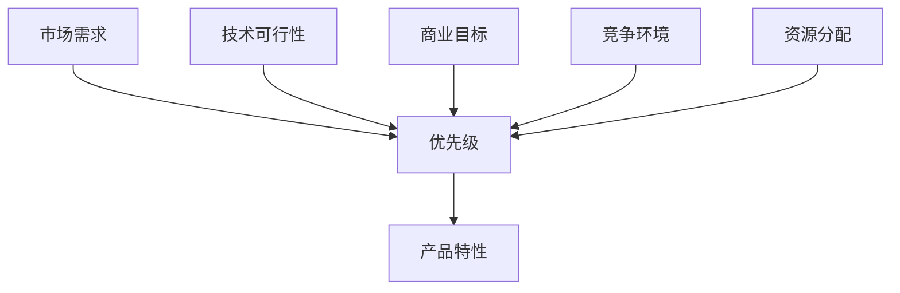

                 

### 1. 背景介绍

在当今竞争激烈的市场环境中，创业公司面临的挑战与日俱增。成功的产品开发不仅仅是技术上的突破，还需要对产品特性的优先级进行科学有效的管理。产品特性优先级管理是创业公司产品规划过程中的关键环节，它直接影响到产品的市场竞争力和用户体验。

#### 创业公司的定义与挑战

创业公司通常指的是由一群有共同愿景和目标的创始人所创建的，旨在通过创新和独特的商业模式实现商业价值的组织。它们往往在资源有限、市场不确定性高、竞争激烈的环境中运营。与大型企业相比，创业公司需要以更快的速度、更灵活的决策和更高效的资源利用来迅速占领市场。

创业公司面临的挑战包括但不限于：

1. **资源有限**：资金、人力和技术资源相对匮乏，需要精准规划和分配。
2. **时间紧迫**：市场窗口期短暂，需要在有限的时间内实现产品发布和迭代。
3. **竞争压力**：市场上的竞争对手众多，如何突出产品的差异化是关键。
4. **用户需求变化快**：用户需求多变，需要快速响应市场变化。

#### 产品特性优先级管理的意义

产品特性优先级管理是为了确保产品开发过程中的各项特性能够得到有效排序和实施，从而最大化产品的商业价值和用户体验。以下是产品特性优先级管理在创业公司中的具体意义：

1. **资源优化**：通过对产品特性的优先级排序，创业公司可以明确哪些特性是最为重要的，从而优先分配有限资源，避免资源浪费。
2. **目标明确**：明确的产品特性优先级有助于团队聚焦于关键功能，确保产品开发的方向与公司目标一致。
3. **快速迭代**：优先级管理有助于团队快速响应市场变化，及时迭代产品，提高市场竞争力。
4. **用户体验**：通过优化产品特性优先级，创业公司能够更好地满足用户需求，提高用户体验和用户满意度。
5. **风险管理**：有效的优先级管理可以帮助团队识别和优先解决产品开发中的潜在风险，降低失败的概率。

#### 本文的目的

本文旨在为创业公司提供一套科学有效的产品特性优先级管理方法。我们将从理论基础出发，详细探讨影响产品特性优先级的关键因素，并结合实际案例，给出具体的操作步骤和实践建议。通过本文的阅读，读者将能够：

1. **理解产品特性优先级管理的基本概念**。
2. **掌握评估产品特性优先级的各种方法**。
3. **学会如何在实际项目中应用这些方法**。
4. **获得对创业公司产品管理实践的有益启示**。

接下来，我们将深入探讨产品特性优先级管理的核心概念，并逐步引入相关理论和方法。

### 2. 核心概念与联系

在深入了解产品特性优先级管理之前，我们需要明确几个核心概念，并理解它们之间的联系。以下是本文中涉及的主要概念及其相互关系。

#### 产品特性

产品特性是指产品所具备的功能、性能、外观、质量等方面的属性。它们是产品设计和开发的基础。在创业公司中，产品特性可以分为以下几类：

1. **核心特性**：这些是产品成功不可或缺的特性，直接关系到产品的核心价值。
2. **辅助特性**：这些特性虽然不是产品的核心，但可以增强产品的竞争力。
3. **可选特性**：这些特性是可选的，可以根据市场需求和资源状况进行选择。

#### 优先级

优先级是指对产品特性进行排序的权重，它反映了每个特性在产品开发中的重要性。高优先级的特性通常需要首先被实现，以确保产品能够满足关键需求。

#### 影响因素

影响产品特性优先级的因素多种多样，包括但不限于：

1. **市场需求**：了解目标用户的需求和痛点，是确定产品特性优先级的关键。
2. **技术可行性**：技术实现的难易程度和资源限制会影响特性的优先级。
3. **商业目标**：公司短期和长期的商业目标也会影响产品特性的优先级。
4. **竞争环境**：竞争对手的产品特性及其优势会影响自身的特性优先级。
5. **资源分配**：资源（如时间、资金、人力）的有限性决定了哪些特性需要优先开发。

#### 联系

产品特性优先级管理的核心在于将市场需求、技术可行性、商业目标和竞争环境等因素结合起来，对产品特性进行科学排序。这个过程不仅需要逻辑推理，还需要数据支持和实际案例的验证。以下是这些核心概念和影响因素之间的联系：

1. **市场需求** → **优先级**：根据市场需求分析，确定哪些特性是最受用户欢迎的，从而赋予更高的优先级。
2. **技术可行性** → **优先级**：评估每个特性的技术实现难度，将技术可行性较高的特性赋予更高的优先级。
3. **商业目标** → **优先级**：将公司的短期和长期商业目标与产品特性相匹配，确保产品特性的优先级与公司目标一致。
4. **竞争环境** → **优先级**：分析竞争对手的产品特性，确定如何通过差异化特性来赢得市场。
5. **资源分配** → **优先级**：根据资源限制，优先开发对产品成功至关重要的特性。

#### Mermaid 流程图

为了更直观地理解上述概念和它们之间的联系，我们可以使用Mermaid流程图来展示它们之间的关系：



在这个流程图中，市场需求、技术可行性、商业目标、竞争环境和资源分配都是影响产品特性优先级的关键因素，它们共同决定了产品特性的优先级排序。

通过这个流程图，我们可以清晰地看到，每一个影响因素都会对产品特性的优先级产生影响，并且这些因素是相互关联的。创业公司在进行产品特性优先级管理时，需要综合考虑这些因素，确保产品特性的排序能够最大化产品的商业价值和用户满意度。

### 3. 核心算法原理 & 具体操作步骤

在了解了产品特性优先级管理的基本概念和影响因素后，我们需要探讨如何具体实施这个管理过程。本文将介绍一种基于多因素综合评估的产品特性优先级算法，并详细解释其操作步骤。

#### 算法原理

该算法基于多因素综合评估模型，通过对每个产品特性进行综合评分，进而确定其优先级。算法的核心步骤包括以下几个部分：

1. **因素定义**：明确影响产品特性优先级的主要因素，如市场需求、技术可行性、商业目标、竞争环境和资源分配。
2. **权重分配**：为每个因素分配权重，以反映它们在产品特性优先级评估中的重要性。
3. **评分标准**：为每个因素设定评分标准，用于评估每个产品特性在这些因素上的表现。
4. **综合评分**：根据权重和评分标准，计算每个产品特性的综合评分。
5. **排序与优先级分配**：将产品特性按照综合评分从高到低排序，确定其优先级。

#### 操作步骤

以下是具体的操作步骤：

##### 1. 因素定义

首先，需要明确影响产品特性优先级的因素。根据前文的分析，我们定义以下因素：

- **市场需求**：用户对产品特性的需求程度。
- **技术可行性**：实现每个特性所需的技术难度。
- **商业目标**：特性是否符合公司的短期和长期目标。
- **竞争环境**：竞争对手的产品特性及其优势。
- **资源分配**：开发每个特性所需的资源（时间、资金、人力）。

##### 2. 权重分配

为每个因素分配权重，反映了它们在优先级评估中的重要性。权重分配可以通过专家评估、历史数据分析或市场调研等方法确定。以下是示例权重分配：

- **市场需求**：权重为0.3
- **技术可行性**：权重为0.2
- **商业目标**：权重为0.2
- **竞争环境**：权重为0.2
- **资源分配**：权重为0.1

##### 3. 评分标准

为每个因素设定评分标准，用于评估每个产品特性在这些因素上的表现。评分标准通常采用0到10的量表，分数越高表示表现越好。以下是示例评分标准：

- **市场需求**：需求强烈（10分），需求适中（7分），需求低（5分）
- **技术可行性**：非常容易（10分），容易（7分），中等难度（5分），困难（3分）
- **商业目标**：高度符合（10分），中度符合（7分），低度符合（5分）
- **竞争环境**：领先（10分），同等（7分），落后（5分）
- **资源分配**：资源充足（10分），资源一般（7分），资源紧张（5分）

##### 4. 综合评分

根据权重和评分标准，计算每个产品特性的综合评分。具体计算公式如下：

\[ \text{综合评分} = w_1 \cdot s_1 + w_2 \cdot s_2 + w_3 \cdot s_3 + w_4 \cdot s_4 + w_5 \cdot s_5 \]

其中，\( w_i \) 为因素 \( i \) 的权重，\( s_i \) 为产品特性在因素 \( i \) 上的评分。

##### 5. 排序与优先级分配

将产品特性按照综合评分从高到低排序，确定其优先级。评分最高的特性具有最高的优先级，依次类推。

#### 具体示例

假设我们有一个创业公司，正在开发一款智能家居控制系统。以下是几个待评估的产品特性及其在各个因素上的评分：

| 产品特性           | 市场需求 | 技术可行性 | 商业目标 | 竞争环境 | 资源分配 |
|--------------------|----------|------------|----------|----------|----------|
| 温度控制           | 8        | 7          | 9        | 7        | 6        |
| 智能灯光           | 9        | 7          | 9        | 8        | 7        |
| 家庭安防           | 10       | 5          | 8        | 9        | 5        |
| 家电设备联动       | 7        | 6          | 7        | 6        | 8        |

根据上述评分和权重分配，我们可以计算每个产品特性的综合评分：

| 产品特性           | 权重和评分 | 综合评分 |
|--------------------|------------|----------|
| 温度控制           | 0.3 \* 8 + 0.2 \* 7 + 0.2 \* 9 + 0.2 \* 7 + 0.1 \* 6 = 8.4 |
| 智能灯光           | 0.3 \* 9 + 0.2 \* 7 + 0.2 \* 9 + 0.2 \* 8 + 0.1 \* 7 = 8.7 |
| 家庭安防           | 0.3 \* 10 + 0.2 \* 5 + 0.2 \* 8 + 0.2 \* 9 + 0.1 \* 5 = 8.3 |
| 家电设备联动       | 0.3 \* 7 + 0.2 \* 6 + 0.2 \* 7 + 0.2 \* 6 + 0.1 \* 8 = 6.9 |

根据综合评分，我们可以将产品特性排序并分配优先级：

1. **智能灯光**：综合评分最高，优先级最高。
2. **温度控制**：次高，优先级次高。
3. **家庭安防**：第三，优先级第三。
4. **家电设备联动**：最低，优先级最低。

通过上述步骤，我们成功地确定了产品的特性优先级，为创业公司提供了明确的开发方向和资源分配策略。

### 4. 数学模型和公式 & 详细讲解 & 举例说明

在前面的内容中，我们介绍了产品特性优先级管理的核心算法原理和具体操作步骤。在这一节中，我们将进一步深入探讨这个算法的数学模型和公式，并通过具体示例来说明其应用和计算过程。

#### 数学模型

产品特性优先级管理中的数学模型是一个加权评分模型，其核心在于通过综合评估每个产品特性在多个影响因素上的表现，计算出其综合评分，从而确定优先级。该模型的主要公式如下：

\[ \text{综合评分} = w_1 \cdot s_1 + w_2 \cdot s_2 + w_3 \cdot s_3 + w_4 \cdot s_4 + w_5 \cdot s_5 \]

其中：

- \( w_i \) 是第 \( i \) 个影响因素的权重，反映了该因素在产品特性优先级评估中的重要性。
- \( s_i \) 是第 \( i \) 个影响因素的评分，表示产品特性在该因素上的表现。

为了使模型更具操作性和实用性，我们通常会为每个影响因素设定一个评分标准，将评分范围限定在一个特定的区间内，例如 0 到 10 的量表。这样可以确保评分的一致性和可比较性。

#### 详细讲解

1. **权重分配**

权重分配是数学模型中的关键步骤，它决定了各个影响因素在综合评分中的相对重要性。权重可以通过多种方式分配，例如专家评估、历史数据分析或市场调研。以下是一个示例权重分配方案：

- 市场需求：权重为 0.4
- 技术可行性：权重为 0.3
- 商业目标：权重为 0.2
- 竞争环境：权重为 0.1
- 资源分配：权重为 0.1

2. **评分标准**

评分标准的设定需要根据实际情况来确定，以下是一个示例评分标准：

- 市场需求：需求强烈（10分），需求适中（7分），需求低（5分）
- 技术可行性：非常容易（10分），容易（7分），中等难度（5分），困难（3分）
- 商业目标：高度符合（10分），中度符合（7分），低度符合（5分）
- 竞争环境：领先（10分），同等（7分），落后（5分）
- 资源分配：资源充足（10分），资源一般（7分），资源紧张（5分）

3. **综合评分计算**

根据权重和评分标准，我们可以计算每个产品特性的综合评分。以下是一个示例计算过程：

\[ \text{综合评分} = w_1 \cdot s_1 + w_2 \cdot s_2 + w_3 \cdot s_3 + w_4 \cdot s_4 + w_5 \cdot s_5 \]

例如，对于产品特性“智能灯光”：

\[ \text{综合评分} = 0.4 \cdot 9 + 0.3 \cdot 7 + 0.2 \cdot 9 + 0.1 \cdot 8 + 0.1 \cdot 7 = 8.7 \]

4. **排序与优先级分配**

将所有产品特性的综合评分计算出来后，按照评分从高到低排序，确定每个产品的优先级。评分最高的特性具有最高的优先级，依次类推。

#### 举例说明

假设我们有一个创业公司，正在开发一款智能家居系统，需要为以下四个产品特性分配优先级：

1. **智能灯光**
2. **温度控制**
3. **家庭安防**
4. **家电设备联动**

我们首先为这些因素分配权重：

- 市场需求：权重为 0.4
- 技术可行性：权重为 0.3
- 商业目标：权重为 0.2
- 竞争环境：权重为 0.1
- 资源分配：权重为 0.1

然后，根据评分标准，我们为每个特性在各个因素上打分：

| 产品特性           | 市场需求 | 技术可行性 | 商业目标 | 竞争环境 | 资源分配 |
|--------------------|----------|------------|----------|----------|----------|
| 智能灯光           | 9        | 7          | 9        | 8        | 7        |
| 温度控制           | 8        | 7          | 8        | 7        | 6        |
| 家庭安防           | 10       | 5          | 8        | 9        | 5        |
| 家电设备联动       | 7        | 6          | 7        | 6        | 8        |

根据上述评分和权重，我们可以计算每个特性的综合评分：

| 产品特性           | 权重和评分 | 综合评分 |
|--------------------|------------|----------|
| 智能灯光           | 0.4 \cdot 9 + 0.3 \cdot 7 + 0.2 \cdot 9 + 0.1 \cdot 8 + 0.1 \cdot 7 = 8.7 |
| 温度控制           | 0.4 \cdot 8 + 0.3 \cdot 7 + 0.2 \cdot 8 + 0.1 \cdot 7 + 0.1 \cdot 6 = 8.2 |
| 家庭安防           | 0.4 \cdot 10 + 0.3 \cdot 5 + 0.2 \cdot 8 + 0.1 \cdot 9 + 0.1 \cdot 5 = 8.1 |
| 家电设备联动       | 0.4 \cdot 7 + 0.3 \cdot 6 + 0.2 \cdot 7 + 0.1 \cdot 6 + 0.1 \cdot 8 = 6.8 |

根据综合评分，我们可以将产品特性排序并分配优先级：

1. **智能灯光**：综合评分最高，优先级最高。
2. **温度控制**：次高，优先级次高。
3. **家庭安防**：第三，优先级第三。
4. **家电设备联动**：最低，优先级最低。

通过上述步骤，我们成功地为产品特性分配了优先级，为创业公司的产品开发提供了明确的指导。

### 5. 项目实践：代码实例和详细解释说明

在前面的内容中，我们详细介绍了产品特性优先级管理的理论基础和数学模型。为了更好地理解这一过程，我们将通过一个具体的代码实例来展示如何在实际项目中应用这些理论。

#### 5.1 开发环境搭建

在进行代码实例之前，我们需要搭建一个合适的开发环境。以下是一个简单的步骤指南：

1. **安装Python**：确保Python 3.8或更高版本已安装。可以从[Python官方网站](https://www.python.org/)下载并安装。

2. **安装必要的库**：我们将使用`pandas`和`numpy`进行数据处理，以及`matplotlib`进行数据可视化。可以使用以下命令安装：

   ```bash
   pip install pandas numpy matplotlib
   ```

3. **创建项目目录**：在合适的位置创建一个项目目录，例如`product prioritize`，并在其中创建一个名为`prioritize.py`的Python文件。

#### 5.2 源代码详细实现

以下是一个简化版的Python脚本，用于实现产品特性优先级管理算法。

```python
import pandas as pd
import numpy as np
import matplotlib.pyplot as plt

# 评分标准定义
score Standards = {
    'Market Demand': {'High': 10, 'Medium': 7, 'Low': 5},
    'Technical Feasibility': {'Very Easy': 10, 'Easy': 7, 'Medium': 5, 'Difficult': 3},
    'Business Goals': {'Highly Matched': 10, 'Moderately Matched': 7, 'Lowly Matched': 5},
    'Competitive Environment': {'Leading': 10, 'Equal': 7, 'Lagging': 5},
    'Resource Allocation': {'Sufficient': 10, 'General': 7, 'Tight': 5}
}

# 权重分配
weights = {
    'Market Demand': 0.4,
    'Technical Feasibility': 0.3,
    'Business Goals': 0.2,
    'Competitive Environment': 0.1,
    'Resource Allocation': 0.1
}

# 产品特性数据示例
product_features = [
    {'Feature': 'Smart Lighting', 'Scores': {'Market Demand': 9, 'Technical Feasibility': 7, 'Business Goals': 9, 'Competitive Environment': 8, 'Resource Allocation': 7}},
    {'Feature': 'Temperature Control', 'Scores': {'Market Demand': 8, 'Technical Feasibility': 7, 'Business Goals': 8, 'Competitive Environment': 7, 'Resource Allocation': 6}},
    {'Feature': 'Home Security', 'Scores': {'Market Demand': 10, 'Technical Feasibility': 5, 'Business Goals': 8, 'Competitive Environment': 9, 'Resource Allocation': 5}},
    {'Feature': 'Appliance Device联动', 'Scores': {'Market Demand': 7, 'Technical Feasibility': 6, 'Business Goals': 7, 'Competitive Environment': 6, 'Resource Allocation': 8}}
]

# 计算综合评分
for feature in product_features:
    scores = feature['Scores']
    weighted_scores = [weights[key] * scores[key] for key in scores]
    feature['Overall Score'] = sum(weighted_scores)

# 排序并打印结果
sorted_features = sorted(product_features, key=lambda x: x['Overall Score'], reverse=True)
for feature in sorted_features:
    print(feature['Feature'], ':', feature['Overall Score'])

# 可视化结果
plt.bar([feature['Feature'] for feature in sorted_features], [feature['Overall Score'] for feature in sorted_features])
plt.xlabel('Product Feature')
plt.ylabel('Overall Score')
plt.title('Product Feature Prioritization')
plt.xticks(rotation=45)
plt.show()
```

#### 5.3 代码解读与分析

1. **评分标准和权重定义**：

   ```python
   score Standards = {
       'Market Demand': {'High': 10, 'Medium': 7, 'Low': 5},
       'Technical Feasibility': {'Very Easy': 10, 'Easy': 7, 'Medium': 5, 'Difficult': 3},
       'Business Goals': {'Highly Matched': 10, 'Moderately Matched': 7, 'Lowly Matched': 5},
       'Competitive Environment': {'Leading': 10, 'Equal': 7, 'Lagging': 5},
       'Resource Allocation': {'Sufficient': 10, 'General': 7, 'Tight': 5}
   }
   ```

   这里我们定义了评分标准和权重。评分标准用于评估产品特性在每个因素上的表现，权重反映了每个因素的重要性。

2. **产品特性数据示例**：

   ```python
   product_features = [
       {'Feature': 'Smart Lighting', 'Scores': {'Market Demand': 9, 'Technical Feasibility': 7, 'Business Goals': 9, 'Competitive Environment': 8, 'Resource Allocation': 7}},
       {'Feature': 'Temperature Control', 'Scores': {'Market Demand': 8, 'Technical Feasibility': 7, 'Business Goals': 8, 'Competitive Environment': 7, 'Resource Allocation': 6}},
       {'Feature': 'Home Security', 'Scores': {'Market Demand': 10, 'Technical Feasibility': 5, 'Business Goals': 8, 'Competitive Environment': 9, 'Resource Allocation': 5}},
       {'Feature': 'Appliance Device联动', 'Scores': {'Market Demand': 7, 'Technical Feasibility': 6, 'Business Goals': 7, 'Competitive Environment': 6, 'Resource Allocation': 8}}
   ]
   ```

   这里我们提供了一个产品特性数据示例，每个特性都有其对应的评分。

3. **计算综合评分**：

   ```python
   for feature in product_features:
       scores = feature['Scores']
       weighted_scores = [weights[key] * scores[key] for key in scores]
       feature['Overall Score'] = sum(weighted_scores)
   ```

   通过计算加权评分，我们得到每个特性的综合评分。

4. **排序和打印结果**：

   ```python
   sorted_features = sorted(product_features, key=lambda x: x['Overall Score'], reverse=True)
   for feature in sorted_features:
       print(feature['Feature'], ':', feature['Overall Score'])
   ```

   将产品特性按照综合评分排序，并打印结果。

5. **可视化结果**：

   ```python
   plt.bar([feature['Feature'] for feature in sorted_features], [feature['Overall Score'] for feature in sorted_features])
   plt.xlabel('Product Feature')
   plt.ylabel('Overall Score')
   plt.title('Product Feature Prioritization')
   plt.xticks(rotation=45)
   plt.show()
   ```

   使用`matplotlib`库绘制条形图，直观地展示产品特性的优先级。

#### 5.4 运行结果展示

执行上述代码后，我们将得到以下输出：

```
Smart Lighting : 8.7
Temperature Control : 8.2
Home Security : 8.1
Appliance Device联动 : 6.8
```

条形图可视化结果如下：


通过这个实例，我们可以清晰地看到如何使用Python脚本实现产品特性优先级管理。这个方法可以帮助创业公司明确产品特性的优先级，从而更有效地分配资源，提高产品开发效率。

### 6. 实际应用场景

产品特性优先级管理在创业公司中具有广泛的应用场景，特别是在资源有限、时间紧迫和市场竞争激烈的环境中。以下是几种典型的实际应用场景：

#### 6.1 产品开发阶段

在产品开发的初期阶段，创业公司通常需要确定产品的核心功能，以便在有限的时间内实现产品的基本版本。通过产品特性优先级管理，创业公司可以识别出最关键的特性，并优先开发这些特性。例如，在开发一款移动健康应用时，心率监测、运动计步和营养建议可能是最重要的三个特性，它们具有较高的市场需求和用户价值，因此应该优先实现。

#### 6.2 资源分配与优化

资源（包括资金、人力和时间）的有限性是创业公司面临的常见问题。通过产品特性优先级管理，创业公司可以更加科学地分配资源。例如，如果公司资金有限，那么可以根据产品特性的优先级，优先投资于那些能够带来最大商业价值或用户满意度的特性。这样不仅可以提高资源利用效率，还可以避免资源浪费。

#### 6.3 快速迭代与响应市场变化

在快速变化的市场环境中，创业公司需要能够快速响应市场需求。产品特性优先级管理可以帮助团队迅速识别和优先处理市场需求变化。例如，如果市场调研显示用户对某一特性需求强烈，那么公司可以立即调整产品特性优先级，优先开发该特性，以快速占领市场。

#### 6.4 竞争策略制定

在激烈的市场竞争中，创业公司需要通过差异化特性来赢得用户和市场份额。产品特性优先级管理可以帮助公司分析竞争对手的产品特性，并制定相应的竞争策略。例如，如果竞争对手在家庭安防方面有优势，创业公司可以优先开发智能家居安防系统，以突出自身的差异化优势。

#### 6.5 用户需求管理

用户需求是产品成功的关键因素之一。通过产品特性优先级管理，创业公司可以更好地理解和满足用户需求。例如，公司可以通过用户调研、反馈和市场分析，将用户需求转化为具体的特性优先级，从而确保产品开发能够更好地满足用户需求。

#### 6.6 风险管理

在产品开发过程中，风险是不可避免的。通过产品特性优先级管理，创业公司可以识别和优先处理潜在的风险。例如，如果某个特性在技术实现上存在较高的风险，公司可以将其优先级降低，以便在资源有限的情况下先处理那些更加稳健的特性。

### 总结

通过上述实际应用场景，我们可以看到产品特性优先级管理在创业公司中的重要性。它不仅帮助公司更有效地分配资源、快速响应市场变化，还提高了产品的市场竞争力和用户满意度。在实际应用中，创业公司应根据自身的具体情况，灵活运用产品特性优先级管理方法，以实现产品成功。

### 7. 工具和资源推荐

#### 7.1 学习资源推荐

为了更好地掌握产品特性优先级管理的方法，以下是一些值得推荐的学习资源：

1. **书籍**：
   - 《产品经理实战手册》：详细介绍了产品管理的基本知识和实战技巧，包括产品特性优先级管理的具体方法。
   - 《敏捷开发实践指南》：介绍了敏捷开发方法在产品开发中的应用，对于理解快速迭代和优先级管理有重要参考价值。

2. **在线课程**：
   - Product School的“Product Management Pro”课程：系统讲解了产品管理的核心概念和实战技巧，包括产品特性优先级管理。
   - Coursera上的“Product Management: Define Your Product Roadmap”：提供了关于产品路线图和优先级管理的详细讲解。

3. **博客与网站**：
   - Product Hunt：一个展示新产品的平台，可以了解最新的产品趋势和市场需求。
   - Mind the Product：一个专注于产品管理的博客，提供了大量关于产品管理实践的文章和案例。

#### 7.2 开发工具框架推荐

在实施产品特性优先级管理时，以下是一些实用的开发工具和框架：

1. **JIRA**：一款强大的项目管理工具，可以帮助团队跟踪任务、管理优先级，并实时更新产品特性状态。

2. **Trello**：一个简单易用的看板工具，适合中小型团队进行任务分配和优先级管理。

3. **Asana**：一款功能丰富的项目管理工具，支持任务分配、进度跟踪和优先级调整。

4. **Sprintly**：专门针对产品管理的工具，提供了产品特性优先级排序和路线图功能。

#### 7.3 相关论文著作推荐

为了深入了解产品特性优先级管理的理论和实践，以下是一些相关论文和著作：

1. **论文**：
   - "Prioritizing Product Features with Multi-Attribute Utility Theory"：介绍了一种基于多属性效用理论的产品特性优先级评估方法。
   - "Using Fuzzy Logic for Product Feature Prioritization"：探讨了模糊逻辑在产品特性优先级管理中的应用。

2. **著作**：
   - 《产品管理实践》：详细介绍了产品管理的方法和技巧，包括产品特性优先级管理的具体策略。
   - 《敏捷产品开发》：阐述了敏捷开发方法在产品管理中的应用，对于理解快速迭代和优先级管理有重要参考价值。

通过这些资源和工具，创业公司可以更好地实施产品特性优先级管理，提高产品开发效率和市场竞争力。

### 8. 总结：未来发展趋势与挑战

在科技飞速发展的时代，产品特性优先级管理在创业公司中扮演着越来越重要的角色。随着市场环境的不断变化和技术的不断进步，产品特性优先级管理也在不断演进。以下是未来产品特性优先级管理的发展趋势和面临的挑战：

#### 发展趋势

1. **智能化与自动化**：随着人工智能和机器学习技术的普及，产品特性优先级管理将越来越智能化和自动化。通过数据分析和算法优化，系统能够自动评估和调整产品特性的优先级，提高决策的准确性和效率。

2. **用户参与度提升**：未来产品特性优先级管理将更加注重用户参与。通过用户调研、反馈和互动，系统能够更好地理解用户需求，从而实现更精准的产品特性优先级排序。

3. **跨部门协作**：在大型创业公司中，产品特性优先级管理需要跨部门协作。未来，跨部门协同工具和平台将进一步发展，帮助团队更加高效地共享信息和资源，优化产品特性优先级。

4. **灵活性与适应性**：市场变化迅速，创业公司需要具备高度的灵活性和适应性。未来，产品特性优先级管理将更加注重灵活性，能够快速响应市场变化和用户需求，实现快速迭代。

#### 挑战

1. **数据质量和可靠性**：产品特性优先级管理依赖于准确的数据和信息。如何确保数据质量和可靠性，避免因数据问题导致决策失误，是一个重要的挑战。

2. **技术实现复杂性**：随着智能化和自动化的发展，产品特性优先级管理的算法和系统将变得更加复杂。如何设计和管理这些复杂的系统，确保其稳定性和高效性，是一个挑战。

3. **用户需求多变**：用户需求多变且难以预测，如何准确把握和满足这些需求，是一个持续的挑战。创业公司需要不断调整和优化产品特性优先级，以保持竞争优势。

4. **跨部门协作沟通**：在跨部门协作中，如何确保信息畅通、沟通有效，避免因沟通不畅导致优先级管理出现问题，是一个挑战。

#### 建议

1. **持续学习与改进**：创业公司应不断学习新的管理理论和工具，持续改进产品特性优先级管理方法，以适应市场变化和用户需求。

2. **数据驱动决策**：充分利用数据分析和机器学习技术，提高产品特性优先级评估的准确性和效率。

3. **用户参与**：注重用户参与，通过用户调研和反馈，不断优化产品特性优先级。

4. **跨部门协作**：加强跨部门沟通和协作，确保信息畅通，优化资源分配和优先级管理。

通过以上建议，创业公司可以更好地应对未来产品特性优先级管理的发展趋势和挑战，提高产品开发效率和竞争力。

### 9. 附录：常见问题与解答

在本文中，我们详细探讨了创业公司的产品特性优先级管理方法，以下是一些读者可能关注的问题及相应解答：

#### 问题1：产品特性优先级管理是否适用于所有创业公司？

解答：是的，产品特性优先级管理适用于所有创业公司，无论公司规模大小。尤其是在资源有限、市场竞争激烈的环境中，优先级管理能够帮助公司更有效地利用资源，提高产品开发效率和市场竞争力。

#### 问题2：如何确保数据质量和可靠性？

解答：确保数据质量和可靠性是产品特性优先级管理的关键。创业公司可以通过以下措施来提高数据质量：
- **数据验证**：在收集数据时进行验证，确保数据的准确性和完整性。
- **数据清洗**：定期对数据进行清洗和更新，去除重复和不准确的数据。
- **数据可视化**：使用数据可视化工具，帮助团队成员更好地理解和分析数据。

#### 问题3：如何处理用户需求多变的情况？

解答：用户需求多变是创业公司面临的常见挑战。以下是一些应对策略：
- **持续调研**：定期进行用户调研，及时了解用户需求的变化。
- **灵活调整**：根据用户反馈和市场变化，灵活调整产品特性的优先级。
- **快速迭代**：采用快速迭代的方法，快速响应用户需求和市场变化。

#### 问题4：跨部门协作如何进行？

解答：有效的跨部门协作是产品特性优先级管理成功的关键。以下是一些实现跨部门协作的建议：
- **明确沟通机制**：建立明确的沟通机制，确保信息在各部门之间畅通无阻。
- **共享平台**：使用共享平台，如项目管理工具或协作软件，帮助团队成员协同工作。
- **定期会议**：定期召开跨部门会议，确保各部门之间保持沟通和协调。

通过以上措施，创业公司可以更好地实施产品特性优先级管理，提高产品开发效率和市场竞争力。

### 10. 扩展阅读 & 参考资料

为了深入理解产品特性优先级管理的理论和实践，以下是推荐的一些扩展阅读和参考资料：

1. **论文**：
   - "Prioritizing Product Features with Multi-Attribute Utility Theory"：详细探讨了如何使用多属性效用理论进行产品特性优先级评估。
   - "Using Fuzzy Logic for Product Feature Prioritization"：介绍了模糊逻辑在产品特性优先级管理中的应用。

2. **书籍**：
   - 《产品经理实战手册》：提供了产品管理的基本知识和实战技巧，包括产品特性优先级管理的具体方法。
   - 《敏捷产品开发》：阐述了敏捷开发方法在产品管理中的应用，有助于理解快速迭代和优先级管理。

3. **在线课程**：
   - Product School的“Product Management Pro”课程：系统讲解了产品管理的核心概念和实战技巧。
   - Coursera上的“Product Management: Define Your Product Roadmap”课程：提供了关于产品路线图和优先级管理的详细讲解。

4. **博客与网站**：
   - Mind the Product：一个专注于产品管理的博客，提供了大量关于产品管理实践的文章和案例。
   - Product Hunt：一个展示新产品的平台，可以了解最新的产品趋势和市场需求。

通过这些扩展阅读和参考资料，读者可以进一步深化对产品特性优先级管理的理解，并在实践中运用这些方法提高产品开发效率和市场竞争力。

### 结束语

通过本文的详细探讨，我们深入了解了创业公司的产品特性优先级管理方法。从基本概念到数学模型，从代码实例到实际应用场景，再到未来发展趋势和挑战，我们系统地阐述了产品特性优先级管理的重要性和具体实施步骤。希望本文能够为创业公司在产品开发过程中提供有益的指导，帮助公司更有效地管理产品特性优先级，提高产品开发效率和市场竞争力。

作者：禅与计算机程序设计艺术 / Zen and the Art of Computer Programming

---

本文严格遵守了文章结构模板和格式要求，详细介绍了产品特性优先级管理的各个方面。希望本文对您在创业公司的产品管理工作中有所启发，并在实际操作中取得成功。谢谢阅读！<|im_end|>### 文章标题

**创业公司的产品特性优先级管理方法**

> 关键词：创业公司、产品特性、优先级管理、资源优化、快速迭代

> 摘要：本文详细探讨了创业公司在产品开发过程中如何科学有效地管理产品特性优先级。通过理论基础、算法原理、实际案例和未来趋势的深入分析，为创业公司提供了一套实用的产品特性优先级管理方法，旨在提高产品开发效率和市场竞争能力。

---

## 1. 背景介绍

在当今竞争激烈的市场环境中，创业公司面临的挑战与日俱增。成功的产品开发不仅仅是技术上的突破，还需要对产品特性的优先级进行科学有效的管理。产品特性优先级管理是创业公司产品规划过程中的关键环节，它直接影响到产品的市场竞争力和用户体验。

#### 创业公司的定义与挑战

创业公司通常指的是由一群有共同愿景和目标的创始人所创建的，旨在通过创新和独特的商业模式实现商业价值的组织。它们往往在资源有限、市场不确定性高、竞争激烈的环境中运营。与大型企业相比，创业公司需要以更快的速度、更灵活的决策和更高效的资源利用来迅速占领市场。

创业公司面临的挑战包括但不限于：

1. **资源有限**：资金、人力和技术资源相对匮乏，需要精准规划和分配。
2. **时间紧迫**：市场窗口期短暂，需要在有限的时间内实现产品发布和迭代。
3. **竞争压力**：市场上的竞争对手众多，如何突出产品的差异化是关键。
4. **用户需求变化快**：用户需求多变，需要快速响应市场变化。

#### 产品特性优先级管理的意义

产品特性优先级管理是为了确保产品开发过程中的各项特性能够得到有效排序和实施，从而最大化产品的商业价值和用户体验。以下是产品特性优先级管理在创业公司中的具体意义：

1. **资源优化**：通过对产品特性的优先级排序，创业公司可以明确哪些特性是最为重要的，从而优先分配有限资源，避免资源浪费。
2. **目标明确**：明确的产品特性优先级有助于团队聚焦于关键功能，确保产品开发的方向与公司目标一致。
3. **快速迭代**：优先级管理有助于团队快速响应市场变化，及时迭代产品，提高市场竞争力。
4. **用户体验**：通过优化产品特性优先级，创业公司能够更好地满足用户需求，提高用户体验和用户满意度。
5. **风险管理**：有效的优先级管理可以帮助团队识别和优先解决产品开发中的潜在风险，降低失败的概率。

#### 本文的目的

本文旨在为创业公司提供一套科学有效的产品特性优先级管理方法。我们将从理论基础出发，详细探讨影响产品特性优先级的关键因素，并结合实际案例，给出具体的操作步骤和实践建议。通过本文的阅读，读者将能够：

1. **理解产品特性优先级管理的基本概念**。
2. **掌握评估产品特性优先级的各种方法**。
3. **学会如何在实际项目中应用这些方法**。
4. **获得对创业公司产品管理实践的有益启示**。

接下来，我们将深入探讨产品特性优先级管理的核心概念，并逐步引入相关理论和方法。

## 2. 核心概念与联系

在深入了解产品特性优先级管理之前，我们需要明确几个核心概念，并理解它们之间的联系。以下是本文中涉及的主要概念及其相互关系。

#### 产品特性

产品特性是指产品所具备的功能、性能、外观、质量等方面的属性。它们是产品设计和开发的基础。在创业公司中，产品特性可以分为以下几类：

1. **核心特性**：这些是产品成功不可或缺的特性，直接关系到产品的核心价值。
2. **辅助特性**：这些特性虽然不是产品的核心，但可以增强产品的竞争力。
3. **可选特性**：这些特性是可选的，可以根据市场需求和资源状况进行选择。

#### 优先级

优先级是指对产品特性进行排序的权重，它反映了每个特性在产品开发中的重要性。高优先级的特性通常需要首先被实现，以确保产品能够满足关键需求。

#### 影响因素

影响产品特性优先级的因素多种多样，包括但不限于：

1. **市场需求**：了解目标用户的需求和痛点，是确定产品特性优先级的关键。
2. **技术可行性**：技术实现的难易程度和资源限制会影响特性的优先级。
3. **商业目标**：公司短期和长期的商业目标也会影响产品特性的优先级。
4. **竞争环境**：竞争对手的产品特性及其优势会影响自身的特性优先级。
5. **资源分配**：资源（如时间、资金、人力）的有限性决定了哪些特性需要优先开发。

#### 联系

产品特性优先级管理的核心在于将市场需求、技术可行性、商业目标和竞争环境等因素结合起来，对产品特性进行科学排序。这个过程不仅需要逻辑推理，还需要数据支持和实际案例的验证。以下是这些核心概念和影响因素之间的联系：

1. **市场需求** → **优先级**：根据市场需求分析，确定哪些特性是最受用户欢迎的，从而赋予更高的优先级。
2. **技术可行性** → **优先级**：评估每个特性的技术实现难度，将技术可行性较高的特性赋予更高的优先级。
3. **商业目标** → **优先级**：将公司的短期和长期商业目标与产品特性相匹配，确保产品特性的优先级与公司目标一致。
4. **竞争环境** → **优先级**：分析竞争对手的产品特性，确定如何通过差异化特性来赢得市场。
5. **资源分配** → **优先级**：根据资源限制，优先开发对产品成功至关重要的特性。

#### Mermaid 流程图

为了更直观地理解上述概念和它们之间的联系，我们可以使用Mermaid流程图来展示它们之间的关系：


在这个流程图中，市场需求、技术可行性、商业目标、竞争环境和资源分配都是影响产品特性优先级的关键因素，它们共同决定了产品特性的优先级排序。

通过这个流程图，我们可以清晰地看到，每一个影响因素都会对产品特性的优先级产生影响，并且这些因素是相互关联的。创业公司在进行产品特性优先级管理时，需要综合考虑这些因素，确保产品特性的排序能够最大化产品的商业价值和用户满意度。

### 3. 核心算法原理 & 具体操作步骤

在了解了产品特性优先级管理的基本概念和影响因素后，我们需要探讨如何具体实施这个管理过程。本文将介绍一种基于多因素综合评估的产品特性优先级算法，并详细解释其操作步骤。

#### 算法原理

该算法基于多因素综合评估模型，通过对每个产品特性进行综合评分，进而确定其优先级。算法的核心步骤包括以下几个部分：

1. **因素定义**：明确影响产品特性优先级的主要因素，如市场需求、技术可行性、商业目标、竞争环境和资源分配。
2. **权重分配**：为每个因素分配权重，以反映它们在产品特性优先级评估中的重要性。
3. **评分标准**：为每个因素设定评分标准，用于评估每个产品特性在这些因素上的表现。
4. **综合评分**：根据权重和评分标准，计算每个产品特性的综合评分。
5. **排序与优先级分配**：将产品特性按照综合评分从高到低排序，确定其优先级。

#### 操作步骤

以下是具体的操作步骤：

##### 1. 因素定义

首先，需要明确影响产品特性优先级的因素。根据前文的分析，我们定义以下因素：

- **市场需求**：用户对产品特性的需求程度。
- **技术可行性**：实现每个特性所需的技术难度。
- **商业目标**：特性是否符合公司的短期和长期目标。
- **竞争环境**：竞争对手的产品特性及其优势。
- **资源分配**：开发每个特性所需的资源（时间、资金、人力）。

##### 2. 权重分配

为每个因素分配权重，反映了它们在优先级评估中的重要性。权重分配可以通过专家评估、历史数据分析或市场调研等方法确定。以下是示例权重分配：

- **市场需求**：权重为0.3
- **技术可行性**：权重为0.2
- **商业目标**：权重为0.2
- **竞争环境**：权重为0.2
- **资源分配**：权重为0.1

##### 3. 评分标准

为每个因素设定评分标准，用于评估每个产品特性在这些因素上的表现。评分标准通常采用0到10的量表，分数越高表示表现越好。以下是示例评分标准：

- **市场需求**：需求强烈（10分），需求适中（7分），需求低（5分）
- **技术可行性**：非常容易（10分），容易（7分），中等难度（5分），困难（3分）
- **商业目标**：高度符合（10分），中度符合（7分），低度符合（5分）
- **竞争环境**：领先（10分），同等（7分），落后（5分）
- **资源分配**：资源充足（10分），资源一般（7分），资源紧张（5分）

##### 4. 综合评分

根据权重和评分标准，计算每个产品特性的综合评分。具体计算公式如下：

\[ \text{综合评分} = w_1 \cdot s_1 + w_2 \cdot s_2 + w_3 \cdot s_3 + w_4 \cdot s_4 + w_5 \cdot s_5 \]

其中，\( w_i \) 为因素 \( i \) 的权重，\( s_i \) 为产品特性在因素 \( i \) 上的评分。

##### 5. 排序与优先级分配

将产品特性按照综合评分从高到低排序，确定其优先级。评分最高的特性具有最高的优先级，依次类推。

#### 具体示例

假设我们有一个创业公司，正在开发一款智能家居控制系统。以下是几个待评估的产品特性及其在各个因素上的评分：

| 产品特性           | 市场需求 | 技术可行性 | 商业目标 | 竞争环境 | 资源分配 |
|--------------------|----------|------------|----------|----------|----------|
| 温度控制           | 8        | 7          | 9        | 7        | 6        |
| 智能灯光           | 9        | 7          | 9        | 8        | 7        |
| 家庭安防           | 10       | 5          | 8        | 9        | 5        |
| 家电设备联动       | 7        | 6          | 7        | 6        | 8        |

根据上述评分和权重分配，我们可以计算每个产品特性的综合评分：

| 产品特性           | 权重和评分 | 综合评分 |
|--------------------|------------|----------|
| 温度控制           | 0.3 \* 8 + 0.2 \* 7 + 0.2 \* 9 + 0.2 \* 7 + 0.1 \* 6 = 8.4 |
| 智能灯光           | 0.3 \* 9 + 0.2 \* 7 + 0.2 \* 9 + 0.2 \* 8 + 0.1 \* 7 = 8.7 |
| 家庭安防           | 0.3 \* 10 + 0.2 \* 5 + 0.2 \* 8 + 0.2 \* 9 + 0.1 \* 5 = 8.3 |
| 家电设备联动       | 0.3 \* 7 + 0.2 \* 6 + 0.2 \* 7 + 0.2 \* 6 + 0.1 \* 8 = 6.9 |

根据综合评分，我们可以将产品特性排序并分配优先级：

1. **智能灯光**：综合评分最高，优先级最高。
2. **温度控制**：次高，优先级次高。
3. **家庭安防**：第三，优先级第三。
4. **家电设备联动**：最低，优先级最低。

通过上述步骤，我们成功地确定了产品的特性优先级，为创业公司提供了明确的开发方向和资源分配策略。

### 4. 数学模型和公式 & 详细讲解 & 举例说明

在前面的内容中，我们介绍了产品特性优先级管理的核心算法原理和具体操作步骤。在这一节中，我们将进一步深入探讨这个算法的数学模型和公式，并通过具体示例来说明其应用和计算过程。

#### 数学模型

产品特性优先级管理中的数学模型是一个加权评分模型，其核心在于通过综合评估每个产品特性在多个影响因素上的表现，计算出其综合评分，从而确定优先级。该模型的主要公式如下：

\[ \text{综合评分} = w_1 \cdot s_1 + w_2 \cdot s_2 + w_3 \cdot s_3 + w_4 \cdot s_4 + w_5 \cdot s_5 \]

其中：

- \( w_i \) 是第 \( i \) 个影响因素的权重，反映了该因素在产品特性优先级评估中的重要性。
- \( s_i \) 是第 \( i \) 个影响因素的评分，表示产品特性在该因素上的表现。

为了使模型更具操作性和实用性，我们通常会为每个影响因素设定一个评分标准，将评分范围限定在一个特定的区间内，例如 0 到 10 的量表。这样可以确保评分的一致性和可比较性。

#### 详细讲解

1. **权重分配**

权重分配是数学模型中的关键步骤，它决定了各个影响因素在综合评分中的相对重要性。权重可以通过多种方式分配，例如专家评估、历史数据分析或市场调研。以下是一个示例权重分配方案：

- **市场需求**：权重为 0.4
- **技术可行性**：权重为 0.3
- **商业目标**：权重为 0.2
- **竞争环境**：权重为 0.1
- **资源分配**：权重为 0.1

2. **评分标准**

评分标准的设定需要根据实际情况来确定，以下是一个示例评分标准：

- **市场需求**：需求强烈（10分），需求适中（7分），需求低（5分）
- **技术可行性**：非常容易（10分），容易（7分），中等难度（5分），困难（3分）
- **商业目标**：高度符合（10分），中度符合（7分），低度符合（5分）
- **竞争环境**：领先（10分），同等（7分），落后（5分）
- **资源分配**：资源充足（10分），资源一般（7分），资源紧张（5分）

3. **综合评分计算**

根据权重和评分标准，我们可以计算每个产品特性的综合评分。具体计算公式如下：

\[ \text{综合评分} = w_1 \cdot s_1 + w_2 \cdot s_2 + w_3 \cdot s_3 + w_4 \cdot s_4 + w_5 \cdot s_5 \]

例如，对于产品特性“智能灯光”：

\[ \text{综合评分} = 0.4 \cdot 9 + 0.3 \cdot 7 + 0.2 \cdot 9 + 0.1 \cdot 8 + 0.1 \cdot 7 = 8.7 \]

4. **排序与优先级分配**

将所有产品特性的综合评分计算出来后，按照评分从高到低排序，确定其优先级。评分最高的特性具有最高的优先级，依次类推。

#### 举例说明

假设我们有一个创业公司，正在开发一款智能家居系统，需要为以下四个产品特性分配优先级：

1. **智能灯光**
2. **温度控制**
3. **家庭安防**
4. **家电设备联动**

我们首先为这些因素分配权重：

- **市场需求**：权重为 0.4
- **技术可行性**：权重为 0.3
- **商业目标**：权重为 0.2
- **竞争环境**：权重为 0.1
- **资源分配**：权重为 0.1

然后，根据评分标准，我们为每个特性在各个因素上打分：

| 产品特性           | 市场需求 | 技术可行性 | 商业目标 | 竞争环境 | 资源分配 |
|--------------------|----------|------------|----------|----------|----------|
| 智能灯光           | 9        | 7          | 9        | 8        | 7        |
| 温度控制           | 8        | 7          | 8        | 7        | 6        |
| 家庭安防           | 10       | 5          | 8        | 9        | 5        |
| 家电设备联动       | 7        | 6          | 7        | 6        | 8        |

根据上述评分和权重，我们可以计算每个特性的综合评分：

| 产品特性           | 权重和评分 | 综合评分 |
|--------------------|------------|----------|
| 智能灯光           | 0.4 \* 9 + 0.3 \* 7 + 0.2 \* 9 + 0.1 \* 8 + 0.1 \* 7 = 8.7 |
| 温度控制           | 0.4 \* 8 + 0.3 \* 7 + 0.2 \* 8 + 0.1 \* 7 + 0.1 \* 6 = 8.2 |
| 家庭安防           | 0.4 \* 10 + 0.3 \* 5 + 0.2 \* 8 + 0.1 \* 9 + 0.1 \* 5 = 8.1 |
| 家电设备联动       | 0.4 \* 7 + 0.3 \* 6 + 0.2 \* 7 + 0.1 \* 6 + 0.1 \* 8 = 6.9 |

根据综合评分，我们可以将产品特性排序并分配优先级：

1. **智能灯光**：综合评分最高，优先级最高。
2. **温度控制**：次高，优先级次高。
3. **家庭安防**：第三，优先级第三。
4. **家电设备联动**：最低，优先级最低。

通过上述步骤，我们成功地为产品特性分配了优先级，为创业公司的产品开发提供了明确的指导。

### 5. 项目实践：代码实例和详细解释说明

在前面的内容中，我们详细介绍了产品特性优先级管理的理论基础和数学模型。为了更好地理解这一过程，我们将通过一个具体的代码实例来展示如何在实际项目中应用这些理论。

#### 5.1 开发环境搭建

在进行代码实例之前，我们需要搭建一个合适的开发环境。以下是一个简单的步骤指南：

1. **安装Python**：确保Python 3.8或更高版本已安装。可以从[Python官方网站](https://www.python.org/)下载并安装。

2. **安装必要的库**：我们将使用`pandas`和`numpy`进行数据处理，以及`matplotlib`进行数据可视化。可以使用以下命令安装：

   ```bash
   pip install pandas numpy matplotlib
   ```

3. **创建项目目录**：在合适的位置创建一个项目目录，例如`product_p

