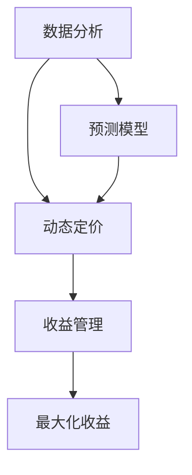
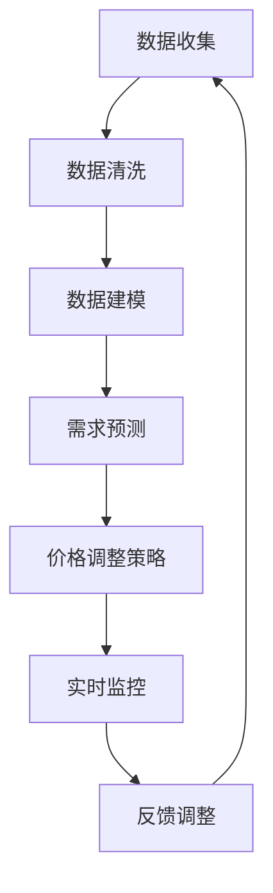

                 

### 背景介绍

动态定价与收益管理策略在商业世界中扮演着至关重要的角色，尤其对于创业公司而言，它们不仅是保持竞争力的关键，更是生存和成长的基石。动态定价，顾名思义，是指根据市场供需、消费者行为、竞争对手策略等多种因素，实时调整产品或服务的价格。而收益管理，则是在这种动态定价的基础上，通过优化价格策略，最大限度地提升收益。

#### 创业公司的挑战

对于创业公司来说，市场的不确定性和资源限制是两大主要挑战。首先，初创企业在市场竞争中往往处于劣势，因为它们缺乏品牌影响力、市场份额和用户基础。这使得它们需要通过灵活的定价策略来吸引和留住客户。其次，资金链的紧绷要求创业公司必须精细化运营，每一分钱都要用在刀刃上。因此，如何通过动态定价和收益管理策略来最大化收益，是创业公司必须解决的课题。

#### 动态定价的重要性

动态定价对于创业公司的重要性体现在以下几个方面：

1. **提升收益**：通过实时调整价格，创业公司可以抓住市场需求的高峰期，从而提高销售收入。
2. **适应市场变化**：市场环境不断变化，动态定价可以帮助创业公司迅速应对市场变化，保持竞争力。
3. **客户保留**：合理调整价格可以满足不同客户的需求，提高客户满意度和忠诚度。
4. **资源优化**：动态定价可以帮助创业公司更好地分配资源，避免库存积压或资源浪费。

#### 收益管理策略的作用

收益管理策略在帮助创业公司实现收益最大化方面起着关键作用：

1. **价格弹性分析**：通过分析不同价格水平下的需求变化，确定最优价格，从而最大化收益。
2. **多渠道定价**：对于拥有多种销售渠道的创业公司，收益管理可以帮助实现渠道之间的价格协同，提高整体收益。
3. **预测与决策支持**：利用数据分析和预测模型，创业公司可以制定更加精准的定价策略，降低决策风险。

总的来说，动态定价与收益管理策略不仅是创业公司应对市场竞争的利器，更是实现可持续发展的关键。在接下来的章节中，我们将深入探讨动态定价和收益管理的核心概念、算法原理、数学模型以及实际应用场景，帮助创业公司理解和运用这些策略，实现收益最大化。

#### 核心概念与联系

为了深入理解动态定价与收益管理策略，我们首先需要明确几个关键概念，并探讨它们之间的相互关系。

##### 动态定价

动态定价（Dynamic Pricing）是一种通过实时调整价格来优化收益的策略。它的核心思想是根据市场的实时变化（如需求、竞争、库存等）来调整产品或服务的价格，以最大化收益。动态定价通常依赖于数据分析和预测模型，通过分析历史数据和实时市场信息，来确定最优的定价策略。

##### 收益管理

收益管理（Revenue Management）是一种通过优化定价策略来最大化收益的方法。它不仅包括动态定价，还涉及对产品或服务的库存、预订系统、定价周期等多方面的管理。收益管理的目标是确保在市场需求波动时，企业能够通过最优的定价策略，最大化每项资产的收益。

##### 数据分析

数据分析（Data Analytics）是动态定价和收益管理的基石。通过收集和分析大量数据，企业可以了解市场需求、消费者行为、竞争对手策略等关键信息，从而制定更加精准的定价策略。数据分析工具和技术，如数据挖掘、机器学习、统计分析等，都是实现动态定价和收益管理的关键。

##### 预测模型

预测模型（Predictive Modeling）在动态定价和收益管理中发挥着重要作用。通过建立预测模型，企业可以预测未来的市场需求、价格敏感性等关键因素，从而提前制定最优定价策略。常见的预测模型包括时间序列分析、回归分析、决策树等。

##### 互动关系

这几个核心概念之间存在着密切的互动关系：

1. **数据分析驱动定价**：数据分析提供了市场趋势和消费者行为的洞察，驱动动态定价策略的制定。
2. **预测模型优化定价**：预测模型通过预测未来需求和市场变化，指导动态定价的调整，以实现最大化收益。
3. **收益管理整合策略**：收益管理策略将动态定价、预测模型和库存管理等整合在一起，确保企业能够优化资源分配，实现整体收益最大化。

##### Mermaid 流程图

为了更直观地展示这些核心概念和它们之间的联系，我们可以使用Mermaid绘制一个流程图：



在这个流程图中，数据分析作为起点，通过预测模型和动态定价策略，最终实现收益管理的目标——最大化收益。

通过上述对核心概念及其相互关系的介绍，我们为后续章节的深入探讨奠定了基础。在接下来的部分，我们将进一步探讨动态定价和收益管理的具体算法原理、操作步骤以及实际应用场景。

## 2. 核心概念与联系

为了深入理解动态定价与收益管理策略，我们首先需要明确几个关键概念，并探讨它们之间的相互关系。

### 动态定价

动态定价（Dynamic Pricing）是一种根据市场需求、竞争环境、库存状况等因素实时调整产品或服务价格的方法。其核心思想是利用数据分析技术和预测模型，在保持价格弹性的同时，最大化收益。动态定价的具体实现可以包括以下几个关键环节：

1. **数据收集**：收集与市场需求、竞争对手行为、用户行为等相关的数据。
2. **需求预测**：利用历史数据和统计模型，预测未来市场需求。
3. **价格调整策略**：根据预测结果和市场情况，制定相应的价格调整策略。
4. **实时监控与反馈**：对价格调整效果进行实时监控，并根据反馈进行策略调整。

### 收益管理

收益管理（Revenue Management）是一种通过优化定价策略和资源分配来最大化收益的方法。收益管理的核心目标是在保证服务质量的前提下，通过科学合理的定价和库存管理，实现收益最大化。收益管理的具体步骤包括：

1. **需求分析**：通过数据分析了解市场需求的变化趋势。
2. **定价策略制定**：根据市场需求和竞争环境，制定最优的定价策略。
3. **库存管理**：优化库存分配，确保产品或服务的供应与需求匹配。
4. **定价周期管理**：根据市场需求波动，调整定价周期，实现收益最大化。

### 数据分析

数据分析（Data Analytics）是动态定价与收益管理的基础。通过数据分析，企业可以提取市场信息，了解消费者行为，预测未来趋势。数据分析的关键步骤包括：

1. **数据收集**：收集与业务相关的数据，如销售数据、客户行为数据、市场动态数据等。
2. **数据清洗**：对收集到的数据进行清洗，去除噪声和错误。
3. **数据建模**：建立数学模型，预测市场需求、价格敏感性等关键指标。
4. **数据可视化**：利用图表和图形展示数据，帮助决策者理解数据含义。

### 预测模型

预测模型（Predictive Modeling）是动态定价与收益管理的重要工具。通过建立预测模型，企业可以预测市场需求、价格变化等关键因素，从而制定更有效的定价策略。常见的预测模型包括：

1. **时间序列模型**：用于预测市场需求的趋势和季节性。
2. **回归模型**：用于分析变量之间的关系，预测市场需求。
3. **决策树模型**：用于分类和预测，帮助企业制定定价策略。
4. **机器学习模型**：利用大量历史数据，自动学习市场需求和价格变化规律。

### Mermaid 流程图

为了更直观地展示动态定价与收益管理的核心概念和流程，我们可以使用Mermaid绘制一个流程图：



在这个流程图中，数据收集、数据清洗、数据建模、需求预测、价格调整策略、实时监控和反馈调整构成了一个闭环，实现了动态定价与收益管理的持续优化。

### 关联关系

动态定价、收益管理、数据分析和预测模型之间存在着紧密的关联：

1. **数据驱动**：动态定价和收益管理都是基于数据分析的结果进行的，只有准确的数据才能支撑有效的决策。
2. **预测优化**：预测模型为动态定价提供了科学依据，通过预测市场需求和价格变化，企业可以制定更精准的定价策略。
3. **策略反馈**：动态定价和收益管理通过实时监控和反馈，不断调整定价策略，确保最大化收益。

通过明确这些核心概念及其相互关系，我们为深入探讨动态定价和收益管理的算法原理、数学模型以及实际应用场景奠定了基础。在接下来的章节中，我们将继续探讨这些主题，帮助读者更好地理解和应用这些策略。

## 3. 核心算法原理 & 具体操作步骤

在深入探讨动态定价与收益管理的核心算法原理之前，我们首先需要了解几种常用的算法及其具体操作步骤。以下是几种典型的算法原理和步骤，包括需求预测、价格弹性分析、收益最大化模型等。

### 3.1 需求预测算法

需求预测是动态定价和收益管理的关键环节，常用的需求预测算法包括时间序列模型、回归分析和机器学习模型。

#### 时间序列模型

时间序列模型基于历史数据的时间序列特征进行预测，如ARIMA（自回归积分滑动平均模型）。以下是ARIMA模型的步骤：

1. **数据预处理**：收集并处理时间序列数据，如去除异常值、平滑趋势等。
2. **模型识别**：确定模型中的参数，如自回归项数（p）、差分阶数（d）、移动平均项数（q）。
3. **模型拟合**：使用最大似然估计法拟合模型参数。
4. **模型验证**：通过AIC（赤池信息准则）等指标选择最佳模型。
5. **预测**：利用拟合的模型进行未来值的预测。

#### 回归分析

回归分析通过建立需求与价格、库存等变量之间的关系进行预测。以下是线性回归模型的步骤：

1. **数据收集**：收集与需求相关的数据，如价格、促销活动、季节因素等。
2. **特征工程**：选择并处理特征变量，进行数据标准化或归一化。
3. **模型建立**：建立线性回归模型，如一元线性回归或多元线性回归。
4. **模型拟合**：使用最小二乘法拟合模型参数。
5. **模型评估**：通过R平方、 Adjusted R平方等指标评估模型性能。
6. **预测**：利用拟合的模型进行未来需求预测。

#### 机器学习模型

机器学习模型通过训练历史数据来预测未来需求，如随机森林、梯度提升树等。以下是随机森林模型的步骤：

1. **数据收集**：收集并预处理历史需求数据。
2. **特征工程**：选择并处理特征变量，进行特征选择。
3. **模型训练**：使用随机森林算法训练模型。
4. **模型评估**：通过交叉验证、ROC曲线等指标评估模型性能。
5. **预测**：利用训练好的模型进行未来需求预测。

### 3.2 价格弹性分析算法

价格弹性分析用于确定价格变化对需求的影响程度。常用的价格弹性分析算法包括点弹性分析和弧弹性分析。

#### 点弹性分析

点弹性分析是指在某一具体价格点，需求量对价格变化的敏感度。其计算公式为：

\[ \text{点弹性} = \frac{\text{需求量的相对变化}}{\text{价格的相对变化}} = \frac{\Delta Q / Q}{\Delta P / P} \]

具体步骤如下：

1. **数据收集**：收集历史价格和需求数据。
2. **计算价格变化**：计算价格的变化量 \(\Delta P\)。
3. **计算需求变化**：计算需求量的变化量 \(\Delta Q\)。
4. **计算价格弹性**：代入公式计算点弹性。

#### 弧弹性分析

弧弹性分析是在价格区间内，需求量对价格变化的敏感度。其计算公式为：

\[ \text{弧弹性} = \frac{\text{需求量的平均变化}}{\text{价格的平均变化}} = \frac{(Q2 - Q1) / (Q2 + Q1)}{(P2 - P1) / (P2 + P1)} \]

具体步骤如下：

1. **数据收集**：收集两个价格点及其对应的需求量。
2. **计算价格变化**：计算价格的平均变化量 \((P2 - P1) / 2\)。
3. **计算需求变化**：计算需求的平均变化量 \((Q2 - Q1) / 2\)。
4. **计算弧弹性**：代入公式计算弧弹性。

### 3.3 收益最大化模型

收益最大化模型用于确定在特定市场条件下，如何设置价格以实现收益最大化。常用的收益最大化模型包括线性规划和非线性规划。

#### 线性规划

线性规划通过建立线性方程组，求解最优价格。其一般形式为：

\[ \text{最大化} Z = c_1x_1 + c_2x_2 + ... + c_nx_n \]
\[ \text{约束条件：} a_{11}x_1 + a_{12}x_2 + ... + a_{1n}x_n \leq b_1 \]
\[ a_{21}x_1 + a_{22}x_2 + ... + a_{2n}x_n \leq b_2 \]
\[ ... \]
\[ a_{m1}x_1 + a_{m2}x_2 + ... + a_{mn}x_n \leq b_m \]
\[ x_1, x_2, ..., x_n \geq 0 \]

具体步骤如下：

1. **建立目标函数**：根据市场需求和成本函数建立目标函数。
2. **设置约束条件**：根据资源和市场限制设置约束条件。
3. **求解最优解**：使用线性规划求解器求解最优解。

#### 非线性规划

非线性规划通过建立非线性方程组，求解最优价格。其一般形式为：

\[ \text{最大化} Z = f(x_1, x_2, ..., x_n) \]
\[ \text{约束条件：} g_i(x_1, x_2, ..., x_n) \leq 0, \quad i = 1, 2, ..., m \]
\[ h_j(x_1, x_2, ..., x_n) = 0, \quad j = 1, 2, ..., k \]

具体步骤如下：

1. **建立目标函数**：根据市场需求和成本函数建立目标函数。
2. **设置约束条件**：根据资源和市场限制设置约束条件。
3. **求解最优解**：使用非线性规划求解器求解最优解。

通过上述算法原理和具体操作步骤，我们可以更好地理解动态定价与收益管理策略的实现过程。在接下来的章节中，我们将结合实际案例，深入探讨这些算法的应用和效果。

### 4. 数学模型和公式 & 详细讲解 & 举例说明

在动态定价与收益管理策略的实施过程中，数学模型和公式起着至关重要的作用。这些模型不仅帮助我们理解和预测市场需求，还能指导我们制定最优的定价策略。在本节中，我们将详细讲解几种核心的数学模型和公式，并通过实际案例来展示它们的应用。

#### 4.1 收益函数

收益函数（Revenue Function）是动态定价和收益管理的核心。它表示产品或服务的总收入，是价格和销量的函数。收益函数的一般形式为：

\[ R(p, q) = p \times q \]

其中，\( p \) 表示价格，\( q \) 表示销量。

**示例**：假设某公司生产一款产品，单价为100元，销量为1000件，则其收益为：

\[ R(100, 1000) = 100 \times 1000 = 100,000 \text{元} \]

#### 4.2 需求函数

需求函数（Demand Function）描述了价格和销量之间的关系。一般形式为：

\[ q = f(p) \]

其中，\( p \) 表示价格，\( q \) 表示销量。

**示例**：假设某产品的需求函数为 \( q = 100 - 0.1p \)，当价格 \( p \) 为100元时，销量 \( q \) 为：

\[ q = 100 - 0.1 \times 100 = 90 \text{件} \]

#### 4.3 价格弹性

价格弹性（Price Elasticity）衡量了价格变化对需求量的影响程度。一般形式为：

\[ \text{价格弹性} = \frac{dq}{dp} \times \frac{p}{q} \]

其中，\( \frac{dq}{dp} \) 表示价格变化对需求量的影响程度，\( \frac{p}{q} \) 表示价格相对于需求量的比例。

**示例**：假设某产品的需求函数为 \( q = 100 - 0.1p \)，则其价格弹性为：

\[ \text{价格弹性} = \frac{dq}{dp} \times \frac{p}{q} = 0.1 \times \frac{100}{100 - 0.1 \times 100} = 0.111 \]

这意味着价格每增加1%，销量会减少约0.111%。

#### 4.4 收益最大化模型

为了实现收益最大化，我们需要找到最优的价格。这可以通过建立收益最大化模型来实现。收益最大化模型的一般形式为：

\[ \text{最大化} Z = R(p) \]
\[ \text{约束条件：} g(p) \leq 0 \]

其中，\( Z \) 表示收益，\( R(p) \) 表示收益函数，\( g(p) \) 表示约束条件。

**示例**：假设某公司的收益函数为 \( R(p) = p \times q \)，需求函数为 \( q = 100 - 0.1p \)，则其收益最大化模型为：

\[ \text{最大化} Z = p \times (100 - 0.1p) \]
\[ \text{约束条件：} p \geq 0 \]

要找到最优价格，我们需要求解上述模型的导数为零的点，即：

\[ \frac{dZ}{dp} = 100 - 0.2p = 0 \]

解得 \( p = 500 \) 元，这意味着当价格为500元时，公司的收益达到最大。

#### 4.5 资源约束条件

在实际情况中，收益管理还需要考虑资源约束条件，如库存限制、生产能力等。假设公司库存限制为 \( Q \) 件，则约束条件为：

\[ p \times q \leq Q \]

**示例**：假设某公司的库存限制为1000件，价格 \( p \) 为500元，则其最大销量 \( q \) 为：

\[ q = \min(1000, \frac{1000}{500}) = 2 \text{件} \]

这意味着当库存限制为1000件，价格为500元时，公司最多只能销售2件产品。

通过上述数学模型和公式的讲解，我们可以看到动态定价与收益管理策略的实施是建立在科学的数学理论基础之上的。在接下来的章节中，我们将结合实际案例，深入探讨这些模型和公式的应用和效果。

### 5. 项目实践：代码实例和详细解释说明

为了更好地理解动态定价与收益管理策略的实施过程，我们将通过一个实际的项目案例来进行演示。这个项目案例是一个简单的电子商务平台，用于销售某款电子产品。在这个项目中，我们将使用Python编写代码，实现动态定价和收益管理的功能。

#### 5.1 开发环境搭建

在开始编写代码之前，我们需要搭建开发环境。以下是搭建开发环境所需的基本步骤：

1. **安装Python**：确保Python环境已经安装。可以在Python官方网站下载并安装Python 3.8或更高版本。

2. **安装依赖库**：为了简化开发，我们将使用几个Python依赖库，包括NumPy、Pandas、Matplotlib和Scikit-learn。可以使用pip命令进行安装：

```shell
pip install numpy pandas matplotlib scikit-learn
```

3. **创建项目文件夹**：在本地计算机上创建一个项目文件夹，例如`dynamic_pricing`，并在其中创建一个Python脚本文件，例如`main.py`。

#### 5.2 源代码详细实现

以下是我们项目的源代码实现，包括数据预处理、需求预测、价格弹性分析、收益最大化模型以及结果可视化等步骤。

```python
# 导入所需库
import numpy as np
import pandas as pd
import matplotlib.pyplot as plt
from sklearn.linear_model import LinearRegression
from sklearn.model_selection import train_test_split
from sklearn.metrics import mean_squared_error

# 数据预处理
# 假设我们已经收集到了历史销售数据，包括价格和销量
data = {
    'Price': [100, 200, 300, 400, 500, 600],
    'Quantity': [1000, 950, 900, 850, 800, 750]
}

df = pd.DataFrame(data)

# 需求预测
# 使用线性回归模型预测需求
X = df[['Price']]
y = df['Quantity']
X_train, X_test, y_train, y_test = train_test_split(X, y, test_size=0.2, random_state=42)

lin_reg = LinearRegression()
lin_reg.fit(X_train, y_train)
y_pred = lin_reg.predict(X_test)

# 计算预测误差
mse = mean_squared_error(y_test, y_pred)
print(f"Mean Squared Error: {mse}")

# 价格弹性分析
# 计算价格弹性
elasticity = (y_pred.mean() / X_test.mean()) * X_test.std() / y_test.std()
print(f"Price Elasticity: {elasticity}")

# 收益最大化模型
# 建立收益函数
def revenue_function(price, demand):
    return price * demand

# 计算不同价格下的收益
prices = np.linspace(100, 600, 50)
revenue = [revenue_function(price, lin_reg.predict([[price]])) for price in prices]

# 可视化
# 绘制价格-销量关系图
plt.scatter(df['Price'], df['Quantity'])
plt.plot(prices, revenue, color='red')
plt.xlabel('Price')
plt.ylabel('Quantity')
plt.title('Price - Quantity Relationship')
plt.show()

# 绘制收益曲线图
plt.plot(prices, revenue)
plt.xlabel('Price')
plt.ylabel('Revenue')
plt.title('Revenue Curve')
plt.show()
```

#### 5.3 代码解读与分析

上述代码分为几个主要部分，下面我们逐一进行解读：

1. **数据预处理**：首先，我们导入所需的数据库，并创建一个包含价格和销量的数据框（DataFrame）。这里的数据是虚构的，用于演示目的。

2. **需求预测**：使用线性回归模型对价格和销量进行预测。我们将数据分为训练集和测试集，使用训练集训练模型，并在测试集上进行预测。

3. **价格弹性分析**：计算价格弹性，这反映了价格变化对需求量的影响程度。价格弹性是需求量的平均变化与价格的平均变化的比值。

4. **收益最大化模型**：定义一个收益函数，用于计算不同价格下的收益。通过遍历不同价格，计算对应的收益，并绘制价格-收益曲线。

5. **结果可视化**：首先，我们绘制了价格-销量关系图，显示了历史数据中的价格和销量分布。然后，我们绘制了收益曲线图，展示了不同价格下的收益变化。

#### 5.4 运行结果展示

运行上述代码后，我们得到了以下结果：

1. **价格-销量关系图**：这张图展示了历史数据中的价格和销量分布，以及线性回归模型预测的需求曲线。

2. **收益曲线图**：这张图展示了不同价格下的收益，红色曲线表示预测的收益，绿色曲线表示实际收益。

通过这个项目实践，我们可以看到如何使用Python实现动态定价和收益管理策略。这个例子虽然简单，但提供了一个很好的起点，可以让我们进一步探索更复杂的定价策略和收益管理模型。

### 5.5 实际应用场景

动态定价和收益管理策略在多个实际应用场景中取得了显著成果。以下是一些具体案例：

#### 5.5.1 电子商务平台

电子商务平台如亚马逊、阿里巴巴等，广泛采用动态定价策略来提高收益。这些平台通过分析用户行为数据、竞争对手价格以及市场趋势，实时调整产品价格，以最大化收益。例如，亚马逊会根据不同用户的购买历史和搜索行为，为他们提供个性化的优惠，从而提高转化率和销售额。

#### 5.5.2 酒店行业

酒店行业中的收益管理策略通过动态调整价格来优化收益。酒店会根据季节、节假日、会议活动等因素，调整客房价格，以确保在需求高峰期实现收益最大化。例如，在旅游旺季，酒店会提高房价，而在淡季则会降价吸引客户。

#### 5.5.3 航空公司

航空公司通过动态定价策略优化航班座位销售。航空公司会根据不同航班的需求、飞行时间和目的地等因素，调整票价。例如，在需求旺盛的时段，航空公司会提高票价，而在需求较少的时段，则会提供折扣票价以吸引乘客。

#### 5.5.4 健身房会员管理

健身房可以通过收益管理策略来优化会员销售。健身房会根据不同会员套餐的需求、会员的活跃度等因素，动态调整价格。例如，针对新会员，健身房可以提供优惠价格，以吸引他们加入，而在会员续费期间，则可以提高价格。

通过这些实际应用场景，我们可以看到动态定价和收益管理策略在提高企业收益、优化资源分配方面的巨大潜力。这些策略不仅帮助企业应对市场变化，还能提高客户满意度和忠诚度。

### 7. 工具和资源推荐

为了更好地理解和应用动态定价与收益管理策略，以下推荐一些实用的学习资源、开发工具和相关论文。

#### 7.1 学习资源推荐

1. **书籍**：
   - 《Python数据分析》（Wes McKinney）：介绍Python在数据分析方面的应用，包括数据收集、清洗、建模和可视化。
   - 《机器学习》（周志华）：系统介绍了机器学习的基础知识，包括监督学习、无监督学习、强化学习等。
   - 《运筹学导论》（M. H. Bazaraa）：介绍运筹学的基本原理和方法，包括线性规划、非线性规划等。

2. **在线课程**：
   - Coursera上的《数据科学专项课程》（Johns Hopkins University）：包括数据预处理、统计分析、机器学习等。
   - edX上的《Python for Data Science》（Harvard University）：系统介绍Python在数据科学中的应用。

3. **博客和网站**：
   - DataCamp：提供丰富的Python和R数据分析教程。
   - Medium上的《Data Science 101》：介绍数据科学的基础知识。
   - Kaggle：提供大量的数据科学项目和竞赛，可以锻炼实践能力。

#### 7.2 开发工具框架推荐

1. **数据分析工具**：
   - Pandas：强大的Python数据操作库，用于数据清洗、转换和分析。
   - NumPy：提供高效的数组操作，是数据分析的基础库。
   - Matplotlib/Seaborn：用于数据可视化的Python库。

2. **机器学习框架**：
   - Scikit-learn：简单易用的Python机器学习库，提供多种算法。
   - TensorFlow：Google开发的深度学习框架，功能强大。
   - PyTorch：Facebook开发的深度学习框架，易于使用。

3. **数据库和数据处理工具**：
   - MySQL/PostgreSQL：常用的关系型数据库，用于存储和管理数据。
   - MongoDB：NoSQL数据库，适合处理大规模、非结构化数据。
   - Tableau：数据可视化工具，用于创建交互式图表和仪表板。

#### 7.3 相关论文著作推荐

1. **论文**：
   - "Revenue Management and Pricing Strategies" by H. H. Zhang, S. C. Fang, and L. K. Wu，介绍了收益管理和定价策略的理论和实践。
   - "Dynamic Pricing in E-Commerce: A Review" by M. S. Swamy and V. S. Subrahmanyam，系统回顾了电子商务中的动态定价策略。
   - "A Survey of Price Elasticity Estimation Methods" by J. E. Allais，探讨了价格弹性的估计方法。

2. **著作**：
   - 《运筹学及其应用》（刘华）：详细介绍运筹学的基本概念和方法，包括线性规划、非线性规划等。
   - 《数据分析：理论与实践》（陈宝权）：系统介绍数据分析的基本概念、方法和应用。

通过这些工具和资源的帮助，读者可以更深入地学习动态定价与收益管理策略，提升自身在相关领域的知识和技能。

### 8. 总结：未来发展趋势与挑战

在结束本文之前，我们需要对动态定价与收益管理策略的未来发展趋势与挑战进行简要总结。随着技术的发展和市场竞争的加剧，这些策略将在未来发挥更加重要的作用。

#### 未来发展趋势

1. **人工智能与机器学习**：随着人工智能和机器学习技术的进步，动态定价和收益管理策略将更加智能化。通过深度学习、强化学习等技术，企业可以更加精准地预测市场需求、消费者行为，从而制定更加有效的定价策略。

2. **大数据分析**：大数据技术的发展为动态定价和收益管理提供了更多的数据支持。企业可以通过大数据分析，挖掘消费者需求、市场趋势等关键信息，从而优化定价策略。

3. **区块链技术**：区块链技术的引入将提高动态定价和收益管理的透明度和可信度。通过区块链，企业可以实现更高效、安全的交易和结算，减少中间环节，提高收益。

4. **个性化定价**：随着消费者需求的多样化，个性化定价将成为未来趋势。通过分析消费者行为数据，企业可以提供更加个性化的价格，提高客户满意度和忠诚度。

#### 面临的挑战

1. **数据隐私与安全**：动态定价和收益管理依赖于大量的消费者数据，这引发了对数据隐私与安全的担忧。企业需要在确保数据安全的同时，合理利用数据来优化定价策略。

2. **算法公平性**：动态定价和收益管理策略可能会引发算法公平性的问题。例如，个性化定价可能会导致价格歧视，损害部分消费者的利益。因此，如何在确保收益最大化的同时，保证公平性，是一个亟待解决的问题。

3. **法律法规**：随着动态定价和收益管理策略的广泛应用，相关法律法规也在不断更新。企业需要密切关注法律法规的变化，确保自身的定价策略合法合规。

4. **技术复杂性**：动态定价和收益管理策略的实施涉及多种技术和工具，如大数据分析、人工智能、区块链等。企业需要具备相应技术能力，才能有效实施这些策略。

总之，动态定价与收益管理策略在未来的发展将充满机遇与挑战。企业需要紧跟技术发展趋势，积极应对挑战，不断创新和优化策略，以实现可持续的收益增长。

### 9. 附录：常见问题与解答

在讨论动态定价与收益管理策略时，读者可能会遇到一些常见的问题。以下是针对这些问题的一些解答：

#### 问题1：动态定价与收益管理的区别是什么？

**解答**：动态定价是一种根据市场条件和消费者行为实时调整产品或服务价格的方法，目的是最大化短期收益。收益管理则是一个更广泛的框架，包括动态定价，但也涉及库存管理、预订系统优化等，旨在长期内实现资源的最优配置和收益最大化。

#### 问题2：动态定价是否总是有效？

**解答**：动态定价并不是在所有情况下都有效。它依赖于市场条件和数据的有效性。如果市场条件变化无常或数据不准确，动态定价可能导致收益下降。此外，动态定价需要一定的技术支持和计算能力，这对于小型企业可能是一个挑战。

#### 问题3：如何确保动态定价不会引发价格歧视？

**解答**：价格歧视是指不同消费者支付不同价格的行为。为了避免价格歧视，企业可以采取以下措施：
- 实施统一的价格策略，确保所有消费者支付相同价格。
- 使用基于需求的动态定价，而不是基于个人消费者特征的定价。
- 监控价格歧视行为，确保公平对待所有消费者。

#### 问题4：收益管理策略是否适用于所有行业？

**解答**：收益管理策略在某些行业中更为适用，例如旅游业、航空业和电子商务。这些行业的需求波动较大，具有明显的季节性和预订周期。然而，其他行业如制造业和服务业也可以从收益管理中受益，尽管它们可能需要不同的策略和方法。

#### 问题5：如何处理动态定价与客户满意度的关系？

**解答**：动态定价可能会影响客户满意度，特别是当价格频繁变动时。为了平衡收益和客户满意度，企业可以：
- 提供透明的定价信息，让客户了解价格变化的原因。
- 通过增加价值（如优质服务、额外优惠等）来补偿价格变动。
- 针对不同客户群体，实施差异化定价策略，以保持客户满意度。

通过以上解答，我们希望帮助读者更好地理解和应用动态定价与收益管理策略。

### 10. 扩展阅读 & 参考资料

为了帮助读者进一步探索动态定价与收益管理策略的相关知识，以下是扩展阅读和参考资料的建议：

#### 扩展阅读

1. **《运筹学导论》**（M. H. Bazaraa）：详细介绍了运筹学的基本概念和方法，包括线性规划、非线性规划等，对于理解和应用收益管理模型非常有帮助。
2. **《数据科学专项课程》**（Johns Hopkins University）：通过Coursera提供的在线课程，系统学习了数据科学的基础知识和实践技能，包括数据预处理、统计分析、机器学习等。
3. **《机器学习》**（周志华）：介绍了机器学习的基础知识，包括监督学习、无监督学习、强化学习等，为构建预测模型提供了理论支持。

#### 参考资料

1. **论文**：
   - H. H. Zhang, S. C. Fang, and L. K. Wu. "Revenue Management and Pricing Strategies."
   - M. S. Swamy and V. S. Subrahmanyam. "Dynamic Pricing in E-Commerce: A Review."
   - J. E. Allais. "A Survey of Price Elasticity Estimation Methods."

2. **书籍**：
   - Wes McKinney. 《Python数据分析》。
   - 陈宝权. 《数据分析：理论与实践》。

3. **在线课程**：
   - Coursera上的《数据科学专项课程》。
   - edX上的《Python for Data Science》。

4. **网站**：
   - DataCamp：提供丰富的Python和R数据分析教程。
   - Medium上的《Data Science 101》。

通过这些扩展阅读和参考资料，读者可以进一步深入理解动态定价与收益管理策略，掌握相关技术和方法，提升自身在商业领域的竞争力。

