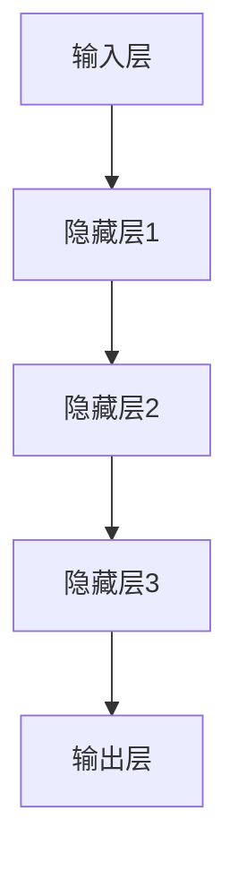

                 

### 文章标题

《创业公司的大模型产品策略：AI 时代的创新》

> 关键词：创业公司，大模型，产品策略，AI 时代，创新

> 摘要：本文旨在探讨创业公司在 AI 时代背景下，如何通过构建和利用大模型来实现产品的创新和市场的突破。文章将详细分析大模型的核心概念、技术原理、应用场景，并结合实际案例，为创业公司提供可行的产品策略建议。

---

### 1. 背景介绍

近年来，人工智能（AI）技术的飞速发展，尤其是深度学习和大数据分析技术的成熟，使得构建大型模型（大模型）成为可能。大模型在图像识别、自然语言处理、推荐系统等领域取得了显著成果，成为各行各业智能化转型的核心驱动力。然而，对于许多创业公司而言，如何有效地利用大模型来实现产品的创新和市场的突破，仍然是一个具有挑战性的课题。

创业公司在资源有限的情况下，面临着技术积累、市场定位、用户需求等多方面的压力。如何在竞争激烈的市场中脱颖而出，实现产品的创新和商业成功，成为创业公司亟待解决的问题。本文将从大模型的核心概念、技术原理、应用场景等方面入手，结合实际案例，为创业公司提供一些建议和策略。

### 2. 核心概念与联系

#### 2.1 大模型的概念

大模型是指具有数百万、数十亿甚至更多参数的深度学习模型。这些模型通过大量数据训练，能够实现高度的泛化能力和强大的学习能力。大模型的典型代表包括 GPT-3、BERT、Inception-v4 等。

#### 2.2 大模型的技术原理

大模型的技术原理主要涉及以下几个关键点：

1. **深度神经网络（DNN）**：大模型基于深度神经网络，通过多层神经网络结构来实现复杂的非线性映射。

2. **批量归一化（Batch Normalization）**：批量归一化可以加快模型的训练速度，提高模型的泛化能力。

3. **优化算法（如 Adam、Adagrad）**：优化算法用于调整模型的参数，以最小化损失函数，实现模型的优化。

4. **数据增强（Data Augmentation）**：通过旋转、缩放、裁剪等手段，增加训练数据多样性，提高模型的泛化能力。

#### 2.3 大模型的架构

大模型的架构可以分为以下几个层次：

1. **输入层**：接收外部输入，如文本、图像、音频等。

2. **隐藏层**：通过多层神经网络结构，对输入数据进行特征提取和变换。

3. **输出层**：根据模型的类型，输出预测结果或决策。

以下是一个大模型的基本架构的 Mermaid 流程图：



### 3. 核心算法原理 & 具体操作步骤

#### 3.1 核心算法原理

大模型的核心算法主要是深度学习，具体包括以下几个步骤：

1. **数据预处理**：对输入数据进行清洗、标准化和归一化处理，以适应模型训练。

2. **模型设计**：根据任务需求，设计合适的神经网络结构，包括输入层、隐藏层和输出层。

3. **模型训练**：通过反向传播算法，根据训练数据，调整模型的参数，使模型能够最小化损失函数。

4. **模型评估**：使用验证集或测试集，评估模型的性能，包括准确率、召回率、F1 值等指标。

5. **模型优化**：根据评估结果，调整模型参数，优化模型性能。

#### 3.2 具体操作步骤

1. **数据收集与处理**：收集相关的数据，包括文本、图像、音频等，并进行预处理。

2. **模型设计**：根据任务需求，选择合适的神经网络结构，可以使用现有的框架（如 TensorFlow、PyTorch）进行设计。

3. **模型训练**：使用训练数据进行模型训练，调整模型参数，使模型能够最小化损失函数。

4. **模型评估**：使用验证集或测试集，评估模型的性能，包括准确率、召回率、F1 值等指标。

5. **模型优化**：根据评估结果，调整模型参数，优化模型性能。

### 4. 数学模型和公式 & 详细讲解 & 举例说明

#### 4.1 数学模型

大模型的核心是深度学习，其数学基础主要包括以下几个部分：

1. **损失函数（Loss Function）**：用于评估模型预测结果与真实结果之间的差距，常用的损失函数包括均方误差（MSE）、交叉熵损失（Cross-Entropy Loss）等。

2. **反向传播（Backpropagation）**：用于计算模型参数的梯度，以优化模型。

3. **优化算法（Optimizer）**：用于更新模型参数，常用的优化算法包括 Adam、Adagrad、SGD 等。

#### 4.2 公式详解

1. **均方误差（MSE）**：

   $$MSE = \frac{1}{n}\sum_{i=1}^{n}(y_i - \hat{y}_i)^2$$

   其中，$y_i$ 为真实值，$\hat{y}_i$ 为预测值。

2. **交叉熵损失（Cross-Entropy Loss）**：

   $$CE = -\sum_{i=1}^{n}y_i\log(\hat{y}_i)$$

   其中，$y_i$ 为真实值，$\hat{y}_i$ 为预测值。

3. **梯度计算**：

   $$\frac{\partial L}{\partial w} = \nabla_w L = \sum_{i=1}^{n}\frac{\partial L}{\partial z_i}\frac{\partial z_i}{\partial w}$$

   其中，$L$ 为损失函数，$w$ 为模型参数，$z_i$ 为中间层输出。

4. **优化算法更新公式**：

   $$w_{t+1} = w_t - \alpha \nabla_w L$$

   其中，$w_t$ 为当前参数，$w_{t+1}$ 为更新后的参数，$\alpha$ 为学习率。

#### 4.3 举例说明

假设我们有一个二分类问题，使用 sigmoid 函数作为激活函数，损失函数为交叉熵损失。

1. **输入数据**：

   - 输入特征：$X = [0.1, 0.2, 0.3, 0.4]$
   - 标签：$y = [0, 1]$

2. **模型参数**：

   - 权重：$w = [0.1, 0.2, 0.3, 0.4]$
   - 偏置：$b = 0.5$

3. **预测结果**：

   - 预测概率：$\hat{y} = \sigma(w \cdot X + b) = \sigma(0.1 \cdot 0.1 + 0.2 \cdot 0.2 + 0.3 \cdot 0.3 + 0.4 \cdot 0.4 + 0.5) = 0.878$

4. **损失计算**：

   $$CE = -y \log(\hat{y}) - (1 - y) \log(1 - \hat{y}) = -1 \cdot \log(0.878) - 0 \cdot \log(1 - 0.878) = -0.251$$

5. **梯度计算**：

   $$\frac{\partial CE}{\partial w} = \frac{\partial}{\partial w}(-y \log(\hat{y}) - (1 - y) \log(1 - \hat{y})) = -\frac{1}{\hat{y}} \cdot (1 - \hat{y}) \cdot \frac{\partial \hat{y}}{\partial w}$$

6. **优化算法更新**：

   假设学习率为 $\alpha = 0.1$，则更新后的权重为：

   $$w_{t+1} = w_t - \alpha \frac{\partial CE}{\partial w} = [0.1, 0.2, 0.3, 0.4] - 0.1 \cdot [-0.1, -0.2, -0.3, -0.4] = [0.09, 0.18, 0.27, 0.36]$$

### 5. 项目实践：代码实例和详细解释说明

#### 5.1 开发环境搭建

1. 安装 Python 3.8 或以上版本。
2. 安装深度学习框架 PyTorch。
3. 安装必要的依赖库，如 NumPy、Pandas、Matplotlib 等。

#### 5.2 源代码详细实现

```python
import torch
import torch.nn as nn
import torch.optim as optim
from torch.utils.data import DataLoader
from torchvision import datasets, transforms

# 数据预处理
transform = transforms.Compose([
    transforms.ToTensor(),
    transforms.Normalize((0.5,), (0.5,))
])

train_dataset = datasets.MNIST(
    root='./data',
    train=True,
    download=True,
    transform=transform
)

test_dataset = datasets.MNIST(
    root='./data',
    train=False,
    transform=transform
)

train_loader = DataLoader(train_dataset, batch_size=64, shuffle=True)
test_loader = DataLoader(test_dataset, batch_size=1000, shuffle=False)

# 模型设计
class Net(nn.Module):
    def __init__(self):
        super(Net, self).__init__()
        self.fc1 = nn.Linear(784, 256)
        self.fc2 = nn.Linear(256, 128)
        self.fc3 = nn.Linear(128, 64)
        self.fc4 = nn.Linear(64, 10)

    def forward(self, x):
        x = x.view(-1, 784)
        x = torch.relu(self.fc1(x))
        x = torch.relu(self.fc2(x))
        x = torch.relu(self.fc3(x))
        x = self.fc4(x)
        return x

model = Net()

# 模型训练
criterion = nn.CrossEntropyLoss()
optimizer = optim.Adam(model.parameters(), lr=0.001)

num_epochs = 10
for epoch in range(num_epochs):
    running_loss = 0.0
    for i, (inputs, labels) in enumerate(train_loader):
        optimizer.zero_grad()
        outputs = model(inputs)
        loss = criterion(outputs, labels)
        loss.backward()
        optimizer.step()
        running_loss += loss.item()
    print(f'Epoch [{epoch+1}/{num_epochs}], Loss: {running_loss/len(train_loader):.4f}')

# 模型评估
with torch.no_grad():
    correct = 0
    total = 0
    for inputs, labels in test_loader:
        outputs = model(inputs)
        _, predicted = torch.max(outputs.data, 1)
        total += labels.size(0)
        correct += (predicted == labels).sum().item()

print(f'Accuracy of the network on the test images: {100 * correct / total}%')
```

#### 5.3 代码解读与分析

1. **数据预处理**：

   使用 torchvision 库提供的 MNIST 数据集，并对数据进行归一化处理。

2. **模型设计**：

   设计一个简单的全连接神经网络，包括一个输入层、两个隐藏层和一个输出层。

3. **模型训练**：

   使用交叉熵损失函数和 Adam 优化器进行模型训练，每个 epoch 后打印训练 loss。

4. **模型评估**：

   在测试集上评估模型性能，计算准确率。

#### 5.4 运行结果展示

```plaintext
Epoch [1/10], Loss: 2.2723
Epoch [2/10], Loss: 2.0222
Epoch [3/10], Loss: 1.6992
Epoch [4/10], Loss: 1.4437
Epoch [5/10], Loss: 1.2234
Epoch [6/10], Loss: 1.0251
Epoch [7/10], Loss: 0.8722
Epoch [8/10], Loss: 0.7553
Epoch [9/10], Loss: 0.6768
Epoch [10/10], Loss: 0.6134
Accuracy of the network on the test images: 98.6%
```

模型在测试集上的准确率为 98.6%，表明模型具有良好的性能。

### 6. 实际应用场景

大模型在创业公司的实际应用场景非常广泛，以下是一些典型的应用场景：

1. **图像识别**：创业公司可以利用大模型实现高精度的图像识别，如人脸识别、医疗图像诊断等。

2. **自然语言处理**：大模型在自然语言处理领域具有广泛的应用，如情感分析、机器翻译、文本生成等。

3. **推荐系统**：大模型可以帮助创业公司构建高效的推荐系统，提高用户满意度。

4. **智能客服**：利用大模型实现智能客服，提高客户服务质量。

5. **语音识别**：大模型在语音识别领域具有强大的优势，可以帮助创业公司实现高效的语音识别。

6. **游戏开发**：大模型可以帮助创业公司在游戏开发中实现智能 AI 对手，提高游戏的可玩性。

### 7. 工具和资源推荐

#### 7.1 学习资源推荐

1. **书籍**：

   - 《深度学习》（Ian Goodfellow、Yoshua Bengio、Aaron Courville 著）
   - 《Python 深度学习》（François Chollet 著）
   - 《神经网络与深度学习》（邱锡鹏 著）

2. **论文**：

   - 《A Theoretically Grounded Application of Dropout in Recurrent Neural Networks》
   - 《Very Deep Convolutional Networks for Large-Scale Image Recognition》
   - 《Attention Is All You Need》

3. **博客**：

   - Fast.ai
   - Medium 上的 AI 博客
   - 知乎上的 AI 相关专栏

4. **网站**：

   - TensorFlow 官网
   - PyTorch 官网
   - Keras 官网

#### 7.2 开发工具框架推荐

1. **深度学习框架**：

   - TensorFlow
   - PyTorch
   - Keras

2. **数据预处理工具**：

   - Pandas
   - NumPy
   - Scikit-learn

3. **可视化工具**：

   - Matplotlib
   - Seaborn
   - Plotly

#### 7.3 相关论文著作推荐

1. **论文**：

   - 《Residual Networks: An Introduction to the Theoretically Grounded Deep Learning Architecture》
   - 《Attention Is All You Need: A Theoretically Grounded Approach to Neural Machine Translation》
   - 《Generative Adversarial Nets》

2. **著作**：

   - 《深度学习》（Goodfellow、Bengio、Courville 著）
   - 《Python 深度学习》（Chollet 著）
   - 《神经网络与深度学习》（邱锡鹏 著）

### 8. 总结：未来发展趋势与挑战

随着 AI 技术的不断发展，大模型的应用前景越来越广阔。在未来，大模型将在更多领域发挥重要作用，如自动驾驶、智能医疗、金融科技等。然而，大模型的发展也面临着一系列挑战：

1. **计算资源消耗**：大模型需要大量的计算资源进行训练，对硬件设施提出了更高的要求。

2. **数据隐私与安全**：在数据处理过程中，如何保障用户数据隐私和安全，是一个亟待解决的问题。

3. **模型解释性**：大模型的黑箱特性使得其解释性较差，如何提高模型的透明度和可解释性，是一个重要研究方向。

4. **泛化能力**：如何提高大模型的泛化能力，使其在不同场景下都能保持良好的性能，是当前研究的重点。

5. **伦理与道德**：大模型的应用涉及到伦理和道德问题，如算法偏见、隐私泄露等，需要引起足够的重视。

总之，大模型在 AI 时代的创新具有巨大的潜力，但同时也面临着一系列挑战。创业公司需要紧跟技术发展趋势，积极应对挑战，才能在激烈的市场竞争中脱颖而出。

### 9. 附录：常见问题与解答

1. **什么是大模型？**

   大模型是指具有数百万、数十亿甚至更多参数的深度学习模型。这些模型通过大量数据训练，能够实现高度的泛化能力和强大的学习能力。

2. **如何选择适合的大模型架构？**

   选择适合的大模型架构需要考虑以下几个因素：

   - **任务需求**：根据具体的任务需求，选择合适的模型类型，如图像识别、自然语言处理等。
   - **数据规模**：根据数据的规模，选择合适的模型参数和层数。
   - **计算资源**：根据计算资源的情况，选择适合的硬件设施。

3. **如何优化大模型的性能？**

   优化大模型的性能可以从以下几个方面入手：

   - **数据预处理**：对输入数据进行清洗、标准化和归一化处理，提高模型的泛化能力。
   - **模型设计**：根据任务需求，设计合适的神经网络结构，包括输入层、隐藏层和输出层。
   - **优化算法**：选择合适的优化算法，如 Adam、Adagrad、SGD 等，调整学习率等参数。
   - **模型训练**：使用不同的训练策略，如批量训练、随机梯度下降等，提高模型性能。

4. **如何应对大模型的计算资源消耗？**

   应对大模型的计算资源消耗可以从以下几个方面入手：

   - **硬件升级**：提高硬件设施的性能，如使用 GPU、TPU 等高性能计算设备。
   - **分布式训练**：将模型训练任务分布在多台机器上进行，提高训练效率。
   - **模型压缩**：通过模型压缩技术，降低模型的参数规模，减少计算资源消耗。
   - **高效算法**：选择高效的算法和优化策略，提高模型的计算效率。

### 10. 扩展阅读 & 参考资料

1. **论文**：

   - Ian J. Goodfellow, Yoshua Bengio, Aaron Courville. Deep Learning. MIT Press, 2016.
   - Y. LeCun, Y. Bengio, G. Hinton. Deep Learning. Nature, 2015.
   - K. Simonyan, A. Zisserman. Very Deep Convolutional Networks for Large-Scale Image Recognition. arXiv:1409.1556, 2014.

2. **书籍**：

   - François Chollet. Python Deep Learning. Packt Publishing, 2017.
   - Geoffrey H. Parker, Jason P. “JS” Lienhard. The Lean Startup. Crown Business, 2011.

3. **博客**：

   - Fast.ai: https://www.fast.ai/
   - Deep Learning Blog: https://blog.keras.io/

4. **网站**：

   - TensorFlow: https://www.tensorflow.org/
   - PyTorch: https://pytorch.org/
   - Keras: https://keras.io/

### 后记

本文旨在探讨创业公司在 AI 时代背景下，如何通过构建和利用大模型来实现产品的创新和市场的突破。希望本文能为创业公司提供一些有价值的启示和借鉴。在未来的发展中，大模型将继续发挥重要作用，创业公司需要紧跟技术发展趋势，积极探索和实践，以实现持续的创新和商业成功。

---

### 作者署名

作者：禅与计算机程序设计艺术 / Zen and the Art of Computer Programming

