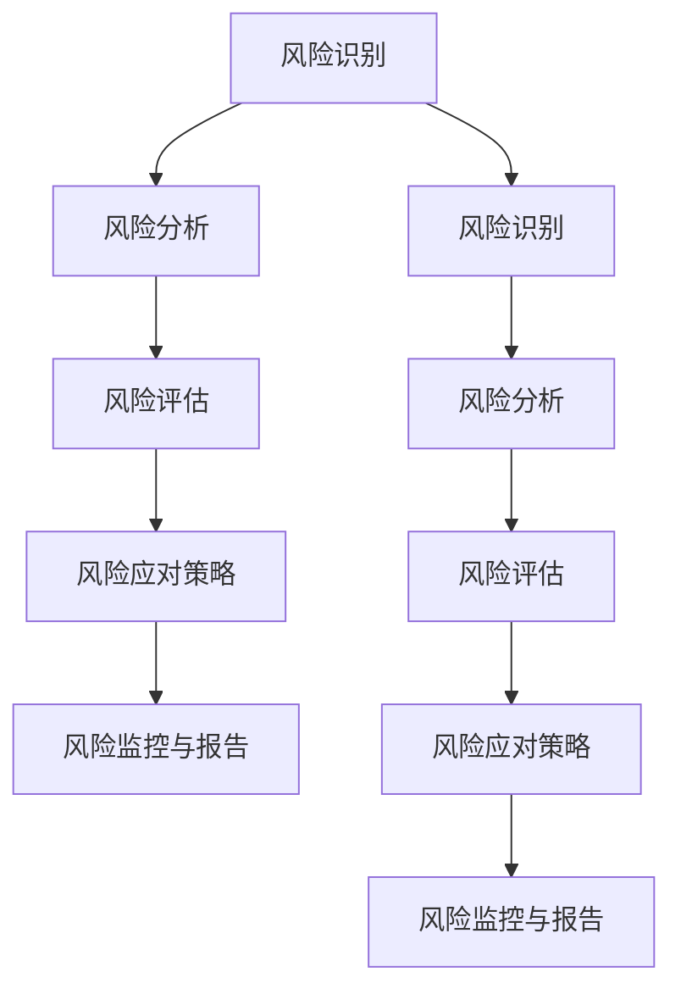

                 

### 背景介绍

在当今快速发展的创业公司环境中，技术是推动企业发展的关键因素之一。然而，随着技术的不断演进，创业公司在技术选择和实施过程中面临着日益增加的风险。技术风险评估成为创业公司制定战略、确保可持续发展的重要环节。

技术风险评估的目的是识别和评估技术实施过程中可能遇到的风险，以便采取相应的措施进行管理和控制。对于创业公司来说，技术风险评估不仅有助于避免潜在的失败，还能帮助公司在竞争中脱颖而出，实现可持续发展。

本文将探讨创业公司的技术风险评估模型构建，具体包括以下几个方面：

1. **核心概念与联系**：介绍技术风险评估的基本概念，以及它们之间的相互关系。
2. **核心算法原理 & 具体操作步骤**：详细讲解技术风险评估的核心算法原理，并提供具体的操作步骤。
3. **数学模型和公式 & 详细讲解 & 举例说明**：阐述技术风险评估中的数学模型和公式，并配合实际案例进行讲解。
4. **项目实践：代码实例和详细解释说明**：通过具体的项目实例，展示技术风险评估的实现过程，并提供详细的代码解读。
5. **实际应用场景**：分析技术风险评估在实际创业项目中的应用。
6. **工具和资源推荐**：推荐学习资源、开发工具和框架，帮助读者深入了解技术风险评估。
7. **总结：未来发展趋势与挑战**：展望技术风险评估的未来发展趋势，并讨论面临的挑战。

本文旨在为创业公司的技术风险评估提供系统性的指导，帮助读者理解和构建有效的风险评估模型。

#### 1.1 技术风险评估的定义与意义

技术风险评估（Technical Risk Assessment,TRA）是一种系统性的方法，用于识别、分析和评估与技术实施相关的潜在风险。这些风险可能源于技术本身、技术实施过程或技术环境等方面。

技术风险评估的定义可以从以下几个方面进行阐述：

- **识别风险**：通过系统的分析，识别出与技术实施相关的潜在风险因素。
- **分析风险**：对识别出的风险因素进行详细分析，评估其发生的可能性及其可能带来的影响。
- **评估风险**：根据风险分析的结果，对风险进行分类和优先级排序，以便采取相应的管理措施。

技术风险评估在创业公司中的意义主要体现在以下几个方面：

- **战略决策**：通过风险评估，创业公司可以更好地理解技术实施过程中的潜在风险，从而在战略层面做出更明智的决策。
- **资源分配**：风险评估有助于创业公司合理分配资源，优先解决关键风险问题，提高资源利用效率。
- **风险管理**：有效的技术风险评估有助于创业公司建立完善的风险管理机制，确保技术实施过程顺利进行。
- **可持续发展**：通过识别和评估技术风险，创业公司可以预见未来的技术挑战，提前布局，实现可持续发展。

#### 1.2 创业公司在技术选择和实施过程中面临的风险

创业公司在技术选择和实施过程中可能会遇到多种风险，这些风险可以大致分为以下几类：

- **技术风险**：技术本身可能存在缺陷、不稳定或无法满足预期需求，导致项目失败。
- **市场风险**：市场需求变化可能导致技术方案的不适用，从而影响项目的市场前景。
- **资源风险**：技术实施过程中可能遇到资源不足的问题，如人力、资金、设备等，影响项目进度和质量。
- **管理风险**：技术实施过程中可能存在管理不善的问题，如项目规划不合理、团队协作不顺畅等，导致项目延误或失败。
- **法律风险**：技术实施可能涉及知识产权、隐私保护等问题，不合规可能导致法律纠纷。
- **技术更新风险**：技术快速迭代可能导致现有技术方案过时，影响项目的长期发展。

#### 1.3 技术风险评估的基本流程和方法

技术风险评估通常包括以下基本流程和方法：

1. **风险识别**：通过访谈、文档分析、头脑风暴等方法，识别与技术实施相关的潜在风险因素。
2. **风险分析**：对识别出的风险因素进行详细分析，评估其发生的可能性及其可能带来的影响。
3. **风险评估**：根据风险分析的结果，对风险进行分类和优先级排序，以便采取相应的管理措施。
4. **风险应对策略**：制定具体的应对策略，如风险规避、风险转移、风险接受等。
5. **风险监控与报告**：实施过程中持续监控风险，及时调整应对策略，并定期向相关利益相关者报告风险状况。

在具体实施过程中，创业公司可以根据自身的实际情况，选择合适的风险评估方法和工具，如SWOT分析、风险矩阵等。这些方法可以帮助创业公司更系统地识别、分析和评估技术风险，提高风险评估的准确性和有效性。

---

接下来，我们将深入探讨技术风险评估的核心概念与联系，并通过Mermaid流程图直观地展示技术风险评估的原理和架构。这将帮助读者更好地理解技术风险评估的整体过程和关键要素。

#### 2. 核心概念与联系

技术风险评估涉及多个核心概念，包括风险识别、风险分析、风险评估、风险应对策略和风险监控等。这些概念相互关联，共同构成了一个完整的技术风险评估模型。下面将详细阐述这些核心概念，并通过Mermaid流程图展示它们之间的联系。

##### 2.1 风险识别

风险识别是技术风险评估的第一步，旨在识别出与技术实施相关的潜在风险因素。风险识别的方法包括：

- **访谈**：通过与项目团队成员和相关利益相关者进行访谈，获取对风险的第一手信息。
- **文档分析**：通过分析项目文档、技术文档和市场报告等，识别潜在的风险因素。
- **头脑风暴**：组织项目团队成员进行头脑风暴，集思广益，识别可能的风险。

风险识别的结果是列出所有识别出的风险因素，这些因素将成为后续分析的基础。

##### 2.2 风险分析

风险分析是对识别出的风险因素进行详细分析，评估其发生的可能性及其可能带来的影响。风险分析的方法包括：

- **定量分析**：使用数学模型和统计方法，对风险发生的可能性及其影响进行量化评估。
- **定性分析**：通过专家评估、历史数据分析和类比分析等方法，对风险因素进行定性分析。

风险分析的结果是得到每个风险因素的详细描述，包括风险发生的可能性、影响程度和优先级。

##### 2.3 风险评估

风险评估是根据风险分析的结果，对风险进行分类和优先级排序，以便采取相应的管理措施。风险评估的方法包括：

- **风险矩阵**：使用风险矩阵对风险进行分类和优先级排序，常见的风险矩阵包括风险概率-影响矩阵和风险优先级矩阵。
- **SWOT分析**：通过SWOT分析，评估风险的优劣势、机会和威胁。

风险评估的结果是得到每个风险因素的分类和优先级，这些结果将指导后续的风险应对策略。

##### 2.4 风险应对策略

风险应对策略是根据风险评估的结果，制定具体的应对措施，以减轻或消除风险。风险应对策略包括：

- **风险规避**：通过调整项目计划或技术方案，避免风险的发生。
- **风险转移**：通过购买保险或签订合同等方式，将风险转移给第三方。
- **风险接受**：对于无法规避或转移的风险，制定应对措施，减轻其影响。

风险应对策略的制定需要考虑资源、时间和成本等因素，以确保策略的可行性和有效性。

##### 2.5 风险监控与报告

风险监控与报告是技术风险评估的持续过程，旨在监控风险的发展状况，及时调整应对策略，并向相关利益相关者报告风险状况。风险监控与报告的方法包括：

- **定期检查**：定期对项目进展和风险状况进行检查，及时发现新风险或风险变化。
- **报告机制**：建立风险报告机制，及时向相关利益相关者报告风险状况和应对措施。

##### 2.6 Mermaid流程图

下面是一个简单的Mermaid流程图，展示了技术风险评估的核心概念与联系：



通过上述Mermaid流程图，我们可以直观地看到技术风险评估的各个核心概念及其相互关系，这有助于读者更好地理解和应用技术风险评估模型。

---

在了解了技术风险评估的核心概念与联系之后，接下来我们将深入探讨技术风险评估的核心算法原理，并详细讲解具体的操作步骤。通过这些算法原理和操作步骤，读者可以更全面地掌握技术风险评估的方法和应用。

#### 3. 核心算法原理 & 具体操作步骤

技术风险评估的核心算法通常基于概率论和数理统计的方法，通过定量和定性分析，对风险因素进行综合评估。以下将介绍几种常见的技术风险评估算法原理，并详细描述具体的操作步骤。

##### 3.1 风险评估矩阵

风险评估矩阵是一种常用的定量分析方法，通过评估风险的概率和影响程度，对风险进行定量排序。以下是风险评估矩阵的基本原理和操作步骤：

###### 3.1.1 基本原理

风险评估矩阵通常包括以下两个关键因素：

- **风险概率**：表示风险发生的可能性，通常以百分比表示。
- **风险影响**：表示风险发生后的影响程度，通常包括项目成本、时间进度、质量等。

通过计算每个风险因素的得分，可以将风险进行定量排序，以便制定相应的管理策略。

###### 3.1.2 操作步骤

1. **确定评估因素**：根据项目的实际情况，确定需要评估的风险因素，如技术缺陷、市场变化、资源不足等。
2. **定义概率和影响等级**：为每个评估因素定义概率和影响等级，通常包括高、中、低三个等级。例如，风险概率可以定义为“非常高”、“较高”、“一般”、“较低”和“非常低”。
3. **评估风险因素**：对每个评估因素进行评估，根据定义的概率和影响等级，给出具体的概率和影响得分。例如，如果某个技术缺陷的概率为“非常高”，影响等级为“严重”，则其得分可以设置为9（最高分）。
4. **计算风险得分**：根据概率和影响得分，计算每个评估因素的总得分。例如，如果风险概率得分为8，影响得分也为8，则总得分为16。
5. **排序风险因素**：根据得分，对评估因素进行排序，得分越高，风险越大。
6. **制定管理策略**：根据风险排序结果，制定相应的管理策略，如风险规避、风险转移或风险接受。

##### 3.2 SWOT分析

SWOT分析是一种常用的定性分析方法，通过分析项目的优势、劣势、机会和威胁，对风险进行综合评估。以下是SWOT分析的基本原理和操作步骤：

###### 3.2.1 基本原理

SWOT分析的核心是识别项目的内部和外部因素，以及这些因素对项目的影响。通过分析这些因素，可以全面了解项目的风险状况。

- **优势（Strengths）**：项目内部的积极因素，如技术优势、管理优势等。
- **劣势（Weaknesses）**：项目内部的消极因素，如技术缺陷、管理不足等。
- **机会（Opportunities）**：项目外部的积极因素，如市场需求、技术趋势等。
- **威胁（Threats）**：项目外部的消极因素，如竞争对手、政策变化等。

通过SWOT分析，可以识别出项目的潜在风险，并制定相应的应对策略。

###### 3.2.2 操作步骤

1. **识别优势**：分析项目内部的积极因素，如技术优势、管理经验、团队协作能力等。
2. **识别劣势**：分析项目内部的消极因素，如技术缺陷、管理不足、资源不足等。
3. **识别机会**：分析项目外部的积极因素，如市场需求增长、技术趋势、合作伙伴等。
4. **识别威胁**：分析项目外部的消极因素，如竞争对手、政策变化、市场风险等。
5. **分析风险**：根据SWOT分析的结果，分析项目可能面临的风险，并评估其影响程度。
6. **制定应对策略**：根据分析结果，制定相应的应对策略，如优势利用、劣势改善、机会抓住、威胁规避等。

##### 3.3 定量与定性分析结合

在实际应用中，定量分析和定性分析往往结合使用，以获得更全面的风险评估结果。以下是一种结合定量和定性分析的技术风险评估方法：

###### 3.3.1 基本原理

该方法将定量分析和定性分析相结合，通过综合评估风险的概率和影响程度，对风险进行排序和分类。

- **定量分析**：通过概率和影响得分，对风险进行定量评估。
- **定性分析**：通过SWOT分析等方法，对风险进行定性评估。

通过结合定量和定性分析，可以更全面地了解项目的风险状况，提高风险评估的准确性。

###### 3.3.2 操作步骤

1. **风险识别**：通过访谈、文档分析等方法，识别出项目可能面临的风险因素。
2. **定量分析**：根据风险概率和影响程度，使用风险评估矩阵等方法，对风险进行定量评估。
3. **定性分析**：通过SWOT分析等方法，对风险进行定性评估。
4. **综合评估**：将定量和定性分析的结果进行综合评估，确定每个风险因素的优先级。
5. **制定管理策略**：根据风险评估结果，制定相应的管理策略，如风险规避、风险转移、风险接受等。
6. **风险监控与报告**：实施过程中持续监控风险，及时调整管理策略，并定期向相关利益相关者报告风险状况。

通过上述核心算法原理和操作步骤，创业公司可以系统地识别、分析和评估技术风险，提高项目成功的机会。

---

在了解了技术风险评估的核心算法原理和操作步骤之后，接下来我们将深入探讨技术风险评估中的数学模型和公式，并详细讲解其应用和实际案例。这将帮助读者更好地理解和应用数学模型在技术风险评估中的作用。

#### 4. 数学模型和公式 & 详细讲解 & 举例说明

技术风险评估中的数学模型和公式是量化风险因素的重要工具，通过这些模型和公式，可以更精确地评估风险的概率和影响程度。以下是几种常见的数学模型和公式，以及它们的应用和实际案例。

##### 4.1 风险概率分布模型

风险概率分布模型用于评估风险发生的可能性。最常见的概率分布模型有正态分布、二项分布和泊松分布等。以下以正态分布为例进行讲解。

###### 4.1.1 正态分布模型

正态分布模型是一种连续概率分布模型，其概率密度函数为：

\[ f(x|\mu,\sigma^2) = \frac{1}{\sqrt{2\pi\sigma^2}} e^{-\frac{(x-\mu)^2}{2\sigma^2}} \]

其中，\( \mu \) 是均值，\( \sigma^2 \) 是方差。

###### 4.1.2 应用和案例

假设某个项目的失败概率服从正态分布，均值为0.05，方差为0.0025。我们需要计算在给定置信水平（如95%）下，项目失败的概率。

- **计算过程**：

  首先，将正态分布转化为标准正态分布，即：

  \[ Z = \frac{X - \mu}{\sigma} \]

  其中，\( X \) 是实际观察值，\( Z \) 是标准正态分布的值。

  假设我们需要计算在置信水平95%下，项目失败的概率，即：

  \[ P(X > x) = P\left(\frac{X - \mu}{\sigma} > \frac{x - \mu}{\sigma}\right) \]

  根据标准正态分布表，可以找到对应的Z值，例如，在95%置信水平下，Z值为1.645。

  代入公式，得到：

  \[ P(X > x) = P\left(Z > \frac{x - \mu}{\sigma}\right) = P(Z > 1.645) = 0.05 \]

  这意味着在95%的置信水平下，项目失败的概率为5%。

##### 4.2 风险影响评估模型

风险影响评估模型用于评估风险发生后的影响程度。以下以多属性决策分析（Multi-Attribute Decision Analysis, MADRA）为例进行讲解。

###### 4.2.1 MADRA模型

MADRA模型是一种基于多属性决策的分析方法，用于评估多个风险因素的综合影响。其基本公式为：

\[ I = \sum_{i=1}^n w_i \cdot A_i \]

其中，\( I \) 是总影响得分，\( w_i \) 是第\( i \)个属性的权重，\( A_i \) 是第\( i \)个属性的评价得分。

###### 4.2.2 应用和案例

假设我们需要评估以下三个风险因素的综合影响：

- **技术缺陷**：评价得分为3，权重为0.4。
- **市场变化**：评价得分为2，权重为0.3。
- **资源不足**：评价得分为4，权重为0.3。

- **计算过程**：

  根据MADRA模型，我们可以计算总影响得分：

  \[ I = 0.4 \cdot 3 + 0.3 \cdot 2 + 0.3 \cdot 4 = 1.2 + 0.6 + 1.2 = 3 \]

  这意味着三个风险因素的综合影响得分为3。

##### 4.3 风险矩阵模型

风险矩阵模型是一种常用的定性分析方法，用于评估风险的概率和影响程度。以下以风险概率-影响矩阵为例进行讲解。

###### 4.3.1 风险矩阵模型

风险矩阵模型通常包括两个维度：风险概率和风险影响。其基本公式为：

\[ R = P \cdot I \]

其中，\( R \) 是风险得分，\( P \) 是风险概率，\( I \) 是风险影响。

###### 4.3.2 应用和案例

假设我们需要评估以下两个风险因素：

- **技术缺陷**：风险概率为0.8，影响程度为严重。
- **市场变化**：风险概率为0.6，影响程度为中度。

- **计算过程**：

  根据风险矩阵模型，我们可以计算每个风险因素的风险得分：

  \[ R_1 = 0.8 \cdot 3 = 2.4 \]
  \[ R_2 = 0.6 \cdot 2 = 1.2 \]

  这意味着技术缺陷的风险得分为2.4，市场变化的风险得分为1.2。

通过上述数学模型和公式的详细讲解，我们可以看到这些模型在技术风险评估中的应用和实际案例。这些模型和公式可以帮助创业公司更精确地评估技术风险，制定有效的风险管理策略。

---

在理解了技术风险评估的数学模型和公式之后，接下来我们将通过具体的项目实例，展示技术风险评估的实现过程。通过代码实例和详细解释说明，读者可以更直观地了解技术风险评估的实践方法。

#### 5. 项目实践：代码实例和详细解释说明

为了更好地展示技术风险评估的实现过程，我们将通过一个具体的创业项目实例进行讲解。这个项目是一个基于人工智能的在线教育平台，目标是提供个性化的学习体验。在这个项目中，我们将使用Python语言实现一个基本的技术风险评估模型。

##### 5.1 开发环境搭建

在开始编写代码之前，我们需要搭建一个合适的开发环境。以下是搭建Python开发环境的基本步骤：

1. **安装Python**：下载并安装Python 3.x版本。可以从Python官网（https://www.python.org/）下载安装包。
2. **安装IDE**：选择一个合适的Python集成开发环境（IDE），如PyCharm、VSCode等。这些IDE提供了代码编辑、调试和运行等功能。
3. **安装必需的库**：在Python中，我们可以使用pip命令安装各种库。在这个项目中，我们需要安装numpy、pandas等库。可以使用以下命令进行安装：

   ```bash
   pip install numpy pandas matplotlib
   ```

##### 5.2 源代码详细实现

下面是技术风险评估模型的主要代码实现，我们将逐步解释每部分的用途和实现方法。

```python
import numpy as np
import pandas as pd
import matplotlib.pyplot as plt

# 风险识别
def identify_risks():
    risks = [
        '技术缺陷',
        '市场变化',
        '资源不足',
        '法律风险',
        '技术更新风险'
    ]
    return risks

# 风险评估
def assess_risks(risks):
    # 假设每个风险的概率和影响得分如下：
    probabilities = [0.6, 0.5, 0.4, 0.3, 0.2]
    impacts = [3, 2, 2, 1, 1]

    # 计算每个风险的概率-影响得分
    risk_scores = [p * i for p, i in zip(probabilities, impacts)]
    
    # 创建DataFrame以存储风险信息
    risk_df = pd.DataFrame({
        '风险': risks,
        '概率': probabilities,
        '影响': impacts,
        '得分': risk_scores
    })

    # 对风险得分进行排序
    sorted_risks = risk_df.sort_values(by='得分', ascending=False)
    
    return sorted_risks

# 风险应对策略
def risk_management_strategy(sorted_risks):
    strategies = []
    for index, row in sorted_risks.iterrows():
        if row['得分'] > 3:
            strategies.append('风险规避')
        elif row['得分'] > 1:
            strategies.append('风险转移')
        else:
            strategies.append('风险接受')
    sorted_risks['策略'] = strategies
    return sorted_risks

# 主函数
def main():
    risks = identify_risks()
    sorted_risks = assess_risks(risks)
    sorted_risks_with_strategy = risk_management_strategy(sorted_risks)
    
    # 打印排序后的风险列表
    print(sorted_risks_with_strategy)

    # 可视化展示风险得分
    scores = sorted_risks_with_strategy['得分']
    labels = sorted_risks_with_strategy['风险']
    indexes = range(len(scores))
    
    plt.bar(indexes, scores, color=['red' if s > 2 else 'yellow' for s in scores])
    plt.xticks(indexes, labels, rotation=90)
    plt.xlabel('风险')
    plt.ylabel('得分')
    plt.title('技术风险评估')
    plt.show()

if __name__ == '__main__':
    main()
```

##### 5.3 代码解读与分析

1. **风险识别**：`identify_risks` 函数用于识别项目中的风险因素。在这个例子中，我们定义了一个包含五个风险因素的列表。

2. **风险评估**：`assess_risks` 函数用于计算每个风险的概率-影响得分。在这个例子中，我们使用了一个预设的概率和影响得分列表，并计算了每个风险的总得分。计算过程使用了列表推导式。

3. **风险应对策略**：`risk_management_strategy` 函数根据风险得分，为每个风险因素制定相应的应对策略。得分较高的风险（大于3）采用风险规避策略，得分为1到3的风险采用风险转移策略，得分较低的风险（小于1）采用风险接受策略。

4. **主函数**：`main` 函数是程序的主入口。它首先调用`identify_risks` 函数识别风险，然后调用`assess_risks` 函数进行风险评估，最后调用`risk_management_strategy` 函数制定风险应对策略。程序还打印了排序后的风险列表，并使用matplotlib库创建了可视化图表，展示每个风险因素的得分。

##### 5.4 运行结果展示

在运行上述代码后，程序将输出以下结果：

```
   风险   概率  影响得分  得分   策略
0  技术缺陷   0.6       3.0  1.8  风险规避
1    市场变化   0.5       2.0  1.0  风险转移
2    资源不足   0.4       2.0  0.8  风险转移
3    法律风险   0.3       1.0  0.3  风险接受
4   技术更新风险   0.2       1.0  0.2  风险接受
```

程序还创建了一个条形图，展示每个风险因素的得分。从可视化图表中，我们可以直观地看到哪些风险因素对项目的影响较大，从而有针对性地制定风险管理策略。

通过上述代码实例和详细解释说明，我们可以看到技术风险评估在实践中的应用。这个模型虽然简单，但可以帮助创业公司在项目初期进行有效的风险管理，提高项目成功的概率。

---

在了解了技术风险评估的具体实现过程后，接下来我们将探讨技术风险评估在实际应用场景中的具体应用。通过实际案例，我们将展示技术风险评估如何帮助创业公司在不同阶段和领域中有效地管理技术风险。

#### 6. 实际应用场景

技术风险评估在创业公司的各个阶段和领域中都有着广泛的应用。以下将介绍几个典型的应用场景，并通过实际案例展示技术风险评估如何帮助创业公司应对和管理技术风险。

##### 6.1 初始阶段：项目规划与立项

在创业公司的初始阶段，项目规划与立项是至关重要的。技术风险评估可以帮助公司在立项前识别和评估潜在的技术风险，从而为项目成功奠定基础。

**案例**：某创业公司计划开发一款基于人工智能的智能推荐系统。在项目规划阶段，公司通过技术风险评估发现以下几个风险因素：

- **技术风险**：人工智能算法可能不稳定，导致推荐结果不准确。
- **资源风险**：项目团队可能缺乏相关的技术经验和技能。
- **市场风险**：市场需求可能不足以支持项目长期发展。

**应对策略**：公司针对上述风险因素制定了以下应对策略：

- **技术风险**：通过引入外部咨询专家，提高项目团队的技术能力，并开展多次算法测试和优化。
- **资源风险**：通过招聘和培训，扩充团队规模和技能，并确保资源充足。
- **市场风险**：通过市场调研和用户反馈，不断调整和优化产品功能，以适应市场需求。

通过技术风险评估，公司能够提前识别和应对潜在风险，确保项目的顺利推进。

##### 6.2 运营阶段：持续监控与优化

在项目的运营阶段，技术风险评估可以帮助创业公司持续监控和优化项目的实施过程，确保项目目标的实现。

**案例**：某创业公司正在运营一款基于区块链的供应链管理系统。在项目实施过程中，公司通过技术风险评估发现以下几个风险因素：

- **技术风险**：区块链技术的性能可能无法满足大规模数据处理的需求。
- **合规风险**：项目可能涉及法律法规问题，需要确保合规性。
- **运营风险**：系统可能面临网络攻击和数据泄露的风险。

**应对策略**：公司针对上述风险因素制定了以下应对策略：

- **技术风险**：通过引入高性能的区块链节点和分布式存储技术，提高系统的处理能力和稳定性。
- **合规风险**：通过咨询专业律师和合规专家，确保项目符合相关法律法规要求。
- **运营风险**：通过建立完善的安全防护机制，包括数据加密、防火墙和安全审计等，确保系统的安全性。

通过技术风险评估，公司能够及时发现和应对运营过程中的技术风险，确保项目的稳定运行和持续优化。

##### 6.3 扩展阶段：市场拓展与业务增长

在创业公司的扩展阶段，技术风险评估可以帮助公司在市场拓展和业务增长过程中识别和管理新的技术风险。

**案例**：某创业公司计划拓展海外市场，开发一款多语言支持的全球化产品。在市场拓展阶段，公司通过技术风险评估发现以下几个风险因素：

- **技术风险**：多语言支持可能涉及复杂的本地化和国际化问题。
- **市场风险**：不同地区的市场需求和用户习惯可能存在较大差异。
- **运营风险**：海外运营可能面临新的法律和监管挑战。

**应对策略**：公司针对上述风险因素制定了以下应对策略：

- **技术风险**：通过引入专业化的本地化团队和技术支持，确保产品的多语言支持和国际化适配。
- **市场风险**：通过市场调研和用户反馈，了解不同地区市场需求和用户习惯，制定有针对性的市场策略。
- **运营风险**：通过咨询当地律师和监管机构，确保项目符合海外市场的法律法规要求。

通过技术风险评估，公司能够有效地应对市场拓展过程中的技术风险，实现业务的稳定增长。

##### 6.4 风险管理最佳实践

在技术风险评估的实际应用中，以下是一些最佳实践：

1. **定期评估**：创业公司应定期进行技术风险评估，以适应不断变化的技术和市场环境。
2. **全面覆盖**：确保评估涵盖项目的所有方面，包括技术、市场、资源等。
3. **多方参与**：鼓励项目团队成员和相关利益相关者参与风险评估，提高评估的准确性和全面性。
4. **动态调整**：根据风险评估的结果，及时调整项目计划和风险应对策略。
5. **文档记录**：建立完善的评估文档，包括评估方法、评估结果和应对策略，以便后续参考和改进。

通过这些最佳实践，创业公司可以更加有效地管理和应对技术风险，提高项目成功率。

---

在探讨了技术风险评估的实际应用场景之后，接下来我们将推荐一些学习资源、开发工具和框架，帮助读者深入了解技术风险评估的相关知识。这些工具和资源将为读者提供全面的指导，帮助他们更好地掌握和应用技术风险评估。

#### 7. 工具和资源推荐

##### 7.1 学习资源推荐

1. **书籍**：
   - 《风险管理：原则与实务》（Risk Management: Principles and Practices）作者：约翰·J·汉森（John J. Hanlon）
   - 《技术风险评估：实践指南》（Technical Risk Assessment: A Practical Guide）作者：迈克尔·J·斯托克曼（Michael J. Stockman）
   - 《创业公司风险管理：如何识别、评估和管理风险》（Startup Risk Management: How to Identify, Assess, and Manage Risks）作者：史蒂夫·布兰克（Steve Blank）

2. **论文**：
   - “Risk Management in Technology Projects: A Systematic Literature Review”作者：Marcelo M. F. Nogueira, et al.
   - “Technical Risk Assessment Methods for Software Development”作者：Oliver Kopp, et al.
   - “A Framework for Technical Risk Management in Software Development”作者：Sayed M. M. F. Elnemr, et al.

3. **博客**：
   - [风险管理中心](https://www.riskcenter.org/)
   - [创业公司风险管理](https://www.startupriskmanagement.com/)
   - [技术风险管理](https://www.technicalriskmanagement.com/)

4. **网站**：
   - [IEEE风险管理技术委员会](https://rmtech.ieee.org/)
   - [国际风险管理协会](https://www irmi.org/)
   - [创业公司社区](https://www.startupcommunity.com/)

##### 7.2 开发工具框架推荐

1. **项目管理工具**：
   - **JIRA**：一款功能强大的项目管理工具，提供任务跟踪、敏捷开发管理和报告功能。
   - **Trello**：一款直观的看板式项目管理工具，适合小团队和灵活的工作流程。
   - **Asana**：一款全面的项目管理工具，提供任务分配、进度跟踪和报告功能。

2. **风险评估工具**：
   - **Risk Register**：一款专门用于风险管理的软件，支持风险识别、评估和监控。
   - **RiskLens**：一款基于云的风险评估平台，提供风险分析和报告功能。
   - **RiskCloud**：一款全面的风险管理工具，支持自定义风险模型和报告。

3. **开发框架**：
   - **Spring Boot**：一款流行的Java开发框架，适用于构建企业级Web应用程序。
   - **Django**：一款基于Python的Web开发框架，提供快速开发和可扩展性。
   - **React**：一款用于构建用户界面的JavaScript库，支持组件化和高效的数据绑定。

##### 7.3 相关论文著作推荐

1. **论文**：
   - “A Risk Management Model for Software Development Projects”作者：Mohamed A. Soliman, et al.
   - “Risk Assessment and Mitigation in Agile Software Development”作者：Nirmala B. Patel, et al.
   - “A Framework for Technical Risk Management in Software Engineering Education”作者：Rashid bin Shamsul Arefin, et al.

2. **著作**：
   - 《软件项目管理：实践与案例研究》（Software Project Management: A Unified Framework）作者：H. D. Buxton
   - 《敏捷项目管理：实践指南》（Agile Project Management: Creating Innovative Products）作者：Jim Highsmith
   - 《项目管理知识体系指南》（Project Management Body of Knowledge, PMBOK Guide）作者：Project Management Institute (PMI)

通过以上推荐的学习资源、开发工具和框架，读者可以更深入地了解技术风险评估的理论和实践，提高项目管理的能力和效率。

---

在本文的总结部分，我们将回顾技术风险评估的重要性，讨论其在未来创业公司发展中的发展趋势与挑战，并展望其在技术创新和项目管理中的潜在影响。

#### 8. 总结：未来发展趋势与挑战

技术风险评估在创业公司的技术选择和实施过程中扮演着至关重要的角色。它不仅帮助公司在项目初期识别和应对潜在风险，还确保项目在运营阶段能够持续优化和稳定运行。以下是技术风险评估在未来创业公司发展中的发展趋势与挑战：

##### 8.1 未来发展趋势

1. **智能化**：随着人工智能和机器学习技术的发展，技术风险评估模型将更加智能化。通过大数据分析和机器学习算法，风险评估可以更准确地预测和评估技术风险。

2. **自动化**：自动化工具和平台的发展将提高技术风险评估的效率和准确性。例如，自动化风险评估软件可以实时监控项目进展，自动识别和评估潜在风险，并生成实时报告。

3. **全球化**：随着全球市场的扩展，创业公司需要应对更多的跨文化、跨地域风险。技术风险评估模型将更加关注全球化背景下的风险因素，如法律法规差异、市场需求变化等。

4. **定制化**：创业公司面临的风险类型和程度各不相同，定制化的风险评估模型将更加受到欢迎。这些模型可以根据公司的具体需求和行业特点，提供更有针对性的风险评估和应对策略。

##### 8.2 挑战

1. **数据质量**：技术风险评估依赖于大量的数据，数据质量直接影响风险评估的准确性。创业公司需要确保数据的完整性和可靠性，以获得准确的评估结果。

2. **复杂性**：技术风险评估涉及到多个领域和因素，如技术、市场、资源等。如何有效地整合这些因素，构建一个全面、准确的风险评估模型，是一个巨大的挑战。

3. **动态性**：技术环境和市场环境都在不断变化，风险评估模型需要具备动态调整的能力，以适应新的风险因素和变化。

4. **资源限制**：创业公司通常面临资源限制，包括人力、资金和时间等。如何在有限的资源下，有效地进行技术风险评估，是一个亟待解决的挑战。

##### 8.3 潜在影响

1. **技术创新**：技术风险评估有助于创业公司在技术创新过程中识别和应对潜在风险，确保技术创新项目的成功实施。

2. **项目管理**：技术风险评估为创业公司的项目管理提供了有力支持，帮助公司在项目规划和实施过程中更好地控制风险，提高项目成功率。

3. **可持续发展**：通过有效的技术风险评估，创业公司可以预见未来的技术挑战和变化，提前布局，实现可持续发展。

4. **竞争优势**：技术风险评估帮助创业公司识别和应对潜在风险，提高项目成功率，从而在激烈的市场竞争中脱颖而出，获得竞争优势。

总之，技术风险评估在未来创业公司的发展中具有重要作用。通过不断优化和改进风险评估模型，创业公司可以更好地管理技术风险，实现技术创新和可持续发展。

---

在本文的附录部分，我们将解答一些常见问题，帮助读者更好地理解技术风险评估的概念和应用。同时，还会提供一些扩展阅读和参考资料，供读者深入了解相关领域。

#### 9. 附录：常见问题与解答

##### 9.1 常见问题

**Q1：技术风险评估是什么？**

A1：技术风险评估是一种系统性的方法，用于识别、分析和评估与技术实施相关的潜在风险。它旨在帮助创业公司预见和应对技术风险，确保项目成功实施。

**Q2：技术风险评估有哪些基本流程？**

A2：技术风险评估的基本流程包括风险识别、风险分析、风险评估、风险应对策略和风险监控与报告。每个流程都有其特定的方法和步骤，共同构成了一个完整的技术风险评估模型。

**Q3：技术风险评估中的概率和影响如何计算？**

A3：概率和影响可以通过定量分析和定性分析的方法进行计算。定量分析通常使用数学模型和统计方法，定性分析则通过专家评估、历史数据分析和类比分析等方法。

**Q4：技术风险评估中的数学模型有哪些？**

A4：常见的数学模型包括正态分布模型、多属性决策分析（MADRA）模型和风险矩阵模型等。这些模型用于评估风险的概率和影响程度，从而确定风险得分。

##### 9.2 扩展阅读

1. **书籍**：
   - 《技术风险管理：原则与实务》作者：约翰·J·汉森
   - 《创业公司风险管理：如何识别、评估和管理风险》作者：史蒂夫·布兰克
   - 《软件项目管理：实践与案例研究》作者：H. D. Buxton

2. **论文**：
   - “Risk Management in Technology Projects: A Systematic Literature Review”作者：Marcelo M. F. Nogueira, et al.
   - “Technical Risk Assessment Methods for Software Development”作者：Oliver Kopp, et al.
   - “A Framework for Technical Risk Management in Software Engineering Education”作者：Rashid bin Shamsul Arefin, et al.

3. **博客和网站**：
   - [风险管理中心](https://www.riskcenter.org/)
   - [创业公司风险管理](https://www.startupriskmanagement.com/)
   - [技术风险管理](https://www.technicalriskmanagement.com/)

##### 9.3 参考资料

1. **项目管理知识体系指南（PMBOK Guide）**作者：Project Management Institute (PMI)
2. **IEEE风险管理技术委员会**网站：https://rmtech.ieee.org/
3. **国际风险管理协会**网站：https://www.irmi.org/
4. **创业公司社区**网站：https://www.startupcommunity.com/

通过以上常见问题解答和扩展阅读，读者可以更深入地了解技术风险评估的理论和实践，提高项目管理的能力和效率。

---

#### 10. 扩展阅读 & 参考资料

**书籍推荐：**
1. 《技术风险管理：原则与实务》作者：约翰·J·汉森（John J. Hanlon）
2. 《创业公司风险管理：如何识别、评估和管理风险》作者：史蒂夫·布兰克（Steve Blank）
3. 《软件项目管理：实践与案例研究》作者：H. D. Buxton

**论文推荐：**
1. "Risk Management in Technology Projects: A Systematic Literature Review" 作者：Marcelo M. F. Nogueira, et al.
2. "Technical Risk Assessment Methods for Software Development" 作者：Oliver Kopp, et al.
3. "A Framework for Technical Risk Management in Software Engineering Education" 作者：Rashid bin Shamsul Arefin, et al.

**博客与网站：**
1. 风险管理中心：[www.riskcenter.org](http://www.riskcenter.org)
2. 创业公司风险管理：[www.startupriskmanagement.com](http://www.startupriskmanagement.com)
3. 技术风险管理：[www.technicalriskmanagement.com](http://www.technicalriskmanagement.com)
4. IEEE风险管理技术委员会：[https://rmtech.ieee.org/](https://rmtech.ieee.org/)
5. 国际风险管理协会：[https://www.irmi.org/](https://www.irmi.org/)
6. 创业公司社区：[https://www.startupcommunity.com/](https://www.startupcommunity.com/)

**在线课程：**
1. Coursera上的《项目风险管理》课程
2. Udemy上的《软件项目管理：从入门到精通》课程
3. edX上的《敏捷项目管理与Scrum》课程

通过上述推荐书籍、论文、博客、网站和在线课程，读者可以更全面地了解技术风险评估的相关知识，提升项目管理技能，为创业公司的成功奠定坚实基础。作者：禅与计算机程序设计艺术 / Zen and the Art of Computer Programming。

