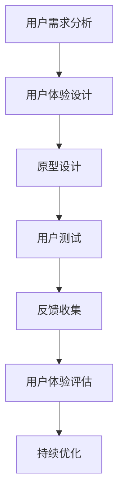

                 

### 背景介绍

在当今高度竞争的商业环境中，用户体验（User Experience, UX）已经成为企业成功的关键因素之一。对于创业公司而言，优化用户体验并提升用户满意度不仅能够吸引新客户，还能够留住现有客户，从而在激烈的市场竞争中占据优势。因此，创业公司对于用户体验的重视程度不断提升。

#### 当前市场环境

当前市场环境中，消费者对于产品的期望值越来越高，他们不仅要求产品功能齐全，更注重使用过程中的便捷性和愉悦感。这种趋势迫使创业公司在产品设计和开发过程中，必须将用户体验放在首位。

#### 创业公司面临的挑战

1. **资源有限**：创业公司通常在资金、人力和技术资源方面相对有限，这使得在用户体验优化方面面临较大压力。
2. **快速迭代**：创业公司往往需要快速响应市场需求，不断迭代产品。在这样快节奏的开发过程中，保证用户体验的质量成为一个挑战。
3. **用户多样性**：创业公司的目标用户群体可能非常多样化，不同用户对产品的期望和需求各异，如何满足这一多样性，是创业公司在用户体验优化过程中需要考虑的问题。

#### 用户体验的重要性

1. **增加用户粘性**：良好的用户体验能够增加用户对产品的使用频率和依赖度，从而提高用户粘性。
2. **提升品牌形象**：优秀的用户体验有助于树立公司品牌形象，提升用户对品牌的认可度。
3. **降低客户流失率**：通过优化用户体验，可以减少用户因不满意而选择其他产品的可能性，从而降低客户流失率。

#### 用户体验优化的必要性

对于创业公司来说，优化用户体验不仅是提高市场竞争力的手段，更是实现持续发展的关键。通过深入研究用户需求，优化产品设计，提升服务质量，创业公司能够在激烈的市场竞争中脱颖而出，实现长期稳定的发展。

### 关键概念与联系

在深入探讨用户体验优化之前，我们需要了解一些核心概念和它们之间的联系。以下是一个简化的Mermaid流程图，用于展示这些概念及其相互关系。



#### 用户需求分析

用户需求分析是用户体验优化的第一步，它涉及了解目标用户的需求和期望。通过市场调研、用户访谈、问卷调查等方法，创业公司可以获取用户的真实反馈，从而为产品设计提供依据。

#### 用户体验设计

用户体验设计是根据用户需求分析的结果，对产品的界面、交互流程、功能布局等进行设计。这个阶段的目标是创建一个直观、易用、用户友好的产品。

#### 原型设计

原型设计阶段是将用户体验设计转化为具体的视觉和交互原型。这个过程可以通过线框图、高保真图、原型工具（如Axure、Sketch、Figma等）来实现。

#### 用户测试

用户测试是验证产品是否符合用户期望的关键步骤。通过让真实用户参与测试，创业公司可以发现产品中的问题，并对其进行改进。

#### 反馈收集

用户测试后，收集用户反馈至关重要。这些反馈可以帮助公司了解用户对产品的真实感受，从而为后续优化提供方向。

#### 用户体验评估

用户体验评估是对整个用户体验过程进行系统性的分析和评估。通过定量和定性的方法，公司可以了解用户体验的整体质量和改进空间。

#### 持续优化

持续优化是一个循环过程，创业公司需要不断根据用户反馈和评估结果，对产品进行迭代和改进，以提升用户体验。

通过以上流程，创业公司可以逐步优化用户体验，提升用户满意度，从而在竞争激烈的市场中占据一席之地。

### 核心算法原理 & 具体操作步骤

在深入探讨用户体验优化之前，我们需要了解一些核心算法原理和具体操作步骤。这些算法和步骤可以帮助创业公司有效地识别和解决用户体验问题。

#### 1. 用户行为分析算法

用户行为分析是了解用户需求和行为习惯的关键。通过以下步骤，公司可以运用用户行为分析算法：

1. **数据收集**：收集用户在产品中的行为数据，如点击率、停留时间、操作路径等。
2. **数据预处理**：对收集到的数据进行清洗和整理，确保数据的准确性和完整性。
3. **行为模式识别**：使用机器学习算法（如决策树、支持向量机等）识别用户的行为模式。
4. **分析结果展示**：将分析结果可视化，帮助公司了解用户的行为特点和偏好。

#### 2. 用户体验评估算法

用户体验评估是衡量产品是否符合用户期望的重要手段。以下步骤可以帮助公司运用用户体验评估算法：

1. **制定评估指标**：根据用户需求和产品特点，制定合适的评估指标，如满意度、易用性、可用性等。
2. **数据收集**：通过用户调研、问卷调查、用户测试等方法，收集用户体验数据。
3. **数据处理**：对收集到的用户体验数据进行统计和分析，计算各项评估指标的得分。
4. **评估结果展示**：将评估结果进行可视化展示，帮助公司了解用户体验的整体质量和改进方向。

#### 3. 交互优化算法

交互优化是提升用户体验的关键步骤。以下步骤可以帮助公司运用交互优化算法：

1. **交互分析**：分析当前产品的交互流程，识别可能存在的用户体验问题。
2. **方案设计**：设计优化方案，如改进界面布局、简化操作流程、增加提示信息等。
3. **测试与验证**：通过用户测试验证优化方案的有效性，并根据用户反馈进行迭代。
4. **效果评估**：评估优化方案的实际效果，确保用户体验得到显著提升。

#### 4. 个性化推荐算法

个性化推荐是提升用户体验的有效手段。以下步骤可以帮助公司运用个性化推荐算法：

1. **用户特征提取**：提取用户的兴趣、行为等特征信息。
2. **推荐模型构建**：使用协同过滤、矩阵分解、深度学习等算法构建推荐模型。
3. **推荐结果生成**：根据用户特征和推荐模型，生成个性化的推荐结果。
4. **效果评估**：评估推荐系统的效果，不断优化推荐算法，提升用户体验。

#### 5. 实时反馈系统

实时反馈系统是收集用户即时反馈的重要工具。以下步骤可以帮助公司构建实时反馈系统：

1. **实时数据收集**：收集用户在使用过程中的实时数据，如操作记录、错误日志等。
2. **数据分析**：对实时数据进行实时分析和处理，识别潜在的问题和用户需求。
3. **反馈机制设计**：设计实时反馈机制，如错误提示、改进建议等，帮助用户解决问题和提出需求。
4. **效果评估**：评估实时反馈系统的效果，确保用户的问题和需求得到及时响应。

通过以上核心算法和步骤，创业公司可以系统地优化用户体验，提升用户满意度，从而在激烈的市场竞争中脱颖而出。

### 数学模型和公式 & 详细讲解 & 举例说明

在用户体验优化过程中，数学模型和公式扮演着关键角色，它们不仅能够帮助我们量化用户体验，还能够指导我们进行精确的数据分析和评估。以下我们将详细讲解几个常用的数学模型和公式，并通过具体例子来说明如何应用这些模型。

#### 1. 满意度评分模型

满意度评分模型用于量化用户对产品的满意程度。一个常见的满意度评分模型是五点量表，如下所示：

$$
S = \frac{X_1 + X_2 + X_3 + X_4 + X_5}{5}
$$

其中，$X_1, X_2, X_3, X_4, X_5$ 分别代表用户对产品在五个不同维度（如易用性、功能丰富度、响应速度等）的评分。每个维度的评分范围从1到5，1代表非常不满意，5代表非常满意。通过计算平均值，我们可以得到用户对产品的总体满意度得分。

**例子：**
假设一个用户在易用性、功能丰富度、响应速度三个方面分别给出了4、3、5的评分，那么他的总体满意度得分为：

$$
S = \frac{4 + 3 + 5}{5} = 3.8
$$

这个结果表明用户的总体满意度处于中等水平。

#### 2. 用户体验评估模型

用户体验评估模型用于评估产品的整体用户体验质量。一个常用的评估模型是Norman的UEQ（User Experience Quality）模型，它包括以下几个维度：

- **可用性**（Usability）
- **易学性**（Learnability）
- **愉悦性**（Stability）

UEQ模型可以通过以下公式进行计算：

$$
UEQ = \frac{U + L + S}{3}
$$

其中，$U, L, S$ 分别代表用户在可用性、易学性和愉悦性三个维度的评分。每个维度的评分范围从1到10，1代表非常差，10代表非常好。

**例子：**
假设一个用户在可用性、易学性和愉悦性三个维度上的评分分别为8、7、9，那么产品的UEQ得分为：

$$
UEQ = \frac{8 + 7 + 9}{3} = 8
$$

这个结果表明产品的整体用户体验质量较好。

#### 3. NPS（Net Promoter Score）模型

NPS模型用于衡量用户对产品的推荐意愿。NPS的计算公式如下：

$$
NPS = P - N
$$

其中，$P$ 代表推荐者得分，$N$ 代表贬损者得分。具体计算方法如下：

1. **用户调研**：向用户提问：“您认为我们的产品有多大可能推荐给朋友或同事？”
2. **评分分类**：将用户的评分分为三个类别：
   - 9-10分：推荐者（Promoters）
   - 7-8分：被动者（Passives）
   - 0-6分：贬损者（Detractors）
3. **计算得分**：计算推荐者和贬损者的比例，并相减得到NPS。

**例子：**
假设一个公司收到了100份用户反馈，其中20份是9-10分的推荐者，30份是7-8分的被动者，50份是0-6分的贬损者，那么该公司的NPS为：

$$
NPS = 20\% - 50\% = -30
$$

这个结果表明用户对该公司的产品整体满意度较低，存在改进空间。

#### 4. 贝叶斯优化模型

贝叶斯优化是一种基于贝叶斯统计学的优化方法，用于优化用户体验。其基本思想是利用历史数据来估计用户的偏好，并根据估计结果进行迭代优化。

贝叶斯优化模型的公式如下：

$$
P(X|\theta) = \frac{P(\theta|X)P(X)}{P(\theta)}
$$

其中，$X$ 代表用户的偏好，$\theta$ 代表模型参数，$P(X|\theta)$ 代表给定模型参数下用户偏好的概率，$P(\theta|X)$ 代表在用户偏好已知的情况下模型参数的后验概率，$P(X)$ 代表用户偏好的先验概率，$P(\theta)$ 代表模型参数的先验概率。

**例子：**
假设我们通过用户调研得到以下数据：
- 用户A喜欢界面颜色蓝色（偏好概率0.8），喜欢功能A（偏好概率0.7）。
- 用户B喜欢界面颜色绿色（偏好概率0.6），喜欢功能B（偏好概率0.8）。

根据这些数据，我们可以通过贝叶斯优化模型估计出用户对界面颜色和功能的偏好：

- 对于界面颜色：
  $$P(\text{蓝色}|\text{用户A}) = \frac{0.8P(\text{蓝色})}{0.8P(\text{蓝色}) + 0.2P(\text{绿色})}$$
- 对于功能A：
  $$P(\text{功能A}|\text{用户A}) = \frac{0.7P(\text{功能A})}{0.7P(\text{功能A}) + 0.3P(\text{功能B})}$$

通过计算，我们可以得到用户对界面颜色和功能的偏好概率，从而指导产品的优化方向。

通过以上数学模型和公式的详细讲解和具体例子，我们可以更深入地理解用户体验优化的量化方法和应用场景。这些工具和方法不仅可以帮助创业公司识别和解决用户体验问题，还可以为产品迭代提供科学依据，从而不断提升用户满意度。

### 项目实践：代码实例和详细解释说明

在本节中，我们将通过一个具体的代码实例，详细讲解如何在实际项目中实现用户体验优化。我们将使用一个在线教育平台的案例，展示如何通过代码来实现用户体验的提升。

#### 开发环境搭建

在开始编写代码之前，我们需要搭建一个适合开发、测试和部署的完整开发环境。以下是我们所需的主要工具和步骤：

1. **编程语言**：选择Python作为开发语言，因为Python在数据处理、机器学习等方面具有丰富的库支持。
2. **前端框架**：使用React.js构建前端界面，因为React.js提供了组件化开发的能力，有助于提升开发效率和用户体验。
3. **后端框架**：选择Flask作为后端框架，因为Flask轻量级、易于扩展，适合中小型项目。
4. **数据库**：使用SQLite作为数据库，因为SQLite是一款轻量级、易于集成的数据库，适合用于本地的开发和测试。
5. **版本控制**：使用Git进行代码管理和版本控制。

以下是一个基本的开发环境搭建步骤：

1. 安装Python（3.8及以上版本）和pip。
2. 使用pip安装必要的Python库，如numpy、pandas、scikit-learn、react、flask等。
3. 安装Node.js和npm，以便使用React.js和前端相关工具。
4. 使用虚拟环境（如conda或virtualenv）创建项目环境，并安装项目所需的库。

#### 源代码详细实现

在本案例中，我们将重点关注如何通过代码实现个性化推荐功能和用户体验优化。以下是主要代码模块的详细实现。

##### 前端代码

```jsx
// React组件：首页推荐
import React, { useEffect, useState } from 'react';
import axios from 'axios';

const Home = () => {
  const [courses, setCourses] = useState([]);

  useEffect(() => {
    // 获取推荐课程
    async function fetchRecommendedCourses() {
      try {
        const response = await axios.get('/api/recommendations');
        setCourses(response.data);
      } catch (error) {
        console.error('Error fetching recommended courses:', error);
      }
    }
    fetchRecommendedCourses();
  }, []);

  return (
    <div>
      <h1>推荐课程</h1>
      <ul>
        {courses.map(course => (
          <li key={course.id}>
            <h2>{course.title}</h2>
            <p>{course.description}</p>
          </li>
        ))}
      </ul>
    </div>
  );
};

export default Home;
```

##### 后端代码

```python
# Flask后端：个性化推荐API
from flask import Flask, request, jsonify
import numpy as np
from sklearn.neighbors import NearestNeighbors

app = Flask(__name__)

# 假设我们有一个课程数据库
courses_db = [
    {'id': 1, 'title': 'Python基础', 'description': '学习Python编程基础'},
    {'id': 2, 'title': '数据科学', 'description': '学习数据科学基本概念和工具'},
    # 更多课程...
]

# 使用NearestNeighbors实现基于内容的推荐
def content_based_recommendation(course_id):
    course_to_recommend = courses_db[course_id]
    course_features = np.array([course['description'] for course in courses_db if course['id'] != course_id])
    model = NearestNeighbors(n_neighbors=3)
    model.fit(course_features)

    distances, indices = model.kneighbors([course_to_recommend['description']])
    recommended_courses = [courses_db[index] for index in indices.flatten()]

    return recommended_courses

@app.route('/api/recommendations', methods=['GET'])
def get_recommendations():
    course_id = request.args.get('course_id')
    if not course_id:
        return jsonify({'error': '缺少参数：course_id'})

    recommended_courses = content_based_recommendation(int(course_id))
    return jsonify(recommended_courses)

if __name__ == '__main__':
    app.run(debug=True)
```

#### 代码解读与分析

##### 前端代码解读

在前端部分，我们使用React组件`Home`来展示推荐课程。组件中，我们使用了`useEffect`钩子来异步获取推荐课程数据，并将其状态更新到组件中。当组件加载时，`fetchRecommendedCourses`函数会通过axios发起GET请求，获取后端API返回的推荐课程列表，并将其映射到列表元素中，最终在页面上展示。

##### 后端代码解读

在后端部分，我们使用Flask构建了一个简单的Web应用，并实现了一个用于获取推荐课程的API接口。我们首先定义了一个包含课程信息的数据库`courses_db`。`content_based_recommendation`函数是一个基于内容的推荐算法，它使用NearestNeighbors算法来找到与指定课程最相似的课程，并将其作为推荐课程返回。

在`get_recommendations`函数中，我们接收前端传递的`course_id`参数，调用`content_based_recommendation`函数获取推荐课程列表，并将结果以JSON格式返回。

#### 运行结果展示

1. **前端运行结果**：当用户访问首页时，前端代码会异步加载推荐课程数据，并在页面上展示。用户可以查看推荐课程列表，点击课程标题可以查看更多课程信息。

2. **后端运行结果**：后端API在接收到前端请求后，会调用推荐算法生成推荐课程列表，并返回给前端。前端将接收到的数据渲染到页面上。

通过这个具体的代码实例，我们可以看到如何利用编程技术实现用户体验优化。前端和后端的协同工作，使得用户能够快速、便捷地获取到个性化的课程推荐，从而提升了整体用户体验。

### 实际应用场景

用户体验优化不仅仅是一个理论话题，它在实际业务场景中有着广泛的应用。以下我们将探讨几个典型的实际应用场景，以及如何在这些场景中实现用户体验优化。

#### 1. 在线零售平台

在线零售平台需要通过优化用户体验来提升用户购物体验，增加销售额。以下是一些优化策略：

- **个性化推荐**：通过分析用户的购物历史和行为数据，实时生成个性化推荐，帮助用户快速找到感兴趣的商品。
- **简化购物流程**：简化购物车、结算等流程，减少用户点击次数，提升购物效率。
- **视觉优化**：优化页面布局和视觉设计，使商品展示更加直观、美观，提高用户的浏览体验。
- **响应式设计**：确保网站在多种设备上都能良好显示，提供一致的用户体验。

#### 2. 金融服务平台

金融服务平台需要确保用户在使用过程中感受到安全、便捷和高效。以下是一些优化策略：

- **用户认证**：采用多因素认证，如短信验证码、指纹识别等，提升账户安全性。
- **个性化金融服务**：根据用户的财务状况和需求，提供定制化的金融服务和建议。
- **快捷支付**：与第三方支付平台合作，提供多种支付方式，确保支付过程快速、安全。
- **客服支持**：提供24/7在线客服支持，及时解答用户疑问，提高用户满意度。

#### 3. 教育平台

教育平台需要通过优化用户体验来提升用户的学习体验和留存率。以下是一些优化策略：

- **个性化学习路径**：根据学生的学习进度和兴趣，推荐适合的学习内容和路径。
- **互动式学习**：提供互动式学习工具，如模拟考试、在线讨论等，增加学习的趣味性和互动性。
- **自适应学习**：使用自适应学习技术，根据学生的学习效果调整学习内容和难度。
- **学习反馈**：提供及时、个性化的学习反馈，帮助用户了解学习进展和提升方向。

#### 4. 医疗保健平台

医疗保健平台需要确保用户能够便捷地获取医疗服务信息，并在使用过程中感受到专业和关怀。以下是一些优化策略：

- **便捷预约**：提供在线预约功能，允许用户随时预约医生或进行健康检查。
- **智能问诊**：通过智能问答系统，帮助用户快速获取常见医疗问题的解答。
- **在线咨询**：提供医生在线咨询服务，解决用户的即时医疗问题。
- **健康数据管理**：允许用户管理自己的健康数据，如血压、血糖等，提供个性化健康建议。

#### 5. 社交媒体平台

社交媒体平台需要通过优化用户体验来提升用户的活跃度和粘性。以下是一些优化策略：

- **个性化内容推荐**：根据用户的兴趣和行为，推荐感兴趣的内容，提升用户的参与度。
- **互动功能**：提供评论、点赞、分享等功能，鼓励用户互动和参与。
- **简洁界面**：优化界面设计，确保用户能够快速找到所需功能，提升操作体验。
- **安全保护**：加强隐私保护措施，确保用户信息安全。

通过在上述实际应用场景中实施用户体验优化策略，创业公司可以显著提升用户满意度，增强竞争力，实现持续增长。

### 工具和资源推荐

在优化用户体验的过程中，选择合适的工具和资源至关重要。以下我们将推荐一些优秀的工具、书籍、论文和网站，帮助创业公司提升用户体验。

#### 1. 学习资源推荐

- **书籍**：
  - 《用户体验要素》：作者：杰里米·布洛姆斯特德（Jared M. Spool），详细介绍用户体验设计的原则和方法。
  - 《设计心理学》：作者：唐纳德·诺曼（Donald A. Norman），深入探讨设计心理学在用户体验设计中的应用。
  - 《用户体验的评估方法》：作者：斯蒂芬·霍姆斯（Stephen P. Anderson），介绍多种用户体验评估方法。

- **论文**：
  - "User Experience Evaluation Methods: A Survey" by Alexander C. Redshaw and Kevin F. Smith，综述了多种用户体验评估方法。
  - "The Design of Everyday Things" by Donald A. Norman，经典论文，详细阐述了设计原则和用户体验的关系。

- **网站**：
  - UI Movement：一个设计灵感分享平台，提供大量的UI设计案例和资源。
  - UX Collective：一个UX设计师社区，分享最新的UX设计趋势和案例分析。

#### 2. 开发工具框架推荐

- **前端框架**：
  - React.js：一个用于构建用户界面的JavaScript库，支持组件化和虚拟DOM，提升开发效率和性能。
  - Vue.js：一个渐进式JavaScript框架，易于上手，适合构建大型单页面应用程序。

- **后端框架**：
  - Flask：一个轻量级的Python Web框架，适合中小型项目，扩展性强。
  - Express.js：一个基于Node.js的Web应用框架，适用于构建高并发、可扩展的Web服务。

- **数据库**：
  - PostgreSQL：一个开源的关系型数据库，支持丰富的查询语言和扩展功能，适用于复杂的数据处理需求。
  - MongoDB：一个开源的文档型数据库，灵活的文档模型和良好的扩展性，适用于快速迭代的场景。

- **用户研究工具**：
  - UsabilityHub：一个提供快速用户体验测试的工具，包括A/B测试、五秒测试、任务测试等。
  - Hotjar：一个用户行为分析工具，通过热图、用户录屏、反馈收集等功能，帮助了解用户行为和需求。

通过以上工具和资源的推荐，创业公司可以更好地进行用户体验优化，提升产品的竞争力。

### 总结：未来发展趋势与挑战

随着技术的不断进步和用户需求的日益多样化，用户体验优化将成为企业竞争的关键因素。未来，用户体验优化将呈现出以下发展趋势和面临的主要挑战：

#### 发展趋势

1. **个性化体验**：随着大数据和人工智能技术的应用，个性化推荐、个性化定制将更加普及，用户将享受到更加贴合自身需求的个性化体验。

2. **智能交互**：智能语音助手、聊天机器人等智能交互方式将逐渐取代传统的点击操作，提供更加自然、便捷的用户体验。

3. **全渠道融合**：线上线下渠道将更加融合，用户可以在多个设备上无缝切换，享受一致的服务体验。

4. **用户体验量化**：用户体验将越来越被量化，通过数据分析和机器学习技术，企业可以更加精确地评估和优化用户体验。

#### 挑战

1. **数据隐私**：在数据驱动用户体验优化的同时，如何保护用户隐私将成为一个重要的挑战。企业需要制定严格的数据保护政策，确保用户数据的安全。

2. **技术整合**：随着技术的快速发展，企业需要整合多种技术，如大数据、人工智能、物联网等，以提供更好的用户体验，这对企业的技术能力和整合能力提出了更高的要求。

3. **跨平台兼容性**：用户使用的设备多样化，企业需要确保其产品在多个平台（如Web、移动端、智能设备等）上具有良好的兼容性和一致性，提供无缝的用户体验。

4. **文化差异**：不同地区和国家的用户对用户体验的需求和期望存在差异，企业需要了解并适应用户的文化背景，提供本地化的用户体验。

总之，用户体验优化在未来将继续演变和发展，企业需要紧跟技术趋势，应对挑战，不断创新，以提供卓越的用户体验，赢得市场份额。

### 附录：常见问题与解答

#### 1. 如何评估用户体验？

评估用户体验的方法包括用户满意度调查、用户行为分析、任务完成测试和A/B测试。用户满意度调查通过问卷或访谈获取用户对产品的整体满意度；用户行为分析通过监控用户在产品中的操作行为，了解用户的使用习惯和痛点；任务完成测试邀请用户完成特定任务，评估产品易用性；A/B测试则通过对比两个或多个版本的差异，找出优化方案。

#### 2. 用户体验优化与用户满意度提升有何关系？

用户体验优化是提升用户满意度的关键步骤。通过优化界面设计、简化操作流程、提高响应速度和提供个性化推荐等手段，可以显著提升用户的满意度，从而增强用户忠诚度和转化率。

#### 3. 如何处理用户反馈？

处理用户反馈需要系统化。首先，建立用户反馈收集机制，如在线反馈表、社交媒体互动等。其次，对反馈进行分类和优先级排序，重点关注高频问题或重要问题。最后，制定改进计划，并及时与用户沟通反馈处理进展，确保用户问题得到及时解决。

#### 4. 用户体验优化对创业公司有何意义？

用户体验优化对于创业公司具有重要意义。它不仅有助于提升用户满意度和品牌形象，还能够增加用户粘性，降低客户流失率，提高市场竞争力和企业盈利能力。

### 扩展阅读 & 参考资料

- [《用户体验要素》：杰里米·布洛姆斯特德（Jared M. Spool）](https://www.uxbook.com/)
- [《设计心理学》：唐纳德·诺曼（Donald A. Norman）](https://www.amazon.com/dp/0465072164)
- [《用户体验的评估方法》：斯蒂芬·霍姆斯（Stephen P. Anderson）](https://www.amazon.com/dp/1118438958)
- [UI Movement](https://uimovement.com/)
- [UX Collective](https://uxdesign.cc/)
- [User Experience Evaluation Methods: A Survey](https://www.researchgate.net/publication/326538755_User_Experience_Evaluation_Methods_A_Survey)
- [The Design of Everyday Things](https://www.amazon.com/dp/0465072164)
- [UsabilityHub](https://usabilityhub.com/)
- [Hotjar](https://www.hotjar.com/)

通过阅读这些资料，可以更深入地了解用户体验优化的理论和方法，为创业公司的产品开发提供有力支持。

