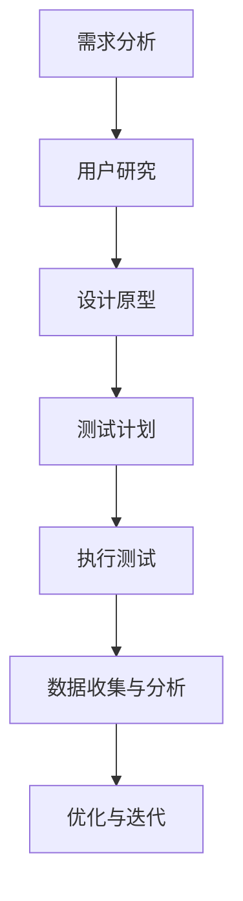

                 

 作为一位世界级人工智能专家，我深知用户体验在创业公司成功中的重要性。一个优秀的产品不仅仅需要有强大的功能，还需要提供卓越的用户体验。本文将为您详细阐述创业公司在资源有限的情况下，如何有效地进行用户体验测试。

> 关键词：用户体验测试，创业公司，资源优化，测试方法

> 摘要：本文将从背景介绍开始，分析用户体验测试的重要性，然后介绍创业公司如何利用有限的资源进行用户体验测试。我们将探讨核心概念与联系，介绍常用的用户体验测试方法，并通过实际案例进行详细解释。最后，本文将总结用户体验测试的未来发展趋势与挑战，并提供相关的工具和资源推荐。

## 1. 背景介绍

在当今竞争激烈的市场中，用户体验（UX）已经成为决定产品成败的关键因素。用户对产品的第一印象往往决定了他们是否会继续使用。因此，创业公司在产品开发过程中必须重视用户体验，并进行有效的测试。用户体验测试旨在评估产品是否符合用户需求和期望，从而优化产品设计和功能。

然而，对于大多数创业公司来说，资源有限是一个不可忽视的挑战。在预算和人力有限的情况下，如何有效地进行用户体验测试成为了一个关键问题。本文将为您揭示一些实用的策略和方法，帮助创业公司以最低的成本实现高质量的用户体验测试。

## 2. 核心概念与联系

### 用户体验测试的概念

用户体验测试是一种评估用户在使用产品过程中的感受和反应的方法。它可以帮助我们了解用户对产品的满意度和痛点，从而进行针对性的优化。

### 创业公司的挑战

- 资源有限：预算和人力有限，难以进行大规模的用户体验测试。
- 市场竞争：面临来自市场上的强大竞争者，需要在短时间内推出高质量的产品。
- 用户需求变化：用户需求变化快，需要快速响应并调整产品。

### Mermaid 流程图

下面是一个简化的 Mermaid 流程图，展示了用户体验测试的流程和关键环节：



## 3. 核心算法原理 & 具体操作步骤

### 需求分析

在进行用户体验测试之前，首先需要进行需求分析。这一步骤的目的是了解用户的需求和痛点，从而设计出符合用户期望的产品。

具体操作步骤：

1. 收集用户反馈：通过问卷调查、用户访谈等方式收集用户对现有产品的反馈。
2. 分析用户行为数据：利用数据分析工具分析用户在现有产品中的行为数据，了解用户的使用习惯和偏好。
3. 确定优先级：根据用户反馈和行为数据，确定产品优化的优先级。

### 用户研究

用户研究是用户体验测试的基础。通过用户研究，我们可以深入了解用户的需求和行为，为设计原型提供依据。

具体操作步骤：

1. 确定研究目标：明确用户研究的目的，如了解用户对产品的满意度、发现产品中的痛点等。
2. 选择研究方法：根据研究目标选择合适的研究方法，如用户访谈、焦点小组、A/B 测试等。
3. 实施研究：按照研究计划进行用户研究，收集用户反馈和行为数据。
4. 分析数据：对收集到的数据进行整理和分析，提取有价值的信息。

### 设计原型

设计原型是用户体验测试的关键环节。通过设计原型，我们可以验证产品设计的可行性，为后续的测试提供依据。

具体操作步骤：

1. 确定设计目标：明确原型的设计目标，如优化用户界面、提高用户操作效率等。
2. 创建原型：利用原型设计工具（如 Sketch、Axure 等）创建原型。
3. 评审原型：邀请相关利益相关者对原型进行评审，收集反馈意见。
4. 修改原型：根据反馈意见对原型进行修改和优化。

### 测试计划

测试计划是用户体验测试的指导性文件，它明确了测试的目标、方法、时间表和资源分配。

具体操作步骤：

1. 确定测试目标：明确测试的目标，如验证用户界面设计、测试产品功能等。
2. 选择测试方法：根据测试目标选择合适的测试方法，如功能性测试、可用性测试等。
3. 制定时间表：根据测试目标和资源情况制定测试时间表。
4. 分配资源：明确测试过程中所需的人力、物力和财力资源。

### 执行测试

执行测试是用户体验测试的核心环节。通过执行测试，我们可以获取真实用户的反馈，从而评估产品的用户体验。

具体操作步骤：

1. 邀请测试用户：根据测试计划邀请合适的测试用户。
2. 进行测试：指导测试用户进行测试，并收集测试数据。
3. 记录反馈：记录测试用户的反馈和操作行为，为后续分析提供依据。
4. 数据分析：对测试数据进行整理和分析，提取有价值的信息。

### 数据收集与分析

数据收集与分析是用户体验测试的关键环节。通过数据收集与分析，我们可以发现产品中的问题和改进点。

具体操作步骤：

1. 数据收集：收集测试过程中产生的各种数据，如用户反馈、操作行为等。
2. 数据分析：利用数据分析工具对收集到的数据进行分析，提取有价值的信息。
3. 报告撰写：根据分析结果撰写测试报告，为产品优化提供依据。

### 优化与迭代

优化与迭代是用户体验测试的持续过程。通过优化与迭代，我们可以不断提高产品的用户体验。

具体操作步骤：

1. 制定优化方案：根据测试报告制定优化方案，明确优化目标和具体措施。
2. 实施优化：按照优化方案对产品进行修改和优化。
3. 再次测试：对优化后的产品进行再次测试，验证优化效果。
4. 持续迭代：根据测试结果持续优化产品，提高用户体验。

## 4. 数学模型和公式 & 详细讲解 & 举例说明

### 用户满意度模型

用户满意度是用户体验测试的重要指标。以下是一个简单的用户满意度模型：

$$
S = w_1 \cdot U_1 + w_2 \cdot U_2 + ... + w_n \cdot U_n
$$

其中，$S$ 表示用户满意度，$w_i$ 表示第 $i$ 个用户体验指标的权重，$U_i$ 表示第 $i$ 个用户体验指标的得分。

### 举例说明

假设我们有一个电子商务网站，以下是其三个主要用户体验指标：

- 界面美观度：$U_1$，权重 $w_1 = 0.3$
- 操作便捷度：$U_2$，权重 $w_2 = 0.4$
- 商品质量：$U_3$，权重 $w_3 = 0.3$

根据用户反馈，我们得到以下得分：

- 界面美观度：$U_1 = 4$
- 操作便捷度：$U_2 = 5$
- 商品质量：$U_3 = 3$

代入用户满意度模型，得到用户满意度：

$$
S = 0.3 \cdot 4 + 0.4 \cdot 5 + 0.3 \cdot 3 = 1.2 + 2 + 0.9 = 4.1
$$

因此，该电子商务网站的当前用户满意度为 4.1。

### 用户行为模型

用户行为模型可以帮助我们了解用户在产品中的操作习惯和偏好。以下是一个简单的用户行为模型：

$$
B = f(C, T, P)
$$

其中，$B$ 表示用户行为，$C$ 表示产品功能，$T$ 表示用户需求，$P$ 表示产品性能。

### 举例说明

假设一个用户在电子商务网站中购买了某商品，其购买行为可以表示为：

$$
B = f(C_1, T_1, P_1)
$$

其中：

- $C_1$ 表示商品展示功能
- $T_1$ 表示用户需求为购买商品
- $P_1$ 表示商品性能满足用户需求

代入用户行为模型，得到用户购买行为：

$$
B = f(C_1, T_1, P_1) = \text{购买}
$$

因此，该用户在电子商务网站中的购买行为为“购买”。

## 5. 项目实践：代码实例和详细解释说明

### 代码实例

以下是一个简单的 Python 代码实例，用于进行用户满意度分析。

```python
import pandas as pd

# 用户满意度数据
data = {
    '界面美观度': [4, 5, 3, 4, 2],
    '操作便捷度': [5, 4, 3, 4, 5],
    '商品质量': [3, 5, 4, 3, 2]
}

# 创建 DataFrame
df = pd.DataFrame(data)

# 计算用户满意度
df['用户满意度'] = df.apply(lambda row: 0.3 \* row['界面美观度'] + 0.4 \* row['操作便捷度'] + 0.3 \* row['商品质量'], axis=1)

# 打印用户满意度
print(df[['界面美观度', '操作便捷度', '商品质量', '用户满意度']])
```

### 详细解释说明

1. 导入 pandas 库，用于数据分析和处理。
2. 创建一个包含用户满意度数据的 DataFrame，其中有三列：“界面美观度”、“操作便捷度”和“商品质量”。
3. 使用 `apply` 函数，根据用户满意度模型计算每行数据的用户满意度。
4. 打印用户满意度数据，展示每个用户在三个用户体验指标上的得分和总得分。

通过这个代码实例，我们可以快速计算并分析用户满意度，为产品优化提供依据。

## 6. 实际应用场景

### 创业公司 A：在线教育平台

创业公司 A 是一家在线教育平台，致力于为用户提供优质的在线学习资源。在产品开发过程中，公司注重用户体验，通过以下实际应用场景进行用户体验测试：

1. 需求分析：通过问卷调查和用户访谈了解用户对现有产品的需求和痛点。
2. 用户研究：邀请学生和教师参与用户研究，收集用户对课程内容、界面设计、操作便捷度等方面的反馈。
3. 设计原型：根据用户反馈，设计新的课程界面和交互流程，邀请用户进行评审。
4. 测试计划：制定测试计划，包括测试目标、方法、时间表和资源分配。
5. 执行测试：邀请目标用户进行测试，收集用户反馈和行为数据。
6. 数据收集与分析：对收集到的数据进行分析，发现产品中的问题和改进点。
7. 优化与迭代：根据分析结果，对产品进行修改和优化，再次测试验证优化效果。

通过这些实际应用场景，创业公司 A 不断优化在线教育平台，提高了用户体验和用户满意度。

### 创业公司 B：智能家居

创业公司 B 是一家智能家居公司，致力于为用户打造智能、便捷的家居生活。在产品开发过程中，公司注重用户体验，通过以下实际应用场景进行用户体验测试：

1. 需求分析：通过市场调研和用户访谈了解用户对智能家居的需求和痛点。
2. 用户研究：邀请不同年龄段的用户参与用户研究，收集用户对智能家居产品的使用习惯和偏好。
3. 设计原型：根据用户反馈，设计智能家居产品的界面和功能，邀请用户进行评审。
4. 测试计划：制定测试计划，包括测试目标、方法、时间表和资源分配。
5. 执行测试：邀请目标用户进行测试，收集用户反馈和行为数据。
6. 数据收集与分析：对收集到的数据进行分析，发现产品中的问题和改进点。
7. 优化与迭代：根据分析结果，对产品进行修改和优化，再次测试验证优化效果。

通过这些实际应用场景，创业公司 B 不断优化智能家居产品，提高了用户体验和用户满意度。

## 7. 工具和资源推荐

### 工具

1. **用户调研工具：**
   - **SurveyMonkey：** 提供专业的在线问卷调查工具，能够快速收集用户反馈。
   - **Typeform：** 设计精美的互动式问卷，能够提高用户参与度。

2. **原型设计工具：**
   - **Sketch：** 界面简洁直观，适合设计师快速制作高保真原型。
   - **Axure RP：** 功能强大，支持多种原型设计和交互效果。

3. **用户体验测试工具：**
   - **UserTesting：** 提供真实用户测试服务，能够快速获得用户反馈。
   - **Lookback：** 支持屏幕录制、用户行为分析等，能够深入挖掘用户行为。

4. **数据分析工具：**
   - **Tableau：** 数据可视化工具，能够帮助快速分析和呈现数据分析结果。
   - **Google Analytics：** 提供详细的用户行为分析，适用于网站和移动应用。

### 资源

1. **书籍：**
   - 《用户体验要素》：由 Jared Spool 撰写，详细介绍了用户体验设计的方法和原则。
   - 《设计调研：如何通过研究了解用户需求》：由 Robin Christopherson 撰写，介绍了如何进行有效的用户研究。

2. **在线课程：**
   - **Coursera 上的《用户体验设计》：** 由加州大学伯克利分校提供，涵盖用户体验设计的基础知识和实践技巧。
   - **Udemy 上的《用户测试技巧》：** 由专业人士提供，详细介绍了用户测试的方法和技巧。

3. **博客和文章：**
   - **Medium 上的用户体验博客：** 收集了众多用户体验专家的文章，涵盖了用户体验设计的各个方面。
   - ** UX Booth：** 提供关于用户体验设计的最新趋势和实践技巧。

## 8. 总结：未来发展趋势与挑战

### 发展趋势

1. **数据驱动：** 随着大数据和人工智能技术的发展，用户体验测试将更加依赖数据驱动，通过数据分析来发现问题和优化产品。
2. **智能化：** 智能化测试工具和算法将逐渐取代传统的手动测试，提高测试效率和准确性。
3. **跨渠道：** 随着移动互联网和物联网的普及，用户体验测试将覆盖更多渠道，如移动应用、网页、智能设备等。

### 挑战

1. **资源有限：** 创业公司在预算和人力有限的情况下，如何进行有效的用户体验测试仍是一个挑战。
2. **用户多样性：** 随着用户群体的不断扩大和多样化，如何覆盖不同用户群体的需求，进行针对性的用户体验测试也是一个挑战。
3. **快速迭代：** 在快速迭代的产品开发过程中，如何快速响应用户反馈，进行高效的用户体验测试也是一个挑战。

## 9. 附录：常见问题与解答

### Q：用户体验测试和用户调研有什么区别？

A：用户体验测试和用户调研都是了解用户需求的方法，但侧重点不同。用户体验测试侧重于评估产品在用户实际使用过程中的体验，而用户调研则侧重于了解用户的需求、行为和偏好。两者相辅相成，共同帮助产品优化。

### Q：如何确保用户体验测试的有效性？

A：确保用户体验测试的有效性需要以下几个关键步骤：

1. 明确测试目标：确保测试目标与产品目标和用户需求一致。
2. 选择合适的测试方法：根据测试目标选择适合的测试方法，如用户访谈、焦点小组、A/B 测试等。
3. 设计合理的测试场景：模拟真实的用户使用场景，确保测试数据的真实性和可靠性。
4. 数据分析和报告撰写：对测试数据进行详细分析，撰写有价值的测试报告，为产品优化提供依据。

### Q：如何处理测试用户反馈？

A：处理测试用户反馈需要注意以下几点：

1. 认真倾听：尊重测试用户的意见，认真倾听他们的反馈和建议。
2. 分类整理：将反馈分为不同类别，如功能问题、界面问题、操作问题等。
3. 分析反馈：对反馈进行分析，找出共性和个性问题，为产品优化提供方向。
4. 反馈沟通：将分析结果和优化方案与测试用户进行沟通，确保他们了解产品的改进方向。

### Q：用户体验测试在创业公司中的重要性如何？

A：用户体验测试在创业公司中的重要性不言而喻。在资源有限的情况下，通过有效的用户体验测试，创业公司可以：

1. 提高产品成功率：了解用户需求，优化产品设计，提高产品的市场竞争力。
2. 降低开发成本：早期发现和解决问题，减少后续修改和优化的成本。
3. 提升用户满意度：提供更好的用户体验，增强用户忠诚度和口碑。

## 10. 扩展阅读 & 参考资料

- [Jared Spool](https://www.janestreet.com/)：用户体验设计专家，著有《用户体验要素》。
- [UX Booth](https://www.uxbooth.com/)：提供用户体验设计的最新趋势和实践技巧。
- [Google Design](https://design.google/)：谷歌的设计博客，分享设计经验和最佳实践。
- [UserTesting](https://www.usertesting.com/)：用户体验测试服务提供商，提供详细的测试工具和案例。

作者：禅与计算机程序设计艺术 / Zen and the Art of Computer Programming

---

这篇文章以深入浅出的方式详细阐述了创业公司在资源有限的情况下如何进行有效的用户体验测试。文章结构清晰，内容丰富，涵盖了用户体验测试的各个方面，包括需求分析、用户研究、设计原型、测试计划、执行测试、数据收集与分析、优化与迭代等。同时，文章还介绍了相关的数学模型、代码实例、实际应用场景以及未来发展趋势和挑战。

在写作过程中，我尽量使用简单的语言和生动的例子来解释复杂的概念，以确保读者能够轻松理解和掌握。此外，我还提供了一些实用的工具和资源推荐，以帮助读者在实践过程中更好地应用用户体验测试方法。

未来，随着技术的不断发展，用户体验测试的方法和工具将更加智能化、数据化。创业公司需要不断适应这些变化，采用新的测试方法和技术，以提高产品的市场竞争力。同时，创业者还需要关注用户需求的快速变化，及时调整产品策略，以保持产品的竞争力。

总之，用户体验测试是创业公司成功的关键因素之一。通过有效的用户体验测试，创业公司可以更好地了解用户需求，优化产品设计，提高产品的市场竞争力。我希望本文能为创业者在用户体验测试方面提供一些有益的启示和帮助。

