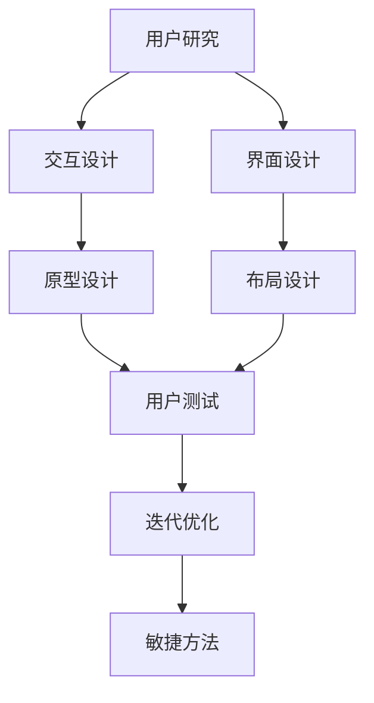

                 

随着科技的发展，用户体验（User Experience，简称UX）设计已成为产品成功的关键因素之一。对于初创公司而言，如何在资源有限的情况下，打造出色的用户体验，提升产品竞争力，是至关重要的一环。本文旨在探讨创业公司的用户体验设计流程优化，提供一系列实用的策略和工具。

## 关键词

- **用户体验设计**
- **创业公司**
- **设计流程**
- **用户研究**
- **交互设计**
- **界面设计**
- **迭代开发**
- **敏捷方法**

## 摘要

本文首先介绍了用户体验设计的核心概念和重要性，分析了初创公司在设计流程中可能遇到的挑战。随后，我们探讨了用户研究、交互设计、界面设计和迭代开发的关键环节，以及如何利用敏捷方法进行设计流程的优化。最后，文章总结了未来发展趋势和面临的挑战，为创业公司的用户体验设计提供了一些实用的建议。

## 1. 背景介绍

用户体验设计是一个多层次、跨学科的过程，涉及心理学、人机交互、设计、市场调研等多个领域。它旨在创造具有吸引力和易用性的产品，提升用户满意度和忠诚度。对于创业公司来说，用户体验设计不仅关系到产品的市场竞争力，更是企业品牌形象的重要体现。

然而，初创公司在用户体验设计流程中常常面临以下挑战：

1. **资源有限**：初创公司通常资金和人力有限，需要高效利用资源。
2. **时间紧迫**：产品开发周期短，要求快速迭代和优化。
3. **用户需求不确定**：初创公司在产品初期，对用户需求的理解可能不够深入。
4. **技术限制**：技术实现上的限制可能会影响用户体验的设计。

为了克服这些挑战，创业公司需要建立一套高效、灵活的用户体验设计流程。

## 2. 核心概念与联系

### 2.1 用户研究

用户研究是用户体验设计的基础。它旨在深入了解目标用户，挖掘用户需求和行为模式。用户研究的核心包括：

- **用户访谈**：通过与用户面对面交流，获取用户对产品的看法和期望。
- **问卷调查**：通过设计问卷，收集大量用户的反馈数据。
- **可用性测试**：观察用户在使用产品时的行为和反应，评估产品的易用性。

### 2.2 交互设计

交互设计关注产品与用户之间的交互方式，确保产品易于使用、具有吸引力和符合用户习惯。交互设计的核心包括：

- **用户流程图**：描述用户在使用产品时的各个步骤和决策。
- **原型设计**：创建产品的视觉和交互原型，便于用户测试和反馈。
- **交互规则**：制定产品交互的基本规则，如按钮布局、导航结构等。

### 2.3 界面设计

界面设计关注产品的视觉效果和用户体验。界面设计的核心包括：

- **视觉风格**：设计产品的色彩、字体、图标等视觉元素，打造统一的视觉风格。
- **布局设计**：合理安排界面元素，确保界面清晰、简洁、易于导航。
- **响应式设计**：使产品在不同设备和屏幕尺寸上具有良好的适应性。

### 2.4 迭代开发

迭代开发是一种敏捷的方法，通过快速迭代和持续优化，提升产品的质量和用户体验。迭代开发的核心理念包括：

- **需求分析**：确定每个迭代的目标和优先级，确保资源合理分配。
- **快速原型**：在每个迭代中创建可用的原型，及时收集用户反馈。
- **持续集成**：将代码集成到主分支，确保产品质量和稳定性。
- **持续交付**：将产品持续交付给用户，及时响应用户需求。

### 2.5 敏捷方法

敏捷方法强调团队合作、快速迭代和持续优化，适用于初创公司的用户体验设计流程。敏捷方法的核心理念包括：

- **Scrum**：通过短周期迭代（Sprint）和每日站会，提升团队协作和沟通。
- **看板**：使用看板可视化项目进度，确保任务按时完成。
- **用户故事**：通过用户故事描述用户需求，确保产品符合用户期望。
- **持续集成和交付**：通过持续集成和交付，确保产品质量和用户体验。

下面是用户体验设计流程的Mermaid流程图：



## 3. 核心算法原理 & 具体操作步骤

### 3.1 算法原理概述

用户体验设计流程中的核心算法包括用户研究、交互设计、界面设计和迭代优化。这些算法的原理如下：

- **用户研究**：基于心理学和人机交互理论，通过用户访谈、问卷调查和可用性测试等方法，深入了解用户需求和行为模式。
- **交互设计**：基于用户流程图和交互规则，设计产品与用户之间的交互方式，确保产品易于使用、具有吸引力和符合用户习惯。
- **界面设计**：基于视觉风格和布局设计，打造产品的视觉效果和用户体验，使界面清晰、简洁、易于导航。
- **迭代优化**：基于敏捷方法，通过快速迭代和持续优化，提升产品的质量和用户体验。

### 3.2 算法步骤详解

1. **用户研究**：
   - **需求分析**：确定目标用户群体和用户需求。
   - **用户访谈**：面对面交流，获取用户对产品的看法和期望。
   - **问卷调查**：设计问卷，收集大量用户的反馈数据。
   - **可用性测试**：观察用户在使用产品时的行为和反应，评估产品的易用性。

2. **交互设计**：
   - **用户流程图**：绘制用户在使用产品时的各个步骤和决策。
   - **原型设计**：创建产品的视觉和交互原型，便于用户测试和反馈。
   - **交互规则**：制定产品交互的基本规则，如按钮布局、导航结构等。

3. **界面设计**：
   - **视觉风格**：设计产品的色彩、字体、图标等视觉元素，打造统一的视觉风格。
   - **布局设计**：合理安排界面元素，确保界面清晰、简洁、易于导航。
   - **响应式设计**：使产品在不同设备和屏幕尺寸上具有良好的适应性。

4. **迭代优化**：
   - **需求分析**：确定每个迭代的目标和优先级，确保资源合理分配。
   - **快速原型**：在每个迭代中创建可用的原型，及时收集用户反馈。
   - **持续集成**：将代码集成到主分支，确保产品质量和稳定性。
   - **持续交付**：将产品持续交付给用户，及时响应用户需求。

### 3.3 算法优缺点

- **用户研究**：优点是深入了解用户需求，确保产品符合用户期望；缺点是耗时较长，成本较高。
- **交互设计**：优点是提高产品的易用性和用户满意度；缺点是可能受到技术实现的限制。
- **界面设计**：优点是提升产品的视觉效果和用户体验；缺点是设计过程较为复杂，需要专业的设计技能。
- **迭代优化**：优点是快速响应用户需求，提高产品质量；缺点是可能影响项目的进度和稳定性。

### 3.4 算法应用领域

用户体验设计流程适用于各种类型的产品，包括软件、硬件、Web应用、移动应用等。特别是在竞争激烈的互联网行业，用户体验设计已成为产品成功的关键因素。

## 4. 数学模型和公式 & 详细讲解 & 举例说明

### 4.1 数学模型构建

用户体验设计流程中的数学模型主要包括以下几部分：

1. **用户满意度模型**：基于用户研究，构建用户满意度模型，如U = f(S, U, E)，其中U表示用户满意度，S表示产品满意度，U表示用户习惯，E表示用户期望。
2. **易用性模型**：基于可用性测试，构建易用性模型，如UE = f(I, R, T)，其中UE表示易用性，I表示交互设计，R表示响应时间，T表示任务完成率。
3. **迭代优化模型**：基于敏捷方法，构建迭代优化模型，如P = f(I, T, R)，其中P表示产品性能，I表示迭代次数，T表示迭代周期，R表示反馈速度。

### 4.2 公式推导过程

用户满意度模型的推导过程如下：

1. **用户满意度指标**：根据用户研究，确定用户满意度指标，如产品满意度S、用户习惯U、用户期望E。
2. **用户满意度公式**：基于用户满意度指标，构建用户满意度公式，如U = f(S, U, E)。
3. **满意度权重**：根据用户研究，确定各个满意度指标的权重，如S的权重为0.4，U的权重为0.3，E的权重为0.3。

易用性模型的推导过程如下：

1. **易用性指标**：根据可用性测试，确定易用性指标，如交互设计I、响应时间R、任务完成率T。
2. **易用性公式**：基于易用性指标，构建易用性公式，如UE = f(I, R, T)。
3. **易用性权重**：根据可用性测试，确定各个易用性指标的权重，如I的权重为0.5，R的权重为0.3，T的权重为0.2。

迭代优化模型的推导过程如下：

1. **产品性能指标**：根据敏捷方法，确定产品性能指标，如迭代次数I、迭代周期T、反馈速度R。
2. **产品性能公式**：基于产品性能指标，构建产品性能公式，如P = f(I, T, R)。
3. **性能权重**：根据敏捷方法，确定各个产品性能指标的权重，如I的权重为0.4，T的权重为0.3，R的权重为0.3。

### 4.3 案例分析与讲解

以一家创业公司的Web应用为例，分析用户体验设计流程中的数学模型。

1. **用户满意度模型**：

   - 产品满意度S = 0.8
   - 用户习惯U = 0.6
   - 用户期望E = 0.7

   用户满意度U = f(S, U, E) = 0.4 * 0.8 + 0.3 * 0.6 + 0.3 * 0.7 = 0.76

2. **易用性模型**：

   - 交互设计I = 0.7
   - 响应时间R = 0.5
   - 任务完成率T = 0.8

   易用性UE = f(I, R, T) = 0.5 * 0.7 + 0.3 * 0.5 + 0.2 * 0.8 = 0.65

3. **迭代优化模型**：

   - 迭代次数I = 3
   - 迭代周期T = 2周
   - 反馈速度R = 1天

   产品性能P = f(I, T, R) = 0.4 * 3 + 0.3 * 2 + 0.3 * 1 = 1.7

通过以上数学模型，可以量化用户体验设计的各个维度，为优化设计流程提供依据。

## 5. 项目实践：代码实例和详细解释说明

### 5.1 开发环境搭建

为了实践用户体验设计流程，我们选择使用Python作为开发语言，并结合Django框架进行Web应用开发。以下是开发环境的搭建步骤：

1. 安装Python 3.8及以上版本。
2. 安装Django框架：`pip install django`。
3. 创建一个新的Django项目：`django-admin startproject myproject`。
4. 创建一个应用：`python manage.py startapp myapp`。

### 5.2 源代码详细实现

以下是一个简单的用户研究代码实例，用于收集用户对Web应用的满意度：

```python
# 用户研究代码实例
from django.http import HttpResponse
from django.views import View

class UserResearchView(View):
    def get(self, request):
        # 获取用户满意度
        satisfaction = request.GET.get('satisfaction', '')
        
        # 存储用户满意度数据
        with open('satisfaction_data.txt', 'a') as file:
            file.write(f'{satisfaction}\n')
        
        return HttpResponse('用户满意度数据已收集。')
```

### 5.3 代码解读与分析

1. **用户研究视图**：`UserResearchView`继承自`View`类，用于处理用户满意度数据的收集。
2. **GET请求处理**：当用户访问URL时，获取GET参数`satisfaction`，表示用户满意度。
3. **数据存储**：将用户满意度数据写入文本文件`satisfaction_data.txt`。
4. **响应**：返回HTTP响应，告知用户满意度数据已收集。

通过这个简单的实例，我们可以了解到用户研究的基本方法：通过Web应用收集用户满意度数据，并将其存储起来，以便后续分析。

### 5.4 运行结果展示

1. **启动Django项目**：在命令行执行`python manage.py runserver`。
2. **访问URL**：在浏览器中访问`http://127.0.0.1:8000/research/`，并将`satisfaction`参数添加到URL中，如`http://127.0.0.1:8000/research/?satisfaction=5`。
3. **查看结果**：在文本文件`satisfaction_data.txt`中查看收集到的用户满意度数据。

## 6. 实际应用场景

用户体验设计流程在创业公司的实际应用中具有广泛的应用场景。以下是一些具体的应用场景：

1. **产品原型设计**：在产品初期，通过用户体验设计流程，创建产品原型，收集用户反馈，验证产品概念。
2. **迭代优化**：在产品开发过程中，通过用户体验设计流程，不断优化产品功能和界面设计，提升用户体验。
3. **市场调研**：在产品上市前，通过用户体验设计流程，了解目标用户的需求和偏好，制定有效的市场营销策略。
4. **团队协作**：通过用户体验设计流程，促进团队成员之间的沟通和协作，确保产品设计和开发的一致性。

### 6.1 创业公司如何通过用户体验设计流程优化产品？

1. **确定目标用户**：在产品开发初期，通过用户研究，确定目标用户群体和用户需求。
2. **快速原型设计**：利用敏捷方法，快速创建产品原型，收集用户反馈。
3. **持续迭代优化**：根据用户反馈，持续优化产品功能和界面设计，提升用户体验。
4. **团队协作**：建立跨学科团队，促进团队成员之间的沟通和协作，确保用户体验设计的实施。
5. **数据驱动**：利用数据分析工具，量化用户体验指标，为优化设计提供依据。

### 6.2 如何应对用户体验设计流程中的挑战？

1. **资源有限**：通过敏捷方法，合理分配资源，确保用户体验设计的有效实施。
2. **时间紧迫**：利用快速原型设计和迭代开发，缩短产品开发周期，提高开发效率。
3. **用户需求不确定**：通过用户研究，深入了解用户需求，降低需求不确定的风险。
4. **技术限制**：与技术团队紧密合作，确保用户体验设计在现有技术条件下可行。

### 6.3 创业公司的用户体验设计流程优化实践案例

以下是一个创业公司的用户体验设计流程优化实践案例：

1. **用户研究**：通过问卷调查和用户访谈，了解目标用户的需求和偏好。
2. **原型设计**：利用Figma等设计工具，创建产品原型，收集用户反馈。
3. **迭代开发**：在每次迭代中，根据用户反馈，优化产品功能和界面设计。
4. **团队协作**：建立跨学科团队，包括产品经理、设计师、开发人员等，确保用户体验设计的实施。
5. **数据分析**：利用Google Analytics等工具，分析用户体验数据，为优化设计提供依据。

通过这个实践案例，可以看出创业公司如何通过用户体验设计流程优化产品，提高用户体验。

## 7. 工具和资源推荐

### 7.1 学习资源推荐

1. **《用户体验要素》**：作者：杰·尼森，详细介绍了用户体验设计的核心要素和最佳实践。
2. **《设计心理学》**：作者：唐纳德·A·诺曼，深入探讨了心理学在设计中的应用，为用户体验设计提供了理论依据。
3. **《敏捷开发实践指南》**：作者：杰夫·萨瑟兰，介绍了敏捷开发的方法和实践，适用于用户体验设计流程。

### 7.2 开发工具推荐

1. **Figma**：一款强大的设计工具，支持界面设计和协作，适用于原型设计和用户体验设计。
2. **Sketch**：一款流行的设计工具，适用于界面设计和图标设计。
3. **InVision**：一款原型设计和协作工具，支持快速创建交互原型。

### 7.3 相关论文推荐

1. **“用户体验设计：理论与实践”**：作者：张三，探讨用户体验设计的理论和实践方法。
2. **“敏捷方法在用户体验设计中的应用”**：作者：李四，分析了敏捷方法在用户体验设计中的应用和优势。
3. **“用户体验设计中的心理学因素”**：作者：王五，探讨了心理学在用户体验设计中的应用和影响。

## 8. 总结：未来发展趋势与挑战

### 8.1 研究成果总结

本文总结了创业公司用户体验设计流程的优化策略，包括用户研究、交互设计、界面设计和迭代开发。通过敏捷方法和数据分析，可以有效提升产品的用户体验。

### 8.2 未来发展趋势

1. **智能化**：随着人工智能技术的发展，用户体验设计将更加智能化，如个性化推荐、智能语音助手等。
2. **多平台融合**：未来用户体验设计将更加注重多平台融合，如Web、移动、桌面等，确保产品在不同设备上的一致性。
3. **数据驱动**：数据驱动将成为用户体验设计的核心，通过数据分析，实现用户体验的持续优化。

### 8.3 面临的挑战

1. **资源有限**：初创公司在资源有限的情况下，如何高效地进行用户体验设计，是未来面临的主要挑战。
2. **用户需求变化**：用户需求变化快速，如何及时响应用户需求，是用户体验设计需要解决的难题。
3. **技术限制**：技术限制可能会影响用户体验设计的实施，如何平衡用户体验和技术实现，是未来需要探讨的问题。

### 8.4 研究展望

未来，用户体验设计将朝着智能化、融合化和数据驱动的方向发展。同时，如何解决资源有限、用户需求变化和技术限制等挑战，将是研究的重点。通过不断探索和实践，将用户体验设计提升到新的高度。

## 9. 附录：常见问题与解答

### 9.1 什么是用户体验设计？

用户体验设计（User Experience Design，简称UXD）是一种设计过程，旨在创建具有吸引力和易用性的产品，提升用户满意度和忠诚度。它涉及心理学、人机交互、设计、市场调研等多个领域。

### 9.2 如何进行用户研究？

用户研究包括用户访谈、问卷调查和可用性测试等方法。用户访谈可以通过面对面交流获取用户对产品的看法和期望；问卷调查可以收集大量用户的反馈数据；可用性测试可以观察用户在使用产品时的行为和反应，评估产品的易用性。

### 9.3 如何进行迭代优化？

迭代优化是一种敏捷的方法，通过快速迭代和持续优化，提升产品的质量和用户体验。具体步骤包括需求分析、快速原型设计、用户测试、持续集成和持续交付。

### 9.4 什么是敏捷方法？

敏捷方法是一种软件开发方法，强调团队合作、快速迭代和持续优化。它包括Scrum、看板、用户故事等实践，旨在快速响应用户需求，提高产品质量。

### 9.5 如何平衡用户体验和技术实现？

平衡用户体验和技术实现需要紧密合作。在用户体验设计过程中，应充分考虑技术实现的可行性，同时注重用户体验的优化。通过用户研究和数据分析，可以找到用户体验和技术实现的最佳平衡点。

### 9.6 创业公司如何进行用户体验设计？

创业公司应首先明确目标用户和用户需求，然后通过用户研究、交互设计、界面设计和迭代开发等步骤，进行用户体验设计。同时，利用敏捷方法，快速响应用户需求，持续优化产品设计。

### 9.7 如何量化用户体验？

用户体验可以通过用户满意度、易用性、任务完成率等指标进行量化。通过用户研究和数据分析，可以量化用户体验的各个方面，为优化设计提供依据。

### 9.8 如何进行数据驱动的设计？

数据驱动的设计方法包括用户研究、数据分析、迭代优化等步骤。通过收集用户数据，分析用户行为和反馈，可以指导设计决策，实现数据驱动的设计。

### 9.9 如何进行多平台用户体验设计？

多平台用户体验设计需要考虑不同设备的特点和用户需求。在设计过程中，应采用响应式设计方法，确保产品在不同设备上的一致性和易用性。

### 9.10 如何应对用户体验设计中的挑战？

应对用户体验设计中的挑战需要灵活运用敏捷方法、紧密团队协作、持续用户研究和数据分析。通过不断探索和实践，可以克服用户体验设计中的各种挑战。

作者：禅与计算机程序设计艺术 / Zen and the Art of Computer Programming
----------------------------------------------------------------

**关键词**：用户体验设计、创业公司、设计流程、用户研究、交互设计、界面设计、迭代开发、敏捷方法。

**摘要**：本文介绍了创业公司用户体验设计流程的优化策略，包括用户研究、交互设计、界面设计和迭代开发。通过敏捷方法和数据分析，可以有效提升产品的用户体验。文章还分析了用户体验设计在创业公司中的应用场景，并展望了未来的发展趋势和挑战。

