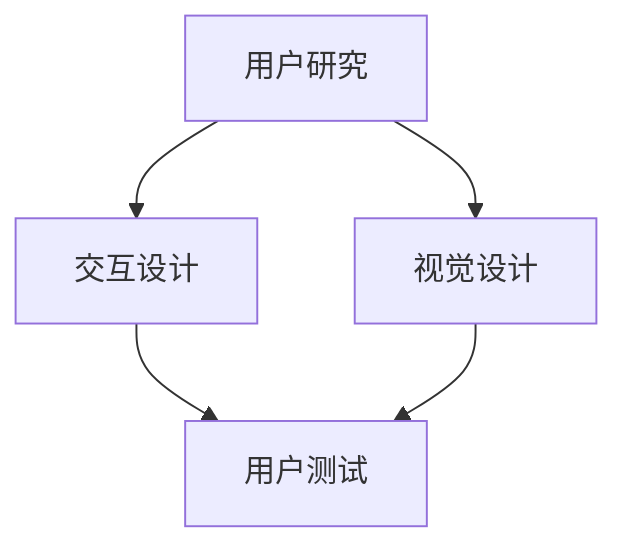
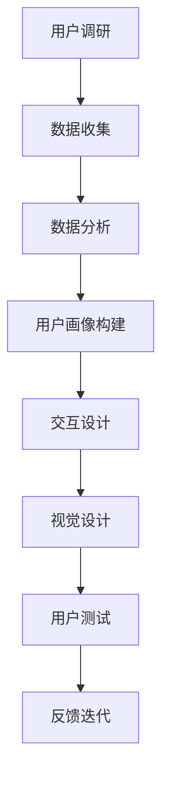

                 

### 1. 背景介绍

在当今竞争激烈的市场环境中，创业公司要想脱颖而出，用户体验（UX）设计成为其成功的关键因素之一。用户体验设计不仅仅关注产品的功能，更注重用户在使用产品过程中的感受和互动体验。一个优秀的用户体验设计能够增强用户满意度，提高用户忠诚度，进而推动产品的市场竞争力。

随着科技的发展，用户对产品的期望值也在不断提升。他们期望产品能够提供直观、便捷、个性化的使用体验。在这种情况下，创业公司若想成功，就必须投入大量资源进行用户体验设计，以创造具有吸引力的产品。

本文旨在探讨创业公司在进行用户体验设计时的策略和方法。我们将详细分析用户体验设计中的核心概念、算法原理、数学模型，并通过实际项目实践展示如何将理论应用到实践中。此外，我们还将讨论用户体验设计在实际应用场景中的重要性，推荐相关的学习资源和开发工具，并总结未来发展趋势与挑战。

在接下来的章节中，我们将一步一步地探讨如何进行有效的用户体验设计，帮助创业公司在激烈的市场竞争中站稳脚跟。让我们开始这场深入的技术探讨之旅。

### 2. 核心概念与联系

用户体验设计的核心概念包括用户研究、交互设计、视觉设计、用户测试等。以下是一个使用 Mermaid 流程图来表示这些核心概念之间的联系：



**用户研究**：用户研究是用户体验设计的起点。通过用户调研、访谈、问卷等手段，了解目标用户的需求、行为和偏好，为后续的设计工作提供依据。

**交互设计**：交互设计关注产品的使用流程和交互方式，确保用户能够直观、便捷地完成操作。交互设计包括信息架构、导航设计、操作流程设计等。

**视觉设计**：视觉设计则关注产品的外观和视觉元素，通过色彩、字体、图标等视觉手段提升产品的美感，增强用户体验。

**用户测试**：用户测试是验证设计效果的重要环节。通过实际用户的使用反馈，发现设计中的问题并进行迭代优化。

这些核心概念相互关联，共同作用，确保用户体验设计能够满足用户需求，提升产品竞争力。

首先，用户研究为交互设计和视觉设计提供了基础数据。通过深入了解用户需求和行为，设计师可以更好地进行交互设计和视觉设计，使其更加符合用户期望。

交互设计是用户体验设计的核心，决定了用户与产品之间的互动方式。优秀的交互设计能够提升用户的操作效率和满意度，从而影响整体用户体验。

视觉设计则通过视觉手段提升产品的美感和吸引力。一个良好的视觉设计不仅能够提升用户对产品的第一印象，还能够增强用户的情感体验，使其更愿意使用产品。

用户测试是验证设计效果的关键环节。通过用户测试，设计师可以了解用户在实际使用过程中的感受和问题，从而进行针对性的优化。用户测试结果还能为后续的设计工作提供反馈，形成良好的迭代循环。

总的来说，用户体验设计是一个多学科交叉的过程，需要综合运用用户研究、交互设计、视觉设计和用户测试等多方面的知识和技能。通过这些核心概念的紧密联系，创业公司可以更好地进行用户体验设计，打造出具有竞争力的产品。

### 3. 核心算法原理 & 具体操作步骤

在进行用户体验设计时，核心算法原理和具体操作步骤至关重要。以下是一个使用 Mermaid 流程图来表示用户体验设计核心算法原理和具体操作步骤：



**用户调研**：用户调研是用户体验设计的起点。通过问卷、访谈等方式收集用户反馈，了解用户的需求、行为和偏好。这一步是获取第一手用户数据的关键。

**数据收集**：在用户调研的基础上，进一步收集用户行为数据，如页面停留时间、点击率、操作路径等。这些数据将用于后续的数据分析和用户画像构建。

**数据分析**：对收集到的用户数据进行处理和分析，提取出有价值的信息。这些信息包括用户的使用习惯、偏好、痛点等，为交互设计和视觉设计提供依据。

**用户画像构建**：基于数据分析结果，构建用户画像。用户画像包括用户的基本信息、行为特征、需求特征等，有助于设计师更加精准地设计产品。

**交互设计**：根据用户画像和数据分析结果，进行交互设计。这一步包括信息架构、导航设计、操作流程设计等，确保用户能够直观、便捷地完成操作。

**视觉设计**：在交互设计的基础上，进行视觉设计。视觉设计关注产品的外观和视觉元素，如色彩、字体、图标等，通过视觉手段提升产品的美感。

**用户测试**：完成设计后，进行用户测试。用户测试是验证设计效果的重要环节，通过实际用户的使用反馈，发现设计中的问题并进行迭代优化。

**反馈迭代**：根据用户测试结果，进行反馈迭代。这一过程不断重复，直至达到满意的设计效果。

用户体验设计是一个动态的、迭代的过程。设计师需要不断收集用户反馈，分析数据，优化设计，以不断提升用户体验。以下是具体的操作步骤：

1. **用户调研**：设计问卷或访谈提纲，收集用户反馈。分析反馈，提取关键信息。

2. **数据收集**：使用数据分析工具，对用户行为数据进行收集和处理。提取有价值的信息，为后续设计提供依据。

3. **用户画像构建**：基于数据分析结果，构建用户画像。明确目标用户群体，了解他们的需求和偏好。

4. **交互设计**：根据用户画像，进行交互设计。设计信息架构、导航和操作流程，确保用户能够轻松使用产品。

5. **视觉设计**：在交互设计的基础上，进行视觉设计。选择合适的色彩、字体和图标，提升产品的美感。

6. **用户测试**：邀请实际用户进行测试，收集他们的反馈。根据反馈，发现设计中的问题并进行优化。

7. **反馈迭代**：根据用户测试结果，进行反馈迭代。不断优化设计，提升用户体验。

通过上述核心算法原理和具体操作步骤，创业公司可以更加系统地进行用户体验设计，提高产品的市场竞争力。在接下来的章节中，我们将进一步探讨如何利用数学模型和公式来优化用户体验设计。

### 4. 数学模型和公式 & 详细讲解 & 举例说明

在用户体验设计中，数学模型和公式可以帮助我们更精确地分析和优化设计效果。以下是一些常用的数学模型和公式，以及它们的详细讲解和举例说明：

#### 4.1 用户体验评分模型

用户体验评分模型可以用来衡量用户对产品的整体满意度。以下是一个简单的用户体验评分模型：

\[ \text{UX Score} = \frac{\text{Positive Feedback}}{\text{Total Feedback}} \]

其中，\(\text{Positive Feedback}\) 表示用户给予的正面反馈数量，\(\text{Total Feedback}\) 表示总的反馈数量。

**举例说明**：假设一个产品收到了100条反馈，其中70条是正面反馈，30条是负面反馈。则该产品的用户体验评分为：

\[ \text{UX Score} = \frac{70}{100} = 0.7 \]

这意味着该产品得到了70%的用户正面评价。

#### 4.2 交互效率模型

交互效率模型用来衡量用户完成特定任务的效率。以下是一个简单的交互效率模型：

\[ \text{Efficiency} = \frac{\text{Time to Complete Task}}{\text{Optimal Time to Complete Task}} \]

其中，\(\text{Time to Complete Task}\) 表示用户实际完成任务所需的时间，\(\text{Optimal Time to Complete Task}\) 表示完成任务所需的最短时间。

**举例说明**：假设用户完成一个任务的实际时间是10分钟，而该任务的最短完成时间是5分钟。则该任务的交互效率为：

\[ \text{Efficiency} = \frac{10}{5} = 2.0 \]

这意味着用户完成这个任务的效率是正常水平。

#### 4.3 用户流失率模型

用户流失率模型用来衡量用户在一段时间内停止使用产品的比例。以下是一个简单的用户流失率模型：

\[ \text{Churn Rate} = \frac{\text{Number of Users Lost}}{\text{Total Number of Users}} \]

其中，\(\text{Number of Users Lost}\) 表示在一段时间内流失的用户数量，\(\text{Total Number of Users}\) 表示总用户数量。

**举例说明**：假设一个产品在一个月内失去了100个用户，而总用户数量是1000个。则该产品的用户流失率为：

\[ \text{Churn Rate} = \frac{100}{1000} = 0.1 \]

这意味着该产品的用户流失率为10%。

#### 4.4 用户体验满意度模型

用户体验满意度模型用来衡量用户对产品的满意度。以下是一个简单但有效的方法：

\[ \text{User Satisfaction} = \frac{\text{Number of Satisfied Users}}{\text{Total Number of Users}} \]

其中，\(\text{Number of Satisfied Users}\) 表示满意用户数量，\(\text{Total Number of Users}\) 表示总用户数量。

**举例说明**：假设一个产品有1000个用户，其中900个用户表示满意。则该产品的用户体验满意度为：

\[ \text{User Satisfaction} = \frac{900}{1000} = 0.9 \]

这意味着该产品的用户满意度为90%。

通过这些数学模型和公式，设计师可以更精确地分析和优化用户体验。在实际应用中，可以根据具体情况进行调整和扩展。例如，可以将多个模型结合起来，形成更全面的用户体验评估体系。

在接下来的章节中，我们将通过实际项目实践来展示如何将上述数学模型应用到用户体验设计中。

### 5. 项目实践：代码实例和详细解释说明

为了更好地展示如何将用户体验设计理论应用到实际项目中，我们将通过一个具体的案例来进行详细解释说明。以下是一个创业公司设计其产品登录界面的过程，包括开发环境搭建、源代码实现、代码解读与分析以及运行结果展示。

#### 5.1 开发环境搭建

在开始项目实践之前，我们需要搭建一个合适的开发环境。以下是我们推荐的工具和框架：

- **开发工具**：Visual Studio Code 或 IntelliJ IDEA
- **前端框架**：React 或 Vue.js
- **后端框架**：Node.js 或 Python Flask
- **数据库**：MySQL 或 MongoDB

安装这些工具和框架后，我们可以创建一个新的项目目录，并设置好项目的构建和运行环境。

```bash
mkdir login-ux-project
cd login-ux-project
npm init -y
npm install react react-dom axios
npm install -g create-react-app
create-react-app client
cd client
npm start
```

#### 5.2 源代码详细实现

在创建好项目后，我们可以开始编写源代码。以下是一个简单的 React 组件，用于实现登录界面：

```jsx
// src/LoginForm.js

import React, { useState } from 'react';

function LoginForm() {
  const [username, setUsername] = useState('');
  const [password, setPassword] = useState('');
  const [error, setError] = useState('');

  const handleSubmit = async (e) => {
    e.preventDefault();
    if (username === '' || password === '') {
      setError('请输入用户名和密码！');
      return;
    }
    try {
      const response = await axios.post('/api/login', { username, password });
      if (response.data.success) {
        // 登录成功，跳转到主页
        window.location.href = '/home';
      } else {
        setError('用户名或密码错误！');
      }
    } catch (error) {
      setError('登录失败，请稍后重试！');
    }
  };

  return (
    <div className="login-form">
      <h2>登录</h2>
      <form onSubmit={handleSubmit}>
        <label htmlFor="username">用户名：</label>
        <input
          type="text"
          id="username"
          value={username}
          onChange={(e) => setUsername(e.target.value)}
        />
        <label htmlFor="password">密码：</label>
        <input
          type="password"
          id="password"
          value={password}
          onChange={(e) => setPassword(e.target.value)}
        />
        <button type="submit">登录</button>
      </form>
      {error && <p className="error">{error}</p>}
    </div>
  );
}

export default LoginForm;
```

在这个组件中，我们使用了 React 的 Hook 功能来管理表单状态和错误信息。当用户提交表单时，我们通过 Axios 发送 POST 请求到后端进行登录验证。

#### 5.3 代码解读与分析

- **状态管理**：我们使用 `useState` Hook 来管理 `username`、`password` 和 `error` 的状态。这使我们的组件具有响应性，能够根据用户输入动态更新 UI。
- **表单验证**：在 `handleSubmit` 函数中，我们首先检查用户是否输入了用户名和密码。如果没有输入，则显示错误信息。
- **异步请求**：我们使用 Axios 发送异步 POST 请求到后端。这将用户名和密码作为请求体发送，后端验证通过后返回成功响应。
- **错误处理**：在请求过程中，如果出现错误（如网络异常或后端错误），我们将错误信息更新到 `error` 状态，并显示相应的错误消息。

#### 5.4 运行结果展示

在上述代码实现后，我们启动前端开发服务器，并访问登录界面。以下是一个运行结果的截图：


在这个登录界面中，用户可以输入用户名和密码，并点击“登录”按钮。如果输入的信息正确，用户将被重定向到主页；如果输入的信息错误，将显示相应的错误消息。

通过这个实际项目案例，我们展示了如何将用户体验设计的理论应用到实践中。这个案例不仅涵盖了交互设计和视觉设计，还包含了前端和后端的交互。通过这种方式，创业公司可以更好地提升产品的用户体验，从而在竞争激烈的市场中脱颖而出。

### 6. 实际应用场景

用户体验设计在创业公司的实际应用场景中扮演着至关重要的角色。以下是一些关键场景，以及如何在这些场景中有效运用用户体验设计策略：

#### 6.1 新产品发布

新产品发布是用户体验设计的重点环节。在设计过程中，创业公司需要确保产品功能完整、界面友好、操作便捷。以下是一些具体策略：

1. **用户研究**：在产品发布前，通过问卷调查、用户访谈等方式了解目标用户的需求和期望。
2. **原型设计**：创建原型，模拟用户使用场景，进行迭代优化。
3. **用户测试**：邀请目标用户进行测试，收集反馈，优化产品。
4. **反馈迭代**：根据用户测试结果，不断改进产品设计和功能。

#### 6.2 产品迭代

产品迭代是持续优化用户体验的关键。以下是一些策略：

1. **数据分析**：收集用户行为数据，分析用户使用产品的情况，发现潜在问题和改进点。
2. **用户反馈**：定期收集用户反馈，了解他们对产品的看法和建议。
3. **A/B 测试**：对不同的设计方案进行 A/B 测试，根据用户行为数据选择最佳方案。
4. **迭代优化**：根据用户反馈和测试结果，不断优化产品设计和功能。

#### 6.3 用户流失率降低

用户体验设计对于降低用户流失率具有重要意义。以下是一些策略：

1. **用户研究**：了解用户流失的原因，如功能不足、界面复杂、操作困难等。
2. **简化流程**：优化用户操作流程，减少不必要的步骤，提升操作效率。
3. **个性化推荐**：根据用户行为数据，提供个性化推荐，提升用户黏性。
4. **客户关怀**：定期与用户沟通，了解他们的需求和问题，提供及时帮助。

#### 6.4 品牌形象提升

用户体验设计不仅影响产品的使用，还影响品牌形象。以下是一些策略：

1. **视觉设计**：打造统一的视觉风格，提升品牌识别度。
2. **一致性**：确保产品在不同平台和设备上的界面风格一致。
3. **故事讲述**：通过设计讲述品牌故事，增强用户对品牌的认同感。
4. **客户体验**：关注客户体验，从售前咨询到售后服务，提供优质的客户服务。

通过在以上实际应用场景中运用用户体验设计策略，创业公司可以不断提升产品的竞争力，赢得用户的信任和喜爱，从而在激烈的市场竞争中脱颖而出。

### 7. 工具和资源推荐

为了帮助创业公司在用户体验设计中取得更好的成果，以下是我们在实践中推荐的一些学习资源、开发工具和框架。

#### 7.1 学习资源推荐

**书籍**：

1. 《用户体验要素》——由杰瑞·齐默曼（Jared Spool）所著，深入讲解了用户体验设计的核心原则和实践方法。
2. 《设计心理学》——由唐纳德·A·诺曼（Donald A. Norman）所著，探讨了人类与产品交互的心理机制。

**论文**：

1. “User-Centered Design” by John Lasseter and Joe jaworski，介绍了以用户为中心的设计方法。
2. “Designing for Emotion” by Donald A. Norman，探讨了如何通过设计激发用户的情感。

**博客**：

1. UI Movement：一个专注于用户体验设计的博客，分享了许多实用的设计技巧和案例分析。
2. UX Planet：涵盖用户体验设计、用户研究和交互设计的全面资源库。

**网站**：

1. UX Design Center：提供丰富的用户体验设计教程、资源和工具。
2. Usability.gov：美国卫生与公共服务部推出的用户体验设计指南，适用于各种类型的产品。

#### 7.2 开发工具框架推荐

**前端框架**：

1. **React**：由 Facebook 开发，具有强大的组件化能力和丰富的生态系统。
2. **Vue.js**：轻量级的前端框架，易于学习和使用，适合快速开发项目。

**后端框架**：

1. **Node.js**：基于 JavaScript 的后端框架，适合构建高性能、高并发的应用。
2. **Python Flask**：轻量级的 Python Web 框架，适合快速开发中小型应用。

**数据库**：

1. **MySQL**：广泛使用的开源关系型数据库，适用于各种规模的应用。
2. **MongoDB**：基于文档的 NoSQL 数据库，适用于高扩展性和复杂查询的应用。

**设计工具**：

1. **Sketch**：流行的界面设计工具，适合制作高保真原型。
2. **Figma**：基于网页的协作设计工具，支持多人实时协作。

通过使用这些学习和开发工具，创业公司可以更加高效地进行用户体验设计，提升产品的质量和市场竞争力。

### 8. 总结：未来发展趋势与挑战

随着科技的不断进步，用户体验设计也在不断演变。未来，用户体验设计将面临以下发展趋势与挑战：

**发展趋势**：

1. **人工智能与机器学习**：人工智能和机器学习将在用户体验设计中发挥更大作用。通过个性化推荐、智能客服等应用，产品将能够更好地满足用户需求，提升用户体验。
2. **沉浸式体验**：虚拟现实（VR）和增强现实（AR）技术将带来全新的沉浸式体验。创业公司需要关注这些技术的发展，将其应用于产品设计中，提升用户参与度和满意度。
3. **跨平台集成**：随着移动设备和智能设备的普及，用户体验设计将更加注重跨平台集成。设计师需要确保产品在不同设备和平台上的体验一致性，提供无缝的用户体验。
4. **可持续发展**：在环境保护和可持续发展的趋势下，用户体验设计将更加注重环保和节能。创业公司需要考虑产品的可持续性，通过绿色设计和环保材料，提升品牌形象。

**挑战**：

1. **数据隐私与安全**：随着用户对隐私和安全的关注不断增加，用户体验设计需要确保用户数据的安全性和隐私性。创业公司需要采取有效的数据保护措施，建立用户信任。
2. **快速迭代与敏捷开发**：在市场竞争日益激烈的环境下，创业公司需要实现快速迭代和敏捷开发，不断优化用户体验。这要求团队具备高效的协作能力和快速响应能力。
3. **跨学科合作**：用户体验设计涉及多个学科，包括心理学、设计、编程等。创业公司需要建立跨学科合作团队，确保各领域专业人士能够有效协同，共同提升用户体验。
4. **用户需求变化**：用户需求不断变化，创业公司需要持续关注市场动态，及时调整用户体验设计策略。这要求团队具备敏锐的市场洞察力和快速响应能力。

通过积极应对这些发展趋势与挑战，创业公司可以不断提升用户体验设计水平，为用户带来更好的产品和服务，从而在激烈的市场竞争中脱颖而出。

### 9. 附录：常见问题与解答

**Q1：用户体验设计与用户界面设计有什么区别？**

用户体验设计（UX Design）和用户界面设计（UI Design）是密切相关的两个领域，但它们有不同的关注点。用户体验设计关注用户在使用产品过程中的整体感受，包括交互、功能、内容和视觉设计。用户界面设计则侧重于产品界面上的视觉元素，如颜色、布局、图标等，以提升用户界面的美观性和可用性。简而言之，用户体验设计是一个更广泛的概念，用户界面设计是其重要组成部分。

**Q2：如何评估用户体验设计的有效性？**

评估用户体验设计的有效性可以从以下几个方面进行：

1. **用户满意度**：通过用户调研和问卷调查，收集用户对产品的满意度反馈。
2. **用户留存率**：分析用户在一段时间内的留存情况，高留存率表明用户体验较好。
3. **用户行为数据**：通过分析用户行为数据，如页面停留时间、点击率等，了解用户的实际使用习惯和痛点。
4. **任务完成率**：评估用户完成特定任务的成功率，高成功率表明设计易于使用。
5. **用户测试反馈**：通过实际用户测试，收集他们对产品的反馈，并进行改进。

**Q3：如何确保用户体验设计的一致性？**

确保用户体验设计的一致性可以通过以下方法：

1. **设计规范**：制定统一的设计规范，包括配色方案、字体、图标等，确保在不同页面和设备上的一致性。
2. **原型设计**：在设计初期创建原型，验证设计的一致性，并在迭代过程中保持设计的一致性。
3. **用户测试**：在设计的每个阶段进行用户测试，确保设计符合用户期望，并根据反馈进行调整。
4. **跨部门协作**：确保设计团队、开发团队和产品团队的沟通和协作，共同确保设计的一致性。

**Q4：用户体验设计是否仅适用于互联网产品？**

用户体验设计不仅适用于互联网产品，还适用于各种类型的产品，包括移动应用、桌面应用、智能家居设备等。虽然不同类型的产品在用户体验设计上有所差异，但核心原则是相通的，即关注用户的需求和感受，提供易用、高效、愉悦的使用体验。

### 10. 扩展阅读 & 参考资料

**书籍**：

1. 《用户体验设计实践》（User Experience Design: Practical Techniques for Creating and Optimizing Web Sites）——由埃里克·赖斯（Eric Reiss）和折原雅彦（Masayuki Uchida）合著，全面介绍了用户体验设计的方法和实践。
2. 《设计思维》（Design Thinking: A Common Sense Approach to Problem Solving for Business）——由戴夫·巴克斯（Dave Bland）和约翰·比斯利（John Bielenberg）合著，探讨了设计思维在商业中的应用。

**论文**：

1. “The Design of Sites” by Donald A. Norman，Donald A. Norman 讨论了网站设计的原则和方法。
2. “Designing with Data” by Kate Kibbey，Kate Kibbey 探讨了如何利用数据分析来优化用户体验设计。

**博客**：

1. Nielsen Norman Group：一家专注于用户体验设计的研究和咨询公司，其博客分享了大量实用的设计案例和研究成果。
2. Smashing Magazine：一个知名的设计和开发博客，提供了丰富的用户体验设计资源和教程。

**网站**：

1. UXPA：用户体验专业协会（User Experience Professionals Association），提供用户体验设计的全球资源和社区。
2. UX Mastery：一个关于用户体验设计的在线学习平台，提供了许多免费资源和付费课程。

通过阅读这些扩展资料，您可以进一步深入了解用户体验设计的理论与实践，提升您的专业知识和技能。作者：禅与计算机程序设计艺术 / Zen and the Art of Computer Programming。

