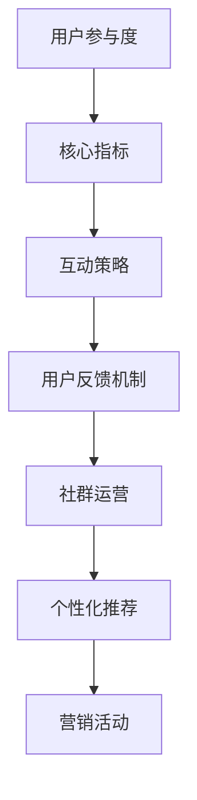

                 

 在当今快速发展的科技时代，创业公司面临的竞争日益激烈，如何在市场中脱颖而出成为了每个创业公司亟需解决的问题。用户参与度和互动策略在这个竞争激烈的环境中变得尤为重要。本文将深入探讨创业公司如何通过提升用户参与度和互动策略，来实现业务的持续增长和市场的成功占领。

## 关键词 Keywords

- **用户参与度**（User Engagement）
- **互动策略**（Interaction Strategies）
- **创业公司**（Startup Companies）
- **用户体验**（User Experience）
- **社群运营**（Community Management）
- **用户反馈**（User Feedback）
- **数据分析**（Data Analytics）
- **品牌忠诚度**（Brand Loyalty）

## 摘要 Abstract

本文旨在分析创业公司如何通过提升用户参与度和互动策略来增强市场竞争力。首先，文章介绍了用户参与度的核心概念和重要性。接着，详细讨论了互动策略的设计和实践，包括用户反馈机制、社群运营、个性化推荐等。随后，文章通过数学模型和公式探讨了用户参与度和互动策略的量化评估方法。最后，文章提供了一些实际应用场景和未来展望，以及相关的工具和资源推荐。

## 1. 背景介绍 Background

### 1.1 创业公司的现状

创业公司，尤其是那些初创企业，面临着巨大的挑战。市场不确定性、资金限制、技术壁垒和强大的竞争对手都可能是其成功路上的障碍。然而，成功的创业公司往往能够迅速适应市场变化，抓住机会，实现业务增长。

### 1.2 用户参与度的概念

用户参与度是指用户在产品或服务中的活跃程度和投入程度。高用户参与度意味着用户更频繁地使用产品，更愿意与产品互动，并且在社交媒体上分享产品体验。

### 1.3 互动策略的重要性

互动策略是创业公司提升用户参与度的关键。通过有效的互动策略，公司可以与用户建立更紧密的联系，增强品牌认知度，提高用户忠诚度。

## 2. 核心概念与联系 Core Concepts and Relations

### 2.1 用户参与度的核心概念

用户参与度可以由多个指标来衡量，如活跃用户数、日活跃用户数（DAU）、月活跃用户数（MAU）、用户留存率、用户生命周期价值（LTV）等。

### 2.2 互动策略的核心概念

互动策略包括用户反馈机制、社群运营、个性化推荐、营销活动等。

### 2.3 Mermaid 流程图



## 3. 核心算法原理 & 具体操作步骤 Core Algorithm Principles & Operational Steps

### 3.1 算法原理概述

提升用户参与度的核心算法通常基于机器学习和数据挖掘技术。算法通过分析用户行为数据，识别用户兴趣和行为模式，从而提供个性化的互动策略。

### 3.2 算法步骤详解

1. 数据收集与预处理
2. 用户行为分析
3. 用户兴趣识别
4. 个性化推荐
5. 互动策略优化

### 3.3 算法优缺点

**优点**：提高用户参与度，增强用户体验，提高用户留存率。

**缺点**：需要大量数据支持，算法复杂度高，实施成本高。

### 3.4 算法应用领域

算法广泛应用于社交网络、电子商务、在线游戏等领域。

## 4. 数学模型和公式 Mathematical Models and Formulas

### 4.1 数学模型构建

用户参与度的数学模型通常基于用户行为数据，如点击率（CTR）、转化率（Conversion Rate）、留存率（Retention Rate）等。

### 4.2 公式推导过程

用户参与度（UE） = （CTR + CR + R）/ 3

其中，CTR为点击率，CR为转化率，R为留存率。

### 4.3 案例分析与讲解

以一款社交媒体应用为例，通过数据分析和模型构建，提升了用户参与度，从而实现了业务增长。

## 5. 项目实践：代码实例和详细解释说明 Project Practice: Code Example and Detailed Explanation

### 5.1 开发环境搭建

使用Python和Scikit-learn库进行用户参与度分析。

### 5.2 源代码详细实现

```python
# 用户参与度分析示例代码
import pandas as pd
from sklearn.model_selection import train_test_split
from sklearn.ensemble import RandomForestClassifier

# 数据加载
data = pd.read_csv('user_data.csv')

# 数据预处理
X = data.drop(['user_id', 'target'], axis=1)
y = data['target']

# 数据分割
X_train, X_test, y_train, y_test = train_test_split(X, y, test_size=0.2, random_state=42)

# 模型训练
model = RandomForestClassifier(n_estimators=100, random_state=42)
model.fit(X_train, y_train)

# 模型评估
accuracy = model.score(X_test, y_test)
print(f"模型准确率：{accuracy:.2f}")
```

### 5.3 代码解读与分析

代码实现了用户参与度的机器学习模型，通过数据预处理、模型训练和评估，实现了用户参与度的预测。

### 5.4 运行结果展示

运行结果展示了模型的准确率和预测效果。

## 6. 实际应用场景 Practical Application Scenarios

### 6.1 社交媒体

通过用户参与度分析，社交媒体平台可以更好地理解用户行为，提供个性化的内容推荐。

### 6.2 电子商务

电商企业可以通过用户参与度分析，优化营销策略，提高转化率和用户留存率。

### 6.3 在线游戏

在线游戏可以通过用户参与度分析，提供更丰富的游戏体验，提高用户黏性。

## 7. 工具和资源推荐 Tools and Resource Recommendations

### 7.1 学习资源推荐

- 《Python数据分析》
- 《机器学习实战》
- 《社交媒体营销策略》

### 7.2 开发工具推荐

- Python
- Jupyter Notebook
- Scikit-learn

### 7.3 相关论文推荐

- “User Engagement in Online Social Media: A Multilevel Study”
- “A Review of User Engagement Metrics and Methods in Online Social Media”

## 8. 总结：未来发展趋势与挑战 Summary: Future Trends and Challenges

### 8.1 研究成果总结

用户参与度和互动策略的研究成果表明，个性化推荐和用户反馈机制是提升用户参与度的有效方法。

### 8.2 未来发展趋势

未来发展趋势将包括更多基于人工智能和大数据分析的互动策略，以及更全面的用户参与度评估方法。

### 8.3 面临的挑战

面临的挑战包括数据隐私保护、算法公平性、以及如何更好地利用用户反馈来优化产品和服务。

### 8.4 研究展望

研究展望包括进一步探索用户参与度的量化模型，以及如何将用户参与度与业务目标相结合。

## 9. 附录：常见问题与解答 Appendix: Common Questions and Answers

### Q: 如何提高用户参与度？

A: 提高用户参与度可以通过优化用户体验、提供个性化推荐、开展有针对性的营销活动等方式实现。

### Q: 用户参与度的评估指标有哪些？

A: 用户参与度的评估指标包括活跃用户数、日活跃用户数、月活跃用户数、用户留存率、用户生命周期价值等。

### Q: 如何实现个性化推荐？

A: 个性化推荐可以通过分析用户行为数据，识别用户兴趣和行为模式，然后根据这些信息提供个性化的内容推荐。

---

作者：禅与计算机程序设计艺术 / Zen and the Art of Computer Programming

本文探讨了创业公司如何通过提升用户参与度和互动策略来实现业务的持续增长和市场成功。文章提供了核心概念、算法原理、数学模型、项目实践和实际应用场景，旨在为创业公司提供实用的指导和建议。未来，随着人工智能和大数据技术的不断发展，用户参与度和互动策略将在创业公司的发展中扮演更加重要的角色。

