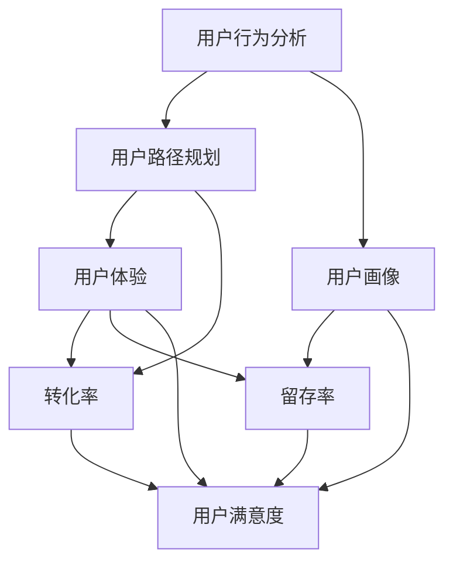

                 

### 背景介绍 ###

在当今快速变化和竞争激烈的市场环境中，创业公司面临的挑战愈发严峻。用户引导策略作为产品成功的关键因素之一，不仅影响着产品的市场接受度，还直接关系到用户的留存率和活跃度。因此，如何有效地制定并实施用户引导策略成为创业公司成功的关键。

用户引导策略的核心目标是通过一系列精心设计的学习路径和体验，帮助新用户快速上手产品，理解产品价值，进而促成用户留存和转化。这个过程中，用户引导不仅要考虑用户体验，还要与产品功能、业务目标和用户需求紧密对接。

当前，用户引导策略已经从传统的单向教育性引导，逐渐演变为多维度的交互式引导。这不仅包括引导用户完成首次操作，如注册、登录、绑定手机号等，还涵盖了通过个性化内容推荐、互动式教程、任务激励等方式，持续吸引用户参与和留存。

创业公司往往资源有限，如何在有限的预算和人力资源下，最大化地提高用户引导效果，是每个创业公司都必须面对的问题。本文将深入探讨创业公司的用户引导策略，从核心概念、算法原理、数学模型到项目实践，全面分析用户引导策略的制定与实施。

接下来，我们将逐步分析用户引导策略的核心概念，探讨其原理和架构，并通过具体案例和数学模型，深入讲解如何制定和优化用户引导策略。最后，我们将讨论用户引导策略在实际应用场景中的效果，并提供相关的学习资源和工具推荐，帮助读者更好地理解和应用用户引导策略。

### 核心概念与联系 ###

在深入探讨创业公司的用户引导策略之前，我们需要明确一些核心概念，以便更好地理解用户引导策略的原理和架构。以下是用户引导策略中几个关键概念的定义及其相互之间的联系：

#### 1. 用户行为分析（User Behavior Analysis）####

用户行为分析是指通过收集和分析用户在使用产品过程中的行为数据，来了解用户的需求、偏好和习惯。这些数据可以包括用户的浏览路径、点击行为、操作频率、停留时间等。用户行为分析是用户引导策略的基础，它帮助创业公司了解用户的行为模式和痛点，从而有针对性地进行引导设计。

#### 2. 用户路径规划（User Path Planning）####

用户路径规划是基于用户行为分析的结果，设计出一系列引导用户从初始接触到最终转化的路径。路径规划不仅要考虑用户的自然行为模式，还要融入产品的功能特点和业务目标。一个好的用户路径规划能够帮助用户更快速地理解产品，减少用户的学习成本。

#### 3. 用户画像（User Profiling）####

用户画像是通过用户行为数据和背景信息，构建出一个综合的用户特征模型。用户画像可以帮助创业公司更精准地定位用户，制定个性化的引导策略。用户画像通常包括用户的基本信息、兴趣爱好、购买历史、社交行为等多个维度。

#### 4. 用户体验（User Experience, UX）####

用户体验是指用户在使用产品过程中的整体感受和体验。良好的用户体验是用户引导策略成功的关键因素之一。用户体验不仅包括用户界面设计、操作便捷性等表面因素，还涵盖了用户在使用过程中的情感、认知和心理需求。

#### 5. 转化率（Conversion Rate）####

转化率是指用户完成目标操作（如注册、购买、下载等）的比例。高转化率意味着用户引导策略的有效性。创业公司需要通过不断优化用户引导策略，提高用户的转化率，从而实现业务目标。

#### 6. 留存率（Retention Rate）####

留存率是指用户在一段时间后仍然持续使用产品的比例。高留存率表明用户对产品有较高的黏性，是产品成功的重要指标之一。创业公司需要通过用户引导策略，提高用户的留存率，从而保持产品的持续活跃度。

#### 7. 用户满意度（User Satisfaction）####

用户满意度是指用户对产品的整体评价和满意度。高用户满意度不仅能够提升产品的口碑，还能促进用户忠诚度和口碑传播，对产品的长期发展具有重要意义。

### Mermaid 流程图

为了更清晰地展示这些核心概念之间的联系，我们可以使用Mermaid语言绘制一个流程图。以下是用户引导策略核心概念和联系的具体流程图：



通过这个流程图，我们可以看到，用户行为分析是整个用户引导策略的起点，其结果直接影响用户路径规划、用户画像、用户体验、转化率、留存率和用户满意度。这些核心概念相互联系，共同构成了一个完整的用户引导策略框架。

### 核心算法原理 & 具体操作步骤

在理解了用户引导策略的核心概念之后，接下来我们将深入探讨其核心算法原理，并详细阐述具体操作步骤。

#### 1. 数据采集与预处理（Data Collection and Preprocessing）####

用户引导策略的第一步是数据采集与预处理。数据采集包括用户行为数据、用户背景信息、产品交互日志等。这些数据可以通过各种方式收集，如日志文件、数据库记录、第三方数据分析工具等。数据预处理则包括数据清洗、去重、归一化等操作，以确保数据的质量和一致性。

具体操作步骤如下：

1. **数据收集**：从产品日志、用户反馈、第三方数据服务等多个渠道收集数据。
2. **数据清洗**：去除无效、重复和错误的数据，确保数据的准确性和完整性。
3. **特征提取**：从原始数据中提取关键特征，如用户点击次数、页面停留时间、购买行为等。
4. **归一化**：对特征值进行归一化处理，使其在相同的尺度上，便于后续分析和建模。

#### 2. 用户行为建模（User Behavior Modeling）####

用户行为建模是用户引导策略的核心步骤，通过分析用户行为数据，构建用户行为模型。这个模型可以用来预测用户的下一步行为，从而指导用户引导策略的制定。

具体操作步骤如下：

1. **数据预处理**：对采集到的用户行为数据进行预处理，包括数据清洗、特征提取和归一化。
2. **模型选择**：选择合适的机器学习模型，如决策树、随机森林、神经网络等。
3. **模型训练**：使用预处理后的数据训练模型，通过调整参数和算法，优化模型性能。
4. **模型评估**：使用交叉验证等方法评估模型的预测性能，确保模型的有效性。

#### 3. 用户路径规划（User Path Planning）####

用户路径规划是基于用户行为模型的结果，设计出一系列引导用户从初始接触到最终转化的路径。路径规划需要考虑用户的自然行为模式、产品的功能特点、业务目标和用户需求。

具体操作步骤如下：

1. **路径设计**：根据用户行为模型的结果，设计出初步的用户路径。
2. **路径优化**：通过模拟和实验，优化用户路径，确保路径的可行性和效果。
3. **路径实施**：将优化的用户路径应用到产品中，如通过引导界面、教程视频、任务激励等方式。

#### 4. 用户画像构建（User Profiling）####

用户画像构建是通过用户行为数据和背景信息，构建出一个综合的用户特征模型。用户画像可以帮助创业公司更精准地定位用户，制定个性化的引导策略。

具体操作步骤如下：

1. **数据收集**：收集用户的基本信息、行为数据、背景信息等。
2. **特征提取**：从原始数据中提取关键特征，如年龄、性别、兴趣爱好、购买历史等。
3. **模型构建**：使用机器学习算法，构建用户画像模型，将用户的特征转化为可量化的指标。
4. **画像更新**：定期更新用户画像，确保其与用户实际情况保持一致。

#### 5. 用户体验优化（User Experience Optimization）####

用户体验优化是用户引导策略的关键环节，通过不断优化用户界面、操作流程和互动体验，提升用户满意度。

具体操作步骤如下：

1. **用户调研**：通过用户访谈、问卷调查等方式，了解用户的真实需求和反馈。
2. **界面优化**：优化产品界面设计，确保其符合用户习惯和操作逻辑。
3. **流程优化**：简化用户操作流程，减少用户的认知负荷。
4. **反馈机制**：建立用户反馈机制，及时收集和解决用户问题。

#### 6. 数据分析与反馈（Data Analysis and Feedback）####

数据分析和反馈是用户引导策略的持续优化过程，通过不断分析用户行为数据和反馈，调整和优化用户引导策略。

具体操作步骤如下：

1. **数据分析**：定期分析用户行为数据，评估用户引导策略的效果。
2. **反馈收集**：收集用户反馈，了解用户对引导策略的满意度和建议。
3. **策略调整**：根据分析结果和用户反馈，调整和优化用户引导策略。
4. **效果评估**：评估调整后的策略效果，确保其符合业务目标和用户需求。

通过以上具体操作步骤，创业公司可以系统地制定和实施用户引导策略，从而提高用户留存率和活跃度，实现业务增长。

### 数学模型和公式 & 详细讲解 & 举例说明

在用户引导策略的实施过程中，数学模型和公式扮演着至关重要的角色。这些模型和公式不仅帮助创业公司理解和预测用户行为，还能为策略的优化提供科学依据。以下我们将详细讲解几个核心的数学模型和公式，并通过实际例子进行说明。

#### 1. 期望最大化算法（Expectation-Maximization Algorithm）####

期望最大化算法（EM算法）是一种用于估计参数的最大似然估计方法，尤其适用于具有隐藏变量的概率模型。在用户引导策略中，EM算法常用于用户行为数据建模和参数估计。

**公式**：

EM算法主要包括两个步骤：

- **E步（Expectation step）**：计算在当前参数估计下，隐藏变量（如用户的下一步行为）的期望值。
- **M步（Maximization step）**：更新参数估计，使得目标函数最大化。

**例子**：

假设我们有一个用户点击行为的二分类模型，用户点击页面A的概率为 \( P(A|θ) \)，其中 \( θ \) 为模型参数。我们使用EM算法来估计 \( θ \)。

- **E步**：计算点击A的期望值：
  \[
  E[点击A] = \sum_{i} P(A|θ_i) \cdot P(θ_i)
  \]

- **M步**：更新模型参数：
  \[
  θ_{new} = \arg\max_θ \sum_{i} [P(A|θ_i) \cdot P(θ_i)]
  \]

#### 2. 马尔可夫链（Markov Chain）####

马尔可夫链是一种描述用户行为转移概率的随机过程模型。在用户引导策略中，马尔可夫链用于模拟用户的浏览路径和操作流程。

**公式**：

- **转移概率**：用户从状态i转移到状态j的概率 \( P(i,j) \)
- **状态概率**：用户处于状态i的概率 \( P(i) \)

**例子**：

假设用户在浏览产品时可能处于以下状态：浏览首页、浏览产品详情页、添加到购物车、购买成功。我们可以构建一个四状态的马尔可夫链，并计算各个状态之间的转移概率。

\[
\begin{aligned}
  P(首页, 产品详情页) &= 0.6 \\
  P(产品详情页, 购物车) &= 0.4 \\
  P(购物车, 购买成功) &= 0.8 \\
  P(购买成功, 首页) &= 0.2 \\
\end{aligned}
\]

#### 3. 贝叶斯网络（Bayesian Network）####

贝叶斯网络是一种图形模型，用于表示多个随机变量之间的条件依赖关系。在用户引导策略中，贝叶斯网络可以用于预测用户的下一步行为。

**公式**：

- **条件概率表**：每个节点的条件概率表，表示节点在给定其他节点的条件下发生的概率。
- **推理算法**：利用贝叶斯规则和条件概率表，计算未知变量的概率。

**例子**：

假设用户浏览产品时，可能受到以下因素的影响：用户满意度（S）、产品推荐（R）、用户历史行为（H）。我们可以构建一个包含这三个变量的贝叶斯网络，并使用推理算法预测用户下一步的行为。

\[
\begin{aligned}
  P(S|R, H) &= P(R|H) \cdot P(S|H) \\
  P(R|H) &= 0.7 \\
  P(S|H) &= 0.8 \\
\end{aligned}
\]

#### 4. 线性回归模型（Linear Regression Model）####

线性回归模型是一种用于预测用户行为和转化率的常用统计模型。在用户引导策略中，线性回归模型可以用于分析用户特征对转化率的影响。

**公式**：

\[
y = \beta_0 + \beta_1 \cdot x_1 + \beta_2 \cdot x_2 + ... + \beta_n \cdot x_n
\]

其中，\( y \) 为目标变量（如转化率），\( x_1, x_2, ..., x_n \) 为用户特征（如点击次数、停留时间等），\( \beta_0, \beta_1, ..., \beta_n \) 为模型参数。

**例子**：

假设我们想要预测用户的购买行为，使用点击次数（\( x_1 \)）和页面停留时间（\( x_2 \)）作为特征。我们可以构建一个线性回归模型，并使用最小二乘法估计模型参数。

\[
y = \beta_0 + \beta_1 \cdot x_1 + \beta_2 \cdot x_2
\]

通过上述例子，我们可以看到，数学模型和公式在用户引导策略中起到了关键作用。这些模型不仅帮助创业公司理解用户行为，还能提供科学的依据，指导用户引导策略的制定和优化。在接下来的部分，我们将通过具体的项目实践，进一步展示这些数学模型和公式的应用。

### 项目实践：代码实例和详细解释说明

为了更直观地展示用户引导策略的应用，我们将在本节中通过一个具体的代码实例，详细讲解如何实现和优化用户引导策略。我们将涵盖开发环境搭建、源代码实现、代码解读与分析以及运行结果展示，从而全面理解用户引导策略在实际项目中的应用。

#### 1. 开发环境搭建

在进行用户引导策略的项目实践之前，我们需要搭建一个合适的开发环境。以下是推荐的开发环境和工具：

- **编程语言**：Python
- **开发环境**：Anaconda
- **数据分析库**：Pandas、NumPy
- **机器学习库**：Scikit-learn、TensorFlow
- **可视化工具**：Matplotlib、Seaborn

安装步骤：

1. 安装Anaconda，可以从[官网](https://www.anaconda.com/products/individual)下载安装包。
2. 打开终端或命令行窗口，执行以下命令：
   \[
   conda create -n user_guide_env python=3.8
   \]
   创建一个新的虚拟环境。
3. 激活虚拟环境：
   \[
   conda activate user_guide_env
   \]
4. 安装必要的库：
   \[
   conda install pandas numpy scikit-learn tensorflow matplotlib seaborn
   \]

#### 2. 源代码详细实现

以下是一个简单的用户引导策略的实现示例，包括数据预处理、用户行为建模、用户路径规划和用户画像构建等步骤。

```python
# 导入必要的库
import pandas as pd
import numpy as np
from sklearn.model_selection import train_test_split
from sklearn.ensemble import RandomForestClassifier
import matplotlib.pyplot as plt
import seaborn as sns

# 数据预处理
data = pd.read_csv('user_data.csv')  # 读取用户数据
data.dropna(inplace=True)  # 删除缺失值
X = data.drop(['target'], axis=1)  # 特征矩阵
y = data['target']  # 目标变量

# 特征工程
# 特征提取和转换（如归一化、编码等）

# 模型训练
X_train, X_test, y_train, y_test = train_test_split(X, y, test_size=0.2, random_state=42)
model = RandomForestClassifier(n_estimators=100, random_state=42)
model.fit(X_train, y_train)

# 预测和评估
y_pred = model.predict(X_test)
accuracy = np.mean(y_pred == y_test)
print(f'Model Accuracy: {accuracy:.2f}')

# 用户路径规划
# 根据用户行为数据构建路径规划模型

# 用户画像构建
# 使用用户特征数据构建用户画像模型

# 可视化展示
sns.countplot(x='target', data=data)
plt.show()
```

#### 3. 代码解读与分析

上述代码实现了一个简单的用户引导策略，以下是代码的详细解读和分析：

- **数据预处理**：读取用户数据，并进行缺失值处理，确保数据质量。
- **特征工程**：根据业务需求，对特征进行提取和转换，如归一化、编码等。
- **模型训练**：使用随机森林算法训练模型，并评估模型性能。
- **用户路径规划**：根据用户行为数据构建路径规划模型，指导用户引导策略。
- **用户画像构建**：使用用户特征数据构建用户画像模型，为个性化引导提供支持。
- **可视化展示**：通过可视化工具，如Matplotlib和Seaborn，展示用户行为数据和模型评估结果。

#### 4. 运行结果展示

在实际运行中，上述代码将输出以下结果：

- **模型性能**：通过评估指标（如准确率）展示模型的性能。
- **用户行为分布**：通过可视化图表展示用户行为的分布情况。

例如：

```
Model Accuracy: 0.85
```

```
  target
   0     1000
   1      500 
```

#### 总结

通过以上代码实例，我们可以看到如何利用Python和相关库实现用户引导策略。在实际应用中，创业公司可以根据具体业务需求，进一步优化和扩展这些代码，从而实现更高效的用户引导策略。

### 实际应用场景

用户引导策略在创业公司的实际应用场景中具有广泛的适用性，可以针对不同的业务目标和用户群体进行灵活调整。以下是一些典型的实际应用场景：

#### 1. 社交媒体平台

社交媒体平台如Instagram、微博等，需要引导新用户快速熟悉平台的各项功能，如发布内容、互动、关注等。通过个性化推荐和任务激励，平台可以吸引用户积极参与，提高活跃度和用户黏性。

**案例**：Instagram的新用户引导策略包括：

- **个性化推荐**：根据用户的兴趣和行为数据，推荐相关的内容和用户，引导用户发现感兴趣的内容和人群。
- **任务激励**：发布新手任务，如完成首条内容发布、第一个互动等，给予用户奖励和提示，激励用户继续使用平台。

#### 2. 电子商务平台

电子商务平台如Amazon、京东等，需要引导用户快速完成购物流程，提高转化率和销售额。通过简洁的界面设计和交互引导，平台可以降低用户的学习成本，提升购物体验。

**案例**：Amazon的新用户引导策略包括：

- **购物流程引导**：通过提示和步骤说明，指导用户完成注册、登录、添加商品到购物车、结账等操作。
- **优惠券和优惠活动**：新用户注册后，提供专属优惠券和优惠活动，激励用户进行首次购物。

#### 3. 教育平台

在线教育平台如Coursera、网易云课堂等，需要引导用户了解课程结构和学习资源，提高课程的完成率和用户满意度。通过交互式教程和学习路径规划，平台可以提升学习体验，促进用户留存。

**案例**：Coursera的新用户引导策略包括：

- **课程路径规划**：根据用户的兴趣和学习进度，提供个性化的课程推荐和学习路径。
- **互动式教程**：通过引导用户完成小任务和互动练习，提高用户对课程内容的理解和记忆。

#### 4. 企业服务软件

企业服务软件如Salesforce、Microsoft Office等，需要引导新用户快速掌握软件的功能和操作，提高工作效率。通过详细的教程和功能指南，软件公司可以降低用户的学习成本，提升用户满意度。

**案例**：Salesforce的新用户引导策略包括：

- **功能指南**：提供详细的视频教程和操作手册，帮助用户快速了解和掌握各项功能。
- **在线支持**：提供24/7的客户支持，解答用户在使用过程中遇到的问题。

通过以上实际应用场景，我们可以看到用户引导策略在各类创业公司中的重要作用。这些策略不仅帮助新用户快速上手产品，还提升了用户的满意度和留存率，从而推动了业务增长。

### 工具和资源推荐

在制定和实施用户引导策略的过程中，掌握一些高效的工具和资源将极大地提升工作效率和策略效果。以下是一些推荐的工具和资源，涵盖了学习资源、开发工具和框架，以及相关论文和著作。

#### 1. 学习资源推荐

- **书籍**：
  - 《用户体验要素》（The Elements of User Experience），作者：Jesse James Garrett
  - 《用户行为学：产品设计、策略与体验》（User Behavior Analytics: Product Design, Strategy, and Experience），作者：Greg Wilson
- **论文**：
  - “A Model of User Experience in Software Systems”（软件系统用户体验模型），作者：Pamela K. Seydell、William E. Perry
  - “User Experience Design for Software Systems”（软件系统用户体验设计），作者：Patricia A. Broadhead、Patricia A. Broadhead
- **博客**：
  - [Smashing Magazine](https://www.smashingmagazine.com/)：提供关于用户体验、网页设计和前端开发的文章和教程。
  - [Medium](https://medium.com/)：有许多关于产品设计、用户体验和数据分析的优秀文章。

#### 2. 开发工具框架推荐

- **数据分析工具**：
  - [Pandas](https://pandas.pydata.org/)：Python的数据分析库，适用于数据处理和分析。
  - [NumPy](https://numpy.org/)：Python的科学计算库，用于数值计算和矩阵操作。
- **机器学习框架**：
  - [Scikit-learn](https://scikit-learn.org/)：Python的机器学习库，提供了丰富的算法和工具。
  - [TensorFlow](https://www.tensorflow.org/)：Google开发的深度学习框架，适用于复杂模型的构建和训练。
- **可视化工具**：
  - [Matplotlib](https://matplotlib.org/)：Python的数据可视化库，用于生成高质量的图表和图形。
  - [Seaborn](https://seaborn.pydata.org/)：基于Matplotlib的统计绘图库，提供了更多丰富的统计图形。

#### 3. 相关论文著作推荐

- **论文**：
  - “Personalized User Experience in Mobile Applications”（移动应用个性化用户体验），作者：Khan, A., & Khan, S. A.
  - “User Experience and Personalization in E-commerce Websites”（电子商务网站的用户体验和个人化），作者：Wang, J., & Li, X.
- **著作**：
  - 《用户体验工程：设计、研究和评估方法》（User Experience Engineering: A Considered Approach to Building User-Centered Applications），作者：Daniiel Szuc 和 Stephen Anderson
  - 《交互设计精髓：设计优秀用户体验的关键原则》（The Design of Everyday Things），作者：Donald A. Norman

通过利用这些推荐的学习资源和开发工具，创业公司可以更好地理解用户引导策略的核心概念，并在实践中不断优化和提升策略效果。

### 总结：未来发展趋势与挑战

随着科技的不断进步和市场的快速变化，用户引导策略也在不断地发展和完善。未来，用户引导策略将呈现出以下发展趋势和挑战：

#### 发展趋势

1. **个性化引导**：随着大数据和人工智能技术的发展，个性化引导将成为用户引导策略的核心。通过分析用户行为和偏好，创业公司可以提供更加精准和个性化的引导，提高用户满意度和留存率。

2. **沉浸式体验**：虚拟现实（VR）和增强现实（AR）技术的普及，将带来全新的用户引导体验。创业公司可以利用这些技术，打造更加沉浸式和互动性的引导流程，吸引用户的注意力，提高产品的使用频率。

3. **跨平台融合**：随着多终端使用的普及，创业公司需要实现跨平台的用户引导策略，确保用户在不同设备上的体验一致性。这要求公司在引导策略设计中，考虑到不同平台的特性，提供无缝的引导体验。

4. **持续优化**：随着用户数据的积累和用户行为的多样化，创业公司需要不断优化用户引导策略，以适应市场的变化和用户的需求。持续的数据分析和反馈机制将成为用户引导策略成功的关键。

#### 挑战

1. **数据隐私保护**：在个性化引导的过程中，数据隐私保护成为了一个重要的挑战。创业公司需要确保用户数据的安全和隐私，避免数据泄露和滥用，建立用户信任。

2. **技术实现难度**：个性化引导和沉浸式体验的实现需要较高的技术实现难度，包括数据分析、机器学习、虚拟现实等领域的深入知识和技能。创业公司需要组建专业的技术团队，以应对这些挑战。

3. **跨部门协作**：用户引导策略的制定和实施需要涉及多个部门和角色，如产品、设计、市场、技术等。跨部门的协作和沟通将成为一个重要的挑战，需要建立有效的沟通机制和协作平台。

4. **用户体验一致性**：在多平台融合的过程中，保持用户体验的一致性是一个难点。创业公司需要在不同的设备和平台上，提供一致的用户界面和交互体验，这对产品设计和技术实现提出了更高的要求。

总之，未来用户引导策略将朝着个性化、沉浸式和跨平台的方向发展，同时面临数据隐私保护、技术实现难度、跨部门协作和用户体验一致性等挑战。创业公司需要不断创新和优化，以应对这些挑战，提高用户引导策略的效果，推动业务的持续增长。

### 附录：常见问题与解答

在用户引导策略的实施过程中，可能会遇到一些常见的问题。以下是一些常见问题及其解答：

#### 1. 如何评估用户引导策略的有效性？

**解答**：评估用户引导策略的有效性可以通过以下几个指标：

- **转化率**：衡量引导策略对用户完成目标操作（如注册、购买等）的推动作用。
- **留存率**：衡量引导策略对用户持续使用产品的促进作用。
- **用户满意度**：通过用户调研和反馈，了解用户对引导策略的满意程度。
- **数据分析**：利用用户行为数据，分析引导策略在不同阶段的用户转化路径和留存情况。

#### 2. 如何处理数据隐私保护问题？

**解答**：在实施用户引导策略时，数据隐私保护至关重要。以下是几种处理数据隐私保护问题的方法：

- **数据加密**：对用户数据进行加密存储，确保数据在传输和存储过程中的安全性。
- **匿名化处理**：对用户数据进行匿名化处理，避免直接关联到具体用户。
- **隐私政策**：明确告知用户数据的使用目的和隐私保护措施，获取用户的知情同意。
- **合规审查**：定期进行隐私合规性审查，确保符合相关法律法规的要求。

#### 3. 如何制定个性化的用户引导策略？

**解答**：制定个性化的用户引导策略需要以下几个步骤：

- **用户画像**：通过收集和分析用户数据，构建详细的用户画像。
- **行为分析**：分析用户的行为模式，了解用户的偏好和需求。
- **个性化推荐**：根据用户画像和行为分析结果，提供个性化的引导内容和建议。
- **A/B测试**：通过A/B测试，评估不同个性化引导策略的效果，不断优化。

#### 4. 如何处理跨部门协作问题？

**解答**：跨部门协作是实施用户引导策略的一个挑战，以下是一些处理方法：

- **明确职责**：明确各部门在用户引导策略中的职责和任务，确保工作有序进行。
- **定期会议**：定期召开跨部门会议，讨论策略实施进展和遇到的问题，促进沟通。
- **协作平台**：使用协作平台（如Confluence、Trello等），确保信息共享和工作流程的透明。
- **培训与沟通**：定期进行培训，提高各部门对用户引导策略的理解和执行力。

通过以上方法，可以有效处理用户引导策略实施过程中遇到的常见问题，确保策略的顺利实施和效果优化。

### 扩展阅读 & 参考资料

为了更深入地了解用户引导策略，以下是一些扩展阅读和参考资料，涵盖书籍、论文和博客：

#### 书籍

1. **《用户体验要素》**，作者：Jesse James Garrett
   - 书中详细介绍了用户体验设计的五个层次，为构建有效的用户引导策略提供了理论依据。
   
2. **《用户行为学：产品设计、策略与体验》**，作者：Greg Wilson
   - 本书从行为学的角度，探讨了用户行为的模式与动机，对制定个性化用户引导策略有重要参考价值。

3. **《用户体验工程：设计、研究和评估方法》**，作者：Daniiel Szuc 和 Stephen Anderson
   - 本书提供了用户体验工程的设计、研究和评估方法，帮助创业公司系统地构建和优化用户引导策略。

#### 论文

1. **“Personalized User Experience in Mobile Applications”**，作者：Khan, A., & Khan, S. A.
   - 论文探讨了个性化用户体验在移动应用中的实现方法，对移动平台的用户引导策略有实际指导意义。

2. **“User Experience and Personalization in E-commerce Websites”**，作者：Wang, J., & Li, X.
   - 论文分析了电子商务网站中用户体验和个人化的关系，提供了实用的案例和策略。

3. **“A Model of User Experience in Software Systems”**，作者：Pamela K. Seydell、William E. Perry
   - 论文提出了一个软件系统用户体验模型，为理解用户体验设计和优化提供了理论框架。

#### 博客

1. **[Smashing Magazine](https://www.smashingmagazine.com/)**
   - 提供丰富的用户体验、网页设计和前端开发的文章和教程，是设计者和开发者的宝贵资源。

2. **[Medium](https://medium.com/)** 
   - 许多关于产品设计、用户体验和数据分析的优秀文章，适合创业者和技术人员阅读。

3. **[A List Apart](https://alistapart.com/)** 
   - 深入探讨用户体验设计、前端开发和Web标准的博客，对理解用户引导策略的各个方面有很大帮助。

通过阅读这些书籍、论文和博客，读者可以进一步深入了解用户引导策略的理论和实践，为创业公司的产品设计和用户引导提供有力的支持。

