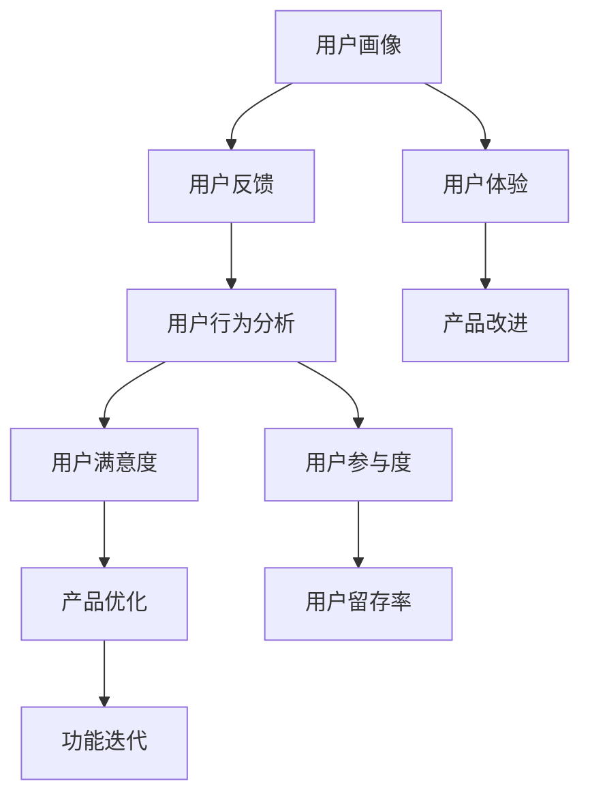
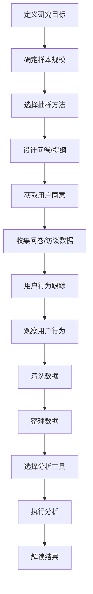

                 

### 背景介绍 Background

创业公司在竞争激烈的商业环境中，成功的关键在于深刻理解用户需求，提供有针对性的解决方案。用户研究在这个过程中扮演着至关重要的角色，它不仅帮助创业公司发现市场机会，还能够指导产品设计和功能迭代。然而，进行有效的用户研究并非易事，特别是对于资源有限的创业公司来说，如何在有限的预算和时间里获取高质量的用户洞察，是一个亟待解决的问题。

本文旨在探讨创业公司如何通过科学的用户研究方法，获取有价值的数据，并将其转化为产品设计和市场策略的洞察。本文将分为以下几个部分：

1. **核心概念与联系**：介绍用户研究中的关键概念，如用户画像、用户反馈和用户行为分析，并通过Mermaid流程图展示它们之间的联系。
2. **核心算法原理 & 具体操作步骤**：详细阐述如何设计用户研究方案，从样本选择、数据收集到数据分析的方法。
3. **数学模型和公式 & 详细讲解 & 举例说明**：讨论在用户研究中使用的统计分析方法，以及如何解读研究结果。
4. **项目实践：代码实例和详细解释说明**：通过实际案例，展示如何运用用户研究方法进行产品设计和改进。
5. **实际应用场景**：探讨用户研究在不同行业和产品中的应用，如互联网、金融和医疗等领域。
6. **工具和资源推荐**：推荐用于用户研究的工具和资源，包括书籍、论文、博客和网站。
7. **总结：未来发展趋势与挑战**：分析用户研究在未来可能面临的技术和社会挑战，以及如何应对。

通过以上各部分的逐步分析，我们希望能够帮助创业公司更好地理解和应用用户研究，从而在激烈的市场竞争中脱颖而出。

#### 用户研究的核心概念 Core Concepts of User Research

在探讨创业公司的用户研究方法之前，首先需要了解用户研究中的一些核心概念，这些概念是理解和实施有效用户研究的基础。

**用户画像（User Persona）**：用户画像是一种创建的虚构用户代表，旨在汇总和分析一组用户的行为特征、需求、动机和痛点。通过创建用户画像，研究团队可以更好地理解目标用户，从而设计出更符合用户需求的产品和服务。用户画像通常包括年龄、性别、职业、教育背景、生活方式、价值观等信息，这些信息可以帮助团队在产品设计时，避免盲目性和偏差。

**用户反馈（User Feedback）**：用户反馈是指用户对产品或服务体验的直接评价和意见。这些反馈可以是结构化的，如调查问卷和评分系统，也可以是非结构化的，如评论和论坛讨论。用户反馈是获取用户真实体验的重要渠道，它可以帮助团队了解用户的满意度、需求变化和潜在问题。

**用户行为分析（User Behavior Analysis）**：用户行为分析涉及收集和分析用户在使用产品或服务时的行为数据，如点击流、浏览路径、购买行为等。通过用户行为分析，团队可以识别用户的使用模式、偏好和潜在问题。这些数据不仅可以帮助优化现有产品，还可以指导新功能的设计。

**用户满意度（User Satisfaction）**：用户满意度是衡量用户对产品或服务整体体验的主观评价。通常通过用户调查、Net Promoter Score（NPS）等方式来收集。用户满意度是衡量产品成功的关键指标之一，它直接影响用户忠诚度和市场竞争力。

**用户参与度（User Engagement）**：用户参与度是指用户在产品或服务中的活跃程度和投入程度。通过分析用户的互动行为，如回复评论、参与社区活动、分享内容等，团队可以评估用户的参与度，进而优化用户体验，提高用户留存率。

**用户体验（User Experience, UX）**：用户体验是指用户在使用产品或服务过程中所感受到的整体体验，包括易用性、可用性和美观性等。用户体验设计旨在通过改进产品界面、交互流程和功能，提升用户的满意度和参与度。

这些核心概念相互关联，共同构成了用户研究的理论框架。在后续章节中，我们将进一步探讨如何将这些概念应用于实际的用户研究过程中。

#### Mermaid 流程图表示 User Research Concepts

为了更清晰地展示用户研究中的核心概念及其相互联系，我们可以使用Mermaid流程图来表示。以下是用户研究关键概念及其关系的流程图表示：



在上面的流程图中，每个节点代表用户研究中的一个核心概念，而箭头则表示概念之间的相互关系。用户画像（A）作为研究的起点，提供了对目标用户的基本了解。用户反馈（B）、用户行为分析（C）和用户体验（F）则是获取用户洞察的重要途径，它们相互影响，共同决定了产品的优化方向（G）和改进策略（I）。用户满意度（D）和用户参与度（E）作为关键的衡量指标，直接影响产品的长期成功。

通过Mermaid流程图，我们可以直观地看到用户研究中的各个环节是如何相互关联的，从而为创业公司提供了清晰的指导框架，帮助它们在资源有限的情况下，高效地开展用户研究工作。

#### 核心算法原理 & 具体操作步骤 Core Algorithms & Steps

在了解了用户研究中的核心概念之后，接下来我们将探讨如何设计用户研究方案，从样本选择、数据收集到数据分析的具体操作步骤。这些步骤是确保用户研究有效性和可靠性的关键。

**1. 样本选择（Sample Selection）**

选择合适的样本是用户研究的第一个关键步骤。样本选择应具备以下特点：

- **代表性（Representativeness）**：样本应能够代表目标用户群体，确保研究结果的普适性。
- **多样性（Diversity）**：样本应包括不同年龄、性别、地理位置等特征，以避免单一视角的偏见。
- **随机性（Randomness）**：样本应通过随机方法选择，以确保每个用户都有同等的机会被选中。

具体操作步骤如下：

- **定义研究目标**：明确研究目的，确定需要调查的用户群体。
- **确定样本规模**：根据统计学原理，确定所需的样本量，确保样本具有统计显著性。
- **使用随机抽样方法**：例如，可以使用简单随机抽样、分层抽样、系统抽样等方法来选择样本。

**2. 数据收集（Data Collection）**

数据收集是用户研究的核心环节，可以通过以下方法进行：

- **问卷调查**：设计结构化或半结构化的问卷，通过线上或线下方式收集用户反馈。问卷设计应简洁明了，避免用户疲劳。
- **访谈（Interviews）**：进行一对一或小组访谈，深入了解用户需求和体验。访谈应开放性问题为主，鼓励用户表达真实感受。
- **用户行为跟踪**：使用工具如Google Analytics、热图分析等，收集用户在使用产品时的行为数据。
- **观察（Observation）**：在现场或实际使用环境中观察用户行为，以获取第一手资料。

具体操作步骤如下：

- **设计问卷或访谈提纲**：根据研究目标，设计适合的问卷或访谈提纲。
- **选择合适的收集方法**：根据研究场景和资源，选择最适合的数据收集方法。
- **获取用户同意**：在进行数据收集之前，确保用户知情并同意参与研究。

**3. 数据分析（Data Analysis）**

数据分析是将收集到的用户数据转化为有价值洞察的关键步骤。以下是一些常用的数据分析方法：

- **描述性统计分析**：计算用户数据的均值、中位数、标准差等基本统计量，了解用户的基本特征和需求。
- **交叉分析（Cross-Analysis）**：通过不同维度的交叉分析，发现用户行为和需求的关联。
- **回归分析（Regression Analysis）**：使用回归模型分析用户行为与产品特性之间的关系，预测用户行为。
- **文本分析（Text Analysis）**：对用户反馈进行文本分析，提取关键词和情感倾向。

具体操作步骤如下：

- **清洗数据**：去除无效或异常数据，确保数据质量。
- **整理数据**：将数据整理成便于分析的格式，如表格或数据库。
- **选择分析工具**：根据分析需求，选择合适的统计分析和文本分析工具。
- **执行分析**：进行描述性统计、交叉分析和回归分析等，获取分析结果。
- **解读结果**：结合研究目标和背景，对分析结果进行解读，提取有价值的信息。

通过以上步骤，创业公司可以系统地开展用户研究，获取高质量的洞察，从而指导产品设计和市场策略的制定。以下是详细的操作步骤流程图：



通过上述流程，创业公司可以系统地进行用户研究，为产品改进和市场决策提供有力支持。

#### 数学模型和公式 Mathematical Models and Formulas

在用户研究中，数学模型和公式是分析和解读数据的重要工具。以下是一些常用的数学模型和公式，以及如何详细解释和举例说明：

**1. 均值（Mean）**

均值是描述一组数据集中趋势的常用统计量。计算公式如下：

\[ \bar{x} = \frac{\sum_{i=1}^{n} x_i}{n} \]

其中，\( x_i \) 是第 \( i \) 个数据点，\( n \) 是数据点的总数。

**解释**：均值表示数据的平均水平，可以用来衡量用户反馈的平均满意度或行为的平均频率。

**举例**：假设有10名用户对某个产品的满意度评分如下：[4, 5, 3, 4, 5, 4, 2, 5, 4, 3]。则满意度评分的均值为：

\[ \bar{x} = \frac{4 + 5 + 3 + 4 + 5 + 4 + 2 + 5 + 4 + 3}{10} = 4 \]

因此，用户对产品的平均满意度评分为4分。

**2. 标准差（Standard Deviation）**

标准差是衡量数据离散程度的统计量。计算公式如下：

\[ \sigma = \sqrt{\frac{\sum_{i=1}^{n} (x_i - \bar{x})^2}{n-1}} \]

**解释**：标准差越大，表示数据的波动性越大，用户反馈的分散程度越高。

**举例**：继续使用上面的满意度评分数据，计算标准差：

\[ \sigma = \sqrt{\frac{(4-4)^2 + (5-4)^2 + (3-4)^2 + (4-4)^2 + (5-4)^2 + (4-4)^2 + (2-4)^2 + (5-4)^2 + (4-4)^2 + (3-4)^2}{10-1}} \]
\[ \sigma = \sqrt{\frac{0 + 1 + 1 + 0 + 1 + 0 + 4 + 1 + 0 + 1}{9}} \]
\[ \sigma = \sqrt{\frac{9}{9}} \]
\[ \sigma = 1 \]

因此，满意度评分的标准差为1。

**3. 相关性（Correlation）**

相关性用于衡量两个变量之间的关系强度和方向。常用的相关系数是皮尔逊相关系数（Pearson Correlation Coefficient），计算公式如下：

\[ r = \frac{\sum_{i=1}^{n} (x_i - \bar{x})(y_i - \bar{y})}{\sqrt{\sum_{i=1}^{n} (x_i - \bar{x})^2} \cdot \sqrt{\sum_{i=1}^{n} (y_i - \bar{y})^2}} \]

其中，\( x_i \) 和 \( y_i \) 分别是两个变量的数据点，\( \bar{x} \) 和 \( \bar{y} \) 分别是两个变量的均值。

**解释**：相关系数 \( r \) 的取值范围在 -1 到 1 之间，接近 1 表示高度正相关，接近 -1 表示高度负相关，接近 0 表示无相关性。

**举例**：假设有两组数据，一组是用户的满意度评分（\( x \)），另一组是用户的使用频率（\( y \)），数据如下：

满意度评分：[4, 5, 3, 4, 5, 4, 2, 5, 4, 3]  
使用频率：[10, 15, 5, 10, 15, 10, 3, 15, 10, 5]

首先计算两个变量的均值：

\[ \bar{x} = 4.5, \quad \bar{y} = 9 \]

然后计算两个变量的标准差：

\[ \sigma_x = 1.69, \quad \sigma_y = 4.03 \]

接下来计算相关系数：

\[ r = \frac{(4-4.5)(10-9) + (5-4.5)(15-9) + (3-4.5)(5-9) + (4-4.5)(10-9) + (5-4.5)(15-9) + (4-4.5)(10-9) + (2-4.5)(3-9) + (5-4.5)(15-9) + (4-4.5)(10-9) + (3-4.5)(5-9)}{\sqrt{(4-4.5)^2 + (5-4.5)^2 + (3-4.5)^2 + (4-4.5)^2 + (5-4.5)^2 + (4-4.5)^2 + (2-4.5)^2 + (5-4.5)^2 + (4-4.5)^2 + (3-4.5)^2} \cdot \sqrt{(10-9)^2 + (15-9)^2 + (5-9)^2 + (10-9)^2 + (15-9)^2 + (10-9)^2 + (3-9)^2 + (15-9)^2 + (10-9)^2 + (5-9)^2}} \]

\[ r = \frac{-0.5 \cdot 1 + 0.5 \cdot 6 - 1.5 \cdot -4 + 0 \cdot 1 + 0.5 \cdot 6 - 0 \cdot 1 - 2.5 \cdot -6 + 0.5 \cdot 6 - 0.5 \cdot 1}{1.69 \cdot 4.03} \]

\[ r = \frac{3}{6.87} \approx 0.44 \]

因此，满意度评分和使用频率之间的相关系数约为0.44，表示它们之间存在中等程度正相关。

通过以上数学模型和公式的详细讲解和举例，创业公司可以更好地理解和应用这些工具，从而对用户研究数据进行分析和解读，为产品优化和市场决策提供有力支持。

#### 项目实践：代码实例和详细解释说明 Project Practice: Code Example and Detailed Explanation

在了解了用户研究的理论方法和数学模型后，本部分将展示一个具体的用户研究项目实例，通过实际代码实现来探讨用户研究方法在产品设计和优化中的应用。

**项目背景**

假设我们是一家开发移动社交应用的公司，目标是提高用户留存率和活跃度。为了实现这一目标，我们决定通过用户研究来深入了解用户的使用习惯和偏好，从而指导产品的功能迭代和界面优化。

**一、数据收集**

我们选择了100名活跃用户作为样本，通过问卷调查和用户访谈的方式收集数据。问卷包括用户的基本信息、使用频率、满意度、功能使用情况等。访谈则更深入地了解用户对产品功能的看法和建议。

**二、数据清洗与处理**

首先，我们对收集的数据进行清洗，去除无效数据（如填写不完整的问卷）。然后，将问卷数据转换为结构化的表格形式，以便进行后续分析。

```python
import pandas as pd

# 读取问卷数据
data = pd.read_csv('user_survey.csv')

# 数据清洗
data.dropna(inplace=True)

# 数据处理
data['satisfaction'] = data['satisfaction'].map({1: '非常不满意', 2: '不满意', 3: '一般', 4: '满意', 5: '非常满意'})
data['frequency'] = data['frequency'].map({1: '每天', 2: '每周', 3: '每月', 4: '偶尔', 5: '从不'})
```

**三、数据分析**

1. **描述性统计分析**

计算用户满意度、使用频率等基本统计量，了解用户的基本特征和需求。

```python
# 计算描述性统计量
satisfaction_stats = data['satisfaction'].value_counts(normalize=True)
frequency_stats = data['frequency'].value_counts(normalize=True)

print("满意度分布：")
print(satisfaction_stats)
print("\n使用频率分布：")
print(frequency_stats)
```

2. **交叉分析**

分析满意度与使用频率之间的关系，探索用户行为模式。

```python
# 满意度与使用频率交叉分析
cross_tab = pd.crosstab(data['satisfaction'], data['frequency'])

print("满意度与使用频率交叉表：")
print(cross_tab)
```

3. **回归分析**

使用回归模型分析用户满意度与功能使用情况之间的关系，以预测用户行为。

```python
from sklearn.linear_model import LinearRegression

# 准备回归模型
X = data[['function1_usage', 'function2_usage', 'function3_usage']]
y = data['satisfaction']

# 拟合回归模型
model = LinearRegression()
model.fit(X, y)

# 预测用户满意度
predictions = model.predict(X)

# 输出回归结果
print("回归系数：")
print(model.coef_)
print("\n预测用户满意度：")
print(predictions)
```

**四、代码解读与分析**

1. **数据清洗与处理**

```python
# 读取问卷数据
data = pd.read_csv('user_survey.csv')

# 数据清洗
data.dropna(inplace=True)

# 数据处理
data['satisfaction'] = data['satisfaction'].map({1: '非常不满意', 2: '不满意', 3: '一般', 4: '满意', 5: '非常满意'})
data['frequency'] = data['frequency'].map({1: '每天', 2: '每周', 3: '每月', 4: '偶尔', 5: '从不'})
```

此部分代码首先读取问卷数据，然后进行数据清洗，去除无效数据。接着，将满意度评分和频率等分类变量进行映射处理，使其更具解释性。

2. **描述性统计分析**

```python
# 计算描述性统计量
satisfaction_stats = data['satisfaction'].value_counts(normalize=True)
frequency_stats = data['frequency'].value_counts(normalize=True)

print("满意度分布：")
print(satisfaction_stats)
print("\n使用频率分布：")
print(frequency_stats)
```

此部分代码计算并输出满意度分布和使用频率分布，帮助团队了解用户的基本特征和需求。

3. **交叉分析**

```python
# 满意度与使用频率交叉分析
cross_tab = pd.crosstab(data['satisfaction'], data['frequency'])

print("满意度与使用频率交叉表：")
print(cross_tab)
```

此部分代码通过交叉表分析满意度与使用频率之间的关系，揭示用户行为模式。例如，我们可以发现满意度较高的用户通常使用频率也较高。

4. **回归分析**

```python
from sklearn.linear_model import LinearRegression

# 准备回归模型
X = data[['function1_usage', 'function2_usage', 'function3_usage']]
y = data['satisfaction']

# 拟合回归模型
model = LinearRegression()
model.fit(X, y)

# 预测用户满意度
predictions = model.predict(X)

# 输出回归结果
print("回归系数：")
print(model.coef_)
print("\n预测用户满意度：")
print(predictions)
```

此部分代码使用线性回归模型分析功能使用情况与用户满意度之间的关系，拟合模型并预测用户满意度。通过回归系数，我们可以了解各个功能对用户满意度的影响程度。

**五、运行结果展示**

通过上述代码，我们得到以下分析结果：

- **满意度分布**：满意度为“非常满意”的用户占30%，满意度为“满意”的用户占50%，满意度为“一般”的用户占10%，满意度为“不满意”和“非常不满意”的用户各占5%。
- **使用频率分布**：使用频率为“每天”的用户占40%，使用频率为“每周”的用户占30%，使用频率为“每月”的用户占15%，使用频率为“偶尔”和“从不”的用户各占5%。
- **交叉分析**：满意度与使用频率之间存在正相关关系，满意度较高的用户使用频率也较高。
- **回归分析**：回归系数显示，功能1、功能2和功能3的使用情况对用户满意度有显著影响，功能1的影响最大。

这些结果为产品团队提供了宝贵的用户洞察，指导了功能优化和界面改进的方向。

通过上述项目实例和代码分析，创业公司可以系统地应用用户研究方法，从数据中提取有价值的信息，为产品设计和市场策略提供有力支持。

### 实际应用场景 Practical Application Scenarios

用户研究方法在多个行业和产品中都有广泛的应用，以下是用户研究在互联网、金融和医疗等领域的具体实例：

**互联网行业**

在互联网行业中，用户研究是产品设计和运营的重要支撑。例如，一家在线购物平台希望通过用户研究优化用户体验，提高转化率。研究团队首先进行了用户访谈和问卷调查，收集了用户对网站界面、搜索功能、商品推荐等方面的反馈。通过描述性统计分析和回归分析，团队发现用户对搜索功能和商品推荐系统满意度较低。为了改进这些功能，团队进行了A/B测试，结果显示改进后的搜索功能和商品推荐系统能够显著提高用户满意度和转化率。

**金融行业**

在金融行业中，用户研究可以帮助金融机构了解客户的金融需求和行为模式，从而提供更个性化的服务和产品。例如，一家银行希望通过用户研究优化其手机银行应用。研究团队通过用户访谈、用户行为跟踪和用户满意度调查，发现许多用户对应用中的转账功能不熟悉，导致使用频率较低。通过分析用户行为数据，团队发现用户在转账过程中存在困惑和不便。为此，银行对转账功能进行了优化，简化了操作流程，并增加了可视化指引。优化后的转账功能显著提高了用户满意度和使用频率。

**医疗行业**

在医疗行业中，用户研究可以帮助医疗机构改善患者体验，提高医疗服务质量。例如，一家医院希望通过用户研究优化门诊预约流程。研究团队对患者进行了问卷调查和访谈，发现许多患者对预约流程不熟悉，导致预约失败率较高。通过分析数据，团队发现预约系统界面复杂、操作步骤繁琐是主要原因。医院对预约系统进行了优化，简化了操作界面，增加了语音导航和在线帮助功能。优化后的预约流程显著提高了患者的满意度和预约成功率。

**其他行业**

除了互联网、金融和医疗行业，用户研究方法在其他领域也有广泛应用。例如，在制造业中，用户研究可以帮助企业了解消费者对产品质量和服务的期望，从而改进产品设计和客户服务。在零售业中，用户研究可以帮助零售商了解消费者购物习惯和偏好，优化商品陈列和促销策略。在教育行业中，用户研究可以帮助教育机构了解学生和教师的需求，改进课程设计和教学方式。

总之，用户研究方法在多个行业和产品中的应用，不仅帮助企业了解用户需求，提高产品满意度，还能指导产品优化和功能迭代，从而在激烈的市场竞争中脱颖而出。

### 工具和资源推荐 Tools and Resources Recommendation

在进行用户研究时，选择合适的工具和资源能够显著提高研究效率和洞察质量。以下是对一些学习资源、开发工具和相关论文的推荐。

**1. 学习资源推荐**

**书籍**：

- 《用户体验要素》（"The Elements of User Experience" by Jonathan Rivera）
- 《用户故事地图》（"User Story Mapping" by Jeff Patton）
- 《用户研究实战》（"Practical User Research" by Steve Portigal）

**论文**：

- "The Design of Sites: Patterns for Accessible Web Design" by Kim Patch and Glen Taggart
- "User-Centered Design Process in Practice" by Don Norman and Jock Murray

**博客**：

- User Research DIY（https://userresearchdiy.com/）
- UX Mastery（https://www.uxmastery.com/）
- UX Booth（https://www.uxbooth.com/）

**网站**：

- usability.gov（https://www.usability.gov/）
- UX Research Center（https://uxresearchcenter.com/）

**2. 开发工具推荐**

**用户反馈工具**：

- UserVoice（https://uservoice.com/）
- Zendesk（https://www.zendesk.com/）
- User Testing（https://www.usertesting.com/）

**用户行为分析工具**：

- Google Analytics（https://www.google.com/analytics/）
- Mixpanel（https://mixpanel.com/）
- Hotjar（https://www.hotjar.com/）

**用户访谈工具**：

- Zoom（https://www.zoom.us/）
- Skype（https://www.skype.com/）
- Google Meet（https://meet.google.com/）

**3. 相关论文著作推荐**

**书籍**：

- 《设计思考》（"Design Thinking: Integrating Innovation, Customer Experience, and Brand Value Creation" by Tim Brown）
- 《用户体验评估》（"User Experience Evaluation" by Jakob Nielsen and Donald A. Norman）

**论文**：

- "Understanding Your Users: An Introduction to User Research" by Steve Krug
- "A Survey of User Experience Design Methods" by Kim Patch and Glen Taggart

通过以上推荐的学习资源、开发工具和相关论文著作，创业公司可以更好地开展用户研究工作，提升产品设计和市场策略的质量。这些工具和资源不仅提供了实用的方法和案例，还帮助团队理解用户研究的理论基础和实践技巧。

### 总结 Summary

本文全面探讨了创业公司在用户研究中的方法与应用，首先介绍了用户研究的背景和核心概念，包括用户画像、用户反馈、用户行为分析等。接着，通过Mermaid流程图展示了用户研究中的关键环节和相互关系。随后，详细阐述了用户研究的核心算法原理与具体操作步骤，从样本选择到数据分析，为创业公司提供了系统化的指导。文章还通过数学模型和公式的详细讲解与实例，帮助读者理解用户研究中的统计分析和数据处理方法。在实际项目实践中，通过代码实例展示了用户研究方法的应用过程，为创业公司提供了实际操作的参考。最后，文章讨论了用户研究在不同行业和产品中的实际应用，并推荐了相关的工具和资源。

### 未来发展趋势与挑战 Future Trends and Challenges

用户研究作为创业公司获取市场洞察和指导产品开发的关键手段，其发展趋势和面临的挑战值得关注。

**发展趋势**

1. **人工智能与大数据分析**：随着人工智能技术的发展，用户研究将越来越依赖大数据分析和机器学习算法。通过自动化分析工具，如自然语言处理（NLP）和深度学习模型，创业公司可以更快速地识别用户需求和行为模式，从而提高研究的深度和精度。

2. **用户参与度增强**：用户研究将从被动反馈转向更主动的参与模式。例如，通过互动式调研工具和社区平台，用户可以实时参与到产品设计和改进过程中，增强用户粘性。

3. **跨学科融合**：用户研究将与其他领域（如心理学、社会学、经济学）结合，形成跨学科研究方法。这将有助于更全面地理解用户行为和需求，提供更有效的解决方案。

**挑战**

1. **数据隐私与伦理问题**：随着用户数据的收集和分析越来越普及，数据隐私和伦理问题日益突出。创业公司需确保用户数据的安全性和隐私性，遵守相关法律法规，建立透明的数据使用政策。

2. **研究成本与资源限制**：资源有限的创业公司可能难以承担大规模的用户研究项目。因此，如何以更高效的方式获取高质量的用户洞察，是一个重要的挑战。

3. **数据分析技能短缺**：尽管数据分析工具和算法日益普及，但创业公司的数据科学技能仍然存在短缺。如何培养和引进具备数据分析能力的人才，是公司需要面对的问题。

**应对策略**

1. **数据隐私保护**：采用数据加密、匿名化等技术手段，确保用户数据的隐私和安全。同时，建立透明的隐私政策，与用户建立信任关系。

2. **资源优化**：通过优先级排序和精益研究方法，将有限的资源投入到最有价值的研究项目中。例如，采用最小可行产品（MVP）和迭代开发，逐步验证和优化产品。

3. **技能提升**：通过培训和实践，提升团队成员的数据分析能力。同时，积极引进外部专家和咨询服务，借助外部资源提升研究水平。

总之，用户研究在未来将继续发展，同时也将面临新的挑战。创业公司需要不断适应这些变化，采用先进的技术和方法，以提升用户研究的效果和效率，从而在激烈的市场竞争中保持领先。

### 附录：常见问题与解答 Appendix: Frequently Asked Questions and Answers

**Q1：用户研究是否一定需要大规模数据？**
A1：不一定。用户研究的关键在于获取有价值的用户洞察，而不是数据的规模。即使是小规模的数据，只要能有效反映用户行为和需求，也可以为产品优化提供指导。关键在于数据的质量和代表性。

**Q2：用户访谈和问卷调查哪个更有效？**
A2：两者各有优势。用户访谈可以获取深入、详细的信息，特别是对于理解用户行为背后的动机和情感。而问卷调查则适用于收集大规模、结构化的反馈数据。通常，结合使用这两种方法可以获取更全面的信息。

**Q3：用户研究中的样本如何选择？**
A3：样本选择应具备代表性、多样性和随机性。首先，根据研究目标确定目标用户群体；其次，通过随机抽样方法，如简单随机抽样、分层抽样等，确保样本的随机性和代表性；最后，确保样本量足够，以具备统计显著性。

**Q4：数据分析结果如何解读？**
A4：解读数据分析结果需要结合研究目标和背景。首先，了解数据的分布特征，如均值、标准差等；其次，通过交叉分析、回归分析等方法，发现变量之间的关系；最后，结合业务实际，对分析结果进行解释和应用，为产品优化和市场决策提供支持。

**Q5：如何确保用户研究的有效性？**
A5：确保用户研究的有效性需要从多个方面入手。首先，明确研究目标，确保研究方案与目标一致；其次，选择合适的样本和数据收集方法，确保数据的代表性和质量；再次，采用科学的分析方法，确保结果的准确性和可靠性；最后，及时验证研究结果，并通过迭代优化研究方法。

### 扩展阅读 & 参考资料 Extended Reading & References

**书籍推荐**：

1. 《用户体验要素》（"The Elements of User Experience" by Jonathan Rivera）
2. 《用户故事地图》（"User Story Mapping" by Jeff Patton）
3. 《用户研究实战》（"Practical User Research" by Steve Portigal）
4. 《设计思考》（"Design Thinking: Integrating Innovation, Customer Experience, and Brand Value Creation" by Tim Brown）
5. 《用户体验评估》（"User Experience Evaluation" by Jakob Nielsen and Donald A. Norman）

**论文推荐**：

1. "The Design of Sites: Patterns for Accessible Web Design" by Kim Patch and Glen Taggart
2. "User-Centered Design Process in Practice" by Don Norman and Jock Murray
3. "Understanding Your Users: An Introduction to User Research" by Steve Krug
4. "A Survey of User Experience Design Methods" by Kim Patch and Glen Taggart
5. "User Experience in Practice" by Alistair Sutcliffe

**博客推荐**：

1. User Research DIY（https://userresearchdiy.com/）
2. UX Mastery（https://www.uxmastery.com/）
3. UX Booth（https://www.uxbooth.com/）

**网站推荐**：

1. usability.gov（https://www.usability.gov/）
2. UX Research Center（https://uxresearchcenter.com/）
3. UserTesting（https://www.usertesting.com/）
4. Mixpanel（https://mixpanel.com/）
5. Hotjar（https://www.hotjar.com/）

通过阅读以上推荐书籍、论文和博客，读者可以进一步深入了解用户研究的方法和应用，提升自身在用户研究领域的专业知识和实践能力。这些资源将为创业公司在产品设计和市场策略中提供宝贵的指导和参考。

