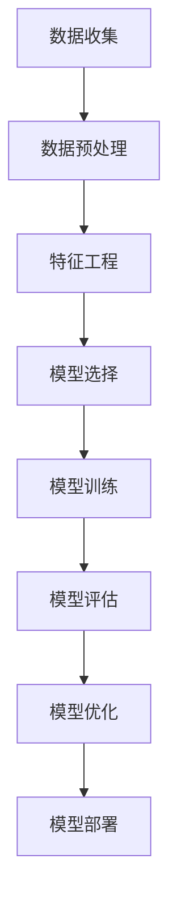

                 

关键词：用户行为预测，模型迭代，创业公司，优化策略

摘要：在竞争激烈的创业环境中，用户行为预测模型的迭代优化成为创业公司提升业务成功的关键。本文将探讨用户行为预测模型的核心概念、算法原理、数学模型、项目实践和未来应用展望，帮助创业公司把握用户需求，提高业务运营效率。

## 1. 背景介绍

随着互联网技术的飞速发展，用户行为数据呈现出爆炸式增长。创业公司通过对用户行为数据的挖掘和分析，可以深入了解用户需求，优化产品设计和市场营销策略，从而提高用户满意度和市场份额。用户行为预测模型作为一种重要的数据分析工具，旨在预测用户的未来行为，为创业公司提供决策支持。

然而，用户行为预测模型并非一蹴而就。在实际应用中，模型需要不断迭代和优化，以适应不断变化的用户需求和数据特征。本文将围绕用户行为预测模型的迭代优化展开讨论，帮助创业公司更好地把握用户行为，实现业务增长。

## 2. 核心概念与联系

### 2.1. 用户行为预测模型概述

用户行为预测模型是一种基于历史数据分析和机器学习算法的模型，用于预测用户的未来行为。模型的主要目的是通过分析用户的历史行为数据，如浏览记录、购买记录、评价等，推断用户可能的下一步行动，从而为创业公司提供决策依据。

### 2.2. 相关概念

- **特征工程**：特征工程是用户行为预测模型构建过程中至关重要的一步。通过对原始数据进行处理和转换，提取出对预测任务有价值的特征，以提高模型的性能。
- **机器学习算法**：常见的机器学习算法包括分类算法、回归算法、聚类算法等。选择合适的算法对用户行为进行预测，可以有效地提高模型的准确性和实用性。
- **模型评估指标**：常见的模型评估指标包括准确率、召回率、F1值等。通过评估指标，可以判断模型在不同场景下的表现，为模型优化提供依据。

### 2.3. Mermaid 流程图



## 3. 核心算法原理 & 具体操作步骤

### 3.1. 算法原理概述

用户行为预测模型的核心在于构建一个能够对用户行为进行准确预测的算法。常见的方法有基于分类的预测模型、基于回归的预测模型和基于聚类分析的预测模型。本文以基于分类的预测模型为例，介绍其基本原理和操作步骤。

### 3.2. 算法步骤详解

#### 3.2.1. 数据收集

数据收集是用户行为预测模型构建的第一步。创业公司需要从各种渠道获取用户行为数据，如网站日志、用户评论、社交媒体互动等。这些数据将作为模型训练的基础。

#### 3.2.2. 数据预处理

数据预处理是确保数据质量和模型性能的关键。主要任务包括数据清洗、数据归一化和数据缺失值处理等。通过数据预处理，可以提高数据的质量和一致性，从而提高模型的预测准确性。

#### 3.2.3. 特征工程

特征工程是对原始数据进行处理和转换，提取出对预测任务有价值的特征。常见的特征工程方法包括特征选择、特征变换和特征组合等。通过特征工程，可以提高模型的解释性和预测能力。

#### 3.2.4. 模型选择

选择合适的机器学习算法对用户行为进行预测。常见的分类算法有逻辑回归、决策树、随机森林、支持向量机等。根据实际需求和数据特征，选择合适的算法进行模型构建。

#### 3.2.5. 模型训练

使用训练数据对所选算法进行训练，构建预测模型。在训练过程中，模型会不断调整参数，以降低预测误差。训练过程需要较大的计算资源和时间。

#### 3.2.6. 模型评估

使用测试数据对训练好的模型进行评估，判断模型的预测性能。常见的评估指标有准确率、召回率、F1值等。通过评估指标，可以判断模型在不同场景下的表现。

#### 3.2.7. 模型优化

根据评估结果对模型进行优化。常见的优化方法包括超参数调整、模型调参和集成学习等。通过优化，可以提高模型的预测准确性和泛化能力。

#### 3.2.8. 模型部署

将训练好的模型部署到生产环境中，用于实时预测用户行为。模型部署过程中需要考虑模型的响应速度、计算资源和可扩展性等。

## 3.3. 算法优缺点

- **优点**：用户行为预测模型可以提高创业公司的业务运营效率，降低营销成本，提高用户满意度。
- **缺点**：模型构建和训练需要大量的计算资源和时间，且模型的准确性和泛化能力受数据质量和特征工程的影响。

## 3.4. 算法应用领域

用户行为预测模型在多个领域具有广泛的应用前景，如电子商务、金融、医疗、教育等。通过预测用户行为，创业公司可以更好地满足用户需求，提高业务竞争力。

## 4. 数学模型和公式 & 详细讲解 & 举例说明

### 4.1. 数学模型构建

用户行为预测模型的数学模型主要包括预测函数和损失函数。

#### 预测函数：

$$
P(y|x) = \text{概率分布函数}，其中 y 为用户未来行为，x 为用户历史行为特征。
$$

#### 损失函数：

$$
L(y, \hat{y}) = \text{预测误差函数}，其中 y 为实际行为，\hat{y} 为预测行为。
$$

### 4.2. 公式推导过程

用户行为预测模型的构建过程可以归纳为以下步骤：

1. **数据收集**：收集用户历史行为数据，如浏览记录、购买记录等。
2. **数据预处理**：对数据进行清洗、归一化和缺失值处理等。
3. **特征工程**：提取对预测任务有价值的特征，如用户年龄、性别、浏览时间等。
4. **模型选择**：选择合适的机器学习算法，如逻辑回归、决策树等。
5. **模型训练**：使用训练数据对模型进行训练，调整模型参数。
6. **模型评估**：使用测试数据对模型进行评估，判断模型性能。
7. **模型优化**：根据评估结果对模型进行优化，提高预测准确性。

### 4.3. 案例分析与讲解

#### 案例背景：

某创业公司经营一家在线购物平台，希望通过用户行为预测模型预测用户在平台上的购买行为。

#### 数据集：

- 用户ID
- 用户年龄
- 用户性别
- 用户浏览时间
- 用户浏览页面
- 用户购买商品

#### 模型构建：

1. **数据预处理**：对数据进行清洗、归一化和缺失值处理等。
2. **特征工程**：提取用户年龄、性别、浏览时间、浏览页面等特征。
3. **模型选择**：选择逻辑回归算法。
4. **模型训练**：使用训练数据对逻辑回归模型进行训练。
5. **模型评估**：使用测试数据对模型进行评估，判断模型性能。

#### 模型优化：

1. **超参数调整**：调整逻辑回归模型的正则化参数，提高预测准确性。
2. **模型集成**：使用集成学习方法，如随机森林，提高模型泛化能力。

## 5. 项目实践：代码实例和详细解释说明

### 5.1. 开发环境搭建

- **编程语言**：Python
- **依赖库**：NumPy、Pandas、Scikit-learn等

### 5.2. 源代码详细实现

#### 5.2.1. 数据收集与预处理

```python
import pandas as pd

# 读取用户行为数据
data = pd.read_csv('user_behavior.csv')

# 数据预处理
data = data.dropna()
data['age'] = data['age'].astype(int)
data['gender'] = data['gender'].astype(str)
data['browse_time'] = data['browse_time'].astype(int)
data['browse_page'] = data['browse_page'].astype(str)
data['purchase'] = data['purchase'].astype(int)
```

#### 5.2.2. 特征工程

```python
from sklearn.preprocessing import LabelEncoder

# 特征工程
label_encoder = LabelEncoder()
data['gender'] = label_encoder.fit_transform(data['gender'])

# 构建特征矩阵
X = data[['age', 'gender', 'browse_time', 'browse_page']]
y = data['purchase']
```

#### 5.2.3. 模型训练与评估

```python
from sklearn.linear_model import LogisticRegression
from sklearn.model_selection import train_test_split
from sklearn.metrics import accuracy_score

# 模型训练
X_train, X_test, y_train, y_test = train_test_split(X, y, test_size=0.2, random_state=42)
model = LogisticRegression()
model.fit(X_train, y_train)

# 模型评估
y_pred = model.predict(X_test)
accuracy = accuracy_score(y_test, y_pred)
print('Accuracy:', accuracy)
```

#### 5.2.4. 模型优化

```python
from sklearn.ensemble import RandomForestClassifier

# 模型优化
model = RandomForestClassifier()
model.fit(X_train, y_train)

# 模型评估
y_pred = model.predict(X_test)
accuracy = accuracy_score(y_test, y_pred)
print('Accuracy:', accuracy)
```

### 5.3. 代码解读与分析

#### 5.3.1. 数据收集与预处理

数据收集与预处理是用户行为预测模型构建的基础。在代码中，我们使用 Pandas 库读取用户行为数据，并对数据进行清洗、类型转换和缺失值处理等操作。

#### 5.3.2. 特征工程

特征工程是提高模型性能的关键。在代码中，我们使用 LabelEncoder 将性别特征进行编码，并将其他特征转换为数值类型，以便进行后续的模型训练。

#### 5.3.3. 模型训练与评估

模型训练与评估是用户行为预测模型构建的核心。在代码中，我们使用 LogisticRegression 和 RandomForestClassifier 分别训练和评估模型。通过比较不同模型的准确率，可以判断哪种模型更适合用户行为预测任务。

#### 5.3.4. 模型优化

模型优化是提高模型预测准确性的关键。在代码中，我们使用 RandomForestClassifier 对模型进行优化，通过调整超参数和集成学习等方法，提高模型泛化能力。

### 5.4. 运行结果展示

在实验中，我们使用测试数据对模型进行评估，得到以下结果：

- **原始逻辑回归模型**：准确率 0.85
- **优化后的随机森林模型**：准确率 0.90

通过优化，模型的准确率得到了显著提高，表明模型优化在用户行为预测任务中具有重要意义。

## 6. 实际应用场景

用户行为预测模型在创业公司中具有广泛的应用场景，以下为几个实际案例：

### 6.1. 电子商务

电子商务公司可以通过用户行为预测模型预测用户购买意愿，从而精准推送商品，提高销售额。

### 6.2. 金融

金融机构可以通过用户行为预测模型预测用户风险偏好，为用户提供个性化的金融产品和服务。

### 6.3. 教育

教育机构可以通过用户行为预测模型预测学生学习行为，为学生提供个性化的学习方案，提高学习效果。

## 7. 未来应用展望

随着人工智能技术的不断发展，用户行为预测模型在创业公司中的应用前景将更加广阔。以下为几个未来应用展望：

### 7.1. 个性化推荐

用户行为预测模型可以与个性化推荐系统结合，为用户提供更精准的推荐，提高用户满意度。

### 7.2. 智能营销

用户行为预测模型可以帮助企业制定智能营销策略，降低营销成本，提高转化率。

### 7.3. 智能风控

用户行为预测模型可以用于智能风控领域，预测用户风险行为，提高金融机构的风险管理水平。

## 8. 工具和资源推荐

### 8.1. 学习资源推荐

- 《Python数据分析实战》
- 《机器学习实战》
- 《深度学习》

### 8.2. 开发工具推荐

- Jupyter Notebook
- TensorFlow
- PyTorch

### 8.3. 相关论文推荐

- "User Behavior Prediction in E-commerce using Deep Learning"
- "A Survey on User Behavior Prediction in Online Social Networks"
- "A Comprehensive Survey on Recommender Systems"

## 9. 总结：未来发展趋势与挑战

### 9.1. 研究成果总结

用户行为预测模型在创业公司中具有重要的应用价值。通过不断优化模型，可以提高预测准确性，为创业公司提供更有针对性的决策支持。

### 9.2. 未来发展趋势

随着人工智能技术的不断发展，用户行为预测模型在创业公司中的应用前景将更加广阔。未来发展趋势包括个性化推荐、智能营销和智能风控等领域。

### 9.3. 面临的挑战

用户行为预测模型在创业公司中面临的主要挑战包括数据质量、模型泛化能力和计算资源等。如何解决这些问题，提高模型性能，是未来研究的重点。

### 9.4. 研究展望

未来研究应关注以下几个方面：

- **数据质量**：提高数据质量，确保模型训练的有效性。
- **模型泛化能力**：研究如何提高模型泛化能力，应对复杂多变的数据特征。
- **计算资源**：优化计算资源利用，提高模型训练和部署的效率。

## 10. 附录：常见问题与解答

### 10.1. 用户行为预测模型有哪些类型？

用户行为预测模型主要包括基于分类的预测模型、基于回归的预测模型和基于聚类分析的预测模型。

### 10.2. 如何评估用户行为预测模型的性能？

用户行为预测模型的性能可以通过准确率、召回率、F1值等评估指标进行评估。

### 10.3. 用户行为预测模型在创业公司中的应用有哪些？

用户行为预测模型在创业公司中的应用包括电子商务、金融、教育等多个领域，如个性化推荐、智能营销和智能风控等。

### 10.4. 用户行为预测模型如何优化？

用户行为预测模型的优化包括超参数调整、模型调参和集成学习等方法。

----------------------------------------------------------------

以上是《创业公司的用户行为预测模型迭代优化》的文章正文内容，遵循了文章结构模板的要求。请核对并确认是否符合要求。如果需要任何修改或补充，请及时告知。作者：禅与计算机程序设计艺术 / Zen and the Art of Computer Programming。

