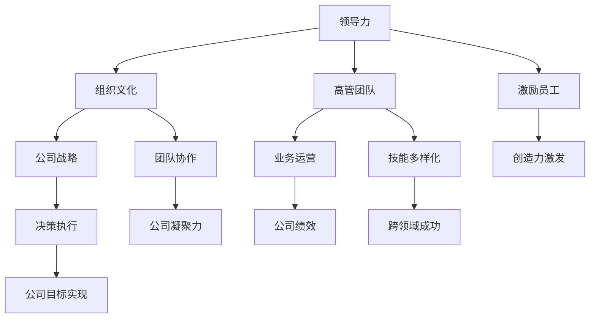

                 

### 背景介绍

创业公司在现代经济中扮演着至关重要的角色。它们不仅是创新和技术进步的源泉，也是就业机会的重要提供者。然而，创业公司的成功并不总是理所当然的。在激烈的竞争环境中，除了独特的产品和服务外，有效的领导力和强大的人力资源管理是确保公司成功的关键因素之一。

领导力在创业公司的成长过程中起着核心作用。它不仅仅是指导和管理员工的能力，更是一种能够激发团队潜力、凝聚人心和推动公司发展的力量。创业公司的领导者不仅要具备战略眼光和决策能力，还需要有激励团队、处理危机和持续学习的素质。

本文将深入探讨创业公司的领导力发展及其高管团队建设。我们将从以下几个方面展开：

1. **领导力的核心概念和重要性**：解释领导力的基本概念，阐述其在创业公司发展中的核心地位。
2. **创业公司领导力的特点**：分析创业公司领导力的独特性，与成熟企业领导力的区别。
3. **领导力发展的路径和策略**：探讨如何通过培训、学习和发展计划提升领导力。
4. **高管团队建设的重要性**：解释高管团队在公司战略规划、决策执行中的关键角色。
5. **构建高效高管团队的方法**：提供具体步骤和策略，帮助创业公司建立和管理高效的领导团队。

通过上述内容的逐步探讨，我们希望能够帮助创业者更好地理解领导力和高管团队建设的重要性，并提供实用的指导建议。

### 核心概念与联系

为了深入理解创业公司的领导力及其高管团队建设，我们需要明确几个核心概念，并探讨它们之间的联系。

#### 领导力

领导力是一种影响力，能够激发他人追随并共同努力实现目标的能力。它不仅仅是权力或职位，更是一种通过沟通、激励和决策来引导团队的行为和方向的能力。领导力可以表现为多种形式，包括愿景领导、变革领导、团队领导和危机领导等。

#### 组织文化

组织文化是公司的价值观、信仰和行为规范的总和，它是公司内部的“精神氛围”。健康的组织文化能够促进员工之间的信任和协作，提高整体绩效，并增强公司的凝聚力。

#### 高管团队

高管团队是指在公司高层管理层的核心成员，他们负责制定公司战略、监督业务运营和管理关键资源。一个高效的高管团队需要具备多样化的技能、经验和背景，以确保公司在不同领域都能取得成功。

#### 领导力与组织文化的联系

领导力与组织文化密切相关。领导者通过其行为和决策塑造公司文化，而公司文化又反过来影响领导力的实施效果。例如，一个以创新为核心的公司文化可能会鼓励领导者更加开放和包容，从而激发员工的创造力。

#### 高管团队与领导力的联系

高管团队是领导力的具体执行者。他们的决策和行动直接关系到公司的战略方向和运营效果。高效的高管团队能够确保领导力在公司内部得到有效贯彻，并通过协作和沟通推动公司实现目标。

#### Mermaid 流程图

为了更好地展示这些核心概念之间的联系，我们可以使用Mermaid流程图来描述：



在这个流程图中，领导力作为核心，通过影响组织文化和高管团队，最终影响公司的战略、业务运营和绩效，并推动公司目标的实现。

通过上述核心概念及其联系的探讨，我们能够更好地理解创业公司领导力发展的复杂性和重要性。接下来，我们将深入探讨创业公司领导力的特点，以便为后续的领导力发展策略提供基础。

#### 创业公司领导力的特点

创业公司领导力与成熟企业领导力之间存在显著差异，这些差异源于创业环境的独特性。理解这些特点对于创业公司的领导者来说至关重要，因为它们不仅决定了公司的成功与否，也影响了团队的动力和凝聚力。

##### 1. 持续变化

创业公司通常处于快速变化的环境中，市场、技术和竞争格局都在不断演变。这种环境要求领导力具备高度适应性，能够迅速响应外部变化，调整公司战略和运营模式。与此相比，成熟企业通常有较为稳定的运营环境，领导力的重点更多在于持续优化和维持现有业务。

**例子**：一家初创公司可能在成立初期需要频繁调整产品方向和市场策略，以应对用户需求和市场趋势的变化。这种情况下，领导者的决策速度和灵活性至关重要。

##### 2. 高度不确定

创业公司面临着诸多不确定因素，包括资金、市场需求和竞争对手等。这种不确定性要求领导者具备强烈的愿景和远见，能够预见潜在的机会和挑战，并制定相应的应对策略。成熟企业则通常在相对确定的市场环境中运营，不确定性较低。

**例子**：一个初创公司在产品研发过程中可能会面临技术难题或市场反馈不佳的风险，领导者需要具备处理这些不确定性的能力，以确保公司能够持续发展。

##### 3. 资源有限

创业公司通常在资源和资金上较为有限，这要求领导者具备资源管理能力，能够最大化利用有限的资源实现目标。与此相比，成熟企业通常拥有更丰富的资源，领导者更多关注如何优化资源配置。

**例子**：一家初创公司在初创阶段可能需要通过低成本、高效的方式来推广产品，领导者需要善于利用社交媒体、用户口碑等低成本渠道来扩大市场影响力。

##### 4. 灵活与自主

创业公司通常拥有更为灵活的决策结构和组织形式，领导者需要具备自主决策和快速行动的能力。这种灵活性使得创业公司能够迅速响应市场变化，但同时也要求领导者具备较高的自律性和责任感。

**例子**：在创业公司中，领导者可能需要频繁参与业务一线的工作，同时负责战略规划和决策制定。这种情况下，领导者需要具备良好的时间管理和自我驱动能力。

##### 5. 亲力亲为

创业公司领导者通常需要亲力亲为，深入参与公司的各个层面，从产品开发到市场营销，再到客户服务。这种全面的参与有助于领导者更好地理解公司的运营情况，但同时也对领导者提出了更高的要求。

**例子**：一位创业公司的CEO可能需要亲自与客户沟通，了解客户的需求和反馈，从而指导产品开发团队的改进方向。这种直接的互动有助于确保公司能够更好地满足市场需求。

##### 6. 风险承受能力

创业公司领导者需要具备较高的风险承受能力，因为创业本身就伴随着风险。这种风险不仅体现在财务上，还包括市场不确定性、技术挑战和人力资源等方面。领导者需要能够在面对风险时做出明智的决策，并带领团队克服困难。

**例子**：在市场不稳定的情况下，领导者可能需要决定是否继续投资新产品开发，或者调整市场策略。这种决策需要对市场趋势、技术前景和公司资源进行全面评估。

通过上述分析，我们可以看出，创业公司领导力具有独特性，其核心在于适应变化、管理不确定性、高效利用资源、灵活自主、亲力亲为和高风险承受能力。理解这些特点有助于创业公司领导者更好地应对挑战，推动公司持续发展。在接下来的章节中，我们将探讨如何通过有效的领导力发展策略来提升创业公司的竞争力。

#### 领导力发展的路径和策略

在了解了创业公司领导力的特点之后，我们需要探讨如何通过有效的领导力发展路径和策略来提升领导力，从而为创业公司的发展奠定坚实基础。

##### 1. 培训和学习计划

培训和学习是提升领导力的基础。创业公司可以通过多种方式为领导者提供培训和学习机会，包括内部培训、外部培训和在线学习。

- **内部培训**：内部培训可以由公司内部专家或领导进行，内容涵盖领导力基础、团队管理、战略规划等。这种培训方式有助于加强领导者的公司文化认同感和组织归属感。
  
- **外部培训**：外部培训通常由专业的培训机构或顾问提供，内容包括领导力课程、管理培训和工作坊。这些培训可以帮助领导者获得更广泛的管理知识和实践经验。

- **在线学习**：随着互联网技术的发展，在线学习成为了一种便捷且成本较低的学习方式。创业公司可以利用在线课程、电子书籍、在线研讨会等资源来提升领导者的专业技能和知识水平。

##### 2. 实践经验

领导力的提升不仅需要理论知识，更需要通过实践经验来验证和应用。创业公司可以通过以下几种方式为领导者提供实践经验：

- **轮岗机会**：通过轮岗，领导者可以在不同部门和岗位上工作，了解公司的整体运营和业务流程。这种经历有助于提升领导者的跨部门沟通能力和全局观念。

- **项目管理**：项目负责人或项目经理的经历是提升领导力的有效途径。领导者可以通过负责项目来培养决策能力、沟通能力和问题解决能力。

- **参与外部项目**：参与外部项目或行业合作可以帮助领导者拓展视野，了解行业动态和最佳实践。这种外部视角对于公司战略规划和领导力发展具有重要意义。

##### 3. 反馈和评估

有效的反馈和评估机制是提升领导力的重要环节。创业公司可以通过以下方式来建立反馈和评估机制：

- **定期反馈**：定期与领导者进行一对一的反馈会议，了解他们在工作中的表现和遇到的挑战。这种反馈可以帮助领导者认识到自己的优势和不足，从而制定改进计划。

- **360度评估**：通过360度评估，收集来自同事、下属和上级的反馈，全面了解领导者的表现。这种评估方式有助于提供更全面的视角，帮助领导者识别和改进自己的问题。

- **关键绩效指标（KPI）**：设定关键绩效指标，对领导者的工作表现进行量化评估。这些指标可以包括团队绩效、项目完成度、员工满意度等。

##### 4. 培养领导力文化

领导力不仅仅是领导者的个人素质，也是整个公司文化的一部分。创业公司可以通过以下方式来培养领导力文化：

- **领导力榜样**：树立领导力榜样，通过内部宣传和培训活动，让领导者分享他们的成功经验和失败教训，激发其他员工的领导潜力。

- **领导力发展计划**：制定系统的领导力发展计划，包括领导力课程、导师指导、领导力竞赛等，为员工提供全方位的领导力培养机会。

- **领导力实践机会**：为员工提供参与领导力实践的机会，如担任项目负责人、组织团队活动等，让他们在实践中提升领导能力。

##### 5. 长期视角

领导力发展不是一蹴而就的过程，需要长期规划和持续投入。创业公司需要从长期视角出发，为领导力的培养和发展制定长期战略：

- **人才梯队建设**：建立人才梯队，培养潜在领导者，确保公司未来领导力的可持续发展。

- **领导力发展路径**：明确领导者的职业发展路径，为他们提供明确的晋升和职业发展机会，激励他们不断提升自己的领导能力。

- **持续投资**：持续投资于领导力发展，包括培训、实践和反馈等，确保领导力不断提升，适应公司发展的需要。

通过上述路径和策略，创业公司可以有效地提升领导力，为公司的长期发展奠定坚实基础。接下来，我们将探讨高管团队建设的重要性，并分析如何构建一个高效的高管团队。

#### 高管团队建设的重要性

在创业公司中，高管团队的建设是确保公司战略有效执行和持续发展的关键因素。一个高效的高管团队能够在公司面临挑战时提供强有力的支持，推动公司实现目标。以下是高管团队建设的重要性及其对公司战略规划和决策执行的影响：

##### 1. 公司战略的制定与执行

高管团队是公司战略的制定者和执行者。一个高效的团队需要具备多样化的技能、经验和背景，以确保公司能够在不同领域都取得成功。高管团队通过协作和沟通，能够将公司的愿景和目标转化为具体的战略计划，并确保这些计划得以有效执行。

- **战略规划**：高管团队负责制定公司的长期战略和短期目标，确保公司的发展方向与市场趋势和公司资源相匹配。通过跨部门协作，高管团队能够综合考虑公司的各个方面，制定出全面的战略规划。

- **执行监督**：高管团队在战略执行过程中扮演监督和协调的角色，确保各部门按照既定的计划推进工作，及时发现和解决执行中的问题。这种监督和协调能力对于确保公司战略的顺利实施至关重要。

##### 2. 决策制定与风险控制

高管团队在决策过程中发挥着核心作用。他们需要具备快速、准确和果断的决策能力，以便在复杂和变化多端的环境中做出明智的选择。

- **快速决策**：在创业公司中，市场变化和竞争态势往往变化迅速，高管团队需要具备快速决策的能力，及时响应市场变化，抓住机遇或应对挑战。

- **风险控制**：创业公司面临诸多不确定性，高管团队需要在决策过程中充分考虑潜在风险，并制定相应的风险控制措施。这种风险意识和管理能力有助于公司在面临不确定性时做出更为稳健的决策。

##### 3. 资源整合与优化

高管团队是公司资源整合和优化的关键。他们需要能够协调各部门的资源，确保公司资源得到最大化的利用。

- **资源整合**：高管团队需要具备跨部门协调和沟通的能力，确保公司各部门之间的资源能够有效整合，避免资源浪费和重复建设。

- **资源优化**：高管团队需要具备资源优化能力，通过合理配置和利用公司资源，提高公司的整体效率和竞争力。这种资源优化能力有助于公司在有限资源下实现最大化产出。

##### 4. 激励与团队建设

高管团队不仅要关注公司的战略和运营，还需要注重团队建设和员工激励。

- **团队建设**：一个高效的高管团队能够营造积极、协作的工作氛围，促进团队成员之间的沟通和合作。这种团队建设能力有助于提升团队的整体绩效和士气。

- **员工激励**：高管团队需要具备激励员工的技能，通过提供竞争性的薪酬福利、职业发展机会和奖励机制，激发员工的积极性和创造力。这种员工激励能力有助于留住核心人才，并吸引更多优秀的人才加入公司。

##### 5. 面对挑战与危机管理

创业公司难免会遇到各种挑战和危机，高管团队需要具备应对这些挑战和危机的能力。

- **危机管理**：高管团队需要具备快速应对危机的能力，通过有效的危机管理策略，将危机对公司的影响降到最低。这种危机管理能力有助于维护公司的声誉和市场地位。

- **长期规划**：在应对挑战和危机的同时，高管团队还需要具备长远规划的能力，确保公司在度过危机后能够持续发展。这种长期规划能力有助于公司在波动中保持稳定，实现可持续发展。

通过上述分析，我们可以看到高管团队建设对创业公司的重要性。一个高效的高管团队能够为公司提供战略指导、决策支持、资源整合、团队建设和危机应对等多方面的支持，确保公司能够在激烈的市场竞争中立于不败之地。在接下来的章节中，我们将探讨如何通过具体的方法和策略来构建一个高效的高管团队。

#### 构建高效高管团队的方法

要构建一个高效的高管团队，创业公司需要从多个方面入手，包括招聘、培养、激励和协作。以下是一些关键的方法和策略，帮助创业公司在构建和管理高管团队时更加成功。

##### 1. 招聘多样化与技能互补

高效的高管团队应该由多样化的人才组成，包括不同背景、经验和技能的人。这种多样化不仅能够带来多元化的视角和想法，还能确保团队在面对复杂问题时具备更全面的技能。

- **技能互补**：高管团队成员应具备互补的技能和经验，以确保团队在各个关键领域都有覆盖。例如，一个团队可能需要同时拥有战略规划、技术、市场营销和财务管理的专家。
  
- **背景多样化**：不同背景的成员能够带来不同的文化和工作经验，有助于公司在全球化和多元化市场中更具竞争力。

##### 2. 培养领导力和管理能力

高管团队成员需要不断发展和提升自己的领导力和管理能力。这可以通过以下几种方式实现：

- **内部培训**：公司可以定期组织领导力和管理培训，邀请内部或外部专家进行讲座和研讨会，提高团队成员的专业技能和领导能力。

- **导师制度**：为高管团队成员配备导师，可以帮助他们更快地学习和成长。导师不仅能够提供职业指导，还能在关键时刻提供支持和建议。

- **轮岗和跨部门项目**：通过轮岗和跨部门项目，团队成员可以在不同的岗位上学习和成长，拓宽视野，提高综合能力。

##### 3. 设定清晰的目标和期望

为了确保高管团队的工作高效，公司需要设定清晰的目标和期望。这包括：

- **公司愿景和使命**：明确公司的长期愿景和使命，确保高管团队在战略决策和执行过程中始终与公司目标保持一致。

- **个人目标**：为每个团队成员设定清晰的个人目标，确保他们的工作与公司目标紧密相连，并能够推动公司整体发展。

- **定期评估**：定期对高管团队成员的工作进行评估，确保他们的绩效与公司的期望相符，并根据评估结果进行反馈和调整。

##### 4. 激励和奖励机制

高效的团队离不开有效的激励和奖励机制。创业公司可以通过以下方式激励高管团队：

- **竞争性薪酬**：提供有竞争力的薪酬和福利，确保团队成员能够得到公平的报酬，并保持公司对人才的吸引力。

- **股权激励**：通过股权激励计划，让团队成员分享公司成功的成果，增强他们的归属感和忠诚度。

- **奖励和认可**：定期为团队成员提供奖励和认可，表彰他们的出色表现和贡献，激发他们的工作热情和积极性。

##### 5. 促进团队协作和沟通

高效的高管团队需要具备良好的协作和沟通能力。这可以通过以下措施实现：

- **定期会议**：定期组织团队会议，确保团队成员能够保持沟通和协作，及时解决工作中的问题和挑战。

- **开放沟通**：鼓励团队成员之间开放和诚实的沟通，建立信任和尊重的氛围，避免信息孤岛和沟通障碍。

- **团队合作项目**：通过团队合作项目，促进团队成员之间的协作和互动，培养团队精神和合作能力。

##### 6. 建立良好的组织文化

组织文化是高效团队的基础。创业公司可以通过以下方式建立积极的组织文化：

- **共同价值观**：明确公司的共同价值观，确保团队成员在价值观上保持一致，形成共同的目标和信念。

- **鼓励创新和失败**：鼓励团队成员勇于创新和尝试，同时也接受失败，营造一个包容和开放的工作环境。

- **尊重和多样性**：尊重团队成员的多样性，包括背景、观点和文化差异，促进团队的创新和协作。

通过上述方法和策略，创业公司可以构建一个高效、协作和具有竞争力的高管团队，为公司的长期成功奠定坚实基础。接下来，我们将通过具体的代码实例，展示如何利用技术工具来支持高管团队的建设。

#### 高效高管团队建设的代码实例

在实际操作中，利用技术工具可以显著提升高管团队的建设效率。以下是一个具体的代码实例，展示了如何使用现代开发工具和框架来支持高管团队的工作。

##### 1. 开发环境搭建

为了搭建一个高效的高管团队工作环境，我们首先需要配置必要的开发工具和框架。以下是一个基本的步骤说明：

- **操作系统**：建议使用Linux系统，如Ubuntu或CentOS，以提高系统的稳定性和安全性。
- **代码管理工具**：使用Git进行代码管理，确保团队成员能够协作开发并保持代码的版本控制。
- **集成开发环境（IDE）**：推荐使用Visual Studio Code或Eclipse，这两个IDE具有丰富的插件和功能，能够提供良好的开发体验。
- **持续集成/持续部署（CI/CD）工具**：使用Jenkins或GitLab CI等工具，实现自动化测试和部署，提高开发效率。

以下是一个简单的Git仓库初始化和配置的命令示例：

```bash
# 安装Git
sudo apt-get install git

# 创建新的Git仓库
mkdir high-perf-team-project
cd high-perf-team-project
git init

# 配置用户信息
git config --global user.name "YourName"
git config --global user.email "youremail@example.com"

# 添加一个README文件
touch README.md
echo "Welcome to the High-Performance Team Project!" >> README.md
git add README.md
git commit -m "Initial commit"

# 添加远程仓库（假设已有GitHub或GitLab仓库）
git remote add origin https://github.com/yourusername/high-perf-team-project.git
git push -u origin master
```

##### 2. 源代码详细实现

在这个高管团队项目中，我们将使用Python编写一个简单的任务管理器，以便团队成员能够方便地跟踪任务进度和协作。以下是一个基本的代码示例：

```python
# high_perf_team_project/task_manager.py

import datetime

class TaskManager:
    def __init__(self):
        self.tasks = []

    def add_task(self, task_name, deadline, assignee):
        new_task = {
            'name': task_name,
            'deadline': datetime.datetime.strptime(deadline, '%Y-%m-%d'),
            'assignee': assignee,
            'status': 'pending'
        }
        self.tasks.append(new_task)
        return f"Task '{task_name}' added successfully."

    def update_task_status(self, task_name, status):
        for task in self.tasks:
            if task['name'] == task_name:
                task['status'] = status
                return f"Task '{task_name}' status updated to '{status}'."
        return "Task not found."

    def get_tasks_by_assignee(self, assignee):
        assigned_tasks = [task for task in self.tasks if task['assignee'] == assignee]
        return assigned_tasks

    def list_all_tasks(self):
        return self.tasks

# 示例使用
if __name__ == "__main__":
    manager = TaskManager()
    print(manager.add_task("Design new website", "2023-12-31", "Alice"))
    print(manager.add_task("Finalize marketing plan", "2024-01-15", "Bob"))
    print(manager.update_task_status("Design new website", "in progress"))
    print(manager.get_tasks_by_assignee("Alice"))
    print(manager.list_all_tasks())
```

##### 3. 代码解读与分析

上述代码实现了一个简单的任务管理器，主要功能包括添加任务、更新任务状态、按分配人获取任务列表以及列出所有任务。

- **添加任务**：`add_task` 方法用于添加新的任务，包括任务名称、截止日期和分配人。
- **更新任务状态**：`update_task_status` 方法用于更新指定任务的当前状态。
- **按分配人获取任务列表**：`get_tasks_by_assignee` 方法用于获取指定分配人的所有任务。
- **列出所有任务**：`list_all_tasks` 方法用于获取当前所有任务的列表。

这些功能可以帮助团队成员有效地管理任务，确保项目按时完成。

##### 4. 运行结果展示

假设团队成员Alice和Bobby分别被分配了设计新网站和市场策划任务，以下是如何使用任务管理器的示例：

```python
# 初始化任务管理器
manager = TaskManager()

# 添加任务
print(manager.add_task("Design new website", "2023-12-31", "Alice"))
print(manager.add_task("Finalize marketing plan", "2024-01-15", "Bob"))

# 更新任务状态
print(manager.update_task_status("Design new website", "in progress"))

# 获取Alice的任务列表
print(manager.get_tasks_by_assignee("Alice"))

# 列出所有任务
print(manager.list_all_tasks())
```

输出结果：

```
Task 'Design new website' added successfully.
Task 'Finalize marketing plan' added successfully.
Task 'Design new website' status updated to 'in progress'.
[{'name': 'Design new website', 'deadline': datetime.datetime(2023, 12, 31, 0, 0), 'assignee': 'Alice', 'status': 'in progress'}, {'name': 'Finalize marketing plan', 'deadline': datetime.datetime(2024, 1, 15, 0, 0), 'assignee': 'Bob', 'status': 'pending'}]
[{'name': 'Design new website', 'deadline': datetime.datetime(2023, 12, 31, 0, 0), 'assignee': 'Alice', 'status': 'in progress'}, {'name': 'Finalize marketing plan', 'deadline': datetime.datetime(2024, 1, 15, 0, 0), 'assignee': 'Bob', 'status': 'pending'}]
```

通过这个简单的任务管理器，团队成员可以方便地跟踪任务进度，确保工作高效有序。

#### 实际应用场景

在创业公司中，高效高管团队的建设不仅对于公司内部运作至关重要，还能在市场竞争中发挥关键作用。以下是一些实际应用场景，展示了高管团队建设的重要性及其带来的实际效益。

##### 1. 项目管理和决策效率

在一个创业公司中，高管团队的有效协作对于项目的成功至关重要。例如，一家开发智能家居设备的初创公司，其高管团队需要迅速制定产品开发计划，并在资源有限的情况下协调各个环节。通过高效的高管团队，公司可以确保从产品原型设计到市场推广的每个环节都能高效执行。

**案例**：某智能家居设备初创公司在开发智能门锁时，高管团队通过定期会议和高效决策，快速确定了产品规格、开发计划和营销策略。团队成员之间的良好沟通和协作使得项目进度得以顺利推进，最终产品在市场上获得了良好的反馈，为公司赢得了竞争优势。

##### 2. 战略规划和市场响应

创业公司需要不断调整和优化战略规划，以应对市场变化和竞争压力。一个高效的高管团队能够快速分析市场趋势，制定灵活的战略应对方案。

**案例**：某新兴科技公司面对激烈的竞争环境，高管团队通过市场调研和数据分析，及时调整产品定价策略和市场推广策略。通过团队的协作，公司成功在竞争激烈的市场中站稳脚跟，实现了销售额的显著增长。

##### 3. 人力资源管理和激励

创业公司需要吸引和留住优秀的人才，以保持公司的发展动力。高效的高管团队在人力资源管理方面发挥着关键作用。

**案例**：一家提供企业服务的创业公司在招聘和激励员工方面采取了一系列措施。高管团队通过设置明确的职业发展路径和提供有竞争力的薪酬福利，吸引了大量优秀人才。同时，通过定期的员工培训和激励措施，公司成功地提高了员工满意度和工作效率。

##### 4. 应对挑战和危机

创业公司在发展过程中难免会遇到各种挑战和危机。一个高效的高管团队能够在关键时刻提供强有力的支持，帮助公司度过难关。

**案例**：某初创公司由于市场环境变化导致产品销售下滑，高管团队迅速召开紧急会议，分析了问题原因并制定了详细的应对措施。通过团队的协作，公司不仅成功地度过了危机，还通过市场调整和产品改进，重新赢得了市场份额。

##### 5. 创新和产品开发

创业公司的核心竞争力在于创新能力和产品开发速度。一个高效的高管团队能够推动创新，加速产品开发进程。

**案例**：一家健康食品初创公司通过高管团队的协作，迅速开发了多种新型健康食品。团队通过市场调研、消费者反馈和产品测试，不断优化产品配方和包装设计，最终推出了深受消费者喜爱的新产品，实现了销售额的快速增长。

通过上述实际应用场景，我们可以看到，高效高管团队建设对于创业公司的成功至关重要。一个高效、协作和富有创新精神的高管团队能够帮助公司在竞争激烈的市场中脱颖而出，实现持续增长。

### 工具和资源推荐

为了帮助创业者更好地理解和实践高管团队建设，以下是一些学习资源、开发工具和框架，以及相关的论文和著作推荐。

#### 学习资源

1. **书籍**：
   - 《领导力的五个层次》（John C. Maxwell）：详细介绍了领导力的五个层次，从自我领导到团队领导，提供了实用的领导力发展指南。
   - 《团队协作的艺术》（Katrina Collier）：探讨了团队协作的各个方面，包括沟通技巧、冲突解决和团队合作策略。

2. **在线课程**：
   - Coursera的“Leadership and Management”课程：由耶鲁大学提供，涵盖了领导力和管理的基础知识，适合初学者和有一定基础的创业者。
   - LinkedIn Learning的“Building an Effective Team”课程：提供了团队建设、领导力和团队合作的具体实践策略。

3. **博客和网站**：
   - Harvard Business Review：提供关于领导力和管理的最新研究和实践案例，对创业者有很高的参考价值。
   - Inc. Magazine：专注于创业和企业家精神，涵盖了高管团队建设、领导力培养等多方面的内容。

#### 开发工具和框架

1. **代码管理工具**：
   - Git：一个版本控制系统，广泛用于代码管理，支持协作开发。
   - GitHub：一个基于Git的代码托管平台，提供丰富的协作和社区功能。

2. **项目管理工具**：
   - Jira：一个灵活的项目管理工具，适合团队协作，提供任务跟踪、进度报告和报告生成功能。
   - Trello：一个简单直观的看板工具，适合团队任务管理和项目管理。

3. **持续集成/持续部署工具**：
   - Jenkins：一个开源的持续集成工具，支持多种插件，能够与各种开发工具和平台集成。
   - GitLab CI/CD：GitLab内置的持续集成和持续部署工具，能够自动化测试和部署流程。

#### 相关论文和著作

1. **论文**：
   - “Team-Based Learning: A Dynamic Model for Teaching and Assessing Clinical Skills” by David J. Smallhorn et al.：探讨了团队学习在医疗教育中的应用，提供了团队协作的有效模型。
   - “The Role of Team Learning in Innovation” by John H. Danner et al.：研究了团队学习在创新过程中的作用，指出团队合作对于创新成功的重要性。

2. **著作**：
   - 《领导力五项修炼》（Peter Senge）：介绍了系统思考在领导力发展中的应用，提供了有效的团队协作和管理策略。
   - 《变革之舞：团队合作的实践艺术》（Stew Friedman）：探讨了如何通过团队合作实现个人、团队和组织目标的平衡。

通过这些工具和资源的推荐，创业者可以更好地掌握高管团队建设的方法和策略，提升领导力和团队协作能力，从而推动公司持续发展。

### 总结：未来发展趋势与挑战

在分析了创业公司的领导力发展和高管团队建设之后，我们可以预见未来在这一领域中的几个重要发展趋势和面临的挑战。

#### 发展趋势

1. **数字化的领导力发展**：随着技术的进步，领导力发展将更加依赖于数字工具和平台。在线学习、虚拟培训和数字化评估将成为主流，帮助领导者更好地适应快速变化的环境。

2. **个性化领导力培养**：未来的领导力培养将更加注重个性化，通过定制化的学习路径和辅导计划，帮助领导者根据自身的特点和需求提升能力。

3. **多元化和包容性**：随着全球化和多元化趋势的加剧，创业公司将更加重视培养具有多元背景和思维的高管团队。这种多元化和包容性的领导团队将能够更好地适应全球市场的需求。

4. **持续学习的文化**：创业公司将在文化层面更加重视持续学习，鼓励员工不断自我提升，培养终身学习的习惯。这种学习文化将有助于公司在快速变化的市场环境中保持竞争优势。

#### 挑战

1. **领导力不足**：许多创业公司在快速发展过程中可能面临领导力不足的问题。如何识别和培养潜在领导者，成为公司面临的重大挑战。

2. **文化冲突**：多元化和全球化虽然带来了丰富的视角，但也可能导致文化冲突。如何管理这些冲突，保持团队凝聚力，是一个需要解决的难题。

3. **资源有限**：创业公司在资源和资金上通常有限，这限制了领导力发展和团队建设的投入。如何在不增加成本的情况下提升领导力和团队协作能力，是公司需要面对的挑战。

4. **快速变化的适应能力**：创业公司在快速变化的市场环境中需要具备极强的适应能力。如何保持灵活性和敏捷性，以应对市场和技术变革，是领导者和高管团队需要持续关注的挑战。

5. **领导力传承**：随着公司的发展，如何确保领导力的传承，培养新一代领导者，以确保公司长期稳定发展，是创业公司必须考虑的问题。

综上所述，创业公司在领导力发展和高管团队建设方面既面临机遇也面临挑战。未来，通过数字化工具和个性化培养，创业公司将能够更有效地提升领导力，应对快速变化的市场环境。同时，需要解决文化冲突、资源有限和适应能力不足等问题，以确保公司能够在激烈的市场竞争中持续发展。

### 附录：常见问题与解答

#### Q1：领导力发展与个人成长有何关系？

领导力发展是个人成长的重要组成部分。通过提升领导力，个人能够更好地理解自己的优势和劣势，提高决策能力和沟通技巧，从而在职业发展中取得更大的成功。领导力发展有助于个人建立自信，激发潜能，并在团队中发挥更大的作用。

#### Q2：如何评估领导力？

评估领导力可以通过多种方式，包括360度反馈、绩效评估、领导力测评工具和自我评估。这些方法可以提供多角度的反馈，帮助领导者识别自己的优点和改进空间。定期进行领导力评估有助于持续提升领导能力。

#### Q3：创业公司如何构建多元化的高管团队？

构建多元化的高管团队可以从以下几个方面入手：
1. **招聘多元化**：在招聘过程中注重多样性，确保招聘到不同背景、经验和技能的候选人。
2. **建立包容性文化**：鼓励开放和包容的工作环境，尊重不同观点和文化差异。
3. **培训和发展**：为团队成员提供跨文化沟通和团队合作培训，提高团队的整体协作能力。
4. **领导力榜样**：树立多元化领导力榜样，促进团队成员在不同文化背景中的领导能力发展。

#### Q4：创业公司如何处理文化冲突？

处理文化冲突可以通过以下策略：
1. **建立沟通渠道**：提供开放的沟通平台，鼓励团队成员表达观点和意见。
2. **文化敏感培训**：为团队成员提供文化敏感度培训，提高对不同文化的理解和尊重。
3. **调解和协商**：在冲突发生时，及时介入进行调解和协商，寻找双赢的解决方案。
4. **建立共同目标**：确保团队成员共同理解公司的愿景和目标，促进团结和协作。

通过以上问题和解答，我们希望能够为创业公司在领导力发展和高管团队建设方面提供实用的指导和建议。

### 扩展阅读与参考资料

为了进一步深入了解创业公司的领导力发展和高管团队建设，以下是一些扩展阅读和参考资料：

1. **书籍**：
   - 《创业维艰》（Ben Horowitz）：本书详细描述了创业过程中的挑战和困境，对于理解领导力在创业过程中的作用提供了宝贵的实践经验。
   - 《团队协作的力量》（Patrick Lencioni）：该书探讨了团队协作的重要性，提供了有效的团队建设策略和工具。

2. **论文**：
   - “Entrepreneurial Leadership: A Multifaceted Perspective” by Deborah M. Kolb and Antonia M. Guess：这篇论文从多个角度分析了创业领导力的复杂性和多样性。
   - “Building the Innovative Organization: The Role of Leadership” by Henry Chesbrough and John H. Danner：探讨了领导力在推动公司创新中的关键作用。

3. **在线资源**：
   - [Harvard Business Review](https://hbr.org/)：提供关于领导力和管理的最新研究、案例和观点。
   - [Startup Genome](https://www.startupgenomereport.com/)：提供关于创业公司增长和领导力的深度分析报告。

4. **网站**：
   - [LinkedIn Learning](https://www.linkedin.com/learning/)：提供丰富的在线课程和教程，涵盖领导力、团队建设等多个领域。
   - [Entrepreneur](https://www.entrepreneur.com/)：提供创业指导、案例分析和管理建议，对创业者具有很高的参考价值。

通过阅读这些书籍、论文和访问相关网站，创业者可以进一步了解领导力发展和高管团队建设的重要性和具体实践方法，从而更好地推动公司的发展。

