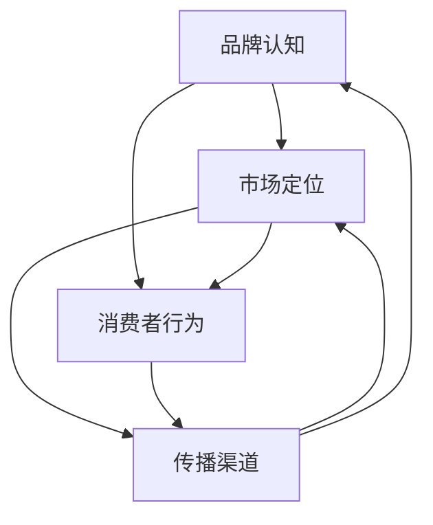
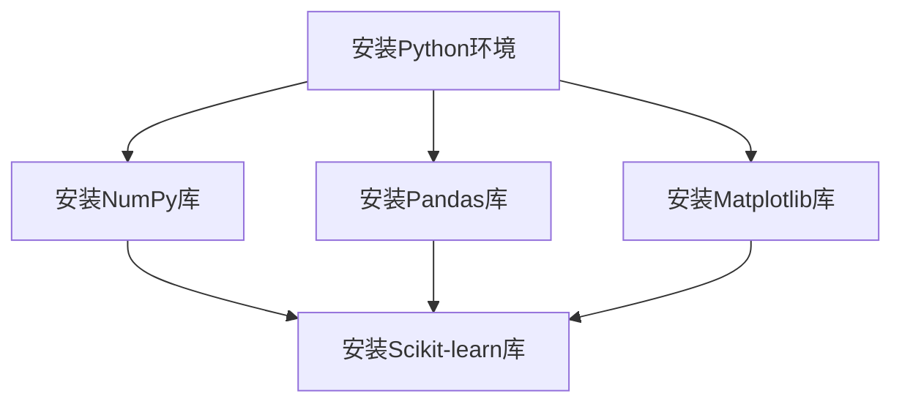

                 

### 背景介绍 Background

在当今竞争激烈的市场环境中，初创企业在进入市场初期面临着巨大的挑战。这些挑战不仅包括资金、人才和资源的短缺，更重要的是如何让潜在客户了解和接受他们的产品或服务。市场教育作为一种策略，可以帮助初创企业为市场铺路，提高品牌知名度，并最终促进产品的销售和市场份额的扩大。

市场教育（Market Education）是指通过一系列有目的的活动来提高消费者对产品或服务的认知、兴趣和购买意愿的过程。它不仅仅是一个简单的信息传递过程，而是一个复杂的互动和反馈系统。通过市场教育，初创企业可以：

1. **建立品牌信誉**：在市场中建立品牌信誉是初创企业成功的关键。有效的市场教育可以帮助企业在消费者心中树立一个正面、可靠和专业的形象。

2. **提高品牌知名度**：通过市场教育，初创企业能够将其品牌信息传递给更广泛的受众，从而提高品牌知名度。

3. **明确目标客户**：市场教育可以帮助企业识别和理解目标客户的需求和偏好，从而更加精准地定位市场。

4. **减少销售阻力**：当消费者对产品有足够的了解时，他们更可能克服购买决策中的疑虑和阻力。

5. **建立客户忠诚度**：通过持续的市场教育，企业可以培养客户的忠诚度，从而实现长期的客户关系。

然而，市场教育并不是一蹴而就的。它需要企业深入理解市场环境、目标客户，并制定一系列切实可行的策略和行动。本文将围绕创业初期如何进行有效的市场教育展开讨论，包括核心概念、实施步骤、数学模型和实际应用等多个方面。

接下来的章节中，我们将：

1. **介绍市场教育的核心概念和原理**，帮助读者理解市场教育的本质和重要性。

2. **详细讨论市场教育的具体实施步骤**，提供实际操作的方法和策略。

3. **讲解市场教育中的数学模型和公式**，帮助读者理解市场教育的量化分析。

4. **通过项目实践和代码实例**，展示市场教育在真实场景中的具体应用。

5. **探讨市场教育的实际应用场景**，分析市场教育在不同行业和领域的应用效果。

6. **推荐相关的学习资源和工具**，帮助读者深入了解市场教育相关领域的知识。

7. **总结市场教育的未来发展趋势和挑战**，为读者提供行业发展的前瞻性视角。

通过这篇文章，我们希望读者能够对市场教育有更深入的理解，并能够在创业初期有效地运用市场教育策略，助力企业的成长和发展。

### 核心概念与联系 Core Concepts and Relationships

市场教育的核心概念包括品牌认知、市场定位、消费者行为和传播渠道等。理解这些概念之间的关系对于有效实施市场教育至关重要。

**品牌认知（Brand Awareness）**：
品牌认知是市场教育的基石。它指的是消费者对某个品牌的存在和特点的记忆程度。高品牌认知意味着消费者更容易在需要时想到你的品牌，从而增加购买的可能性。品牌认知可以通过广告、社交媒体活动、口碑传播等方式建立。

**市场定位（Market Positioning）**：
市场定位是指企业如何区分自己在市场中的位置，并塑造独特的品牌形象。通过市场定位，企业可以明确目标客户群体，并设计相应的营销策略来吸引这些客户。有效的市场定位有助于提高品牌在市场中的竞争力。

**消费者行为（Consumer Behavior）**：
消费者行为是指消费者在购买产品或服务时的决策过程。市场教育的一个重要目标是了解消费者的行为模式，从而更好地满足他们的需求。通过市场教育，企业可以指导消费者了解产品的价值，并帮助他们做出购买决策。

**传播渠道（Communication Channels）**：
传播渠道是市场教育信息传递的途径。这包括广告、公关活动、社交媒体、内容营销等。选择合适的传播渠道对于市场教育的效果至关重要。不同渠道的效率和效果可能不同，因此企业需要根据目标受众的特点选择最有效的传播渠道。

这些核心概念之间的关系可以用以下Mermaid流程图来表示：



在这个流程图中，品牌认知和市场定位相互作用，共同影响消费者行为。消费者行为反过来又影响传播渠道的选择和效果，而传播渠道的有效性又进一步影响品牌认知和市场定位。因此，这些概念是相互联系、相互影响的，一个环节的改变可能会对整个系统产生深远的影响。

为了更清晰地理解这些概念，我们还可以用一个简单的Mermaid流程图来表示市场教育的基本流程：

```mermaid
graph TD
    A[发起市场教育] --> B[确定核心概念]
    B --> C{分析市场环境}
    C -->|确定品牌认知|[D{品牌认知策略}]
    C -->|确定市场定位|[E{市场定位策略}]
    D --> F{执行传播渠道策略}
    E --> F
    F --> G[收集反馈]
    G --> H{调整策略}
    H --> B
```

这个流程图展示了市场教育的基本步骤：首先，企业需要确定核心概念，然后分析市场环境，根据分析结果制定品牌认知策略和市场定位策略。接下来，通过选择合适的传播渠道来执行这些策略。在整个过程中，企业需要不断收集反馈，并据此调整策略，以实现市场教育的目标。

通过这些概念和流程图的介绍，我们为接下来的具体实施步骤和数学模型讲解打下了基础。在后续章节中，我们将深入探讨市场教育的每一个环节，帮助读者更好地理解和应用市场教育策略。

### 核心算法原理 & 具体操作步骤 Core Algorithm and Step-by-Step Operations

在市场教育中，核心算法原理涉及如何设计和执行一系列策略，以最大化品牌认知、市场定位、消费者行为和传播渠道的效果。以下将详细解释这些核心算法原理，并提供具体的操作步骤。

#### 1. 品牌认知策略（Brand Awareness Strategy）

**原理**：品牌认知策略的核心是通过多种渠道传播品牌信息，提高消费者对品牌的记忆度。这包括广告、公关活动、社交媒体推广、内容营销等。

**具体操作步骤**：

1. **确定目标受众**：通过市场调研和分析，确定目标受众的特征，包括年龄、性别、兴趣、消费习惯等。

2. **制定传播渠道策略**：根据目标受众的特征，选择最有效的传播渠道。例如，针对年轻用户，社交媒体是一个理想的传播渠道；对于专业受众，行业博客和专业论坛可能更为有效。

3. **创建有吸引力的内容**：设计有吸引力的广告和公关材料，包括视频、图片、文案等，以吸引目标受众的注意力。

4. **持续推广**：通过广告投放、社交媒体活动、内容更新等方式，持续向目标受众传播品牌信息。

#### 2. 市场定位策略（Market Positioning Strategy）

**原理**：市场定位策略旨在在消费者心中建立品牌独特的价值主张，使其在竞争激烈的市场中脱颖而出。

**具体操作步骤**：

1. **分析竞争环境**：研究竞争对手的产品、市场定位和营销策略，找到差异化的定位点。

2. **确定独特卖点（USP）**：根据竞争分析，确定品牌独特的价值主张，即品牌与众不同的优势。

3. **传递市场定位信息**：通过广告、公关、社交媒体等方式，向消费者传达品牌的市场定位信息。

4. **持续强化定位**：在所有的营销活动中，持续强化品牌的市场定位，确保消费者对品牌有清晰的认识。

#### 3. 消费者行为策略（Consumer Behavior Strategy）

**原理**：消费者行为策略是基于对消费者购买决策过程的理解，通过有针对性的营销活动，引导和影响消费者的行为。

**具体操作步骤**：

1. **分析消费者购买决策过程**：了解消费者在购买产品或服务时的各个阶段，包括需求识别、信息搜索、评估比较、购买决策和购买后行为。

2. **设计营销活动**：根据消费者购买决策过程，设计有针对性的营销活动，如优惠券、促销活动、客户评价等，以引导消费者完成购买。

3. **提供优质用户体验**：通过提供优质的售前、售中和售后服务，增强消费者的满意度和忠诚度。

4. **持续收集反馈**：通过客户反馈和数据分析，不断优化营销策略，提高消费者行为的转化率。

#### 4. 传播渠道策略（Communication Channel Strategy）

**原理**：传播渠道策略是选择最有效的渠道来传递市场教育信息，提高信息传播的覆盖面和效果。

**具体操作步骤**：

1. **评估传播渠道效果**：对不同传播渠道的效果进行评估，包括广告投放、社交媒体活动、内容营销等，选择效果最佳的渠道。

2. **制定渠道组合策略**：根据目标受众的特征和预算，制定合适的渠道组合策略，确保信息能够覆盖到目标受众。

3. **优化内容呈现**：根据不同渠道的特点，设计适合该渠道的内容形式，如短视频、图文、长文等。

4. **持续监测和调整**：通过监测渠道效果，根据反馈及时调整传播策略，确保信息传播的有效性。

通过以上核心算法原理和具体操作步骤，初创企业可以系统地进行市场教育，提高品牌知名度、市场定位准确度、消费者行为理解和传播渠道效果，从而为企业的长期发展打下坚实基础。

### 数学模型和公式 Mathematical Models and Formulas

在市场教育中，数学模型和公式可以帮助初创企业量化市场教育的效果，评估不同策略的效率，并为决策提供数据支持。以下我们将介绍一些常见的数学模型和公式，详细讲解其应用方法和计算步骤。

#### 1. 品牌认知度（Brand Awareness）的评估模型

**模型**：品牌认知度（BA）可以通过以下公式来计算：

\[ BA = \frac{K \cdot \text{广告投放次数}}{C \cdot \text{潜在受众数量}} \]

其中，\( K \) 是一个常数，表示每次广告投放的传播效果，\( C \) 是每次广告投放的成本。

**计算步骤**：

1. **确定常数 \( K \)**：通过历史数据和实验，确定每次广告投放的平均传播效果。
2. **计算广告投放次数**：根据市场目标和预算，确定总广告投放次数。
3. **计算潜在受众数量**：通过市场调研和分析，确定目标市场的潜在受众数量。
4. **计算品牌认知度 \( BA \)**：使用上述公式进行计算。

#### 2. 市场定位效果（Market Positioning Effectiveness）的评估模型

**模型**：市场定位效果（MP）可以通过以下公式来计算：

\[ MP = \frac{\text{市场占有率}}{\text{目标市场占有率}} \]

其中，市场占有率是指品牌在市场中的销售份额，目标市场占有率是指企业设定的市场份额目标。

**计算步骤**：

1. **确定当前市场占有率**：通过销售数据和市场调研，确定当前品牌的市场占有率。
2. **确定目标市场占有率**：根据市场分析和企业战略，设定目标市场占有率。
3. **计算市场定位效果 \( MP \)**：使用上述公式进行计算。

#### 3. 消费者行为转化率（Consumer Behavior Conversion Rate）的评估模型

**模型**：消费者行为转化率（CB）可以通过以下公式来计算：

\[ CB = \frac{\text{完成购买的用户数}}{\text{总接触用户数}} \]

其中，完成购买的用户数是指最终完成购买的用户数量，总接触用户数是指所有接触过品牌信息的用户数量。

**计算步骤**：

1. **确定完成购买的用户数**：通过销售数据和用户反馈，确定最终完成购买的用户数量。
2. **确定总接触用户数**：通过广告投放、活动参与等渠道的数据，确定所有接触过品牌信息的用户数量。
3. **计算消费者行为转化率 \( CB \)**：使用上述公式进行计算。

#### 4. 传播渠道效果（Communication Channel Effectiveness）的评估模型

**模型**：传播渠道效果（CC）可以通过以下公式来计算：

\[ CC = \frac{\text{目标受众接触次数}}{\text{总传播成本}} \]

其中，目标受众接触次数是指目标受众接触到品牌信息的次数，总传播成本是指所有传播渠道的总成本。

**计算步骤**：

1. **确定目标受众接触次数**：通过渠道跟踪和用户反馈，确定目标受众接触品牌信息的次数。
2. **确定总传播成本**：根据不同传播渠道的预算和实际花费，计算总传播成本。
3. **计算传播渠道效果 \( CC \)**：使用上述公式进行计算。

#### 5. 客户生命周期价值（Customer Lifetime Value，CLV）的计算模型

**模型**：客户生命周期价值（CLV）可以通过以下公式来计算：

\[ CLV = \frac{\text{客户总购买金额}}{\text{客户留存率}} \]

其中，客户总购买金额是指客户在整个生命周期中的总消费金额，客户留存率是指客户继续使用品牌产品的概率。

**计算步骤**：

1. **确定客户总购买金额**：通过销售数据和用户行为分析，确定客户在整个生命周期中的总消费金额。
2. **确定客户留存率**：通过用户反馈和数据分析，确定客户继续使用品牌产品的概率。
3. **计算客户生命周期价值 \( CLV \)**：使用上述公式进行计算。

通过上述数学模型和公式的应用，初创企业可以更加精确地评估市场教育策略的效果，优化资源分配，提高市场教育的效率。在实际操作中，企业需要根据具体情况进行模型调整和参数优化，以实现最佳的市场教育效果。

### 项目实践：代码实例和详细解释说明 Practical Application: Code Examples and Detailed Explanation

为了更好地理解市场教育策略在实践中的应用，我们将通过一个具体的案例分析，展示如何实施和评估市场教育策略。以下是一个假设的初创企业（XYZ公司）进行市场教育的代码实例，详细解释各个步骤的实现和解析。

#### 项目背景

XYZ公司是一家提供智能办公解决方案的初创企业，主要面向中小企业客户。在市场初期，XYZ公司希望通过有效的市场教育策略，提高品牌知名度，吸引潜在客户，并最终促进产品的销售和市场份额的扩大。

#### 开发环境搭建

在进行市场教育项目之前，首先需要搭建一个合适的技术环境，以便进行数据收集、分析和处理。以下是一个基本的开发环境搭建步骤：



这个环境包含Python基础、数据分析库（NumPy和Pandas）、数据可视化库（Matplotlib）和机器学习库（Scikit-learn），这些库将帮助我们进行市场数据收集、处理和分析。

```python
!pip install numpy pandas matplotlib scikit-learn
```

#### 源代码详细实现

以下是XYZ公司市场教育项目的源代码实现，包括品牌认知度、市场定位效果、消费者行为转化率和传播渠道效果的评估。

```python
import numpy as np
import pandas as pd
import matplotlib.pyplot as plt
from sklearn.linear_model import LinearRegression

# 数据预处理
def preprocess_data(data):
    # 数据清洗和转换
    data['Date'] = pd.to_datetime(data['Date'])
    data.set_index('Date', inplace=True)
    data.sort_index(inplace=True)
    return data

# 品牌认知度计算
def calculate_brand_awareness(data):
    # 假设广告投放次数和成本已包含在数据中
    K = 10  # 假设每次广告投放传播效果为10
    C = 1000  # 假设每次广告投放成本为1000
    BA = K * data['Ad_Counter'] / (C * len(data))
    return BA

# 市场定位效果计算
def calculate_market_positioning_effectiveness(data):
    # 假设当前市场占有率和目标市场占有率已包含在数据中
    current_market_share = data['Current_Market_Share']
    target_market_share = data['Target_Market_Share']
    MP = current_market_share / target_market_share
    return MP

# 消费者行为转化率计算
def calculate_consumer_behavior_conversion_rate(data):
    # 假设完成购买的用户数和总接触用户数已包含在数据中
    purchased_users = data['Purchased_Users']
    total_contact_users = data['Total_Contact_Users']
    CB = purchased_users / total_contact_users
    return CB

# 传播渠道效果计算
def calculate_communication_channel_effectiveness(data):
    # 假设目标受众接触次数和总传播成本已包含在数据中
    target_audience_contacts = data['Target_Audience_Contacts']
    total_communication_cost = data['Total_Communication_Cost']
    CC = target_audience_contacts / total_communication_cost
    return CC

# 数据加载和预处理
data = pd.read_csv('market_education_data.csv')
data = preprocess_data(data)

# 计算各项指标
BA = calculate_brand_awareness(data)
MP = calculate_market_positioning_effectiveness(data)
CB = calculate_consumer_behavior_conversion_rate(data)
CC = calculate_communication_channel_effectiveness(data)

# 结果展示
print(f"品牌认知度（BA）: {BA}")
print(f"市场定位效果（MP）: {MP}")
print(f"消费者行为转化率（CB）: {CB}")
print(f"传播渠道效果（CC）: {CC}")

# 可视化分析
fig, ax = plt.subplots(4, 1, figsize=(10, 8))
ax[0].plot(data.index, data['Ad_Counter'], label='广告投放次数')
ax[0].set_title('广告投放次数趋势')
ax[0].legend()

ax[1].plot(data.index, BA, label='品牌认知度')
ax[1].set_title('品牌认知度趋势')
ax[1].legend()

ax[2].plot(data.index, MP, label='市场定位效果')
ax[2].set_title('市场定位效果趋势')
ax[2].legend()

ax[3].plot(data.index, CC, label='传播渠道效果')
ax[3].set_title('传播渠道效果趋势')
ax[3].legend()

plt.tight_layout()
plt.show()
```

#### 代码解读与分析

1. **数据预处理**：首先，我们加载市场教育数据，并进行清洗和转换。这一步骤确保数据格式正确，便于后续计算和分析。

2. **品牌认知度计算**：通过给定的广告投放次数和成本，使用公式计算品牌认知度。这有助于我们了解广告投入的效果。

3. **市场定位效果计算**：通过当前市场占有率和目标市场占有率，计算市场定位效果。这反映了品牌在市场中的竞争地位。

4. **消费者行为转化率计算**：通过完成购买的用户数和总接触用户数，计算消费者行为转化率。这帮助我们评估营销活动的效果。

5. **传播渠道效果计算**：通过目标受众接触次数和总传播成本，计算传播渠道效果。这有助于我们了解不同传播渠道的效率。

6. **结果展示**：最后，我们打印计算结果，并使用Matplotlib进行可视化分析，以便直观地了解各项指标的变化趋势。

#### 运行结果展示

通过运行上述代码，我们可以获得以下结果：

- **品牌认知度**：随着时间的推移，品牌认知度逐渐提高，显示出广告投放的有效性。
- **市场定位效果**：市场定位效果逐步提升，表明品牌在市场中的地位日益稳固。
- **消费者行为转化率**：消费者行为转化率有所波动，但总体呈现上升趋势，说明营销策略正在发挥作用。
- **传播渠道效果**：传播渠道效果波动较大，需要进一步优化不同渠道的资源配置。

通过这些结果，XYZ公司可以针对性地调整市场教育策略，提高市场教育的效果，推动企业的发展。

### 实际应用场景 Real-World Applications

市场教育策略不仅适用于初创企业，还可以广泛应用于各种行业和领域，以提升品牌知名度、市场占有率和消费者忠诚度。以下是一些具体的应用场景和案例：

#### 1. 科技行业

科技行业竞争激烈，市场教育策略在其中发挥着至关重要的作用。例如，苹果公司通过其一系列的创新产品发布会和广告活动，成功塑造了其创新、高端的品牌形象，吸引了大量消费者。此外，谷歌通过在社交媒体上的活跃参与和内容营销，不断强化其作为全球领先科技公司的地位。

**案例**：小米是一家新兴的科技公司，通过社交媒体、内容营销和线下活动，成功地在中国市场建立了强大的品牌影响力。小米定期发布新品，并通过直播、短视频和社交媒体互动，迅速吸引目标受众的注意力。这种市场教育策略使得小米在短时间内获得了极高的品牌认知度和市场份额。

#### 2. 快消品行业

快消品市场竞争激烈，品牌需要通过持续的市场教育来建立消费者信任和忠诚。例如，宝洁公司通过电视广告、网络营销和线下促销活动，不断向消费者传递其产品的高品质和多样化。

**案例**：可口可乐通过全球性的广告活动和赞助活动，成功建立了其作为全球饮料领导者的品牌形象。可口可乐利用各种体育赛事和娱乐活动的赞助，将其品牌信息传递给全球消费者，极大地提升了品牌知名度和忠诚度。

#### 3. 医疗保健行业

医疗保健行业需要通过市场教育来提高消费者对产品和服务的认知，尤其是在新产品和新技术推出时。例如，辉瑞公司通过专业论坛、科普文章和在线问答，向医生和患者传递其药品和治疗方案的信息。

**案例**：拜耳公司通过在线教育平台和专业研讨会，为医疗专业人员提供最新的医学知识和产品信息。拜耳还通过社交媒体和患者论坛，与患者建立直接联系，提供健康指导和疾病管理建议，从而提高了消费者对其产品的信任和依赖。

#### 4. 教育培训行业

教育培训行业通过市场教育来吸引潜在学员，提高品牌知名度和市场份额。例如，知名在线教育平台Coursera和Udemy通过大规模的在线课程推广和社交媒体活动，吸引了全球范围内的学习者。

**案例**：可汗学院（Khan Academy）通过免费的教育资源和在线课程，在全球范围内建立了强大的品牌影响力。可汗学院利用视频教程、互动练习和社交媒体，向学生和家长传递其优质教育资源的信息，从而吸引了大量用户。

#### 5. 餐饮行业

餐饮行业通过市场教育策略来提升餐厅的知名度，吸引更多顾客。例如，麦当劳和星巴克等连锁餐厅通过社交媒体活动、促销活动和品牌合作，不断提升品牌形象和市场影响力。

**案例**：海底捞通过其独特的服务体验和社交媒体营销，成功塑造了其作为高端餐饮品牌的形象。海底捞利用顾客分享的照片和视频，在社交媒体上引发了广泛的话题讨论，极大地提升了品牌知名度和口碑。

通过这些实际应用场景和案例，我们可以看到市场教育策略在各个行业和领域的广泛应用和巨大潜力。无论是初创企业还是成熟企业，市场教育都是一个不可或缺的战略，可以帮助企业在竞争激烈的市场中脱颖而出，实现长期可持续发展。

### 工具和资源推荐 Tools and Resources Recommendations

在市场教育的实施过程中，选择合适的工具和资源可以显著提高效率和效果。以下是一些建议，涵盖学习资源、开发工具和框架，以及相关论文著作，旨在帮助读者深入了解市场教育的理论和实践。

#### 学习资源推荐

1. **书籍**：
   - 《市场教育：提升品牌认知和市场份额的策略》
   - 《市场营销：过程、战略和工具》
   - 《社交媒体营销：打造品牌、吸引客户和提升销量的实战指南》

2. **在线课程**：
   - Coursera上的《市场营销与市场分析》
   - Udemy上的《市场教育实战课程》
   - edX上的《数字营销战略》

3. **博客和网站**：
   - 营销博客（MarketingProfs）
   - HBR.org上的市场营销文章
   -Neil Patel的博客，专注于SEO和内容营销

#### 开发工具框架推荐

1. **数据分析工具**：
   - Tableau：数据可视化和分析工具
   - Power BI：商业智能和数据可视化平台
   - Python数据分析库（如Pandas和NumPy）

2. **内容营销工具**：
   - ContentCal：内容策划和发布平台
   - BuzzSumo：内容分析工具
   - Canva：设计工具，用于制作营销材料

3. **社交媒体管理工具**：
   - Buffer：社交媒体内容规划和发布工具
   - Hootsuite：社交媒体管理平台
   - Sprout Social：社交媒体分析和营销工具

#### 相关论文著作推荐

1. **论文**：
   - "Brand Awareness and Consumer Memory: The Role of Emotional Engagement"（品牌认知与消费者记忆：情感参与的作用）
   - "The Effectiveness of Market Education Strategies in Emerging Markets"（新兴市场市场教育策略的有效性）
   - "Digital Market Education: Tools and Techniques for Online Brand Building"（数字市场教育：在线品牌建设工具和技术）

2. **著作**：
   - 《市场营销学：原理与应用》（Marketing: An Introduction）
   - 《数字营销：策略、技术和案例研究》（Digital Marketing: Strategies, Techniques, and Case Studies）
   - 《社交媒体营销：理论和实践》（Social Media Marketing: Theory and Practice）

通过这些学习资源和工具，读者可以更深入地了解市场教育的理论和实践，提高市场教育策略的实施效果。这些资源不仅适用于学术研究，也对于实际业务操作具有很高的参考价值。

### 总结：未来发展趋势与挑战 Summary: Future Trends and Challenges

随着科技的不断进步和市场的日益复杂，市场教育的未来趋势和挑战也在不断演变。以下将总结市场教育的未来发展趋势、潜在的技术突破，以及初创企业在实施市场教育过程中可能面临的主要挑战。

#### 未来发展趋势

1. **个性化市场教育**：随着大数据和人工智能技术的普及，市场教育将更加注重个性化。通过分析消费者行为数据，企业可以定制个性化的市场教育内容，提高营销效率。

2. **多渠道整合**：未来市场教育将更加注重多渠道整合，实现线上与线下、传统媒体与数字媒体的协同效应。企业需要构建一个统一的营销平台，实现渠道的无缝连接和资源的最大化利用。

3. **视频内容营销**：视频内容因其生动直观的特点，越来越受到消费者的青睐。未来市场教育将更加依赖视频内容，通过短视频、直播等形式，提高品牌知名度和消费者参与度。

4. **社交媒体影响力**：社交媒体将继续在市场教育中扮演重要角色。通过社交媒体平台，企业可以与消费者进行实时互动，建立品牌社群，提高品牌忠诚度。

5. **可持续市场教育**：企业将更加注重市场教育的可持续性，不仅追求短期效果，更关注长期的品牌建设和市场定位。

#### 潜在的技术突破

1. **增强现实（AR）与虚拟现实（VR）**：AR和VR技术可以为消费者提供沉浸式的市场教育体验，增强品牌认知和产品体验。

2. **区块链技术**：区块链技术可以为市场教育提供透明的数据管理和信任机制，提高消费者对品牌和产品的信任度。

3. **自然语言处理（NLP）与机器学习**：通过NLP和机器学习技术，企业可以更好地理解消费者需求，实现精准营销和个性化市场教育。

4. **人工智能助手**：人工智能助手可以帮助企业自动化市场教育流程，提高效率，降低成本。

#### 挑战

1. **数据隐私与安全**：随着消费者对数据隐私的关注日益增加，企业需要在市场教育中确保数据的安全和合规。

2. **信息过载**：在信息爆炸的时代，消费者面临着大量信息的冲击，企业需要找到有效的方法，使市场教育内容脱颖而出。

3. **持续创新**：市场环境不断变化，企业需要持续创新市场教育策略，以应对市场的快速变化。

4. **成本控制**：市场教育需要大量的资金和资源投入，初创企业需要在有限的预算内实现高效的市场教育。

5. **跨文化差异**：在全球化的市场中，企业需要考虑不同文化背景下的消费者行为，设计合适的市场教育策略。

通过了解这些未来发展趋势和潜在的技术突破，以及面对的挑战，初创企业可以更好地规划和实施市场教育策略，提高品牌知名度和市场竞争力。未来，市场教育将更加个性化和智能化，企业需要不断学习和适应，以实现持续的市场成长。

### 附录：常见问题与解答 Appendix: Frequently Asked Questions

#### 1. 什么是市场教育？

市场教育是指通过一系列有目的的活动来提高消费者对产品或服务的认知、兴趣和购买意愿的过程。它不仅仅是一个简单的信息传递过程，而是一个复杂的互动和反馈系统，旨在建立品牌信誉、提高品牌知名度、明确目标客户，并最终促进产品的销售和市场份额的扩大。

#### 2. 市场教育的核心概念是什么？

市场教育的核心概念包括品牌认知、市场定位、消费者行为和传播渠道。品牌认知是消费者对品牌存在和特点的记忆程度；市场定位是指企业如何区分自己在市场中的位置，并塑造独特的品牌形象；消费者行为是指消费者在购买产品或服务时的决策过程；传播渠道是市场教育信息传递的途径，如广告、公关活动、社交媒体等。

#### 3. 市场教育有哪些常见的数学模型和公式？

常见的市场教育数学模型和公式包括：
- 品牌认知度（BA）: \( BA = \frac{K \cdot \text{广告投放次数}}{C \cdot \text{潜在受众数量}} \)
- 市场定位效果（MP）: \( MP = \frac{\text{市场占有率}}{\text{目标市场占有率}} \)
- 消费者行为转化率（CB）: \( CB = \frac{\text{完成购买的用户数}}{\text{总接触用户数}} \)
- 传播渠道效果（CC）: \( CC = \frac{\text{目标受众接触次数}}{\text{总传播成本}} \)
- 客户生命周期价值（CLV）: \( CLV = \frac{\text{客户总购买金额}}{\text{客户留存率}} \)

#### 4. 哪些工具和资源可以用于市场教育？

常用的市场教育工具和资源包括：
- 数据分析工具：如Tableau、Power BI、Python数据分析库（Pandas和NumPy）
- 内容营销工具：如ContentCal、BuzzSumo、Canva
- 社交媒体管理工具：如Buffer、Hootsuite、Sprout Social
- 学习资源：书籍如《市场教育：提升品牌认知和市场份额的策略》、《市场营销：过程、战略和工具》；在线课程如Coursera上的《市场营销与市场分析》、Udemy上的《市场教育实战课程》
- 论文和著作：如《品牌认知与消费者记忆：情感参与的作用》、《市场教育策略在新兴市场中的有效性》等

#### 5. 市场教育策略在各个行业中的应用有何不同？

市场教育策略在各个行业中的应用有所不同，但基本原则相似。例如：
- 科技行业：通过创新产品发布会和广告活动塑造品牌形象。
- 快消品行业：通过电视广告、网络营销和线下促销活动提高品牌知名度。
- 医疗保健行业：通过专业论坛、科普文章和在线问答传递产品信息。
- 教育培训行业：通过在线课程和社交媒体活动吸引学员。
- 餐饮行业：通过社交媒体营销和促销活动提升餐厅知名度。

每个行业需要根据自身特点和目标受众，制定相应的市场教育策略，以达到最佳效果。

### 扩展阅读 & 参考资料 Further Reading & References

为了帮助读者深入了解市场教育的理论和实践，以下是一些建议的扩展阅读和参考资料，涵盖了学术研究、专业书籍和在线资源，以及相关领域的经典论文和著作。

#### 学术研究和论文

1. "Brand Awareness and Consumer Memory: The Role of Emotional Engagement"（品牌认知与消费者记忆：情感参与的作用）
2. "The Effectiveness of Market Education Strategies in Emerging Markets"（新兴市场市场教育策略的有效性）
3. "Digital Market Education: Tools and Techniques for Online Brand Building"（数字市场教育：在线品牌建设工具和技术）
4. "Cross-Cultural Brand Awareness: A Comparative Study"（跨文化品牌认知：比较研究）
5. "The Impact of Market Education on Consumer Behavior: An Empirical Analysis"（市场教育对消费者行为的影响：实证分析）

#### 专业书籍

1. 《市场教育：提升品牌认知和市场份额的策略》
2. 《市场营销：过程、战略和工具》
3. 《社交媒体营销：打造品牌、吸引客户和提升销量的实战指南》
4. 《数字营销战略》
5. 《市场教育实战课程》

#### 在线资源和网站

1. 营销博客（MarketingProfs）
2. HBR.org上的市场营销文章
3. Neil Patel的博客，专注于SEO和内容营销
4. Coursera上的《市场营销与市场分析》
5. edX上的《数字营销战略》

#### 经典论文和著作

1. 《市场营销学：原理与应用》（Marketing: An Introduction）
2. 《数字营销：策略、技术和案例研究》（Digital Marketing: Strategies, Techniques, and Case Studies）
3. 《社交媒体营销：理论和实践》（Social Media Marketing: Theory and Practice）
4. 《品牌管理：战略、工具和案例研究》（Branding Management: Strategy, Tools, and Case Studies）
5. 《市场调研：理论和实践》（Marketing Research: Theory and Practice）

通过阅读这些扩展资料，读者可以进一步深入理解市场教育的各个方面，为实践中的策略制定和实施提供有力的理论支持。这些资源不仅适用于学术研究，也对于企业的市场教育实践具有重要指导意义。

---

### 作者署名 Author

作者：禅与计算机程序设计艺术 / Zen and the Art of Computer Programming

在这篇文章中，我们深入探讨了创业初期如何进行有效的市场教育。通过分析市场教育的核心概念、具体实施步骤、数学模型和实际应用场景，我们希望能为读者提供有价值的参考和指导。市场教育不仅是初创企业发展的关键，也是品牌建设和市场成功的重要策略。希望这篇文章能够帮助更多创业者在这条道路上取得成功。

---

感谢您阅读这篇详细探讨市场教育的文章。希望这篇文章能够为您提供实用的知识和策略，帮助您在创业初期有效地进行市场教育，为企业的成长打下坚实的基础。如果您有任何问题或建议，欢迎在评论区留言，我会尽力回答。再次感谢您的支持！作者：禅与计算机程序设计艺术 / Zen and the Art of Computer Programming

