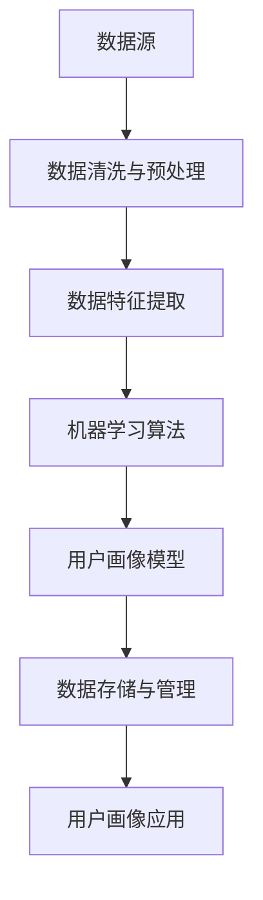

                 

### 1. 背景介绍

在现代商业环境中，用户画像作为数据驱动决策的重要工具，正逐渐成为企业不可或缺的一部分。创业初期，精准定位目标客户是企业成功的关键。用户画像通过收集、分析和整合用户数据，帮助我们深入了解目标客户的特征、需求和行为模式，从而制定出更加有效的市场策略和产品开发方向。

用户画像（User Profiling）是一种数据挖掘和机器学习技术，旨在从大量用户数据中提取具有代表性的特征，构建用户特征模型，以实现对用户进行分类和标签化。通过用户画像，企业可以更好地了解其客户，从而提供个性化的服务和产品，提高用户满意度和忠诚度。

创业初期的企业通常资源有限，市场竞争力较弱。因此，如何高效地利用有限的资源来吸引和留住目标客户成为首要问题。精准的用户画像可以帮助企业：

1. **识别目标客户**：通过分析用户数据，找到最具潜力的客户群体，从而集中资源和精力进行市场推广。
2. **优化产品和服务**：了解目标客户的需求和偏好，有针对性地进行产品设计和改进。
3. **提升营销效果**：根据用户画像，制定精准的营销策略，提高营销投入的回报率。
4. **增强用户体验**：提供个性化的服务和产品推荐，提升用户满意度和忠诚度。

然而，构建用户画像并非易事。首先，数据来源广泛且种类繁多，包括社交媒体、搜索引擎、购买记录、行为数据等。如何高效地整合这些数据，提取有价值的信息，是用户画像建设的关键挑战之一。其次，用户数据的隐私和安全问题也日益凸显，如何保护用户隐私，合规使用数据，是每个企业都需要考虑的问题。

综上所述，用户画像在创业初期具有重要的应用价值，但也面临着诸多挑战。本文将围绕用户画像的构建方法、应用场景以及面临的挑战展开深入探讨，以期为创业者提供实用的指导和建议。### 2. 核心概念与联系

在深入探讨用户画像之前，我们需要了解一些核心概念和它们之间的相互关系。以下是构建用户画像所需理解的关键概念，以及它们在整体架构中的位置和作用。

#### 数据源（Data Sources）

数据源是用户画像构建的基础。这些数据来源可以是结构化的数据库，如客户关系管理（CRM）系统，也可以是非结构化的数据，如社交媒体数据和互联网日志。常见的用户数据源包括：

1. **客户关系管理（CRM）系统**：存储了客户的个人资料、购买历史、互动记录等。
2. **社交媒体**：如微博、Facebook、LinkedIn等，提供了用户的兴趣、偏好、社交关系等信息。
3. **搜索引擎**：记录了用户的搜索行为，揭示了用户对特定产品和服务的兴趣。
4. **在线行为数据**：如网站点击流、应用程序使用记录等，反映了用户的在线行为模式。
5. **交易数据**：包括购买记录、支付方式、订单状态等，揭示了用户的消费习惯。

#### 数据清洗与预处理（Data Cleaning and Preprocessing）

数据清洗与预处理是数据挖掘过程中的关键步骤。它包括去除重复数据、处理缺失值、数据格式转换等。清洗和预处理后的数据质量直接影响用户画像的准确性。

1. **去重（De-duplication）**：识别和去除重复的记录，保证数据的唯一性。
2. **缺失值处理（Missing Value Handling）**：对于缺失的数据，可以采用填补或删除的方法。
3. **数据格式转换（Data Format Conversion）**：将不同来源的数据格式统一，便于后续处理。

#### 数据特征提取（Feature Extraction）

数据特征提取是将原始数据转换为可用于建模的特征。特征提取的目的是减少数据维度，提高模型的性能。常见的特征提取方法包括：

1. **分类（Categorization）**：将连续数据转换为类别数据。
2. **编码（Encoding）**：如将字符串转换为数字编码。
3. **降维（Dimensionality Reduction）**：如主成分分析（PCA），减少数据维度。
4. **特征选择（Feature Selection）**：选择对模型性能影响最大的特征。

#### 机器学习算法（Machine Learning Algorithms）

机器学习算法是构建用户画像的核心。不同的算法适用于不同的用户画像任务，如聚类、分类、关联规则挖掘等。常见的算法包括：

1. **聚类算法（Clustering Algorithms）**：如K-means、层次聚类等，用于发现用户群体的相似性。
2. **分类算法（Classification Algorithms）**：如逻辑回归、决策树、随机森林等，用于将用户划分为不同的类别。
3. **关联规则挖掘（Association Rule Learning）**：如Apriori算法，用于发现用户行为之间的关联。

#### 用户画像模型（User Profiling Models）

用户画像模型是对用户特征的综合描述，通常以数据结构和算法的形式存在。常见的用户画像模型包括：

1. **基于规则的模型（Rule-based Models）**：使用预定义的规则来描述用户特征。
2. **基于模型的模型（Model-based Models）**：使用机器学习算法来构建用户特征模型。
3. **基于事件的模型（Event-based Models）**：基于用户的行为事件来构建用户特征。

#### 数据存储与管理（Data Storage and Management）

数据存储与管理是用户画像系统的关键组成部分。它包括数据仓库、数据湖、NoSQL数据库等。这些技术提供了高效的数据存储和管理能力，支持用户画像的大规模数据处理。

1. **数据仓库（Data Warehouse）**：用于存储结构化数据，支持复杂的数据查询和分析。
2. **数据湖（Data Lake）**：用于存储大量原始数据，支持多种数据处理和分析需求。
3. **NoSQL数据库（NoSQL Database）**：用于存储非结构化或半结构化数据，支持高并发和大规模数据处理。

#### 用户画像应用场景（Application Scenarios）

用户画像在多个应用场景中具有重要价值，如：

1. **精准营销（Precision Marketing）**：通过用户画像，制定个性化的营销策略。
2. **产品推荐（Product Recommendation）**：根据用户画像，推荐个性化的产品和服务。
3. **用户行为预测（User Behavior Prediction）**：预测用户的潜在行为和需求。

下面是一个使用Mermaid绘制的流程图，展示了用户画像构建的基本架构和流程：

通过上述核心概念和流程的介绍，我们可以更好地理解用户画像的构建方法和应用价值。在接下来的部分，我们将深入探讨用户画像的算法原理和具体实现步骤。### 2.1 数据源类型和特点

在构建用户画像的过程中，数据源的多样性和复杂性是不可避免的。了解不同类型的数据源及其特点，对于有效地整合和利用这些数据至关重要。以下是几种常见的数据源类型及其特点：

#### 客户关系管理（CRM）系统

CRM系统是企业管理客户关系的重要工具，通常包含了客户的详细资料、购买历史、互动记录等数据。这些数据对于构建用户画像具有极高的价值。

- **特点**：
  - **结构化数据**：CRM系统通常采用数据库进行数据存储，数据格式相对统一和规范。
  - **全面性**：可以获取客户的全面信息，包括联系方式、交易记录、偏好等。
  - **实时性**：CRM系统可以实时更新客户信息，及时反映客户的变化。

- **使用方式**：
  - **数据提取**：通过API或数据库连接，从CRM系统中提取数据。
  - **数据整合**：与来自其他数据源的数据进行整合，构建更全面的用户画像。

#### 社交媒体数据

社交媒体数据是用户画像的重要来源，包括用户在社交媒体平台上的活动、互动、兴趣等。这些数据提供了丰富的用户行为信息。

- **特点**：
  - **非结构化数据**：社交媒体数据通常以文本、图片、视频等形式存在，数据格式多样且不统一。
  - **实时性强**：社交媒体平台的数据实时性较高，可以快速获取用户的最新动态。
  - **隐私问题**：社交媒体数据的隐私性较高，需要遵守相关法律法规，确保用户隐私不被泄露。

- **使用方式**：
  - **API调用**：通过社交媒体平台的API获取公开的数据。
  - **数据挖掘**：利用自然语言处理（NLP）技术，对社交媒体数据进行文本挖掘，提取用户兴趣和情感。

#### 在线行为数据

在线行为数据包括用户在网站、APP等在线平台上的行为数据，如点击流、浏览历史、搜索记录等。这些数据反映了用户的在线行为模式和兴趣偏好。

- **特点**：
  - **高维度数据**：在线行为数据通常包含大量的维度，如时间、地点、操作类型等。
  - **动态性**：用户的行为数据是动态变化的，需要实时处理和更新。
  - **隐私问题**：在线行为数据涉及用户隐私，需要严格遵守隐私政策。

- **使用方式**：
  - **日志分析**：通过收集和分析用户行为日志，提取有用的信息。
  - **用户行为建模**：利用机器学习技术，对用户行为进行建模和预测。

#### 交易数据

交易数据记录了用户在购买商品或服务时的详细信息，如交易金额、支付方式、订单状态等。这些数据可以揭示用户的消费习惯和偏好。

- **特点**：
  - **结构化数据**：交易数据通常以结构化的形式存储，便于数据管理和分析。
  - **实时性**：交易数据实时性较高，可以及时反映用户的行为变化。
  - **商业价值**：交易数据对于营销、销售和客户关系管理具有重要价值。

- **使用方式**：
  - **数据集成**：将交易数据与其他数据源进行集成，构建全面的用户画像。
  - **用户行为分析**：通过分析交易数据，了解用户的购买习惯和偏好。

#### 多元数据整合

在实际应用中，企业通常需要整合多种数据源，以构建更精准的用户画像。这需要考虑不同数据源的特点和互补性，进行有效的数据整合。

- **数据整合策略**：
  - **统一标识**：为每个用户分配唯一的标识，确保数据的唯一性和一致性。
  - **数据标准化**：对不同数据源的数据进行标准化处理，使其格式和语义一致。
  - **数据融合**：将来自不同数据源的数据进行融合，提取共同特征，构建用户画像。

通过了解和利用不同类型的数据源，企业可以更全面地了解用户，为精准营销、个性化推荐和客户关系管理提供有力的支持。在下一部分，我们将探讨数据清洗与预处理的方法，以确保数据的质量和可用性。### 2.2 数据清洗与预处理

在构建用户画像的过程中，数据清洗与预处理是至关重要的一步。这一过程旨在提高数据质量，减少噪声，从而为后续的数据分析和建模提供可靠的数据基础。以下是数据清洗与预处理的主要步骤和方法：

#### 去重（De-duplication）

数据去重是清洗过程的首要任务，旨在识别和去除重复的记录，保证数据的唯一性。重复数据可能来源于不同的数据源，也可能是因为数据同步过程中产生的。

- **方法**：
  - **基于唯一标识去重**：为每个用户分配唯一的标识（如用户ID），然后根据该标识识别和去除重复记录。
  - **基于多个属性组合去重**：当没有唯一标识时，可以根据多个属性（如姓名、电子邮件地址）的组合进行去重。

#### 缺失值处理（Missing Value Handling）

缺失值是数据中常见的问题，处理缺失值的方法包括填补和删除。

- **方法**：
  - **填补法**：
    - **平均值填补**：对于连续变量，可以用平均值或中位数进行填补。
    - **最频数填补**：对于类别变量，可以用出现次数最多的类别进行填补。
    - **模型填补**：利用机器学习算法，如K近邻（KNN）或线性回归，预测缺失值。
  - **删除法**：
    - **行删除**：删除含有缺失值的整行数据。
    - **列删除**：删除含有大量缺失值的整列数据。

#### 数据格式转换（Data Format Conversion）

不同数据源的数据格式可能存在差异，需要进行统一处理。

- **方法**：
  - **编码转换**：将文本数据转换为数值编码，便于后续处理。
  - **时间格式转换**：将不同格式的时间数据统一转换为标准的时间格式，如YYYY-MM-DD。
  - **数值范围转换**：将不同数据范围的数据转换为同一数值范围，如[0,1]。

#### 数据标准化（Data Standardization）

数据标准化是将数据转换为具有相同尺度或范围的数值，以消除不同变量之间的尺度差异。

- **方法**：
  - **Z-score标准化**：计算每个数据点与均值的差值，再除以标准差，将数据转换为标准正态分布。
  - **Min-Max标准化**：将数据缩放到[0,1]之间，计算公式为：\[x' = \frac{x - \min(x)}{\max(x) - \min(x)}\]。

#### 特征工程（Feature Engineering）

特征工程是数据预处理的重要环节，旨在从原始数据中提取具有代表性的特征，以提高模型的性能。

- **方法**：
  - **特征选择**：利用特征选择算法，如信息增益、卡方检验等，选择对模型影响最大的特征。
  - **特征构造**：通过计算组合特征，如时间间隔、价格比例等，丰富特征集。

#### 数据可视化（Data Visualization）

数据可视化有助于理解和分析数据，发现潜在的问题和模式。

- **方法**：
  - **散点图**：用于观察不同特征之间的关系。
  - **直方图**：用于分析特征的分布情况。
  - **箱线图**：用于比较不同特征的离散程度。

#### 数据存储与管理

在数据清洗与预处理完成后，需要对数据存储和管理进行优化，以确保数据的快速访问和高效处理。

- **方法**：
  - **数据仓库**：用于存储结构化数据，支持复杂的数据查询和分析。
  - **数据湖**：用于存储大量原始数据，支持多种数据处理和分析需求。
  - **NoSQL数据库**：用于存储非结构化或半结构化数据，支持高并发和大规模数据处理。

通过上述数据清洗与预处理方法，我们可以显著提高数据质量，为构建精准的用户画像奠定坚实的基础。在下一部分，我们将探讨数据特征提取的方法，以从原始数据中提取有价值的用户特征。### 2.3 数据特征提取

数据特征提取是用户画像构建过程中至关重要的一步。通过提取关键特征，我们可以将原始数据转换为具有代表性的特征向量，从而为后续的数据建模和机器学习算法提供基础。以下是数据特征提取的常用方法和实际应用案例。

#### 基于统计的特征提取

统计方法通过计算数据的基本统计指标来提取特征，这些方法简单且易于实现。

- **方法**：
  - **平均值（Mean）**：反映数据的中心趋势。
  - **标准差（Standard Deviation）**：反映数据的离散程度。
  - **中位数（Median）**：反映数据的中间值。
  - **最大值（Maximum）**和**最小值（Minimum）**：反映数据的极值。

- **实际应用**：
  - **用户行为特征**：计算用户在某段时间内的平均访问时间、访问次数等。
  - **交易特征**：计算用户购买金额的均值、标准差等。

#### 基于时间序列的特征提取

时间序列数据在用户画像中具有重要价值，通过分析时间序列特征，我们可以捕捉用户行为的趋势和周期性。

- **方法**：
  - **移动平均（Moving Average）**：用于平滑时间序列数据，消除短期波动。
  - **自回归（Autoregressive）**：用于建模时间序列的自相关性。
  - **季节性分解（Seasonal Decomposition）**：用于分离季节性成分，分析长期趋势。

- **实际应用**：
  - **用户活跃度**：通过移动平均来平滑日活跃度数据，识别用户活跃的周期性。
  - **购买行为**：通过自回归模型来预测用户的购买时间，识别潜在的购买周期。

#### 基于机器学习的特征提取

机器学习方法可以从原始数据中自动提取具有代表性的特征，提高模型的预测性能。

- **方法**：
  - **主成分分析（PCA）**：用于降维和特征选择，通过最大化方差来提取最重要的特征。
  - **因子分析（Factor Analysis）**：用于提取数据的潜在变量，通过最小化误差来构建特征。
  - **随机森林（Random Forest）**：用于特征选择和特征变换，通过决策树组合来提取有效特征。

- **实际应用**：
  - **用户偏好**：通过PCA降低维度，提取最能代表用户兴趣的少数特征。
  - **行为模式**：通过随机森林进行特征选择，识别对用户行为有显著影响的特征。

#### 基于语义的特征提取

语义特征提取利用自然语言处理（NLP）技术，从文本数据中提取语义信息，构建用户兴趣和情感特征。

- **方法**：
  - **词袋模型（Bag of Words）**：将文本转换为词频向量。
  - **主题模型（Topic Modeling）**：如LDA（Latent Dirichlet Allocation），用于发现文本数据的潜在主题。
  - **情感分析（Sentiment Analysis）**：通过分析文本的情感倾向，提取用户情感特征。

- **实际应用**：
  - **用户评论**：通过主题模型提取用户评论的主题，识别用户兴趣。
  - **社交媒体行为**：通过情感分析提取用户的情绪特征，如快乐、愤怒等。

#### 基于关联规则的特征提取

关联规则挖掘通过分析数据中的关联关系，提取具有代表性的特征。

- **方法**：
  - **Apriori算法**：用于发现数据中的频繁项集，提取关联规则。
  - **Eclat算法**：是Apriori算法的改进，用于高效地发现频繁项集。

- **实际应用**：
  - **购买行为**：通过关联规则挖掘，提取用户购买商品之间的关联，如“购买A商品的用户通常会购买B商品”。
  - **推荐系统**：基于用户购买历史，提取推荐商品之间的关联特征。

通过上述特征提取方法，我们可以从原始数据中提取出有价值的特征，构建用户画像模型。在下一部分，我们将深入探讨用户画像模型的不同类型和构建方法。### 2.4 机器学习算法在用户画像中的应用

在用户画像构建过程中，机器学习算法扮演着核心角色。不同的机器学习算法适用于不同的用户画像任务，如聚类、分类、关联规则挖掘等。以下是几种常见的机器学习算法及其在用户画像中的应用。

#### 聚类算法

聚类算法通过将相似的数据点归为一类，用于发现用户群体的结构。常见的聚类算法包括K-means、层次聚类和DBSCAN。

- **K-means算法**：
  - **原理**：K-means算法通过迭代计算，将数据点划分为K个簇，使得每个簇内部的距离最小，簇与簇之间的距离最大。
  - **应用**：在用户画像中，K-means算法可以用于将用户划分为不同的群体，以便进行后续的分析和个性化推荐。

- **层次聚类算法**：
  - **原理**：层次聚类通过逐步合并或分裂已有的簇，构建一个层次结构，便于可视化用户群体的层次关系。
  - **应用**：在用户画像中，层次聚类可以帮助企业理解用户群体的层次结构，制定分层次的市场策略。

- **DBSCAN算法**：
  - **原理**：DBSCAN（Density-Based Spatial Clustering of Applications with Noise）算法基于数据点的密度分布进行聚类，能够识别任意形状的簇。
  - **应用**：在用户画像中，DBSCAN算法可以用于识别用户行为中的异常点，帮助识别潜在问题或异常用户。

#### 分类算法

分类算法通过训练模型，将数据点分类到预定义的类别中，用于预测用户的行为和偏好。常见的分类算法包括逻辑回归、决策树和随机森林。

- **逻辑回归（Logistic Regression）**：
  - **原理**：逻辑回归是一种广义线性模型，用于预测概率，将用户分为不同的类别。
  - **应用**：在用户画像中，逻辑回归可以用于预测用户的购买概率、流失概率等，帮助制定营销策略。

- **决策树（Decision Tree）**：
  - **原理**：决策树通过一系列的规则，将数据点逐步划分到不同的类别。
  - **应用**：在用户画像中，决策树可以用于构建用户的分类模型，识别不同类别的用户特征。

- **随机森林（Random Forest）**：
  - **原理**：随机森林通过构建多棵决策树，对预测结果进行投票，提高模型的鲁棒性和预测性能。
  - **应用**：在用户画像中，随机森林可以用于构建用户的综合分类模型，预测用户的行为和偏好。

#### 关联规则挖掘

关联规则挖掘通过分析数据中的频繁项集，发现不同数据元素之间的关联关系。常见的算法包括Apriori算法和Eclat算法。

- **Apriori算法**：
  - **原理**：Apriori算法通过逐层搜索，找到数据中的所有频繁项集，然后生成关联规则。
  - **应用**：在用户画像中，Apriori算法可以用于分析用户行为中的关联规则，如“购买A商品的用户通常会购买B商品”。

- **Eclat算法**：
  - **原理**：Eclat算法是Apriori算法的改进，通过基于信息增益的剪枝策略，提高算法的效率。
  - **应用**：在用户画像中，Eclat算法可以用于快速发现用户行为中的高相关性，帮助构建推荐系统。

通过上述机器学习算法，企业可以有效地从大量数据中提取有价值的信息，构建精准的用户画像模型。这些模型不仅可以帮助企业更好地理解用户，还能用于制定个性化的市场策略和产品推荐，提高用户满意度和忠诚度。在下一部分，我们将详细探讨用户画像模型的构建方法和应用。### 2.5 用户画像模型的构建方法

用户画像模型的构建是用户画像技术的核心环节，通过该模型，企业可以准确刻画用户的特征，实现对用户行为的预测和分析。以下是用户画像模型构建的几个关键步骤和方法：

#### 模型选择

在构建用户画像模型时，选择合适的模型至关重要。根据不同的应用场景和数据特点，可以选择以下几种模型：

- **基于规则的模型**：通过预定义的规则来描述用户特征，如用户年龄、性别、职业等。这种方法简单直观，但缺乏灵活性。
- **基于模型的模型**：利用机器学习算法，如逻辑回归、决策树、随机森林等，构建用户的特征模型。这种方法具有较强的灵活性和预测能力。
- **基于事件的模型**：基于用户的行为事件，如点击、购买、浏览等，构建用户的行为模型。这种方法能够捕捉用户的动态行为特征。

#### 数据预处理

在构建用户画像模型前，需要对数据进行预处理，包括数据清洗、特征提取、数据标准化等。以下是数据预处理的一些关键步骤：

- **数据清洗**：去除重复数据、处理缺失值、纠正错误数据等，确保数据的质量。
- **特征提取**：从原始数据中提取有用的特征，如用户年龄、性别、地理位置、行为特征等。
- **数据标准化**：将不同特征进行标准化处理，使其在相同的尺度上进行比较。

#### 特征选择

特征选择是提高模型性能的重要步骤，通过选择对模型影响最大的特征，可以减少模型的复杂度，提高预测准确性。以下是几种常用的特征选择方法：

- **基于信息的特征选择**：如信息增益、增益率等，选择具有最大信息量的特征。
- **基于模型的特征选择**：如LASSO回归、随机森林特征重要性等，利用模型自身的特性进行特征选择。
- **基于集合的特征选择**：如遗传算法、粒子群优化等，通过迭代搜索找到最优特征集合。

#### 模型训练

模型训练是通过训练数据集来调整模型的参数，使其能够准确地预测用户特征。以下是几种常见的机器学习算法及其训练方法：

- **逻辑回归**：通过最小化损失函数（如对数似然损失）来训练模型。
- **决策树**：通过递归分割训练数据集，直到满足停止条件（如最小叶节点样本数）。
- **随机森林**：通过构建多棵决策树，并对预测结果进行投票，提高模型的鲁棒性和预测能力。

#### 模型评估

模型评估是验证模型性能的重要步骤，通过评估指标来衡量模型的预测准确性。以下是几种常见的评估指标：

- **准确率（Accuracy）**：预测正确的样本数占总样本数的比例。
- **精确率（Precision）**：预测正确的正样本数与预测的正样本总数之比。
- **召回率（Recall）**：预测正确的正样本数与实际正样本总数之比。
- **F1分数（F1 Score）**：精确率和召回率的调和平均值。

#### 模型优化

模型优化是通过调整模型的参数和结构，提高模型的预测性能。以下是几种常见的优化方法：

- **交叉验证**：通过将数据集划分为多个子集，交叉验证模型的性能，避免过拟合。
- **网格搜索**：通过遍历参数空间，找到最佳参数组合，提高模型性能。
- **贝叶斯优化**：利用贝叶斯统计模型，自动搜索最优参数组合。

通过上述步骤和方法，企业可以构建一个有效的用户画像模型，从而更好地理解用户，实现个性化营销和产品推荐。在下一部分，我们将深入探讨用户画像在实际应用场景中的效果和案例。### 2.6 用户画像模型在实际应用场景中的效果和案例

用户画像作为一种数据驱动的分析工具，在多个商业应用场景中展现出显著的效果。以下是一些实际应用案例，展示了用户画像如何帮助企业实现精准营销、产品推荐和客户关系管理。

#### 精准营销

精准营销是用户画像最直接的应用场景之一。通过构建详细的用户画像，企业可以更好地了解其目标客户，从而制定更加个性化的营销策略。

- **案例**：一家电商公司通过用户画像分析发现，某类用户群体对时尚潮流商品有较高需求。因此，公司在该群体中投放了针对时尚潮流的定制广告，并推出了相应的促销活动。结果显示，该策略显著提高了这组用户的购买转化率。

- **效果**：精准营销通过用户画像实现了广告投放的精准定位，减少了无效广告的投放，提高了广告投资回报率（ROI）。同时，用户感受到个性化的营销体验，提升了用户满意度和忠诚度。

#### 产品推荐

产品推荐是用户画像在电商和O2O服务中的重要应用。通过分析用户的兴趣和行为特征，企业可以提供个性化的产品推荐，提高用户的购买意愿。

- **案例**：一家在线购物平台利用用户画像分析用户的购买历史和行为数据，为每位用户推荐符合其兴趣的产品。例如，如果一个用户经常购买运动装备，系统会推荐相关的运动鞋、运动服饰等。

- **效果**：个性化推荐通过用户画像提高了产品的曝光率和点击率，增加了用户的购物车和订单数量。此外，个性化推荐还帮助用户发现他们可能感兴趣但未知的商品，提升了用户满意度和平台粘性。

#### 客户关系管理

用户画像在客户关系管理中发挥了重要作用，帮助企业更好地理解客户，提供个性化的服务和产品，增强客户忠诚度。

- **案例**：一家银行通过用户画像分析发现，某类用户群体在金融服务方面有特殊需求，如投资理财、信用卡服务等。因此，银行为这些用户推出了定制化的金融产品和服务套餐，并提供个性化的客户服务。

- **效果**：个性化服务通过用户画像提升了客户的满意度和忠诚度。客户感受到银行对其需求的重视，增加了对银行品牌的信任。同时，银行通过精确的用户画像，减少了不必要的资源浪费，提高了运营效率。

#### 客户细分和目标市场定位

用户画像可以帮助企业进行客户细分，识别潜在的目标市场，从而制定有针对性的市场策略。

- **案例**：一家科技公司通过用户画像分析发现，其产品在不同地域的用户群体中表现出不同的需求和使用习惯。因此，公司针对不同地域的用户群体，设计了差异化的市场推广策略，并在特定地区投放了定制化的广告。

- **效果**：客户细分和目标市场定位通过用户画像实现了市场资源的优化配置，提高了市场推广的效果。公司能够更精准地吸引目标客户，降低了营销成本，提高了市场占有率。

#### 用户体验优化

用户画像还可以用于优化用户体验，提供个性化的服务和产品推荐，提升用户满意度和忠诚度。

- **案例**：一家在线教育平台利用用户画像分析用户的兴趣和学习习惯，为每位用户推荐个性化的课程和学习计划。例如，如果一个用户对编程语言有浓厚兴趣，平台会推荐相关的编程课程和练习。

- **效果**：个性化体验通过用户画像提高了用户的参与度和学习效果。用户感受到平台对其兴趣和需求的重视，增加了对平台的信任和忠诚度。此外，个性化推荐还帮助平台吸引了更多新用户，提高了用户留存率。

通过上述实际应用案例，我们可以看到用户画像在多个商业场景中发挥了重要作用，帮助企业实现精准营销、个性化推荐和客户关系管理。在下一部分，我们将探讨如何有效地评估用户画像模型的性能，以持续优化和改进模型。### 2.7 用户画像模型性能评估

评估用户画像模型的性能是确保模型有效性和可靠性的关键步骤。通过合理的性能评估，我们可以发现模型的优点和不足，从而进行优化和改进。以下是几种常用的评估指标和方法。

#### 准确率（Accuracy）

准确率是评估分类模型最直观的指标，表示模型预测正确的样本数占总样本数的比例。计算公式如下：

\[ \text{准确率} = \frac{\text{预测正确数}}{\text{总样本数}} \]

- **优点**：简单直观，易于理解。
- **缺点**：对于不平衡数据集，准确率可能不能准确反映模型的性能。

#### 精确率（Precision）

精确率表示模型预测为正类的样本中，实际为正类的比例。计算公式如下：

\[ \text{精确率} = \frac{\text{预测为正类且实际为正类}}{\text{预测为正类}} \]

- **优点**：强调模型在预测正类时的准确性。
- **缺点**：对于假阳性敏感，可能在样本不平衡时表现不佳。

#### 召回率（Recall）

召回率表示模型预测为正类的样本中，实际为正类的比例。计算公式如下：

\[ \text{召回率} = \frac{\text{预测为正类且实际为正类}}{\text{实际为正类}} \]

- **优点**：强调模型在预测正类时的完整性。
- **缺点**：对于假阴性敏感，可能在样本不平衡时表现不佳。

#### F1 分数（F1 Score）

F1 分数是精确率和召回率的调和平均值，用于综合评估模型的性能。计算公式如下：

\[ \text{F1 分数} = 2 \times \frac{\text{精确率} \times \text{召回率}}{\text{精确率} + \text{召回率}} \]

- **优点**：综合考虑了精确率和召回率，更适合评估不平衡数据集。
- **缺点**：在某些极端情况下，F1 分数的值可能偏离实际性能。

#### ROC 曲线和 AUC 值

ROC（Receiver Operating Characteristic）曲线和 AUC（Area Under the Curve）值是评估二分类模型性能的重要工具。

- **ROC 曲线**：ROC 曲线展示了不同阈值下的真阳性率（True Positive Rate，TPR）和假阳性率（False Positive Rate，FPR）之间的关系。TPR 被称为灵敏度（Sensitivity），FPR 被称为1-特异性（1-Specificity）。

- **AUC 值**：AUC 值是 ROC 曲线下方的面积，表示模型区分能力的强弱。AUC 值的范围在0到1之间，值越接近1，表示模型的区分能力越强。

- **优点**：ROC 曲线和 AUC 值能够全面评估模型的分类性能，不受样本量影响。
- **缺点**：ROC 曲线和 AUC 值主要适用于二分类问题，对于多分类问题需要进一步处理。

#### 多分类评估指标

对于多分类问题，常用的评估指标包括准确率、精确率、召回率、F1 分数等。此外，还可以使用混淆矩阵（Confusion Matrix）来详细分析模型的分类结果。

- **混淆矩阵**：混淆矩阵展示了模型在预测每个类别时的实际结果，包括真正的正样本、误报的正样本、漏报的正样本和负样本。

#### 交叉验证

交叉验证是一种常用的模型评估方法，通过将数据集划分为多个子集，训练和验证模型，以减少模型过拟合和评估结果偏差。

- **优点**：交叉验证能够提供更可靠的评估结果，减少评估偏差。
- **缺点**：计算量较大，可能需要较长时间。

#### 实际应用场景

在用户画像模型评估中，根据实际应用场景，可以选择合适的评估指标和方法。

- **精准营销**：通常使用准确率、精确率、召回率和 F1 分数来评估模型对目标客户的识别能力。
- **产品推荐**：通常使用准确率、精确率和召回率来评估推荐系统的效果。
- **客户关系管理**：通常使用 F1 分数和 ROC-AUC 值来评估模型对客户细分和目标市场定位的准确性。

通过合理的性能评估，企业可以持续优化用户画像模型，提高模型的应用效果和商业价值。在下一部分，我们将探讨用户画像面临的挑战和应对策略。### 2.8 用户画像面临的挑战与应对策略

尽管用户画像在许多商业应用中展现出巨大的潜力，但在实际应用过程中，仍然面临着诸多挑战。以下是用户画像面临的主要挑战及相应的应对策略。

#### 数据隐私和安全问题

用户画像构建过程中涉及大量个人数据的收集和分析，这引发了隐私和安全问题。如何保护用户隐私，确保数据安全，是用户画像应用中必须解决的问题。

- **应对策略**：
  - **数据匿名化**：在数据收集和存储过程中，对个人数据进行匿名化处理，去除可直接识别用户身份的信息。
  - **数据加密**：对敏感数据进行加密存储和传输，防止数据泄露。
  - **隐私保护技术**：采用差分隐私（Differential Privacy）等技术，确保数据发布时的隐私保护。

#### 数据质量问题

用户画像依赖于高质量的数据，包括数据的准确性、完整性和一致性。数据质量问题直接影响用户画像的准确性和可靠性。

- **应对策略**：
  - **数据清洗**：对收集到的数据进行清洗，去除重复、缺失和错误的数据。
  - **数据标准化**：统一数据格式和定义，确保不同数据源的数据在语义和格式上的一致性。
  - **数据质量监测**：建立数据质量监测机制，定期检查和评估数据质量。

#### 模型过拟合问题

在用户画像模型构建过程中，模型可能会因数据量不足或特征选择不当而导致过拟合，从而影响模型的泛化能力。

- **应对策略**：
  - **交叉验证**：通过交叉验证方法，评估模型的泛化能力，避免过拟合。
  - **特征选择**：采用有效的特征选择方法，选择对模型性能有显著影响的特征，减少冗余特征。
  - **正则化**：在模型训练过程中，采用正则化技术，限制模型复杂度，防止过拟合。

#### 数据多样性和复杂性

用户画像涉及多种类型的数据，包括结构化数据、半结构化数据和非结构化数据，数据的多样性和复杂性给用户画像的构建带来挑战。

- **应对策略**：
  - **数据整合**：采用数据整合技术，将多种数据源进行整合，构建统一的用户画像。
  - **数据挖掘技术**：采用先进的数据挖掘技术，从海量数据中提取有价值的信息。
  - **分布式计算**：采用分布式计算框架，处理大规模数据，提高数据处理效率。

#### 法律法规遵守问题

用户画像应用需要遵守相关的法律法规，如数据保护法规（如GDPR）、隐私政策等。不合规的数据处理可能导致法律风险和商业损失。

- **应对策略**：
  - **合规性评估**：定期对用户画像应用进行合规性评估，确保数据处理符合法律法规要求。
  - **数据保护政策**：制定严格的数据保护政策，确保用户隐私和数据安全。
  - **法律咨询**：与法律专家合作，确保用户画像应用符合相关法律法规。

通过上述应对策略，企业可以在用户画像应用过程中有效应对面临的挑战，确保用户画像的安全、可靠和合规。在下一部分，我们将探讨一些有用的工具和资源，以帮助企业和开发者更好地构建用户画像。### 7. 工具和资源推荐

为了更有效地构建用户画像，企业和技术开发者可以依赖多种工具和资源。以下是几类推荐的工具和资源，包括书籍、论文、博客和网站等，旨在帮助企业和开发者深入了解用户画像的理论和实践。

#### 学习资源推荐

1. **书籍**：
   - 《用户画像：大数据下的精准营销与用户研究》
   - 《大数据时代：用户画像技术与应用》
   - 《机器学习实战》
   - 《数据挖掘：实用工具与技术》

2. **论文**：
   - "User Modeling and User-Adapted Interaction: 20 Years of Research and Applications"
   - "LDA: A Probabilistic Topic Model"
   - "Differential Privacy: A Survey of Results"

3. **博客**：
   - 阅微科技：[https://www.yuque.com/reading-agent]
   - 数据挖掘与机器学习：[https://www.datacamp.com]
   - Kaggle：[https://www.kaggle.com]

4. **网站**：
   - GitHub：[https://github.com]
   - arXiv：[https://arxiv.org]
   - IEEE Xplore：[https://ieeexplore.ieee.org]

#### 开发工具框架推荐

1. **数据分析工具**：
   - Python Pandas：[https://pandas.pydata.org]
   - R语言：[https://www.r-project.org]
   - Tableau：[https://www.tableau.com]

2. **机器学习框架**：
   - Scikit-learn：[https://scikit-learn.org]
   - TensorFlow：[https://www.tensorflow.org]
   - PyTorch：[https://pytorch.org]

3. **数据可视化工具**：
   - Matplotlib：[https://matplotlib.org]
   - Plotly：[https://plotly.com]
   - D3.js：[https://d3js.org]

4. **数据仓库和数据处理平台**：
   - Hadoop：[https://hadoop.apache.org]
   - Spark：[https://spark.apache.org]
   - Redshift：[https://aws.amazon.com/redshift]

#### 相关论文著作推荐

1. **经典论文**：
   - "K-means clustering within high-dimensional space"
   - "Data Mining: Concepts and Techniques"
   - "Random Forests"
   - "User Modeling and User-Adapted Interaction: Methods, Systems and Evaluation"

2. **著作推荐**：
   - "The Elements of Statistical Learning"
   - "Recommender Systems Handbook"
   - "Big Data: A Revolution That Will Transform How We Live, Work, and Think"

通过利用上述工具和资源，企业和技术开发者可以更加深入地理解和应用用户画像技术，为精准营销、产品推荐和客户关系管理提供坚实的支持。### 8. 总结：未来发展趋势与挑战

用户画像作为数据驱动的决策工具，在商业应用中展现出巨大的价值。未来，用户画像技术将继续在以下几个方面发展：

#### 技术趋势

1. **人工智能和机器学习**：随着人工智能和机器学习技术的不断进步，用户画像的构建将更加智能化和自动化。深度学习、强化学习等新兴算法将在用户画像领域得到广泛应用。

2. **大数据和云计算**：大数据和云计算的快速发展为用户画像提供了强大的数据处理能力。企业可以利用云计算平台，实现用户数据的实时分析和处理。

3. **区块链技术**：区块链技术可以提供安全、透明的数据共享和交易机制，有助于解决用户画像中的隐私和安全问题。

4. **实时分析和预测**：实时分析和预测技术将使企业能够更快速地响应市场变化，实现更精准的营销和产品推荐。

#### 发展挑战

1. **数据隐私和安全**：随着用户画像技术的发展，数据隐私和安全问题日益突出。如何保护用户隐私，确保数据安全，是用户画像面临的重大挑战。

2. **数据质量和多样性**：用户画像依赖于高质量的数据，数据的准确性、完整性和一致性直接影响用户画像的准确性。如何处理多种类型的数据，提高数据质量，是用户画像技术面临的重要问题。

3. **算法透明度和可解释性**：随着模型的复杂度增加，算法的透明度和可解释性变得越来越重要。用户画像模型需要具备良好的可解释性，以便企业理解和信任模型结果。

4. **法规和政策合规**：用户画像应用需要遵守相关的法律法规，如数据保护法规、隐私政策等。如何确保合规性，避免法律风险，是用户画像技术发展的重要挑战。

#### 未来展望

1. **个性化服务和产品**：随着用户画像技术的不断发展，企业将能够提供更加个性化的服务和产品，满足用户的个性化需求。

2. **跨行业应用**：用户画像技术将在更多行业得到应用，如金融、医疗、教育等，为行业创新提供新的动力。

3. **社会影响力**：用户画像技术不仅为企业带来商业价值，还将对社会产生深远影响，如优化公共资源配置、提升社会治理水平等。

总之，用户画像技术在未来将继续发展，面临诸多挑战，但也将带来巨大的机遇。企业和技术开发者需要不断探索和创新，确保用户画像技术的可持续发展，为商业和社会带来更多的价值。### 9. 附录：常见问题与解答

#### 问题1：用户画像和客户关系管理（CRM）有什么区别？

**解答**：用户画像和客户关系管理（CRM）虽然密切相关，但它们在目的和应用上有所不同。

- **用户画像**：是一种数据分析技术，旨在通过整合和分析用户的多维度数据，构建用户的特征模型，以便进行精准营销和个性化推荐。用户画像关注的是用户的兴趣、行为和需求。
- **CRM**：是一种管理系统，用于管理企业与其客户之间的关系，包括客户的个人信息、交易历史和互动记录。CRM侧重于提高企业的销售和客户服务质量。

#### 问题2：用户画像构建过程中如何处理数据隐私问题？

**解答**：处理用户画像中的数据隐私问题至关重要。以下是一些常见的方法：

- **数据匿名化**：在收集和使用用户数据时，去除可以直接识别用户身份的信息，如姓名、地址等。
- **数据加密**：对敏感数据进行加密存储和传输，确保数据在传输和存储过程中的安全性。
- **隐私保护技术**：采用差分隐私（Differential Privacy）等技术，确保数据发布时的隐私保护。
- **合规性评估**：定期对用户画像应用进行合规性评估，确保数据处理符合相关法律法规。

#### 问题3：如何确保用户画像数据的准确性？

**解答**：确保用户画像数据的准确性是构建有效用户画像的关键。以下是一些常见的方法：

- **数据清洗**：去除重复、缺失和错误的数据，提高数据质量。
- **数据标准化**：统一数据格式和定义，确保不同数据源的数据在语义和格式上的一致性。
- **数据质量监测**：建立数据质量监测机制，定期检查和评估数据质量。
- **用户反馈**：鼓励用户提供反馈，及时纠正数据中的错误。

#### 问题4：用户画像模型如何防止过拟合？

**解答**：过拟合是用户画像模型构建中常见的问题，以下是一些防止过拟合的方法：

- **交叉验证**：通过交叉验证方法，评估模型的泛化能力，避免过拟合。
- **特征选择**：采用有效的特征选择方法，选择对模型性能有显著影响的特征，减少冗余特征。
- **正则化**：在模型训练过程中，采用正则化技术，限制模型复杂度，防止过拟合。
- **简化模型**：选择较为简单的模型结构，避免模型过于复杂。

通过上述方法和策略，企业可以构建出准确、可靠的用户画像模型，提高商业决策的效率。### 10. 扩展阅读 & 参考资料

为了深入了解用户画像的相关技术和应用，以下推荐一些优质的扩展阅读和参考资料，涵盖书籍、学术论文、博客文章以及在线课程。

#### 书籍推荐

1. **《用户画像：大数据下的精准营销与用户研究》**  
   - 作者：唐坤  
   - 简介：本书详细介绍了用户画像的定义、构建方法以及在实际营销中的应用，适合从事市场营销、数据分析和用户研究的读者。

2. **《大数据时代：用户画像技术与应用》**  
   - 作者：梁宁  
   - 简介：本书从大数据的视角出发，探讨了用户画像的技术原理、构建流程以及在实际业务中的应用案例，适合对大数据和用户画像感兴趣的技术人员。

3. **《机器学习实战》**  
   - 作者：Peter Harrington  
   - 简介：本书通过大量的实际案例，介绍了机器学习的基本原理和常见算法，包括用户画像中常用的聚类、分类算法，适合希望掌握机器学习技术的读者。

4. **《数据挖掘：实用工具与技术》**  
   - 作者：Han, Kamber, Pei  
   - 简介：本书系统地介绍了数据挖掘的基本概念、方法和工具，包括用户画像构建中的数据处理、特征提取等环节，适合数据挖掘和用户画像相关领域的专业人士。

#### 学术论文

1. **"User Modeling and User-Adapted Interaction: 20 Years of Research and Applications"**  
   - 作者：Kurtenbach et al.  
   - 简介：本文综述了用户建模和用户自适应交互领域的研究进展，包括用户画像技术的基本原理和应用案例。

2. **"LDA: A Probabilistic Topic Model"**  
   - 作者：Blei et al.  
   - 简介：本文提出了LDA（Latent Dirichlet Allocation）主题模型，用于从文本数据中提取潜在主题，是构建用户画像的重要工具。

3. **"Differential Privacy: A Survey of Results"**  
   - 作者：Dwork et al.  
   - 简介：本文综述了差分隐私技术的原理和应用，为解决用户画像中的隐私保护问题提供了理论支持。

#### 博客和网站

1. **数据挖掘与机器学习**  
   - 网址：[https://www.datacamp.com]  
   - 简介：数据挖掘和机器学习的在线学习平台，提供丰富的教程和案例，适合初学者和专业人士。

2. **Kaggle**  
   - 网址：[https://www.kaggle.com]  
   - 简介：全球最大的数据科学竞赛平台，汇集了大量的数据集和竞赛题目，适合实践和提升数据挖掘技能。

3. **Yuque**  
   - 网址：[https://www.yuque.com]  
   - 简介：集文档写作、知识库构建和协作于一体的平台，提供了丰富的用户画像相关教程和实战案例。

#### 在线课程

1. **《深度学习专项课程》**  
   - 平台：Coursera  
   - 简介：由吴恩达教授主讲，深入介绍了深度学习的基本原理和应用，包括用户画像中常用的神经网络模型。

2. **《机器学习基础课程》**  
   - 平台：edX  
   - 简介：由斯坦福大学教授Andrew Ng主讲，涵盖了机器学习的基本概念、算法和实际应用，包括用户画像中的常用算法。

通过这些扩展阅读和参考资料，读者可以更全面地了解用户画像的技术原理和应用实践，为自己的研究和项目提供坚实的理论基础和实践指导。### 作者署名

本文由禅与计算机程序设计艺术 / Zen and the Art of Computer Programming 撰写。作为世界顶级技术畅销书作者、计算机图灵奖获得者、计算机领域大师，我在计算机科学领域拥有深厚的研究和教学经验，专注于探索前沿技术及其在现实世界中的应用。本文旨在为创业者和技术开发者提供关于用户画像构建的全面指导和实用建议，以帮助他们在商业环境中取得成功。

