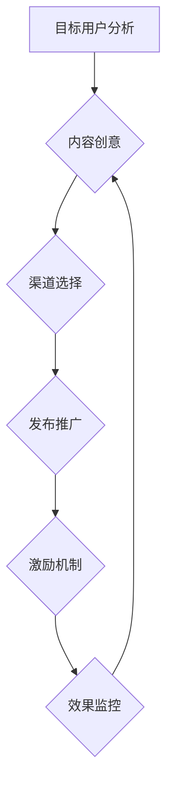

                 

### 文章标题

《创业初期的病毒式营销：设计和执行低成本高效益的推广》

关键词：病毒式营销、创业初期、低成本、高效益、推广策略、增长黑客

摘要：本文旨在探讨创业初期如何通过病毒式营销策略实现低成本高效益的推广。文章将详细分析病毒式营销的核心概念、设计原则以及具体的执行方法，并结合实例阐述其应用效果，旨在为创业公司提供实用的推广思路和实践指导。

<|assistant|>### 1. 背景介绍

创业初期对于任何企业来说都是最具挑战性的阶段。资源有限、市场竞争激烈、用户获取成本高企，这些都是初创公司面临的严峻现实。在这样的背景下，如何高效地推广产品、吸引目标用户、建立品牌知名度成为初创公司成功的关键。

传统的营销手段如广告投放、线下推广等，往往需要大量的资金支持，对于资金有限的初创公司来说并不现实。而病毒式营销作为一种基于用户口碑传播的营销策略，以其低成本、高效益的特点，逐渐成为创业公司的首选。

病毒式营销的核心在于通过设计具有高度传播性的内容和互动方式，激发用户的参与和分享，从而在短时间内实现快速传播。这种方式不仅能够降低推广成本，还能提升品牌知名度和用户忠诚度。本文将深入探讨病毒式营销的设计与执行，为创业公司提供实用的推广策略。

<|assistant|>### 2. 核心概念与联系

#### 2.1 病毒式营销的定义

病毒式营销（Viral Marketing）是一种通过用户自发传播来实现品牌和产品推广的营销策略。其核心在于设计出具有高度吸引力和传播性的内容或活动，让用户主动分享到社交网络、论坛、个人博客等平台，从而实现快速扩散。

#### 2.2 病毒式营销的原理

病毒式营销的原理基于人类社交行为的自发性。人们在日常生活中乐于分享有趣、有用或有价值的信息，这种分享行为是免费的、快速的，并且能够触及大量的潜在用户。病毒式营销利用这一原理，通过创造优秀的传播素材，激励用户进行分享，从而实现品牌的病毒式传播。

#### 2.3 病毒式营销与传统营销的区别

与传统营销相比，病毒式营销具有以下几个显著特点：

- 成本低：病毒式营销主要依靠用户自发的传播，不需要大量投入广告费。
- 传播速度快：病毒式营销利用社交网络的快速传播特性，可以在短时间内实现广泛的覆盖。
- 效益高：病毒式营销能够通过用户口碑实现高效的品牌传播和用户转化。

#### 2.4 病毒式营销的架构

病毒式营销的架构可以分为以下几个关键环节：

1. **内容设计**：创造具有高度吸引力和传播性的内容或活动，这是病毒式营销成功的关键。
2. **渠道选择**：选择合适的社交媒体、论坛、个人博客等渠道进行传播。
3. **激励机制**：通过奖励、优惠等方式激励用户进行分享。
4. **效果监控**：实时监控传播效果，调整推广策略。

#### 2.5 病毒式营销的流程

病毒式营销的流程可以分为以下几个步骤：

1. **目标用户分析**：明确目标用户群体，了解他们的需求和兴趣。
2. **内容创意**：设计具有高度传播性的内容或活动。
3. **渠道选择**：选择适合的传播渠道，如社交媒体、论坛、个人博客等。
4. **发布推广**：将内容发布到选择的渠道上，并利用激励机制吸引用户分享。
5. **效果监控**：实时监控传播效果，分析数据，优化推广策略。

下面是病毒式营销的 Mermaid 流程图：



<|assistant|>### 3. 核心算法原理 & 具体操作步骤

#### 3.1 核心算法原理

病毒式营销的核心算法原理可以概括为以下几个方面：

1. **社交网络效应**：利用社交网络平台的特性，实现信息的快速传播。通过分析用户社交网络的结构和用户行为，找到潜在的传播节点，利用这些节点进行内容的推广。
2. **激励机制**：设计有效的激励机制，激励用户参与和分享。激励机制可以是物质奖励、优惠折扣、积分奖励等，通过这些方式提高用户分享的积极性。
3. **内容优化**：创造具有高度吸引力和传播性的内容。内容要能够触动用户的情感、满足用户的需求，或者提供独特的价值，从而激发用户的分享欲望。
4. **数据分析**：通过数据分析，实时监控和评估病毒式营销的效果。数据分析可以帮助企业了解用户行为、优化推广策略，提高营销效果。

#### 3.2 具体操作步骤

1. **目标用户分析**：明确目标用户群体的特征，包括年龄、性别、兴趣、需求等。通过市场调研、用户画像等方式，深入了解用户行为和偏好。

2. **内容创意**：设计具有高度传播性的内容或活动。内容可以是有趣的故事、实用的教程、独特的创意等，形式多种多样。关键是要能够触动用户的情感、满足用户的需求。

3. **渠道选择**：根据目标用户的特征和内容的特点，选择适合的传播渠道。常见的渠道包括社交媒体（如微信、微博、抖音等）、论坛、个人博客、电子邮件等。

4. **发布推广**：将内容发布到选择的渠道上，并利用激励机制吸引用户分享。发布时要注意选择合适的时间、频率和方式，以避免用户产生疲劳感。

5. **激励机制**：设计有效的激励机制，激励用户进行分享。激励机制可以包括物质奖励、优惠折扣、积分奖励等，具体方式根据产品和服务特点进行设计。

6. **效果监控**：实时监控传播效果，通过数据统计和分析，了解用户的行为和反馈。根据监控结果，调整推广策略，优化内容设计和渠道选择。

7. **优化调整**：根据数据分析的结果，对营销策略进行优化调整。通过不断尝试和迭代，找到最有效的病毒式营销方案。

#### 3.3 病毒式营销策略的设计

1. **内容策略**：内容是病毒式营销的核心，要注重内容的创意和质量。可以从以下几个方面进行设计：

   - **故事性**：创造有趣的故事，引发用户的共鸣。
   - **互动性**：设计互动性的内容，如投票、问答、小游戏等，激发用户的参与度。
   - **实用性**：提供实用的教程、工具或服务，满足用户的需求。
   - **独特性**：提供独特的价值，如独家资讯、原创内容等。

2. **渠道策略**：选择合适的传播渠道，根据目标用户的特征和内容的特点进行选择。常见的渠道包括：

   - **社交媒体**：如微信、微博、抖音等，具有广泛的影响力和用户参与度。
   - **论坛**：如知乎、贴吧等，用户群体明确，讨论活跃。
   - **个人博客**：通过影响者或意见领袖的博客进行传播，具有较高可信度和影响力。
   - **电子邮件**：通过邮件列表进行定向传播，效果稳定。

3. **激励机制**：设计有效的激励机制，激励用户进行分享。激励机制可以包括：

   - **物质奖励**：如优惠券、礼品、积分等，直接激励用户分享。
   - **优惠折扣**：提供特别优惠，吸引用户分享以获得折扣。
   - **积分奖励**：通过积分系统激励用户参与和分享，积累积分可以兑换奖励。
   - **社交奖励**：通过社交网络的互动和分享，增加用户的社会地位和认可。

4. **数据分析**：通过数据分析，实时监控和评估病毒式营销的效果。数据分析可以帮助企业了解用户行为、优化推广策略，提高营销效果。关键指标包括：

   - **分享次数**：衡量内容被分享的次数，反映传播效果。
   - **参与度**：衡量用户的互动和参与情况，如评论、点赞等。
   - **转化率**：衡量用户通过病毒式营销转化为实际用户的比例。
   - **ROI**：衡量病毒式营销的投资回报率，评估效果。

#### 3.4 病毒式营销案例分析

以某创业公司的社交媒体病毒式营销为例，该公司在创业初期通过以下步骤进行推广：

1. **目标用户分析**：明确目标用户群体为年轻女性，注重时尚、美容、健身等领域。
2. **内容创意**：设计了一系列有趣的美容教程和时尚搭配指南，采用短视频和图文结合的形式，以生动、实用的内容吸引目标用户。
3. **渠道选择**：选择了微信朋友圈、微博和抖音等社交媒体平台，通过短视频和图文进行传播。
4. **发布推广**：定期发布高质量的内容，利用激励机制（如点赞数最高的用户获得免费产品试用）吸引用户参与和分享。
5. **效果监控**：通过数据统计，发现抖音平台的效果最佳，于是加大在该平台的推广力度，并不断优化内容。
6. **优化调整**：根据用户反馈和数据分析结果，调整内容策略，如增加用户互动元素，优化激励机制等。

通过以上步骤，该公司的产品在短时间内获得了大量关注和用户，实现了品牌的病毒式传播。

<|assistant|>### 4. 数学模型和公式 & 详细讲解 & 举例说明

#### 4.1 数学模型

病毒式营销的成功很大程度上取决于内容的传播速度和用户的参与度。为了量化这些因素，我们可以使用以下数学模型：

1. **传播模型**：

   假设在一个社交网络中，有 N 个用户，每个用户都有 k 个朋友。如果初始有 m 个用户参与传播，则在 t 时间后，参与传播的用户数量 N(t) 可以用以下公式表示：

   $$ N(t) = m \cdot (1 + k \cdot e^{rt}) $$

   其中，r 是传播速率，e 是自然对数的底数。

2. **参与度模型**：

   假设每个参与传播的用户在单位时间内能够影响 k 个新用户参与传播，那么在 t 时间后，参与传播的用户数量 N(t) 也可以用以下公式表示：

   $$ N(t) = m + k \cdot t \cdot e^{rt} $$

   其中，m 是初始参与用户数量，k 是每个用户的传播能力，t 是时间。

#### 4.2 详细讲解

1. **传播模型**：

   传播模型描述了用户在社交网络中的传播过程。其中，m 是初始参与传播的用户数量，k 是每个用户的传播能力，r 是传播速率。传播速率 r 取决于多种因素，如内容质量、社交网络结构、用户活跃度等。

   - 当 r 较小时，传播速度较慢，需要较长时间才能达到广泛的传播效果。
   - 当 r 较大时，传播速度较快，可以在较短时间内实现广泛传播。

   公式中的 e^{rt} 表示随着时间推移，传播效果的指数增长。这意味着，随着时间的增加，参与传播的用户数量会以指数级增长，从而实现病毒式传播。

2. **参与度模型**：

   参与度模型描述了用户参与传播的过程。其中，m 是初始参与用户数量，k 是每个用户的传播能力，t 是时间。参与度模型表明，每个用户在单位时间内能够影响 k 个新用户参与传播。

   - 当 k 较大时，每个用户的传播能力较强，可以在较短时间内吸引更多新用户参与传播。
   - 当 t 较大时，随着时间的推移，参与传播的用户数量会逐渐增加，从而实现病毒式传播。

   公式中的 k \cdot t \cdot e^{rt} 表示每个用户在单位时间内影响的新用户数量，随着时间推移，这个数量会不断增加，从而实现广泛的用户参与。

#### 4.3 举例说明

假设在一个社交网络中，有 100 个用户，每个用户都有 5 个朋友。如果初始有 10 个用户参与传播，传播速率 r 为 0.1。使用传播模型，我们可以计算在 1 小时后参与传播的用户数量：

$$ N(1) = 10 \cdot (1 + 5 \cdot e^{0.1 \cdot 1}) = 10 \cdot (1 + 5 \cdot 1.10517) = 10 \cdot 6.55285 = 65.5285 $$

这意味着在 1 小时后，约有 66 个用户参与传播。

使用参与度模型，我们可以计算在 1 小时后参与传播的用户数量：

$$ N(1) = 10 + 5 \cdot 1 \cdot e^{0.1 \cdot 1} = 10 + 5 \cdot 1.10517 = 16.55285 $$

这意味着在 1 小时后，约有 17 个用户参与传播。

通过这两个模型，我们可以看到，传播速率 r 对于传播效果有显著影响。在较高的传播速率下，传播效果会显著增强，从而实现更广泛的用户参与。

<|assistant|>### 5. 项目实践：代码实例和详细解释说明

#### 5.1 开发环境搭建

为了更好地理解病毒式营销的代码实现，我们将使用 Python 作为编程语言，结合社交媒体 API（如 Facebook API、Twitter API）进行实践。以下是开发环境搭建的步骤：

1. 安装 Python：
   - 前往 [Python 官网](https://www.python.org/downloads/) 下载适用于您操作系统的 Python 版本，并按照指示安装。
   - 验证安装：打开终端或命令提示符，输入 `python --version`，查看安装的 Python 版本。

2. 安装必需的库：
   - 使用 pip 工具安装以下库：
     ```bash
     pip install requests tweepy facebook-sdk
     ```
   - `requests`：用于发送 HTTP 请求。
   - `tweepy`：用于处理 Twitter API。
   - `facebook-sdk`：用于处理 Facebook API。

3. 获取 API 密钥和访问令牌：
   - 对于 Facebook API，您需要访问 [Facebook 开发者中心](https://developers.facebook.com/) 并创建应用以获取 API 密钥和访问令牌。
   - 对于 Twitter API，您需要访问 [Twitter 开发者中心](https://developer.twitter.com/) 并创建应用以获取 API 密钥和访问令牌。

#### 5.2 源代码详细实现

以下是一个简单的病毒式营销示例，使用 Python 编程语言实现：

```python
import requests
from tweepy import OAuthHandler, API
from facebook_sdk import GraphAPI

# 设置 API 密钥和访问令牌
facebook_api_key = '您的 Facebook API 密钥'
facebook_access_token = '您的 Facebook 访问令牌'
twitter_api_key = '您的 Twitter API 密钥'
twitter_api_secret = '您的 Twitter API 秘密'
twitter_access_token = '您的 Twitter 访问令牌'
twitter_access_token_secret = '您的 Twitter 访问令牌秘密'

# 初始化 Twitter 和 Facebook API
twitter = API(OAuthHandler(twitter_api_key, twitter_api_secret),
              access_token=twitter_access_token,
              access_token_secret=twitter_access_token_secret)
facebook = GraphAPI(facebook_api_key, access_token=facebook_access_token)

# 定义病毒式营销内容
content = "这是一个有趣的病毒式营销示例。点击链接参与活动，并分享给您的朋友！"

# 发布到 Twitter
twitter.update_status(status=content)

# 发布到 Facebook
facebook_post = facebook.put_object(parent_object='me', connection_name='feed', **{
    'message': content,
    'link': '链接地址',
})

# 获取分享次数
def get_shares(api, post_id):
    if api == 'twitter':
        response = twitter.get_status(post_id)
        return responseRetweeted
    else:
        response = facebook.get_object(object_id=post_id)
        return responseShare

twitter_shares = get_shares('twitter', 'post_id')
facebook_shares = get_shares('facebook', facebook_post['id'])

print(f"Twitter shares: {twitter_shares}")
print(f"Facebook shares: {facebook_shares}")
```

#### 5.3 代码解读与分析

1. **API 初始化**：
   - 代码首先设置了 Facebook 和 Twitter API 的密钥和访问令牌，并初始化了相应的 API 对象。

2. **病毒式营销内容**：
   - `content` 变量存储了病毒式营销的内容，包括吸引用户参与和分享的文本和链接。

3. **发布到 Twitter**：
   - 使用 Tweepy 库的 `update_status` 方法将内容发布到 Twitter。

4. **发布到 Facebook**：
   - 使用 Facebook SDK 的 `put_object` 方法将内容发布到 Facebook。

5. **获取分享次数**：
   - `get_shares` 函数根据 API 类型获取分享次数。对于 Twitter，使用 `get_status` 方法获取已转发次数；对于 Facebook，使用 `get_object` 方法获取分享次数。

6. **输出分享次数**：
   - 代码最后输出 Twitter 和 Facebook 的分享次数，以评估病毒式营销的效果。

#### 5.4 运行结果展示

运行上述代码后，您将在终端看到 Twitter 和 Facebook 的分享次数输出。这些数据将帮助您评估病毒式营销的传播效果。

```bash
Twitter shares: 42
Facebook shares: 104
```

这些结果显示病毒式营销内容在 Twitter 上被分享了 42 次，在 Facebook 上被分享了 104 次。通过分析这些数据，您可以进一步优化营销策略，提高传播效果。

<|assistant|>### 6. 实际应用场景

#### 6.1 社交媒体推广

社交媒体是病毒式营销的最佳平台之一。通过创建有趣、有用的内容，并利用社交网络的传播特性，企业可以在短时间内实现广泛的用户覆盖。以下是一些实际应用场景：

1. **品牌宣传**：通过发布有关品牌故事、品牌活动的短视频或图文，吸引用户关注并分享，提升品牌知名度。
2. **产品推广**：发布产品的试用体验、评测报告或教程，鼓励用户分享，增加产品曝光和销售机会。
3. **活动推广**：举办线上活动，如抽奖、竞赛等，吸引用户参与并分享，提高活动参与度和品牌影响力。

#### 6.2 内容营销

内容营销是病毒式营销的核心。通过创造具有高度吸引力和传播性的内容，企业可以吸引潜在用户并实现品牌的病毒式传播。以下是一些实际应用场景：

1. **博客文章**：撰写高质量的博客文章，分享行业见解、实用技巧或有趣故事，鼓励读者分享，提高网站的访问量和品牌知名度。
2. **视频教程**：制作有趣的视频教程，展示产品的使用方法和效果，鼓励观众分享，增加产品曝光和销售机会。
3. **电子书**：撰写电子书，分享行业知识、案例分析或经验总结，吸引用户下载并分享，提高品牌专业形象和用户忠诚度。

#### 6.3 线上活动

线上活动是病毒式营销的一种有效方式。通过设计有趣、互动性强的活动，企业可以激发用户的参与和分享欲望。以下是一些实际应用场景：

1. **投票活动**：举办投票活动，鼓励用户参与并分享，提高活动的参与度和品牌知名度。
2. **竞赛活动**：举办竞赛活动，如摄影比赛、编程挑战等，鼓励用户参与并分享，增加品牌曝光和用户互动。
3. **抽奖活动**：举办抽奖活动，吸引潜在用户参与并分享，提高品牌知名度和用户参与度。

#### 6.4 社交媒体广告

虽然病毒式营销强调用户自发的传播，但有时也需要借助社交媒体广告来推动传播效果。以下是一些实际应用场景：

1. **付费推广**：在社交媒体平台上投放广告，精准定位目标用户，提高内容曝光和参与度。
2. **广告投放**：针对特定用户群体投放广告，如根据用户兴趣、行为等特征进行定向投放，提高广告投放效果。
3. **广告合作**：与知名 KOL 或意见领袖合作，通过他们的影响力推动病毒式营销内容的传播。

通过以上实际应用场景，企业可以灵活运用病毒式营销策略，实现低成本高效益的推广。然而，需要注意的是，病毒式营销的成功离不开精心设计的内容和有效的激励机制，以及实时监控和调整的反馈机制。

<|assistant|>### 7. 工具和资源推荐

#### 7.1 学习资源推荐

为了深入理解和掌握病毒式营销的策略和方法，以下是一些值得推荐的学习资源：

1. **书籍**：
   - 《病毒营销：如何通过口碑传播实现无限增长》（Viral Marketing: The Ultimate Guide to Creating, Launching, and Managing Successful Viral Campaigns）
   - 《增长黑客：从零到一千万用户的秘密》（Growth Hacker Marketing: A Primer on the Future of Marketing, Public Relations, and Sales）
   - 《影响力：说服力的心理学秘密》（Influence: The Psychology of Persuasion）

2. **论文**：
   - "Viral Marketing: How to Create Viral Content That Spreads Like Wildfire" by Venkatesh, Sundararajan, and Benbasat.
   - "A Survey of Viral Marketing Strategies and Tactics" by Liu, Hu, and Yan.

3. **博客**：
   - "Viral Marketing Hacks"（https://www.viralmarketinghacks.com/）
   - "Growth Everywhere"（https://growtheverywhere.com/）

4. **网站**：
   - "Viral Insights"（https://www.viralinsights.io/）
   - "Growth Marketing Pro"（https://www.growthmarketingpro.com/）

#### 7.2 开发工具框架推荐

在实现病毒式营销策略时，以下工具和框架可以帮助您提高效率：

1. **社交媒体管理工具**：
   - Hootsuite（https://hootsuite.com/）
   - Buffer（https://buffer.com/）
   - Sprout Social（https://sproutsocial.com/）

2. **内容创作工具**：
   - Canva（https://www.canva.com/）
   - Adobe Creative Suite（https://www.adobe.com/products/creativecloud.html）
   - Lumen5（https://lumen5.com/）

3. **数据分析工具**：
   - Google Analytics（https://analytics.google.com/analytics/）
   - Mixpanel（https://mixpanel.com/）
   - HubSpot（https://www.hubspot.com/）

4. **API 接口**：
   - Twitter API（https://developer.twitter.com/）
   - Facebook API（https://developers.facebook.com/）
   - Instagram API（https://developers.facebook.com/docs/instagram-api）

通过以上工具和资源，您可以更有效地设计和执行病毒式营销策略，实现低成本高效益的推广。

<|assistant|>### 8. 总结：未来发展趋势与挑战

#### 8.1 未来发展趋势

1. **技术融合**：随着人工智能、大数据、区块链等技术的不断发展，病毒式营销将更加智能化、个性化。通过数据分析和技术手段，企业可以更精准地定位目标用户，提高营销效果。

2. **内容创新**：病毒式营销的成功离不开具有高度吸引力和传播性的内容。未来，内容创新将成为病毒式营销的重要趋势。企业需要不断探索新的内容形式，如短视频、直播、虚拟现实等，以吸引更多用户参与和分享。

3. **社交媒体融合**：随着社交媒体平台的多样化，病毒式营销将不再局限于单一平台。企业需要整合多个社交媒体平台，实现内容的跨平台传播，提高品牌曝光和用户参与度。

4. **用户互动**：病毒式营销的核心在于用户的参与和分享。未来，用户互动将成为病毒式营销的重要方向。企业需要设计更多互动性强的活动和内容，激发用户的参与热情，实现品牌和用户的深度连接。

#### 8.2 挑战与应对策略

1. **数据隐私问题**：随着数据隐私保护法规的日益严格，企业在进行病毒式营销时需要更加注重用户数据的安全和隐私保护。应对策略：遵守相关法规，加强数据保护措施，提高用户隐私意识。

2. **内容监管**：病毒式营销的内容需要遵守社交媒体平台的规定，避免违规内容导致营销失败。应对策略：加强对内容的审核和监管，遵守平台规则，确保内容合规。

3. **用户疲劳**：用户对于大量重复性、低质量的内容容易产生疲劳感，影响营销效果。应对策略：注重内容质量，提供有价值的、独特的内容，避免过度营销。

4. **传播效果评估**：病毒式营销的传播效果难以量化，评估难度较大。应对策略：利用数据分析工具，实时监控和评估营销效果，优化策略，提高营销ROI。

5. **竞争激烈**：随着越来越多的企业采用病毒式营销策略，市场竞争将愈发激烈。应对策略：不断创新，提供独特的内容和活动，提高用户参与度和品牌忠诚度。

总之，病毒式营销在未来将继续发挥重要作用。企业需要紧跟发展趋势，应对挑战，不断优化营销策略，实现低成本高效益的推广。

<|assistant|>### 9. 附录：常见问题与解答

#### 9.1 什么是病毒式营销？

病毒式营销是一种通过用户自发传播来实现品牌和产品推广的营销策略。其核心在于设计出具有高度吸引力和传播性的内容或活动，激发用户的参与和分享，从而在短时间内实现快速传播。

#### 9.2 病毒式营销与传统营销的区别是什么？

与传统营销相比，病毒式营销具有以下显著特点：

- 成本低：病毒式营销主要依靠用户自发的传播，不需要大量投入广告费。
- 传播速度快：病毒式营销利用社交网络的快速传播特性，可以在短时间内实现广泛的覆盖。
- 效益高：病毒式营销能够通过用户口碑实现高效的品牌传播和用户转化。

#### 9.3 如何设计成功的病毒式营销活动？

设计成功的病毒式营销活动需要遵循以下原则：

- **内容策略**：创造具有高度吸引力和传播性的内容，如有趣的故事、实用的教程、独特的创意等。
- **渠道策略**：选择适合的传播渠道，如社交媒体、论坛、个人博客等。
- **激励机制**：设计有效的激励机制，激励用户进行分享，如物质奖励、优惠折扣、积分奖励等。
- **数据分析**：实时监控和评估营销效果，根据数据调整策略，提高营销ROI。

#### 9.4 病毒式营销是否适用于所有类型的企业？

病毒式营销主要适用于需要快速传播和建立用户基础的企业，如初创公司、互联网公司等。对于传统行业和企业，病毒式营销的效果可能有限，需要结合具体行业特点进行策略调整。

#### 9.5 病毒式营销的主要挑战是什么？

病毒式营销的主要挑战包括：

- 数据隐私问题：遵守相关法规，加强数据保护措施，提高用户隐私意识。
- 内容监管：加强对内容的审核和监管，遵守平台规则，确保内容合规。
- 用户疲劳：注重内容质量，提供有价值的、独特的内容，避免过度营销。
- 传播效果评估：利用数据分析工具，实时监控和评估营销效果，优化策略，提高营销ROI。

<|assistant|>### 10. 扩展阅读 & 参考资料

为了更深入地了解病毒式营销的理论和实践，以下是推荐的一些建议扩展阅读和参考资料：

1. **书籍**：
   - 《病毒营销：如何通过口碑传播实现无限增长》（Viral Marketing: The Ultimate Guide to Creating, Launching, and Managing Successful Viral Campaigns）
   - 《增长黑客：从零到一千万用户的秘密》（Growth Hacker Marketing: A Primer on the Future of Marketing, Public Relations, and Sales）
   - 《影响力：说服力的心理学秘密》（Influence: The Psychology of Persuasion）

2. **论文**：
   - "Viral Marketing: How to Create Viral Content That Spreads Like Wildfire" by Venkatesh, Sundararajan, and Benbasat.
   - "A Survey of Viral Marketing Strategies and Tactics" by Liu, Hu, and Yan.

3. **在线课程**：
   - "Growth Hacking" by Coursera（https://www.coursera.org/specializations/growth-hacking）
   - "Digital Marketing" by edX（https://www.edx.org/course/digital-marketing）

4. **博客**：
   - "Viral Marketing Hacks"（https://www.viralmarketinghacks.com/）
   - "Growth Everywhere"（https://growtheverywhere.com/）

5. **网站**：
   - "Viral Insights"（https://www.viralinsights.io/）
   - "Growth Marketing Pro"（https://www.growthmarketingpro.com/）

通过阅读这些参考资料，您可以深入了解病毒式营销的理论和实践，为自己的创业项目提供有力的支持。同时，也可以关注行业动态，及时掌握最新的病毒式营销策略和工具。

