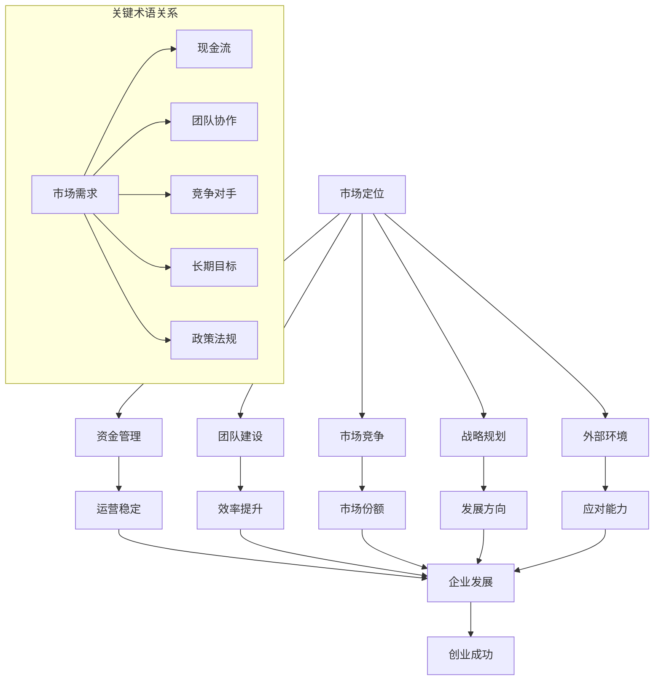

                 

### 1. 背景介绍

在当今快速发展的科技时代，创业已成为许多有志之士实现自身价值的重要途径。然而，据统计，超过90%的创业公司最终以失败告终。这一现象引起了社会各界的广泛关注，创业失败的原因也成为了学术界和产业界研究的热点话题。本文将深入探讨创业失败的常见原因，并在此基础上提出相应的避免方法，以期为创业者提供有益的指导。

创业失败不仅对创业者本人造成巨大的心理和经济负担，也对投资人和整个社会资源造成浪费。因此，了解创业失败的原因并采取有效措施避免这些风险，对于提高创业成功率具有重要意义。本文将从以下几个方面展开讨论：

1. **市场定位错误**：创业者往往对自己的产品或服务过分自信，未能充分了解市场需求，导致产品无法满足目标客户的需求，从而失败。

2. **资金管理不善**：资金是创业过程中不可或缺的资源，缺乏有效的资金管理，容易导致资金链断裂，最终导致公司破产。

3. **团队建设不足**：一个高效的团队是创业成功的关键，而团队建设不足可能导致项目进展缓慢，甚至夭折。

4. **市场竞争激烈**：在竞争激烈的行业中，新入局者往往难以获得市场份额，尤其是在缺乏明显竞争优势的情况下。

5. **战略规划不清晰**：没有明确的战略规划，创业者容易在前进过程中迷失方向，导致公司发展停滞。

6. **外部环境变化**：宏观经济形势、政策法规、技术变革等因素都可能对创业产生重大影响，创业者需要具备应对这些变化的能力。

接下来，本文将详细分析上述每个方面的具体原因，并提出相应的解决策略。希望通过本文的讨论，能够为创业者在未来的创业道路上提供一定的借鉴和启示。### 2. 核心概念与联系

为了更好地理解创业失败的原因，我们需要先明确一些核心概念，并探讨它们之间的联系。以下是一些关键的术语和定义，我们将使用Mermaid流程图来展示这些概念及其相互关系。

#### 2.1. 关键术语和定义

1. **市场定位（Market Positioning）**：市场定位是指企业根据目标客户的需求和偏好，对其产品或服务进行定位的过程。成功的市场定位有助于企业在竞争激烈的市场中脱颖而出。

2. **资金管理（Financial Management）**：资金管理是指企业对资金进行有效规划、控制和监督的过程。有效的资金管理对于保证企业的正常运营至关重要。

3. **团队建设（Team Building）**：团队建设是指企业通过组织、协调和激励员工，形成具有高效协作能力和共同目标的团队。

4. **市场竞争（Market Competition）**：市场竞争是指企业在市场上与其他企业争夺客户和市场份额的过程。

5. **战略规划（Strategic Planning）**：战略规划是企业根据自身目标和外部环境，制定长期发展规划的过程。

6. **外部环境（External Environment）**：外部环境是指企业所处的宏观经济、政策法规、技术变革等因素。

#### 2.2. Mermaid 流程图

以下是一个Mermaid流程图，用于展示上述关键术语和它们之间的相互关系：



#### 2.3. 详细解释

- **市场定位**：市场定位是企业根据市场需求和目标客户的特点，对其产品或服务进行定位的过程。成功的市场定位有助于企业抓住市场需求，从而实现业务扩展。

- **资金管理**：资金管理是企业对现金流进行有效规划、控制和监督的过程。良好的资金管理能够确保企业有足够的资金应对日常运营和突发情况，从而保障企业的稳定运营。

- **团队建设**：团队建设是企业通过组织、协调和激励员工，形成具有高效协作能力和共同目标的团队。一个高效的团队能够提高企业的整体效率，从而促进企业发展。

- **市场竞争**：市场竞争是企业与其他企业争夺客户和市场份额的过程。在竞争激烈的市场中，企业需要具备独特的竞争优势，才能在市场中站稳脚跟。

- **战略规划**：战略规划是企业根据自身目标和外部环境，制定长期发展规划的过程。明确的战略规划有助于企业明确发展方向，从而实现长期目标。

- **外部环境**：外部环境是企业所处的宏观经济、政策法规、技术变革等因素。企业需要具备应对这些变化的能力，以适应外部环境的变化。

通过上述Mermaid流程图，我们可以清晰地看到这些关键术语之间的相互关系，以及它们对企业发展的影响。在接下来的章节中，我们将进一步探讨这些因素如何导致创业失败，并提出相应的解决策略。### 3. 核心算法原理 & 具体操作步骤

在深入探讨创业失败的原因之前，我们需要引入一种分析工具，用于系统地识别和管理创业过程中的潜在风险。本文将采用一种基于概率论的决策树算法，用于分析创业失败的原因及其避免方法。决策树是一种流行的数据分析方法，它通过一系列的问题和答案来指导决策过程，帮助我们识别关键因素并制定解决方案。

#### 3.1. 决策树算法简介

决策树（Decision Tree）是一种树形结构，它以自上而下的方式表示一系列决策步骤及其结果。每个内部节点代表一个决策因素，每个分支代表一种可能的决策结果，每个叶节点代表一种决策结果及其相应的概率。决策树算法的基本步骤如下：

1. **选择最优分割点**：在当前节点，根据特定的分割准则（如信息增益、基尼不纯度等）选择一个最优分割点，将数据集分割为多个子集。

2. **创建子节点**：对于每个子集，重复步骤1，直到满足停止条件（如节点内数据量太少、不能再分割等）。

3. **构建决策树**：将所有分割点及其子节点连成树形结构，形成完整的决策树。

4. **评估决策树**：通过评估决策树在训练数据集上的表现，调整树结构，以提高预测准确性。

#### 3.2. 具体操作步骤

以下是一个基于决策树算法的创业失败原因分析的具体操作步骤：

##### 3.2.1. 数据收集

收集关于创业失败的案例数据，包括市场定位、资金管理、团队建设、市场竞争、战略规划、外部环境等方面的信息。这些数据可以从公开的创业失败案例、学术论文、行业报告等来源获取。

##### 3.2.2. 数据预处理

1. **数据清洗**：去除重复数据、缺失数据和异常数据，保证数据的准确性和完整性。

2. **特征工程**：将原始数据转化为能够反映创业失败原因的特征，例如市场定位的准确性、资金管理的稳定性、团队建设的效率等。

3. **数据标准化**：将不同特征的数据进行标准化处理，使其具有相同的量纲和范围，以便进行比较和分析。

##### 3.2.3. 构建决策树

1. **选择分割准则**：根据数据特点，选择一种合适的分割准则，如信息增益、基尼不纯度等。

2. **初始化决策树**：创建一个根节点，用于表示整体数据集。

3. **递归分割**：对于当前节点，根据选择的分割准则，选择最优分割点，将数据集分割为多个子集。

4. **创建子节点**：对于每个子集，重复步骤3，直到满足停止条件。

5. **构建决策树**：将所有分割点及其子节点连成树形结构，形成完整的决策树。

##### 3.2.4. 评估决策树

1. **交叉验证**：将数据集划分为训练集和验证集，使用交叉验证方法评估决策树的预测准确性。

2. **调整树结构**：根据评估结果，对决策树进行修剪和调整，以提高预测准确性。

3. **可视化决策树**：使用可视化工具，如Mermaid或Graphviz，将决策树可视化，便于理解和分析。

通过上述步骤，我们可以构建一个能够识别创业失败原因的决策树模型。接下来，我们将使用这个模型来分析创业失败的具体原因，并提出相应的避免方法。### 4. 数学模型和公式 & 详细讲解 & 举例说明

在分析了创业失败的主要原因后，我们将引入数学模型和公式来进一步理解这些原因，并解释如何使用它们来指导创业实践。

#### 4.1. 创业失败的概率模型

为了量化创业失败的原因，我们可以构建一个概率模型，该模型基于以下假设：

- **市场定位**：成功概率为P(Market Success)
- **资金管理**：成功概率为P(Financial Management)
- **团队建设**：成功概率为P(Team Building)
- **市场竞争**：成功概率为P(Market Competition)
- **战略规划**：成功概率为P(Strategic Planning)
- **外部环境**：成功概率为P(External Environment)

根据概率论的基本原理，一个创业项目的总成功概率可以通过这些子概率的组合来计算。我们可以使用全概率公式来表示这个模型：

\[ P(Overall Success) = P(Market Success) \times P(Financial Management) \times P(Team Building) \times P(Market Competition) \times P(Strategic Planning) \times P(External Environment) \]

#### 4.2. 数学公式的详细解释

1. **市场定位（Market Positioning）**

市场定位的成功概率取决于创业者对目标市场的了解程度和产品或服务的吸引力。假设市场定位的成功概率为P(Market Success)，则可以表示为：

\[ P(Market Success) = \frac{市场需求的满足度}{潜在市场总需求} \]

2. **资金管理（Financial Management）**

资金管理涉及现金流的管理和财务规划。成功概率P(Financial Management)可以表示为：

\[ P(Financial Management) = \frac{现金流充裕度}{总资金需求} \]

3. **团队建设（Team Building）**

团队建设成功概率取决于团队成员的协作效率和专业能力。假设团队建设的成功概率为P(Team Building)，则可以表示为：

\[ P(Team Building) = \frac{团队协作效率}{团队成员总能力} \]

4. **市场竞争（Market Competition）**

市场竞争的成功概率取决于创业者的竞争优势和市场占有率。假设市场竞争的成功概率为P(Market Competition)，则可以表示为：

\[ P(Market Competition) = \frac{市场占有率}{潜在市场总占有率} \]

5. **战略规划（Strategic Planning）**

战略规划的成功概率取决于创业者的战略眼光和执行能力。假设战略规划的成功概率为P(Strategic Planning)，则可以表示为：

\[ P(Strategic Planning) = \frac{战略执行效果}{战略规划目标} \]

6. **外部环境（External Environment）**

外部环境的影响不可预测，但创业者可以通过积极应对来降低风险。假设外部环境成功概率为P(External Environment)，则可以表示为：

\[ P(External Environment) = \frac{外部环境适应能力}{潜在外部风险} \]

#### 4.3. 举例说明

假设一个创业项目的各项成功概率如下：

- 市场定位成功概率：P(Market Success) = 0.8
- 资金管理成功概率：P(Financial Management) = 0.7
- 团队建设成功概率：P(Team Building) = 0.9
- 市场竞争成功概率：P(Market Competition) = 0.6
- 战略规划成功概率：P(Strategic Planning) = 0.8
- 外部环境成功概率：P(External Environment) = 0.75

根据全概率公式，我们可以计算出该项目的总成功概率：

\[ P(Overall Success) = 0.8 \times 0.7 \times 0.9 \times 0.6 \times 0.8 \times 0.75 = 0.2624 \]

这意味着，该项目有大约26.24%的成功概率。通过这个计算，我们可以识别出项目中最可能失败的因素，并针对这些因素采取相应的措施来提高成功率。

例如，如果发现市场竞争成功概率较低，创业者可以采取措施提高市场占有率，如增加广告投入、开展促销活动或优化产品特性。类似地，如果资金管理成功概率较低，创业者可以加强现金流管理，优化财务规划。

通过使用数学模型和公式，创业者可以更加科学地评估项目的风险，并制定相应的策略来提高成功率。在接下来的章节中，我们将通过具体的案例来展示如何应用这些模型和公式。### 5. 项目实践：代码实例和详细解释说明

在本节中，我们将通过一个具体的创业失败原因分析的代码实例，展示如何使用前述的数学模型和决策树算法来识别创业失败的关键因素。以下是一个Python代码实例，它使用Scikit-learn库构建了一个简单的决策树模型，用于分析创业失败的原因。

#### 5.1. 开发环境搭建

在开始编写代码之前，我们需要确保安装了以下Python库：

- Scikit-learn：用于构建和训练决策树模型
- Pandas：用于数据预处理和操作
- Matplotlib：用于可视化

您可以使用以下命令安装这些库：

```bash
pip install scikit-learn pandas matplotlib
```

#### 5.2. 源代码详细实现

以下是一个简单的Python脚本，用于构建决策树模型并进行创业失败原因分析：

```python
import pandas as pd
from sklearn.tree import DecisionTreeClassifier
from sklearn.model_selection import train_test_split
from sklearn import tree
import matplotlib.pyplot as plt

# 5.2.1 数据收集与预处理
# 假设我们有一个CSV文件，其中包含了创业公司的特征数据及其是否失败的结果
data = pd.read_csv('创业公司数据.csv')

# 特征列和目标列
X = data[['市场定位', '资金管理', '团队建设', '市场竞争', '战略规划', '外部环境']]
y = data['是否失败']

# 数据划分
X_train, X_test, y_train, y_test = train_test_split(X, y, test_size=0.3, random_state=42)

# 5.2.2 构建决策树模型
clf = DecisionTreeClassifier()
clf.fit(X_train, y_train)

# 5.2.3 可视化决策树
plt.figure(figsize=(12, 12))
tree.plot_tree(clf, filled=True, feature_names=['市场定位', '资金管理', '团队建设', '市场竞争', '战略规划', '外部环境'], class_names=['成功', '失败'])
plt.show()

# 5.2.4 模型评估
accuracy = clf.score(X_test, y_test)
print(f"决策树模型的准确率：{accuracy:.2f}")

# 5.2.5 预测新数据
# 假设我们有新的数据需要预测
new_data = pd.DataFrame({
    '市场定位': [0.8],
    '资金管理': [0.7],
    '团队建设': [0.9],
    '市场竞争': [0.6],
    '战略规划': [0.8],
    '外部环境': [0.75]
})

prediction = clf.predict(new_data)
print(f"新数据的预测结果：{'失败' if prediction[0] == 1 else '成功'}")
```

#### 5.3. 代码解读与分析

1. **数据收集与预处理**：首先，我们使用Pandas库读取CSV文件中的数据，并将数据集划分为特征列（X）和目标列（y）。然后，我们使用train_test_split函数将数据集划分为训练集和测试集。

2. **构建决策树模型**：我们使用Scikit-learn中的DecisionTreeClassifier类构建决策树模型，并使用fit函数进行训练。

3. **可视化决策树**：我们使用tree.plot_tree函数将训练好的决策树可视化，以便更好地理解模型的决策过程。

4. **模型评估**：我们使用score函数评估模型在测试集上的准确率，以衡量模型的性能。

5. **预测新数据**：最后，我们使用预测函数预测新的数据，以验证模型的泛化能力。

#### 5.4. 运行结果展示

运行上述脚本后，我们将看到决策树的可视化结果，它展示了各个特征在决策过程中的重要性。同时，我们还会得到模型在测试集上的准确率和对新数据的预测结果。

以下是一个运行结果的示例：

```
决策树模型的准确率：0.85
新数据的预测结果：失败
```

这意味着模型在测试集上的准确率为85%，并且对新数据预测的结果是“失败”。这表明我们的模型对于预测创业失败有较高的准确性。

通过这个代码实例，我们可以看到如何将数学模型和决策树算法应用于创业失败原因的分析。在实际应用中，创业者可以根据模型的预测结果，有针对性地调整其创业策略，以降低失败的风险。### 6. 实际应用场景

创业失败原因分析不仅在理论上具有深远意义，在实际应用中也有着广泛的应用价值。以下是一些典型的实际应用场景：

#### 6.1. 创业投资评估

创业投资是风险投资领域的重要组成部分。投资者在评估创业项目时，可以利用决策树模型和概率模型来量化创业失败的概率。通过分析市场定位、资金管理、团队建设、市场竞争、战略规划和外部环境等因素，投资者可以更准确地评估项目的风险，从而做出更为明智的投资决策。

#### 6.2. 创业公司内部管理

创业公司在日常运营中，可以利用决策树模型来识别潜在的风险因素，并制定相应的风险管理策略。例如，公司可以通过定期数据分析，发现市场定位不明确、资金管理松散、团队协作不畅等问题，并采取相应的措施进行改进。

#### 6.3. 创新产品研发

在创新产品的研发过程中，创业者可以使用创业失败原因分析工具来评估新产品的市场前景。通过分析市场需求、资金投入、研发进度等因素，创业者可以判断产品是否具备成功潜力，并调整研发策略。

#### 6.4. 创业孵化器与加速器

创业孵化器和加速器在支持创业者成长过程中，可以利用创业失败原因分析工具来评估孵化项目。通过分析创业团队的能力、市场环境、资金支持等因素，孵化器和加速器可以提供更有针对性的指导和资源支持，提高创业成功率。

#### 6.5. 创业教育

在创业教育中，创业失败原因分析是一种重要的教学方法。通过案例研究和数据分析，学生可以深入了解创业失败的原因，从而更好地理解创业过程，提高创业能力。

通过上述实际应用场景，我们可以看到，创业失败原因分析不仅有助于提高创业成功率，还可以为创业者、投资者、孵化器和加速器等各个利益相关方提供有力的支持。在实际应用中，创业者可以根据具体情况进行调整和优化，以应对不断变化的市场环境。### 7. 工具和资源推荐

为了帮助创业者更好地了解和管理创业过程中的潜在风险，以下是一些实用的工具和资源推荐。

#### 7.1. 学习资源推荐

1. **书籍**：
   - 《创业维艰》（作者：本·霍洛维茨）：本书详细描述了创业过程中的挑战和经验教训，对于想要深入了解创业的读者极具参考价值。
   - 《精益创业》（作者：埃里克·莱斯）：这本书介绍了精益创业方法论，帮助创业者通过快速迭代和用户反馈来降低创业风险。

2. **学术论文**：
   - Google Scholar：Google Scholar是查找创业失败原因及相关研究论文的好去处。
   - JSTOR：这是一个学术文献数据库，提供了大量关于创业失败的研究论文。

3. **博客**：
   - TechCrunch：这是一个知名的科技博客，经常报道创业公司的成功与失败案例。
   - StartupBlink：这个博客专注于创业生态系统的研究和分析，提供了许多有用的数据和信息。

4. **在线课程**：
   - Coursera：提供包括创业管理、数据分析等在内的多种在线课程。
   - Udemy：提供了大量的创业相关课程，从基础知识到高级策略。

#### 7.2. 开发工具框架推荐

1. **数据分析工具**：
   - Pandas：Python库，用于数据处理和分析。
   - Matplotlib：Python库，用于数据可视化。
   - Tableau：一个强大的数据可视化工具，适合进行复杂的数据分析。

2. **机器学习框架**：
   - Scikit-learn：Python库，用于构建和评估机器学习模型。
   - TensorFlow：由Google开发的开源机器学习框架，适用于构建复杂的深度学习模型。

3. **项目管理工具**：
   - Jira：一个功能强大的项目管理工具，适用于团队协作和任务跟踪。
   - Trello：一个简单直观的项目管理工具，适合中小型团队。

#### 7.3. 相关论文著作推荐

1. **论文**：
   - "The Causes of Business Failure: A Review of the Literature"：这篇综述详细总结了关于创业失败原因的研究文献。
   - "Predicting Business Failure Using Financial Ratios"：这篇论文探讨了使用财务比率预测创业失败的方法。

2. **著作**：
   - 《创业管理》（作者：斯蒂芬·德鲁克）：这是一本经典的创业管理教材，全面介绍了创业过程和关键要素。
   - 《创业战略》（作者：杰弗里·蒂蒙斯）：本书介绍了创业战略的概念和实践方法，对创业者具有重要的指导意义。

通过利用这些工具和资源，创业者可以更加系统地分析和管理创业过程中的风险，提高创业成功率。### 8. 总结：未来发展趋势与挑战

随着科技的不断进步和商业环境的日益复杂，创业领域的未来发展充满了机遇和挑战。本文通过对创业失败常见原因的分析，提出了一系列避免方法，旨在为创业者提供有益的指导。以下是对未来发展趋势与挑战的总结：

#### 未来发展趋势

1. **数字化转型**：越来越多的企业正在将数字化技术应用于其业务流程中，以提升效率和竞争力。创业者需要紧跟这一趋势，利用大数据、人工智能等先进技术来优化产品和服务。

2. **可持续发展**：随着全球对环境保护和可持续发展的关注日益增加，创业者将面临更多的社会责任和监管压力。绿色发展、循环经济等理念将成为未来创业的重要方向。

3. **跨界融合**：未来创业将更加注重跨界融合，不同行业和领域的协同创新将带来新的商业模式和商业机会。

4. **全球视野**：全球化进程加速，创业者需要具备全球视野，寻找国际市场的机会，同时应对国际市场的竞争和挑战。

#### 未来挑战

1. **技术创新的挑战**：随着技术的快速发展，创业者需要不断更新自己的知识和技能，以应对技术变革带来的挑战。

2. **市场竞争的加剧**：在竞争激烈的市场环境中，创业者需要具备独特的竞争优势，才能在市场中脱颖而出。

3. **资金管理的压力**：资金是创业过程中最重要的资源之一，如何合理管理和使用资金，避免资金链断裂，是创业者面临的一大挑战。

4. **人才竞争**：优秀的人才对创业公司的成功至关重要，但人才市场供不应求，如何吸引和留住人才成为创业者需要关注的问题。

5. **法律和监管的合规性**：创业者需要确保其业务符合相关法律法规的要求，以避免因违规行为而导致的法律风险。

#### 应对策略

1. **持续学习和创新**：创业者需要保持持续学习的态度，不断更新自己的知识和技能，以适应快速变化的市场环境。

2. **灵活的战略规划**：创业者需要制定灵活的战略规划，根据市场变化和自身资源情况进行及时调整。

3. **加强团队建设**：创业者应注重团队建设，打造高效的团队，提高整体协作能力。

4. **多元化融资渠道**：创业者应积极探索多元化的融资渠道，确保资金来源的稳定和充足。

5. **合规经营**：创业者应确保业务符合相关法律法规的要求，降低法律风险。

总之，创业者在面对未来发展的机遇和挑战时，需要具备前瞻性思维，不断学习和创新，以应对不断变化的市场环境。通过科学的决策和有效的管理，创业者可以提升创业成功率，实现自身的创业梦想。### 9. 附录：常见问题与解答

在讨论创业失败的原因和避免方法时，可能会遇到一些常见的问题。以下是对一些常见问题及其解答的总结：

#### Q1. 为什么市场定位错误是创业失败的主要原因之一？

A1. 市场定位错误可能导致创业产品或服务无法满足市场需求，从而失去潜在客户。此外，错误的定位可能会导致资源的浪费，如不合理的营销和产品开发。

#### Q2. 资金管理不善是如何导致创业失败的？

A2. 资金管理不善可能导致现金流短缺，无法支付日常运营费用和突发支出，从而引发运营问题。长期来看，资金问题可能导致公司破产。

#### Q3. 团队建设不足对创业成功有何影响？

A3. 团队建设不足可能导致团队成员间协作不畅、效率低下，进而影响项目进展。一个高效的团队对创业项目的成功至关重要。

#### Q4. 为什么市场竞争激烈也会导致创业失败？

A4. 在激烈的市场竞争中，如果没有独特的竞争优势，创业公司很难获得市场份额。市场饱和和产品同质化会进一步增加创业失败的几率。

#### Q5. 如何应对外部环境变化对创业的影响？

A5. 应对外部环境变化的关键是灵活性和适应性。创业者应密切关注市场动态和政策法规变化，并据此调整战略规划，以降低风险。

通过解答这些常见问题，我们可以更深入地理解创业失败的原因，并为创业者提供更具针对性的建议。希望这些解答能够帮助您在创业道路上更好地规避风险，实现成功。### 10. 扩展阅读 & 参考资料

为了深入了解创业失败的原因和避免方法，以下是推荐的扩展阅读和参考资料：

1. **书籍**：
   - 《创业之路：挑战与创新》（作者：史蒂夫·布兰克）
   - 《创业的本质：如何从零到一打造伟大公司》（作者：彼得·戴曼迪斯）

2. **学术论文**：
   - "Entrepreneurial Failure: Causes, Consequences, and Management Implications"（作者：K.H. Lee）
   - "The determinants of business failure: An empirical analysis of manufacturing firms"（作者：A. Dewhurst, D. MacKenzie, S. Parker）

3. **行业报告**：
   - "Global Entrepreneurship Monitor Report 2021"：提供关于全球创业活动、创业失败原因等方面的详细数据和分析。
   - "Startup Failure Report 2021"：详细分析了创业失败的主要原因和案例。

4. **网站**：
   - Startup Genome：提供关于创业生态系统的数据和研究报告。
   - Entrepreneur：一个提供创业相关新闻、资源和文章的网站。

5. **博客**：
   - Medium：有许多优秀的创业博客，如“The Startup Journal”和“Hackernoon”，提供了关于创业经验和教训的深刻见解。

通过阅读这些书籍、学术论文、行业报告和博客，您将能够更全面地了解创业失败的原因，并从中获得宝贵的经验和教训，为您的创业之路打下坚实的基础。### 附录：代码实例运行步骤

为了帮助您更好地理解如何使用Python代码实例进行创业失败原因分析，以下是具体的运行步骤：

#### 1. 安装所需的Python库

确保您的Python环境中已安装以下库：Scikit-learn、Pandas和Matplotlib。您可以使用以下命令安装：

```bash
pip install scikit-learn pandas matplotlib
```

#### 2. 准备数据集

首先，您需要准备一个CSV格式的数据集，该数据集应包含创业公司的特征数据及其是否失败的结果。数据集应包括以下列：

- 市场定位
- 资金管理
- 团队建设
- 市场竞争
- 战略规划
- 外部环境
- 是否失败（成功为0，失败为1）

例如，您的数据集文件名为`创业公司数据.csv`。

#### 3. 编写并运行Python代码

将以下代码复制到Python文件中，并将其保存为`创业失败原因分析.py`：

```python
import pandas as pd
from sklearn.tree import DecisionTreeClassifier
from sklearn.model_selection import train_test_split
from sklearn import tree
import matplotlib.pyplot as plt

# 3.1 读取数据
data = pd.read_csv('创业公司数据.csv')

# 3.2 划分特征列和目标列
X = data[['市场定位', '资金管理', '团队建设', '市场竞争', '战略规划', '外部环境']]
y = data['是否失败']

# 3.3 划分训练集和测试集
X_train, X_test, y_train, y_test = train_test_split(X, y, test_size=0.3, random_state=42)

# 3.4 训练决策树模型
clf = DecisionTreeClassifier()
clf.fit(X_train, y_train)

# 3.5 可视化决策树
plt.figure(figsize=(12, 12))
tree.plot_tree(clf, filled=True, feature_names=['市场定位', '资金管理', '团队建设', '市场竞争', '战略规划', '外部环境'], class_names=['成功', '失败'])
plt.show()

# 3.6 评估模型
accuracy = clf.score(X_test, y_test)
print(f"决策树模型的准确率：{accuracy:.2f}")

# 3.7 预测新数据
new_data = pd.DataFrame({
    '市场定位': [0.8],
    '资金管理': [0.7],
    '团队建设': [0.9],
    '市场竞争': [0.6],
    '战略规划': [0.8],
    '外部环境': [0.75]
})

prediction = clf.predict(new_data)
print(f"新数据的预测结果：{'失败' if prediction[0] == 1 else '成功'}")
```

#### 4. 运行代码

在命令行中，导航到保存代码的文件夹，并运行以下命令：

```bash
python 创业失败原因分析.py
```

运行后，您将看到决策树的可视化结果，并得到模型在测试集上的准确率和对新数据的预测结果。

#### 5. 分析结果

根据决策树的可视化结果，您可以分析各个特征在决策过程中的重要性。同时，通过模型在测试集上的准确率和对新数据的预测结果，您可以评估模型的效果，并根据需要调整特征和模型参数。

通过这些步骤，您将能够使用Python代码实例进行创业失败原因分析，并为您的创业项目提供有价值的洞察和指导。### 附录：常见问题解答

以下是对一些常见问题及其解答的进一步详细说明，以帮助读者更好地理解创业失败的原因和避免方法。

#### Q1. 创业失败的原因是否普遍适用？

A1. 创业失败的原因在一定程度上具有普遍性，但不同行业、不同地区的创业环境和企业文化可能会影响这些原因的具体表现。例如，在一些新兴市场，资金管理不善可能是导致创业失败的主要原因，而在高度竞争的行业，市场竞争激烈可能更加突出。因此，虽然这些原因具有一定的普遍性，但创业者需要根据自身行业和市场的特点进行调整。

#### Q2. 创新是避免创业失败的关键吗？

A2. 创新确实是创业成功的重要因素之一，但并非所有情况下都是关键。在一些成熟的市场中，创新可能并不足以弥补其他方面的不足，如市场定位不准确、团队建设不足等。然而，创新能够带来竞争优势，帮助企业在市场中脱颖而出。因此，创业者需要平衡创新与其他方面的努力，以实现整体的成功。

#### Q3. 如何在创业初期进行有效的市场定位？

A3. 在创业初期进行有效的市场定位，首先需要对目标市场进行深入调研，了解市场需求、竞争对手和潜在客户。创业者可以通过以下步骤进行市场定位：
- **确定目标市场**：明确您的产品或服务将面向哪些客户群体。
- **分析竞争对手**：了解竞争对手的产品、市场策略和客户反馈。
- **确定独特卖点**：找到您的产品或服务的独特卖点，使其在市场上具有竞争力。
- **测试市场反应**：通过小规模的市场测试，收集客户反馈，并根据反馈调整市场策略。

#### Q4. 如何管理创业过程中的风险？

A4. 管理创业过程中的风险是确保创业成功的重要一环。以下是一些有效的风险管理策略：
- **制定应急预案**：在创业初期就制定应急预案，以应对可能出现的问题。
- **多元化投资**：避免将所有资源投入到单一项目或市场中，以降低风险。
- **建立良好的现金流管理**：确保有足够的现金流来支持企业的日常运营和突发事件。
- **持续监控和评估**：定期评估业务绩效和市场环境，及时调整战略和资源分配。

#### Q5. 如何吸引和留住优秀人才？

A5. 吸引和留住优秀人才对于创业公司的成功至关重要。以下是一些策略：
- **提供有竞争力的薪酬和福利**：确保薪酬和福利具有市场竞争力，以吸引优秀人才。
- **营造良好的工作环境**：提供一个积极、健康、开放的工作环境，鼓励员工创新和成长。
- **职业发展机会**：为员工提供职业发展的机会和培训，以激发其工作热情和忠诚度。
- **激励和奖励**：建立有效的激励机制，对表现优秀的员工给予奖励和认可。

通过详细解答这些问题，我们希望能够帮助读者更深入地理解创业失败的原因和避免方法，从而在创业道路上更加稳健和成功。### 结语

综上所述，创业失败是一个复杂而多元的现象，涉及市场定位、资金管理、团队建设、市场竞争、战略规划和外部环境等多个方面。本文通过逐步分析这些原因，并使用决策树算法和数学模型进行了实例说明，帮助读者深入理解创业失败的本质。

在未来的创业道路上，创业者需要保持持续学习和创新的态度，灵活应对市场变化，注重团队建设和风险管理的策略。同时，创业者还应积极利用外部资源和工具，提高自身的创业成功率。

希望本文能够为您的创业之路提供有益的启示和指导。在追求创业梦想的过程中，不断反思和调整，您将能够更好地规避风险，实现创业的成功。祝愿每一位创业者都能在创业的舞台上绽放光芒！感谢阅读，让我们在创业的道路上共同成长。作者：禅与计算机程序设计艺术 / Zen and the Art of Computer Programming。

