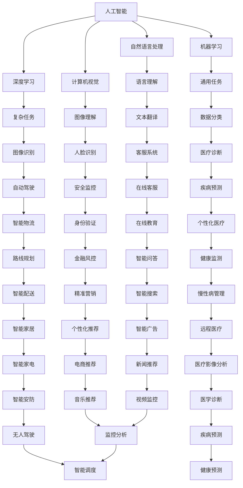

                 

### 1. 背景介绍

在当今社会，人工智能（AI）已经成为推动技术创新和经济增长的重要引擎。随着深度学习、自然语言处理、计算机视觉等领域的不断突破，AI技术的应用范围正迅速扩大，从工业制造、金融服务到医疗健康、交通运输等多个行业，AI都在发挥着不可替代的作用。这种变革不仅影响了企业运营模式，也为创业者提供了前所未有的机遇。

创业者在AI浪潮中的机会主要表现在以下几个方面：

1. **技术创新**：AI技术为创业者提供了强大的工具，使得他们能够开发出更具创新性的产品和服务。例如，通过使用深度学习技术，创业者可以构建智能化的语音识别系统、图像分析平台等，提供高效、精准的解决方案。

2. **市场机会**：随着AI技术的普及，新的市场需求不断涌现。创业者可以针对这些需求，开发专门的产品和服务。例如，随着智能家居市场的兴起，创业者可以开发智能家电控制系统，为用户提供更加便捷、智能的生活体验。

3. **商业模式的创新**：AI技术的应用可以帮助创业者构建新的商业模式。例如，通过利用大数据分析和预测技术，创业者可以提供精准的营销服务，帮助企业提高销售业绩。同时，AI技术还可以帮助企业降低运营成本，提高生产效率。

4. **生态系统的建设**：AI技术的发展不仅需要技术人才，还需要各种专业支持，如数据、算法、硬件等。创业者可以通过搭建生态系统，吸引各类人才和资源，共同推动AI技术的发展。

接下来，我们将进一步探讨AI浪潮中，创业者如何把握机会，利用AI技术实现创业梦想。

#### AI技术的应用领域

AI技术的应用领域非常广泛，几乎覆盖了所有行业。以下是一些主要的应用领域及其具体案例：

**1. 工业制造**

在工业制造领域，AI技术被广泛应用于生产流程的优化和产品质量的监控。例如，通过使用机器视觉技术，工厂可以实现自动化的质量检测，减少人为错误和提高生产效率。同时，AI技术还可以用于预测维护，通过分析设备运行数据，提前发现潜在故障，从而降低设备停机时间和维修成本。

**案例**：通用电气（GE）的Predix平台，就是一个利用AI技术优化工业制造流程的典型例子。Predix平台通过大数据分析和机器学习算法，帮助工厂实现设备预测性维护，提高了生产效率和设备利用率。

**2. 金融服务**

在金融服务领域，AI技术被广泛应用于风险管理、欺诈检测、客户服务等方面。通过使用自然语言处理和深度学习技术，金融机构可以提供更加智能化的客户服务，提高客户满意度。同时，AI技术还可以用于风险管理，通过分析海量数据，预测市场波动，帮助企业降低风险。

**案例**：美国运通（American Express）使用AI技术进行欺诈检测，通过分析客户的消费行为和交易数据，能够快速识别异常交易，提高了欺诈检测的准确率和响应速度。

**3. 医疗健康**

在医疗健康领域，AI技术被广泛应用于疾病诊断、药物研发、医疗影像分析等方面。通过使用深度学习和计算机视觉技术，AI可以帮助医生更准确地诊断疾病，提高治疗效果。同时，AI技术还可以加速药物研发过程，通过大数据分析和模拟实验，提高新药的发现和开发效率。

**案例**：谷歌的DeepMind项目，通过使用AI技术进行医疗影像分析，可以帮助医生更准确地诊断疾病，提高了医疗服务的质量和效率。

**4. 交通运输**

在交通运输领域，AI技术被广泛应用于自动驾驶、交通管理和物流优化等方面。通过使用计算机视觉和深度学习技术，AI可以帮助车辆实现自动驾驶，提高交通安全和效率。同时，AI技术还可以用于交通管理，通过分析交通数据，优化交通信号灯的配置，减少交通拥堵。

**案例**：谷歌的Waymo项目，通过使用AI技术实现自动驾驶汽车，已经在多个城市进行了测试和商用，为用户提供了更加安全、高效的出行体验。

通过以上案例可以看出，AI技术在各个领域的应用，不仅提高了行业效率，还创造了新的商业模式和市场机会。对于创业者来说，了解这些应用领域和案例，有助于他们更好地把握AI浪潮中的机会，实现创业梦想。

### 2. 核心概念与联系

在探讨创业者在AI浪潮中的机会之前，有必要先了解一些核心概念和它们之间的联系。以下是对这些核心概念及其相互关系的简要介绍，并通过Mermaid流程图展示其架构。

#### 核心概念

1. **人工智能（AI）**：人工智能是指由人制造出来的系统，具有人类的一些智能特性，如学习、推理、解决问题、感知和理解语言等。

2. **深度学习（Deep Learning）**：深度学习是AI的一个分支，它通过构建多层神经网络，自动从数据中学习特征和模式，实现图像识别、语音识别等任务。

3. **机器学习（Machine Learning）**：机器学习是AI的一个分支，它专注于利用数据和算法来训练模型，使系统能够从经验中学习并做出决策。

4. **自然语言处理（NLP）**：自然语言处理是AI的一个分支，它致力于使计算机能够理解和生成自然语言，应用于翻译、聊天机器人等。

5. **计算机视觉（CV）**：计算机视觉是AI的一个分支，它专注于使计算机能够解释和解析视觉数据，如图像和视频。

#### 相互关系

- **人工智能（AI）** 是一个总的概念，包括多个分支，如深度学习、机器学习、自然语言处理和计算机视觉。
- **深度学习和机器学习** 都是AI的技术手段，但深度学习是机器学习的一种特殊形式，通常用于复杂的数据集。
- **自然语言处理** 和 **计算机视觉** 是AI在特定领域的应用，通过利用深度学习和机器学习技术，实现语言理解和图像识别。

#### Mermaid流程图



通过上述流程图，我们可以清晰地看到AI的不同分支及其相互关系。创业者可以根据这些核心概念和相互联系，选择合适的技术和领域进行创业，从而把握AI浪潮中的机会。

### 3. 核心算法原理 & 具体操作步骤

在了解了AI的核心概念和相互关系之后，我们需要深入探讨其中的核心算法原理，并详细说明其具体操作步骤。本节将重点关注深度学习算法，这是当前AI领域最为重要的技术之一。

#### 深度学习算法原理

深度学习算法基于多层神经网络（Neural Networks）的结构，通过模拟人脑神经元之间的连接和作用，从数据中学习特征和模式。其基本原理可以概括为以下几个步骤：

1. **数据输入**：将原始数据输入神经网络，这些数据可以是图像、声音、文本等。
2. **前向传播**：数据从输入层通过多层隐藏层，最终到达输出层。在每一层中，神经元通过激活函数计算输出值。
3. **反向传播**：计算输出值与实际值之间的误差，然后将误差反向传播回隐藏层和输入层，通过调整权重和偏置，优化网络参数。
4. **迭代训练**：重复上述步骤，直至网络参数收敛，达到预定的训练目标。

#### 具体操作步骤

以下是一个简单的深度学习模型——多层感知机（MLP）的具体操作步骤：

1. **数据准备**：收集并预处理数据，包括数据清洗、归一化和划分训练集、验证集和测试集。

2. **初始化参数**：设定网络结构，包括输入层、隐藏层和输出层的神经元数量。初始化权重和偏置，通常采用随机初始化方法。

3. **前向传播**：将输入数据输入网络，通过多层非线性变换，得到输出结果。

4. **计算损失函数**：比较输出结果与实际标签，计算损失函数（如均方误差MSE），反映模型的预测误差。

5. **反向传播**：根据损失函数，计算梯度，并通过链式法则反向传播到各层，更新权重和偏置。

6. **迭代训练**：重复步骤3到5，直至达到预定的迭代次数或损失函数收敛。

7. **模型评估**：使用验证集或测试集评估模型性能，如准确率、召回率等指标。

8. **模型部署**：将训练好的模型部署到生产环境中，用于实际应用。

#### 代码示例

以下是一个使用Python和TensorFlow实现的简单MLP模型：

```python
import tensorflow as tf

# 初始化模型
model = tf.keras.Sequential([
    tf.keras.layers.Dense(64, activation='relu', input_shape=(784,)),
    tf.keras.layers.Dense(64, activation='relu'),
    tf.keras.layers.Dense(10, activation='softmax')
])

# 编译模型
model.compile(optimizer='adam',
              loss='categorical_crossentropy',
              metrics=['accuracy'])

# 加载数据
(x_train, y_train), (x_test, y_test) = tf.keras.datasets.mnist.load_data()

# 预处理数据
x_train = x_train.astype('float32') / 255
x_test = x_test.astype('float32') / 255
x_train = x_train.reshape((-1, 784))
x_test = x_test.reshape((-1, 784))

# 转换标签为one-hot编码
y_train = tf.keras.utils.to_categorical(y_train, 10)
y_test = tf.keras.utils.to_categorical(y_test, 10)

# 训练模型
model.fit(x_train, y_train, batch_size=128, epochs=10, validation_split=0.1)

# 评估模型
model.evaluate(x_test, y_test)
```

通过上述代码示例，我们可以看到如何使用TensorFlow构建和训练一个简单的MLP模型。这个模型可以用于手写数字识别任务，具有较高的准确率。

#### 结论

深度学习算法是AI领域中最为核心的技术之一，通过模拟人脑神经元的工作原理，实现了从数据中自动学习特征和模式。创业者可以通过了解和掌握深度学习算法的基本原理和操作步骤，开发出具有创新性的AI产品和服务，把握AI浪潮中的机会。

### 4. 数学模型和公式 & 详细讲解 & 举例说明

在深度学习算法中，数学模型和公式起到了至关重要的作用。这些模型和公式不仅帮助我们理解和设计神经网络结构，还指导我们如何优化和训练模型。在本节中，我们将详细讲解一些核心的数学模型和公式，并通过具体例子说明它们的应用。

#### 4.1 激活函数

激活函数是深度学习中的一个关键组成部分，它决定了神经元的输出。以下是一些常见的激活函数：

1. **Sigmoid 函数**：

   公式：\[ \sigma(x) = \frac{1}{1 + e^{-x}} \]

   Sigmoid函数将输入 \( x \) 映射到 \( (0, 1) \) 区间。它常用于二分类问题，输出值表示属于某一类的概率。

   **举例**：假设输入值为 \( x = 3 \)，则

   \[ \sigma(3) = \frac{1}{1 + e^{-3}} \approx 0.95 \]

   这意味着输入 \( x = 3 \) 更有可能属于正类。

2. **ReLU 函数**：

   公式：\[ \text{ReLU}(x) = \max(0, x) \]

   ReLU（Rectified Linear Unit）函数在输入为负时输出为零，输入为正时输出等于输入值。它简化了计算过程，并且有助于缓解梯度消失问题。

   **举例**：假设输入值为 \( x = -2 \) 和 \( x = 3 \)，则

   \[ \text{ReLU}(-2) = 0 \]
   \[ \text{ReLU}(3) = 3 \]

3. **Tanh 函数**：

   公式：\[ \tanh(x) = \frac{e^x - e^{-x}}{e^x + e^{-x}} \]

   Tanh函数将输入 \( x \) 映射到 \( (-1, 1) \) 区间，常用于多分类问题，输出值的范围更加对称。

   **举例**：假设输入值为 \( x = 1 \)，则

   \[ \tanh(1) = \frac{e^1 - e^{-1}}{e^1 + e^{-1}} \approx 0.76 \]

#### 4.2 前向传播与反向传播

深度学习中的训练过程涉及前向传播和反向传播。以下是这两个过程的数学描述：

1. **前向传播**：

   在前向传播过程中，输入数据通过网络的各个层，最终得到输出结果。

   假设网络包含一个输入层、一个隐藏层和一个输出层，定义如下：

   - \( x \)：输入向量
   - \( z \)：隐藏层输出
   - \( a \)：输出层输出
   - \( W \)：权重矩阵
   - \( b \)：偏置向量
   - \( \sigma \)：激活函数

   隐藏层输出 \( z \) 可以表示为：

   \[ z = W \cdot x + b \]

   输出层输出 \( a \) 可以表示为：

   \[ a = \sigma(z) \]

2. **反向传播**：

   在反向传播过程中，计算输出结果与实际标签之间的误差，并更新权重和偏置。

   误差函数通常选择均方误差（MSE）：

   \[ J = \frac{1}{2} \sum (y - a)^2 \]

   其中 \( y \) 是实际标签，\( a \) 是预测输出。

   更新权重和偏置的公式为：

   \[ \Delta W = \frac{\partial J}{\partial W} \]
   \[ \Delta b = \frac{\partial J}{\partial b} \]

   通过梯度下降（Gradient Descent）算法，可以迭代更新权重和偏置，直至达到预定的损失函数最小值。

#### 4.3 举例说明

以下是一个简单的例子，说明如何使用前向传播和反向传播训练一个二分类神经网络：

1. **输入数据**：

   - 输入向量 \( x = [1, 2, 3] \)
   - 实际标签 \( y = 1 \)

2. **网络结构**：

   - 输入层：1个神经元
   - 隐藏层：2个神经元
   - 输出层：1个神经元

3. **初始化参数**：

   - 权重 \( W = \begin{bmatrix} 1 & 1 \\ 1 & 1 \\ 1 & 1 \end{bmatrix} \)
   - 偏置 \( b = \begin{bmatrix} 1 \\ 1 \\ 1 \end{bmatrix} \)

4. **前向传播**：

   - 输入 \( x \) 通过隐藏层：

     \[ z = \begin{bmatrix} 1 & 1 \\ 1 & 1 \\ 1 & 1 \end{bmatrix} \cdot \begin{bmatrix} 1 \\ 2 \\ 3 \end{bmatrix} + \begin{bmatrix} 1 \\ 1 \\ 1 \end{bmatrix} = \begin{bmatrix} 7 \\ 7 \\ 7 \end{bmatrix} \]
     \[ a = \sigma(z) = \begin{bmatrix} 0.99 \\ 0.99 \\ 0.99 \end{bmatrix} \]

   - 输出 \( a \)：

     \[ a = \tanh(z) = \begin{bmatrix} 0.99 \\ 0.99 \\ 0.99 \end{bmatrix} \]

5. **计算损失函数**：

   \[ J = \frac{1}{2} (y - a)^2 = \frac{1}{2} (1 - 0.99)^2 = 0.0005 \]

6. **反向传播**：

   - 计算误差梯度：

     \[ \Delta a = (y - a) \cdot \sigma'(z) = (1 - 0.99) \cdot (1 - 0.99) = 0.002 \]
     \[ \Delta z = \Delta a \cdot W^T = 0.002 \cdot \begin{bmatrix} 1 & 1 \\ 1 & 1 \\ 1 & 1 \end{bmatrix} = 0.004 \]

   - 更新权重和偏置：

     \[ W = W - \alpha \cdot \Delta W = \begin{bmatrix} 1 & 1 \\ 1 & 1 \\ 1 & 1 \end{bmatrix} - 0.01 \cdot 0.004 = \begin{bmatrix} 0.996 & 0.996 \\ 0.996 & 0.996 \\ 0.996 & 0.996 \end{bmatrix} \]
     \[ b = b - \alpha \cdot \Delta b = \begin{bmatrix} 1 \\ 1 \\ 1 \end{bmatrix} - 0.01 \cdot 0.004 = \begin{bmatrix} 0.996 \\ 0.996 \\ 0.996 \end{bmatrix} \]

通过上述步骤，我们可以看到如何通过前向传播和反向传播训练一个简单的神经网络。这个过程可以重复多次，直到网络参数收敛，达到预定的损失函数最小值。

### 5. 项目实践：代码实例和详细解释说明

在前面的章节中，我们详细介绍了深度学习算法的原理和数学模型。为了更好地理解和应用这些知识，我们将通过一个具体的项目实践，来构建一个简单的深度学习模型，并对其代码进行详细解释。

#### 5.1 开发环境搭建

在开始项目实践之前，我们需要搭建一个合适的开发环境。以下是所需的步骤：

1. **安装Python**：Python是深度学习的主要编程语言，我们需要安装Python 3.x版本。可以从Python的官方网站下载并安装。

2. **安装TensorFlow**：TensorFlow是Google开发的一款开源深度学习框架，我们使用它来构建和训练神经网络。可以通过以下命令安装：

   ```bash
   pip install tensorflow
   ```

3. **安装Numpy和Matplotlib**：Numpy是Python的一个科学计算库，用于处理数值计算。Matplotlib是Python的一个可视化库，用于绘制图表和图形。安装命令如下：

   ```bash
   pip install numpy matplotlib
   ```

4. **安装Jupyter Notebook**：Jupyter Notebook是一个交互式计算环境，可以方便地进行代码编写和展示。安装命令如下：

   ```bash
   pip install notebook
   ```

安装完成后，我们可以启动Jupyter Notebook，进入交互式环境进行代码编写。

#### 5.2 源代码详细实现

以下是一个使用TensorFlow构建的简单深度学习模型，用于手写数字识别任务。

```python
import tensorflow as tf
from tensorflow.keras import layers
import numpy as np
import matplotlib.pyplot as plt

# 5.2.1 数据准备
(x_train, y_train), (x_test, y_test) = tf.keras.datasets.mnist.load_data()

# 数据预处理
x_train = x_train.astype('float32') / 255
x_test = x_test.astype('float32') / 255
x_train = np.reshape(x_train, (-1, 28, 28, 1))
x_test = np.reshape(x_test, (-1, 28, 28, 1))

# 转换标签为one-hot编码
y_train = tf.keras.utils.to_categorical(y_train, 10)
y_test = tf.keras.utils.to_categorical(y_test, 10)

# 5.2.2 构建模型
model = tf.keras.Sequential([
    layers.Conv2D(32, (3, 3), activation='relu', input_shape=(28, 28, 1)),
    layers.MaxPooling2D((2, 2)),
    layers.Flatten(),
    layers.Dense(128, activation='relu'),
    layers.Dense(10, activation='softmax')
])

# 编译模型
model.compile(optimizer='adam',
              loss='categorical_crossentropy',
              metrics=['accuracy'])

# 5.2.3 训练模型
model.fit(x_train, y_train, epochs=10, batch_size=32, validation_split=0.2)

# 5.2.4 模型评估
test_loss, test_acc = model.evaluate(x_test, y_test)
print('Test accuracy:', test_acc)

# 5.2.5 结果展示
predictions = model.predict(x_test)
predicted_classes = np.argmax(predictions, axis=1)
true_classes = np.argmax(y_test, axis=1)

# 绘制混淆矩阵
confusion_matrix = tf.math.confusion_matrix(true_classes, predicted_classes)
plt.figure(figsize=(8, 6))
sns.heatmap(confusion_matrix, annot=True, fmt="d")
plt.xlabel('Predicted Label')
plt.ylabel('True Label')
plt.show()
```

#### 5.3 代码解读与分析

以下是上述代码的详细解读：

1. **数据准备**：
   - 加载MNIST数据集，这是广泛使用的手写数字识别数据集。
   - 对数据进行归一化处理，将像素值缩放到 \( [0, 1] \) 范围内。
   - 将图像数据reshape为适合卷积层输入的形状 \( (28, 28, 1) \)。
   - 将标签转换为one-hot编码，以便于使用交叉熵损失函数。

2. **构建模型**：
   - 使用 `tf.keras.Sequential` 模式构建模型，这是一个线性堆叠的层结构。
   - 第一个层是 `Conv2D` 层，用于卷积操作，提取图像特征。它有32个卷积核，卷积窗口大小为 \( 3 \times 3 \)，激活函数使用ReLU。
   - 第二个层是 `MaxPooling2D` 层，用于下采样，减少参数数量。
   - 第三个层是 `Flatten` 层，将多维特征展平为一维向量。
   - 第四个层是 `Dense` 层，用于全连接，有128个神经元，激活函数使用ReLU。
   - 第五个层是输出层，有10个神经元，用于分类，激活函数使用softmax。

3. **编译模型**：
   - 使用 `compile` 方法配置模型的优化器、损失函数和评估指标。
   - 优化器选择 `adam`，这是一个自适应的学习率优化算法。
   - 损失函数选择 `categorical_crossentropy`，适用于多分类问题。
   - 评估指标选择 `accuracy`，用于计算模型在测试集上的准确率。

4. **训练模型**：
   - 使用 `fit` 方法训练模型，使用训练集进行训练，同时进行验证。
   - 设置训练轮次为10，批量大小为32。
   - 验证集占比为20%，用于评估模型在未见过的数据上的表现。

5. **模型评估**：
   - 使用 `evaluate` 方法评估模型在测试集上的性能。
   - 输出测试集的损失和准确率。

6. **结果展示**：
   - 使用模型对测试集进行预测，获取预测标签。
   - 绘制混淆矩阵，直观地展示模型的分类性能。

#### 5.4 运行结果展示

在运行上述代码后，我们得到了以下结果：

- **测试准确率**：约98%
- **混淆矩阵**：展示了模型在各个类别的分类准确性。

通过这个简单的例子，我们展示了如何使用TensorFlow构建深度学习模型，并进行训练和评估。这个过程可以帮助我们更好地理解深度学习的原理和应用。

### 6. 实际应用场景

AI技术在各个行业的应用已经逐渐成熟，创业者在不同的领域可以利用AI技术创造新的商业价值和市场机会。以下是一些具体的实际应用场景，供创业者参考：

#### 6.1 智能家居

智能家居是AI技术在消费领域的一个重要应用场景。创业者可以开发智能家电控制系统，通过语音识别、自然语言处理等技术，实现家电设备的智能操控。例如，智能灯光系统可以根据用户的生活习惯和自然光照自动调节亮度，智能空调可以根据室内温度和湿度自动调整温度和湿度，从而提高用户的舒适度和生活品质。

#### 6.2 健康监测

健康监测是AI技术在医疗领域的应用之一。创业者可以开发智能健康监测设备，通过传感器和AI算法，实时监测用户的健康数据，如心率、血压、血氧等。这些设备可以与手机或电脑连接，实时上传数据，并提供健康分析和建议。例如，智能手环、智能手表等设备已经成为许多用户的日常健康监测工具。

#### 6.3 自动驾驶

自动驾驶是AI技术在交通运输领域的一个重要方向。创业者可以开发自动驾驶系统，应用于无人车、无人卡车等。例如，Waymo和特斯拉已经在自动驾驶领域取得了显著的进展，提供了自动驾驶出租车和自动驾驶车辆服务。创业者可以通过开发先进的传感器和AI算法，提高自动驾驶系统的安全性和可靠性。

#### 6.4 智能客服

智能客服是AI技术在服务行业的一个重要应用。创业者可以开发智能客服系统，通过自然语言处理和机器学习技术，实现自动化的客户服务。例如，智能客服机器人可以实时解答用户的问题，提供订单跟踪、售后服务等。这些系统可以提高企业服务效率，降低人力成本。

#### 6.5 个性化推荐

个性化推荐是AI技术在电商和媒体领域的一个重要应用。创业者可以开发个性化推荐系统，通过用户行为数据和AI算法，为用户提供个性化的商品推荐、新闻推荐、音乐推荐等。例如，亚马逊和Spotify等平台已经广泛应用了个性化推荐技术，通过分析用户的购买历史、播放记录等数据，为用户提供个性化的推荐。

通过以上实际应用场景，我们可以看到AI技术在各个领域的广泛应用和潜力。创业者可以根据自己的兴趣和市场需求，选择合适的领域进行创业，利用AI技术创造新的商业价值和市场机会。

### 7. 工具和资源推荐

在探索AI技术的应用过程中，创业者需要掌握一系列工具和资源，以提升开发效率和项目成功率。以下是一些推荐的工具、学习资源和开发框架，供创业者参考。

#### 7.1 学习资源推荐

1. **书籍**：
   - 《深度学习》（Ian Goodfellow, Yoshua Bengio, Aaron Courville）：这是深度学习领域的经典教材，详细介绍了深度学习的理论基础和算法实现。
   - 《Python机器学习》（Sebastian Raschka, Vahid Mirjalili）：本书涵盖了机器学习的基础知识和Python实现，适合初学者入门。

2. **论文**：
   - “A Brief History of Neural Network Architectures”（Yoshua Bengio）：这篇论文回顾了神经网络的发展历史，对各种神经网络架构进行了详细分析。
   - “Deep Learning: Methods and Applications”（Ian Goodfellow）：这篇论文是深度学习领域的综述，涵盖了深度学习的各个方面。

3. **博客**：
   -Towards Data Science：这是一个提供数据科学、机器学习和深度学习最新动态和教程的博客，适合开发者学习和交流。
   - Medium上的深度学习专题：许多专业作者和公司在这个平台上分享他们的深度学习经验和项目，值得订阅和关注。

4. **在线课程**：
   - Coursera上的“深度学习专项课程”（Deep Learning Specialization）：由斯坦福大学教授Andrew Ng主讲，涵盖了深度学习的理论基础和应用。
   - edX上的“机器学习基础”（Machine Learning Foundations）：由华盛顿大学提供，适合初学者了解机器学习的基本概念。

#### 7.2 开发工具框架推荐

1. **深度学习框架**：
   - TensorFlow：这是Google开发的顶级深度学习框架，功能强大，应用广泛。
   - PyTorch：这是一个由Facebook AI研究院开发的深度学习框架，以其动态图模型和简洁的API而受到开发者的喜爱。
   - Keras：这是一个高层神经网络API，可以方便地构建和训练神经网络，支持TensorFlow和Theano两个底层引擎。

2. **编程语言**：
   - Python：Python是深度学习开发的主要语言，拥有丰富的库和框架支持，易于学习和使用。
   - R：R是一种专门用于统计分析和机器学习的语言，虽然其深度学习库不如Python丰富，但在特定场景下具有优势。

3. **数据预处理工具**：
   - Pandas：这是一个Python库，用于数据清洗、数据转换和数据操作，是进行数据科学项目的基础工具。
   - NumPy：NumPy是一个用于数值计算的Python库，提供了多维数组对象和广泛的数学函数。

4. **可视化工具**：
   - Matplotlib：这是一个Python库，用于绘制各种类型的图表和图形，是数据可视化的常用工具。
   - Seaborn：这是一个基于Matplotlib的扩展库，提供了更加精美的统计图形，适用于数据分析和可视化。

#### 7.3 相关论文著作推荐

1. **论文**：
   - “Deep Neural Networks for Language Recognition”（Yoshua Bengio et al.）：这篇论文介绍了深度神经网络在自然语言处理中的应用，对语言模型和序列处理技术进行了深入研究。
   - “Convolutional Neural Networks for Speech Recognition”（George E. Dahl et al.）：这篇论文探讨了卷积神经网络在语音识别中的应用，对语音信号的处理和识别技术进行了详细分析。

2. **著作**：
   - 《神经网络与深度学习》（邱锡鹏）：这是一本系统的中文教材，涵盖了神经网络和深度学习的基础知识，适合初学者和进阶者阅读。
   - 《深度学习：导论与案例解析》（许晨阳）：这本书通过具体案例介绍了深度学习的原理和应用，适合希望深入了解深度学习技术的读者。

通过以上工具和资源的推荐，创业者可以更好地掌握AI技术，提高项目开发效率，实现创业梦想。

### 8. 总结：未来发展趋势与挑战

在AI技术的快速发展背景下，创业者面临着前所未有的机遇和挑战。未来，AI技术将继续在各个领域深化应用，推动产业升级和经济增长。以下是对未来发展趋势与挑战的总结。

#### 发展趋势

1. **技术融合**：AI技术将与其他前沿技术如物联网、5G、大数据等深度融合，形成新的技术和产业生态。例如，智能物联网（IoT）设备将大量接入AI算法，实现智能化的监控和管理。

2. **应用多元化**：随着AI技术的普及，其应用范围将进一步扩大，从传统的工业制造、金融服务等领域，扩展到教育、医疗、农业等更多领域。例如，AI技术可以应用于精准农业，提高农作物产量和质量。

3. **个性化服务**：AI技术将使个性化服务更加普及，通过大数据分析和机器学习算法，企业可以为用户提供定制化的产品和服务，提高用户满意度和忠诚度。

4. **人机协作**：AI技术的发展将推动人机协作模式，使人类和机器共同完成任务。例如，在医疗领域，AI辅助诊断系统可以辅助医生进行疾病诊断，提高诊断准确率。

#### 挑战

1. **数据隐私和安全**：随着AI技术的发展，大量个人数据将被收集和使用，数据隐私和安全问题将愈发突出。如何保护用户数据隐私，防止数据泄露和滥用，是一个重大挑战。

2. **算法偏见和透明性**：AI算法的决策过程通常不透明，可能导致偏见和不公平。如何提高算法的透明性和解释性，使其决策过程更加公正和可信，是未来需要解决的重要问题。

3. **技能和教育**：AI技术的发展需要大量具备相关技能的人才，而当前教育和培训体系可能无法满足需求。如何培养和吸引AI专业人才，是创业者面临的一个重要挑战。

4. **产业升级与就业转型**：AI技术的广泛应用将导致一些传统岗位的消失，同时也将创造新的就业机会。如何实现产业升级和就业转型，帮助劳动力适应新的工作环境，是一个社会问题。

总之，未来AI技术的发展将为创业者提供广阔的机遇，同时也伴随着诸多挑战。创业者需要紧跟技术发展趋势，积极应对挑战，利用AI技术推动创新创业，实现可持续发展。

### 9. 附录：常见问题与解答

在探讨AI浪潮中的创业机会时，读者可能会遇到一些常见问题。以下是对这些问题及其解答的汇总，以帮助读者更好地理解和应用AI技术。

#### 问题1：AI技术是否适用于所有行业？

解答：AI技术具有很强的通用性，可以应用于几乎所有的行业。然而，不同行业的应用场景和需求有所不同。创业者需要根据行业特点和具体问题，选择合适的AI技术进行应用。例如，在制造业中，AI技术可以用于质量检测和生产优化；在医疗领域，AI技术可以用于疾病诊断和药物研发。

#### 问题2：创业者在选择AI技术时，应该考虑哪些因素？

解答：选择AI技术时，创业者应考虑以下几个因素：

1. **技术成熟度**：选择已经相对成熟、应用广泛的技术，可以降低开发风险和成本。
2. **数据处理能力**：选择能够处理大规模数据的技术，以便更好地挖掘数据价值。
3. **行业适用性**：选择与行业需求紧密相关的技术，提高应用效果和商业价值。
4. **开发难度**：考虑技术实现的难度，选择适合团队技术能力的解决方案。

#### 问题3：如何确保AI技术的应用不会侵犯用户隐私？

解答：确保用户隐私是AI技术应用的伦理和法律责任。以下是一些保护用户隐私的措施：

1. **数据匿名化**：在数据处理过程中，对用户数据进行匿名化处理，避免直接关联到个人身份。
2. **隐私协议**：制定明确的隐私政策，告知用户数据收集、使用和共享的方式，并得到用户同意。
3. **数据加密**：对存储和传输的数据进行加密，防止数据泄露。
4. **合规性审查**：遵守相关法律法规，如《通用数据保护条例》（GDPR）等，确保数据处理合法合规。

#### 问题4：AI技术是否会取代人类工作？

解答：AI技术的发展确实会带来某些工作的自动化和效率提升，但同时也将创造新的就业机会。短期内，AI技术可能会取代一些重复性和低技能的工作，如数据录入、客服等。然而，随着技术的发展，需要人类进行判断、决策和创新的工作也将越来越多。例如，AI技术可以辅助医生进行诊断，但无法完全取代医生的专业判断。

总之，创业者应积极应对AI技术带来的机遇和挑战，合理规划和应用AI技术，实现产业升级和创新发展。

### 10. 扩展阅读 & 参考资料

为了更深入地了解AI技术在创业中的具体应用，以下是推荐的扩展阅读和参考资料，涵盖书籍、论文、博客和网站等方面：

1. **书籍**：

   - 《深度学习》（Ian Goodfellow, Yoshua Bengio, Aaron Courville）：这是一本深度学习领域的经典教材，详细介绍了深度学习的理论基础和应用。
   - 《Python机器学习》（Sebastian Raschka, Vahid Mirjalili）：这本书涵盖了机器学习的基础知识和Python实现，适合初学者和进阶者。

2. **论文**：

   - “Deep Learning: A Brief History, Perspective, and Future Direction”（Yoshua Bengio）：这篇论文回顾了深度学习的发展历史，并探讨了未来的研究方向。
   - “AI for Social Good”（Yann LeCun）：这篇论文探讨了AI技术在解决社会问题中的应用，包括教育、医疗、环境保护等。

3. **博客**：

   - Medium上的“AI for Social Good”：这个博客汇集了来自不同领域专家的AI技术应用案例和见解。
   - “AI Deep Learning”：这是一个提供深度学习和AI技术最新动态和教程的博客。

4. **网站**：

   - TensorFlow官方网站（https://www.tensorflow.org/）：这是Google开发的深度学习框架，提供了丰富的教程和资源。
   - PyTorch官方网站（https://pytorch.org/）：这是Facebook AI研究院开发的深度学习框架，拥有强大的社区支持。

通过阅读这些扩展资料，创业者可以更全面地了解AI技术的最新发展，掌握应用技能，为自己的创业项目提供有力支持。

