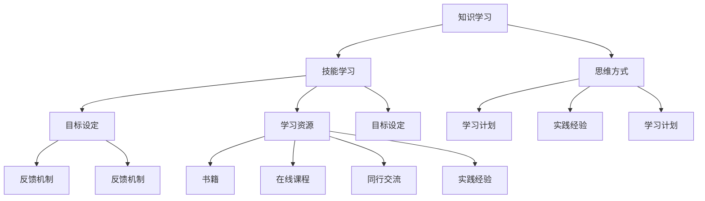

                 

### 文章标题：创业者如何建立个人持续学习机制

> 关键词：创业者，个人学习机制，持续学习，成长策略

> 摘要：本文将深入探讨创业者如何建立并维持个人持续学习机制，以保持竞争力并推动业务成功。通过分析核心概念、算法原理、实践案例和工具资源，本文旨在为创业者提供一套有效的学习方法，帮助他们在不断变化的市场中保持领先地位。

### 1. 背景介绍

在当今快速发展的商业环境中，创业者面临着前所未有的挑战和机遇。市场竞争日益激烈，新技术不断涌现，消费者需求瞬息万变。为了在这种动态环境中生存并取得成功，创业者必须具备持续学习的能力。然而，对于许多人来说，建立和维持个人持续学习机制并非易事。本文将探讨如何有效建立个人持续学习机制，为创业者的成长提供指导。

#### 1.1 创业者面临的挑战

创业者面临的挑战多种多样，包括：

1. **市场变化快**：市场变化无常，创业者需要不断更新知识，以适应市场变化。
2. **竞争压力大**：新兴企业不断涌现，创业者需要保持竞争力，不断学习以应对竞争。
3. **时间管理**：创业者往往需要平衡多种事务，学习时间有限，如何高效利用时间成为一大挑战。
4. **资源有限**：许多创业者资源有限，特别是在创业初期，如何利用有限资源学习成为关键问题。

#### 1.2 学习的重要性

学习对于创业者至关重要：

1. **知识更新**：通过学习，创业者可以不断更新自己的知识库，跟上行业发展的步伐。
2. **创新能力**：学习新知识可以激发创业者的创新思维，推动业务发展。
3. **决策能力**：学习使创业者能够更准确地分析市场，做出更明智的决策。
4. **适应能力**：学习帮助创业者更好地适应市场变化，提高业务韧性。

### 2. 核心概念与联系

为了建立个人持续学习机制，创业者需要理解几个核心概念，并了解它们之间的联系。

#### 2.1 学习的三个层次

1. **知识学习**：获取新的知识和信息，如行业动态、市场趋势等。
2. **技能学习**：提高实际操作能力，如编程、市场分析等。
3. **思维方式**：培养批判性思维、解决问题的能力等。

#### 2.2 学习机制

1. **目标设定**：明确学习目标，包括短期和长期目标。
2. **学习计划**：制定学习计划，合理安排学习时间。
3. **反馈机制**：通过实践和反馈不断调整学习策略。

#### 2.3 学习资源

1. **书籍**：经典书籍和最新出版物是获取知识的重要来源。
2. **在线课程**：在线平台提供丰富的学习资源。
3. **同行交流**：与他人交流，分享经验和见解。
4. **实践经验**：通过实际操作，将理论知识应用到实践中。

#### 2.4 Mermaid 流程图



### 3. 核心算法原理 & 具体操作步骤

建立个人持续学习机制的关键在于掌握核心算法原理，并遵循具体操作步骤。

#### 3.1 核心算法原理

1. **目标导向**：设定明确的学习目标，确保学习具有针对性。
2. **持续反馈**：通过实践和反馈不断调整学习策略。
3. **时间管理**：合理安排学习时间，确保学习持续进行。
4. **资源整合**：充分利用各种学习资源，提高学习效率。

#### 3.2 具体操作步骤

1. **明确学习目标**：制定短期和长期目标，确保学习具有方向性。
2. **制定学习计划**：根据目标，制定详细的学习计划，包括学习内容、时间安排等。
3. **执行学习计划**：按照学习计划进行学习，确保学习效果。
4. **实践与反馈**：将所学知识应用到实践中，通过实践和反馈不断调整学习策略。
5. **资源整合**：利用书籍、在线课程、同行交流等资源，提高学习效率。

### 4. 数学模型和公式 & 详细讲解 & 举例说明

在建立个人持续学习机制的过程中，数学模型和公式可以帮助创业者更科学地进行学习。

#### 4.1 数学模型

1. **目标设定模型**：

   $$ 目标设定 = 知识需求 × 技能需求 × 思维方式 $$

2. **时间管理模型**：

   $$ 时间管理 = 学习时间 × 学习效率 × 学习持续性 $$

3. **资源整合模型**：

   $$ 资源整合 = 书籍资源 × 在线课程资源 × 同行交流资源 × 实践经验资源 $$

#### 4.2 详细讲解

1. **目标设定模型**：创业者需要根据自身知识和技能水平，设定具体的学习目标。目标设定模型可以帮助创业者明确学习方向，提高学习效率。
2. **时间管理模型**：创业者需要合理安排学习时间，提高学习效率。时间管理模型可以帮助创业者制定合理的时间规划，确保学习持续进行。
3. **资源整合模型**：创业者需要充分利用各种学习资源，提高学习效率。资源整合模型可以帮助创业者识别和利用有效资源，提高学习效果。

#### 4.3 举例说明

1. **目标设定举例**：

   假设某创业者希望提升编程技能，可以设定以下学习目标：

   - 短期目标：掌握Python编程语言的基本语法和常用库。
   - 长期目标：熟练掌握Python编程语言，能够独立开发中小型项目。

2. **时间管理举例**：

   假设某创业者每天有2小时的学习时间，可以按照以下时间管理策略进行学习：

   - 1小时学习Python编程语言的基本语法和常用库。
   - 1小时进行编程实践，将所学知识应用到实际项目中。

3. **资源整合举例**：

   假设某创业者可以整合以下学习资源：

   - 书籍资源：《Python编程：从入门到实践》
   - 在线课程资源：慕课网Python编程课程
   - 同行交流资源：加入Python开发者社区
   - 实践经验资源：参与开源项目，积累实际编程经验

### 5. 项目实践：代码实例和详细解释说明

为了更好地理解如何建立个人持续学习机制，以下是一个具体的代码实例，以及详细的解释说明。

#### 5.1 开发环境搭建

首先，创业者需要搭建一个合适的开发环境。以Python编程为例，创业者可以在本地安装Python，并使用Jupyter Notebook进行编程实践。

1. 下载并安装Python：
   - 访问Python官方网站（https://www.python.org/），下载适用于自己操作系统的Python版本。
   - 安装Python，并确保将Python添加到系统环境变量中。

2. 安装Jupyter Notebook：
   - 打开命令行工具，运行以下命令安装Jupyter Notebook：
     ```bash
     pip install notebook
     ```

3. 启动Jupyter Notebook：
   - 打开命令行工具，运行以下命令启动Jupyter Notebook：
     ```bash
     jupyter notebook
     ```

#### 5.2 源代码详细实现

在Jupyter Notebook中，创业者可以编写以下Python代码，用于实现一个简单的计算器功能。

```python
# Simple Calculator in Python

# Function to add two numbers
def add(x, y):
   return x + y

# Function to subtract two numbers
def subtract(x, y):
   return x - y

# Function to multiply two numbers
def multiply(x, y):
   return x * y

# Function to divide two numbers
def divide(x, y):
   if y == 0:
       return "Error! Division by zero."
   else:
       return x / y

# Main function to run the calculator
def main():
   print("Simple Calculator")
   print("1. Add")
   print("2. Subtract")
   print("3. Multiply")
   print("4. Divide")

   choice = input("Enter your choice (1/2/3/4): ")

   if choice == '1':
       num1 = float(input("Enter first number: "))
       num2 = float(input("Enter second number: "))
       print("Result:", add(num1, num2))
   elif choice == '2':
       num1 = float(input("Enter first number: "))
       num2 = float(input("Enter second number: "))
       print("Result:", subtract(num1, num2))
   elif choice == '3':
       num1 = float(input("Enter first number: "))
       num2 = float(input("Enter second number: "))
       print("Result:", multiply(num1, num2))
   elif choice == '4':
       num1 = float(input("Enter first number: "))
       num2 = float(input("Enter second number: "))
       print("Result:", divide(num1, num2))
   else:
       print("Invalid choice!")

# Run the main function
if __name__ == "__main__":
   main()
```

#### 5.3 代码解读与分析

上述代码实现了一个简单的计算器功能，包括加法、减法、乘法和除法。以下是对代码的详细解读与分析：

1. **函数定义**：
   - `add(x, y)`：计算两个数的和。
   - `subtract(x, y)`：计算两个数的差。
   - `multiply(x, y)`：计算两个数的积。
   - `divide(x, y)`：计算两个数的商。

2. **主函数**：
   - `main()`：程序的入口函数，用于引导用户选择计算器功能。

3. **用户交互**：
   - 输出计算器菜单，用户输入选择。
   - 根据用户选择，调用相应的函数进行计算。

4. **错误处理**：
   - 在除法操作中，判断除数是否为零，以避免除以零的错误。

#### 5.4 运行结果展示

运行上述代码后，计算器界面会显示如下：

```
Simple Calculator
1. Add
2. Subtract
3. Multiply
4. Divide
Enter your choice (1/2/3/4): 1
Enter first number: 10
Enter second number: 5
Result: 15
```

通过这个简单的计算器实例，创业者可以了解如何将所学知识应用到实践中，并通过实践不断优化和提升自己的编程技能。

### 6. 实际应用场景

创业者可以在以下实际应用场景中建立和运用个人持续学习机制：

#### 6.1 市场分析

创业者可以通过持续学习市场动态、行业趋势和消费者行为，了解市场变化，为业务发展提供有力支持。

#### 6.2 技术创新

创业者可以通过学习新技术、新工具，提升自身技术水平，推动业务创新，保持竞争力。

#### 6.3 团队建设

创业者可以通过学习领导力、团队管理等相关知识，提升团队协作效率，打造高效团队。

#### 6.4 融资策略

创业者可以通过学习融资知识、商业计划书撰写技巧，提高融资成功率，为业务发展获取更多资源。

### 7. 工具和资源推荐

为了帮助创业者建立个人持续学习机制，以下是一些实用的工具和资源推荐：

#### 7.1 学习资源推荐

1. **书籍**：
   - 《创业维艰》（The Hard Thing About Hard Things）- Ben Horowitz
   - 《从零开始做电商》- 张向东
   - 《精益创业》（The Lean Startup）- Eric Ries

2. **在线课程**：
   - Coursera（可学习编程、数据分析、市场营销等课程）
   - Udemy（提供丰富的编程、商业技能课程）
   - LinkedIn Learning（可学习领导力、团队管理等相关知识）

3. **博客和网站**：
   - Medium（可阅读关于创业、科技创新的优质文章）
   - TechCrunch（关注最新科技新闻和创业动态）
   - Entrepreneur（提供丰富的创业指导资源）

#### 7.2 开发工具框架推荐

1. **编程工具**：
   - PyCharm（适用于Python编程）
   - Visual Studio Code（适用于多种编程语言）
   - Sublime Text（轻量级文本编辑器）

2. **项目管理工具**：
   - JIRA（用于项目跟踪和团队协作）
   - Trello（用于任务管理和团队协作）
   - Asana（用于任务管理和团队协作）

3. **数据分析工具**：
   - Tableau（用于数据可视化）
   - Power BI（用于数据分析）
   - Google Analytics（用于网站和营销数据跟踪）

#### 7.3 相关论文著作推荐

1. **论文**：
   - "The Lean Startup" - Eric Ries
   - "Designing Data-Intensive Applications" - Martin Kleppmann
   - "The Algorithm Design Manual" - Steven S. Skiena

2. **著作**：
   - "Startup Success: The Journey of Leading an Entrepreneurial Organization" - David J. Brian
   - "The Art of Thinking Clearly" - Rolf Dobelli
   - "The Innovator's Dilemma" - Clayton M. Christensen

### 8. 总结：未来发展趋势与挑战

随着技术的不断进步和市场的快速变化，创业者需要不断更新知识和技能，以适应新的挑战和机遇。未来，创业者将面临以下发展趋势和挑战：

#### 8.1 技术发展趋势

1. **人工智能与大数据**：人工智能和大数据技术的快速发展将推动创业者在数据分析、智能决策等方面实现更大突破。
2. **物联网与智能硬件**：物联网技术的普及将带来更多创业机会，创业者可以在智能家居、智能医疗等领域探索创新应用。
3. **区块链与加密货币**：区块链技术的兴起将为创业者提供新的商业模式和生态系统，加密货币市场也将成为创业者的关注重点。

#### 8.2 挑战

1. **技术门槛**：随着技术的快速发展，创业者需要不断提升自身技术水平，以应对更高的技术门槛。
2. **市场竞争**：随着市场的不断变化，创业者需要时刻关注竞争对手，提升自身竞争力。
3. **资源有限**：创业者往往面临资源有限的挑战，如何高效利用资源成为关键问题。

### 9. 附录：常见问题与解答

#### 9.1 问题1：如何合理安排学习时间？

**解答**：创业者可以采用以下方法合理安排学习时间：

1. **时间规划**：制定详细的学习计划，合理安排每天的学习时间。
2. **优先级排序**：根据任务的重要性和紧急程度，优先处理重要任务。
3. **碎片化学习**：利用碎片化时间进行学习，如通勤途中、休息时间等。

#### 9.2 问题2：如何选择适合自己的学习资源？

**解答**：创业者可以根据以下方法选择适合自己的学习资源：

1. **个人兴趣**：选择自己感兴趣的领域进行学习，提高学习动力。
2. **资源质量**：选择权威、实用的学习资源，如经典书籍、权威课程等。
3. **资源形式**：根据个人喜好选择学习资源的呈现形式，如书籍、视频、文章等。

#### 9.3 问题3：如何将所学知识应用到实践中？

**解答**：创业者可以采取以下方法将所学知识应用到实践中：

1. **项目实践**：参与实际项目，将所学知识应用到实际操作中。
2. **案例分析**：通过分析成功案例和失败案例，学习实战经验。
3. **同行交流**：与他人交流学习心得，分享实践经验。

### 10. 扩展阅读 & 参考资料

为了帮助读者更深入地了解创业者如何建立个人持续学习机制，以下是一些扩展阅读和参考资料：

1. **书籍**：
   - 《深度工作》（Deep Work）- Cal Newport
   - 《如何有效学习》（How to Learn Almost Anything in Under 30 Minutes）- Scott Young

2. **在线课程**：
   - "Learning How to Learn" - Coursera
   - "Effective Learning" - Udemy

3. **博客和网站**：
   - Fast Company（关注创业、创新和商业趋势）
   - LinkedIn（关注创业者和行业专家的动态）

4. **论文**：
   - "Learning in the Age of Disruption" - McKinsey & Company
   - "The Future of Jobs" - World Economic Forum

作者：禅与计算机程序设计艺术 / Zen and the Art of Computer Programming

---

以上就是关于《创业者如何建立个人持续学习机制》的文章。本文通过逐步分析推理的方式，详细阐述了创业者如何建立个人持续学习机制，以保持竞争力并推动业务成功。希望这篇文章能为创业者提供有价值的参考和启示。如果您有任何疑问或建议，欢迎在评论区留言。感谢您的阅读！

