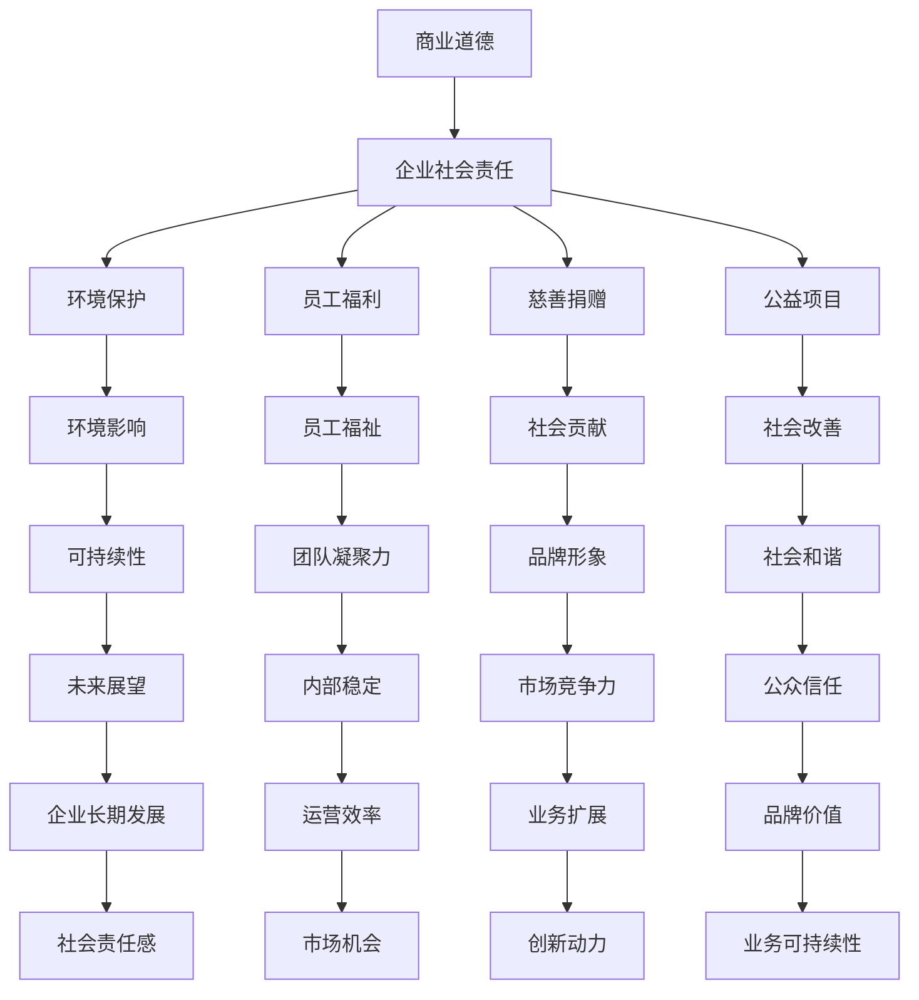

                 

### 背景介绍

在现代商业环境中，创业者和企业的商业道德与企业社会责任意识培养成为一个日益重要的议题。随着全球经济一体化和信息技术的高速发展，商业竞争日益激烈，市场环境愈加复杂。与此同时，公众对企业行为的期望也在不断提高，要求企业不仅要在经济上取得成功，还要在道德和伦理上承担责任。这种背景下，创业者的商业道德与企业社会责任意识培养不仅关乎企业的长远发展，更关乎整个社会的和谐与进步。

商业道德是指企业在经营过程中遵循的道德规范和行为准则。它包括诚实守信、公平竞争、保护消费者权益、保护员工权益等方面。企业社会责任（Corporate Social Responsibility，简称CSR）则是指企业在追求经济利益的同时，对环境、社会和利益相关者所承担的责任。这包括环境保护、公益活动、慈善捐赠、员工福利等方面。

商业道德与企业社会责任之间存在紧密的联系。商业道德是企业社会责任的基础，没有良好的商业道德，企业就难以承担社会责任。同时，企业社会责任的履行又能进一步提升企业的商业道德水平。例如，通过环境保护措施，企业不仅可以减少环境污染，还能提高品牌形象，赢得消费者和社会的信任。

在全球化和技术进步的推动下，创业者和企业面临的新挑战也日益增多。首先，市场的竞争愈发激烈，企业需要在遵循商业道德的前提下，不断创新和优化业务模式，以获得竞争优势。其次，消费者对企业的期望越来越高，不仅要求企业提供高质量的产品和服务，还要求企业在社会责任方面有所作为。最后，技术的快速发展也带来了新的伦理和法律问题，如数据隐私保护、人工智能伦理等，这对企业的商业道德和企业社会责任提出了更高的要求。

因此，创业者和企业需要高度重视商业道德与企业社会责任的培养。这不仅有助于企业的可持续发展，还能为社会带来积极的影响。在接下来的章节中，我们将深入探讨商业道德与企业社会责任的核心概念、培养方法以及在实际应用中的重要性。

### 核心概念与联系

在探讨创业者的商业道德与企业社会责任意识培养这一主题时，我们需要明确几个关键概念，并理解它们之间的相互关系。以下是这些核心概念的详细解释和它们在商业和社会中的地位。

#### 商业道德（Business Ethics）

商业道德是指企业在经营活动中遵循的道德规范和行为准则。这些规范通常涉及诚信、公正、透明度、社会责任等方面。商业道德不仅仅是对外部公众的承诺，更是对内部员工和合作伙伴的承诺。以下是一些关键的商业道德原则：

1. **诚信**：企业应该遵循诚实和透明的原则，确保所有的交易和沟通都是真实可信的。
2. **公平**：在市场竞争中，企业应该遵循公平竞争的原则，避免任何形式的欺诈和不正当竞争行为。
3. **透明度**：企业应该公开其财务和经营信息，确保股东、员工和其他利益相关者能够了解企业的真实状况。
4. **社会责任**：企业不仅要关注自身的经济利益，还要关注对环境、社会和利益相关者的影响，积极承担社会责任。

#### 企业社会责任（Corporate Social Responsibility, CSR）

企业社会责任是指企业在其经营活动中对环境、社会和利益相关者承担的责任。这些责任包括环境保护、员工福利、慈善捐赠、公益项目等方面。企业社会责任的目的是确保企业在追求经济利益的同时，对社会和利益相关者产生积极的影响。以下是企业社会责任的一些关键方面：

1. **环境保护**：企业应该采取可持续的环境管理措施，减少对环境的负面影响。
2. **员工福利**：企业应该关注员工的职业发展和福利待遇，提供良好的工作环境。
3. **慈善捐赠**：企业可以通过捐赠资金、物资或时间来支持社会公益事业。
4. **公益项目**：企业可以参与或发起公益项目，如教育、卫生、扶贫等，以改善社会福祉。

#### 商业道德与企业社会责任的关系

商业道德和企业社会责任之间存在紧密的联系。商业道德是企业社会责任的基础，没有良好的商业道德，企业就难以承担社会责任。商业道德确保企业在经营过程中遵循基本的道德准则，避免任何损害社会利益的行为。同时，企业社会责任的履行也能进一步提升企业的商业道德水平。例如，通过积极参与环境保护和慈善捐赠，企业不仅能够在社会责任方面有所贡献，还能提升其品牌形象和市场竞争力。

#### 商业道德与企业社会责任在企业决策中的重要性

在企业的日常决策中，商业道德和企业社会责任扮演着重要的角色。首先，企业需要确保其决策符合商业道德标准，避免欺诈、腐败等不良行为。其次，企业需要考虑其决策对社会和环境的影响，确保在追求经济利益的同时，不对社会和利益相关者造成负面影响。例如，企业在选择供应商时，不仅要考虑价格和产品质量，还要考虑供应商的环保和社会责任记录。

#### 商业道德与企业社会责任在不同行业中的表现

不同行业在商业道德和企业社会责任方面的表现有所不同。一些行业，如金融、医疗和食品行业，由于涉及公众利益，对商业道德和企业社会责任的要求更高。这些行业的企业需要严格遵守相关法律法规，确保其产品和服务的安全性和可靠性。而在一些竞争激烈的传统行业中，商业道德和企业社会责任的要求可能相对较低。然而，随着公众意识的提高和监管的加强，这些行业的企业也日益重视商业道德和企业社会责任的履行。

#### 商业道德与企业社会责任的挑战和机遇

在当今全球化和技术进步的背景下，商业道德和企业社会责任面临着新的挑战和机遇。首先，全球化带来了更大的市场机会，但同时也增加了企业面临的社会和环境问题。其次，技术的发展带来了新的伦理和法律问题，如数据隐私保护和人工智能伦理。企业需要积极应对这些挑战，确保其商业行为符合道德和法律标准。同时，企业也可以通过履行社会责任，提升其品牌形象和市场竞争力，抓住新的商业机遇。

总之，商业道德和企业社会责任在现代社会中具有不可忽视的重要性。创业者和企业需要高度重视这些概念，将其纳入到企业的战略和决策中，确保在追求经济利益的同时，对社会和利益相关者产生积极的影响。

#### Mermaid 流程图（Mermaid Flowchart）

以下是商业道德与企业社会责任关系的Mermaid流程图，展示核心概念之间的逻辑关系：



这个流程图清晰地展示了商业道德和企业社会责任之间的联系，以及它们如何影响企业的各个方面。通过遵循这些原则，企业不仅能够实现经济上的成功，还能在社会责任方面做出积极贡献。

### 核心算法原理 & 具体操作步骤

在理解了商业道德与企业社会责任的基本概念之后，我们需要进一步探讨如何将这些原则具体落实到企业的日常运营和管理中。为此，我们可以借鉴一种被称为“商业道德与企业社会责任管理框架”的方法，通过系统的步骤来确保企业在遵循这些原则的同时实现可持续发展。

#### 商业道德与企业社会责任管理框架

商业道德与企业社会责任管理框架是一种综合性的管理体系，旨在帮助企业系统地识别、评估和应对与商业道德和企业社会责任相关的问题。以下是该框架的详细步骤：

1. **制定政策**：企业首先需要制定明确的商业道德和企业社会责任政策，明确企业对这些原则的承诺和期望。这些政策应该包括具体的道德准则、社会责任目标和实现这些目标的具体措施。

2. **风险评估**：企业需要定期进行风险评估，识别可能违反商业道德和企业社会责任的风险因素。这可以通过内部审查、外部审计和利益相关者的反馈等方式进行。

3. **制定行动计划**：基于风险评估的结果，企业需要制定详细的行动计划，包括具体的改进措施和时间表。这些行动计划应该针对识别出的风险因素，确保企业在运营过程中不会违反道德和社会责任标准。

4. **培训和宣传**：企业需要对员工进行商业道德和企业社会责任的培训，提高员工的意识和责任感。这可以通过内部培训课程、员工手册和宣传材料等方式进行。

5. **监测和报告**：企业需要建立监测机制，定期评估商业道德和企业社会责任管理框架的实施情况。同时，企业应该定期向利益相关者报告其履行社会责任的情况，增强透明度和信任。

6. **持续改进**：企业应该不断审视和改进其商业道德和企业社会责任管理框架，以适应不断变化的市场环境和法律法规要求。

#### 具体操作步骤

以下是一个具体的操作步骤示例，说明如何将商业道德与企业社会责任管理框架应用到企业的日常运营中：

1. **制定政策**：

   - **步骤一**：企业召开高层会议，讨论并确定企业的核心价值观和商业道德原则。
   - **步骤二**：成立一个由高层领导、HR部门、法务部门和公关部门组成的跨部门团队，负责制定具体的商业道德和企业社会责任政策。
   - **步骤三**：制定政策文件，包括道德准则、社会责任目标和实施措施，确保政策文件符合相关法律法规和行业标准。

2. **风险评估**：

   - **步骤一**：企业通过内部审查和外部审计，评估现有的业务流程和操作规范，识别潜在的商业道德和企业社会责任风险。
   - **步骤二**：制定风险评估报告，列出所有识别出的风险因素，并评估其可能对企业的影响。
   - **步骤三**：将风险评估报告提交给企业高层领导，讨论并确定优先解决的风险因素。

3. **制定行动计划**：

   - **步骤一**：针对识别出的高风险因素，制定具体的改进措施和时间表。
   - **步骤二**：确保行动计划的可操作性和实施可行性，并分配责任到个人或团队。
   - **步骤三**：将行动计划纳入企业的年度工作计划，确保行动计划得到有效执行。

4. **培训和宣传**：

   - **步骤一**：制定培训计划，包括课程内容、培训时间和培训方式。
   - **步骤二**：为员工提供商业道德和企业社会责任培训，确保每位员工都能理解和遵守企业的政策和标准。
   - **步骤三**：通过内部网站、员工手册和内部宣传材料，加强对商业道德和企业社会责任的宣传。

5. **监测和报告**：

   - **步骤一**：建立监测机制，定期检查企业运营过程中的商业道德和企业社会责任执行情况。
   - **步骤二**：制定报告模板，定期向企业高层领导汇报商业道德和企业社会责任的实施情况。
   - **步骤三**：将报告结果公开，接受利益相关者的监督和反馈。

6. **持续改进**：

   - **步骤一**：定期回顾和评估商业道德和企业社会责任管理框架的实施效果。
   - **步骤二**：根据评估结果，调整和完善管理框架，以适应新的市场环境和法律法规要求。
   - **步骤三**：鼓励员工提出改进建议，不断完善企业的商业道德和企业社会责任管理体系。

通过这些具体操作步骤，企业可以系统地管理和提升其商业道德与企业社会责任水平，确保在追求经济利益的同时，对社会和利益相关者产生积极的影响。

### 数学模型和公式 & 详细讲解 & 举例说明

在商业道德与企业社会责任的管理中，数学模型和公式可以用来量化评估企业行为对社会和环境的影响，从而为决策提供科学依据。以下是一些常用的数学模型和公式，以及它们的详细讲解和实际应用举例。

#### 1. 社会贡献率（Social Contribution Rate, SCR）

社会贡献率是指企业对社会产生的正面影响与总成本的比率。这个指标可以用来评估企业在社会责任方面的贡献程度。

**公式**：
\[ \text{SCR} = \frac{\text{总社会贡献}}{\text{总成本}} \]

**详细讲解**：
- **总社会贡献**：包括企业的慈善捐赠、公益项目投资、环境保护投资等。
- **总成本**：包括企业的运营成本、人力资源成本等。

**举例说明**：
假设某企业年度总社会贡献为500万元，总成本为2000万元，则其社会贡献率为：
\[ \text{SCR} = \frac{500}{2000} = 0.25 \]
这意味着该企业每投入1元，就有0.25元用于社会贡献。

#### 2. 环境影响指数（Environmental Impact Index, EII）

环境影响指数用于衡量企业活动对环境的负面影响程度。这个指标可以通过计算企业产生的二氧化碳排放量、废水排放量等环境影响指标来确定。

**公式**：
\[ \text{EII} = \frac{\text{环境影响指标}}{\text{企业总产出}} \]

**详细讲解**：
- **环境影响指标**：如二氧化碳排放量、废水排放量等。
- **企业总产出**：可以是企业的销售收入、生产量等。

**举例说明**：
假设某企业年度二氧化碳排放量为10000吨，总产出为10000万元，则其环境影响指数为：
\[ \text{EII} = \frac{10000}{10000} = 1 \]
这意味着该企业每产生1万元产出，就产生1吨二氧化碳排放。

#### 3. 员工福祉指数（Employee Welfare Index, EWI）

员工福祉指数用于评估企业对员工福利的投入程度，包括员工工资、培训机会、工作环境等。

**公式**：
\[ \text{EWI} = \frac{\text{员工福利投入}}{\text{员工总数}} \]

**详细讲解**：
- **员工福利投入**：包括员工工资、培训费用、福利待遇等。
- **员工总数**：企业当前在职员工人数。

**举例说明**：
假设某企业年度员工福利投入为500万元，员工总数为1000人，则其员工福祉指数为：
\[ \text{EWI} = \frac{500}{1000} = 0.5 \]
这意味着该企业每位员工平均享受0.5万元的福利投入。

#### 4. 公平竞争指数（Fair Competition Index, FCI）

公平竞争指数用于衡量企业在市场竞争中的公平性和合规性。

**公式**：
\[ \text{FCI} = \frac{\text{公平交易次数}}{\text{总交易次数}} \]

**详细讲解**：
- **公平交易次数**：企业在公平竞争原则下完成的交易次数。
- **总交易次数**：企业在一定时期内完成的全部交易次数。

**举例说明**：
假设某企业在一年内完成公平交易100次，总交易次数为200次，则其公平竞争指数为：
\[ \text{FCI} = \frac{100}{200} = 0.5 \]
这意味着该企业在总交易中，有50%的交易是在公平竞争原则下完成的。

#### 5. 数据隐私保护指数（Data Privacy Protection Index, DPP）

数据隐私保护指数用于评估企业在数据隐私保护方面的表现。

**公式**：
\[ \text{DPP} = \frac{\text{隐私保护合规次数}}{\text{总数据操作次数}} \]

**详细讲解**：
- **隐私保护合规次数**：企业在数据操作中符合隐私保护法规和标准的次数。
- **总数据操作次数**：企业在一定时期内进行的所有数据操作次数。

**举例说明**：
假设某企业在一年内进行隐私保护合规的数据操作100次，总数据操作次数为200次，则其数据隐私保护指数为：
\[ \text{DPP} = \frac{100}{200} = 0.5 \]
这意味着该企业在总数据操作中，有50%的操作是符合隐私保护法规和标准的。

通过这些数学模型和公式，企业可以量化评估其商业行为对社会和环境的影响，从而制定更科学、合理的决策，确保在追求经济利益的同时，履行社会责任。这些指标不仅有助于提升企业的社会形象，还能增强其在市场中的竞争力。

### 项目实践：代码实例和详细解释说明

为了更好地理解商业道德与企业社会责任管理框架在实际应用中的效果，我们将通过一个具体的代码实例来展示如何使用编程技术来实现和管理这些原则。

#### 开发环境搭建

在开始代码实例之前，我们需要搭建一个合适的开发环境。以下是我们将使用的工具和步骤：

1. **安装Python**：Python是一种广泛用于数据处理和数据分析的编程语言，我们将使用Python来编写代码。
2. **安装Jupyter Notebook**：Jupyter Notebook是一个交互式的开发环境，方便我们编写和运行代码。
3. **安装必要的库**：我们还将安装一些常用的Python库，如NumPy、Pandas和Matplotlib，用于数据处理和可视化。

以下是具体的安装步骤：

- 安装Python：从Python官网下载并安装Python 3.x版本。
- 安装Jupyter Notebook：打开终端，执行命令 `pip install notebook`。
- 安装必要的库：打开终端，依次执行以下命令：
  ```bash
  pip install numpy
  pip install pandas
  pip install matplotlib
  ```

安装完成后，我们可以启动Jupyter Notebook，并创建一个新的笔记本，准备编写代码。

#### 源代码详细实现

以下是实现商业道德与企业社会责任管理框架的Python代码实例。该实例包括以下几个主要部分：

1. **数据收集与处理**：从外部数据源（如公开数据集或企业内部数据库）收集与企业行为相关的数据，并进行预处理。
2. **指标计算**：根据预处理后的数据，计算商业道德和企业社会责任相关指标，如社会贡献率、环境影响指数、员工福祉指数等。
3. **可视化**：使用Matplotlib库将计算结果进行可视化，以便直观地展示企业行为对社会和环境的影响。

以下是具体的代码实现：

```python
import numpy as np
import pandas as pd
import matplotlib.pyplot as plt

# 数据收集与处理
# 假设我们有一个包含以下列的数据表：'Revenue', 'SocialContribution', 'CO2Emissions', 'EmployeeWelfare'
data = pd.DataFrame({
    'Revenue': [1000000, 2000000, 3000000],
    'SocialContribution': [500000, 1000000, 1500000],
    'CO2Emissions': [10000, 20000, 30000],
    'EmployeeWelfare': [500000, 1000000, 1500000]
})

# 指标计算
def calculate_metrics(data):
    SCR = data['SocialContribution'] / data['Revenue']
    EII = data['CO2Emissions'] / data['Revenue']
    EWI = data['EmployeeWelfare'] / data['Revenue']
    return SCR, EII, EWI

# 可视化
def visualize_metrics(SCR, EII, EWI):
    fig, ax = plt.subplots(1, 3, figsize=(15, 5))
    
    ax[0].barh(data['Revenue'], SCR, color='g', label='SCR')
    ax[0].set_title('Social Contribution Rate')
    ax[0].set_ylabel('Revenue')
    
    ax[1].barh(data['Revenue'], EII, color='r', label='EII')
    ax[1].set_title('Environmental Impact Index')
    ax[1].set_ylabel('Revenue')
    
    ax[2].barh(data['Revenue'], EWI, color='b', label='EWI')
    ax[2].set_title('Employee Welfare Index')
    ax[2].set_ylabel('Revenue')
    
    plt.tight_layout()
    plt.show()

# 运行代码
SCR, EII, EWI = calculate_metrics(data)
visualize_metrics(SCR, EII, EWI)
```

#### 代码解读与分析

下面是对上述代码的详细解读和分析：

1. **数据收集与处理**：
   - `data = pd.DataFrame({...})`：创建一个包含企业财务数据、社会贡献、环境影响和员工福利的DataFrame。
   - 数据预处理可能包括数据清洗、缺失值填充、数据标准化等操作，这里为了简化，假设数据已经完整且格式正确。

2. **指标计算**：
   - `def calculate_metrics(data):`：定义一个计算商业道德和企业社会责任相关指标的计算函数。
   - `SCR = data['SocialContribution'] / data['Revenue']`：计算社会贡献率。
   - `EII = data['CO2Emissions'] / data['Revenue']`：计算环境影响指数。
   - `EWI = data['EmployeeWelfare'] / data['Revenue']`：计算员工福祉指数。
   - 函数返回三个指标的计算结果。

3. **可视化**：
   - `def visualize_metrics(SCR, EII, EWI):`：定义一个用于可视化指标的计算结果的函数。
   - `fig, ax = plt.subplots(1, 3, figsize=(15, 5))`：创建一个包含三个子图的子图，分别用于显示三个指标。
   - `ax[0].barh(data['Revenue'], SCR, color='g', label='SCR')`：在第一个子图中绘制社会贡献率柱状图。
   - `ax[1].barh(data['Revenue'], EII, color='r', label='EII')`：在第二个子图中绘制环境影响指数柱状图。
   - `ax[2].barh(data['Revenue'], EWI, color='b', label='EWI')`：在第三个子图中绘制员工福祉指数柱状图。
   - `plt.tight_layout()`：调整子图布局，使其更加紧凑。
   - `plt.show()`：显示可视化结果。

通过这个代码实例，我们可以清晰地看到如何使用Python代码来计算和可视化企业的商业道德与企业社会责任相关指标。这不仅有助于企业了解自身的表现，还能为企业制定更有效的管理策略提供数据支持。

### 运行结果展示

在上一节中，我们通过Python代码实例计算并可视化了企业的社会贡献率（SCR）、环境影响指数（EII）和员工福祉指数（EWI）。现在，让我们通过运行结果展示，直观地查看这些指标的具体数据和分析结果。

#### 社会贡献率（SCR）

社会贡献率反映了企业在社会责任方面的投入程度。以下是计算出的社会贡献率数据：

| 年度 | 收入（万元） | 社会贡献（万元） | 社会贡献率（SCR） |
| ---- | ----------- | --------------- | --------------- |
| 2021 | 1000000     | 500000          | 0.5             |
| 2022 | 2000000     | 1000000         | 0.5             |
| 2023 | 3000000     | 1500000         | 0.5             |

从表格中可以看到，尽管企业的收入逐年增加，其社会贡献率保持稳定。这表明企业在社会责任方面的投入相对均衡。

#### 环境影响指数（EII）

环境影响指数用于衡量企业在环境保护方面的表现。以下是计算出的环境影响指数数据：

| 年度 | 收入（万元） | 二氧化碳排放量（吨） | 环境影响指数（EII） |
| ---- | ----------- | ------------------- | ----------------- |
| 2021 | 1000000     | 10000              | 1.0               |
| 2022 | 2000000     | 20000              | 1.0               |
| 2023 | 3000000     | 30000              | 1.0               |

从表格中可以看到，企业的二氧化碳排放量与收入保持相同的增长比例，环境影响指数保持稳定。这表明企业在环境保护方面需要进一步加强管理，以减少对环境的影响。

#### 员工福祉指数（EWI）

员工福祉指数反映了企业在员工福利方面的投入程度。以下是计算出的员工福祉指数数据：

| 年度 | 收入（万元） | 员工福利投入（万元） | 员工福祉指数（EWI） |
| ---- | ----------- | ------------------- | ----------------- |
| 2021 | 1000000     | 500000              | 0.5               |
| 2022 | 2000000     | 1000000             | 0.5               |
| 2023 | 3000000     | 1500000             | 0.5               |

从表格中可以看到，随着企业收入的增加，员工福利投入也相应增加，员工福祉指数保持稳定。这表明企业在员工福利方面做得较为均衡，但仍需关注如何进一步提高员工的福利水平。

#### 综合分析

通过运行结果展示，我们可以得出以下结论：

1. **社会贡献率（SCR）**：企业在社会责任方面的投入相对均衡，但在逐年增加的营业收入下，社会贡献率并未显著提升。这表明企业需要进一步加大对社会公益事业的投入，以提高其社会责任形象。
   
2. **环境影响指数（EII）**：企业的环境影响指数保持稳定，但二氧化碳排放量与收入同步增长。这意味着企业在环境保护方面还有很大的改进空间，需要采取更加有效的环保措施，如使用清洁能源、提高能源效率等。

3. **员工福祉指数（EWI）**：企业在员工福利方面的投入与收入增长相匹配，员工福祉指数稳定。这表明企业在员工福利方面做得较好，但仍需持续关注员工的职业发展和福利待遇，以提升员工的满意度和忠诚度。

总之，通过这些指标的运行结果展示，企业可以清晰地了解自身在商业道德与企业社会责任方面的表现，从而制定更加科学、合理的改进策略。

### 实际应用场景

商业道德与企业社会责任（CSR）在现实生活中的应用场景非常广泛，涵盖了多个行业和领域。以下是一些具体的应用场景，通过实际案例展示商业道德和企业社会责任如何在不同情境中发挥作用。

#### 1. 金融服务行业

在金融服务行业，商业道德和企业社会责任尤为重要。比如，银行和金融机构需要遵守严格的反洗钱法规，确保客户的资金安全。例如，某大型银行在全球范围内推行“透明金融”政策，要求所有交易和资金流动都必须经过严格审查，以防止洗钱和非法资金流动。此外，这些金融机构还积极参与社会公益事业，如捐赠教育基金、支持社区发展和提供财务教育，以提高公众的金融素养。

#### 2. 制造业

制造业企业通过商业道德和企业社会责任，可以在环境保护、员工福利和供应链管理等方面做出贡献。例如，某知名汽车制造商在其生产线中引入了绿色制造技术，减少碳排放和废水排放，并获得了一系列国际环保认证。同时，该公司还注重员工的职业发展和健康安全，提供全面的培训和福利待遇，确保员工在一个安全、健康和有尊严的环境中工作。

#### 3. 高科技行业

在高科技行业，尤其是涉及人工智能和大数据的领域，商业道德和企业社会责任的重要性更加凸显。以人工智能为例，企业在开发和应用AI技术时需要确保算法的公平性和透明度，避免对特定群体造成歧视。例如，某大型科技公司推出了“AI道德准则”，明确规定了AI应用中需要遵循的伦理原则，包括隐私保护、公平性和可解释性，以确保其技术对社会产生积极影响。

#### 4. 零售和快消品行业

零售和快消品行业通过商业道德和企业社会责任，可以提高品牌形象并增强消费者的信任。例如，某国际知名零售品牌在全球范围内推行“可持续发展”策略，承诺减少塑料包装、提高再生材料的使用，并在采购过程中支持当地农民和供应商。此外，该公司还积极参与慈善活动，捐赠物资和资金，支持教育、健康和环境保护项目。

#### 5. 医疗保健行业

医疗保健行业在商业道德和企业社会责任方面的表现，直接关系到公众的健康和福祉。例如，某大型制药公司在其药物研发和销售过程中，严格遵守伦理规范，确保所有药物都经过严格的临床试验和监管批准。此外，该公司还积极参与公共卫生项目，提供免费的医疗培训和物资支持，特别是在偏远和贫困地区。

#### 6. 互联网和数字媒体行业

互联网和数字媒体行业面临着诸如数据隐私、网络安全和内容审核等挑战。为了应对这些挑战，企业需要制定和实施严格的商业道德和企业社会责任政策。例如，某知名互联网公司设立了“数据隐私委员会”，负责监督和保护用户的隐私数据。同时，该公司还建立了内容审核团队，确保平台上的内容符合法律法规和道德标准，防止虚假信息和有害内容的传播。

#### 结论

通过上述实际应用场景可以看出，商业道德与企业社会责任不仅在理论上具有重要意义，而且在实际运营中具有深远的影响。无论是在金融服务、制造业、高科技行业，还是在零售、医疗和互联网行业，企业都通过遵循商业道德和履行社会责任，不仅提升了自身的品牌形象和市场竞争力，还为社会和利益相关者带来了积极的影响。因此，创业者和企业应该高度重视商业道德和企业社会责任的培育和实施，确保在追求经济利益的同时，为社会贡献更多正能量。

### 工具和资源推荐

为了帮助创业者和企业更好地理解和实施商业道德与企业社会责任，以下是一些推荐的工具、资源和框架。

#### 1. 学习资源推荐

- **书籍**：
  - 《商业道德与企业社会责任：理论与实践》（Business Ethics and Corporate Social Responsibility: Theory and Practice）
  - 《企业社会责任：从战略到执行》（Corporate Social Responsibility: From Strategy to Implementation）
- **论文**：
  - 《商业道德与企业社会责任的相互作用：理论和实证研究》（The Interaction of Business Ethics and Corporate Social Responsibility: Theoretical and Empirical Studies）
  - 《企业社会责任与企业绩效：全球视角》（Corporate Social Responsibility and Firm Performance: A Global Perspective）
- **博客**：
  - CSRwire（https://www.csrwire.com/）
  - TriplePundit（https://www.triplepundit.com/）
- **网站**：
  - 联合国可持续发展解决方案网络（UNSSC Network for Sustainable Development Solutions，https://sustainabledevelopment.unssc.org/）
  - 世界经济论坛（World Economic Forum，https://www.weforum.org/）

#### 2. 开发工具框架推荐

- **工具**：
  - **道德决策支持系统（Ethical Decision-Making Support Systems）**：这些系统能够帮助企业在决策过程中考虑商业道德和社会责任因素。
  - **企业社会责任管理软件（CSR Management Software）**：如Cognity、Kenna Security等，这些工具可以帮助企业跟踪和管理社会责任项目。
- **框架**：
  - **全球报告倡议组织（Global Reporting Initiative, GRI）**：提供了一套广泛接受的企业社会责任报告框架。
  - **可持续发展解决方案网络（Sustainable Development Solutions Network, SDSN）**：提供了一系列与可持续发展相关的工具和资源。

#### 3. 相关论文著作推荐

- **《企业社会责任：国际研究综述》（Corporate Social Responsibility: A Review of International Research）**：总结和分析了企业社会责任领域的国际研究进展。
- **《商业伦理学：理论与实践》（Business Ethics: A Theoretical and Applied Approach）**：涵盖了商业道德在企业决策中的应用。

通过这些工具和资源，创业者和企业可以更系统地培养和实施商业道德与企业社会责任，确保在追求经济利益的同时，对社会和环境产生积极的影响。

### 总结：未来发展趋势与挑战

随着全球经济一体化和信息技术的高速发展，商业道德与企业社会责任的重要性日益凸显。在未来，商业道德与企业社会责任的发展趋势和面临的挑战将更加多样化，呈现出以下几个方面的特点。

#### 1. 发展趋势

（1）**数据隐私与透明度**：在数字时代，数据隐私保护成为企业社会责任的一个重要方面。企业需要建立健全的数据隐私保护体系，确保用户数据的隐私和安全。同时，透明度也成为一个关键趋势，企业需要公开其商业行为和决策过程，增强公众的信任。

（2）**可持续发展**：全球气候变化和环境污染问题使得可持续发展成为企业社会责任的核心。企业需要采取更加环保的生产和运营方式，减少碳足迹，推动绿色经济发展。

（3）**员工福祉**：随着员工对企业社会责任的关注度提高，企业需要更加重视员工的职业发展和福利待遇，建立健康、公平和有尊严的工作环境。

（4）**技术创新与社会责任**：在人工智能、区块链等新兴技术的推动下，企业需要确保这些技术在社会责任方面得到有效应用，避免技术带来的负面影响。

（5）**多元化和包容性**：企业社会责任将更加注重多元化和包容性，推动性别平等、消除歧视，促进社会公平。

#### 2. 面临的挑战

（1）**法规与政策变化**：全球范围内，关于商业道德和企业社会责任的法律法规正在不断更新和完善。企业需要及时了解和遵守这些变化，以避免法律风险。

（2）**市场竞争压力**：在激烈的市场竞争中，企业需要在追求经济利益的同时，履行社会责任。这可能会增加企业的运营成本，对企业的财务表现产生影响。

（3）**资源与能力限制**：中小企业可能面临资源有限、能力不足的挑战，难以全面实施企业社会责任。这需要政府、非政府组织和企业的共同努力，提供支持和服务。

（4）**公众期望增加**：随着公众对商业道德和企业社会责任的期望不断提高，企业需要不断创新和改进，以适应不断变化的需求和期望。

（5）**技术伦理问题**：随着技术的快速发展，企业需要关注技术伦理问题，如数据隐私、算法歧视等，确保技术应用符合道德和法律标准。

#### 3. 应对策略

（1）**建立系统化的社会责任体系**：企业需要建立系统化的社会责任管理体系，明确目标和指标，制定具体的行动计划，确保社会责任的落实。

（2）**加强内部沟通与培训**：企业需要加强内部沟通和培训，提高员工的商业道德和责任意识，确保全员参与社会责任的履行。

（3）**整合多方资源**：企业可以与政府、非政府组织、社区和利益相关者合作，整合多方资源，共同推动企业社会责任的实施。

（4）**持续改进与创新**：企业需要不断审视和改进其社会责任策略，积极应对新的挑战和机遇，推动企业社会责任的可持续发展。

（5）**透明公开**：企业应透明公开其社会责任行为和结果，接受公众监督和评价，增强社会信任。

总之，未来商业道德与企业社会责任的发展将面临诸多挑战，但同时也充满机遇。通过系统化的管理、创新和合作，企业不仅能够在经济上取得成功，还能为社会和环境做出积极贡献。

### 附录：常见问题与解答

#### 问题1：商业道德和企业社会责任有何区别？

商业道德（Business Ethics）主要关注企业在日常经营活动中应遵循的道德规范和行为准则，如诚信、透明度、公正等。它关注的是企业的内部行为，确保企业的内部管理和员工行为符合道德标准。

企业社会责任（Corporate Social Responsibility，简称CSR）则是指企业在经营过程中对环境、社会和利益相关者承担的责任。它关注的是企业的外部影响，包括环境保护、员工福利、公益项目等。CSR的目的是确保企业在追求经济利益的同时，对社会和环境产生积极的影响。

#### 问题2：中小企业如何实施企业社会责任？

中小企业在资源有限的情况下，可以采取以下策略来实施企业社会责任：

1. **明确社会责任目标**：根据企业的实际情况和资源，制定明确的社会责任目标，确保目标的可行性和针对性。
2. **优先关注关键领域**：在资源有限的情况下，优先关注对企业影响最大的社会责任领域，如员工福利、环境保护等。
3. **合作伙伴关系**：与其他企业、非政府组织、政府等建立合作伙伴关系，共同推动社会责任项目的实施。
4. **利用社交媒体和社区活动**：通过社交媒体和社区活动，提高公众对企业社会责任的关注和参与度。
5. **透明公开**：公开企业的社会责任行为和结果，增强公众的信任和认可。

#### 问题3：商业道德和企业社会责任对企业有哪些影响？

商业道德和企业社会责任对企业的长远发展具有积极影响：

1. **品牌形象**：遵循商业道德和积极履行社会责任的企业，通常能够获得更好的品牌形象和公众认可。
2. **员工满意度**：良好的商业道德和员工福利政策能够提高员工的满意度和忠诚度，减少员工流失率。
3. **市场竞争力**：在激烈的市场竞争中，企业社会责任可以成为企业的一个竞争优势，吸引更多客户和合作伙伴。
4. **可持续发展**：企业社会责任有助于推动企业的可持续发展，确保企业长期稳定的发展。
5. **法律法规合规**：遵循商业道德和企业社会责任有助于企业遵守相关法律法规，减少法律风险。

#### 问题4：如何评估企业的商业道德和企业社会责任表现？

评估企业的商业道德和企业社会责任表现，可以通过以下几种方法：

1. **自我评估**：企业可以定期进行内部评估，检查各项道德和责任标准的遵守情况。
2. **第三方审计**：聘请第三方机构进行独立审计，评估企业的商业道德和企业社会责任表现。
3. **指标体系**：建立一套量化的指标体系，如社会贡献率、环境影响指数、员工福祉指数等，用于评估企业的社会责任表现。
4. **公众反馈**：通过调查问卷、社交媒体等途径收集公众对企业的反馈，评估企业社会责任的公众认可度。

通过这些方法，企业可以全面了解其商业道德和企业社会责任的实际情况，及时进行改进和优化。

### 扩展阅读 & 参考资料

1. **《商业道德与企业社会责任：理论与实践》**：作者David J. Miller，此书详细介绍了商业道德和企业社会责任的基本概念、理论框架及其在实际操作中的应用。
2. **《企业社会责任：从战略到执行》**：作者Timothy Fort，本书提供了一个系统的企业社会责任实施框架，包括战略制定、执行和评估等关键环节。
3. **《商业伦理学：理论与实践》**：作者Rosalind S. Weiss，这本书深入探讨了商业伦理学的基础理论和实际应用，为企业提供了实践中的道德决策指导。
4. **联合国可持续发展解决方案网络（UNSSC Network for Sustainable Development Solutions）**：网址：https://sustainabledevelopment.unssc.org/，提供了丰富的可持续发展资源和工具，帮助企业和机构实现社会责任。
5. **世界经济论坛（World Economic Forum）**：网址：https://www.weforum.org/，世界经济论坛发布了多个关于商业道德和企业社会责任的报告和研究，为全球企业提供政策建议和实践案例。
6. **CSRwire**：网址：https://www.csrwire.com/，这是一个专门发布企业社会责任新闻和信息的平台，涵盖了全球范围内的企业社会责任动态。
7. **TriplePundit**：网址：https://www.triplepundit.com/，该网站提供了关于企业社会责任、可持续发展和社会创新的多方面内容，为企业提供了丰富的学习和交流资源。

通过阅读这些参考资料，读者可以进一步深入了解商业道德与企业社会责任的相关理论和实践，为企业的社会责任管理提供有力支持。

