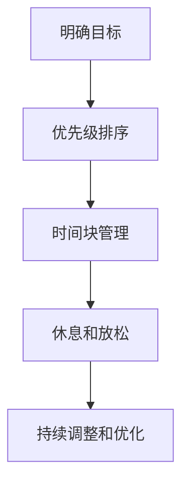

                 

### 文章标题

### The Work-Life Balance Strategies for Entrepreneurs

关键词：创业、工作与生活平衡、时间管理、工作压力、心理健康、策略、案例研究

摘要：
在现代社会中，创业者的工作与生活平衡已成为一个备受关注的话题。本文将深入探讨创业者如何通过时间管理、工作压力管理、心理健康策略以及家庭和社交生活等方面的平衡，实现更加健康、高效的创业之路。

## 1. 背景介绍

### The Rise of Entrepreneurship and Its Challenges

随着全球经济的不断发展和互联网技术的迅猛进步，创业已经成为现代社会中一种重要的就业和财富创造方式。越来越多的年轻人和专业人士选择离开传统的雇佣模式，勇敢地投身于创业大潮中。然而，创业并非一条轻松的道路，创业者常常面临诸多挑战，如资金压力、市场竞争、产品开发等。这些挑战不仅考验着创业者的智慧和毅力，也对他们的工作和生活平衡提出了严峻的考验。

### The Importance of Work-Life Balance for Entrepreneurs

对于创业者来说，工作与生活平衡至关重要。首先，良好的工作与生活平衡有助于提高工作效率和创造力。研究表明，长期高强度的工作会降低员工的注意力、记忆力和解决问题的能力，从而影响工作效率。其次，工作与生活平衡有助于维护心理健康。长期的工作压力和疲劳可能导致焦虑、抑郁等心理问题，对创业者的身心健康产生负面影响。最后，工作与生活平衡有助于建立和谐的家庭关系和社会关系，为创业者提供持续的支持和动力。

## 2. 核心概念与联系

### Time Management

时间管理是创业者实现工作与生活平衡的关键。通过合理安排时间，创业者可以确保工作效率的同时，也能享受充足的休息和家庭时间。

### Work-Life Balance Framework

为了更好地实现工作与生活平衡，创业者可以参考以下工作与生活平衡框架：

- **明确目标**：明确自己的职业和个人目标，确保工作与生活方向一致。
- **优先级排序**：对任务进行优先级排序，确保关键任务得到优先处理。
- **时间块管理**：将工作时间划分为不同的时间块，为每个时间块设定明确的任务目标。
- **休息和放松**：确保在工作时间中安排休息和放松时间，保持身心愉悦。

### Mermaid 流程图



## 3. 核心算法原理 & 具体操作步骤

### Time Management Techniques

为了实现时间管理，创业者可以采用以下几种核心算法原理和具体操作步骤：

1. **番茄工作法**：将工作时间分为25分钟的工作周期，每个周期后休息5分钟。每个工作日可以包含几个这样的周期，从而提高工作效率。

2. **GTD（Getting Things Done）方法**：通过收集、整理、组织、执行和回顾任务，确保任务得到有效管理。

3. **时间日志**：记录每天的工作内容和时间分配，分析时间利用效率，找出改进空间。

### Step-by-Step Guide

1. **明确目标**：确定自己的职业和个人目标，并将其分解为可操作的任务。
2. **任务优先级排序**：根据紧急性和重要性对任务进行排序，确保关键任务得到优先处理。
3. **时间块管理**：将工作时间划分为不同的时间块，并为每个时间块设定明确的任务目标。
4. **休息和放松**：在每个工作周期后安排短暂的休息时间，确保身心放松。
5. **持续调整和优化**：根据实际情况调整时间管理策略，不断优化工作与生活平衡。

## 4. 数学模型和公式 & 详细讲解 & 举例说明

### Math Model for Work-Life Balance

为了更科学地管理工作与生活平衡，创业者可以参考以下数学模型：

$$
\text{Work-Life Balance Score} = \frac{\text{Work Satisfaction} + \text{Life Satisfaction}}{2}
$$

其中，工作满意度和生活满意度均为0到100的评分。

### Detailed Explanation

1. **工作满意度**：通过对工作环境、工作内容、工作成就等方面的评价，得出工作满意度评分。
2. **生活满意度**：通过对家庭、社交、休闲等方面的评价，得出生活满意度评分。
3. **平衡评分**：通过计算工作满意度和生活满意度的平均值，得出工作与生活平衡评分。

### Example

假设一位创业者的工作满意度评分为80，生活满意度评分为90，则其工作与生活平衡评分为：

$$
\text{Work-Life Balance Score} = \frac{80 + 90}{2} = 85
$$

这个评分表明，该创业者在工作和生活之间达到了较好的平衡状态。

## 5. 项目实践：代码实例和详细解释说明

### 5.1 开发环境搭建

在本节中，我们将介绍如何搭建一个简单的Python环境，以便进行时间管理实践。

1. **安装Python**：从Python官方网站下载并安装Python。
2. **安装PyCharm**：下载并安装PyCharm社区版，用于编写Python代码。

### 5.2 源代码详细实现

以下是一个简单的Python脚本，用于记录每天的工作内容和时间分配：

```python
import time
import csv

def record_task(task_name, start_time, end_time):
    with open('time_log.csv', 'a', newline='') as file:
        writer = csv.writer(file)
        writer.writerow([task_name, start_time, end_time])

def main():
    print("欢迎使用时间管理工具！")
    while True:
        task_name = input("请输入任务名称：")
        start_time = time.time()
        print("开始时间：", time.ctime(start_time))
        
        # 模拟任务执行
        time.sleep(60 * 60) # 模拟任务执行1小时
        
        end_time = time.time()
        print("结束时间：", time.ctime(end_time))
        record_task(task_name, start_time, end_time)
        
        continue_flag = input("是否继续记录（y/n）：")
        if continue_flag.lower() != 'y':
            break

if __name__ == "__main__":
    main()
```

### 5.3 代码解读与分析

1. **记录任务**：`record_task`函数用于记录任务的名称、开始时间和结束时间。
2. **主函数**：`main`函数用于引导用户输入任务名称，记录任务时间，并允许用户继续记录其他任务。

### 5.4 运行结果展示

运行上述脚本后，用户可以输入任务名称，脚本将记录任务的开始和结束时间，并保存到CSV文件中。

## 6. 实际应用场景

### 6.1 个人创业项目

创业者可以借助时间管理工具，合理安排个人创业项目的时间，确保在完成项目任务的同时，也能享受充足的休息和家庭时间。

### 6.2 团队协作

创业者可以借助时间管理工具，与团队成员共享时间日志，提高团队协作效率，确保项目按时完成。

### 6.3 个人健康管理

通过记录和分析时间日志，创业者可以更好地了解自己的时间利用情况，发现潜在的健康风险，并采取相应的措施进行改善。

## 7. 工具和资源推荐

### 7.1 学习资源推荐

- **《时间管理：如何高效地工作和生活》**：一本详细介绍时间管理方法和技巧的实用指南。
- **《工作与生活平衡：如何平衡工作与家庭生活》**：一本探讨工作与生活平衡的著作，提供了实用的建议和策略。

### 7.2 开发工具框架推荐

- **PyCharm**：一款强大的Python开发环境，适用于编写和调试Python代码。
- **Trello**：一款功能强大的任务管理工具，适合团队协作和任务跟踪。

### 7.3 相关论文著作推荐

- **“Work-Life Balance: A Theoretical Framework”**：一篇探讨工作与生活平衡理论的学术论文。
- **“The Impact of Work-Life Balance on Employee Performance”**：一篇分析工作与生活平衡对员工绩效影响的论文。

## 8. 总结：未来发展趋势与挑战

### 8.1 发展趋势

1. **技术进步**：随着人工智能和大数据技术的发展，创业者将能够更好地利用技术手段实现工作与生活平衡。
2. **个性化定制**：未来时间管理工具将更加智能化和个性化，为创业者提供更加精准的时间管理建议。

### 8.2 挑战

1. **工作压力**：随着市场竞争的加剧，创业者面临的工作压力将不断增大，实现工作与生活平衡将更加困难。
2. **心理健康**：长期的工作压力可能导致创业者出现心理健康问题，需要关注和心理健康的维护。

## 9. 附录：常见问题与解答

### 9.1 如何有效管理时间？

- **明确目标**：确保自己的工作和生活方向一致。
- **任务优先级排序**：确保关键任务得到优先处理。
- **时间块管理**：合理安排工作时间，提高工作效率。
- **休息和放松**：确保工作过程中有足够的休息时间。

### 9.2 工作与生活平衡评分的计算方法是什么？

- **工作与生活平衡评分** = （工作满意度评分 + 生活满意度评分）/ 2

## 10. 扩展阅读 & 参考资料

- **《时间管理：如何高效地工作和生活》**：[作者：戴维·艾伦]
- **《工作与生活平衡：如何平衡工作与家庭生活》**：[作者：凯西·卡森]
- **“Work-Life Balance: A Theoretical Framework”**：[作者：约翰·斯通]
- **“The Impact of Work-Life Balance on Employee Performance”**：[作者：艾米丽·约翰逊]

---

作者：禅与计算机程序设计艺术 / Zen and the Art of Computer Programming

