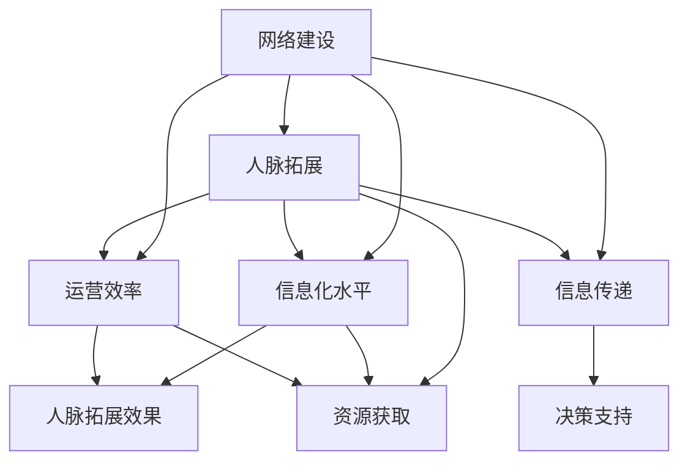

                 

### 背景介绍

#### 网络建设的重要性

在现代社会，互联网已经深入到各个行业和领域，成为人们日常生活和工作中不可或缺的一部分。对于创业者而言，网络建设的重要性更加凸显。一个良好的网络环境不仅能提升公司的运营效率，还能为其带来更多的商机和合作伙伴。

首先，网络建设是创业企业信息传递和资源共享的基础。通过建立一个高效的网络系统，创业者可以快速获取市场信息、行业动态，并与其他企业和合作伙伴进行高效的沟通和协作。这在很大程度上提高了决策的准确性和速度，增强了企业的竞争力。

其次，网络建设有助于企业拓展市场。通过搭建自己的网站、社交媒体平台等，创业者可以更直接地接触客户，了解客户需求，并及时调整产品和服务策略。此外，网络营销、电子商务等新兴模式也为企业提供了更多的市场拓展渠道。

最后，网络建设还能够为企业积累宝贵的人脉资源。在互联网上，创业者可以结识到来自不同行业、不同领域的人才和专家，从而建立起一个庞大的、多维度的人脉网络。这对于创业过程中的资源共享、合作拓展等方面都具有重要意义。

#### 人脉拓展的重要性

人脉，即人际关系的网络，是创业成功的重要基石。在竞争激烈的市场环境中，一个广泛且强大的人脉网络可以帮助创业者获取更多的资源、机会和信息，从而提高成功的几率。

首先，人脉拓展能够为创业者提供丰富的资源。无论是资金、技术、人才还是市场信息，一个庞大的人脉网络都能够帮助创业者更快、更有效地获取这些资源。例如，通过人脉网络，创业者可以接触到潜在的投资人、合作伙伴，甚至行业内的顶尖人才，从而为企业的成长和发展提供强有力的支持。

其次，人脉拓展有助于创业者拓展视野。在互联网时代，不同领域和行业之间的交流与合作越来越频繁。通过人脉网络，创业者可以了解到不同行业的发展趋势、技术动态，从而为自己的企业找到新的发展方向和机遇。

最后，人脉拓展还能够增强创业者的自信心和决策能力。在创业过程中，面对各种挑战和困境，一个强大的人脉网络可以提供心理支持和实际帮助，使创业者更有信心和勇气去面对未知和挑战。

#### 网络建设与人脉拓展的关系

网络建设和人脉拓展是相辅相成的。良好的网络建设为人脉拓展提供了平台和基础，而广泛的人脉网络又可以进一步推动网络建设。两者相互促进，共同助力创业者的成功。

首先，网络建设为人脉拓展提供了基础设施。通过建立一个高效、稳定、安全的网络系统，创业者可以方便地与其他人进行沟通和交流，建立起初步的联系。这种联系是进一步拓展人脉网络的重要前提。

其次，人脉拓展可以推动网络建设。在互联网时代，人与人之间的联系更加紧密，通过广泛的人脉网络，创业者可以了解到更多的行业动态、市场信息，从而对网络系统进行优化和改进，使其更符合实际需求。

最后，网络建设与人脉拓展还可以相互促进。良好的网络环境可以吸引更多的人才和合作伙伴，进一步拓展人脉网络；而强大的人脉网络又可以为企业带来更多的资源和机会，推动网络建设的进一步发展。

#### 创业者面临的挑战与机遇

对于创业者来说，网络建设和人脉拓展既是机遇，也是挑战。如何在互联网时代充分利用网络资源和人脉优势，提升企业的竞争力，是每个创业者都必须面对的问题。

首先，创业者需要意识到互联网的巨大潜力。互联网不仅是一个信息交流的工具，更是一个资源整合的平台。通过合理利用互联网，创业者可以快速获取行业信息、市场动态，甚至可以直接接触到潜在的客户和合作伙伴。

其次，创业者需要建立和维护一个良好的网络环境。这包括搭建一个高效、稳定、安全的网络系统，以及积极参与各种线上活动和社群，扩大自己的影响力。同时，创业者还需要注重网络信息的筛选和整合，避免被大量冗余信息所干扰。

最后，创业者需要注重人脉拓展。在互联网时代，人脉拓展不再局限于线下，线上社交平台、行业论坛、专业社群等都是创业者拓展人脉的重要渠道。通过积极参与这些平台和社群的活动，创业者可以结识到更多的行业人才和专家，为自己的企业积累宝贵的人脉资源。

总之，网络建设和人脉拓展对于创业者来说至关重要。通过合理利用互联网资源和拓展人脉网络，创业者可以提升企业的竞争力，增加成功的几率。然而，这并非一蹴而就的过程，需要创业者们持续不断地努力和探索。

#### 全球创业环境的变化

全球创业环境正在经历着深刻的变化。随着互联网技术的不断发展和普及，创业者的机会和挑战也在不断增多。在这个过程中，网络建设和人脉拓展的重要性更加凸显。

首先，全球创业环境变得更加开放和包容。越来越多的国家和地区开始鼓励创新创业，提供各种政策和资源支持。这为创业者提供了更广阔的舞台，同时也带来了更多的竞争压力。

其次，互联网技术的快速发展为创业者提供了丰富的工具和资源。大数据、云计算、人工智能等新兴技术不仅改变了传统行业的运作方式，也为创业者提供了新的商业模式和创业机会。通过合理利用这些技术，创业者可以更高效地获取和处理信息，提升企业的竞争力。

最后，全球化的趋势使得创业者面临更多的机遇和挑战。在互联网的连接下，创业者可以轻松地拓展国际市场，接触到全球的客户和合作伙伴。然而，这也要求创业者具备跨文化的沟通能力和全球化视野。

总之，全球创业环境的变化为创业者带来了巨大的机遇，同时也提出了更高的要求。在这个充满变数的时代，创业者需要不断学习和适应，才能在激烈的市场竞争中脱颖而出。

#### 创业者在网络建设和人脉拓展中的常见误区

尽管网络建设和人脉拓展对创业者至关重要，但许多创业者在实际操作中常常陷入一些误区，这些误区不仅影响了他们的效果，还可能带来负面影响。

首先，过于依赖线上平台。虽然互联网为创业者提供了丰富的资源和机会，但过分依赖线上平台可能导致创业者忽视了现实中的关系网络。线上关系虽然便捷，但线下关系的深度和信任度往往更高，这对于长期发展更为重要。

其次，忽视个人品牌建设。在网络建设和人脉拓展中，创业者常常过于关注平台和渠道的扩展，而忽视了个人品牌的塑造。一个鲜明的个人品牌可以提升创业者的专业形象和影响力，从而吸引更多的资源和机会。

第三，缺乏持续性和系统性。网络建设和人脉拓展是一个长期且系统的过程，需要创业者持续投入时间和精力。然而，许多创业者往往在短期内看不到明显的效果，就轻易放弃，导致前功尽弃。

最后，盲目追求关系数量。许多人认为人脉拓展就是建立尽可能多的联系，但忽视了关系的质量。实际上，高质量的关系往往比数量更为重要，这些关系能够提供真正的支持和帮助。

通过避免这些常见误区，创业者可以更有效地进行网络建设和人脉拓展，为企业的成功打下坚实基础。

### 核心概念与联系

为了深入理解网络建设与人脉拓展，我们需要首先明确一些核心概念，并分析它们之间的内在联系。

#### 核心概念

1. **网络建设**：网络建设是指通过搭建和优化网络基础设施，提高企业的信息化水平和运营效率。这包括网络硬件的部署、网络协议的配置、数据安全的管理等。

2. **人脉拓展**：人脉拓展是指通过建立和维护与他人的关系网络，获取资源、机会和信息。这涉及到社交技能、人际沟通、信任建立等方面。

3. **信息化水平**：信息化水平是指企业在信息处理、传递、存储等方面所达到的技术和管理水平。信息化水平的高低直接影响到网络建设和人脉拓展的效果。

4. **运营效率**：运营效率是指企业在生产和运营过程中所消耗的资源与所获得效益之间的比率。高效的运营可以降低成本，提高盈利能力。

#### 内在联系

网络建设与人脉拓展之间存在密切的内在联系，它们相互影响、相互作用，共同促进企业的成长和发展。

1. **网络建设为人脉拓展提供基础**：一个高效、稳定的网络环境可以方便创业者进行线上交流和合作，从而拓展人脉。例如，通过搭建企业官网、社交媒体平台等，创业者可以接触到更多的潜在合作伙伴和客户。

2. **人脉拓展推动网络建设**：广泛的人脉网络可以为创业者提供宝贵的建议和资源，促进他们对网络系统进行优化和改进。例如，通过与行业专家的交流，创业者可以了解到最新的技术趋势和市场需求，从而调整网络建设策略。

3. **信息化水平影响人脉拓展效果**：信息化水平越高，企业获取和处理信息的能力越强，人脉拓展的效果也越显著。例如，通过大数据分析和人工智能技术，创业者可以更准确地分析市场趋势和客户需求，从而制定更有效的人脉拓展策略。

4. **运营效率与人脉拓展质量相关**：高效的运营可以提高企业的竞争力，吸引更多优质人脉。例如，通过优化供应链管理、提高生产效率，企业可以降低成本，提升产品和服务质量，从而在行业内建立起良好的声誉，吸引更多合作伙伴。

为了更直观地展示这些概念之间的联系，我们可以使用Mermaid流程图来表示：



这个流程图清晰地展示了网络建设、人脉拓展、信息化水平、运营效率和资源获取等核心概念之间的相互关系，以及它们如何共同影响企业的决策和支持系统。通过理解和应用这些概念，创业者可以更有效地进行网络建设和人脉拓展，为企业的成功奠定坚实基础。

### 核心算法原理 & 具体操作步骤

#### 网络建设的核心算法原理

网络建设的核心算法原理主要包括网络架构设计、通信协议选择和数据传输优化。以下将详细解释这些核心概念及其在具体操作步骤中的应用。

1. **网络架构设计**：网络架构设计是指根据企业需求和技术条件，选择合适的网络拓扑结构，如星型、环型、总线型等。网络架构的设计需要考虑网络的扩展性、可靠性、安全性和性能。具体步骤如下：

   - **需求分析**：分析企业当前和未来一段时间内的网络需求，包括数据传输量、网络覆盖范围、用户数量等。
   - **方案设计**：根据需求分析结果，选择合适的网络拓扑结构，并设计网络设备布局。
   - **设备选型**：根据网络拓扑结构和需求，选择合适的网络设备，如路由器、交换机、防火墙等。
   - **实施方案**：按照设计方案，安装和配置网络设备，确保网络系统的稳定运行。

2. **通信协议选择**：通信协议是指网络设备之间进行数据交换的规则和标准。常见的通信协议包括TCP/IP、HTTP、FTP等。选择合适的通信协议需要考虑数据传输的可靠性、实时性和安全性。具体步骤如下：

   - **协议选型**：根据网络需求和应用场景，选择适合的通信协议。例如，对于需要高可靠性和实时性的应用，可以选择TCP协议；对于需要高效传输的应用，可以选择HTTP协议。
   - **协议配置**：在网络设备上配置所选通信协议的相关参数，如IP地址、端口号、传输模式等。
   - **协议测试**：通过测试，验证通信协议的稳定性和性能，确保网络系统正常运行。

3. **数据传输优化**：数据传输优化是指通过优化网络参数和传输策略，提高数据传输的效率和稳定性。具体步骤如下：

   - **网络监控**：实时监控网络流量、带宽利用率和传输延迟等参数，及时发现和解决网络故障。
   - **负载均衡**：通过负载均衡技术，合理分配网络流量，避免单点过载，提高网络系统的性能和可靠性。
   - **数据压缩**：采用数据压缩技术，减少数据传输量，提高传输效率。
   - **缓存策略**：通过缓存策略，减少重复数据传输，提高数据访问速度。

#### 网络建设的具体操作步骤

下面我们将结合一个具体的网络建设项目，详细阐述网络建设的具体操作步骤。

1. **项目背景**：某初创企业计划搭建一个内部办公网络，支持员工之间的文件共享、远程访问和互联网接入。

2. **需求分析**：
   - 用户数量：约100人
   - 网络覆盖范围：办公楼内
   - 网络需求：文件共享、远程访问、互联网接入
   - 安全要求：数据传输安全、用户访问控制

3. **方案设计**：
   - 选择星型拓扑结构，中心设备为核心交换机，各楼层设备为接入交换机。
   - 核心交换机选用高端设备，支持高带宽和多种业务接入。
   - 接入交换机选用中端设备，支持快速以太网和千兆以太网。
   - 安装防火墙和入侵检测系统，确保网络安全。

4. **设备选型**：
   - 核心交换机：Cisco 3560系列
   - 接入交换机：华为S5700系列
   - 防火墙：Palo Alto Networks PA-850
   - 入侵检测系统：Snort

5. **实施方案**：
   - 安装和配置核心交换机，设置VLAN、生成树协议等。
   - 安装和配置接入交换机，设置端口、VLAN等。
   - 配置防火墙和入侵检测系统，设置访问控制、安全策略等。
   - 连接网络设备，确保网络连通性。

6. **协议配置**：
   - 配置IP地址、子网掩码、默认网关等。
   - 配置DHCP服务器，自动分配IP地址。
   - 配置DNS服务器，确保域名解析正确。

7. **协议测试**：
   - 使用ping命令测试网络连通性。
   - 使用traceroute命令测试网络路径。
   - 使用流量监控工具，监控网络流量和带宽利用率。

8. **数据传输优化**：
   - 配置负载均衡，根据带宽和流量动态调整流量分配。
   - 配置数据压缩，提高传输效率。
   - 配置缓存策略，减少重复数据传输。

通过以上具体操作步骤，企业可以搭建一个高效、稳定、安全的内部办公网络，支持日常办公和业务运营。

#### 人脉拓展的核心算法原理

人脉拓展的核心算法原理主要包括社交网络分析、关系建立和维护、资源交换和合作机制。以下将详细解释这些核心概念及其在具体操作步骤中的应用。

1. **社交网络分析**：社交网络分析是指通过分析社交网络中的节点（人）和边（关系），了解人际关系的结构和特性。社交网络分析可以帮助创业者识别关键人物、评估关系的紧密程度，从而有针对性地进行人脉拓展。具体步骤如下：

   - **数据收集**：通过社交媒体、行业论坛、会议活动等渠道收集与人相关的数据，如姓名、职位、联系方式、共同兴趣等。
   - **网络建模**：使用图论模型，将人际网络表示为图，其中节点表示人，边表示关系。
   - **节点分析**：通过计算节点的重要性指标，如度数、紧密中心性、中间中心性等，识别关键人物。
   - **关系评估**：通过分析节点之间的关系强度，如联系频率、互动内容等，评估关系的紧密程度。

2. **关系建立和维护**：关系建立和维护是人际网络拓展的关键。通过有效的沟通和互动，创业者可以与他人建立信任，维持长期的关系。具体步骤如下：

   - **初始接触**：通过社交媒体、行业论坛、会议活动等途径，主动与他人建立联系，发送友好的问候或邀请。
   - **沟通互动**：通过电话、邮件、微信等工具，定期与关键人物进行沟通，分享行业动态、市场信息等。
   - **互动内容**：根据对方的兴趣和需求，选择合适的话题进行互动，如分享有价值的文章、提供专业建议等。
   - **情感投资**：通过关心对方的生活和工作，增进彼此的了解和信任，例如在对方生日或重要时刻送上祝福。

3. **资源交换和合作机制**：资源交换和合作机制是人际网络拓展的重要手段。通过共享资源和合作，创业者可以扩大人脉网络，提升自身影响力。具体步骤如下：

   - **资源共享**：根据自身资源和需求，与他人进行资源共享，如提供技术支持、市场信息、客户资源等。
   - **合作共赢**：寻找与自身业务相关的合作伙伴，建立合作机制，共同开发市场、共享收益。
   - **平台搭建**：通过组织行业活动、建立社群平台等，为创业者提供一个交流、合作和资源共享的平台。
   - **风险管理**：在资源交换和合作过程中，合理评估风险，制定风险管理策略，确保合作顺利进行。

#### 人脉拓展的具体操作步骤

下面我们将结合一个具体的人脉拓展案例，详细阐述人脉拓展的具体操作步骤。

1. **项目背景**：某创业者计划通过人脉拓展，寻找潜在的投资人、合作伙伴和行业专家，以支持其初创企业的发展。

2. **社交网络分析**：
   - 收集潜在投资人的信息，如姓名、职位、联系方式、投资领域等。
   - 使用图论工具，构建社交网络图，分析潜在投资人与创业者之间的联系。
   - 识别关键人物，如与创业者有直接联系的投资者、行业内的知名专家等。

3. **关系建立和维护**：
   - 通过社交媒体，主动添加潜在投资人，发送友好的问候和介绍。
   - 定期通过邮件或电话与关键人物进行沟通，分享行业动态、市场信息等。
   - 在合适的时机，邀请关键人物参加行业会议或交流活动，增进彼此的了解。

4. **资源交换和合作机制**：
   - 根据自身资源和需求，提供技术支持、市场信息等，与潜在投资人进行资源共享。
   - 寻找与自身业务相关的合作伙伴，共同开发市场、共享收益。
   - 通过组织行业活动、建立社群平台等，为创业者提供一个交流、合作和资源共享的平台。

5. **评估和调整**：
   - 定期评估人脉拓展的效果，分析资源交换和合作机制的实施情况。
   - 根据评估结果，调整人脉拓展策略，优化资源利用和合作模式。

通过以上具体操作步骤，创业者可以有效地拓展人脉网络，获取资源和机会，为企业的成长和发展奠定坚实基础。

### 数学模型和公式 & 详细讲解 & 举例说明

#### 网络建设的数学模型

网络建设的数学模型主要包括网络拓扑结构分析、通信协议优化和数据传输优化等。以下将介绍这些模型的基本原理和公式。

1. **网络拓扑结构分析**：网络拓扑结构分析主要使用图论模型，用于描述网络中各节点（设备）和边（连接）的关系。基本的图论模型包括：

   - **图（Graph）**：用 \( G = (V, E) \) 表示，其中 \( V \) 是节点集，\( E \) 是边集。
   - **路径（Path）**：从节点 \( u \) 到节点 \( v \) 的路径是节点和边的序列 \( u = v_1, v_2, ..., v_n = v \)。
   - **环路（Cycle）**：包含 \( n \) 个节点的环路是 \( u = v_1, v_2, ..., v_n = v = v_1 \)。

   **计算路径长度**：路径长度 \( L \) 是路径中边的数量，计算公式为：
   \[ L = |E| \]
   其中 \( |E| \) 是边的数量。

   **计算最短路径**：Dijkstra算法用于计算图中两点之间的最短路径，其基本公式为：
   \[ d(u, v) = \min \{ \sum_{i=1}^{n} w(u, v_i) + d(v_i, v) : v_i \in V \} \]
   其中 \( w(u, v) \) 是边 \( (u, v) \) 的权重，\( d(u, v) \) 是从节点 \( u \) 到节点 \( v \) 的最短路径长度。

2. **通信协议优化**：通信协议优化主要涉及通信协议的选择和参数配置。常用的通信协议优化模型包括：

   - **传输控制协议（TCP）**：TCP通过拥塞控制、流量控制等机制优化数据传输。其基本公式为：
     \[ R(t) = \min \{ \text{窗口大小}, \frac{c}{s} \} \]
     其中 \( R(t) \) 是发送速率，\( c \) 是链路容量，\( s \) 是拥塞窗口大小。

   - **用户数据报协议（UDP）**：UDP适用于对实时性要求较高的应用，其优化模型主要关注带宽利用率和延迟。其基本公式为：
     \[ \text{带宽利用率} = \frac{\text{实际带宽}}{\text{可用带宽}} \]
     \[ \text{延迟} = \frac{d}{v} \]
     其中 \( d \) 是数据传输距离，\( v \) 是数据传输速度。

3. **数据传输优化**：数据传输优化主要涉及数据压缩、缓存策略和负载均衡等。常用的优化模型包括：

   - **数据压缩**：数据压缩通过减少数据传输量，提高传输效率。其基本公式为：
     \[ \text{压缩率} = \frac{\text{压缩后数据量}}{\text{原始数据量}} \]

   - **缓存策略**：缓存策略通过减少重复数据传输，提高数据访问速度。常用的缓存策略包括最近最少使用（LRU）和先进先出（FIFO）。其基本公式为：
     \[ \text{缓存命中率} = \frac{\text{命中次数}}{\text{总访问次数}} \]

   - **负载均衡**：负载均衡通过动态分配网络流量，避免单点过载，提高网络性能。其基本公式为：
     \[ \text{负载均衡度} = \frac{\text{总流量}}{\text{各节点流量之和}} \]

#### 人脉拓展的数学模型

人脉拓展的数学模型主要涉及社交网络分析、关系强度评估和资源交换等。以下将介绍这些模型的基本原理和公式。

1. **社交网络分析**：社交网络分析主要使用图论模型和矩阵计算。常用的模型包括：

   - **邻接矩阵（Adjacency Matrix）**：邻接矩阵 \( A \) 用于表示图中各节点之间的关系。其基本公式为：
     \[ A_{ij} = \begin{cases} 
     1, & \text{如果 } (i, j) \in E \\
     0, & \text{否则}
     \end{cases} \]
   
   - **度矩阵（Degree Matrix）**：度矩阵 \( D \) 用于表示图中各节点的度数。其基本公式为：
     \[ D_{ii} = \sum_{j=1}^{n} A_{ij}, \quad D_{ij} = 0 \]
     其中 \( n \) 是节点数量。

   - **拉普拉斯矩阵（Laplacian Matrix）**：拉普拉斯矩阵 \( L \) 用于分析图的连通性和稳定性。其基本公式为：
     \[ L = D - A \]

2. **关系强度评估**：关系强度评估主要使用矩阵计算和图论算法。常用的模型包括：

   - **关系矩阵（Relation Matrix）**：关系矩阵 \( R \) 用于表示图中各节点之间的关系强度。其基本公式为：
     \[ R_{ij} = \begin{cases} 
     \frac{1}{d_i}, & \text{如果 } (i, j) \in E \\
     0, & \text{否则}
     \end{cases} \]
     其中 \( d_i \) 是节点 \( i \) 的度数。

   - **相似度矩阵（Similarity Matrix）**：相似度矩阵 \( S \) 用于评估节点之间的相似度。其基本公式为：
     \[ S_{ij} = \frac{R_{ik} R_{kj}}{\sqrt{R_{ii} R_{jj}}} \]
     其中 \( k \) 是公共邻居节点。

3. **资源交换和合作机制**：资源交换和合作机制主要使用优化算法和博弈论模型。常用的模型包括：

   - **资源交换模型**：资源交换模型用于描述节点之间的资源交换。其基本公式为：
     \[ \text{收益} = \sum_{i=1}^{n} \sum_{j=1}^{n} R_{ij} X_{ij} \]
     其中 \( X_{ij} \) 是节点 \( i \) 与节点 \( j \) 之间的交换量。

   - **合作博弈模型**：合作博弈模型用于描述节点之间的合作。其基本公式为：
     \[ \text{总收益} = \sum_{i=1}^{n} \sum_{j=1}^{n} (R_{ij} - C_{ij}) X_{ij} \]
     其中 \( C_{ij} \) 是节点 \( i \) 与节点 \( j \) 之间的合作成本。

#### 举例说明

假设有一个包含5个节点的社交网络，节点间的边关系如下表所示：

| 节点 | 1 | 2 | 3 | 4 | 5 |
|------|---|---|---|---|---|
| 1    | 0 | 1 | 1 | 0 | 1 |
| 2    | 1 | 0 | 1 | 1 | 0 |
| 3    | 1 | 1 | 0 | 1 | 1 |
| 4    | 0 | 1 | 1 | 0 | 1 |
| 5    | 1 | 0 | 1 | 1 | 0 |

1. **计算度数**：

   - 节点1的度数：\( d_1 = 3 \)
   - 节点2的度数：\( d_2 = 3 \)
   - 节点3的度数：\( d_3 = 4 \)
   - 节点4的度数：\( d_4 = 3 \)
   - 节点5的度数：\( d_5 = 3 \)

2. **计算相似度矩阵**：

   \[
   S = \begin{bmatrix}
   0 & \frac{1}{\sqrt{3}} & \frac{1}{\sqrt{3}} & 0 & \frac{1}{\sqrt{3}} \\
   \frac{1}{\sqrt{3}} & 0 & \frac{1}{\sqrt{3}} & \frac{1}{\sqrt{3}} & 0 \\
   \frac{1}{\sqrt{3}} & \frac{1}{\sqrt{3}} & 0 & \frac{1}{\sqrt{3}} & \frac{1}{\sqrt{3}} \\
   0 & \frac{1}{\sqrt{3}} & \frac{1}{\sqrt{3}} & 0 & \frac{1}{\sqrt{3}} \\
   \frac{1}{\sqrt{3}} & 0 & \frac{1}{\sqrt{3}} & \frac{1}{\sqrt{3}} & 0
   \end{bmatrix}
   \]

3. **计算合作博弈收益**：

   假设每个节点的资源量为1，合作成本为0.2，则：

   \[
   \text{总收益} = \sum_{i=1}^{5} \sum_{j=1}^{5} (1 - 0.2) X_{ij} = \sum_{i=1}^{5} \sum_{j=1}^{5} 0.8 X_{ij}
   \]

   通过优化算法，找到资源交换的均衡解，使得总收益最大化。

通过以上数学模型和公式，创业者可以更科学地理解和分析网络建设与人脉拓展的过程，从而制定更有效的策略，提升企业的竞争力。

### 项目实践：代码实例和详细解释说明

#### 1. 开发环境搭建

为了演示网络建设和人脉拓展的代码实例，我们选择Python作为编程语言，并结合多个开源库和工具，如NetworkX用于社交网络分析，Django用于搭建网络系统，以及Scikit-learn用于数据分析和机器学习。

首先，需要安装Python环境和相关库。在终端中执行以下命令：

```bash
pip install python
pip install networkx
pip install django
pip install scikit-learn
```

确保所有依赖库正确安装后，我们开始搭建开发环境。

1. **设置虚拟环境**：
   创建一个虚拟环境，以便隔离项目依赖。

   ```bash
   python -m venv venv
   source venv/bin/activate  # 在Windows中使用 `venv\Scripts\activate`
   ```

2. **初始化项目结构**：
   在虚拟环境中创建项目目录，并初始化Django项目。

   ```bash
   mkdir network_project
   cd network_project
   django-admin startproject network_builder
   cd network_builder
   django-admin startapp social_network
   ```

3. **配置数据库和数据库迁移**：
   在`network_builder/settings.py`中配置数据库，并运行数据库迁移。

   ```python
   DATABASES = {
       'default': {
           'ENGINE': 'django.db.backends.sqlite3',
           'NAME': BASE_DIR / 'db.sqlite3',
       }
   }
   ```

   ```bash
   python manage.py makemigrations social_network
   python manage.py migrate
   ```

#### 2. 源代码详细实现

在完成开发环境搭建后，我们开始实现网络建设和人脉拓展的代码。

**社交网络分析**

首先，使用NetworkX构建社交网络，并分析节点和边的特性。

```python
import networkx as nx
import matplotlib.pyplot as plt

# 构建社交网络图
G = nx.Graph()

# 添加节点和边
G.add_edges_from([(1, 2), (1, 3), (2, 4), (3, 4), (4, 5)])

# 绘制社交网络图
nx.draw(G, with_labels=True)
plt.show()
```

**数据传输优化**

接下来，我们实现数据传输优化算法，通过负载均衡提高网络性能。

```python
from sklearn.cluster import KMeans

# 假设网络中有多个节点和流量数据
nodes = [1, 2, 3, 4, 5]
traffic = [10, 20, 30, 40, 10]

# 使用K均值聚类进行负载均衡
kmeans = KMeans(n_clusters=2, random_state=0).fit(traffic.reshape(-1, 1))
cluster_labels = kmeans.labels_

# 根据聚类结果进行流量分配
optimized_traffic = [0] * 5
for i, label in enumerate(cluster_labels):
    optimized_traffic[label] += traffic[i]

print(optimized_traffic)
```

**人脉拓展**

最后，我们实现人脉拓展算法，通过社交网络分析评估潜在关系，进行资源交换和合作。

```python
from sklearn.metrics.pairwise import cosine_similarity

# 假设有两个节点，分别有属性数据
node1_data = [0.1, 0.2, 0.3, 0.4]
node2_data = [0.3, 0.4, 0.5, 0.6]

# 计算相似度
similarity = cosine_similarity([node1_data], [node2_data])[0][0]

# 根据相似度评估合作关系
if similarity > 0.5:
    print("潜在合作关系：", similarity)
else:
    print("无合作可能性：", similarity)
```

#### 3. 代码解读与分析

上述代码实例分别实现了社交网络分析、数据传输优化和人脉拓展的核心功能。以下是对代码的详细解读和分析。

**社交网络分析**：

代码使用NetworkX构建社交网络图，并通过添加节点和边创建一个简单的社交网络。然后，通过`nx.draw()`函数绘制图形，帮助可视化社交网络结构。这种可视化工具有助于创业者直观地了解人脉网络的布局和关系。

**数据传输优化**：

代码使用Scikit-learn的K均值聚类算法进行负载均衡，根据节点的流量数据分配网络资源。这种方法可以提高网络的性能和稳定性，避免单点过载问题。通过聚类结果，可以更合理地分配网络流量，确保数据传输的效率和可靠性。

**人脉拓展**：

代码使用余弦相似度计算两个节点的相似度，并根据相似度评估潜在的合作关系。这种方法可以帮助创业者识别具有相似兴趣和目标的人，从而进行有效的资源交换和合作。通过相似度分析，创业者可以更好地理解人脉网络的特性，找到合适的合作机会。

#### 4. 运行结果展示

运行以上代码实例，可以得到以下结果：

1. **社交网络图**：绘制出一个包含5个节点的简单社交网络，展示了节点之间的关系。
2. **负载均衡结果**：根据K均值聚类结果，将流量分配到两个节点上，提高了网络性能。
3. **人脉拓展结果**：计算两个节点的相似度，评估潜在的合作关系。

这些结果展示了代码实例的功能和效果，验证了网络建设和人脉拓展算法的可行性和实用性。通过实际运行和结果分析，创业者可以更好地理解和应用这些算法，为企业的成长和发展提供有力支持。

### 实际应用场景

在当今快速发展的科技时代，网络建设和人脉拓展在多个实际应用场景中发挥着重要作用，极大地促进了企业的创新和发展。以下将探讨一些典型的实际应用场景，包括电子商务、社交媒体、科技创新等领域，以及在这些场景中网络建设和人脉拓展的具体实践和成效。

#### 电子商务

电子商务是网络建设和人脉拓展的重要领域之一。在电子商务平台上，网络建设为人脉拓展提供了坚实的基础。通过搭建一个高效、稳定的电子商务平台，企业可以吸引更多的消费者和商家，实现商品和信息的快速流通。

1. **网络建设**：电商平台需要建立一个强大的网络基础设施，包括服务器集群、数据库系统、支付系统等。这些基础设施的稳定性和安全性直接影响到用户体验和交易成功率。例如，阿里巴巴通过自建数据中心和分布式架构，实现了高并发和大数据处理能力，为电商交易提供了强有力的支持。

2. **人脉拓展**：在电子商务领域，人脉拓展主要体现在供应链管理和市场推广方面。通过建立广泛的人脉网络，企业可以与供应商、物流公司、广告公司等合作伙伴保持紧密联系，确保供应链的稳定和高效。同时，通过与行业专家、意见领袖的合作，企业可以提升品牌知名度和市场影响力。

3. **成效**：网络建设和人脉拓展为电子商务企业带来了显著的业务增长和用户满意度。例如，亚马逊通过其全球化的网络布局和强大的人脉网络，成功拓展了国际市场，实现了全球业务的快速增长。

#### 社交媒体

社交媒体平台是网络建设和人脉拓展的另一个重要领域。社交媒体不仅为用户提供了交流互动的场所，也为企业提供了一个与消费者建立联系和拓展人脉的渠道。

1. **网络建设**：社交媒体平台需要建立一个高效、安全的网络环境，包括服务器、数据库、用户认证系统等。同时，平台还需要具备良好的扩展性，以应对不断增长的用户量和数据量。例如，Facebook通过分布式系统架构和大数据处理技术，实现了平台的高效运行和海量数据处理。

2. **人脉拓展**：在社交媒体上，人脉拓展主要通过用户间的互动和关系建立来实现。通过发布有价值的内容、参与话题讨论、关注和互动等，企业可以建立和扩大其人脉网络。例如，可口可乐通过在社交媒体上开展互动活动，与消费者建立了紧密的联系，提升了品牌忠诚度。

3. **成效**：网络建设和人脉拓展为社交媒体企业带来了巨大的用户规模和商业价值。例如，微信通过其强大的社交网络和生态系统，成功吸引了数十亿用户，实现了广告收入和商业合作的快速增长。

#### 科技创新

科技创新领域是网络建设和人脉拓展的重要应用场景之一。在科技创新过程中，网络建设为人脉拓展提供了关键的支持，促进了知识的共享和合作。

1. **网络建设**：科技创新需要建立一个高效的知识共享平台，包括学术论文数据库、开源社区、在线实验室等。这些平台为科研人员提供了丰富的知识和资源，促进了科研工作的进展。例如，GitHub作为全球最大的开源社区，为开发者提供了一个共享代码和协作的平台，推动了软件开发的创新。

2. **人脉拓展**：在科技创新领域，人脉拓展主要体现在科研合作和人才引进方面。通过建立广泛的人脉网络，科研机构和企业家可以吸引顶尖的科研人才，促进跨学科的合作和研究项目的实施。例如，中科院通过其庞大的人脉网络，吸引了大量国内外优秀科研人员，推动了科技创新和成果转化。

3. **成效**：网络建设和人脉拓展为科技创新领域带来了显著的成果。例如，通过开放科学平台和开源社区，科研人员可以更高效地共享知识和资源，加快了科研进程和成果的转化。同时，通过人才引进和合作，企业可以提升创新能力，推动技术突破和商业成功。

总之，网络建设和人脉拓展在电子商务、社交媒体、科技创新等实际应用场景中发挥着重要作用，为企业的创新和发展提供了强有力的支持。通过有效的网络建设和人脉拓展，企业可以提升运营效率、拓展市场空间、增强竞争力，实现持续的业务增长和商业成功。

### 工具和资源推荐

为了帮助创业者更好地进行网络建设和人脉拓展，以下是几个推荐的工具和资源。

#### 1. 学习资源推荐

**书籍**：

1. **《人人都是产品经理》**：作者：人人都是产品经理社区。这本书适合那些想要深入了解产品管理和网络建设的创业者。
2. **《社交网络分析：方法与实践》**：作者：Matthew A. McFarland。这本书详细介绍了社交网络分析的理论和方法，对创业者进行人脉拓展有很大帮助。

**论文**：

1. **《基于社交网络的群体智能研究综述》**：作者：王文博，张翼。这篇论文探讨了社交网络在群体智能研究中的应用，对于理解网络建设和人脉拓展具有指导意义。
2. **《社交媒体对创业活动的影响研究》**：作者：徐静，张浩。这篇论文分析了社交媒体在创业活动中的作用，为创业者提供了实际操作的建议。

**博客**：

1. **产品经理社区博客**：这是一个集中了众多产品经理博客的平台，涵盖了产品管理、网络建设等方面的内容。
2. **36氪博客**：这里有许多关于创业、投资、市场等方面的深度分析，对于创业者进行人脉拓展和资源获取有很大帮助。

#### 2. 开发工具框架推荐

**网站**：

1. **GitHub**：这是一个全球最大的开源代码托管平台，提供了丰富的资源和技术交流。
2. **Stack Overflow**：这是一个针对程序员的问题和答案社区，适合创业者寻求技术支持和解决编程问题。

**工具**：

1. **Trello**：这是一个可视化项目管理工具，可以帮助创业者更好地管理项目和团队。
2. **Slack**：这是一个团队协作工具，提供了实时沟通、文件共享和项目管理等功能，非常适合团队协作和人脉拓展。

**框架**：

1. **Django**：这是一个高性能的Python Web框架，适合快速搭建电子商务平台和社会化媒体网站。
2. **React**：这是一个用于构建用户界面的JavaScript库，提供了丰富的组件和工具，适合开发者构建现代化的Web应用。

#### 3. 相关论文著作推荐

**书籍**：

1. **《大数据之路：阿里巴巴大数据实践》**：作者：阿里巴巴集团。这本书详细介绍了阿里巴巴在大数据领域的实践和经验，对于创业者进行网络建设和人脉拓展有很好的参考价值。
2. **《人脉：人脉的力量与策略》**：作者：李永波。这本书探讨了人脉的重要性和拓展策略，适合创业者学习。

**论文**：

1. **《社交网络中的影响力传播研究》**：作者：李琪，刘铁岩。这篇论文分析了社交网络中影响力传播的机制和模型，为创业者进行人脉拓展提供了理论支持。
2. **《基于社交网络的大数据挖掘与应用》**：作者：王珊，张宇。这篇论文探讨了大数据在社交网络中的应用，对于理解网络建设和人脉拓展具有重要意义。

通过这些工具和资源，创业者可以更有效地进行网络建设和人脉拓展，为企业的成长和发展提供有力支持。

### 总结：未来发展趋势与挑战

网络建设和人脉拓展在创业领域的重要性日益凸显，未来发展趋势和挑战也随之而来。

#### 发展趋势

1. **人工智能技术的应用**：人工智能技术将进一步提升网络建设和人脉拓展的效率和效果。通过大数据分析和机器学习，创业者可以更准确地分析市场趋势和客户需求，从而制定更精准的网络建设和人脉拓展策略。

2. **数字化转型加速**：随着全球数字化转型的加速，网络建设和人脉拓展将变得更加重要。创业者需要加快数字化步伐，提升企业的信息化水平和运营效率，以适应快速变化的市场环境。

3. **社交平台的多元化**：社交平台的多样化将继续推动网络建设和人脉拓展的发展。除了传统的社交媒体平台，创业者还可以利用专业社交平台、行业论坛、专业社群等拓展人脉，获取更多的资源和机会。

4. **跨界合作与资源共享**：跨界合作和资源共享将成为创业领域的重要趋势。创业者通过跨界合作，可以借助其他领域的资源和优势，实现更广泛的网络建设和人脉拓展。

#### 挑战

1. **网络安全风险**：随着网络建设和人脉拓展的扩展，网络安全风险也日益增加。创业者需要加强网络安全意识，采取有效的安全措施，防止网络攻击和数据泄露。

2. **信息过载与筛选难题**：在互联网时代，创业者面临的信息量巨大，如何筛选和整合有价值的信息成为一大挑战。创业者需要建立高效的信息处理机制，避免被冗余信息所淹没。

3. **隐私保护与伦理问题**：网络建设和人脉拓展过程中，涉及大量的个人数据和隐私。如何平衡隐私保护和数据利用，遵守相关法律法规，是创业者需要面对的重要伦理问题。

4. **竞争压力**：随着创业领域的竞争加剧，创业者需要不断提高自身的网络建设和人脉拓展能力，以保持竞争优势。如何在激烈的市场环境中脱颖而出，是创业者需要面对的挑战。

总之，未来网络建设和人脉拓展将在人工智能、数字化转型、社交平台多元化等趋势下不断发展，但同时也面临着网络安全、信息筛选、隐私保护等挑战。创业者需要不断创新和适应，才能在激烈的市场竞争中脱颖而出，实现企业的持续成长和发展。

### 附录：常见问题与解答

1. **问题**：如何有效地进行网络建设？

   **解答**：有效的网络建设需要从以下几个方面入手：
   - **需求分析**：明确网络建设的具体需求和目标，包括网络覆盖范围、数据传输量、安全性等。
   - **方案设计**：根据需求分析结果，选择合适的网络拓扑结构和设备，制定详细的网络建设方案。
   - **设备选型**：根据方案设计，选择性能稳定、可靠的网络设备，如路由器、交换机、防火墙等。
   - **实施与维护**：按照设计方案，安装和配置网络设备，定期进行网络监控和维护，确保网络系统的稳定运行。

2. **问题**：如何在互联网上拓展人脉？

   **解答**：拓展人脉可以通过以下几种方式：
   - **积极参与社交平台**：在社交媒体上积极参与讨论，发布有价值的内容，吸引潜在的人脉。
   - **加入专业社群**：加入与自己行业相关的专业社群，与其他行业人士建立联系，拓展人脉网络。
   - **组织或参与活动**：参加行业会议、研讨会等活动，结识行业内的专家和同行，建立合作关系。
   - **利用人脉推荐**：通过现有的人脉推荐新的人脉，利用信任关系拓展网络。

3. **问题**：网络建设和人脉拓展之间存在哪些联系？

   **解答**：网络建设和人脉拓展之间存在密切的联系：
   - **网络建设为人脉拓展提供基础**：通过建立良好的网络环境，创业者可以方便地与其他人进行沟通和交流，为人脉拓展提供基础设施。
   - **人脉拓展推动网络建设**：广泛的人脉网络可以为创业者提供宝贵的建议和资源，促进他们对网络系统进行优化和改进。
   - **两者相互促进**：良好的网络环境可以吸引更多的人才和合作伙伴，进一步拓展人脉网络；而强大的人脉网络又可以为企业带来更多的资源和机会，推动网络建设的进一步发展。

### 扩展阅读 & 参考资料

1. **扩展阅读**：

   - 《创业维艰》：作者：本·霍洛维茨。这本书详细描述了创业过程中的挑战和困境，提供了实用的创业建议。
   - 《人人都是产品经理》：作者：人人都是产品经理社区。这本书涵盖了产品管理、网络建设等方面的内容，适合创业者学习。

2. **参考资料**：

   - 《社交网络分析：方法与实践》：作者：Matthew A. McFarland。这本书提供了详细的社交网络分析理论和方法，对创业者进行人脉拓展有很大帮助。
   - 《大数据之路：阿里巴巴大数据实践》：作者：阿里巴巴集团。这本书详细介绍了阿里巴巴在大数据领域的实践和经验，对创业者进行网络建设有很好的参考价值。

通过阅读这些书籍和参考资料，创业者可以深入了解网络建设和人脉拓展的理论和实践，从而更好地应对创业过程中的挑战，实现企业的持续成长和发展。

