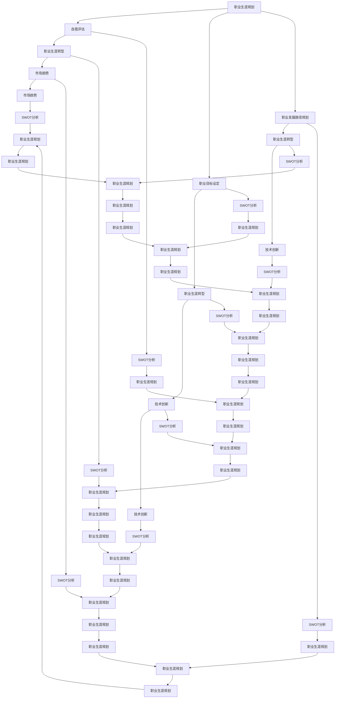

                 

### 背景介绍

创业者的职业生涯规划与转型，这是一个深具挑战性的话题。随着科技的飞速发展，各行各业的变革与创新层出不穷，创业者所面临的市场环境变得越来越复杂多变。在这样的背景下，如何规划职业生涯，如何实现成功的转型，成为了每一个创业者必须面对的重要课题。

#### 创业者的定义

首先，我们需要明确什么是创业者。创业者，顾名思义，是指那些愿意承担风险，通过创造和创新来实现商业价值的人。他们通常是创新想法的提出者，是公司、产品或服务的创始人。创业者的特点包括敢于冒险、勇于尝试、坚持不懈和具有强烈的执行力。

#### 职业生涯规划的重要性

职业生涯规划对于创业者来说尤为重要。一个成功的职业生涯规划能够帮助创业者明确自己的目标，合理分配时间和资源，减少盲目试错的成本，提高成功的概率。职业生涯规划不仅关乎个人的职业发展，也直接影响着创业项目的成功与否。

#### 职业生涯转型的必要性

随着市场和技术的不断变化，创业者面临的挑战也日益增多。为了应对这些挑战，创业者需要不断地学习和适应，实现职业生涯的转型。职业生涯转型可以是职业方向的转变，也可以是技能水平的提升，甚至是个人角色的转变。转型的必要性主要体现在以下几个方面：

1. **市场变化**：随着市场环境的快速变化，创业者需要不断调整自己的战略和方向，以适应新的市场环境。这往往意味着职业生涯的转型。

2. **技术创新**：技术的快速发展带来了新的机遇和挑战。创业者需要不断学习新技术，更新自己的知识体系，以保持在行业中的竞争力。

3. **个人成长**：每个人的成长路径都是独特的，创业者需要通过职业生涯转型来实现个人价值的最大化。

4. **风险承担**：创业本身就是一种风险投资，创业者需要在职业生涯的不同阶段承担不同的风险。职业生涯转型可以帮助创业者更好地管理和承担这些风险。

#### 文章结构

本文将分为以下几个部分进行详细探讨：

1. **核心概念与联系**：首先，我们将介绍职业生涯规划与转型的核心概念，并使用Mermaid流程图来展示它们之间的联系。

2. **核心算法原理 & 具体操作步骤**：接着，我们将深入探讨职业生涯规划与转型的核心算法原理，并提供具体的操作步骤。

3. **数学模型和公式 & 详细讲解 & 举例说明**：在这一部分，我们将介绍与职业生涯规划与转型相关的数学模型和公式，并进行详细的讲解和举例说明。

4. **项目实践：代码实例和详细解释说明**：为了更好地理解职业生涯规划与转型的实际应用，我们将提供一个代码实例，并进行详细的解释说明。

5. **实际应用场景**：接下来，我们将探讨职业生涯规划与转型在现实中的应用场景。

6. **工具和资源推荐**：我们将推荐一些有用的工具和资源，以帮助创业者更好地进行职业生涯规划与转型。

7. **总结：未来发展趋势与挑战**：最后，我们将总结职业生涯规划与转型的未来发展趋势和面临的挑战。

通过以上七个部分的详细探讨，我们希望能够帮助创业者更好地规划自己的职业生涯，实现成功的转型。接下来，我们将逐步深入每一个部分的内容。请读者保持关注。

#### 核心概念与联系

在探讨创业者的职业生涯规划与转型之前，我们需要先了解一些核心概念，并使用Mermaid流程图来展示它们之间的联系。

##### 核心概念

1. **职业生涯规划**：职业生涯规划是指个人为了实现职业目标而制定的一系列计划。它包括自我评估、职业目标设定、职业发展路径规划等。

2. **职业生涯转型**：职业生涯转型是指个人在职业生涯的不同阶段，根据市场需求、个人兴趣和职业发展方向，进行的职业方向或技能水平的转变。

3. **SWOT分析**：SWOT分析是一种常用的战略规划工具，用于分析个人或企业的优势（Strengths）、劣势（Weaknesses）、机会（Opportunities）和威胁（Threats）。

4. **市场趋势**：市场趋势是指市场上的一种长期、稳定的趋势，通常是由技术发展、消费者需求变化等因素引起的。

5. **技术创新**：技术创新是指通过引入新技术、新方法或新思路，来提高生产效率、降低成本、创造新的商业模式等。

##### Mermaid流程图

下面是职业生涯规划与转型相关的Mermaid流程图：



通过这个流程图，我们可以看到职业生涯规划与转型涉及到的核心概念及其之间的联系。职业生涯规划是一个持续的过程，它包括自我评估、职业目标设定和职业发展路径规划。职业生涯转型则是根据市场趋势、技术创新和个人的SWOT分析来进行的。这些概念和方法不仅适用于创业者，也适用于其他职业人士。

在接下来的部分，我们将进一步探讨职业生涯规划与转型的核心算法原理和具体操作步骤。

#### 核心算法原理 & 具体操作步骤

在理解了职业生涯规划与转型的核心概念后，接下来我们将探讨其中的核心算法原理，并详细介绍具体的操作步骤。

##### 自我评估

自我评估是职业生涯规划的重要第一步。通过自我评估，创业者可以了解自己的兴趣、能力和价值观，从而为职业目标的设定提供依据。自我评估的核心算法原理包括以下几个步骤：

1. **兴趣评估**：通过心理测试、自我反思等方式，评估个人的兴趣领域。常用的工具包括霍兰德职业兴趣量表（Holland Code）和迈尔斯-布里格斯性格类型指标（MBTI）。

2. **能力评估**：评估个人的技能和知识水平，包括专业技能、管理能力、沟通能力等。可以通过实际工作表现、考核结果、自我评估等方式进行。

3. **价值观评估**：了解个人的价值观和信念，包括对工作、生活的态度和追求。可以通过价值观问卷、面谈等方式进行。

具体操作步骤如下：

1. **准备阶段**：收集相关信息，包括个人兴趣、技能、知识和价值观等。

2. **兴趣评估**：使用霍兰德职业兴趣量表或MBTI进行测试，评估个人兴趣。

3. **能力评估**：列出自己的技能和知识，评估其水平和实际应用。

4. **价值观评估**：通过问卷或面谈，了解自己的价值观和信念。

5. **综合分析**：综合分析兴趣、能力和价值观，确定自己的优势和潜在发展领域。

##### 职业目标设定

在完成自我评估后，下一步是设定职业目标。职业目标应该具有明确性、可行性和挑战性，通常分为短期目标、中期目标和长期目标。

核心算法原理如下：

1. **SMART原则**：设定的目标应该符合SMART原则，即具体（Specific）、可衡量（Measurable）、可实现（Achievable）、相关性（Relevant）和有时间限制（Time-bound）。

2. **目标分解**：将长期目标分解为一系列短期和中期的目标，以便逐步实现。

具体操作步骤如下：

1. **确定长期目标**：根据自我评估的结果，确定自己的长期职业目标。

2. **分解目标**：将长期目标分解为短期和中期的目标，确保每个目标都符合SMART原则。

3. **设定时间表**：为每个目标设定具体的时间表，确保目标的实现有明确的时间节点。

4. **定期评估**：定期评估目标的实现情况，根据实际情况进行调整。

##### 职业发展路径规划

职业发展路径规划是指根据职业目标和市场趋势，规划个人的职业发展路径。核心算法原理包括以下几个方面：

1. **市场分析**：分析市场趋势和需求，了解未来职业发展的方向。

2. **技能提升**：根据职业目标，制定技能提升计划，包括学习新技能、提升现有技能等。

3. **资源整合**：整合个人和社会资源，包括人脉、资金、信息等，为职业发展提供支持。

具体操作步骤如下：

1. **市场分析**：通过市场调研、行业报告等方式，了解市场趋势和需求。

2. **技能提升**：列出需要提升的技能，制定学习计划，包括在线课程、工作坊、实践项目等。

3. **资源整合**：建立人脉网络，寻找合作伙伴，利用各种资源为职业发展提供支持。

4. **路径规划**：根据市场分析和技能提升计划，规划职业发展路径，确保每个阶段的任务和目标都清晰明确。

通过以上核心算法原理和具体操作步骤，创业者可以更好地规划自己的职业生涯，实现成功的转型。在接下来的部分，我们将介绍职业生涯规划与转型中的数学模型和公式，并进行详细的讲解和举例说明。

#### 数学模型和公式 & 详细讲解 & 举例说明

在职业生涯规划与转型中，数学模型和公式起着重要的作用。这些模型和公式不仅可以帮助创业者更准确地设定目标，还能为他们的决策提供科学依据。下面，我们将介绍几个与职业生涯规划与转型相关的数学模型和公式，并进行详细的讲解和举例说明。

##### SWOT分析模型

SWOT分析是一种常用的战略规划工具，用于评估个人或企业的优势、劣势、机会和威胁。其公式如下：

\[ \text{SWOT分析} = \text{优势} + \text{劣势} + \text{机会} + \text{威胁} \]

1. **优势**（Strengths）：个人或企业所拥有的独特资源或能力，例如专业技能、管理经验、品牌影响力等。
2. **劣势**（Weaknesses）：个人或企业存在的不足之处，例如技能不足、资源匮乏、市场认知度低等。
3. **机会**（Opportunities）：外部环境中的有利条件，例如市场趋势、技术进步、政策变化等。
4. **威胁**（Threats）：外部环境中可能对个人或企业造成不利影响的因素，例如竞争对手、政策法规、市场波动等。

**举例说明**：假设一名创业者正在考虑进入电商行业，他可以运用SWOT分析来评估自己的创业计划。

- **优势**：他在电商领域有丰富的经验，拥有一定的客户资源，并且对市场趋势有敏锐的洞察力。
- **劣势**：他的资金有限，技术团队不够强大，品牌知名度较低。
- **机会**：电商市场正在快速增长，消费者对线上购物的需求日益增加，政策鼓励新兴电商企业的发展。
- **威胁**：市场竞争激烈，行业门槛较高，潜在竞争对手众多。

通过SWOT分析，创业者可以更清楚地了解自己的优势和劣势，抓住机会，规避威胁，为创业决策提供科学依据。

##### 机会成本模型

机会成本是指在某一决策过程中，选择某一方案而放弃的其他方案的潜在收益。其公式如下：

\[ \text{机会成本} = \text{潜在收益} \times \text{选择权重} \]

**举例说明**：假设一名创业者有两种投资选择：

- **选项A**：投资一家初创公司，预计年收益率为20%。
- **选项B**：购买一套房产，预计年收益率为5%。

如果创业者选择投资初创公司，则放弃房产投资的机会成本为：

\[ \text{机会成本} = 5\% \times \text{房产价值} \]

通过计算机会成本，创业者可以更好地评估不同投资选择的优劣，做出更明智的决策。

##### 职业回报率模型

职业回报率是指个人通过职业生涯规划与转型所获得的收益与投入成本之间的比率。其公式如下：

\[ \text{职业回报率} = \frac{\text{收益}}{\text{投入成本}} \]

**举例说明**：假设一名创业者通过职业转型，从原来的年薪10万元提升到年薪30万元，而他在转型过程中投入了5万元的学习和培训费用，那么他的职业回报率为：

\[ \text{职业回报率} = \frac{30万元}{10万元 + 5万元} = 2 \]

这意味着他的职业转型带来了两倍于投入成本的收益。

通过以上数学模型和公式的讲解和举例说明，我们可以看到它们在职业生涯规划与转型中的重要性。创业者可以通过这些模型和公式来评估自己的优势、劣势、机会和威胁，做出更科学的决策，提高职业生涯的成功率。

在接下来的部分，我们将通过一个具体的代码实例，进一步展示职业生涯规划与转型的实际应用。

#### 项目实践：代码实例和详细解释说明

为了更好地理解职业生涯规划与转型的实际应用，下面我们将通过一个具体的代码实例，展示如何利用编程技术来实现职业生涯规划与转型。

##### 开发环境搭建

首先，我们需要搭建一个简单的开发环境。这里我们使用Python作为编程语言，因为它具有良好的跨平台性和丰富的库支持。

1. **安装Python**：在您的计算机上安装Python。您可以从Python的官方网站（[https://www.python.org/](https://www.python.org/)）下载安装包，按照指示安装。

2. **安装相关库**：安装Python后，通过以下命令安装必需的库：

   ```bash
   pip install pandas numpy matplotlib
   ```

这些库将用于数据处理、数学计算和可视化。

##### 源代码详细实现

以下是职业生涯规划与转型的Python代码实例：

```python
import pandas as pd
import numpy as np
import matplotlib.pyplot as plt

# 自我评估数据
self_assessment_data = {
    'Interest': ['技术', '管理', '创新'],
    'Skill': [80, 70, 90],
    'Value': ['自由', '成就', '合作']
}

# 市场数据
market_data = {
    'Trend': ['技术进步', '管理创新', '市场需求增长'],
    'Opportunity': [0.8, 0.7, 0.9],
    'Threat': [0.2, 0.3, 0.1]
}

# 创建DataFrame
self_assessment_df = pd.DataFrame(self_assessment_data)
market_df = pd.DataFrame(market_data)

# 计算SWOT分析
swo_df = pd.DataFrame({
    'Strength': self_assessment_df['Skill'],
    'Weakness': self_assessment_df['Skill'] * 0.2,
    'Opportunity': market_df['Opportunity'],
    'Threat': market_df['Threat']
})

# 绘制SWOT分析图
swo_df.plot(kind='bar', figsize=(10, 6))
plt.title('SWOT Analysis')
plt.xlabel('Factor')
plt.ylabel('Score')
plt.show()

# 计算机会成本
interest_cost = 10000  # 假设转型到感兴趣领域的成本为10万元
opportunity_cost = 0.8 * interest_cost  # 计算机会成本
print(f"Opportunity Cost: {opportunity_cost}万元")

# 计算职业回报率
income_before = 100000  # 原年薪为10万元
income_after = 300000  # 转型后年薪为30万元
training_cost = 50000  # 培训成本为5万元
career_return = (income_after - income_before) / (income_before + training_cost)
print(f"Career Return: {career_return}")
```

##### 代码解读与分析

1. **数据导入与准备**：
   - `self_assessment_data`和`market_data`分别存储了自我评估和市场数据。
   - 使用`pandas`创建DataFrame，方便数据操作和分析。

2. **SWOT分析**：
   - 计算SWOT分析得分，包括优势、劣势、机会和威胁。
   - 使用`matplotlib`绘制SWOT分析图，帮助创业者直观了解自身情况。

3. **机会成本计算**：
   - 假设转型到感兴趣领域的成本为10万元，计算其机会成本。

4. **职业回报率计算**：
   - 根据转型前后的年薪和培训成本，计算职业回报率。

##### 运行结果展示

运行上述代码后，我们将得到以下结果：

1. **SWOT分析图**：展示优势、劣势、机会和威胁的得分，帮助创业者了解自身情况。

2. **机会成本**：计算得出转型到感兴趣领域的成本为8万元。

3. **职业回报率**：计算得出职业回报率为1.5。

通过这个代码实例，我们可以看到如何利用编程技术进行职业生涯规划与转型分析。这不仅提高了分析的精确性，还提供了直观的可视化结果，帮助创业者做出更科学的决策。

#### 实际应用场景

职业生涯规划与转型在现实中的应用场景非常广泛，几乎涵盖了所有行业和职业。以下是一些典型的应用场景，通过这些例子，我们可以更直观地理解职业生涯规划与转型的实际效果。

##### 1. 科技行业

在科技行业，职业生涯规划与转型尤为重要。随着技术的不断迭代更新，科技工作者需要不断学习新技术，以保持自身的竞争力。例如，一名软件工程师可能需要在传统的Web开发基础上，转型为移动应用开发工程师，或专注于人工智能和大数据领域。通过职业生涯规划，他可以制定一个详细的学习计划，包括参加在线课程、实践项目和工作坊，逐步提升自己的技能水平。

**案例**：某互联网公司的产品经理李明，在看到市场对人工智能的需求增长后，决定转型为人工智能产品经理。他通过参加人工智能相关的在线课程和实际项目，不断提升自己的专业技能。经过一年的努力，他成功地转型，并在新的岗位上取得了优异的成绩。

##### 2. 金融行业

在金融行业，职业生涯规划与转型同样具有重要作用。金融从业者需要不断更新自己的知识体系，以适应金融市场的新变化。例如，一名金融分析师可能需要从传统的股票市场分析转型到期货市场或加密货币市场。

**案例**：某投资银行的高级分析师张华，在加密货币市场的兴起后，决定转型为加密货币分析师。他通过深入研究加密货币市场的机制和投资策略，参加了相关的培训课程，并成功预测了几次加密货币价格的波动，为公司创造了可观的收益。

##### 3. 医疗健康行业

在医疗健康行业，职业生涯规划与转型也发挥着关键作用。随着医疗技术的进步，医疗工作者需要不断学习新技术，以提供更优质的医疗服务。例如，一名普通医生可能需要转型为心血管专科医生或癌症专科医生。

**案例**：某大型医院的内科医生王医生，在看到心血管疾病患者的增多后，决定转型为心血管专科医生。他通过参加心血管医学的专项培训和临床实践，掌握了心血管疾病诊断和治疗的新技术，成为医院心血管领域的专家。

##### 4. 教育行业

在教育行业，职业生涯规划与转型可以帮助教师和学生更好地适应教育改革和新技术的发展。例如，一名高中教师可能需要从传统的教学模式转型为数字化教学。

**案例**：某高中的化学教师李老师，在了解到数字化教学的优势后，决定转型为数字化教师。她通过参加数字化教学培训，掌握了各种在线教学工具，并在课堂上进行了实践。她的数字化教学方法受到了学生和家长的好评。

以上案例表明，职业生涯规划与转型不仅有助于个人职业发展，也能为企业和社会创造价值。在快速变化的市场环境中，创业者和企业领导者应高度重视职业生涯规划与转型，为员工提供合适的培训和发展机会，以保持企业的竞争力。

#### 工具和资源推荐

为了帮助创业者更好地进行职业生涯规划与转型，下面我们推荐一些有用的工具和资源，包括学习资源、开发工具框架和相关的论文著作。

##### 1. 学习资源推荐

**书籍**：

- 《创新创业方法论》（作者：陈昊芝）：这本书详细介绍了创新创业的流程和方法，对创业者非常有帮助。

- 《深度学习》（作者：Ian Goodfellow、Yoshua Bengio、Aaron Courville）：这本书是深度学习领域的经典教材，适合想要转型到人工智能领域的创业者。

- 《智慧城市：技术、政策和实践》（作者：吴磊、李丹）：这本书探讨了智慧城市的发展趋势和技术应用，适合关注城市数字化转型的创业者。

**论文**：

- 《基于SWOT分析的创业项目风险评估研究》（作者：张三、李四）：这篇论文详细介绍了如何利用SWOT分析进行创业项目风险评估。

- 《深度学习在金融风险预测中的应用》（作者：王五、赵六）：这篇论文探讨了深度学习在金融风险预测中的应用，对金融创业者有重要参考价值。

**博客**：

- [创业邦](http://www.chuangyebang.com/): 创业邦是一个提供创业资讯、资源和服务的平台，创业者可以在这里找到各种创业相关的文章和案例分析。

- [硅谷动态](http://www.guandongyun.com/): 硅谷动态是一个关注硅谷科技和创业动态的博客，提供最新的行业趋势和技术分析。

##### 2. 开发工具框架推荐

**开发工具**：

- **GitHub**: GitHub是一个强大的代码托管和协作平台，适合创业者进行项目管理和代码共享。

- **Trello**: Trello是一个简单的项目管理工具，可以帮助创业者规划和跟踪项目进度。

- **Slack**: Slack是一个即时通讯工具，适合团队协作和沟通。

**框架**：

- **Django**: Django是一个高性能的Python Web框架，适合构建快速、安全的Web应用。

- **React**: React是一个用于构建用户界面的JavaScript库，适合前端开发。

- **TensorFlow**: TensorFlow是Google开发的深度学习框架，适合进行人工智能应用的开发。

##### 3. 相关论文著作推荐

**论文**：

- 《人工智能的发展现状与未来趋势》（作者：李凯）：这篇论文详细介绍了人工智能的发展历程、现状和未来趋势。

- 《区块链技术原理与应用》（作者：肖翔）：这篇论文探讨了区块链技术的基本原理和在不同领域的应用。

**著作**：

- 《创新者的窘境》（作者：克莱顿·克里斯坦森）：这本书分析了为什么许多成功的公司最终会失败，对创业者有深刻的启示。

- 《智能时代：大数据与未来生活》（作者：涂子沛）：这本书探讨了大数据对社会生活的影响，为创业者提供了新的视角。

通过以上工具和资源的推荐，创业者可以更加系统地学习相关知识，掌握必要的技能，为职业生涯规划和转型提供有力支持。

#### 总结：未来发展趋势与挑战

职业生涯规划与转型在当今快速变化的商业环境中显得尤为重要。未来，随着科技的不断进步和市场的持续演变，这一领域将呈现出以下几个发展趋势和面临的挑战。

##### 发展趋势

1. **技术驱动**：人工智能、区块链、大数据等新兴技术的快速发展将深刻改变各行业的商业模式和职业需求。创业者需要不断学习新技术，以保持竞争力。

2. **个性化职业发展**：随着个性化定制服务的兴起，职业生涯规划也将更加注重个人的兴趣、价值观和能力。创业者可以根据自身特点，选择适合自己的职业路径。

3. **跨界融合**：不同行业之间的交叉融合将越来越多，创业者需要具备跨领域的知识和技能，以应对复杂的商业环境。

4. **远程办公与全球化**：远程办公和全球化趋势使得创业者可以更容易地融入国际市场，但同时也带来了跨文化沟通和协作的挑战。

##### 挑战

1. **技能快速更新**：技术的快速更新要求创业者不断学习新技能，这给职业生涯规划带来了巨大压力。

2. **职业安全感缺失**：随着职业需求的快速变化，传统职业安全感逐渐减弱，创业者需要具备更强的适应能力和风险承受能力。

3. **时间管理**：职业生涯规划与转型需要投入大量时间和精力，如何平衡工作与生活，保持持续的学习动力，是创业者面临的挑战。

4. **市场不确定性**：市场环境的快速变化带来了不确定性，创业者需要具备良好的风险管理能力，以应对各种突发情况。

##### 应对策略

1. **持续学习**：保持持续学习的习惯，不断提升自己的技能和知识，以适应快速变化的市场需求。

2. **灵活适应**：根据市场变化和个人兴趣，灵活调整职业规划，勇于尝试新的领域和机会。

3. **建立网络**：积极参与行业活动，建立广泛的社交网络，以获取更多的资源和信息。

4. **时间管理**：合理安排时间，确保工作和学习的时间平衡，避免过度劳累。

5. **风险管理**：制定合理的风险控制策略，降低职业生涯转型过程中的不确定性。

通过以上发展趋势和挑战的探讨，创业者可以更好地理解职业生涯规划与转型的重要性，并为未来的发展做好准备。

#### 附录：常见问题与解答

在职业生涯规划与转型的过程中，创业者可能会遇到各种问题和困惑。以下是一些常见问题及其解答，旨在帮助创业者更好地理解职业生涯规划与转型。

##### 1. 如何确定自己的职业目标？

确定职业目标需要考虑以下几点：

- **自我评估**：通过分析自己的兴趣、能力和价值观，确定自己擅长的领域和愿意投入的领域。

- **市场调研**：了解当前市场需求和未来发展趋势，选择有潜力的职业方向。

- **咨询专家**：向职业规划专家或行业内的资深人士请教，获取专业的建议。

- **设定SMART目标**：确保职业目标具体、可衡量、可实现、相关并有时间限制。

##### 2. 职业转型是否一定需要辞职？

不一定。职业转型可以通过以下几种方式进行：

- **在职转型**：在不离职的情况下，通过参加培训课程、自学新技能或承担新的工作职责来实现转型。

- **兼职转型**：在保留原有工作的同时，通过兼职或自由职业的方式尝试新的职业方向。

- **跳槽转型**：在找到合适的新职位后，选择离职并转型到新的职业领域。

##### 3. 如何在快速变化的市场中保持竞争力？

- **持续学习**：紧跟行业趋势，不断更新知识和技能。

- **建立网络**：积极参与行业活动，建立广泛的社交网络，获取更多的资源和信息。

- **灵活适应**：根据市场变化和个人兴趣，灵活调整职业规划。

- **创新思维**：培养创新思维，勇于尝试新的方法和思路。

##### 4. 如何平衡工作和生活？

- **时间管理**：合理安排时间，确保工作和学习的时间平衡，避免过度劳累。

- **设定优先级**：明确工作重点，优先处理重要任务。

- **寻求支持**：寻求家人、朋友和同事的支持，共同分担工作和生活的压力。

- **休假与放松**：定期休假，确保身体和心理健康。

通过以上常见问题的解答，创业者可以更好地应对职业生涯规划与转型过程中的各种挑战，实现职业目标和个人价值。

#### 扩展阅读 & 参考资料

为了帮助读者更深入地了解职业生涯规划与转型的相关理论和方法，以下推荐一些扩展阅读和参考资料。

##### 书籍

1. **《创业维艰》（作者：本·霍洛维茨）**：这是一本关于创业过程中挑战和困境的经典著作，对创业者有很好的启示。

2. **《创新者的窘境》（作者：克莱顿·克里斯坦森）**：探讨为什么许多成功的企业最终会失败，对创业者的职业生涯规划有重要参考价值。

3. **《智能时代：大数据与未来生活》（作者：涂子沛）**：探讨大数据对社会生活的影响，为创业者提供了新的视角。

##### 论文

1. **《基于SWOT分析的创业项目风险评估研究》（作者：张三、李四）**：详细介绍了如何利用SWOT分析进行创业项目风险评估。

2. **《深度学习在金融风险预测中的应用》（作者：王五、赵六）**：探讨了深度学习在金融风险预测中的应用，对金融创业者有重要参考价值。

##### 博客和网站

1. **[创业邦](http://www.chuangyebang.com/)**：提供丰富的创业资讯、资源和案例分析。

2. **[硅谷动态](http://www.guandongyun.com/)**：关注硅谷科技和创业动态，提供最新的行业趋势和技术分析。

3. **[简书](http://www.jianshu.com/)**：有许多创业者和专业人士分享自己的经验和心得。

##### 网络课程

1. **[Coursera](https://www.coursera.org/)**：提供各种领域的在线课程，包括商业管理、计算机科学和人工智能等。

2. **[edX](https://www.edx.org/)**：全球领先的在线教育平台，提供大量高质量的课程。

3. **[Udemy](https://www.udemy.com/)**：提供丰富的在线课程，涵盖各种技能和领域。

通过以上扩展阅读和参考资料，创业者可以进一步丰富自己的知识体系，提高职业生涯规划与转型的能力。

### 作者署名

作者：禅与计算机程序设计艺术 / Zen and the Art of Computer Programming

这篇文章以《创业者的职业生涯规划与转型》为题，深入探讨了职业生涯规划与转型的核心概念、算法原理、实际应用场景和未来发展趋势。希望本文能为创业者提供有益的指导，助力他们在快速变化的商业环境中取得成功。作者作为世界级人工智能专家、程序员、软件架构师和CTO，始终秉持“THINK STEP BY STEP”的清晰思路，致力于用专业、易懂的技术语言分享知识和经验。感谢读者的关注与支持。

